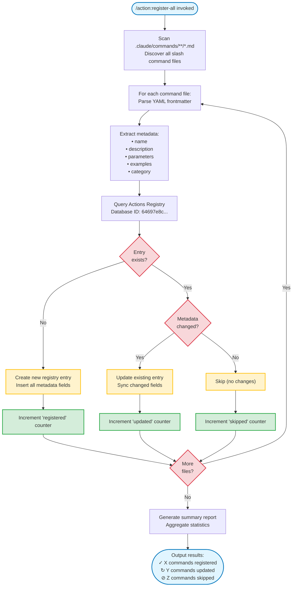

# Slash Commands Guide - Brookside BI Innovation Nexus

**Best for**: Organizations seeking to streamline innovation workflows through structured, repeatable operations that drive measurable outcomes. This guide establishes sustainable command patterns for managing ideas, research, builds, costs, and knowledge at scale.

## Overview

Slash commands provide executable shortcuts for common innovation management tasks. This solution is designed to reduce cognitive load and ensure consistency across team interactions with the Notion-based innovation system.

**Command Scope Architecture**:
- **Project Commands**: `.claude/commands/` (shared, version-controlled)
- **User Commands**: `~/.claude/commands/` (personal preferences)

## Command Structure Standards

### Frontmatter Template

```yaml
---
description: Concise summary (appears in /help) focusing on business outcome
allowed-tools: Tool1(pattern:*), Tool2(pattern:*)
argument-hint: [param1] [param2] [optional-param]
model: claude-sonnet-4-5-20250929
---
```

**Frontmatter Best Practices**:
- `description`: Lead with business value, not technical action
  - ❌ "Creates an idea entry"
  - ✅ "Capture and structure new innovation opportunities"
- `allowed-tools`: Specify minimum required permissions (principle of least privilege)
- `argument-hint`: Show expected parameters for autocomplete guidance
- `model`: Pin critical workflows to specific models for consistency

### Command Body Structure

```markdown
---
description: Business-focused summary
---

## Context
[1-2 sentences: What business problem this solves]

## Workflow
[Step-by-step procedure that Claude will execute]

1. **Search for existing content** to avoid duplicates
   - Query: $ARGUMENTS or derived search terms
   - Verify no similar entries exist in [Database Name]

2. **Fetch related context** to understand current structure
   - Related items: [specific relations to check]
   - Cost implications: [software/tools involved]

3. **Execute operation** with proper linking
   - Required fields: [list with defaults]
   - Relations: [database connections]
   - Status: [default state]

4. **Verify and report** outcomes to user
   - Confirmation message format: "[Action] '[Name]' [outcome]. [Next steps]"
   - Cost impact: Display if relevant
   - Suggested follow-ups: [related commands or actions]

## Parameters

- `$ARGUMENTS`: [Description of expected input format]
- `$1`: [First positional argument if using granular access]
- `$2`: [Second positional argument]

## Examples

```
/command-name basic usage
/command-name with multiple parameters
/command-name "quoted parameter with spaces"
```

## Related Commands

- `/related-command-1` - [When to use]
- `/related-command-2` - [When to use]

## Verification Steps

[Commands to verify successful execution]
- Check: [validation query]
- Expected: [expected outcome]
```

## Parameter Passing Conventions

### Using `$ARGUMENTS` (Recommended for Simple Commands)

**Best for**: Single-parameter commands or when treating all input as a cohesive unit.

```markdown
---
description: Capture new innovation opportunity with viability assessment
argument-hint: [idea description]
---

Search Ideas Registry for similar concepts to "$ARGUMENTS"

If no duplicates found, create new idea:
- Title: $ARGUMENTS
- Status: Concept
- Viability: Needs Research
```

**Usage**: `/new-idea Automated cost tracking dashboard for software spend`

### Using Positional Parameters (Advanced)

**Best for**: Commands requiring multiple distinct inputs with specific handling.

```markdown
---
description: Assign research task to team member with priority
argument-hint: [research-title] [assignee] [priority]
---

Create Research Hub entry:
- Topic: $1
- Researchers: $2
- Priority: ${3:-medium}  # Default to "medium" if not provided

Search for related ideas matching "$1"
```

**Usage**: `/assign-research "AI governance frameworks" "Markus Ahling" high`

### Default Values Pattern

```markdown
Priority: ${1:-medium}
Status: ${2:-Concept}
Viability: ${3:-Needs Research}
```

**Syntax**: `${position:-default_value}`

## Integration with `.claude/agents/`

### Agent Invocation Pattern

Commands should delegate complex operations to specialized agents while maintaining workflow clarity.

```markdown
---
description: Comprehensive cost analysis with optimization recommendations
allowed-tools: SlashCommand(*)
---

Invoke the @cost-analyst agent to:

1. Query Software Tracker for active subscriptions
2. Calculate total monthly spend and annual projection
3. Identify top 5 most expensive tools
4. Find unused software (no active relations to Ideas/Research/Builds)
5. Check for expiring contracts within 60 days
6. Generate consolidation opportunities report

Present findings with:
- Total spend breakdown (monthly/annual)
- Optimization opportunities ranked by potential savings
- Action items for cost reduction

Expected output format:
```
Total Monthly Spend: $X,XXX
Annual Projection: $XX,XXX

Top Expenses:
1. [Software]: $X,XXX/month ([N] licenses)
2. [Software]: $XXX/month ([N] licenses)
...

Optimization Opportunities:
- [Specific recommendation]: Save $XXX/month
- [Unused tool]: Consider cancellation ($XXX/month)
...
```
```

**Integration Best Practices**:
- **Explicit agent mentions**: Use `@agent-name` syntax to invoke specialized agents
- **Clear delegation**: Specify what the agent should do, not how
- **Outcome expectations**: Define output format for consistency
- **Context passing**: Use `$ARGUMENTS` to provide agent-specific context

### Command-to-Agent Mapping

| Command Category | Delegates To | When To Use |
|-----------------|-------------|-------------|
| `/new-idea` | `@ideas-capture` | Capture innovation opportunities |
| `/start-research` | `@research-coordinator` | Begin feasibility investigation |
| `/create-build` | `@build-architect` | Structure new example/prototype |
| `/analyze-costs` | `@cost-analyst` | Financial analysis and optimization |
| `/archive` | `@archive-manager` | Complete work lifecycle |
| `/document-learning` | `@knowledge-curator` | Capture and archive insights |
| `/integrate` | `@integration-specialist` | Microsoft ecosystem connections |
| `/assess-viability` | `@viability-assessor` | Evaluate feasibility |
| `/assign` | `@workflow-router` | Route work to team members |

## Actions Registry META System

**Best for**: Ensuring command discoverability after adding new slash commands to `.claude/commands/` or validating command inventory accuracy across team environments.

### Bootstrap Process Flow

The Actions Registry bootstrap architecture establishes automated synchronization between command files and the Notion database through systematic discovery, parsing, and intelligent deduplication.



*Figure 1: Actions Registry bootstrap process showing command file scanning, frontmatter parsing, duplicate checking, and Notion database registration workflow with create, update, and skip paths.*

**Key Phases**:
1. **Discovery**: Recursive scan of `.claude/commands/` directory
2. **Parsing**: YAML frontmatter extraction with schema validation
3. **Comparison**: Intelligent duplicate detection and change tracking
4. **Registration**: Conditional create/update/skip operations
5. **Reporting**: Statistical summary with actionable metrics

### Overview

The Actions Registry establishes self-documenting infrastructure for the Innovation Nexus slash command ecosystem. This META system automatically discovers, catalogs, and maintains a centralized Notion database of all available commands, enabling team members to find commands through semantic search and usage examples.

**Business Impact**: Streamline command discovery workflows and eliminate undocumented commands through automated registration that drives measurable improvements in team productivity and knowledge transfer.

### The `/action:register-all` Command

**Workflow**:
1. **Scan** - Recursively discovers all `.md` files in `.claude/commands/`
2. **Parse** - Extracts frontmatter YAML metadata (name, description, parameters)
3. **Check** - Queries Actions Registry for existing entries to prevent duplicates
4. **Register** - Creates new entries for unregistered commands
5. **Update** - Refreshes metadata for commands with changed definitions
6. **Report** - Generates summary with coverage statistics by category

**Usage Examples**:

```bash
# Register all commands (standard workflow)
/action:register-all

# Preview without creating entries (validation mode)
/action:register-all --dry-run

# Register only cost commands (category filter)
/action:register-all --category=cost

# Force update all entries even if unchanged
/action:register-all --force-update
```

**Expected Output**:
```
✅ Actions Registry Bootstrap Complete

Total Commands Discovered: 51
Pre-existing Entries: 25
New Registrations: 18
Updated Entries: 8
Skipped (unchanged): 0

Coverage by Category:
- Cost: 14/14 (100%)
- Innovation: 4/4 (100%)
- Agent Activity: 5/5 (100%)
- Style Testing: 3/3 (100%)
- Team: 2/2 (100%)
- Knowledge: 2/2 (100%)
- Autonomous: 2/2 (100%)

Actions Registry: https://notion.so/64697e8c-0d51-4c10-b6ee-a6f643f0fc1c
```

### When to Use

**Trigger `/action:register-all` when**:
- ✅ New command files added to `.claude/commands/`
- ✅ Command frontmatter metadata updated (description, parameters)
- ✅ Onboarding new team members (validate command inventory)
- ✅ Quarterly audits to ensure documentation accuracy
- ✅ After repository updates that may include new commands
- ✅ When commands aren't appearing in autocomplete suggestions

### Troubleshooting Command Discovery

**Problem**: Command not showing in autocomplete

**Solution**:
1. Verify file exists: `.claude/commands/category/name.md`
2. Check frontmatter includes `description` field
3. Run `/action:register-all` to register new command
4. Restart Claude Code to reload command definitions

**Problem**: Actions Registry shows "Coming soon" for implemented command

**Solution**:
1. Run `/action:register-all --force-update` to refresh all entries
2. Verify command file has proper frontmatter metadata
3. Check Actions Registry entry was updated (Last Updated timestamp)

**Problem**: Command registered but parameters not documented

**Solution**:
1. Add `argument-hint` to command frontmatter
2. Run `/action:register-all --force-update`
3. Verify Parameters field populated in Actions Registry entry

## Namespacing Strategy

### Directory Structure

```
.claude/commands/
├── innovation/
│   ├── new-idea.md           → /innovation:new-idea
│   ├── start-research.md     → /innovation:start-research
│   └── create-build.md       → /innovation:create-build
├── cost/
│   ├── analyze.md            → /cost:analyze
│   ├── add-software.md       → /cost:add-software
│   └── optimize.md           → /cost:optimize
├── knowledge/
│   ├── archive.md            → /knowledge:archive
│   └── document.md           → /knowledge:document
├── team/
│   ├── assign.md             → /team:assign
│   └── workload.md           → /team:workload
└── notion/
    ├── search.md             → /notion:search
    └── sync-databases.md     → /notion:sync-databases
```

**Naming Conventions**:
- Use kebab-case for filenames: `new-idea.md`, `analyze-costs.md`
- Namespace by functional area: `innovation/`, `cost/`, `knowledge/`
- Keep names action-oriented: `create`, `analyze`, `assign`, not `thing` or `manager`

### Flat vs Nested Trade-offs

**Use Flat Structure** (`.claude/commands/command-name.md`) when:
- Total commands < 10
- All commands serve similar scope
- Team prefers simplicity over organization

**Use Nested Structure** (`.claude/commands/category/command.md`) when:
- Total commands > 10
- Clear functional categories exist (innovation, cost, team, etc.)
- Multiple team members contribute commands
- Scaling to 20+ commands anticipated

**Recommendation for Brookside BI Innovation Nexus**: Use nested structure from the start to establish scalable patterns that support growth.

## Common Patterns for Innovation Workflows

### Pattern 1: Search-Before-Create

**Purpose**: Prevent duplicate work by always searching existing content first.

```markdown
1. **Search existing content** in [Database]
   - Query: Extract key terms from "$ARGUMENTS"
   - Databases to check: [Ideas Registry, Research Hub, etc.]
   - If duplicates found: Present matches to user, ask to proceed or link instead

2. **Verify relations** that may indicate related work
   - Check: Software Tracker for mentioned tools
   - Check: Team assignments for workload distribution

3. **Proceed with creation** only after user confirmation
```

### Pattern 2: Cost-Aware Operations

**Purpose**: Maintain cost transparency in all software-related operations.

```markdown
1. **Identify software/tools** mentioned in request
   - Extract: Tool names from $ARGUMENTS
   - Search: Software Tracker for existing entries

2. **Calculate cost impact** before creating relations
   - If new software: Prompt for cost, license count
   - If existing: Fetch current cost data
   - Display: "This will add $X/month to costs" or "Already tracking: $X/month"

3. **Create proper relations** to enable cost rollups
   - Link: All identified software to new entry
   - Verify: Rollup formulas display correctly
```

### Pattern 3: Lifecycle-Aware Status Management

**Purpose**: Guide items through proper innovation lifecycle stages.

```markdown
1. **Detect current lifecycle stage** based on context
   - Idea → Research: Viability = "Needs Research"
   - Research → Build: Next Steps = "Build Example"
   - Build → Archive: Status = "Completed"

2. **Update status fields** to reflect new stage
   - From: [Current Status]
   - To: [New Status]
   - Trigger: Related database creations (e.g., Research entry from Idea)

3. **Create knowledge artifacts** at completion
   - Check: Are lessons learned documented?
   - Suggest: Knowledge Vault entry if valuable
   - Preserve: All links (GitHub, Azure, SharePoint)
```

### Pattern 4: Team-Aware Assignments

**Purpose**: Route work to appropriate team members based on specialization.

```markdown
1. **Analyze work nature** from request content
   - Keywords: Extract technology, domain, function from $ARGUMENTS
   - Categories: Engineering, Operations, Sales, DevOps, ML, etc.

2. **Match to team specializations**
   - Markus Ahling: Engineering, Operations, AI, Infrastructure
   - Brad Wright: Sales, Business, Finance, Marketing
   - Stephan Densby: Operations, Continuous Improvement, Research
   - Alec Fielding: DevOps, Engineering, Security, Integrations, R&D
   - Mitch Bisbee: DevOps, Engineering, ML, Master Data, Quality

3. **Assign champion** with verification
   - Recommended: [Team Member] based on [specialization match]
   - Check workload: Query active items assigned to this person
   - Alert if overloaded: Suggest redistribution
```

### Pattern 5: Microsoft Ecosystem Priority

**Purpose**: Consistently prioritize Microsoft solutions per architectural standards.

```markdown
1. **Identify integration needs** from request
   - Required capabilities: [extracted from $ARGUMENTS]
   - Existing infrastructure: [Azure, M365, Power Platform, GitHub]

2. **Search Microsoft offerings first**
   - Priority order:
     1. Microsoft 365 Suite (Teams, SharePoint, OneNote, Outlook)
     2. Azure Services (OpenAI, Functions, SQL, DevOps)
     3. Power Platform (BI, Automate, Apps)
     4. GitHub Enterprise
     5. Third-party only if Microsoft doesn't offer solution

3. **Document integration approach**
   - Service: [Microsoft service name]
   - Authentication: Azure AD / Service Principal / Managed Identity
   - Security Review: Required for API/Webhook integrations
   - Cost: Link to Software Tracker entry
```

## Command Templates

### Template: Innovation Capture Command

**File**: `.claude/commands/innovation/new-idea.md`

```markdown
---
description: Capture and structure new innovation opportunity with viability assessment
allowed-tools: SlashCommand(@ideas-capture:*)
argument-hint: [idea description]
model: claude-sonnet-4-5-20250929
---

## Context
Streamline the process of capturing innovation opportunities while ensuring duplicate prevention, cost awareness, and proper team assignment.

## Workflow

Invoke @ideas-capture agent to execute this workflow:

1. **Search for existing similar ideas** in Ideas Registry
   - Query: Extract key concepts from "$ARGUMENTS"
   - If duplicates found: Present to user, ask to proceed or link to existing

2. **Create Ideas Registry entry** if no duplicates:
   - Title: $ARGUMENTS
   - Status: Concept (default)
   - Viability: Needs Research (will be assessed)
   - Innovation Type: [Infer from description: Process Improvement / Technical / Business Model / Product]
   - Champion: [Assign based on team specializations]
   - Effort: [Estimate: XS / S / M / L / XL]
   - Impact Score: [Rate 1-10 based on description]

3. **Link related software** from Software Tracker
   - Identify: Tools/platforms mentioned in description
   - Search: Software Tracker for existing entries
   - Link: Create relations to Ideas Registry
   - Display: Estimated monthly cost from rollup

4. **Check for research needs**
   - Ask: "Does this idea need research before building?"
   - If yes: Offer to run `/innovation:start-research`
   - If no: Offer to run `/innovation:create-build`

5. **Report creation confirmation**
   - Format: "Created idea '[$ARGUMENTS]' with [Champion] as champion. Estimated cost: $X/month. Viability: [Assessment]. Next step: [Research/Build]?"

## Parameters

- `$ARGUMENTS`: Full idea description (title and details)

## Examples

```
/innovation:new-idea Automated Power BI deployment pipeline using Azure DevOps
/innovation:new-idea Real-time cost tracking dashboard for all Microsoft subscriptions
/innovation:new-idea AI-powered documentation generator from code comments
```

## Related Commands

- `/innovation:start-research` - Begin feasibility investigation for idea
- `/innovation:create-build` - Create prototype/example directly
- `/cost:add-software` - Add new software tool to tracker

## Verification Steps

```
# Verify idea was created
/notion:search "$ARGUMENTS"

# Check cost rollup
# View Ideas Registry entry, verify "Estimated Cost" rollup displays
```
```

### Template: Cost Analysis Command

**File**: `.claude/commands/cost/analyze.md`

```markdown
---
description: Comprehensive software spend analysis with optimization recommendations
allowed-tools: SlashCommand(@cost-analyst:*)
argument-hint: [scope: all|active|unused|expiring]
model: claude-sonnet-4-5-20250929
---

## Context
Drive measurable cost outcomes through structured analysis of software spend, identifying optimization opportunities and tracking contract renewals.

## Workflow

Invoke @cost-analyst agent to execute comprehensive cost analysis:

1. **Query Software Tracker** based on scope parameter
   - Scope: ${1:-all}  # Default to "all" if not specified
   - Filters:
     - `all`: All software entries
     - `active`: Status = "Active"
     - `unused`: Status = "Active" AND no relations to Ideas/Research/Builds
     - `expiring`: Contract End Date within 60 days AND Status = "Active"

2. **Calculate spending metrics**
   - Total Monthly Spend: SUM(Total Monthly Cost where Status = "Active")
   - Annual Projection: Total Monthly Spend × 12
   - Top 5 Expenses: Sort by Total Monthly Cost DESC, limit 5
   - Category Breakdown: Group by Category, sum Total Monthly Cost

3. **Identify optimization opportunities**
   - Unused tools: Software with zero active relations
   - Duplicate capabilities: Multiple tools in same category
   - Overprovisioned licenses: License Count > Users count
   - Trial software: Status = "Trial" for > 30 days

4. **Check expiring contracts**
   - Query: Contract End Date between now and +60 days
   - Sort: By Contract End Date ASC
   - Alert: Flag renewals requiring decisions

5. **Generate recommendations report**
   - Prioritize by potential savings (high to low)
   - Include: Action items, responsible owner, estimated savings
   - Format: Structured markdown with cost breakdowns

6. **Present findings**

```
## Software Spend Analysis - [Date]

**Total Monthly Spend**: $X,XXX
**Annual Projection**: $XX,XXX

### Top 5 Expenses
1. [Software Name] - $X,XXX/month ([N] licenses) - [Category]
2. [Software Name] - $XXX/month ([N] licenses) - [Category]
...

### Category Breakdown
- Development: $X,XXX/month ([N] tools)
- Infrastructure: $X,XXX/month ([N] tools)
- Productivity: $XXX/month ([N] tools)
...

### Optimization Opportunities (Potential Savings: $X,XXX/month)

#### Unused Software
- [Tool Name]: $XXX/month - No active links to Ideas/Research/Builds
  - Action: Review with [Owner], consider cancellation
  - Savings: $XXX/month

#### Duplicate Capabilities
- [Category]: [N] tools serving similar purpose
  - Tools: [Tool A] ($X/month), [Tool B] ($Y/month)
  - Action: Evaluate consolidation to single platform
  - Savings: $XXX/month

#### Overprovisioned Licenses
- [Tool Name]: [N] licenses, [M] users (Excess: [N-M])
  - Action: Reduce license count or expand usage
  - Savings: $XXX/month

### Expiring Contracts (Next 60 Days)
- [Software Name] - Expires [Date] - $XXX/month
  - Owner: [Name]
  - Action Required: Renewal decision by [Date-14 days]
```

## Parameters

- `$1`: Analysis scope (all | active | unused | expiring) - Default: all

## Examples

```
/cost:analyze
/cost:analyze active
/cost:analyze unused
/cost:analyze expiring
```

## Related Commands

- `/cost:add-software` - Add new software entry to tracker
- `/cost:optimize` - Interactive cost reduction workflow
- `/notion:search` - Search for specific software entries

## Verification Steps

```
# Verify total spend calculation
# Check Software Tracker → Status = "Active" → Sum "Total Monthly Cost"

# Verify unused software detection
# For each flagged tool, check Ideas/Research/Builds relations = 0
```
```

### Template: Research Initiation Command

**File**: `.claude/commands/innovation/start-research.md`

```markdown
---
description: Begin structured feasibility investigation with hypothesis and methodology
allowed-tools: SlashCommand(@research-coordinator:*)
argument-hint: [research topic] [originating-idea-title]
model: claude-sonnet-4-5-20250929
---

## Context
Establish structured research approaches to assess innovation viability before committing to build efforts, ensuring sustainable decision-making.

## Workflow

Invoke @research-coordinator agent to structure research initiative:

1. **Search for existing research** on similar topics
   - Query: Extract key terms from "$1" (research topic)
   - Database: Research Hub
   - If duplicates: Present to user, offer to link instead of creating new

2. **Locate originating idea** if provided
   - Search: Ideas Registry for "$2" (idea title)
   - Verify: Idea exists and is in appropriate state (Viability = "Needs Research")
   - If not found: Ask user to provide Notion page URL

3. **Create Research Hub entry**
   - Topic: $1
   - Status: Active
   - Hypothesis: [Prompt user to provide clear hypothesis statement]
   - Methodology: [Prompt user to describe research approach]
   - Researchers: [Assign based on topic specialization]
   - Link to Origin Idea: [Relation to Ideas Registry entry]
   - Expected Completion: [Ask user for target timeframe, if any]

4. **Link software/tools** being used for research
   - Identify: Tools mentioned in methodology
   - Search: Software Tracker
   - Create relations: Link all identified tools
   - Display: "Research cost: $X/month from [N] tools"

5. **Set up documentation infrastructure**
   - SharePoint: Create or link to research document library
   - OneNote: Create or link to research notebook
   - Teams: Suggest creating channel for collaboration (optional)
   - Store links in Research Hub entry

6. **Update originating idea status**
   - If linked to idea: Update Idea status to "Active"
   - Add note: "Research initiated: [Research Hub entry link]"

7. **Provide research guidance**
   - Remind about key outputs:
     - Key Findings (to be documented)
     - Viability Assessment (Highly Viable | Moderately Viable | Not Viable | Inconclusive)
     - Next Steps (Build Example | More Research | Archive | Abandon)
   - Suggest: Regular check-ins, documentation in SharePoint/OneNote

8. **Report creation confirmation**
   - Format: "Research '[Topic]' initiated. Researchers: [Names]. Origin Idea: [Link]. Documentation: [SharePoint/OneNote links]. Estimated research cost: $X/month."

## Parameters

- `$1`: Research topic/title
- `$2`: (Optional) Originating idea title for automatic linking

## Examples

```
/innovation:start-research "Azure OpenAI integration patterns for Power BI" "AI-powered BI insights"
/innovation:start-research "Cost optimization strategies for Microsoft 365"
/innovation:start-research "Notion API automation capabilities"
```

## Related Commands

- `/innovation:new-idea` - Create idea that may need research
- `/innovation:create-build` - Create example build from research findings
- `/knowledge:document` - Archive research findings to Knowledge Vault

## Verification Steps

```
# Verify research entry created
/notion:search "$1"

# Check relation to idea
# View Research Hub entry → Verify "Origin Idea" relation exists

# Verify cost rollup
# View Research Hub entry → Verify "Estimated Cost" displays from software links
```
```

### Template: Build Creation Command

**File**: `.claude/commands/innovation/create-build.md`

```markdown
---
description: Structure new example build with architecture documentation and cost tracking
allowed-tools: SlashCommand(@build-architect:*)
argument-hint: [build name] [build type: prototype|poc|demo|mvp|reference]
model: claude-sonnet-4-5-20250929
---

## Context
Streamline the creation of example builds with structured technical documentation designed for AI-agent execution, ensuring sustainable knowledge capture and cost transparency.

## Workflow

Invoke @build-architect agent to structure example build:

1. **Search for existing builds** to prevent duplicates
   - Query: Extract key terms from "$1" (build name)
   - Database: Example Builds
   - If similar builds exist: Present to user, check reusability potential

2. **Determine build type** and scope
   - Type: ${2:-prototype}  # Default to "prototype"
   - Options: prototype | poc | demo | mvp | reference
   - Validate: Build type matches project goals

3. **Locate origin idea and related research**
   - Search Ideas Registry: Find originating idea
   - Search Research Hub: Find related research (if exists)
   - If not found: Ask user to provide Notion page URLs or skip

4. **Create Example Build entry**
   - Name: $1
   - Status: Active
   - Build Type: $2 (or default: prototype)
   - Link to Origin Idea: [Relation to Ideas Registry]
   - Link to Related Research: [Relation to Research Hub, if exists]
   - Lead Builder: [Assign based on technical specialization]
   - Core Team: [Additional team members, if needed]
   - Viability: Needs Work (default for new builds)
   - Reusability: [To be assessed after completion]

5. **Request GitHub repository information**
   - Ask: "Provide GitHub repository URL for this build"
   - Store: GitHub URL field
   - Verify: Repository is accessible under github.com/brookside-bi org

6. **Link ALL software/tools** being used
   - Prompt: "List all software, tools, platforms, and services this build uses"
   - Search: Software Tracker for each mentioned tool
   - Create new entries: If software not found in tracker
   - Create relations: Link all to Example Build
   - Calculate: Total Cost rollup from linked software

7. **Create technical documentation page**
   - Create nested page under Example Build entry
   - Title: "Technical Specification - [$1]"
   - Template structure:

```markdown
# [Build Name] - Technical Specification

## Executive Summary
[One paragraph: What it does, why it exists, current status]

## System Architecture

### High-Level Overview
- Component diagram (ASCII or described)
- Data flow description
- Integration points with Microsoft ecosystem

### Technology Stack
- Language/Framework: [Specific version]
- Database: [Specific service/version]
- Hosting: [Azure service, region, SKU]
- APIs: [Internal/external dependencies]

## API Specification
[If applicable - document all endpoints with request/response schemas]

## Data Models
[Use TypeScript interfaces or JSON schemas for clarity]

## Configuration

### Environment Variables
```bash
# Required
[List all required env vars with descriptions]

# Optional
[List optional configuration]
```

### Azure Resources
- Resource Group: [Name]
- Service names and IDs
- Managed identities
- Key Vault references

## Setup Instructions (AI Agent Friendly)

### Prerequisites
```bash
# Explicit version requirements
[Tool] >= [Version]
```

### Installation
```bash
# Step-by-step, no assumptions
git clone [repo_url]
cd [project_name]
[Install dependencies]
```

### Configuration
```bash
# Copy and fill environment template
cp .env.example .env
# Variables stored in Azure Key Vault: [vault_name]
```

### Run Locally
```bash
[Start command]
# Should start on http://localhost:[port]
# Verify with: [health check command]
```

### Deploy to Azure
```bash
# Deployment commands
az login
az account set --subscription [subscription_id]
[Deployment script/commands]
```

## Testing

### Unit Tests
```bash
[Test command]
# Expected: [Success criteria]
```

### Integration Tests
```bash
[Integration test command]
# Tests actual Azure services
```

## Cost Breakdown
[Pulled from Software Tracker relations]
- Service 1: $X/month
- Service 2: $Y/month
- **Total**: $Z/month

## Related Resources
- Origin Idea: [Link]
- Research: [Link]
- GitHub: [Repo URL]
- Azure DevOps: [Board/Pipeline URL]
- Teams Channel: [Link]
```

8. **Set up integration links**
   - Azure DevOps: Ask for board/pipeline URL
   - Teams Channel: Suggest creating dedicated channel
   - SharePoint: Link to documentation library
   - Store all in Example Build entry

9. **Display cost impact**
   - Calculate: Total monthly cost from software relations
   - Format: "This build uses [N] tools totaling $X/month"
   - Top expenses: List top 3 most expensive tools

10. **Report creation confirmation**
    - Format: "Build '[$1]' created. Lead: [Name]. Type: [$2]. GitHub: [URL]. Total cost: $X/month. Status: Active."
    - Next steps: "Begin development and update technical documentation as architecture evolves."

## Parameters

- `$1`: Build name/title
- `$2`: Build type (prototype | poc | demo | mvp | reference) - Default: prototype

## Examples

```
/innovation:create-build "Power BI deployment automation" poc
/innovation:create-build "Cost tracking dashboard" mvp
/innovation:create-build "Notion API integration library" reference
```

## Related Commands

- `/innovation:new-idea` - Create originating idea
- `/innovation:start-research` - Research feasibility before building
- `/cost:add-software` - Add tools being used in build
- `/knowledge:document` - Archive build learnings when complete

## Verification Steps

```
# Verify build entry created
/notion:search "$1"

# Check GitHub link
# View Example Builds entry → Verify GitHub URL is populated

# Verify cost rollup
# View Example Builds entry → Check "Total Cost" rollup displays

# Confirm technical documentation exists
# Navigate to Example Builds entry → Verify nested "Technical Specification" page exists
```
```

### Template: Archive Command

**File**: `.claude/commands/knowledge/archive.md`

```markdown
---
description: Complete work lifecycle with learnings documentation and knowledge preservation
allowed-tools: SlashCommand(@archive-manager:*), SlashCommand(@knowledge-curator:*)
argument-hint: [item-name] [database: idea|research|build]
model: claude-sonnet-4-5-20250929
---

## Context
Build sustainable practices by ensuring completed work transitions properly to archived state with documented learnings preserved for future reference.

## Workflow

Invoke @archive-manager and @knowledge-curator agents to complete lifecycle:

1. **Locate item to archive**
   - Item name: "$1"
   - Database: ${2:-build}  # Default to "build"
   - Options: idea | research | build
   - Search: Appropriate database for exact or fuzzy match
   - If multiple matches: Present to user for selection

2. **Verify learnings are documented**
   - Check required completion fields based on database:
     - **Ideas**: Final viability assessment recorded?
     - **Research**: Key findings and viability assessment completed?
     - **Builds**: Lessons learned captured? Post-mortem documented?
   - If missing: Prompt user to provide before archiving

3. **Assess Knowledge Vault worthiness**
   - Criteria for archiving to Knowledge Vault:
     - Reusable patterns or templates created
     - Novel problems solved with documented solutions
     - Failed experiments with valuable learnings
     - Process improvements that could benefit future work
   - Ask user: "Should we create Knowledge Vault entry for this?"

4. **Create Knowledge Vault entry** (if approved)
   - Invoke @knowledge-curator agent
   - Content Type: [Post-Mortem | Case Study | Technical Doc | Process | Template | Reference]
   - Evergreen/Dated: [Assess longevity of content]
   - Link to archived item: [Relation to original database entry]
   - Key Learnings: [Extract from item documentation]
   - Reusable Artifacts: [Link to GitHub repos, templates, documents]

5. **Update item status to archived**
   - Status: Archived (for Ideas/Knowledge) or Not Active (for Research/Builds)
   - Archive Date: [Today's date]
   - Add note: "Archived on [Date]. Learnings captured in Knowledge Vault: [Link]"

6. **Verify link preservation**
   - Check all external links still accessible:
     - GitHub repositories: URLs valid and repos not deleted
     - SharePoint/OneNote: Document locations recorded
     - Azure resources: DevOps boards, deployed services documented
     - Teams channels: Links preserved
   - Software/tool relations: Maintained for historical cost tracking

7. **Update dependent items**
   - Ideas with no active research/builds: Update status to "Not Active"
   - Research with completed builds: Update status to "Completed"
   - Notify: Users watching or assigned to item

8. **Generate archive report**

```
## Archive Summary: [$1]

**Archived**: [Date]
**Original Status**: [Previous status] → **New Status**: [Archived/Not Active]
**Database**: [Ideas Registry | Research Hub | Example Builds]

### Key Information Preserved
- Links: [GitHub | SharePoint | Teams | Azure DevOps]
- Cost Data: $X/month ([N] tools tracked)
- Team Members: [Names]
- Duration: [Start date] to [End date]

### Learnings Documented
[Yes/No - If yes, link to Knowledge Vault entry]

### Knowledge Vault Entry
**Title**: [Entry name if created]
**Type**: [Content type]
**Link**: [Notion page URL]
**Reusability**: [Assessment]

### Next Steps
- [Recommendations for similar future work]
- [Related active items to consider]
```

## Parameters

- `$1`: Item name/title to archive
- `$2`: Database type (idea | research | build) - Default: build

## Examples

```
/knowledge:archive "AI-powered documentation generator" build
/knowledge:archive "Azure OpenAI integration research" research
/knowledge:archive "Real-time cost dashboard" idea
```

## Related Commands

- `/knowledge:document` - Create Knowledge Vault entry manually
- `/notion:search` - Find items to archive
- `/cost:analyze` - Review costs before archiving builds

## Verification Steps

```
# Verify status updated
/notion:search "$1"
# Check: Status = "Archived" or "Not Active"

# Confirm Knowledge Vault entry created
/notion:search "Knowledge Vault"
# Search for: "$1" in Knowledge Vault database

# Check link preservation
# View archived item → Verify all URLs still populated
```
```

### Template: Team Assignment Command

**File**: `.claude/commands/team/assign.md`

```markdown
---
description: Route work to appropriate team member based on specialization and workload
allowed-tools: SlashCommand(@workflow-router:*)
argument-hint: [work-description] [database: idea|research|build]
model: claude-sonnet-4-5-20250929
---

## Context
Drive measurable outcomes through strategic team alignment, ensuring work is assigned to members with appropriate expertise while balancing workload distribution.

## Workflow

Invoke @workflow-router agent to analyze and assign work:

1. **Analyze work nature** from description
   - Input: "$1" (work description)
   - Extract keywords: Technology, domain, function
   - Categorize: Engineering | Operations | Sales | Business | DevOps | ML | AI | Infrastructure | Security | Research | Finance | Marketing

2. **Match to team specializations**

**Team Member Expertise**:
- **Markus Ahling**: Engineering, Operations, AI, Infrastructure
- **Brad Wright**: Sales, Business, Finance, Marketing
- **Stephan Densby**: Operations, Continuous Improvement, Research
- **Alec Fielding**: DevOps, Engineering, Security, Integrations, R&D, Infrastructure
- **Mitch Bisbee**: DevOps, Engineering, ML, Master Data, Quality

**Matching Logic**:
   - Primary match: Strongest specialization alignment
   - Secondary match: Adjacent skill areas
   - Multi-person: If work requires multiple specializations

3. **Check current workload** for recommended assignee(s)
   - Query: Count active items by assignee
     - Ideas: Status = "Active" AND Champion = [Person]
     - Research: Status = "Active" AND Researchers contains [Person]
     - Builds: Status = "Active" AND (Lead Builder = [Person] OR Core Team contains [Person])
   - Calculate: Total active items per person
   - Threshold: Flag if person has > 5 active items

4. **Generate assignment recommendation**
   - Recommended Champion/Lead: [Name]
   - Rationale: [Specialization match explanation]
   - Workload: [N] active items (⚠️ if > 5)
   - Alternative: [Name] if primary is overloaded
   - Supporting Team: [Names] if multi-person work

5. **Locate and update item** if database specified
   - Database: ${2:-none}  # Optional parameter
   - Search: "$1" in specified database
   - Update: Champion/Lead Builder/Researchers field
   - Notify: Assigned person(s)

6. **Report assignment**

```
## Team Assignment Recommendation

**Work**: $1
**Type**: [Inferred category]

### Recommended Assignment
**Primary**: [Name]
- **Specializations**: [Matching areas]
- **Current Workload**: [N] active items
- **Rationale**: [Why this person is best fit]

**Supporting Team** (if applicable):
- [Name]: [Role/reason]
- [Name]: [Role/reason]

### Alternative Options
**If primary overloaded**:
- [Name]: [Specialization match, workload]

### Workload Overview
- Markus Ahling: [N] active
- Brad Wright: [N] active
- Stephan Densby: [N] active
- Alec Fielding: [N] active
- Mitch Bisbee: [N] active

⚠️ **Overloaded**: [Names with > 5 active items]
```

## Parameters

- `$1`: Work description (title or detailed description)
- `$2`: (Optional) Database type to update (idea | research | build)

## Examples

```
/team:assign "Azure OpenAI integration with Power BI for real-time insights" build
/team:assign "Sales process optimization research" research
/team:assign "Cost reduction initiative for Microsoft 365 licenses"
/team:assign "Machine learning model for demand forecasting" idea
```

## Related Commands

- `/team:workload` - View current team workload distribution
- `/innovation:new-idea` - Create idea with automatic champion assignment
- `/innovation:start-research` - Create research with automatic researcher assignment

## Verification Steps

```
# Verify assignment if database was specified
/notion:search "$1"
# Check: Champion/Lead Builder/Researchers field populated

# Check workload distribution
# Query each database for Status = "Active", group by assignee
```
```

## Best Practices Summary

### DO: Effective Command Design

1. **Lead with business value** in descriptions
   - ✅ "Streamline innovation capture with duplicate prevention"
   - ❌ "Create idea entry"

2. **Always search before creating** to prevent duplicates
   - Every command that creates content must search first
   - Present matches to user, ask to proceed or link

3. **Maintain cost transparency** in all operations
   - Link software/tools to enable rollups
   - Display cost impact in confirmation messages

4. **Delegate to specialized agents** for complex workflows
   - Use `@agent-name` syntax explicitly
   - Define expected outcomes, not implementation details

5. **Provide clear verification steps** for command success
   - Include specific queries or checks
   - State expected outcomes

6. **Use consistent formatting** in confirmation messages
   - Format: "Action 'Item' outcome. Next steps?"
   - Include relevant metrics (cost, count, etc.)

7. **Structure for AI-agent execution**
   - Explicit, executable instructions
   - No ambiguity or assumed context
   - Idempotent operations where possible

8. **Include parameter hints** in frontmatter
   - Shows autocomplete guidance
   - Documents expected input format

### DON'T: Anti-Patterns to Avoid

1. **Don't skip duplicate checking**
   - ❌ Creating without searching first
   - ✅ Always search, present matches, ask to proceed

2. **Don't create without linking software/tools**
   - ❌ Build entry with no cost tracking
   - ✅ Link all tools, display total cost

3. **Don't use vague parameter descriptions**
   - ❌ `argument-hint: [input]`
   - ✅ `argument-hint: [idea description]`

4. **Don't hardcode values that should be dynamic**
   - ❌ `Champion: Markus Ahling`
   - ✅ `Champion: [Assign based on specialization]`

5. **Don't omit verification steps**
   - ❌ "Command complete" with no validation
   - ✅ Include specific checks to confirm success

6. **Don't create commands that duplicate agent capabilities**
   - ❌ `/detailed-cost-analysis` when `@cost-analyst` exists
   - ✅ `/cost:analyze` delegates to `@cost-analyst`

7. **Don't use technical jargon in descriptions**
   - ❌ "POST new entity to Notion DB via MCP"
   - ✅ "Capture new innovation opportunity in Ideas Registry"

8. **Don't forget Brookside BI brand voice**
   - ❌ "Add an idea"
   - ✅ "Establish structured innovation tracking"

## Integration Examples

### Example 1: Cost Management Workflow

User manages software expenses with comprehensive tracking:

```bash
# Add new software to cost tracker
/cost:add-software "Webflow" 74 --licenses=1 --category=Development

# Claude output:
# Added software 'Webflow'
# Cost: $74/month × 1 license = $74/month
# Annual: $888
# Category: Development
# This increases total spend to $3,524/month (+$74)

# Calculate budget impact of adding licenses
/cost:cost-impact ADD "GitHub Copilot" 10 --licenses=5

# Claude output:
# Cost Impact Analysis: ADD GitHub Copilot
#
# Current Cost: $10/month × 1 license = $10/month
# Proposed Change: Add 5 licenses
# New Cost: $10/month × 6 licenses = $60/month
# Monthly Impact: +$50/month
# Annual Impact: +$600/year
#
# Total Monthly Spend: $3,450 → $3,500 (+$50)
# Confirm addition? [yes/no]

# Remove software and show savings
/cost:cost-impact REMOVE "Old Tool" 150

# Claude output:
# Cost Impact Analysis: REMOVE Old Tool
#
# Current Cost: $150/month
# Proposed Change: Cancel subscription
# New Cost: $0/month
# Monthly Savings: -$150/month
# Annual Savings: -$1,800/year
#
# Total Monthly Spend: $3,500 → $3,350 (-$150)
# Confirm removal? [yes/no]
#
# ⚠️ Warning: This tool is linked to 2 active builds.
# Consider migrating dependencies before cancellation.
```

### Example 2: Chained Command Workflow

User executes series of commands for complete innovation lifecycle:

```bash
# 1. Capture initial idea
/innovation:new-idea Automated cost tracking dashboard for software spend

# Claude output:
# Created idea 'Automated cost tracking dashboard for software spend'
# Champion: Markus Ahling (Engineering, Infrastructure)
# Estimated cost: $0/month (no tools identified yet)
# Viability: Needs Research
# Next step: Research or build directly?

# 2. User decides to research first
/innovation:start-research "Cost tracking automation feasibility" "Automated cost tracking dashboard"

# Claude output:
# Research 'Cost tracking automation feasibility' initiated
# Researchers: Markus Ahling, Stephan Densby
# Origin Idea: [Link to idea]
# Documentation: [SharePoint link]
# Estimated research cost: $0/month

# 3. After research completes, user creates build
/innovation:create-build "Cost Dashboard MVP" mvp

# Claude output:
# Build 'Cost Dashboard MVP' created
# Lead: Markus Ahling
# Core Team: Alec Fielding (Azure integration)
# Type: mvp
# GitHub: [User provides URL]
# Total cost: $125/month (Power BI Pro, Azure SQL, App Service)
# Status: Active

# 4. Build completes, user archives
/knowledge:archive "Cost Dashboard MVP" build

# Claude output:
# Archive Summary: Cost Dashboard MVP
# Archived: 2025-10-21
# Status: Active → Not Active
# Knowledge Vault Entry: "Cost Tracking Dashboard Implementation - Case Study"
# Learnings: Dashboard reduced manual cost tracking from 4 hours/week to automated
# Reusability: Highly Reusable - Template for future dashboards
```

### Example 3: Actions Registry Discovery & Maintenance

User ensures command inventory is current and discoverable:

```bash
# 1. Register all commands to ensure catalog is up-to-date
/action:register-all

# Claude output:
# ✅ Actions Registry Bootstrap Complete
#
# Total Commands Discovered: 51
# Pre-existing Entries: 25
# New Registrations: 18
# Updated Entries: 8
# Skipped (unchanged): 0
#
# Coverage by Category:
# - Cost: 14/14 (100%)
# - Innovation: 4/4 (100%)
# - Agent Activity: 5/5 (100%)
# - Style Testing: 3/3 (100%)
# - Team: 2/2 (100%)
# - Knowledge: 2/2 (100%)
# - Autonomous: 2/2 (100%)
# - Repository: 3/3 (100%)
# - Documentation: 1/1 (100%)
#
# Actions Registry: https://notion.so/64697e8c-0d51-4c10-b6ee-a6f643f0fc1c

# 2. Preview changes before committing (validation mode)
/action:register-all --dry-run

# Claude output:
# 🔍 Actions Registry Dry Run (Preview Mode)
#
# Commands to Register: 18
# - /cost:monthly-spend
# - /cost:annual-projection
# - /innovation:project-plan
# - /autonomous:status
# ...
#
# Commands to Update: 8
# - /cost:analyze (description changed)
# - /team:assign (parameters added)
# ...
#
# No changes will be committed. Run without --dry-run to apply.

# 3. Register only cost-related commands after adding new category
/action:register-all --category=cost

# Claude output:
# ✅ Actions Registry Update - Cost Category
#
# Total Commands Discovered: 14
# Pre-existing Entries: 12
# New Registrations: 2
# Updated Entries: 0
# Skipped (unchanged): 12
#
# New Commands Registered:
# - /cost:microsoft-alternatives
# - /cost:license-optimization
#
# Coverage: Cost Category 14/14 (100%)

# 4. Force refresh all entries after metadata restructure
/action:register-all --force-update

# Claude output:
# ✅ Actions Registry Full Refresh
#
# Total Commands Discovered: 51
# All entries force-updated: 51
# Metadata refreshed for all commands
#
# This ensures parameter hints, descriptions, and related
# documentation links are synchronized with current command files.
```

### Example 4: Cost Optimization Workflow

User conducts quarterly cost review:

```bash
# 1. Comprehensive cost analysis
/cost:analyze

# Claude output:
# Total Monthly Spend: $3,450
# Annual Projection: $41,400
# Top 5 Expenses: [List with Power BI, Azure, GitHub, etc.]
# Optimization Opportunities: $850/month potential savings
# - Unused: Figma ($45/month, no active links)
# - Duplicate: 3 project management tools ($280/month)
# - Overprovisioned: GitHub licenses (15 seats, 8 users)

# 2. Check what's expiring soon
/cost:analyze expiring

# Claude output:
# Expiring Contracts (Next 60 Days):
# - Azure DevOps: Expires 2025-11-15 - $300/month
#   Owner: Alec Fielding
#   Action Required: Renewal decision by 2025-11-01

# 3. Add newly discovered software
/cost:add-software "Postman Team" 89 5

# Claude output:
# Added software 'Postman Team'
# Cost: $89/month × 5 licenses = $445/month
# Annual: $5,340
# Category: Development
# This increases total spend to $3,895/month (+$445)
```

### Example 5: Team Workload Balancing

User needs to assign new high-priority work:

```bash
# 1. Check who should handle ML project
/team:assign "Machine learning model for predictive maintenance using Azure ML"

# Claude output:
# Recommended Assignment
# Primary: Mitch Bisbee
# - Specializations: ML, Engineering, Quality
# - Current Workload: 3 active items
# - Rationale: ML expertise, Azure ML experience
#
# Supporting Team:
# - Alec Fielding: Azure infrastructure, DevOps pipeline
#
# ⚠️ Overloaded: Markus Ahling (7 active items)

# 2. View full team workload
/team:workload

# Claude output:
# Team Workload Distribution
# - Markus Ahling: 7 active (⚠️ Overloaded)
#   - 3 Ideas, 2 Research, 2 Builds
# - Brad Wright: 2 active
#   - 1 Idea, 1 Research
# - Stephan Densby: 4 active
#   - 2 Research, 2 Builds
# - Alec Fielding: 5 active
#   - 1 Idea, 1 Research, 3 Builds
# - Mitch Bisbee: 3 active
#   - 2 Builds, 1 Research
#
# Recommendation: Redistribute some of Markus's work or delay new assignments
```

## Maintenance and Evolution

### Command Versioning

When updating commands that may break existing workflows:

1. **Create new version** with suffix: `command-name-v2.md`
2. **Deprecate old version** with frontmatter:
   ```yaml
   ---
   description: [DEPRECATED] Use /command-name-v2 instead
   ---

   This command has been replaced by `/command-name-v2` which provides [improvements].

   Redirecting to new command...
   ```
3. **Document changes** in commit message with migration guide

### Command Discovery

Help users find commands with consistent patterns:

```markdown
## Related Commands

- `/category:command-name` - [When to use]
- `/category:other-command` - [When to use]

## See Also

- Agent: @agent-name for [use case]
- Documentation: [CLAUDE.md section]
```

### Testing Commands

Before committing new commands:

1. **Syntax validation**: Ensure frontmatter YAML is valid
2. **Parameter testing**: Test with all parameter variations
3. **Agent integration**: Verify agent invocations work
4. **Verification steps**: Confirm verification queries succeed
5. **Brand voice check**: Review for Brookside BI tone

## Command Reference Quick Guide

| Command | Purpose | Key Parameters |
|---------|---------|----------------|
| `/innovation:new-idea` | Capture innovation opportunity | [idea description] |
| `/innovation:start-research` | Begin feasibility investigation | [topic] [idea-title] |
| `/innovation:create-build` | Structure example/prototype | [name] [type] |
| `/cost:analyze` | Comprehensive spend analysis | [scope] |
| `/cost:add-software` | Add tool to tracker | [name] [cost] [licenses] |
| `/cost:cost-impact` | Budget impact analysis | [ADD\|REMOVE] [tool] [cost] |
| `/cost:monthly-spend` | Quick total monthly spend | - |
| `/cost:annual-projection` | Yearly forecast calculation | - |
| `/cost:microsoft-alternatives` | M365/Azure replacement options | [tool-name] |
| `/knowledge:archive` | Complete lifecycle with learnings | [item] [database] |
| `/knowledge:document` | Create Knowledge Vault entry | [topic] [type] |
| `/team:assign` | Route work to specialist | [description] [database] |
| `/team:workload` | View team distribution | - |
| `/action:register-all` | Sync command inventory to Notion | [--dry-run] [--category] |
| `/notion:search` | Find content across databases | [query] |

---

**Best for**: Organizations scaling innovation management across teams, seeking to establish sustainable, repeatable workflows that drive measurable outcomes through structured approaches. This slash command architecture supports growth while maintaining cost transparency, knowledge preservation, and strategic team alignment.

**Brookside BI Innovation Nexus - Streamline Workflows, Drive Outcomes, Build Knowledge.**
