```mermaid
graph TB
    %% External Actors
    User[👤 Actor Name<br/>Role description]

    %% Core System
    System[🏰 System Name<br/>System description]

    %% External Systems
    External[🔧 External System<br/>Purpose]

    %% Relationships
    User -->|Action description| System
    System -->|Integration details| External

    %% Styling
    classDef system fill:#8B008B,stroke:#FFD700,stroke-width:3px,color:#fff
    classDef person fill:#4169E1,stroke:#fff,stroke-width:2px,color:#fff
    classDef external fill:#69ccf0,stroke:#0070dd,stroke-width:2px,color:#000

    class System system
    class User person
    class External external
```

```mermaid
graph TB
    %% Frontend
    UI[🖥️ Web UI<br/>Tech: React<br/>Purpose: User interface]

    %% Backend Services
    subgraph Services[Core Services]
        Service1[⚙️ Service Name<br/>Tech: Node.js<br/>Port: 3000]
        Service2[🔧 Another Service<br/>Tech: Python<br/>Port: 8000]
    end

    %% Data Layer
    subgraph Data[Data Layer]
        DB[(🗄️ PostgreSQL<br/>Primary database)]
        Cache[(💾 Redis<br/>Cache & sessions)]
    end

    %% Relationships
    UI --> Service1
    Service1 --> DB
    Service1 --> Cache

    %% Styling
    classDef frontend fill:#69ccf0,stroke:#0070dd,stroke-width:2px,color:#000
    classDef service fill:#a335ee,stroke:#fff,stroke-width:2px,color:#fff
    classDef database fill:#1eff00,stroke:#0a8f00,stroke-width:2px,color:#000

    class UI frontend
    class Service1,Service2 service
    class DB,Cache database
```

```mermaid
sequenceDiagram
    autonumber
    participant User as 👤 User
    participant API as ⚙️ API Gateway
    participant Service as 🎮 Service
    participant DB as 🗄️ Database

    User->>API: HTTP POST /action
    API->>Service: Process request
    Service->>DB: Query data
    DB-->>Service: Return results
    Service->>Service: Calculate outcome
    Service-->>API: Return response
    API-->>User: HTTP 200 OK

    alt Success Path
        Service->>User: Send notification
    else Error Path
        Service->>User: Send error message
    end
```

# RealmWorks Documentation Standard

**Version**: 1.0.0
**Based on**: Phase 3 Visual Excellence
**Last Updated**: 2025-10-05
**Maintained By**: @markus41 (Artificer of Architecture: Level 7)

---

## 📋 Table of Contents

- [Introduction](#-introduction)
- [Visual Elements](#-visual-elements)
  - [Badges](#badges)
  - [Mermaid Diagrams](#mermaid-diagrams)
  - [Screenshots](#screenshots)
  - [SVG Assets](#svg-assets)
- [Content Structure](#-content-structure)
  - [README Pattern](#readme-pattern)
  - [Architecture Docs Pattern](#architecture-docs-pattern)
  - [Feature Docs Pattern](#feature-docs-pattern)
- [Code Examples](#-code-examples)
- [Color Palette & Emojis](#-color-palette--emojis)
- [Writing Guidelines](#-writing-guidelines)
- [Maintenance](#-maintenance)
- [Documentation Checklist](#-documentation-checklist)

---

## 🎯 Introduction

### Philosophy

RealmWorks documentation follows the **Phase 3 Visual Excellence** standard, which prioritizes:

1. **Visual Communication**: Diagrams, screenshots, and badges convey information faster than text
2. **Developer Experience**: Complete code examples, clear explanations, zero ambiguity
3. **Production Proof**: Real examples from working systems, not theoretical concepts
4. **Maintainability**: Version-controlled visuals, automated validation, clear ownership

### Goals

**For Readers**:
- Understand system architecture in <15 minutes
- Find answers without asking questions
- See features in action (visual proof)
- Copy-paste working code examples

**For Writers**:
- Create professional docs in <1 hour using templates
- Maintain docs with minimal effort (automation)
- Ensure consistency across all documentation
- Track documentation quality metrics

### When to Use This Standard

**Required** for:
- README.md (main repository README)
- Architecture documentation (`.claude/context/architecture/`)
- Phase documentation (`.claude/context/project-phases/`)
- Major feature documentation
- API documentation

**Recommended** for:
- Workflow/automation documentation
- Runbooks and operational guides
- Contributing guides
- Security documentation

**Not Required** for:
- Code comments (follow language-specific conventions)
- Inline documentation (JSDoc, docstrings)
- Meeting notes or internal planning docs

---

## 🎨 Visual Elements

### Badges

Badges provide at-a-glance status information and visual hierarchy.

#### Badge Hierarchy

**1. Status Badges** (`style=for-the-badge`)

**Purpose**: High-level project status, maximum visibility
**Placement**: Top of README, immediately after banner
**Colors**: RPG palette (Mystic Purple, Gold, Legendary Orange)
**Size**: Large (for-the-badge style)

**Examples**:
```markdown


```

**When to use**:
- Project-level metrics (phase progress, build status)
- Key performance indicators (total XP, active quests)
- Critical status (deployment status, security alerts)

---

**2. Category Badges** (`style=flat-square`)

**Purpose**: Group-level information, moderate visibility
**Placement**: Below status badges, grouped logically
**Colors**: Class-specific from RPG palette
**Size**: Medium (flat-square style)

**Examples**:
```markdown


```

**When to use**:
- Character classes and team composition
- Feature categories (RPG features, automation, analytics)
- Component status (services, databases, integrations)

---

**3. Detail Badges** (`style=flat`)

**Purpose**: Technical details, minimal visual weight
**Placement**: Footer area, technical sections
**Colors**: Semantic (blue for tech, green for passing)
**Size**: Small (flat style)

**Examples**:
```markdown


```

**When to use**:
- Tech stack and versions
- Quality metrics (coverage, code quality)
- Compliance and certifications

---

#### Badge Best Practices

**Do**:
- ✅ Use emojis in badge text for visual interest
- ✅ Keep badge text concise (20 characters max)
- ✅ Group related badges together
- ✅ Use consistent colors for similar concepts
- ✅ Provide alt text for accessibility

**Don't**:
- ❌ Mix badge styles in the same section
- ❌ Use more than 15 badges on one page
- ❌ Use red/green together (colorblind users)
- ❌ Create custom badges without documenting them
- ❌ Let badges become stale (automate updates)

---

### Mermaid Diagrams

Mermaid diagrams are text-based, version-controlled, and render natively in GitHub.

#### Diagram Types

**1. C4 Context Diagrams** (System Landscape)

**Purpose**: Show how the system fits in the broader ecosystem
**Use Case**: Architecture overview, stakeholder communication

**Template**:


**Best Practices**:
- Use emojis for visual distinction (👤 users, 🏰 main system, 🔧 external systems)
- Keep to 5-10 nodes (create multiple diagrams if needed)
- Use consistent colors (see Color Palette section)
- Add brief descriptions in multi-line labels

---

**2. C4 Container Diagrams** (Application Architecture)

**Purpose**: Show major applications, services, and data stores
**Use Case**: Developer onboarding, architecture reviews

**Template**:


**Best Practices**:
- Group related services in subgraphs
- Include technology and port information
- Show data flow with directional arrows
- Distinguish layers with colors (frontend, services, data)

---

**3. Sequence Diagrams** (Data Flow)

**Purpose**: Show step-by-step interaction between components
**Use Case**: Understanding workflows, debugging, optimization

**Template**:


**Best Practices**:
- Use `autonumber` for step tracking
- Include timing information if relevant
- Show both success and error paths with `alt`/`else`
- Keep to 8-12 steps (split complex flows into multiple diagrams)

---

**4. Flowcharts** (Decision Logic)

**Purpose**: Show branching logic and decision trees
**Use Case**: Algorithm explanation, configuration flows

**Template**:


**Best Practices**:
- Use clear decision labels (Yes/No, True/False)
- Limit depth to 3-4 levels
- Use colors to highlight critical paths
- Add notes for complex conditions

---

### Screenshots

Screenshots provide visual proof that features work in production.

#### Screenshot Requirements

**Resolution**: 1280x720px minimum (16:9 aspect ratio)
**Format**: PNG (or WebP for smaller size)
**File Size**: <500KB (optimize with [tinypng.com](https://tinypng.com))
**Naming**: `XX-feature-name-context.png`
  - `XX`: Two-digit sequence number (01, 02, 03...)
  - `feature-name`: Kebab-case feature identifier
  - `context`: Brief context (e.g., `comment`, `dashboard`, `alert`)

**Examples**:
- `01-xp-calculator-comment.png` - XP breakdown on PR
- `02-issue-router-assignment.png` - Auto-assigned issue
- `03-codeql-security-comment.png` - CodeQL findings

#### Storage Location

```
.github/assets/screenshots/
├── phase01/
│   ├── 01-feature-name.png
│   └── 02-another-feature.png
├── phase02/
│   └── 01-automation-workflow.png
└── README.md  # Screenshot catalog
```

#### Alt Text Guidelines

Alt text should describe the content and purpose, not just state "screenshot".

**Bad**:
```markdown


```

**Good**:
```markdown


```

#### Annotation Guidelines

Use annotations sparingly and only when necessary to highlight specific elements.

**When to annotate**:
- Pointing out specific UI elements in complex interfaces
- Highlighting before/after differences
- Drawing attention to errors or warnings
- Showing data flow in screenshots

**Annotation tools**:
- **Arrows**: Direction of flow or attention
- **Boxes**: Highlight specific areas
- **Text callouts**: Explain non-obvious elements
- **Blur**: Hide sensitive information (API keys, emails)

**Colors for annotations**:
- **Red** (`#FF0000`): Errors, critical items
- **Orange** (`#FFA500`): Warnings, important notes
- **Blue** (`#4169E1`): Information, general highlights
- **Green** (`#1eff00`): Success, correct examples

---

### SVG Assets

SVG assets are resolution-independent and text-based (version-controlled).

#### Use Cases

- Social preview cards (convert to PNG for GitHub)
- Logos and icons
- Diagrams that need custom styling
- Infographics and visual explainers

#### Best Practices

**Do**:
- ✅ Use semantic colors from RPG palette
- ✅ Optimize SVGs ([svgo](https://github.com/svg/svgo))
- ✅ Include viewBox for responsiveness
- ✅ Use descriptive IDs for gradients/filters
- ✅ Document dimensions in adjacent README

**Don't**:
- ❌ Embed fonts (use web-safe fonts)
- ❌ Use inline styles (use `<style>` or classes)
- ❌ Include unnecessary metadata
- ❌ Create overly complex paths (simplify in editor)

#### Social Preview Card Template

See [.github/assets/social-preview.svg](.github/assets/social-preview.svg) for complete example.

**Specs**:
- **Size**: 1200x630px
- **Format**: SVG (convert to PNG for GitHub upload)
- **Elements**: Banner text, gradient background, character class icons, XP bar
- **Colors**: RPG palette (Mystic Purple, Knight's Steel, Gold Coin)

---

## 📐 Content Structure

### README Pattern

The main README.md follows this structure:

```markdown
<div align="center">


<h1>🏰 Project Name</h1>
<p><em>One-line tagline (8-12 words)</em></p>

<!-- Status Badges (4-6 for-the-badge style) -->


<!-- Character Classes (flat-square style) -->
<p>
  
  
  <!-- ... 4 more classes -->
</p>

<!-- Tech Stack & Quality (flat style) -->


<p>
  <a href="#quick-start">🚀 Quick Start</a> •
  <a href="#docs">📚 Documentation</a> •
  <a href="#community">💬 Community</a> •
  <a href="#contributing">🤝 Contributing</a> •
  <a href="#visual-proof">📸 Visual Proof</a>
</p>

<hr>
</div>

---

> One-sentence project description (technical and precise)

## ✨ Key Features

[Table or bullet list of 5-8 major features with status and visual proof links]

## 👥 Character Classes Explained

[Table explaining auto-detection, abilities, and XP bonuses]

## 🚀 Platform Capabilities

[Bullet list of 8-10 technical capabilities beyond gamification]

---

## 🏗️ Architecture

[Brief intro paragraph]

### System Landscape
[Mermaid C4 Context diagram]

### Application Architecture
[Mermaid C4 Container diagram]

### Data Flow
[Mermaid Sequence diagram]

📖 **[Full Architecture Documentation](link)**

---

## 📸 Visual Proof

See [Feature Name] automation in action with real production examples.

<details>
<summary><b>🎮 Feature Name - One-line description</b></summary>

### How It Works
[Step-by-step numbered list]

### Formula/Algorithm
[Code block or mathematical formula]

**Status**: ✅ Implemented in Phase X ([workflow-name.yml](link))

*Screenshot: Description of screenshot content*

</details>

[Repeat for 5-8 major features]

---

## 📋 Table of Contents

[Auto-generated or manual list of all major sections]

## 🎯 Getting Started

[Prerequisites, installation, quick start]

## [Remaining sections...]

[Configuration, API, development, testing, deployment, contributing, license]
```

---

### Architecture Docs Pattern

Architecture documentation (`.claude/context/architecture/`) follows this structure:

```markdown
# [Component/System] Architecture Documentation

**Purpose**: [1-2 sentence description]
**Last Updated**: YYYY-MM-DD (Phase X: Phase Name)
**Maintained By**: @username (Character Class: Level X)

---

## 📐 Architecture Overview

[2-3 paragraph high-level description including:
- What this component/system does
- How it fits into the overall architecture
- Key design decisions and trade-offs]

---

## 🌍 C4 Level 1: System Context

[Intro paragraph explaining the context diagram]

[Mermaid C4 Context diagram]

### Key Interactions

**[Actor Type] Interactions**:
- [Interaction 1]: Description with outcome
- [Interaction 2]: Description with outcome
- [Interaction 3]: Description with outcome

**[System Type] Integration**:
- **System Name**: Purpose and integration method

---

## 📦 C4 Level 2: Container Architecture

[Intro paragraph explaining the container diagram]

[Mermaid C4 Container diagram]

### Container Responsibilities

**[Container 1 Name]**:
- **Purpose**: What it does
- **Technology**: Tech stack and version
- **Port**: Network port (if applicable)
- **Key Features**: 3-5 bullet points

**[Container 2 Name]**:
[Repeat pattern]

### Technology Choices

**Why [Technology]?**
- **Reason 1**: Explanation
- **Reason 2**: Explanation
- **Trade-offs**: What we gave up and why it's acceptable

---

## 🔄 C4 Level 2.5: Data Flow

[Intro paragraph explaining the sequence diagram]

[Mermaid Sequence diagram]

### Flow Analysis

**Performance Characteristics**:
- **Latency Target**: <XXms (p95)
- **Throughput Target**: X,000 requests/second
- **Total End-to-End Time**: ~X.X seconds

**Reliability Patterns**:
1. **[Pattern Name]**: Implementation and purpose
2. **[Pattern Name]**: Implementation and purpose

**Error Handling**:
1. **[Error Type]**: Detection and recovery
2. **[Error Type]**: Detection and recovery

---

## 📊 Metrics & Monitoring

**Key Metrics**:
- **Metric 1**: Target value, current value, alert threshold
- **Metric 2**: Target value, current value, alert threshold

**Dashboards**:
- **[Dashboard Name]**: Purpose and key panels
- **[Dashboard Name]**: Purpose and key panels

**Alerts**:
- **Critical**: [Condition] → [Action]
- **Warning**: [Condition] → [Action]

---

## 🔐 Security

**Authentication**: Method and flow
**Authorization**: RBAC/ABAC rules
**Data Protection**: Encryption at rest/transit
**Compliance**: Standards met (GDPR, SOC2, etc.)

---

## 📈 Scalability

**Current Capacity**: [Numbers and metrics]
**Scaling Strategy**: Horizontal/vertical approach
**Bottlenecks**: Known limitations
**Future Capacity**: Projected growth targets

---

## 🔗 Related Documentation

- [Link to Phase docs]
- [Link to API docs]
- [Link to deployment guide]
- [Link to related architecture docs]

---

**Last Updated**: YYYY-MM-DD (Phase X: Phase Name)
**Maintained By**: @username (Character Class: Level X)
```

---

### Feature Docs Pattern

Feature documentation follows this structure (often as collapsible sections in README or standalone files):

```markdown
# [Feature Name] Documentation


**Implementation**: [Link to code]
**Tests**: [Link to test files]
**Last Updated**: YYYY-MM-DD

---

## 🎯 Overview

[2-3 sentences explaining:
- What this feature does
- Why it's valuable
- Who uses it]

---

## 📸 Visual Proof

<details>
<summary><b>[Icon] Feature Name - One-line description</b></summary>

### How It Works

[Step-by-step explanation with numbered list:
1. User action or system trigger
2. Processing step
3. Output or result
4. Side effects or follow-up actions]

### [Formula/Algorithm/Logic]

[Code block showing formula, algorithm, or key logic:]
```[language]
// Commented code example
const result = baseValue * multiplier * bonusMultiplier;
```

### Key Features

- **Feature 1**: Description with expected outcome
- **Feature 2**: Description with expected outcome
- **Feature 3**: Description with expected outcome
- **Feature 4**: Description with expected outcome

**Status**: ✅ Implemented in Phase X ([workflow-name.yml](link))

*Screenshot: [Description of what screenshot shows]*


</details>

---

## 🏗️ Architecture

[Mermaid diagram showing feature architecture or data flow]

### Component Breakdown

**[Component 1]**: Purpose and responsibility
**[Component 2]**: Purpose and responsibility

---

## 🔧 Configuration

```yaml
# Configuration example with inline comments
feature:
  enabled: true  # Feature flag
  threshold: 100  # Trigger threshold
  multiplier: 1.5  # Bonus multiplier
```

### Environment Variables

```bash
# Required environment variables
FEATURE_API_KEY=<your-key>
FEATURE_ENDPOINT=https://api.example.com
```

---

## 📊 Metrics & Monitoring

**Key Metrics**:
- **Usage Rate**: Target XX%
- **Success Rate**: Target XX%
- **Latency**: Target <XXms

**Alerts**:
- **Critical**: [Condition] → Page on-call engineer
- **Warning**: [Condition] → Slack notification

---

## 🧪 Testing

**Test Coverage**: XX%
**Test Files**: [Link to test directory]

```typescript
// Example test showing key behavior
describe('Feature Name', () => {
  test('should perform expected behavior', async () => {
    const result = await feature.action();
    expect(result).toMatchExpectedValue();
  });
});
```

---

## 🐛 Troubleshooting

**Common Issue 1**:
- **Symptom**: How to recognize the problem
- **Cause**: Root cause explanation
- **Fix**: Solution with commands/code

---

## 🔗 Related Documentation

- [Link to architecture docs]
- [Link to API reference]
- [Link to related features]

---

**Last Updated**: YYYY-MM-DD
**Owned By**: [Character Class] Team
**Next Steps**: [Link to roadmap or future enhancements]
```

---

## 💻 Code Examples

### General Principles

**Complete, Working Examples**:
- ✅ Full context (imports, types, error handling)
- ✅ Realistic data and scenarios
- ✅ Expected output shown
- ❌ Incomplete snippets that won't compile

**Syntax Highlighting**:
- Always specify language in code fences
- Use correct language identifier (typescript, not ts)
- Use `bash` for shell commands, not `sh` or `shell`

**Inline Comments**:
- Explain **why**, not **what** (code shows what)
- Clarify non-obvious logic or edge cases
- Highlight performance considerations
- Note security implications

### Language-Specific Examples

**TypeScript/JavaScript**:
```typescript
/**
 * Calculates XP reward based on contribution type and complexity
 *
 * @param baseXP - Base XP value for contribution type (e.g., 50 for features)
 * @param complexity - Story points (1, 2, 5, 8, 13) based on lines changed
 * @param impact - Priority multiplier (1.0, 2.0, or 3.0)
 * @param bonuses - Array of bonus multipliers to apply cumulatively
 * @returns Final XP amount (rounded to nearest integer)
 */
function calculateXP(
  baseXP: number,
  complexity: number,
  impact: number,
  bonuses: number[]
): number {
  let currentXP = baseXP * complexity * impact;

  // Apply bonuses cumulatively (not additively)
  // Example: 1.5 (tests) * 1.25 (docs) = 1.875x total bonus
  for (const bonus of bonuses) {
    currentXP *= bonus;
  }

  return Math.round(currentXP);
}

// Example usage
const finalXP = calculateXP(
  50,           // Base XP for feature
  5,            // Medium complexity (5 story points)
  2.0,          // High priority (2x multiplier)
  [1.5, 1.25]   // +50% tests, +25% docs
);

console.log(finalXP);  // Output: 938 XP
```

**Python**:
```python
"""
XP Calculator Service

Calculates XP rewards based on work events from GitHub, Jira, and other sources.
Applies configurable formulas with complexity, impact, and bonus multipliers.
"""

from typing import List
from dataclasses import dataclass

@dataclass
class XPCalculation:
    """Result of XP calculation with detailed breakdown."""
    base_xp: int
    complexity: int
    impact: float
    bonuses: List[float]
    final_xp: int

    def to_dict(self) -> dict:
        """Convert to dictionary for JSON serialization."""
        return {
            "base_xp": self.base_xp,
            "complexity": self.complexity,
            "impact": self.impact,
            "bonuses": self.bonuses,
            "final_xp": self.final_xp
        }

def calculate_xp(
    base_xp: int,
    complexity: int,
    impact: float,
    bonuses: List[float]
) -> XPCalculation:
    """
    Calculate XP with detailed breakdown.

    Args:
        base_xp: Base XP value (30-100 depending on contribution type)
        complexity: Story points (1, 2, 5, 8, 13)
        impact: Priority multiplier (1.0, 2.0, or 3.0)
        bonuses: List of bonus multipliers to apply cumulatively

    Returns:
        XPCalculation with final XP and breakdown

    Example:
        >>> calc = calculate_xp(50, 5, 2.0, [1.5, 1.25])
        >>> calc.final_xp
        938
    """
    current_xp = base_xp * complexity * impact

    # Apply bonuses cumulatively
    for bonus in bonuses:
        current_xp *= bonus

    final_xp = round(current_xp)

    return XPCalculation(
        base_xp=base_xp,
        complexity=complexity,
        impact=impact,
        bonuses=bonuses,
        final_xp=final_xp
    )
```

**YAML Configuration**:
```yaml
# XP Calculator Configuration
#
# This file defines XP calculation rules, multipliers, and bonuses
# for different contribution types in the RealmWorks platform.

xp_rules:
  base_values:
    # Base XP by contribution type
    feature: 50       # New features
    bug_fix: 30       # Bug fixes
    documentation: 10 # Documentation updates
    security: 100     # Security improvements
    refactoring: 40   # Code refactoring

  complexity:
    # Story points based on lines changed
    xs: 1    # 0-50 lines
    s: 2     # 51-150 lines
    m: 5     # 151-400 lines
    l: 8     # 401-800 lines
    xl: 13   # 801+ lines

  impact:
    # Priority-based multipliers
    low: 1.0         # Nice to have
    medium: 1.5      # Important
    high: 2.0        # Critical
    critical: 3.0    # Emergency/security

  bonuses:
    # Cumulative bonus multipliers
    includes_tests: 1.5      # +50%
    includes_docs: 1.25      # +25%
    character_class: 1.2     # +20%
    first_contribution: 2.0  # +100%

leveling:
  # XP thresholds for each level
  thresholds:
    - level: 1
      xp: 0
      title: "Novice Adventurer"

    - level: 2
      xp: 500
      title: "Apprentice"

    - level: 3
      xp: 1500
      title: "Journeyman"

    - level: 4
      xp: 3500
      title: "Expert"

    - level: 5
      xp: 7000
      title: "Master"

    - level: 6
      xp: 12000
      title: "Grand Master"

    - level: 7
      xp: 20000
      title: "Legend"

    - level: 8
      xp: 35000
      title: "Realm Master"
```

**Bash Scripts**:
```bash
#!/bin/bash
#
# XP Badge Updater
# Updates the Total XP badge in README.md when XP milestones are reached
#
# Usage: ./update-xp-badge.sh --xp 3547
#

set -euo pipefail  # Exit on error, undefined var, or pipe failure

# Parse command line arguments
XP_VALUE=""

while [[ $# -gt 0 ]]; do
  case $1 in
    --xp)
      XP_VALUE="$2"
      shift 2
      ;;
    *)
      echo "Unknown option: $1"
      echo "Usage: $0 --xp <xp-value>"
      exit 1
      ;;
  esac
done

# Validate XP value
if [[ -z "$XP_VALUE" ]]; then
  echo "Error: --xp parameter is required"
  exit 1
fi

# Format XP with comma separator (3547 -> 3,547)
XP_FORMATTED=$(echo "$XP_VALUE" | sed ':a;s/\B[0-9]\{3\}\>/,&/;ta')

# Update README.md badge
# Old: 
# New: 
sed -i.bak "s/Total%20XP-[0-9%2C]*-/Total%20XP-${XP_FORMATTED/,/%2C}-/" README.md

echo "✅ Updated Total XP badge to $XP_FORMATTED"
echo "📝 Backup saved to README.md.bak"

# Optionally commit the change
if command -v git &> /dev/null; then
  read -p "Commit this change? (y/n) " -n 1 -r
  echo
  if [[ $REPLY =~ ^[Yy]$ ]]; then
    git add README.md
    git commit -m "docs: Update Total XP badge to $XP_FORMATTED"
    echo "✅ Changes committed"
  fi
fi
```

---

## 🎨 Color Palette & Emojis

### RPG Color Palette

**Primary Colors** (for main system elements):
- **Knight's Steel**: `#4169E1` (Royal Blue) - Technology, reliability, trust
- **Mystic Purple**: `#8B008B` (Dark Magenta) - Intelligence, magic, core platform
- **Gold Coin**: `#FFD700` (Gold) - Success, achievements, rewards

**Rarity Tiers** (for status and badges):
- **Common**: `#ffffff` (White) - Basic features, standard operations
- **Uncommon**: `#1eff00` (Bright Green) - Standard features, passing tests
- **Rare**: `#0070dd` (Blue) - Important features, good performance
- **Epic**: `#a335ee` (Purple) - Major features, excellent quality
- **Legendary**: `#ff8000` (Orange) - Critical features, exceptional performance

**Character Class Colors**:
- **Knight of Code**: `#c79c6e` (Tan/Bronze) - Backend development, architecture
- **Merchant of Pipeline**: `#FFD700` (Gold) - DevOps, CI/CD, infrastructure
- **Sage of Documents**: `#69ccf0` (Light Blue) - Documentation, knowledge management
- **Healer of Bugs**: `#1eff00` (Bright Green) - Testing, debugging, QA
- **Bard of Community**: `#ff96c5` (Pink) - Community management, support
- **Artificer of Architecture**: `#a335ee` (Purple) - System design, innovation

**Semantic Colors** (for status and alerts):
- **Success**: `#1eff00` (Bright Green) - Tests passing, features working
- **Warning**: `#FFA500` (Orange) - Deprecations, performance issues
- **Error**: `#FF0000` (Red) - Failures, critical issues, security vulnerabilities
- **Info**: `#4169E1` (Blue) - General information, announcements

### Color Usage Guidelines

**Consistency**:
- Use the same color for the same concept across all documentation
- Example: Always use Legendary Orange (`#ff8000`) for XP-related elements

**Accessibility**:
- Never use color as the sole indicator of meaning
- Always pair with text, icons, or patterns
- Avoid red/green combinations (colorblind users)
- Ensure sufficient contrast ratios (WCAG 2.1 AA: 4.5:1 for text)

**Testing Colors**:
- Use [WebAIM Contrast Checker](https://webaim.org/resources/contrastchecker/)
- Test with colorblind simulators ([Coblis](https://www.color-blindness.com/coblis-color-blindness-simulator/))

### Emoji Usage

Emojis enhance scannability and provide visual hierarchy.

**Consistent Emoji Mapping**:

| Category | Emoji | Usage |
|----------|-------|-------|
| **RPG Features** | 🎮 | XP calculator, quest board, character classes |
| **Security** | 🔒 | Authentication, authorization, encryption |
| **Performance** | ⚡ | Optimization, speed improvements, caching |
| **Analytics** | 📊 | Dashboards, metrics, reports |
| **Automation** | 🤖 | Workflows, CI/CD, scheduled jobs |
| **Documentation** | 📚 | Guides, tutorials, references |
| **API** | 🌐 | REST endpoints, GraphQL, webhooks |
| **Database** | 🗄️ | PostgreSQL, Redis, Cosmos DB |
| **Testing** | 🧪 | Unit tests, integration tests, E2E |
| **Deployment** | 🚀 | Releases, rollouts, infrastructure |
| **Bug** | 🐛 | Issues, errors, debugging |
| **Architecture** | 🏗️ | System design, diagrams, patterns |
| **Success** | ✅ | Completed tasks, passing tests |
| **Warning** | ⚠️ | Deprecations, breaking changes |
| **Error** | ❌ | Failures, blocked issues |
| **In Progress** | 🚧 | Work in progress, under construction |
| **Planned** | 📝 | Future work, roadmap items |

**Best Practices**:
- Use emojis in **section headers only**, not in body text
- Limit to **1 emoji per header**
- Use the **same emoji for the same concept** across all docs
- Provide **text alternatives** for accessibility (e.g., `🔒 Security` not just `🔒`)

---

## ✍️ Writing Guidelines

### Tone & Voice

**Professional but Playful**:
- Use RPG terminology naturally without being forced or cheesy
- Example: "Quest" instead of "Task", "XP" instead of "Points"
- Avoid overdoing it: Don't say "Epic Quest of Legend" for a simple feature

**Clear and Concise**:
- Short paragraphs (2-4 sentences)
- Bullet points for lists (not long paragraphs)
- Tables for comparisons
- Avoid marketing fluff ("Revolutionary", "Game-changing", "Unprecedented")

**Developer-First**:
- Assume technical audience
- Use precise terminology
- Provide exact values (not "fast" but "<50ms p95")
- Link to code/configs instead of re-explaining

**Action-Oriented**:
- Use active voice: "The service processes events" not "Events are processed"
- Use imperative mood for instructions: "Run the command" not "You should run the command"
- Start bullets with verbs: "Configure the API key" not "The API key should be configured"

### Content Structure

**Start with "Why"**:
- Every section should justify its existence
- Answer: "Why should I care about this?"
- Example: "The XP Calculator incentivizes quality contributions by rewarding test coverage and documentation"

**Show, Don't Tell**:
- Use code examples instead of explaining algorithms in prose
- Use diagrams instead of describing architecture in paragraphs
- Use screenshots instead of claiming features work

**Progressive Disclosure**:
- Overview first, details later
- Use `<details>` tags for optional deep-dives
- Link to separate docs for extensive topics

**Provide Context**:
- Link to related documentation
- Explain how this fits into the bigger picture
- Note prerequisites and dependencies

### Formatting

**Headings**:
- Use title case for H1 and H2
- Use sentence case for H3 and below
- Include emoji at start of H1 and H2 only
- Example: `## 🏗️ Architecture` (H2) vs. `### Container responsibilities` (H3)

**Lists**:
- Use **ordered lists** for sequences/steps
- Use **unordered lists** for features/options
- Keep list items parallel in structure
- Start with verbs for action lists

**Tables**:
- Use for comparisons or structured data
- Include header row
- Keep cells concise (1-2 sentences)
- Align columns appropriately

**Links**:
- Use descriptive link text (not "click here")
- Prefer relative links for same-repo files
- Use absolute URLs for external resources
- Check links before committing (validation script)

---

## 🔧 Maintenance

### Version Control for Visuals

**Mermaid Diagrams**:
- ✅ **Do**: Store as text in Markdown files (version-controlled automatically)
- ✅ **Do**: Include diagram in Git commits
- ❌ **Don't**: Export to PNG and commit the image (not version-controlled)
- ❌ **Don't**: Use external diagramming tools (Lucidchart, Draw.io)

**SVG Assets**:
- ✅ **Do**: Commit source SVG files
- ✅ **Do**: Optimize with [SVGO](https://github.com/svg/svgo)
- ✅ **Do**: Document in adjacent README
- ❌ **Don't**: Commit unoptimized SVGs (large file size)

**Screenshots**:
- ✅ **Do**: Commit compressed PNG/WebP
- ✅ **Do**: Update when UI changes significantly
- ✅ **Do**: Version by phase (phaseXX directories)
- ❌ **Don't**: Commit uncompressed originals

### Badge Updates

**Manual Updates** (for now):
- Phase progress: Update when completing a phase
- Total XP: Update monthly or at milestones (5k, 10k, 25k XP)
- Character class levels: Update when contributors level up

**Automated Updates** (future):
- Create GitHub Action to calculate total XP from commit history
- Auto-update badges on merge to main
- See `scripts/update-badges.sh` for manual script

### Screenshot Refresh Cadence

**When to Update Screenshots**:
- ✅ UI redesign or major visual changes
- ✅ Feature behavior changes significantly
- ✅ Screenshot shows outdated branding/colors
- ✅ New phase implementation completes
- ❌ Minor text changes or button repositioning
- ❌ Non-visual bug fixes

**Cadence**:
- **Active development**: Update per phase completion
- **Maintenance mode**: Update quarterly or when UI changes

### Broken Link Checking

**Automated**:
- Run `scripts/validate-docs.sh` before committing
- CI/CD checks on pull requests
- Weekly scheduled check on main branch

**Manual**:
- Review all links when restructuring documentation
- Test external links (can break over time)
- Update or remove broken links

---

## ✅ Documentation Checklist

Use this checklist before publishing any documentation.

### Visual Elements

- [ ] **Badges**:
  - [ ] Appropriate style (for-the-badge, flat-square, flat)
  - [ ] Colors from RPG palette
  - [ ] Alt text provided
  - [ ] Grouped logically (status, categories, details)

- [ ] **Diagrams**:
  - [ ] Mermaid diagrams render correctly
  - [ ] Consistent colors across diagrams
  - [ ] Clear labels and relationships
  - [ ] Complexity limited (5-10 nodes per diagram)

- [ ] **Screenshots**:
  - [ ] Resolution: 1280x720px minimum
  - [ ] File size: <500KB
  - [ ] Descriptive alt text
  - [ ] Naming convention: `XX-feature-name-context.png`
  - [ ] Stored in appropriate phase directory

- [ ] **SVG Assets** (if applicable):
  - [ ] Optimized with SVGO
  - [ ] Dimensions documented
  - [ ] Colors from RPG palette

### Content Quality

- [ ] **Structure**:
  - [ ] Clear hierarchy (H1 → H2 → H3)
  - [ ] Table of contents (for docs >500 lines)
  - [ ] Progressive disclosure (`<details>` for optional content)
  - [ ] Related documentation links at end

- [ ] **Writing**:
  - [ ] Active voice used
  - [ ] Technical accuracy verified
  - [ ] No marketing fluff
  - [ ] Consistent terminology

- [ ] **Code Examples**:
  - [ ] Syntax highlighting (language specified)
  - [ ] Complete, working examples
  - [ ] Inline comments for clarity
  - [ ] Expected output shown

- [ ] **Feature Docs**:
  - [ ] "How It Works" section present
  - [ ] Formula/algorithm explained
  - [ ] Status badge accurate
  - [ ] Implementation link provided

### Accessibility

- [ ] **Images**:
  - [ ] All images have descriptive alt text
  - [ ] Alt text describes content, not "screenshot" or "image"

- [ ] **Colors**:
  - [ ] Color not sole indicator of meaning
  - [ ] Sufficient contrast ratios (4.5:1 minimum)
  - [ ] Tested with colorblind simulator

- [ ] **Links**:
  - [ ] Descriptive link text (not "click here")
  - [ ] All links accessible without JavaScript

- [ ] **Code**:
  - [ ] Language specified for syntax highlighting
  - [ ] Proper semantic HTML (if embedded)

### Maintenance

- [ ] **Metadata**:
  - [ ] Last updated date present
  - [ ] Owner/maintainer specified
  - [ ] Phase or version indicated

- [ ] **Links**:
  - [ ] No broken internal links (run validation script)
  - [ ] External links tested
  - [ ] Relative links for same-repo files

- [ ] **Version Control**:
  - [ ] Mermaid diagrams in Markdown (not exported PNG)
  - [ ] SVGs committed as source files
  - [ ] Screenshots compressed

- [ ] **Automation**:
  - [ ] Badges will auto-update (if applicable)
  - [ ] Validation script passes
  - [ ] No hardcoded dates/versions that need manual updates

---

## 📊 Documentation Metrics

Track documentation quality with these metrics:

### Coverage Metrics

**Feature Coverage**: % of features with documentation
- **Target**: 100% for Phase 1-12 features
- **Calculation**: (Documented features / Total features) × 100
- **Check**: Every completed phase should update feature list

**API Coverage**: % of API endpoints documented
- **Target**: 100% for public APIs, 80% for internal APIs
- **Calculation**: (Documented endpoints / Total endpoints) × 100
- **Check**: OpenAPI spec should be in sync with documentation

### Quality Metrics

**Completeness**: % of required sections present
- **Target**: 90% of checklist items
- **Calculation**: (Present sections / Required sections) × 100
- **Check**: Run `scripts/validate-docs.sh`

**Visual Richness**: Diagrams + screenshots per document
- **Target**: 3+ diagrams OR 5+ screenshots per major feature
- **Calculation**: Count Mermaid blocks + image embeds
- **Check**: Manual review during PR

### Freshness Metrics

**Staleness**: Days since last update
- **Target**: <30 days for active features, <90 days for stable features
- **Calculation**: Today's date - Last updated date
- **Check**: Git log timestamps

**Link Health**: % of links that work
- **Target**: 100% working links
- **Calculation**: (Working links / Total links) × 100
- **Check**: Automated with `scripts/validate-docs.sh`

### Engagement Metrics (Future)

**Page Views**: Number of views per doc (if analytics available)
**Time on Page**: Average time spent reading (if analytics available)
**Search Hits**: How often docs appear in search results

---

## 🚀 Quick Reference

### Common Tasks

**Adding a New Feature**:
1. Use [feature-template.md](.claude/templates/feature-template.md)
2. Include "How It Works" section with step-by-step
3. Add code example or formula
4. Capture screenshot (1280x720px, <500KB)
5. Add to README Visual Proof section as `<details>`

**Creating Architecture Docs**:
1. Use [architecture-template.md](.claude/templates/architecture-template.md)
2. Create C4 Context diagram (system landscape)
3. Create C4 Container diagram (services + data)
4. Create Sequence diagram (data flow)
5. Explain technology choices with rationale

**Updating Badges**:
1. Edit badge URL parameters directly in Markdown
2. For phase: Change `Phase-3%20of%207` to `Phase-4%20of%207`
3. For XP: Change `Total%20XP-3%2C547` to `Total%20XP-5%2C123`
4. Or use `scripts/update-badges.sh --xp 5123`

**Validating Documentation**:
```bash
# Run validation script
./scripts/validate-docs.sh

# Checks:
# - All links work (no 404s)
# - All images exist
# - Code blocks have language specified
# - Mermaid diagrams valid
# - Required sections present
```

---

## 📚 Templates

All documentation templates are available in [`.claude/templates/`](.claude/templates/):

- **[architecture-template.md]**: For architecture documentation
- **[feature-template.md]**: For feature documentation
- **[api-template.md]**: For API documentation
- **[workflow-template.md]**: For workflow/automation documentation

See [SCREENSHOT_GUIDELINES.md](SCREENSHOT_GUIDELINES.md) for screenshot best practices.

---

## 🔗 Additional Resources

### Internal Resources
- [Phase 3 Visual Excellence](.claude/context/project-phases/phase-03-visual-excellence.md) - The origin of this standard
- [Badge Catalog](.github/BADGES.md) - All available badges with examples
- [Visual Assets README](.github/assets/README.md) - Asset management guide
- [Architecture Documentation](.claude/context/architecture/README.md) - Exemplar implementation

### External Resources
- [Shields.io](https://shields.io/) - Badge generation
- [Mermaid.js](https://mermaid.js.org/) - Diagram syntax
- [C4 Model](https://c4model.com/) - Architecture diagram methodology
- [WebAIM Contrast Checker](https://webaim.org/resources/contrastchecker/) - Accessibility testing
- [TinyPNG](https://tinypng.com/) - Image compression

---

**Version**: 1.0.0
**Last Updated**: 2025-10-05
**Next Review**: 2025-11-05 (Monthly)
**Feedback**: Open an issue or PR to suggest improvements
