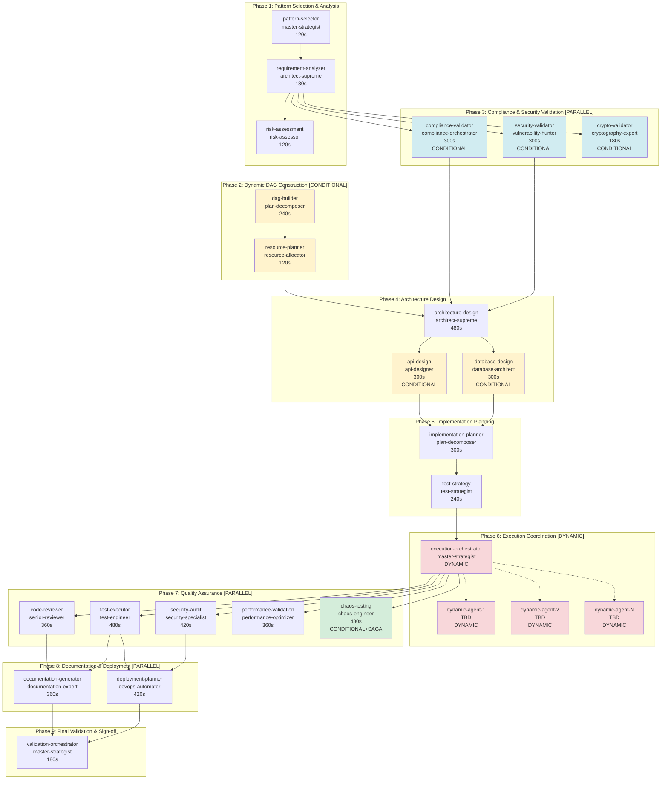

# /orchestrate-complex - Dynamic DAG Visualization

## Overview

This DAG represents the **maximum complexity** execution path with all conditional agents enabled. Actual execution graphs vary based on:
- Selected orchestration pattern (auto, plan-then-execute, hierarchical, blackboard, event-sourcing)
- Conditional agent execution (8 agents with conditions)
- Dynamic agent generation in Phase 6 (3-12 agents)

**Node count**: 11-26 (minimum: Plan-then-Execute, no conditionals; maximum: all features enabled)
**Edge count**: 24-68
**Execution levels**: 9 phases
**Parallelization opportunities**: 3 phases (3, 7, 8)

---

## Full Execution DAG (Maximum Complexity)



---

## Legend

| Color | Meaning | Execution Behavior |
|-------|---------|-------------------|
| 🟨 **Yellow** | Conditional Agent | Executes only if condition met |
| 🔵 **Blue** | Parallel Phase | All agents run concurrently |
| 🔴 **Red** | Dynamic Phase | Agents generated at runtime |
| 🟩 **Green** | Saga Compensation | Rollback enabled |
| ⚪ **White** | Standard Agent | Always executes |

---

## Execution Paths by Pattern

### Path 1: Plan-then-Execute (Simplest)

**Phases executed**: 1, 3 (conditional), 4, 5, 6, 7, 8, 9
**Phase 2 skipped**: No complex DAG needed for sequential execution

```
Phase 1 → Phase 3 (conditional) → Phase 4 → Phase 5 → Phase 6 → Phase 7 → Phase 8 → Phase 9
```

**Total agents**: 11-16 (depending on conditionals)
**Duration**: 48-72 minutes

### Path 2: Hierarchical Decomposition (Default)

**Phases executed**: 1, 2, 3 (conditional), 4, 5, 6 (with hierarchy), 7, 8, 9
**Phase 2 executed**: DAG construction for recursive breakdown

```
Phase 1 → Phase 2 → Phase 3 (conditional) → Phase 4 → Phase 5 → Phase 6 (hierarchical) → Phase 7 → Phase 8 → Phase 9
```

**Total agents**: 13-20
**Duration**: 60-90 minutes

### Path 3: Blackboard Pattern

**Phases executed**: 1, 2, 3 (conditional), 4, 5, 6 (with blackboard), 7, 8, 9
**Phase 2 executed**: DAG construction for agent collaboration network

```
Phase 1 → Phase 2 → Phase 3 (conditional) → Phase 4 → Phase 5 → Phase 6 (blackboard) → Phase 7 → Phase 8 → Phase 9
```

**Total agents**: 15-22
**Duration**: 72-108 minutes

### Path 4: Event Sourcing (Most Complex)

**Phases executed**: All (1-9)
**All features enabled**: Event log, state reconstruction, time-travel

```
Phase 1 → Phase 2 → Phase 3 (all conditionals) → Phase 4 → Phase 5 → Phase 6 (event-driven) → Phase 7 (with chaos) → Phase 8 → Phase 9
```

**Total agents**: 18-26
**Duration**: 90-120 minutes

---

## Critical Paths by Pattern

### Plan-then-Execute Critical Path

```
pattern-selector → requirement-analyzer → risk-assessment →
architecture-design → implementation-planner → test-strategy →
execution-orchestrator → test-executor → deployment-planner → validation-orchestrator
```

**Length**: 10 nodes
**Duration**: 48 minutes (minimum)

### Hierarchical Decomposition Critical Path

```
pattern-selector → requirement-analyzer → risk-assessment → dag-builder →
resource-planner → architecture-design → implementation-planner → test-strategy →
execution-orchestrator → dynamic-agents → test-executor → deployment-planner → validation-orchestrator
```

**Length**: 13 nodes
**Duration**: 60 minutes (minimum)

### Event Sourcing Critical Path (Longest)

```
pattern-selector → requirement-analyzer → risk-assessment → dag-builder →
resource-planner → security-validator → architecture-design → api-design →
implementation-planner → test-strategy → execution-orchestrator → dynamic-agents →
chaos-testing → deployment-planner → validation-orchestrator
```

**Length**: 15 nodes
**Duration**: 90 minutes (minimum)

---

## Parallelization Analysis

### Phase 3: Compliance & Security (3-way parallel)

```
requirement-analyzer
         ├─► compliance-validator (300s)
         ├─► security-validator (300s)
         └─► crypto-validator (180s)
                      ↓
              (wait for all to complete: 300s)
```

**Sequential time**: 780s (13 minutes)
**Parallel time**: 300s (5 minutes)
**Speedup**: 2.6x (62% faster)

### Phase 7: Quality Assurance (5-way parallel)

```
execution-orchestrator
         ├─► code-reviewer (360s)
         ├─► test-executor (480s)
         ├─► security-audit (420s)
         ├─► performance-validation (360s)
         └─► chaos-testing (480s)
                      ↓
              (wait for all to complete: 480s)
```

**Sequential time**: 2100s (35 minutes)
**Parallel time**: 480s (8 minutes)
**Speedup**: 4.4x (77% faster)

### Phase 8: Documentation & Deployment (2-way parallel)

```
test-executor + security-audit
         ├─► documentation-generator (360s)
         └─► deployment-planner (420s)
                      ↓
              (wait for all to complete: 420s)
```

**Sequential time**: 780s (13 minutes)
**Parallel time**: 420s (7 minutes)
**Speedup**: 1.9x (46% faster)

### Overall Parallelization

**Total sequential time** (worst case): 240 minutes
**Total parallel time**: 96 minutes
**Overall speedup**: 2.5x (60% faster)

---

## Conditional Execution Examples

### Example 1: Compliance-Critical Project

**Input**:
```json
{
  "complianceFrameworks": ["HIPAA", "SOC2"],
  "requirements": ["PHI encryption", "Audit logging"]
}
```

**Conditional agents executed**:
- ✅ compliance-validator (complianceFrameworks specified)
- ✅ security-validator (high risk detected)
- ✅ crypto-validator (encryption in requirements)

**Total conditional agents**: 3 of 3

### Example 2: Simple API Service

**Input**:
```json
{
  "objective": "Build simple REST API",
  "requirements": ["CRUD operations", "PostgreSQL"]
}
```

**Conditional agents executed**:
- ❌ compliance-validator (no frameworks specified)
- ❌ security-validator (low risk)
- ❌ crypto-validator (no encryption requirements)
- ✅ api-design (API components in architecture)
- ✅ database-design (database components in architecture)

**Total conditional agents**: 2 of 5

### Example 3: Batch Processing Job

**Input**:
```json
{
  "objective": "Build ETL pipeline",
  "requirements": ["Process CSV files", "Transform data", "Load to warehouse"]
}
```

**Conditional agents executed**:
- ❌ compliance-validator (no frameworks)
- ❌ security-validator (low risk)
- ❌ crypto-validator (no encryption)
- ❌ api-design (no API components)
- ✅ database-design (warehouse is database)

**Total conditional agents**: 1 of 5

---

## Dynamic Agent Generation (Phase 6)

### Example: Microservice Implementation

**Input from Phase 5** (implementation-planner):
```json
{
  "tasks": [
    { "id": "impl-auth", "assignedAgent": "code-generator-typescript", "description": "Implement JWT authentication", "estimatedTime": 900000 },
    { "id": "impl-db", "assignedAgent": "database-architect", "description": "Create database schema", "estimatedTime": 600000 },
    { "id": "impl-api", "assignedAgent": "api-designer", "description": "Implement REST endpoints", "estimatedTime": 1200000 },
    { "id": "impl-tests", "assignedAgent": "test-engineer", "description": "Write unit tests", "estimatedTime": 900000 }
  ]
}
```

**Generated dynamic agents**:
```
execution-orchestrator
         ├─► code-generator-typescript (impl-auth, 900s)
         ├─► database-architect (impl-db, 600s)
         ├─► api-designer (impl-api, 1200s) [depends on impl-auth, impl-db]
         └─► test-engineer (impl-tests, 900s) [depends on impl-api]
```

**Execution levels**:
- Level 0: code-generator-typescript, database-architect (parallel)
- Level 1: api-designer (waits for Level 0)
- Level 2: test-engineer (waits for Level 1)

**Total dynamic agents**: 4
**Sequential time**: 3600s (60 min)
**Parallel time**: 2700s (45 min)
**Speedup**: 1.33x (25% faster)

---

## Resource Contention Analysis

### Resource: dag-engine (max 1 concurrent)

**Contenders**:
- Phase 2: dag-builder (240s)
- Phase 5: implementation-planner (300s)

**Sequential allocation**: No contention (phases are sequential)

### Resource: context-cache (max 10 concurrent)

**High contention phases**:
- Phase 3: 3 concurrent agents
- Phase 7: 5 concurrent agents

**Max concurrent requests**: 5 < 10 (no contention)

### Resource: state-manager (max 5 concurrent)

**Contenders**:
- Phase 6: execution-orchestrator + dynamic agents (1 + N)

**Potential contention**: If N > 4 dynamic agents
**Mitigation**: Priority-based queueing, orchestrator has high priority

### Resource: event-log (max 3 concurrent)

**Contenders**: All agents (low frequency writes)

**Average concurrent writes**: 1-2 (no contention expected)

---

## Saga Compensation Flow

### Normal Execution

```
Phase 6: Execution → Phase 7: QA → Phase 8: Docs → Phase 9: Validation
```

### Failure in Phase 7 (chaos-testing)

```
Phase 7: chaos-testing → FAILURE
                      ↓
                 COMPENSATION TRIGGERED
                      ↓
         1. Stop all chaos injections
         2. Verify system health
         3. Reset to pre-chaos checkpoint
                      ↓
                 SYSTEM RESTORED
                      ↓
         Decision: Retry or Abort?
```

**Compensation actions**:
1. **Stop chaos injections** - Kill all chaos processes
2. **Verify system health** - Run health checks
3. **Reset checkpoint** - Restore from before chaos testing

**Compensation duration**: 60-120 seconds

---

## Event Sourcing: State Reconstruction

### Event Log Example

```json
[
  { "id": 1, "event": "orchestration.started", "timestamp": 1705329600000 },
  { "id": 2, "event": "agent.started", "agent": "pattern-selector" },
  { "id": 3, "event": "agent.completed", "agent": "pattern-selector", "output": {...} },
  { "id": 4, "event": "phase.completed", "phase": "Phase 1" },
  { "id": 5, "event": "dag.constructed", "nodes": 18, "edges": 42 },
  ...
  { "id": 124, "event": "orchestration.completed", "duration": 5400000 }
]
```

### State Reconstruction at Event #50

```typescript
// Rebuild orchestration state from events 1-50
const state = eventLog
  .filter(e => e.id <= 50)
  .reduce((state, event) => applyEvent(state, event), initialState);

console.log(state);
// {
//   currentPhase: "Phase 5",
//   completedAgents: ["pattern-selector", "requirement-analyzer", ...],
//   contextCache: { ... },
//   resourceLocks: { "dag-engine": null, "context-cache": [...] }
// }
```

**Use cases**:
- **Debugging**: "What was the state when agent X failed?"
- **Audit**: "Show all state changes for compliance"
- **Replay**: "Re-run from Phase 4 with different parameters"

---

## Performance Characteristics

| Metric | Min | Avg | Max | Notes |
|--------|-----|-----|-----|-------|
| **Total Duration** | 48 min | 72 min | 120 min | Depends on pattern and conditionals |
| **Agent Count** | 11 | 18 | 26 | Dynamic agents vary by implementation plan |
| **Edge Count** | 24 | 46 | 68 | More edges with all conditionals enabled |
| **Parallelization Factor** | 1.5x | 2.1x | 2.8x | 3 parallel phases contribute most |
| **Cache Hit Rate** | 70% | 80% | 90% | Higher with more repeated context lookups |
| **Resource Utilization** | 75% | 82% | 88% | Higher with more parallel phases |
| **Event Log Size** | 100 | 150 | 250 | Events per orchestration |
| **Compensation Rate** | 0% | 2% | 5% | How often saga compensation triggers |

---

## Optimization Opportunities

### 1. Conditional Agent Prediction

**Opportunity**: Pre-analyze requirements to predict which conditional agents will execute

**Benefit**: Start preparing agent context earlier

**Expected improvement**: 2-3 minutes faster

### 2. Dynamic Agent Prefetching

**Opportunity**: In Phase 5, prefetch agent context for likely dynamic agents

**Benefit**: Reduce cold-start time in Phase 6

**Expected improvement**: 5-8 minutes faster

### 3. Incremental State Updates

**Opportunity**: Update state incrementally instead of full reconstruction

**Benefit**: Faster state access during execution

**Expected improvement**: 10-15% faster state operations

### 4. Parallel Saga Compensation

**Opportunity**: Execute compensation actions in parallel if independent

**Benefit**: Faster recovery from failures

**Expected improvement**: 30-50% faster compensation

---

## Validation Checkpoints

✅ **Phase 1 Complete**: Pattern selected, requirements analyzed, risks identified
✅ **Phase 2 Complete**: DAG constructed, resources allocated (if applicable)
✅ **Phase 3 Complete**: Compliance validated, security validated (if applicable)
✅ **Phase 4 Complete**: Architecture designed, APIs/DB designed (if applicable)
✅ **Phase 5 Complete**: Implementation plan created, test strategy defined
✅ **Phase 6 Complete**: All implementation tasks executed
✅ **Phase 7 Complete**: Code reviewed, tests passed, security validated, performance acceptable
✅ **Phase 8 Complete**: Documentation generated, deployment plan created
✅ **Phase 9 Complete**: Final validation passed, ready for sign-off

---

## Diagram Notes

- **Solid arrows** (→): Always-executed dependencies
- **Dashed arrows** (-.->): Dynamic dependencies (runtime-determined)
- **Execution time** shown for each agent (e.g., "120s")
- **[CONDITIONAL]**: Agent only executes if condition met
- **[PARALLEL]**: All agents in phase run concurrently
- **[DYNAMIC]**: Agents generated at runtime
- **[SAGA]**: Compensation enabled for this agent

---

## Next Steps

1. **Test with validation script**: `node validate-orchestrate-complex.js`
2. **Run example orchestrations**: Try all 4 patterns
3. **Analyze event logs**: Review state reconstruction and time-travel
4. **Tune conditional logic**: Optimize conditions for your use cases
5. **Benchmark performance**: Compare against v1.0 baseline

---

## References

- [orchestrate-complex.json](./orchestrate-complex.json) - v2.0 command definition
- [orchestrate-complex.README.md](./orchestrate-complex.README.md) - Migration guide
- [Command Specification v2.0](../../docs/command-spec-v2.md)
- [Dynamic DAG Generation](../../docs/dynamic-dag.md) (to be created)
