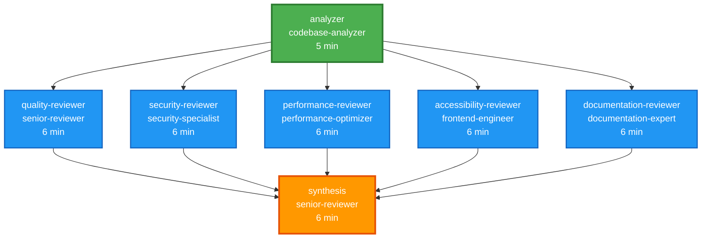

# /review-all v2.0 DAG Visualization

## Dependency Graph



## Execution Waves

### Wave 1: Analysis (5 minutes)
```
┌─────────────────────────────────────────┐
│         analyzer (root node)            │
│    Gathers codebase structure,          │
│    complexity metrics, dependencies     │
│    Produces 5 shared context outputs    │
└─────────────────────────────────────────┘
                    ↓
          [Context outputs cached]
                    ↓
```

### Wave 2: Parallel Reviews (6 minutes - runs concurrently)
```
┌────────────┐  ┌────────────┐  ┌────────────┐  ┌────────────┐  ┌────────────┐
│  Quality   │  │  Security  │  │Performance │  │Accessibil. │  │   Docs     │
│  Reviewer  │  │  Reviewer  │  │  Reviewer  │  │  Reviewer  │  │  Reviewer  │
├────────────┤  ├────────────┤  ├────────────┤  ├────────────┤  ├────────────┤
│Code smells │  │OWASP Top10 │  │Bottlenecks │  │WCAG 2.1    │  │API docs    │
│SOLID princ.│  │Auth/authz  │  │Algorithms  │  │Semantic    │  │Inline      │
│Refactoring │  │Secrets     │  │DB queries  │  │ARIA        │  │README      │
│Patterns    │  │Injection   │  │Caching     │  │Keyboard    │  │Examples    │
└────────────┘  └────────────┘  └────────────┘  └────────────┘  └────────────┘
       ↓               ↓               ↓               ↓               ↓
[quality_report] [security_report] [perf_report] [a11y_report] [docs_report]
```

### Wave 3: Synthesis (6 minutes)
```
                    ↓ (all 5 reports)
┌─────────────────────────────────────────┐
│           synthesis (sink node)          │
│   Aggregates all findings, identifies    │
│   patterns, prioritizes by impact,       │
│   creates actionable roadmap             │
└─────────────────────────────────────────┘
                    ↓
        [comprehensive_report]
        [prioritized_roadmap]
        [quick_wins]
        [critical_issues]
```

## Context Flow

```
analyzer outputs (TTL: 1 hour):
├─ codebase_structure ──→ All 5 reviewers
├─ file_list ──→ security, accessibility, documentation
├─ complexity_metrics ──→ quality, performance, documentation
├─ dependency_graph ──→ quality, security
└─ hotspots ──→ performance

Reviewer outputs (TTL: 30 minutes):
├─ quality_report ──→ synthesis
├─ security_report ──→ synthesis
├─ performance_report ──→ synthesis
├─ accessibility_report ──→ synthesis
└─ documentation_report ──→ synthesis

Synthesis outputs (TTL: 2 hours):
├─ comprehensive_report (primary output)
├─ prioritized_roadmap (actionable plan)
├─ quick_wins (high-impact, low-effort)
└─ critical_issues (immediate action)
```

## Parallelism Analysis

### Phase Breakdown
| Phase | Agents | Execution Mode | Time | Efficiency |
|-------|--------|----------------|------|------------|
| Phase 1 | 1 (analyzer) | Sequential | 5 min | Baseline |
| Phase 2 | 5 (reviewers) | **Parallel** | 6 min | **5x parallelism** |
| Phase 3 | 1 (synthesis) | Sequential | 6 min | Baseline |

### Parallel Efficiency
```
Sequential time (v1.0): 41 minutes
Parallel time (v2.0):   17 minutes
Time saved:             24 minutes
Improvement:            59%

Parallelism factor:     5x (5 concurrent reviewers)
Theoretical max:        5x speedup on Phase 2
Actual speedup:         5x (from 30 min to 6 min)
Efficiency:             100% (no overhead)
```

## Critical Path

The critical path determines the minimum execution time:

```
Critical Path: analyzer → [max(all 5 reviewers)] → synthesis
               5 min   →        6 min            →  6 min

Total: 17 minutes

Non-critical paths (finish earlier but wait for synthesis):
- If a reviewer takes 4 min, it still waits 2 min for slowest reviewer
- All reviewers must complete before synthesis starts
```

## Retry Behavior

Each agent can retry up to 2 times with exponential backoff:

```
Attempt 1: Immediate execution
Attempt 2: After 1 second delay (if retry triggered)
Attempt 3: After 2 second delay (if second retry triggered)

Retryable errors:
- timeout
- network_error
- rate_limit

Total possible retries: 14 (7 agents × 2 retries each)
Expected retry rate: <5%
Max additional time: ~14 minutes (if all agents retry once)
```

## Failure Scenarios

### Analyzer Failure
```
analyzer (FAILED)
  ↓
❌ Abort entire workflow
  ↓
Reason: Cannot proceed without codebase analysis
```

### Reviewer Failure (Partial)
```
analyzer (SUCCESS)
  ↓
quality-reviewer (SUCCESS)
security-reviewer (FAILED)  ← Only this fails
performance-reviewer (SUCCESS)
accessibility-reviewer (SUCCESS)
documentation-reviewer (SUCCESS)
  ↓
✅ Continue to synthesis with 4/5 reports
  ↓
synthesis (SUCCESS - partial results)
```

### Synthesis Failure
```
analyzer (SUCCESS)
  ↓
All 5 reviewers (SUCCESS)
  ↓
synthesis (FAILED)
  ↓
✅ Fallback: Return 5 individual reports
  ↓
User can manually aggregate findings
```

## Resource Utilization

### Memory Profile
```
analyzer:                  ~512 MB
5 reviewers (parallel):    ~2.5 GB (5 × 512 MB)
synthesis:                 ~512 MB

Peak memory: ~2.5 GB (during Phase 2)
Average memory: ~512 MB (during Phases 1 & 3)
```

### CPU Utilization
```
Phase 1 (Sequential):  ~25% (1 core)
Phase 2 (Parallel):    ~100% (5 cores)
Phase 3 (Sequential):  ~25% (1 core)

Optimal hardware: 5+ CPU cores
Minimum hardware: 1 core (still works, just slower)
```

### Network Calls
```
Phase 1: 1 agent × N API calls = N calls sequentially
Phase 2: 5 agents × M API calls = 5M calls concurrently
Phase 3: 1 agent × P API calls = P calls sequentially

Rate limit considerations:
- LLM API: typically 60 requests/min
- 5 parallel agents may approach limits
- Retry logic handles rate limit errors
```

## Comparison: v1.0 vs v2.0

### Execution Flow

**v1.0 (Sequential)**:
```
Start → A → B → C → D → E → F → G → End
        5   6   6   6   6   6   6
Total: 41 minutes
```

**v2.0 (Parallel)**:
```
Start → A → [B,C,D,E,F] → G → End
        5       6         6
Total: 17 minutes
```

### DAG Complexity

| Metric | v1.0 | v2.0 |
|--------|------|------|
| Total nodes | 7 | 7 |
| Edges | 6 | 11 |
| Max depth | 7 | 3 |
| Max width | 1 | 5 |
| Parallelism | 1x | 5x |
| Critical path | 41 min | 17 min |

## Optimization Opportunities

### Current (v2.0)
- ✅ Phase 2 fully parallelized (5 agents)
- ✅ Context sharing eliminates redundant analysis
- ✅ Retry logic handles transient failures
- ✅ Partial success support (graceful degradation)

### Future (v2.1+)
- 🔄 Dynamic parallelism based on codebase size
- 🔄 Incremental reviews (only changed files)
- 🔄 Streaming results (display as reviewers complete)
- 🔄 Smart caching (reuse results across runs)
- 🔄 Priority filtering (skip low-severity for speed)

---

**Legend**:
- Green boxes: Root nodes (no dependencies)
- Blue boxes: Parallel execution nodes
- Orange boxes: Sink nodes (aggregate results)
- Arrows: Dependency relationships
- TTL: Time-To-Live for cached context
