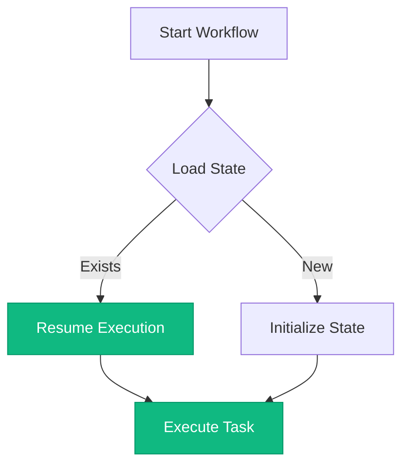

# Documentation Design System

> **Establish structure and rules for sustainable content development** across Agent Studio documentation. This design system is designed to streamline workflows, improve visibility, and drive measurable outcomes across all documentation needs.

**Best for:** Organizations scaling documentation practices across multi-team operations with consistent quality standards.

**Version:** 2.0
**Last Updated:** 2025-10-14
**Maintained by:** Documentation Team

---

## Table of Contents

- [Overview](#overview)
- [Content Architecture](#content-architecture)
- [Writing Standards](#writing-standards)
- [Markdown Conventions](#markdown-conventions)
- [Visual Standards](#visual-standards)
- [Component Usage](#component-usage)
- [Frontmatter Schema](#frontmatter-schema)
- [Quality Metrics](#quality-metrics)

---

## Overview

### Purpose

This documentation design system establishes enterprise-grade standards for creating, maintaining, and scaling technical content across Agent Studio. It enables teams to:

- **Streamline content workflows** through consistent patterns and reusable templates
- **Improve documentation visibility** with structured metadata and search optimization
- **Drive measurable outcomes** by tracking quality metrics and user engagement
- **Support sustainable growth** with scalable governance frameworks

### Audience

This design system serves:

- **Documentation Authors:** Writers creating new content
- **Technical Reviewers:** Engineers validating technical accuracy
- **Content Strategists:** Teams planning documentation roadmaps
- **Community Contributors:** External contributors following quality standards

### Principles

1. **Business Value First:** Lead with outcomes and benefits before technical details
2. **Clarity Over Brevity:** Prioritize understanding over word count
3. **Consistency Breeds Trust:** Maintain uniform patterns across all content
4. **Accessibility is Non-Negotiable:** WCAG 2.1 AA compliance required
5. **Measure and Improve:** Track metrics to drive continuous improvement

---

## Content Architecture

### Dual-Layer Approach

Agent Studio documentation follows a **dual-layer architecture** supporting both business and technical audiences:

#### Layer 1: Business-Focused Content
**Target Audience:** Decision-makers, product managers, business analysts

**Characteristics:**
- Lead with business value and ROI
- Minimal technical jargon
- Outcome-oriented language
- Use cases and success stories
- Interactive ROI calculators

**Content Types:**
- Value propositions
- Use case narratives
- ROI analysis
- Executive summaries

#### Layer 2: Technical Implementation Content
**Target Audience:** Developers, architects, DevOps engineers

**Characteristics:**
- Detailed implementation guidance
- Code examples and API references
- Architecture diagrams
- Performance considerations
- Troubleshooting procedures

**Content Types:**
- Developer guides
- API documentation
- Runbooks
- Architecture decision records (ADRs)

### Information Hierarchy

```
┌─────────────────────────────────────────┐
│ Level 1: Overview (What & Why)         │  ← Business Value
│  • Problem statement                    │
│  • Business outcomes                    │
│  • Success criteria                     │
├─────────────────────────────────────────┤
│ Level 2: Getting Started (How)         │  ← Quick Wins
│  • Prerequisites                        │
│  • Basic implementation                 │
│  • First success milestone             │
├─────────────────────────────────────────┤
│ Level 3: Deep Dive (Details)           │  ← Technical Depth
│  • Complete reference                   │
│  • Advanced patterns                    │
│  • Edge cases                           │
├─────────────────────────────────────────┤
│ Level 4: Operations (Maintenance)      │  ← Sustainability
│  • Monitoring                           │
│  • Troubleshooting                      │
│  • Performance tuning                   │
└─────────────────────────────────────────┘
```

### Content Type Taxonomy

| Content Type | Purpose | Audience | Depth | Update Frequency |
|-------------|---------|----------|-------|------------------|
| **Guide** | Task-oriented instruction | Developer, Operator | Medium | Monthly |
| **Tutorial** | Learning-oriented walkthrough | Beginner | High | Quarterly |
| **Reference** | Information-oriented lookup | All | Complete | On release |
| **Runbook** | Problem-solving procedures | Operator | Detailed | As needed |
| **ADR** | Architecture decision record | Architect | Strategic | Per decision |
| **API Docs** | Interface specifications | Developer | Complete | Per version |

### Audience Segmentation

#### Business Audience
- **Goals:** Understand ROI, use cases, business value
- **Tone:** Professional, approachable, outcome-focused
- **Content:** Success stories, metrics, value propositions
- **Components:** `<BusinessTechToggle>`, `<ROICalculator>`

#### Developer Audience
- **Goals:** Implement features, integrate systems, solve problems
- **Tone:** Technical, precise, instructional
- **Content:** Code examples, API references, guides
- **Components:** Code blocks, interactive diagrams, version selectors

#### Operator Audience
- **Goals:** Deploy, monitor, troubleshoot, scale
- **Tone:** Procedural, clear, actionable
- **Content:** Runbooks, deployment guides, monitoring dashboards
- **Components:** Interactive diagrams, troubleshooting flowcharts

#### Architect Audience
- **Goals:** Design systems, make decisions, evaluate patterns
- **Tone:** Strategic, analytical, comprehensive
- **Content:** ADRs, architecture diagrams, design patterns
- **Components:** C4 diagrams, decision matrices, trade-off analyses

---

## Writing Standards

### Tone and Voice (Brookside BI Brand Alignment)

#### Professional but Approachable
**Do:** "This solution is designed to streamline key workflows by establishing automated validation rules."
**Don't:** "This thing makes stuff work better."

**Do:** "Organizations scaling Power BI across multiple departments benefit from centralized governance."
**Don't:** "Lots of companies use this."

#### Solution-Focused
**Do:** "Establish structure and rules for sustainable BI development across teams."
**Don't:** "Configure the system settings."

**Do:** "Drive measurable outcomes through structured data quality frameworks."
**Don't:** "Make your data better."

#### Consultative and Strategic
**Do:** "This architecture decision supports long-term scalability as your organization grows."
**Don't:** "We picked this because it's popular."

**Do:** "Organizations managing complex multi-tenant environments require isolation strategies."
**Don't:** "You need to separate things."

### Core Language Patterns

Use these phrases consistently across all documentation:

| Pattern | Usage | Example |
|---------|-------|---------|
| **"Establish structure and rules for..."** | Governance, frameworks | "Establish structure and rules for agent workflow orchestration" |
| **"This solution is designed to..."** | Feature introductions | "This solution is designed to streamline deployment processes" |
| **"Organizations scaling [tech] across..."** | Context qualifiers | "Organizations scaling Azure infrastructure across departments" |
| **"Streamline workflows and improve visibility"** | Benefit statements | "Streamline data pipelines and improve operational visibility" |
| **"Drive measurable outcomes through..."** | Results focus | "Drive measurable outcomes through automated testing" |
| **"Build sustainable practices that support growth"** | Long-term value | "Build sustainable CI/CD practices that support organizational growth" |

### Sentence Structure Patterns

#### Lead with Benefits
**Good:** "Streamline deployment workflows by automating container image builds, designed to reduce manual intervention and improve reliability."

**Bad:** "The CI/CD pipeline automates container builds."

#### Active Voice Preference
**Good:** "The orchestrator executes workflows in parallel to optimize performance."

**Bad:** "Workflows are executed in parallel by the orchestrator."

#### Present Tense
**Good:** "The API returns a JSON response containing workflow status."

**Bad:** "The API will return a JSON response."

#### Second Person ("You")
**Good:** "You can configure retry policies to handle transient failures."

**Bad:** "Users can configure retry policies" or "One can configure retry policies."

### Technical Term Definitions

First-use pattern for technical terms:

```markdown
**Agent orchestration** is the coordinated execution of multiple AI agents working together to accomplish complex tasks. The orchestrator manages task scheduling, state persistence, and inter-agent communication.
```

After first use, the term can be used without definition.

### Acronym Usage Rules

1. **First Use:** Spell out with acronym in parentheses
   - "Directed Acyclic Graph (DAG)"
   - "Application Programming Interface (API)"

2. **Subsequent Uses:** Acronym only
   - "The DAG defines task dependencies."
   - "Call the API endpoint to retrieve status."

3. **Common Exceptions:** Don't spell out universally known acronyms
   - URL, HTML, CSS, JSON, XML, HTTP, HTTPS

### Example Patterns

#### Good Examples
```markdown
## Establish Scalable Agent Orchestration

> **Best for:** Organizations scaling AI agent deployments across multiple teams and departments.

This solution is designed to streamline agent workflow execution through centralized orchestration, enabling organizations to:

- Drive measurable outcomes by automating complex multi-step processes
- Improve visibility into agent execution with real-time monitoring
- Build sustainable practices through checkpoint-based recovery
```

#### Bad Examples
```markdown
## Agent Orchestration

This is how you run agents.

You can:
- Run workflows
- Monitor agents
- Use checkpoints
```

---

## Markdown Conventions

### Frontmatter Schema

All documentation files **must** include YAML frontmatter. See [Frontmatter Schema](#frontmatter-schema) section for complete specifications.

### Heading Hierarchy Rules

```markdown
# H1: Page Title (Only One Per Document)
Introductory paragraph with business value.

## H2: Major Sections
Content for major section.

### H3: Subsections
Content for subsection.

#### H4: Detailed Topics
Content for detailed topic.

##### H5: Rarely Used (Avoid if Possible)
Over-nesting indicates need to split content.
```

**Rules:**
1. One H1 per document (page title)
2. Don't skip heading levels (H2 → H4 is invalid)
3. Use descriptive headings, not generic ("Prerequisites" not "Setup")
4. Heading text should be title case

### Code Block Formatting

Always specify language for syntax highlighting:

````markdown
```typescript
// Establish scalable HTTP client with retry logic
export class AgentClient {
  private readonly httpClient: HttpClient;

  constructor() {
    this.httpClient = createRetryClient({
      maxRetries: 3,
      backoff: 'exponential'
    });
  }
}
```
````

**Supported Languages:**
- `typescript`, `javascript`, `python`, `csharp`, `java`, `go`, `rust`
- `bash`, `powershell`, `shell`
- `json`, `yaml`, `xml`, `html`, `css`
- `sql`, `bicep`, `dockerfile`

**Code Block Guidelines:**
1. Include language tag (no `txt` or empty)
2. Add inline comments explaining business value
3. Show complete, runnable examples
4. Keep examples under 50 lines (split if longer)
5. Use realistic variable names, not `foo`/`bar`

### Callout Box Usage

VitePress supports container syntax for callouts:

```markdown
::: tip Business Value
This approach streamlines validation workflows by establishing automated rules, designed to reduce manual review time by 40%.
:::

::: warning Breaking Change
Version 2.0 introduces a new authentication model. Organizations must update API clients before upgrading.
:::

::: danger Security Critical
Never commit API keys or secrets to version control. Use Azure Key Vault for secrets management.
:::

::: details Technical Implementation Details
<details that can be expanded>
:::
```

**Callout Types:**
- `tip`: Helpful guidance, best practices, business value
- `warning`: Important caveats, breaking changes, gotchas
- `danger`: Security issues, data loss risks, critical errors
- `details`: Expandable technical details, optional deep dives

### Link Formatting

#### Internal Links (Within Documentation)
```markdown
[Architecture Overview](../architecture/overview.md)
[API Reference](/api/complete-api-reference)
[Getting Started Guide](/getting-started)
```

**Rules:**
- Use relative paths for nearby files: `../architecture/overview.md`
- Use absolute paths from docs root: `/api/reference`
- Don't include `.md` extension for VitePress routes
- Use descriptive link text, never "click here"

#### External Links
```markdown
[Azure OpenAI Documentation](https://learn.microsoft.com/azure/ai-services/openai/)
```

**Rules:**
- Use full HTTPS URLs
- Include descriptive link text
- Consider adding external link indicator: `(external)`

#### Anchor Links
```markdown
[Jump to Prerequisites](#prerequisites)
```

### Table Formatting Standards

```markdown
| Column 1 Header | Column 2 Header | Column 3 Header |
|----------------|-----------------|-----------------|
| Cell 1.1       | Cell 1.2        | Cell 1.3        |
| Cell 2.1       | Cell 2.2        | Cell 2.3        |
```

**Guidelines:**
1. Include header row with separator
2. Align separators for readability (optional but recommended)
3. Use pipes `|` for cell boundaries
4. Keep tables under 6 columns (split if wider)
5. For complex tables, consider diagrams instead

**Alignment:**
```markdown
| Left Aligned | Center Aligned | Right Aligned |
|:-------------|:--------------:|--------------:|
| Left         | Center         | Right         |
```

### List Formatting

#### Unordered Lists
```markdown
- Top-level item
  - Nested item (2 spaces)
    - Deeply nested (4 spaces)
- Another top-level item
```

#### Ordered Lists
```markdown
1. First step
2. Second step
   1. Sub-step (3 spaces)
   2. Another sub-step
3. Third step
```

#### Task Lists
```markdown
- [ ] Incomplete task
- [x] Completed task
- [ ] Another incomplete task
```

**Guidelines:**
- Use `-` for unordered lists (not `*` or `+`)
- Indent nested lists with 2 spaces
- Use ordered lists for sequential steps
- Use unordered lists for non-sequential items

---

## Visual Standards

### Image Formatting

#### Preferred Formats
1. **WebP** (preferred): Modern format, best compression
2. **PNG**: Lossless, good for diagrams and screenshots
3. **SVG**: Vector graphics, scalable diagrams
4. **JPEG**: Photos only (rarely used in technical docs)

#### File Size Limits
- **Target:** <100KB per image
- **Maximum:** <200KB per image
- **Exception:** Complex diagrams up to 500KB with justification

#### Optimization
```bash
# Convert PNG to WebP
cwebp input.png -o output.webp -q 80

# Optimize PNG
pngquant input.png --output output.png --quality 65-80

# Optimize SVG
svgo input.svg -o output.svg
```

#### Embedding Images
```markdown


<!-- With caption -->

*Figure 1: Agent orchestration architecture with frontend, API, and runtime layers*
```

**Alt Text Requirements:**
1. Describe the content and function, not just the subject
2. Keep under 125 characters
3. Don't use "image of" or "picture of"
4. Include text content visible in image

**Good:** `Agent orchestration workflow showing sequential execution with checkpoints`
**Bad:** `Diagram` or `Image of workflow`

### Screenshot Naming Conventions

```
docs/assets/screenshots/
├── {page-name}-{feature}-{state}.webp
└── example:
    ├── workflow-designer-empty-state.webp
    ├── workflow-designer-sequential-config.webp
    └── execution-monitor-running-state.webp
```

**Naming Pattern:** `{page}-{feature}-{state}.webp`

Examples:
- `dashboard-metrics-overview.webp`
- `agent-config-modal-open.webp`
- `error-validation-failed.webp`

### Diagram Embedding Patterns

#### Mermaid Diagrams (Preferred)
```markdown

```

See [Mermaid Standards](../assets/diagrams/mermaid-standards.md) for complete diagram guidelines.

#### Interactive Diagrams
Use `<InteractiveDiagram>` component for complex visualizations:

```vue
<InteractiveDiagram
  title="Agent Orchestration Architecture"
  type="mermaid"
  :diagram="mermaidCode"
  caption="High-level architecture showing integration points"
  :hotspots="[
    { x: 50, y: 30, title: 'Orchestration API', description: 'Central coordination layer', link: '/api/orchestration' },
    { x: 50, y: 60, title: 'Agent Runtime', description: 'Python-based execution environment', link: '/architecture/runtime' }
  ]"
/>
```

### Video and Screencast Guidelines

**Formats:** MP4 (H.264), WebM
**Max Duration:** 3 minutes
**Max File Size:** 10MB
**Resolution:** 1920x1080 (1080p) or 1280x720 (720p)

**Embedding:**
```html
<video controls width="100%">
  <source src="./videos/workflow-walkthrough.mp4" type="video/mp4">
  Your browser does not support video playback.
</video>
```

**Requirements:**
1. Include captions/subtitles (SRT/VTT file)
2. Provide transcript below video
3. Ensure audio clarity
4. Avoid background music (accessibility)

---

## Component Usage

Agent Studio documentation includes custom Vue components for enhanced interactivity. Use these components to improve user experience and provide multi-layered content.

### BusinessTechToggle

**Purpose:** Provide dual-layer content for business and technical audiences in a single document.

**When to Use:**
- Content serves both business and technical readers
- Business value and implementation details both critical
- Want to avoid duplicate pages

**Props:**
- `defaultMode`: 'business' | 'technical' (default: 'business')
- `showDescription`: boolean (default: true)

**Usage:**
```vue
<BusinessTechToggle defaultMode="business">
  <template #business>

## Streamline Agent Workflows

This solution is designed to improve operational efficiency by automating complex multi-step processes. Organizations scaling AI agents across departments benefit from centralized orchestration that:

- **Reduces manual intervention** by 60% through automated task scheduling
- **Improves reliability** with checkpoint-based recovery and retry logic
- **Drives measurable outcomes** through real-time monitoring and analytics

  </template>
  <template #technical>

## Agent Orchestration Implementation

The orchestration layer uses .NET 8 ASP.NET Core to coordinate Python-based agent execution:

```typescript
public class MetaAgentOrchestrator {
  public async Task<WorkflowResult> ExecuteAsync(WorkflowDefinition workflow) {
    var executor = new WorkflowExecutor(workflow.Pattern);
    return await executor.RunAsync(workflow.Tasks);
  }
}
```

**Architecture:**
- REST API for workflow submission
- SignalR for real-time updates
- Cosmos DB for state persistence

  </template>
</BusinessTechToggle>
```

**Best Practices:**
1. Keep business content outcome-focused
2. Include code examples in technical section
3. Maintain logical parity between sections
4. Default to business view unless doc is highly technical

### InteractiveDiagram

**Purpose:** Embed interactive diagrams with zoom, fullscreen, and hotspot support.

**When to Use:**
- Complex architecture diagrams
- Diagrams with multiple clickable areas
- Need zoom/fullscreen for detail

**Props:**
- `title`: Diagram title
- `type`: 'mermaid' | 'image' | 'custom'
- `diagram`: Mermaid code or image path
- `caption`: Figure caption
- `showZoom`: boolean (default: true)
- `showFullscreen`: boolean (default: true)
- `hotspots`: Array of interactive hotspots
- `legend`: Array of legend items

**Usage:**
```vue
<InteractiveDiagram
  title="C4 Container Diagram - Agent Studio"
  type="mermaid"
  :diagram="containerDiagram"
  caption="Container architecture showing all deployable units"
  :showZoom="true"
  :showFullscreen="true"
  :hotspots="[
    {
      x: 30, y: 40,
      title: 'React Frontend',
      description: 'Single-page application built with React 19 and TypeScript',
      link: '/architecture/frontend'
    },
    {
      x: 70, y: 40,
      title: 'Orchestration API',
      description: '.NET 8 ASP.NET Core API for workflow coordination',
      link: '/api/orchestration'
    }
  ]"
  :legend="[
    { color: '#61dafb', label: 'Frontend Components' },
    { color: '#512bd4', label: 'Backend Services' },
    { color: '#336791', label: 'Databases' }
  ]"
/>
```

**Best Practices:**
1. Provide descriptive titles
2. Add captions for context
3. Use hotspots for complex diagrams (3+ components)
4. Include legend for color-coded diagrams

### ROICalculator

**Purpose:** Interactive calculator showing business value and return on investment.

**When to Use:**
- Business value propositions
- Pricing/cost analysis pages
- Executive summaries

**Usage:**
```vue
<ROICalculator />
```

Component is self-contained with default values. Users can adjust:
- Team size
- Average developer salary
- Manual task hours per week
- Incident response time
- Deployment frequency
- Platform cost
- Implementation cost

**Output:**
- Annual ROI percentage
- Payback period (months)
- Time saved (hours/year)
- Cost savings breakdown

**Best Practices:**
1. Place in business-focused guides
2. Provide context before calculator
3. Include disclaimer about estimates
4. Explain calculation methodology below

### VersionSelector

**Purpose:** Allow users to switch between documentation versions.

**When to Use:**
- Multi-version documentation sites
- Version-specific features
- Breaking changes between versions

**Props:**
- `current`: Current version string (e.g., 'v2.0')

**Usage:**
```vue
<VersionSelector current="v2.0" />
```

Component displays dropdown with available versions, badges (latest, stable, LTS), and links to version-specific docs.

**Best Practices:**
1. Place in header or sidebar
2. Highlight current version
3. Use semantic versioning
4. Maintain version changelog

---

## Frontmatter Schema

Every markdown file **must** include YAML frontmatter defining metadata for search, navigation, and rendering.

### Guide/Tutorial Frontmatter

```yaml
---
title: "Establish Scalable Agent Workflows"
description: "Streamline multi-step processes through centralized orchestration, designed to improve reliability and reduce manual intervention"
audience: [developer, architect]
difficulty: intermediate
estimated_time: "30 minutes"
prerequisites:
  - "Azure subscription with appropriate permissions"
  - "Node.js 18+ and npm installed"
  - "Basic understanding of REST APIs"
tags: [orchestration, workflows, automation, azure]
last_updated: "2025-10-14"
version: "2.0"
related_docs:
  - "/api/orchestration"
  - "/guides/developer/workflow-creation"
  - "/architecture/orchestration-c4"
---
```

**Required Fields:**
- `title`: Clear, action-oriented title (60 chars max)
- `description`: One-sentence summary emphasizing business value (160 chars max)
- `audience`: Array from [business, developer, operator, architect]
- `last_updated`: ISO date (YYYY-MM-DD)

**Optional Fields:**
- `difficulty`: beginner | intermediate | advanced
- `estimated_time`: Expected reading/completion time
- `prerequisites`: Array of prerequisite requirements
- `tags`: Array of searchable keywords
- `version`: Documentation version
- `related_docs`: Array of related document paths

### API Reference Frontmatter

```yaml
---
title: "Orchestration API Reference"
description: "Complete API specification for agent workflow orchestration, designed to enable programmatic workflow management"
audience: [developer]
version: "2.0"
openapi_spec: "/api/specs/orchestration-openapi.yaml"
authentication: "Bearer token (Azure AD)"
rate_limits: "100 requests/minute per tenant"
base_url: "https://api.agentstudio.io/v2"
last_updated: "2025-10-14"
tags: [api, rest, orchestration, reference]
related_docs:
  - "/guides/developer/workflow-creation"
  - "/api/signalr-hub"
---
```

**API-Specific Fields:**
- `openapi_spec`: Path to OpenAPI/Swagger specification
- `authentication`: Authentication method
- `rate_limits`: Rate limiting policy
- `base_url`: API base URL

### Architecture Document Frontmatter

```yaml
---
title: "Agent Orchestration Architecture"
description: "Scalable three-tier architecture supporting multi-agent workflow execution with checkpoint-based recovery"
audience: [architect, developer]
complexity: medium
adrs: [ADR-002, ADR-009]
diagrams:
  - "architecture/c4-context.mmd"
  - "architecture/c4-container.mmd"
  - "architecture/deployment-azure-ha.mmd"
technologies: [dotnet, python, cosmosdb, signalr, azure]
last_updated: "2025-10-14"
version: "2.0"
related_docs:
  - "/adrs/002-meta-agent-architecture"
  - "/architecture/orchestration-c4"
---
```

**Architecture-Specific Fields:**
- `complexity`: low | medium | high
- `adrs`: Array of related Architecture Decision Records
- `diagrams`: Array of diagram file paths
- `technologies`: Array of technologies discussed

### Runbook Frontmatter

```yaml
---
title: "Workflow Execution Failure Recovery"
description: "Operational procedures for recovering failed workflows using checkpoint-based resumption"
audience: [operator]
severity: high
estimated_time: "15 minutes"
prerequisites:
  - "Azure portal access"
  - "kubectl access to AKS cluster"
  - "Azure CLI installed"
on_call_priority: P1
related_incidents: [INC-2024-001, INC-2024-045]
last_updated: "2025-10-14"
tags: [runbook, troubleshooting, recovery, workflows]
---
```

**Runbook-Specific Fields:**
- `severity`: low | medium | high | critical
- `on_call_priority`: P0 | P1 | P2 | P3
- `related_incidents`: Array of related incident IDs

### ADR (Architecture Decision Record) Frontmatter

```yaml
---
title: "ADR-009: DAG-Based Orchestration"
description: "Adopt directed acyclic graphs for workflow dependency management to support complex execution patterns"
status: accepted
date: "2025-01-10"
deciders: [alice-johnson, bob-smith]
consulted: [engineering-team, architecture-team]
informed: [product-team]
audience: [architect, developer]
tags: [adr, architecture, orchestration, dag]
supersedes: ADR-003
related_docs:
  - "/architecture/orchestration-c4"
  - "/guides/developer/workflow-creation"
---
```

**ADR-Specific Fields:**
- `status`: proposed | accepted | rejected | deprecated | superseded
- `date`: Decision date (YYYY-MM-DD)
- `deciders`: Array of decision-makers
- `consulted`: Teams consulted
- `informed`: Teams informed
- `supersedes`: ADR this replaces (if applicable)

---

## Quality Metrics

### Readability Standards

**Target:** Flesch-Kincaid Reading Ease score of 60+

**Tools:**
```bash
# Install readability CLI
npm install -g readability-cli

# Check document readability
readability docs/guides/developer/workflow-creation.md
```

**Guidelines:**
- Average sentence length: 15-20 words
- Avoid complex vocabulary unless necessary
- Break long paragraphs (5-7 sentences max)
- Use active voice (80%+ of sentences)

### Scannability Checklist

- [ ] Descriptive headings every 2-3 paragraphs
- [ ] Bulleted or numbered lists for scannable content
- [ ] Callout boxes for important information
- [ ] Code examples with syntax highlighting
- [ ] Visual aids (diagrams, screenshots) every 500 words

### Actionability Requirements

Every guide must include:

1. **Clear Success Criteria:** What does completion look like?
2. **Validation Steps:** How to verify successful implementation?
3. **Next Steps:** Where to go after finishing this guide?
4. **Troubleshooting:** Common issues and solutions

### Brand Alignment Audit

Review content against Brookside BI guidelines:

- [ ] Leads with business value/outcomes
- [ ] Uses core language patterns ("Establish structure," "Streamline workflows")
- [ ] Professional but approachable tone
- [ ] Solution-focused framing
- [ ] Consultative, strategic positioning

### Accessibility Compliance

- [ ] WCAG 2.1 AA color contrast (4.5:1 for normal text)
- [ ] Alt text for all images
- [ ] Descriptive link text (no "click here")
- [ ] Heading hierarchy maintained
- [ ] Keyboard navigation supported
- [ ] Video captions/transcripts provided

### Search Optimization

- [ ] Descriptive page title (50-60 chars)
- [ ] Meta description (150-160 chars)
- [ ] H1 includes primary keyword
- [ ] Internal links to related content
- [ ] Tags/keywords in frontmatter
- [ ] URL structure semantic and clean

---

## Maintenance and Updates

### Version Control

- Update `last_updated` field when making substantial changes
- Increment `version` when changing API contracts or major features
- Archive outdated content with `_archived` prefix

### Review Cycles

| Content Type | Review Frequency | Owner |
|-------------|------------------|-------|
| API Reference | Every release | Engineering |
| Guides | Quarterly | Documentation Team |
| Tutorials | Bi-annually | Developer Relations |
| Runbooks | Monthly | Operations |
| ADRs | As needed | Architecture |

### Deprecation Process

1. Mark content as deprecated in frontmatter: `status: deprecated`
2. Add deprecation notice at top of document
3. Provide migration guide to replacement content
4. Maintain deprecated docs for 2 release cycles
5. Archive after deprecation period

---

## Additional Resources

- [Technical Writing Style Guide](./TECHNICAL-WRITING-STYLE-GUIDE.md)
- [Accessibility Checklist](./ACCESSIBILITY-CHECKLIST.md)
- [Documentation Review Checklist](./DOCUMENTATION-REVIEW-CHECKLIST.md)
- [Custom Components Guide](./CUSTOM-COMPONENTS-GUIDE.md)
- [Content Type Templates](./templates/)
- [Mermaid Diagram Standards](../assets/diagrams/mermaid-standards.md)

---

**Questions or Feedback?**

- **Documentation Issues:** [GitHub Issues](https://github.com/Brookside-Proving-Grounds/Project-Ascension/issues)
- **Discussion:** [GitHub Discussions](https://github.com/Brookside-Proving-Grounds/Project-Ascension/discussions)
- **Email:** Consultations@BrooksideBI.com
