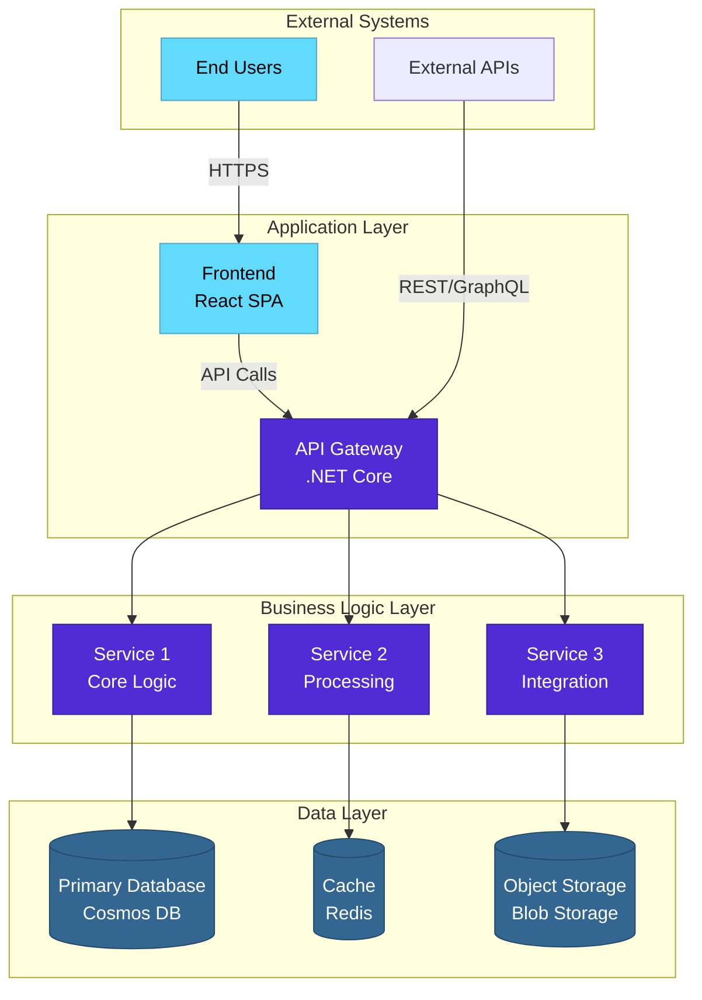
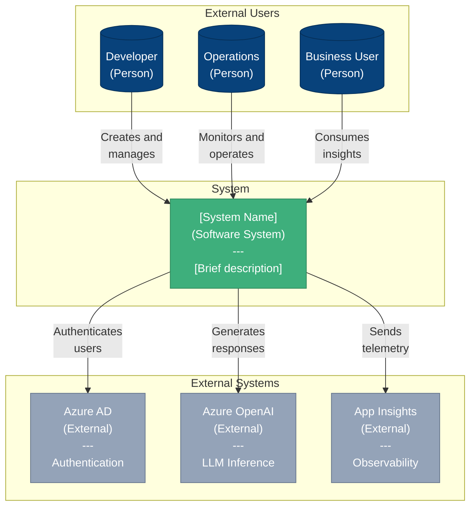
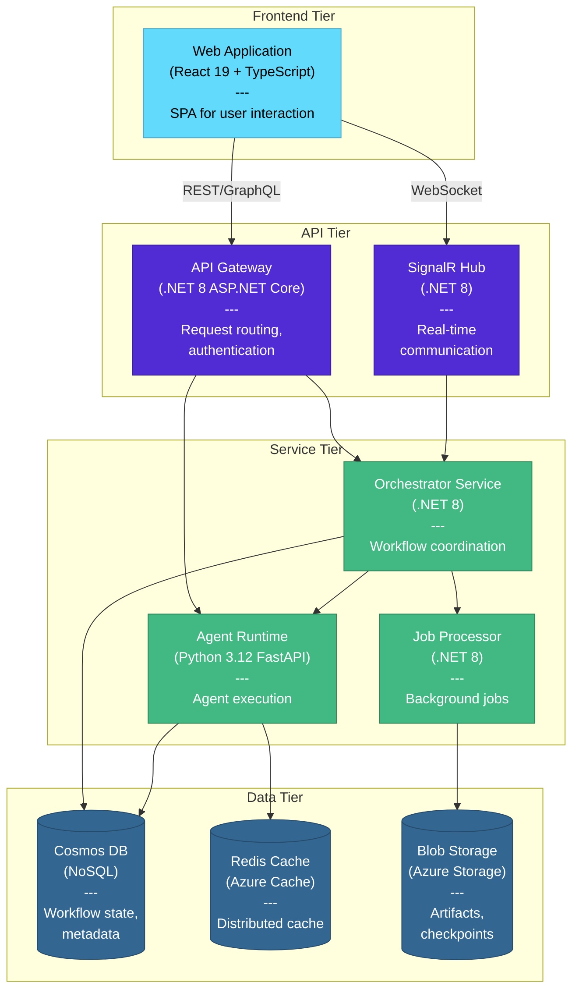
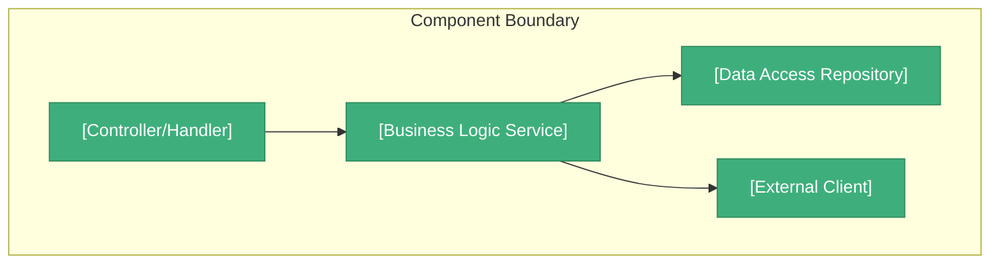
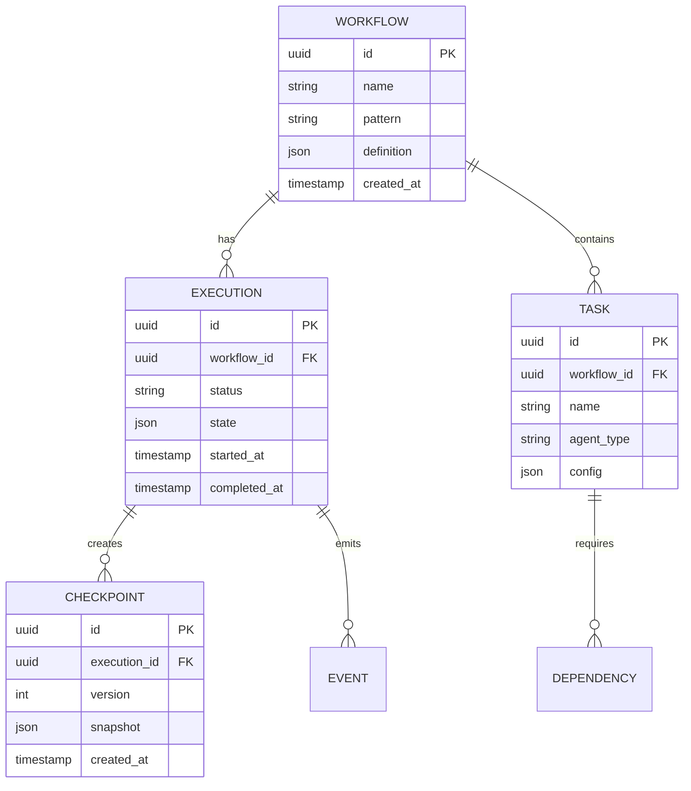
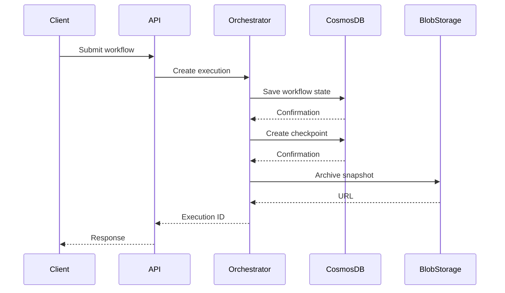
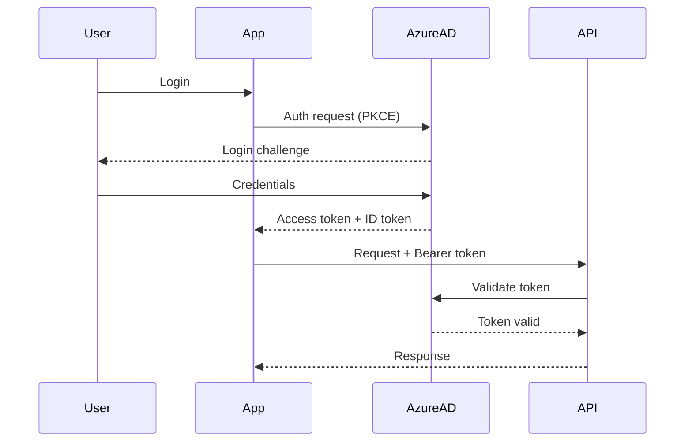
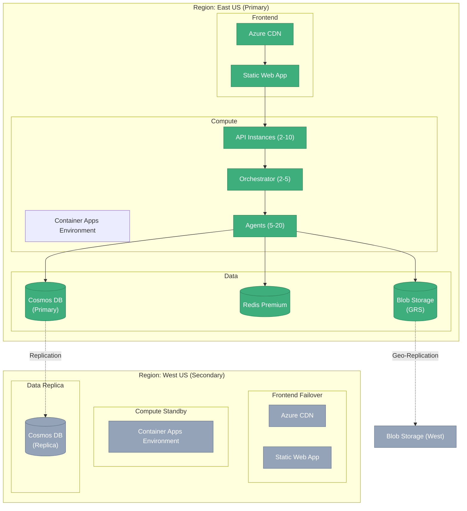

# [Component/System] Architecture

> **Design Philosophy:** [One sentence capturing the core architectural principle - e.g., "Event-driven microservices architecture designed to support independent scaling and fault isolation"]

## Executive Summary

This document describes the architecture of [system/component], designed to [primary business outcome]. The architecture is built on [core principles] to enable [key capabilities].

**Key Benefits:**
- **[Benefit 1]:** [Quantifiable outcome]
- **[Benefit 2]:** [Qualitative improvement]
- **[Benefit 3]:** [Strategic advantage]

**Target Audience:** Architects, senior developers, and technical decision-makers evaluating or implementing this system.

::: tip Business Value
This architecture is designed to streamline [workflows] by establishing [structure/pattern], enabling organizations to drive measurable outcomes through [approach].
:::

---

## Table of Contents

- [Architecture Overview](#architecture-overview)
- [Core Principles](#core-principles)
- [System Context](#system-context)
- [Container Architecture](#container-architecture)
- [Component Design](#component-design)
- [Data Architecture](#data-architecture)
- [Integration Patterns](#integration-patterns)
- [Security Architecture](#security-architecture)
- [Deployment Architecture](#deployment-architecture)
- [Scalability and Performance](#scalability-and-performance)
- [Operational Considerations](#operational-considerations)
- [Trade-offs and Alternatives](#trade-offs-and-alternatives)
- [Future Evolution](#future-evolution)

---

## Architecture Overview

### Purpose

[2-3 paragraphs explaining what this system/component does, the problems it solves, and the value it provides to the organization]

### Architectural Style

**Primary Pattern:** [e.g., "Microservices", "Layered Architecture", "Event-Driven", "CQRS/Event Sourcing"]

**Supporting Patterns:**
- [Pattern 1] for [specific aspect]
- [Pattern 2] for [specific aspect]
- [Pattern 3] for [specific aspect]

### High-Level Architecture



**Architecture Characteristics:**
| Characteristic | Rating | Justification |
|----------------|--------|---------------|
| Scalability | ⭐⭐⭐⭐⭐ | Horizontal scaling across all layers |
| Availability | ⭐⭐⭐⭐ | Multi-region deployment with failover |
| Performance | ⭐⭐⭐⭐ | Sub-200ms p95 latency |
| Security | ⭐⭐⭐⭐⭐ | Defense in depth, zero trust model |
| Maintainability | ⭐⭐⭐⭐ | Clear separation of concerns |
| Cost Efficiency | ⭐⭐⭐ | Serverless components, auto-scaling |

---

## Core Principles

The architecture adheres to these guiding principles:

### 1. [Principle 1 - e.g., "Separation of Concerns"]

**Definition:** [What this principle means in context]

**Implementation:**
- [How principle is implemented - point 1]
- [How principle is implemented - point 2]
- [How principle is implemented - point 3]

**Benefits:**
- [Benefit 1]
- [Benefit 2]

**Example:**
```
[Concrete example showing principle in action]
```

### 2. [Principle 2 - e.g., "Fault Isolation"]

**Definition:** [What this principle means]

**Implementation:**
- [Implementation approach 1]
- [Implementation approach 2]

**Benefits:**
- [Benefit 1]
- [Benefit 2]

### 3. [Principle 3 - e.g., "API-First Design"]

**Definition:** [What this principle means]

**Implementation:**
- [Implementation approach]

**Benefits:**
- [Benefit]

---

## System Context

### C4 Model: Context Diagram



### External Interfaces

| System | Type | Protocol | Purpose | SLA |
|--------|------|----------|---------|-----|
| Azure AD | Authentication | OAuth 2.0 / OIDC | User authentication | 99.99% |
| Azure OpenAI | LLM Service | REST/HTTPS | AI inference | 99.9% |
| Application Insights | Observability | HTTPS/OTLP | Telemetry collection | 99.9% |

### Stakeholders

| Stakeholder | Interest | Concerns |
|-------------|----------|----------|
| **End Users** | Functionality, reliability | Performance, availability |
| **Developers** | Maintainability, extensibility | Code quality, documentation |
| **Operations** | Operability, observability | Monitoring, incident response |
| **Security** | Compliance, risk mitigation | Vulnerabilities, data protection |
| **Business** | ROI, time-to-market | Cost, scalability |

---

## Container Architecture

### C4 Model: Container Diagram



### Container Specifications

#### Frontend Containers

**Web Application**
- **Technology:** React 19, TypeScript, Vite
- **Hosting:** Azure Static Web Apps / App Service
- **Responsibilities:**
  - User interface rendering
  - Client-side state management
  - API consumption
  - Real-time event handling via SignalR
- **Scaling:** CDN-based distribution
- **Dependencies:** API Gateway, SignalR Hub

#### API Containers

**API Gateway**
- **Technology:** .NET 8 ASP.NET Core, Minimal APIs
- **Hosting:** Azure App Service / Container Apps
- **Responsibilities:**
  - Request authentication and authorization
  - API versioning and routing
  - Rate limiting
  - Request/response transformation
- **Scaling:** Horizontal auto-scaling (2-10 instances)
- **Dependencies:** Azure AD, Orchestrator, Agent Runtime

**SignalR Hub**
- **Technology:** .NET 8 SignalR
- **Hosting:** Azure SignalR Service
- **Responsibilities:**
  - Real-time bidirectional communication
  - Connection management
  - Event broadcasting
- **Scaling:** Azure-managed scaling
- **Dependencies:** Orchestrator

#### Service Containers

**Orchestrator Service**
- **Technology:** .NET 8, Medallion.Threading for distributed locking
- **Hosting:** Azure Container Apps
- **Responsibilities:**
  - Workflow definition and execution
  - Task scheduling and dependency resolution
  - State management and checkpointing
  - Event sourcing
- **Scaling:** Horizontal (CPU/memory-based)
- **Dependencies:** Cosmos DB, Agent Runtime, SignalR

**Agent Runtime**
- **Technology:** Python 3.12, FastAPI, Azure SDK
- **Hosting:** Azure Container Apps
- **Responsibilities:**
  - Agent code execution
  - LLM integration (Azure OpenAI)
  - Result processing and validation
- **Scaling:** Horizontal (queue depth-based)
- **Dependencies:** Cosmos DB, Redis, Azure OpenAI

**Job Processor**
- **Technology:** .NET 8, Hangfire for background jobs
- **Hosting:** Azure Container Apps
- **Responsibilities:**
  - Scheduled job execution
  - Checkpoint archival
  - Report generation
- **Scaling:** Based on job queue depth
- **Dependencies:** Blob Storage, Cosmos DB

#### Data Containers

**Cosmos DB**
- **Type:** NoSQL (SQL API)
- **Hosting:** Azure Cosmos DB (Serverless)
- **Containers:**
  - `workflows`: Workflow definitions and executions
  - `checkpoints`: State snapshots
  - `agents`: Agent configurations
- **Consistency:** Session consistency (configurable)
- **Partition Key:** `/workflowId` or `/tenantId`

**Redis Cache**
- **Type:** In-memory key-value store
- **Hosting:** Azure Cache for Redis
- **Tier:** Standard (dev), Premium (prod)
- **Usage:**
  - Session state
  - Distributed locks
  - Response caching
- **Eviction Policy:** LRU (Least Recently Used)

**Blob Storage**
- **Type:** Object storage
- **Hosting:** Azure Blob Storage
- **Containers:**
  - `checkpoints`: Serialized state snapshots
  - `artifacts`: User-uploaded files
  - `logs`: Archived log files
- **Redundancy:** LRS (dev), GRS (prod)

---

## Component Design

### [Component 1 Name] Component

**Purpose:** [What this component does]

**Responsibilities:**
- [Responsibility 1]
- [Responsibility 2]
- [Responsibility 3]

**Internal Structure:**



**Key Patterns:**
- **[Pattern 1]:** [Description and rationale]
- **[Pattern 2]:** [Description and rationale]

**Dependencies:**
- [Dependency 1] - [Why needed]
- [Dependency 2] - [Why needed]

**Example Implementation:**
```csharp
// Establish [component purpose] to streamline [workflow]
public class [ComponentName]
{
    private readonly [IDependency] _dependency;

    public [ComponentName]([IDependency] dependency)
    {
        _dependency = dependency;
    }

    public async Task<Result> ExecuteAsync([Parameters])
    {
        // Implementation
    }
}
```

---

## Data Architecture

### Data Model

**Conceptual Model:**



### Storage Strategy

| Data Type | Store | Rationale | Consistency |
|-----------|-------|-----------|-------------|
| Workflow definitions | Cosmos DB | Flexible schema, global distribution | Strong |
| Execution state | Cosmos DB | Transactional updates, querying | Session |
| Checkpoints | Blob Storage | Large payloads, archival | Eventual |
| Session state | Redis | High-speed access, TTL | Strong |
| Static assets | Blob Storage (CDN) | Content delivery, caching | Eventual |

### Data Flow



---

## Integration Patterns

### Synchronous Integration

**Pattern:** Request-Response over HTTP/REST

**Use Cases:**
- User-initiated operations requiring immediate response
- CRUD operations
- Query operations

**Implementation:**
```http
POST /api/v2/workflows HTTP/1.1
Host: api.example.com
Authorization: Bearer {token}
Content-Type: application/json

{
  "name": "Deployment Workflow",
  "pattern": "sequential"
}
```

**Trade-offs:**
- ✅ Simple, widely supported
- ✅ Immediate feedback
- ❌ Tight coupling
- ❌ Client blocks during processing

### Asynchronous Integration

**Pattern:** Message Queue / Event-Driven

**Use Cases:**
- Long-running operations
- Decoupling services
- Event propagation

**Implementation:**
```csharp
// Establish async message publishing to decouple workflows
await _messagePublisher.PublishAsync(new WorkflowStartedEvent
{
    WorkflowId = workflow.Id,
    Timestamp = DateTimeOffset.UtcNow
});
```

**Trade-offs:**
- ✅ Loose coupling
- ✅ Non-blocking
- ✅ Fault tolerance
- ❌ Complexity
- ❌ Eventual consistency

### Real-Time Integration

**Pattern:** WebSocket / SignalR

**Use Cases:**
- Live updates
- Notifications
- Collaborative features

**Implementation:**
```typescript
// Establish real-time updates to improve visibility
const connection = new signalR.HubConnectionBuilder()
  .withUrl('/hubs/workflows')
  .build();

connection.on('WorkflowStatusChanged', (update) => {
  console.log('Workflow status:', update.status);
});
```

---

## Security Architecture

### Authentication and Authorization

**Authentication Provider:** Azure AD (OAuth 2.0 / OIDC)

**Token Flow:**


**Authorization Model:** Role-Based Access Control (RBAC)

**Roles:**
| Role | Permissions | Typical Users |
|------|-------------|---------------|
| `Admin` | Full access | System administrators |
| `Developer` | Create/update workflows | Developers |
| `Operator` | Execute workflows, view status | Operations team |
| `Viewer` | Read-only access | Stakeholders |

### Defense in Depth

**Security Layers:**

1. **Network Security:**
   - Virtual Network (VNet) isolation
   - Network Security Groups (NSGs)
   - Private endpoints for data tier

2. **Application Security:**
   - Input validation and sanitization
   - CSRF protection
   - XSS prevention
   - SQL injection prevention (parameterized queries)

3. **Data Security:**
   - Encryption at rest (Azure-managed keys)
   - Encryption in transit (TLS 1.2+)
   - Secrets in Azure Key Vault
   - PII data masking in logs

4. **Identity Security:**
   - Multi-factor authentication (MFA)
   - Conditional access policies
   - Managed identities for service-to-service

**Security Checklist:**
- [ ] All endpoints require authentication
- [ ] Least-privilege access enforced
- [ ] Secrets stored in Key Vault
- [ ] TLS 1.2+ for all connections
- [ ] Security headers configured (CSP, HSTS, etc.)
- [ ] Regular vulnerability scanning
- [ ] Penetration testing annually

---

## Deployment Architecture

### Azure Deployment Topology



### Infrastructure as Code

**Deployment Method:** Azure Bicep

**Key Resources:**
- Resource Group
- Container Apps Environment
- Container Apps (API, Orchestrator, Agents)
- Cosmos DB Account
- Azure Cache for Redis
- Blob Storage Account
- Azure CDN
- Application Insights
- Key Vault

**Deployment Pipeline:**
1. Infrastructure provisioning (Bicep)
2. Container image build and push (ACR)
3. Configuration updates (App Settings)
4. Health check validation
5. Traffic routing

---

## Scalability and Performance

### Scaling Dimensions

| Dimension | Strategy | Trigger | Limits |
|-----------|----------|---------|--------|
| **Horizontal (API)** | Auto-scale | CPU > 70% | 2-10 instances |
| **Horizontal (Orchestrator)** | Auto-scale | Queue depth > 100 | 2-5 instances |
| **Horizontal (Agents)** | Auto-scale | Queue depth > 50 | 5-20 instances |
| **Database** | Serverless RU/s | Auto (Cosmos) | 1000-100000 RU/s |
| **Cache** | Manual tier | Predictive | C1-P5 |

### Performance Targets

| Metric | Target | Measurement |
|--------|--------|-------------|
| API Response Time (p95) | <200ms | Application Insights |
| Workflow Start Time | <500ms | Custom metric |
| Agent Execution (p50) | <2s | Custom metric |
| Database Latency (p99) | <10ms | Cosmos DB metrics |
| Cache Hit Ratio | >80% | Redis metrics |
| Availability | 99.9% | Uptime monitoring |

### Performance Optimizations

1. **Caching Strategy:**
   - Redis for frequently accessed data
   - CDN for static assets
   - HTTP cache headers

2. **Database Optimization:**
   - Indexed queries
   - Partitioning strategy aligned with access patterns
   - Connection pooling

3. **Async Processing:**
   - Background jobs for non-critical operations
   - Message queues for decoupling

4. **Resource Efficiency:**
   - Lazy loading
   - Connection pooling
   - Object pooling for high-allocation scenarios

---

## Operational Considerations

### Monitoring and Observability

**Telemetry Stack:**
- **Metrics:** Application Insights, Prometheus
- **Logs:** Structured logging (Serilog), centralized in Log Analytics
- **Traces:** OpenTelemetry, distributed tracing
- **Dashboards:** Azure Monitor Workbooks, Grafana

**Key Metrics:**

| Category | Metrics |
|----------|---------|
| **Application** | Request rate, error rate, response time, active connections |
| **Infrastructure** | CPU, memory, disk I/O, network throughput |
| **Business** | Workflows executed, success rate, time-to-completion |

### Health Checks

**Endpoints:**
- `/health/liveness` - Process is running
- `/health/readiness` - Ready to accept traffic
- `/health/startup` - Initialization complete

**Example:**
```csharp
app.MapHealthChecks("/health/readiness", new HealthCheckOptions
{
    Predicate = check => check.Tags.Contains("ready"),
    ResponseWriter = UIResponseWriter.WriteHealthCheckUIResponse
});
```

### Disaster Recovery

**RTO (Recovery Time Objective):** 4 hours
**RPO (Recovery Point Objective):** 5 minutes

**Backup Strategy:**
- Cosmos DB: Continuous backup (7 days retention)
- Blob Storage: Geo-redundant storage (GRS)
- Configuration: Version-controlled in Git

**Failover Procedure:**
1. Detect primary region failure
2. Validate secondary region health
3. Update DNS/Traffic Manager
4. Activate standby resources
5. Validate application functionality

---

## Trade-offs and Alternatives

### Current Architecture Trade-offs

| Decision | Pro | Con | Alternative Considered |
|----------|-----|-----|------------------------|
| Cosmos DB | Global distribution, flexible schema | Cost at scale | PostgreSQL (lower cost, less flexible) |
| Container Apps | Simplified ops, auto-scaling | Less control | AKS (more control, more complexity) |
| SignalR Service | Managed, scalable | Additional cost | Self-hosted SignalR (lower cost, ops burden) |
| .NET + Python | Best tool per job | Multi-language complexity | .NET-only (simpler, less optimal for agents) |

### Alternative Architectures Considered

#### Alternative 1: Monolithic Architecture
**Pros:** Simpler deployment, lower latency
**Cons:** Scaling limitations, tight coupling
**Why not chosen:** Doesn't support independent scaling of agents

#### Alternative 2: Full Kubernetes (AKS)
**Pros:** Maximum control, portability
**Cons:** Higher operational complexity, longer setup
**Why not chosen:** Container Apps provides sufficient control with less overhead

---

## Future Evolution

### Planned Enhancements

**Short-term (3-6 months):**
- [ ] GraphQL API layer for flexible querying
- [ ] Enhanced caching with Redis Sentinel
- [ ] Multi-tenancy isolation improvements
- [ ] Advanced workflow visualization

**Medium-term (6-12 months):**
- [ ] Event sourcing and CQRS for audit trail
- [ ] Machine learning for workflow optimization
- [ ] Multi-region active-active deployment
- [ ] Advanced security: mTLS, service mesh

**Long-term (12+ months):**
- [ ] Edge computing support (Cloudflare Workers, Azure IoT Edge)
- [ ] Blockchain integration for immutable audit logs
- [ ] Quantum-resistant encryption

### Extensibility Points

- **Plugin Architecture:** Custom agent implementations
- **Webhook System:** External integrations
- **Custom Orchestration Patterns:** User-defined workflows
- **API Extensions:** GraphQL schema extensions

---

## Related Documentation

- [ADR-002: Meta-Agent Architecture](/adrs/002-meta-agent-architecture)
- [ADR-009: DAG-Based Orchestration](/adrs/ADR-009-dag-based-orchestration)
- [API Reference](/api/complete-api-reference)
- [Deployment Guide](/guides/operator/deployment-azure)
- [Security Implementation Guide](/guides/developer/security-implementation)

---

## Glossary

- **Agent:** Autonomous AI component executing specific tasks
- **Workflow:** Orchestrated sequence of agent executions
- **Checkpoint:** State snapshot enabling recovery
- **Orchestrator:** Service coordinating workflow execution
- **Partition Key:** Logical grouping for data distribution

---

**Last Updated:** 2025-10-14 | **Version:** 2.0 | **Maintained by:** Architecture Team
