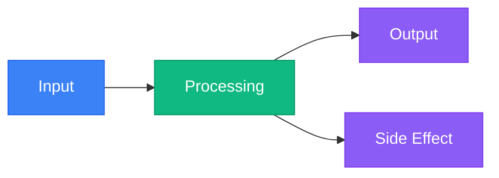

# Build Your First [Feature/Project]

> **Learning Journey:** From zero to working [feature/application] in 45 minutes

## What You'll Build

By the end of this tutorial, you'll have created a fully functional [feature/application] that:

- **[Capability 1]:** [What it does and why it matters]
- **[Capability 2]:** [What it does and why it matters]
- **[Capability 3]:** [What it does and why it matters]

**Final Result Preview:**


::: tip Learning Outcomes
This tutorial is designed to establish foundational understanding of [core concepts], enabling you to build sustainable practices for [domain/technology].
:::

---

## Before You Begin

### What You'll Learn

1. **[Concept 1]:** Understanding [fundamental concept]
2. **[Concept 2]:** Implementing [pattern or practice]
3. **[Concept 3]:** Applying [advanced technique]

### Time Estimate

- **Setup:** 5 minutes
- **Core Tutorial:** 30 minutes
- **Enhancements:** 10 minutes
- **Total:** ~45 minutes

### Prerequisites

Ensure you have the following before starting:

- [ ] [Tool/Software 1] installed (version X.X or higher)
- [ ] [Tool/Software 2] configured
- [ ] Basic understanding of [concept/technology]
- [ ] [Optional] [Nice-to-have prerequisite]

**Verify Your Setup:**
```bash
# Check versions
[tool1] --version  # Should be X.X+
[tool2] --version  # Should be Y.Y+
```

---

## Part 1: Understanding the Fundamentals

Before writing code, let's understand the key concepts behind [feature/application].

### What is [Core Concept]?

[2-3 paragraphs explaining the core concept in simple terms, using analogies if helpful]

**Key Characteristics:**
- **[Characteristic 1]:** [Explanation]
- **[Characteristic 2]:** [Explanation]
- **[Characteristic 3]:** [Explanation]

**Visual Explanation:**



### Why This Approach?

[Explain the rationale for the approach you'll teach, including benefits and trade-offs]

**Benefits:**
- ✅ [Benefit 1]
- ✅ [Benefit 2]
- ✅ [Benefit 3]

**When to Use:**
- ✅ [Scenario 1]
- ✅ [Scenario 2]
- ❌ Not ideal for [scenario]

---

## Part 2: Project Setup

Let's set up the project structure for your [feature/application].

### Step 1: Create Project Directory

```bash
# Create and navigate to project directory
mkdir my-[project-name]
cd my-[project-name]

# Initialize project
[initialization-command]
```

### Step 2: Install Dependencies

```bash
# Install required packages
[package-manager] install [package1] [package2] [package3]
```

**What These Dependencies Do:**

| Package | Purpose | Documentation |
|---------|---------|---------------|
| `[package1]` | [Purpose] | [Link to docs] |
| `[package2]` | [Purpose] | [Link to docs] |
| `[package3]` | [Purpose] | [Link to docs] |

### Step 3: Create Project Structure

```bash
# Create directory structure
mkdir -p src/{[dir1],[dir2],[dir3]}
mkdir -p tests
mkdir -p config
```

**Your project should now look like this:**
```
my-[project-name]/
├── src/
│   ├── [dir1]/
│   ├── [dir2]/
│   └── [dir3]/
├── tests/
├── config/
├── package.json
└── README.md
```

---

## Part 3: Building the Core Feature

Now let's build the core functionality step by step.

### Step 1: Create the Main Component

Create a new file `src/[component-name].[ext]`:

```[language]
// Establish core component to streamline [primary function]
// This component is designed to [business purpose]

[Complete, working code example with extensive comments explaining each part]

// Key patterns demonstrated:
// 1. [Pattern 1]: [Why it's used]
// 2. [Pattern 2]: [Why it's used]
// 3. [Pattern 3]: [Why it's used]
```

**Let's Break This Down:**

1. **Lines 1-5:** [Explanation of code section]
2. **Lines 6-10:** [Explanation of code section]
3. **Lines 11-15:** [Explanation of code section]

::: tip Pro Tip
[Helpful insight or best practice related to this code]
:::

### Step 2: Add Configuration

Create `config/[config-file].[ext]`:

```[language]
// Configuration to support flexible deployment across environments

[Configuration code with comments]
```

**Configuration Options Explained:**

| Option | Description | Default | When to Change |
|--------|-------------|---------|----------------|
| `option1` | [Description] | `value` | [Scenario] |
| `option2` | [Description] | `value` | [Scenario] |

### Step 3: Implement Business Logic

Create `src/[logic-file].[ext]`:

```[language]
// Establish business logic to drive [outcome]

[Code implementation with detailed comments]
```

**Testing Your Logic:**

```bash
# Run unit tests
[test-command]
```

**Expected Output:**
```
✓ [Test 1] - passed
✓ [Test 2] - passed
✓ [Test 3] - passed

3 passing
```

---

## Part 4: Adding Functionality

Enhance your [feature/application] with additional capabilities.

### Enhancement 1: [Feature Name]

This enhancement adds [capability], designed to [benefit].

**Implementation:**

```[language]
// Add [feature] to improve [aspect]

[Code example]
```

**Test It:**
```bash
[test-command]
```

### Enhancement 2: [Feature Name]

Add [another capability] to [benefit].

```[language]
[Code example]
```

---

## Part 5: Testing and Validation

Ensure your [feature/application] works correctly.

### Unit Tests

Create `tests/[test-file].[ext]`:

```[language]
// Comprehensive tests to ensure reliability

[Test code examples]
```

**Run All Tests:**
```bash
[test-command]
```

**Expected Output:**
```
Test Suite: [Feature Name]
  ✓ should [behavior 1]
  ✓ should [behavior 2]
  ✓ should [behavior 3]
  ✓ should handle [edge case]

4 passing (125ms)
```

### Integration Testing

Test the complete workflow:

```bash
# Run integration tests
[integration-test-command]
```

### Manual Validation

Verify functionality manually:

1. **Step 1:** [Action to perform]
   - **Expected Result:** [What should happen]

2. **Step 2:** [Action to perform]
   - **Expected Result:** [What should happen]

3. **Step 3:** [Action to perform]
   - **Expected Result:** [What should happen]

---

## Part 6: Running Your [Feature/Application]

Let's see your creation in action!

### Development Mode

```bash
# Start development server
[dev-command]
```

**You should see:**
```
[Development server output]
```

**Access Your Application:**
- URL: `http://localhost:[port]`
- Example Request: [curl or browser URL]

### Production Build

```bash
# Build for production
[build-command]

# Run production build
[run-command]
```

---

## Complete Code

Here's the complete, working implementation combining all parts:

<details>
<summary>View Complete Code</summary>

**File Structure:**
```
my-[project-name]/
├── src/
│   ├── [component].ts
│   └── [logic].ts
├── config/
│   └── [config].ts
├── tests/
│   └── [test].spec.ts
└── package.json
```

**src/[component].ts:**
```[language]
[Complete code]
```

**src/[logic].ts:**
```[language]
[Complete code]
```

**config/[config].ts:**
```[language]
[Complete code]
```

**tests/[test].spec.ts:**
```[language]
[Complete code]
```

</details>

---

## What You've Learned

Congratulations! You've successfully built a [feature/application]. Let's recap what you learned:

- ✅ **[Concept 1]:** [Summary of learning]
- ✅ **[Concept 2]:** [Summary of learning]
- ✅ **[Concept 3]:** [Summary of learning]
- ✅ **[Skill 1]:** [What you can now do]
- ✅ **[Skill 2]:** [What you can now do]

---

## Next Steps

Now that you've mastered the basics, here are suggested next steps:

### Immediate Enhancements
1. **[Enhancement 1]:** [What to add and why]
   - Tutorial: [Link to related tutorial]

2. **[Enhancement 2]:** [What to add and why]
   - Guide: [Link to guide]

3. **[Enhancement 3]:** [What to add and why]
   - Documentation: [Link to docs]

### Advanced Topics
- **[Advanced Topic 1]:** [Link to advanced guide]
- **[Advanced Topic 2]:** [Link to advanced guide]
- **[Advanced Topic 3]:** [Link to advanced guide]

### Community Projects
- Explore [example projects](link) built by the community
- Share your creation in [community forum](link)
- Contribute to [open-source projects](link)

---

## Troubleshooting

### Issue: [Common Problem 1]

**Symptoms:**
```
[Error message or description]
```

**Solution:**
```bash
# Commands to fix
[fix-command]
```

### Issue: [Common Problem 2]

**Symptoms:**
- [Symptom 1]
- [Symptom 2]

**Solution:**
1. [Step 1 to fix]
2. [Step 2 to fix]
3. [Step 3 to fix]

### Issue: [Common Problem 3]

**Cause:** [Why this happens]

**Solution:**
```[language]
// Updated code fixing the issue
[corrected-code]
```

---

## Additional Challenges

Ready to test your knowledge? Try these challenges:

### Challenge 1: [Challenge Name]
**Difficulty:** ⭐⭐☆☆☆

Modify the code to [challenge description].

<details>
<summary>Hint</summary>

[Helpful hint without giving away the solution]
</details>

<details>
<summary>Solution</summary>

```[language]
[Solution code]
```

**Explanation:** [Why this solution works]
</details>

### Challenge 2: [Challenge Name]
**Difficulty:** ⭐⭐⭐☆☆

Extend functionality to [challenge description].

### Challenge 3: [Challenge Name]
**Difficulty:** ⭐⭐⭐⭐☆

Implement [advanced feature requiring deeper understanding].

---

## Resources

### Related Documentation
- [Concept Guide](/guides/concepts/[concept])
- [API Reference](/api/[api-name])
- [Best Practices](/guides/best-practices)

### Example Projects
- [Simple Example](https://github.com/example/simple)
- [Advanced Example](https://github.com/example/advanced)
- [Production Example](https://github.com/example/production)

### Video Tutorials
- [Video Walkthrough](https://youtube.com/watch?v=example) - 30 minutes
- [Advanced Techniques](https://youtube.com/watch?v=example) - 45 minutes

### Community
- [Discord Channel](https://discord.gg/example)
- [Discussion Forum](https://github.com/discussions)
- [Stack Overflow Tag](https://stackoverflow.com/questions/tagged/[tag])

---

## Feedback

How was this tutorial? We'd love to hear from you:

- ⭐ [Rate this tutorial](https://forms.example.com/tutorial-feedback)
- 💬 [Ask questions in discussions](https://github.com/discussions)
- 🐛 [Report issues](https://github.com/issues)
- 📝 [Suggest improvements](https://github.com/pulls)

---

**Tutorial Complete!** 🎉

You've built your first [feature/application]. Keep exploring and building!

---

**Last Updated:** 2025-10-14 | **Version:** 2.0 | **Difficulty:** Beginner
