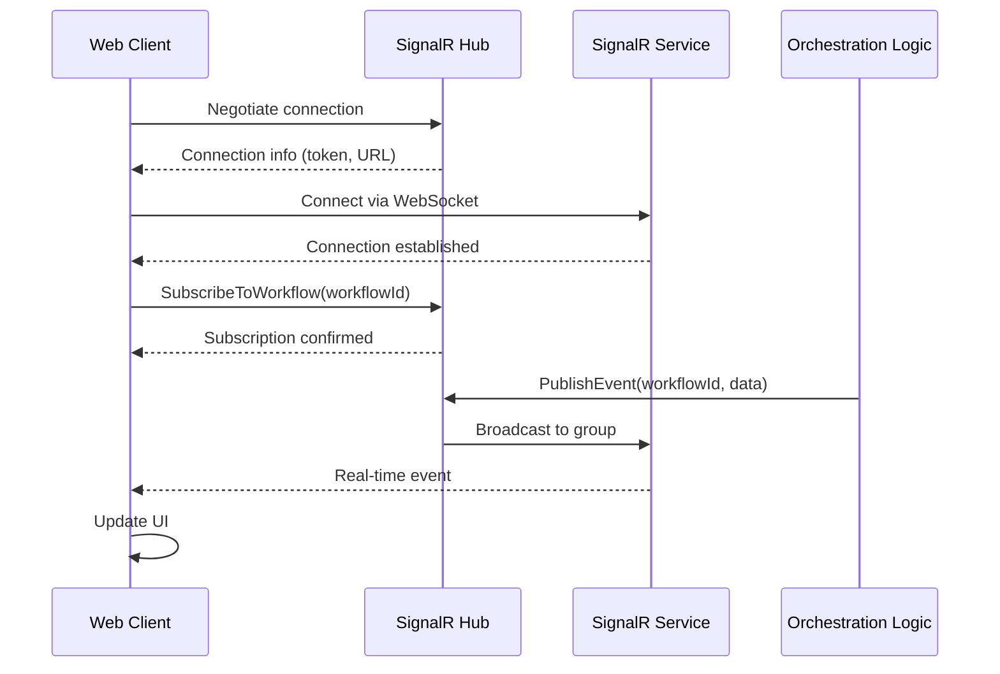

# ADR-003: SignalR for Real-time Communication

## Status
Accepted

## Context

Agent Studio orchestrates complex, multi-step AI workflows that can take several minutes to complete. Users need visibility into workflow execution progress to:

- Monitor task completion status in real-time
- View agent "thoughts" and reasoning as they occur
- Receive immediate feedback on errors or validation failures
- Track resource utilization (tokens, duration, cost)
- Debug workflow issues with live execution traces

Traditional request/response patterns require polling, which:
- Creates unnecessary server load with frequent polling requests
- Introduces latency (1-5 second delays between updates)
- Wastes client bandwidth with redundant requests
- Complicates client-side state management
- Provides poor user experience with stale information

### Requirements

1. **Real-time Updates:** Sub-second latency for workflow events
2. **Bidirectional Communication:** Server push and client subscriptions
3. **Scalability:** Support 1000+ concurrent connections per environment
4. **Reliability:** Automatic reconnection with graceful degradation
5. **Azure Integration:** Seamless integration with existing Azure infrastructure
6. **Developer Experience:** Simple client and server APIs with TypeScript support
7. **Cost Effective:** Minimize operational costs while meeting performance targets

### Constraints

- Must support browser clients (Chrome, Edge, Firefox, Safari)
- Must work through corporate firewalls and proxies
- Must authenticate users via Azure AD tokens
- Must integrate with existing .NET and React codebases
- Must support horizontal scaling across multiple API instances

## Decision

We will implement **Azure SignalR Service with ASP.NET Core SignalR** for real-time bidirectional communication between the orchestration service and web clients.

### Architecture Components

**Server Side (.NET):**
- ASP.NET Core SignalR Hub (`MetaAgentHub`)
- Azure SignalR Service SDK for scale-out
- JWT bearer token authentication
- Hub method authorization with Azure AD roles
- Connection lifecycle management

**Client Side (React):**
- `@microsoft/signalr` TypeScript client library
- Automatic reconnection with exponential backoff
- React hooks for connection state management
- Event subscription and unsubscription
- Error handling and fallback mechanisms

**Infrastructure:**
- Azure SignalR Service (Standard S1 tier for production)
- Application Insights integration for monitoring
- Private endpoints for network isolation

### Communication Pattern



### Hub Methods (Server → Client)

**Client Methods (invoked by server):**
```csharp
public interface IMetaAgentClient
{
    Task ReceiveWorkflowStarted(string workflowId, WorkflowMetadata metadata);
    Task ReceiveWorkflowCompleted(string workflowId, WorkflowResult result);
    Task ReceiveWorkflowFailed(string workflowId, ErrorDetails error);
    Task ReceiveTaskStarted(string taskId, string agentType);
    Task ReceiveTaskCompleted(string taskId, object result);
    Task ReceiveAgentThought(string thought, string reasoning);
    Task ReceiveProgress(int percentage, string message);
    Task ReceiveCheckpointCreated(string checkpointId, DateTime createdAt);
}
```

**Server Methods (invoked by client):**
```csharp
public class MetaAgentHub : Hub<IMetaAgentClient>
{
    public async Task SubscribeToWorkflow(string workflowId);
    public async Task UnsubscribeFromWorkflow(string workflowId);
    public Task<ConnectionInfo> GetConnectionInfo();
}
```

### Azure SignalR Service Configuration

**Service Tier Selection:**

| Environment | Tier | Units | Connections | Messages/Day | Cost/Month |
|-------------|------|-------|-------------|--------------|------------|
| Development | Free | 1 | 20 | 20K | $0 |
| Staging | Standard S1 | 1 | 1,000 | Unlimited | ~$50 |
| Production | Standard S1 | 2-5 | 2,000-5,000 | Unlimited | $100-250 |

**Service Mode:** Default (Hub routes through service for scale-out support)

**Connection Settings:**
- Transport: WebSocket with long-polling fallback
- Timeout: 30 seconds
- Keep-alive: 15 seconds
- Handshake timeout: 15 seconds

**Authentication:**
```csharp
services.AddSignalR()
    .AddAzureSignalR(options =>
    {
        options.ConnectionString = configuration["Azure:SignalR:ConnectionString"];
        options.ServerStickyMode = ServerStickyMode.Required;
    });

// JWT authentication
services.AddAuthentication(JwtBearerDefaults.AuthenticationScheme)
    .AddMicrosoftIdentityWebApi(configuration.GetSection("AzureAd"));
```

### Client Implementation (React)

**Connection Management:**
```typescript
import { HubConnectionBuilder, HubConnection, LogLevel } from '@microsoft/signalr';

export function useSignalR(workflowId: string) {
  const [connection, setConnection] = useState<HubConnection | null>(null);
  const [isConnected, setIsConnected] = useState(false);

  useEffect(() => {
    const newConnection = new HubConnectionBuilder()
      .withUrl('/hubs/meta-agent', {
        accessTokenFactory: () => getAccessToken(),
      })
      .withAutomaticReconnect({
        nextRetryDelayInMilliseconds: (retryContext) => {
          // Exponential backoff: 0, 2s, 4s, 8s, 16s, 30s (max)
          return Math.min(1000 * Math.pow(2, retryContext.previousRetryCount), 30000);
        },
      })
      .configureLogging(LogLevel.Information)
      .build();

    newConnection.on('ReceiveWorkflowStarted', (id, metadata) => {
      console.log('Workflow started:', id, metadata);
      // Update React state
    });

    newConnection.on('ReceiveTaskCompleted', (taskId, result) => {
      console.log('Task completed:', taskId);
      // Update React state
    });

    newConnection.onreconnecting(() => {
      setIsConnected(false);
      console.log('SignalR reconnecting...');
    });

    newConnection.onreconnected(() => {
      setIsConnected(true);
      console.log('SignalR reconnected');
      // Resubscribe to workflow
      newConnection.invoke('SubscribeToWorkflow', workflowId);
    });

    newConnection.onclose(() => {
      setIsConnected(false);
      console.log('SignalR connection closed');
    });

    newConnection
      .start()
      .then(() => {
        setIsConnected(true);
        return newConnection.invoke('SubscribeToWorkflow', workflowId);
      })
      .then(() => {
        console.log('Subscribed to workflow:', workflowId);
      })
      .catch((error) => {
        console.error('SignalR connection error:', error);
      });

    setConnection(newConnection);

    return () => {
      if (newConnection) {
        newConnection.invoke('UnsubscribeFromWorkflow', workflowId);
        newConnection.stop();
      }
    };
  }, [workflowId]);

  return { connection, isConnected };
}
```

### Scaling Strategy

**Horizontal Scaling:**
- Azure SignalR Service handles connection distribution automatically
- Multiple API instances connect to same SignalR Service
- Server sticky mode ensures messages route correctly
- Redis backplane not required (managed by Azure)

**Connection Limits:**
| Tier | Max Connections | Max Concurrent Messages |
|------|----------------|------------------------|
| Free | 20 | 1 msg/sec |
| Standard S1 | 1,000 | Unlimited |
| Standard S2 | 2,000 | Unlimited |
| Standard S5 | 5,000 | Unlimited |
| Standard S10 | 10,000 | Unlimited |

**Auto-scaling Rules:**
- Scale-out: Average connections > 80% capacity for 5 minutes
- Scale-in: Average connections < 40% capacity for 15 minutes
- Min units: 1 (dev/staging), 2 (production)
- Max units: 5 (production)

### Monitoring and Observability

**Application Insights Metrics:**
- Connection count (current, peak, average)
- Message count per minute
- Connection duration histogram
- Reconnection rate
- Error rate by error type

**Custom Metrics:**
```csharp
private readonly Counter<long> _connectionCounter = _meter.CreateCounter<long>(
    "signalr.connections",
    description: "Number of active SignalR connections");

private readonly Histogram<double> _messageLatency = _meter.CreateHistogram<double>(
    "signalr.message.latency",
    unit: "ms",
    description: "Message delivery latency");

public override async Task OnConnectedAsync()
{
    _connectionCounter.Add(1);
    _logger.LogInformation("Client connected: {ConnectionId}", Context.ConnectionId);
    await base.OnConnectedAsync();
}

public override async Task OnDisconnectedAsync(Exception? exception)
{
    _connectionCounter.Add(-1);
    _logger.LogInformation("Client disconnected: {ConnectionId}", Context.ConnectionId);
    await base.OnDisconnectedAsync(exception);
}
```

**Alerts:**
- Connection count exceeds 900 (approaching limit)
- Reconnection rate > 10% (connectivity issues)
- Message latency P95 > 200ms (performance degradation)
- Error rate > 5% (client or server issues)

## Consequences

### Positive

1. **Superior User Experience**
   - Sub-second latency for workflow updates (< 50ms typical)
   - No polling overhead or stale data
   - Immediate visibility into workflow progress
   - Smooth, responsive UI updates

2. **Reduced Server Load**
   - Eliminates 80-95% of polling requests
   - Efficient WebSocket protocol (binary frames)
   - Connection pooling and multiplexing
   - Lower bandwidth consumption

3. **Simplified Client Code**
   - Declarative event handlers with TypeScript
   - Automatic reconnection logic built-in
   - No complex polling state management
   - Strong typing with hub interfaces

4. **Scalability**
   - Azure SignalR Service handles horizontal scaling automatically
   - Supports 1000+ concurrent connections per unit
   - No custom Redis backplane configuration
   - Linear scaling with cost

5. **Developer Productivity**
   - Rich ecosystem with official Microsoft support
   - Excellent documentation and samples
   - Strong TypeScript and .NET integration
   - Built-in Application Insights integration

6. **Reliability**
   - Automatic reconnection with exponential backoff
   - Graceful fallback to long-polling if WebSocket blocked
   - Connection health monitoring
   - Azure SLA (99.9% uptime)

### Negative

1. **Cost**
   - Standard S1 tier: ~$50/month per unit
   - Costs scale linearly with connection count
   - Additional units required for high availability
   - **Mitigation:** Use Free tier for dev, scale only production

2. **Complexity**
   - Additional service to manage and monitor
   - Connection lifecycle requires careful handling
   - Debugging distributed connections can be challenging
   - **Mitigation:** Comprehensive logging, Application Insights integration

3. **Latency Dependency**
   - Events delayed if connection drops
   - Reconnection introduces brief gaps in updates
   - **Mitigation:** Automatic reconnection, replay missed events on reconnect

4. **Firewall/Proxy Issues**
   - Some corporate networks block WebSocket
   - Requires fallback to long-polling (slower)
   - **Mitigation:** Automatic transport negotiation, document firewall requirements

5. **Connection Limits**
   - Free tier limited to 20 connections
   - Must upgrade to Standard for production use
   - **Mitigation:** Clear tier selection guidelines, monitoring alerts

## Alternatives Considered

### Server-Sent Events (SSE)

**Pros:**
- Simpler protocol (HTTP-based)
- Native browser support
- Automatic reconnection

**Cons:**
- Unidirectional (server → client only)
- No binary data support
- Limited browser support (no IE)
- No Azure managed service

**Decision:** Rejected due to lack of bidirectional communication and Azure integration.

### WebSockets (Raw)

**Pros:**
- Full control over protocol
- Maximum performance
- No additional service cost

**Cons:**
- Must implement scaling, reconnection, authentication manually
- No managed service with SLA
- Higher development and maintenance burden
- No built-in monitoring

**Decision:** Rejected due to complexity of building production-grade WebSocket infrastructure.

### Polling (Short/Long)

**Pros:**
- Simple to implement
- Works through all firewalls
- No special infrastructure

**Cons:**
- High latency (1-5 seconds)
- Server load from frequent requests
- Wasted bandwidth
- Poor user experience

**Decision:** Rejected as baseline comparison; unacceptable UX for real-time workflows.

### Azure Event Grid

**Pros:**
- Serverless event routing
- Low cost per event
- Managed service

**Cons:**
- Not designed for browser clients
- Requires polling or webhook endpoints
- Higher latency for end-to-end delivery
- More complex integration

**Decision:** Rejected; optimized for server-to-server, not browser real-time updates.

## Implementation Notes

### Phase 1: Core Real-time Communication (Completed)
- SignalR Hub with basic event types
- React client with automatic reconnection
- Azure SignalR Service integration (Free tier)
- Authentication via Azure AD JWT
- Application Insights monitoring

### Phase 2: Enhanced Features (Next 2 months)
- Message compression for large payloads
- Event replay for missed messages during reconnection
- Connection groups for multi-tenant isolation
- Rate limiting per connection
- Enhanced error handling and retry strategies

### Phase 3: Advanced Scenarios (3-6 months)
- Geographic distribution with multi-region SignalR
- Client-to-client communication for collaboration
- Binary streaming for large result sets
- Custom protocol for specialized agents
- Performance optimization with message batching

## Security Considerations

**Authentication:**
- All connections require valid Azure AD JWT token
- Tokens validated on connection and hub method invocation
- Automatic disconnection on token expiration

**Authorization:**
- Users can only subscribe to workflows they own or have access to
- Hub methods check user roles before executing
- Groups isolated by workflow ownership

**Data Protection:**
- All traffic encrypted via TLS 1.3
- No sensitive data in query strings
- PII redacted from logs and telemetry
- Compliance with data residency requirements

**Rate Limiting:**
- Max 100 messages/second per connection
- Max 10 subscriptions per user
- Automatic throttling with backpressure

## References

- [ASP.NET Core SignalR Documentation](https://docs.microsoft.com/aspnet/core/signalr/)
- [Azure SignalR Service](https://azure.microsoft.com/services/signalr-service/)
- [SignalR JavaScript Client](https://www.npmjs.com/package/@microsoft/signalr)
- [C4 Container Diagram](../architecture/c4-container.mmd)
- [Data Flow Documentation](../architecture/data-flows.md)

---

**Date:** 2025-10-14
**Authors:** Architecture Team
**Reviewers:** Engineering Leadership, DevOps Team
**Status:** Accepted and Implemented

This decision establishes SignalR as the foundation for real-time communication designed to streamline user experience with sub-second workflow updates while maintaining enterprise-grade scalability and reliability.
