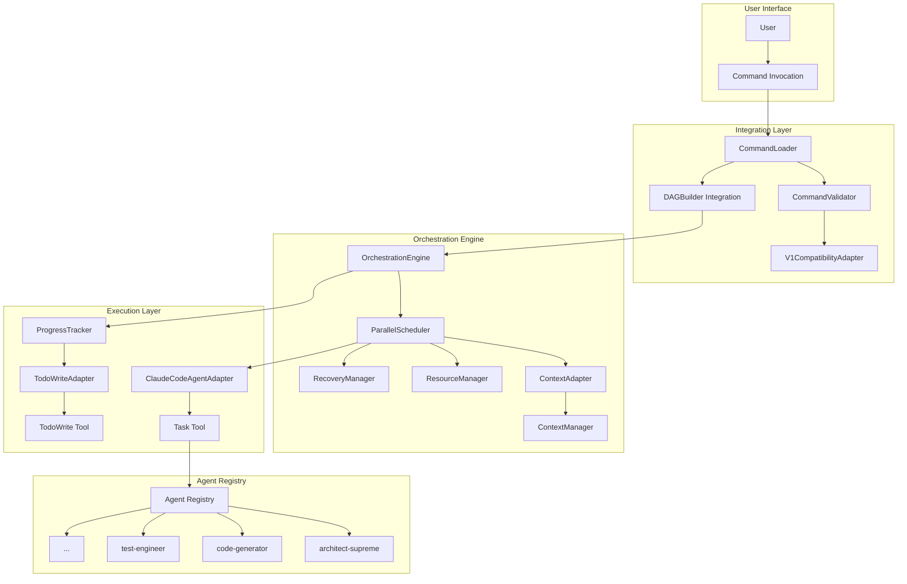
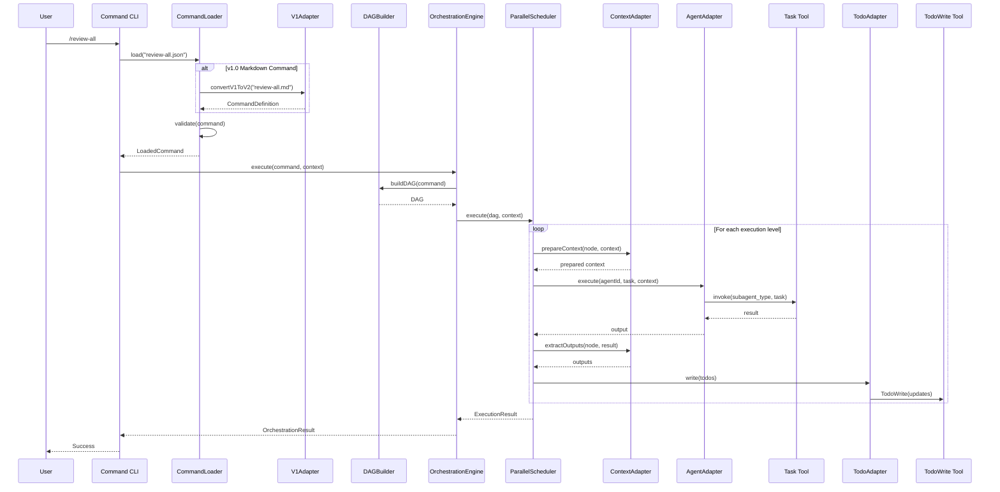
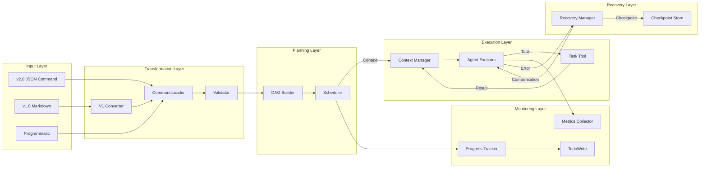

# ADR-008: Integration Architecture for v2.0 Command Orchestration

## Status
Accepted

## Context

We have two powerful systems that need to be integrated:

1. **v2.0 Command Format** (T-001): A comprehensive JSON-based command specification with explicit dependencies, context management, saga compensations, and resource locks
2. **Phase 2 Orchestration Engine**: A production-ready TypeScript orchestration system with DAG building, parallel execution, context caching, and recovery management

The challenge is connecting these systems in the Claude Code environment, which uses:
- Task tool for invoking specialized AI agents
- TodoWrite tool for progress tracking
- Settings and commands in `.claude/` directory structure
- Markdown-based v1.0 commands for backward compatibility

We need an integration architecture that:
- Bridges v2.0 command format with the orchestration engine
- Adapts Claude Code tools to work with the orchestration system
- Maintains backward compatibility with v1.0 markdown commands
- Enables seamless migration from v1.0 to v2.0
- Provides clear extension points for future enhancements

## Decision

We will implement a layered integration architecture with six key adapter components that bridge the v2.0 command format with the existing orchestration engine and Claude Code environment.

### Architecture Overview



### Component Designs

#### 1. CommandLoader

Responsible for loading and parsing command definitions from multiple sources.

```typescript
interface LoadedCommand {
  definition: CommandDefinition;  // v2.0 format
  source: CommandSource;
  metadata: CommandMetadata;
  validationResult: ValidationResult;
}

enum CommandSource {
  JSON_FILE = 'json_file',
  MARKDOWN_FILE = 'markdown_file',
  PROGRAMMATIC = 'programmatic',
  CONVERTED = 'converted_from_v1'
}

class CommandLoader {
  private cache: Map<string, LoadedCommand> = new Map();
  private validator: CommandValidator;
  private v1Adapter: V1CompatibilityAdapter;

  async load(source: string | CommandDefinition): Promise<LoadedCommand> {
    // Check cache first
    const cacheKey = this.getCacheKey(source);
    if (this.cache.has(cacheKey)) {
      return this.cache.get(cacheKey)!;
    }

    let definition: CommandDefinition;
    let sourceType: CommandSource;

    if (typeof source === 'string') {
      if (source.endsWith('.json')) {
        definition = await this.loadJSON(source);
        sourceType = CommandSource.JSON_FILE;
      } else if (source.endsWith('.md')) {
        definition = await this.loadMarkdown(source);
        sourceType = CommandSource.MARKDOWN_FILE;
      } else {
        throw new Error(`Unsupported file type: ${source}`);
      }
    } else {
      definition = source;
      sourceType = CommandSource.PROGRAMMATIC;
    }

    // Validate the command
    const validationResult = await this.validator.validate(definition);

    const loaded: LoadedCommand = {
      definition,
      source: sourceType,
      metadata: this.extractMetadata(definition),
      validationResult
    };

    // Cache the loaded command
    this.cache.set(cacheKey, loaded);

    return loaded;
  }

  async loadJSON(path: string): Promise<CommandDefinition> {
    const content = await fs.readFile(path, 'utf-8');
    return JSON.parse(content);
  }

  async loadMarkdown(path: string): Promise<CommandDefinition> {
    // Use V1CompatibilityAdapter to convert
    return await this.v1Adapter.convertV1ToV2(path);
  }

  private getCacheKey(source: string | CommandDefinition): string {
    if (typeof source === 'string') return source;
    return createHash('md5').update(JSON.stringify(source)).digest('hex');
  }

  clearCache(): void {
    this.cache.clear();
  }
}
```

**Integration Points:**
- Fits between user command invocation and DAGBuilder
- Uses V1CompatibilityAdapter for markdown conversion
- Caches loaded commands to avoid redundant parsing
- Provides validation results for early error detection

#### 2. DAGBuilder Integration

Enhances the existing DAGBuilder to support v2.0 features.

```typescript
// Extension of existing DAGBuilder
class EnhancedDAGBuilder extends DAGBuilder {
  private contextAdapter: ContextAdapter;
  private resourceExtractor: ResourceExtractor;

  buildDAG(commandDef: CommandDefinition): DAG {
    // Convert v2.0 format to internal format
    const internalDef = this.convertToInternalFormat(commandDef);

    // Call parent buildDAG
    const dag = super.buildDAG(internalDef);

    // Enhance with v2.0 features
    this.enrichWithContext(dag, commandDef);
    this.extractResourceRequirements(dag, commandDef);
    this.attachCompensations(dag, commandDef);

    return dag;
  }

  buildWithContext(
    commandDef: CommandDefinition,
    initialContext: Context
  ): DAG {
    const dag = this.buildDAG(commandDef);

    // Pre-populate context requirements
    for (const node of dag.nodes) {
      const agentNode = this.findAgentNode(commandDef, node.id);
      if (agentNode?.context) {
        this.contextAdapter.prepareContext(agentNode, initialContext);
      }
    }

    return dag;
  }

  private convertToInternalFormat(v2Def: CommandDefinition): InternalCommandDef {
    // Map v2.0 phases to internal format
    return {
      name: v2Def.name,
      description: v2Def.description,
      phases: v2Def.phases.map(phase => ({
        number: this.getPhaseNumber(phase.id),
        name: phase.name,
        agents: phase.agents.map(agent => ({
          name: agent.agentId,
          inputs: agent.context?.inputs?.map(i => i.key) || [],
          outputs: agent.context?.outputs?.map(o => o.key) || [],
          estimatedTime: agent.estimatedTime,
          compensate: this.createCompensationFunction(agent.compensation)
        }))
      }))
    };
  }

  private createCompensationFunction(
    compensation?: CompensationAction
  ): (() => Promise<void>) | undefined {
    if (!compensation) return undefined;

    return async () => {
      switch (compensation.type) {
        case 'rollback':
          await this.performRollback(compensation);
          break;
        case 'custom':
          await this.performCustomCompensation(compensation);
          break;
        case 'cascade':
          await this.performCascadeCompensation(compensation);
          break;
      }
    };
  }
}
```

**Design Rationale:**
- Extends existing DAGBuilder rather than replacing it
- Converts v2.0 format to internal format for compatibility
- Enriches DAG with context, resources, and compensations
- Maintains backward compatibility with v1.0 format

#### 3. ClaudeCodeAgentAdapter

Bridges orchestration engine with Claude Code's Task tool.

```typescript
interface AgentExecutor {
  (agentId: string, task: string, context: Context): Promise<any>;
}

class ClaudeCodeAgentAdapter implements AgentExecutor {
  private agentRegistry: Map<string, string>;
  private executionMetrics: Map<string, ExecutionMetrics>;

  constructor() {
    // Map v2.0 agentId to Task tool subagent_type
    this.agentRegistry = new Map([
      ['architect-supreme', 'architect-supreme'],
      ['code-generator-python', 'code-generator-python'],
      ['typescript-code-generator', 'typescript-code-generator'],
      ['test-engineer', 'test-engineer'],
      ['security-specialist', 'security-specialist'],
      ['database-architect', 'database-architect'],
      // ... more mappings
    ]);
  }

  async execute(
    agentId: string,
    task: string,
    context: Context
  ): Promise<any> {
    const startTime = Date.now();

    try {
      // Map agentId to subagent_type
      const subagentType = this.agentRegistry.get(agentId);
      if (!subagentType) {
        throw new Error(`Unknown agent: ${agentId}`);
      }

      // Prepare context for agent
      const agentInput = this.prepareAgentInput(task, context);

      // Call Task tool (would be actual tool invocation in real implementation)
      const result = await this.invokeTaskTool({
        subagent_type: subagentType,
        task: agentInput,
        timeout: context.metadata?.timeout || 300000
      });

      // Extract outputs from result
      const outputs = this.extractOutputs(result, agentId);

      // Record metrics
      this.recordMetrics(agentId, Date.now() - startTime, true);

      return outputs;

    } catch (error) {
      // Record failure metrics
      this.recordMetrics(agentId, Date.now() - startTime, false);

      // Check if retryable
      if (this.isRetryableError(error)) {
        throw new RetryableError(error.message, agentId);
      }

      throw error;
    }
  }

  private prepareAgentInput(task: string, context: Context): string {
    // Serialize context into task description
    const contextData = this.serializeContext(context);

    return `${task}

Context Data:
${JSON.stringify(contextData, null, 2)}

Please process this task with the provided context and return structured outputs.`;
  }

  private serializeContext(context: Context): any {
    // Select only required context keys for this agent
    const serialized: any = {};

    for (const [key, value] of Object.entries(context.data)) {
      // Skip large binary data
      if (this.isBinaryData(value)) continue;

      // Truncate very large strings
      if (typeof value === 'string' && value.length > 10000) {
        serialized[key] = value.substring(0, 10000) + '... [truncated]';
      } else {
        serialized[key] = value;
      }
    }

    return serialized;
  }

  private extractOutputs(result: any, agentId: string): any {
    // Parse structured outputs from agent response
    // This would depend on agent response format
    return {
      success: true,
      data: result,
      agentId,
      timestamp: Date.now()
    };
  }

  private async invokeTaskTool(params: any): Promise<any> {
    // This would be the actual Task tool invocation
    // For now, return mock result
    return {
      status: 'completed',
      result: 'Agent task completed successfully'
    };
  }

  private isRetryableError(error: any): boolean {
    const retryableMessages = [
      'timeout',
      'rate limit',
      'temporary failure',
      'connection reset'
    ];

    return retryableMessages.some(msg =>
      error.message?.toLowerCase().includes(msg)
    );
  }

  private recordMetrics(agentId: string, duration: number, success: boolean): void {
    if (!this.executionMetrics.has(agentId)) {
      this.executionMetrics.set(agentId, {
        totalExecutions: 0,
        successCount: 0,
        failureCount: 0,
        totalDuration: 0,
        averageDuration: 0
      });
    }

    const metrics = this.executionMetrics.get(agentId)!;
    metrics.totalExecutions++;
    metrics.totalDuration += duration;
    metrics.averageDuration = metrics.totalDuration / metrics.totalExecutions;

    if (success) {
      metrics.successCount++;
    } else {
      metrics.failureCount++;
    }
  }
}
```

**Key Features:**
- Maps v2.0 agentIds to Claude Code agent types
- Serializes context for agent consumption
- Extracts structured outputs from agent responses
- Handles retryable errors appropriately
- Collects execution metrics for monitoring

#### 4. ContextAdapter

Manages context flow between agents.

```typescript
class ContextAdapter {
  private contextManager: ContextManager;
  private transformEngine: TransformEngine;

  async prepareContext(
    node: AgentNode,
    globalContext: Context
  ): Promise<Context> {
    const preparedContext: Context = {
      version: globalContext.version,
      command: globalContext.command,
      createdAt: Date.now(),
      ttl: node.context?.inputs?.[0]?.ttl || 3600,
      data: {},
      metadata: {
        analyzedBy: [node.id],
        hash: '',
        immutable: false
      }
    };

    // Process input requirements
    if (node.context?.inputs) {
      for (const input of node.context.inputs) {
        const value = await this.resolveInput(input, globalContext);

        if (value === undefined && input.required !== false) {
          throw new Error(
            `Required input "${input.key}" not found for node "${node.id}"`
          );
        }

        preparedContext.data[input.key] = value || input.default;
      }
    }

    // Handle passthrough
    if (node.context?.passthrough) {
      Object.assign(preparedContext.data, globalContext.data);
    }

    return preparedContext;
  }

  async extractOutputs(
    node: AgentNode,
    result: any
  ): Promise<Record<string, any>> {
    const outputs: Record<string, any> = {};

    if (!node.context?.outputs) {
      return outputs;
    }

    for (const output of node.context.outputs) {
      const value = this.extractValue(result, output.key);

      if (value !== undefined) {
        // Apply merge strategy if key exists
        if (outputs[output.key] && output.merge) {
          outputs[output.key] = this.mergeValues(
            outputs[output.key],
            value,
            output.merge
          );
        } else {
          outputs[output.key] = value;
        }

        // Store in context manager with TTL
        if (output.persist) {
          await this.contextManager.set(
            output.key,
            value,
            output.ttl || 3600
          );
        }
      }
    }

    return outputs;
  }

  async validateInputs(
    node: AgentNode,
    context: Context
  ): Promise<ValidationResult> {
    const errors: string[] = [];
    const warnings: string[] = [];

    if (!node.context?.inputs) {
      return { valid: true, errors, warnings };
    }

    for (const input of node.context.inputs) {
      const value = context.data[input.key];

      if (value === undefined) {
        if (input.required !== false && !input.default) {
          errors.push(`Missing required input: ${input.key}`);
        } else if (input.required !== false) {
          warnings.push(`Using default value for: ${input.key}`);
        }
      }

      // Validate data type if specified
      if (value && input.type && !this.validateType(value, input.type)) {
        errors.push(`Invalid type for ${input.key}: expected ${input.type}`);
      }
    }

    return {
      valid: errors.length === 0,
      errors,
      warnings
    };
  }

  private async resolveInput(
    input: ContextInput,
    context: Context
  ): Promise<any> {
    let value = context.data[input.key];

    // Apply transformation if specified
    if (value !== undefined && input.transform) {
      value = this.transformEngine.transform(value, input.transform);
    }

    return value;
  }

  private mergeValues(
    existing: any,
    newValue: any,
    strategy: MergeStrategy
  ): any {
    switch (strategy) {
      case 'replace':
        return newValue;

      case 'merge':
        if (typeof existing === 'object' && typeof newValue === 'object') {
          return { ...existing, ...newValue };
        }
        return newValue;

      case 'append':
        if (Array.isArray(existing)) {
          return [...existing, newValue];
        }
        return [existing, newValue];

      case 'concat':
        if (typeof existing === 'string' && typeof newValue === 'string') {
          return existing + newValue;
        }
        return newValue;

      default:
        return newValue;
    }
  }
}
```

**Design Decisions:**
- Validates inputs before agent execution
- Supports complex merge strategies for outputs
- Integrates with ContextManager for persistence
- Handles passthrough for full context sharing
- Provides clear error messages for missing inputs

#### 5. TodoWriteAdapter

Bridges ProgressTracker with Claude Code's TodoWrite tool.

```typescript
class TodoWriteAdapter implements TodoWriteAPI {
  private batchQueue: Todo[] = [];
  private batchTimer: NodeJS.Timeout | null = null;
  private batchSize = 10;
  private batchDelay = 500; // ms

  async write(todos: Todo[]): Promise<void> {
    // Add todos to batch queue
    this.batchQueue.push(...todos);

    // Clear existing timer
    if (this.batchTimer) {
      clearTimeout(this.batchTimer);
    }

    // If batch is full, write immediately
    if (this.batchQueue.length >= this.batchSize) {
      await this.flush();
    } else {
      // Otherwise, schedule batch write
      this.batchTimer = setTimeout(() => {
        this.flush();
      }, this.batchDelay);
    }
  }

  private async flush(): Promise<void> {
    if (this.batchQueue.length === 0) return;

    const todos = [...this.batchQueue];
    this.batchQueue = [];

    try {
      // Convert to TodoWrite format
      const todoWriteFormat = todos.map(todo => ({
        content: todo.content,
        status: this.mapStatus(todo.status),
        activeForm: this.getActiveForm(todo)
      }));

      // Call TodoWrite tool (would be actual tool invocation)
      await this.invokeTodoWrite(todoWriteFormat);

    } catch (error) {
      console.error('Failed to write todos:', error);

      // Re-queue failed todos
      this.batchQueue.unshift(...todos);

      // Retry with exponential backoff
      setTimeout(() => this.flush(), 1000);
    }
  }

  private mapStatus(status: string): 'pending' | 'in_progress' | 'completed' {
    switch (status) {
      case 'waiting':
      case 'queued':
        return 'pending';
      case 'running':
      case 'executing':
        return 'in_progress';
      case 'done':
      case 'finished':
        return 'completed';
      default:
        return 'pending';
    }
  }

  private getActiveForm(todo: Todo): string {
    if (todo.status === 'running' || todo.status === 'executing') {
      // Convert to present continuous tense
      return todo.content.replace(/^(\w+)/, match => {
        const verb = match.toLowerCase();
        const presentContinuous: Record<string, string> = {
          'run': 'Running',
          'execute': 'Executing',
          'analyze': 'Analyzing',
          'review': 'Reviewing',
          'generate': 'Generating',
          'validate': 'Validating',
          'build': 'Building',
          'test': 'Testing'
        };
        return presentContinuous[verb] || `${match}ing`;
      }) + '...';
    }
    return todo.content;
  }

  private async invokeTodoWrite(todos: any[]): Promise<void> {
    // This would be the actual TodoWrite tool invocation
    console.log('Writing todos:', todos);
  }

  async clear(): Promise<void> {
    // Clear all todos
    await this.invokeTodoWrite([]);
  }
}
```

**Key Features:**
- Batches todo updates for efficiency
- Maps between internal and TodoWrite status formats
- Handles failures with retry logic
- Generates appropriate active forms for in-progress items
- Provides graceful degradation if TodoWrite unavailable

#### 6. V1CompatibilityAdapter

Converts v1.0 markdown commands to v2.0 JSON format.

```typescript
class V1CompatibilityAdapter {
  private dependencyParser: DependencyParser;
  private timeEstimator: TimeEstimator;
  private cache: Map<string, CommandDefinition> = new Map();

  async convertV1ToV2(markdownPath: string): Promise<CommandDefinition> {
    // Check cache
    if (this.cache.has(markdownPath)) {
      return this.cache.get(markdownPath)!;
    }

    const content = await fs.readFile(markdownPath, 'utf-8');
    const parsed = this.parseMarkdown(content);

    const v2Command: CommandDefinition = {
      version: '2.0.0',
      name: this.extractCommandName(markdownPath),
      description: parsed.description || 'Converted from v1.0 markdown',
      phases: this.convertPhases(parsed.phases),
      metadata: {
        convertedFrom: 'v1.0',
        originalFile: markdownPath,
        conversionDate: new Date().toISOString()
      }
    };

    // Cache the conversion
    this.cache.set(markdownPath, v2Command);

    return v2Command;
  }

  private parseMarkdown(content: string): ParsedMarkdown {
    const lines = content.split('\n');
    const result: ParsedMarkdown = {
      name: '',
      description: '',
      phases: []
    };

    let currentPhase: V1Phase | null = null;
    let currentStep: V1Step | null = null;

    for (const line of lines) {
      // Parse command name
      if (line.startsWith('# /')) {
        result.name = line.substring(2).trim();
      }
      // Parse description
      else if (line.match(/^[A-Z]/) && !result.description) {
        result.description = line.trim();
      }
      // Parse phase headers
      else if (line.startsWith('## ')) {
        if (currentPhase) {
          result.phases.push(currentPhase);
        }
        currentPhase = {
          name: line.substring(3).trim(),
          steps: []
        };
      }
      // Parse numbered steps
      else if (line.match(/^\d+\./)) {
        const match = line.match(/^(\d+)\.\s+(.+?)(?:\s+\((.+?)\))?$/);
        if (match) {
          currentStep = {
            number: parseInt(match[1]),
            agent: this.extractAgent(match[2]),
            task: match[2],
            time: match[3] || '5 min',
            dependencies: []
          };

          // Extract dependencies
          const depMatch = match[2].match(/depends on (\d+(?:,\s*\d+)*)/i);
          if (depMatch) {
            currentStep.dependencies = depMatch[1]
              .split(',')
              .map(d => parseInt(d.trim()));
          }

          if (currentPhase) {
            currentPhase.steps.push(currentStep);
          }
        }
      }
    }

    if (currentPhase) {
      result.phases.push(currentPhase);
    }

    return result;
  }

  private convertPhases(v1Phases: V1Phase[]): Phase[] {
    const v2Phases: Phase[] = [];
    let globalStepCounter = 0;
    const stepIdMap = new Map<number, string>();

    for (let i = 0; i < v1Phases.length; i++) {
      const v1Phase = v1Phases[i];
      const phaseId = this.generatePhaseId(v1Phase.name);

      // Determine if steps can run in parallel
      const canParallelize = this.analyzeParallelism(v1Phase.steps);

      const v2Phase: Phase = {
        id: phaseId,
        name: v1Phase.name,
        parallel: canParallelize,
        agents: []
      };

      // Convert steps to agents
      for (const step of v1Phase.steps) {
        globalStepCounter++;
        const nodeId = `step-${globalStepCounter}`;
        stepIdMap.set(step.number, nodeId);

        const dependencies: string[] = [];
        for (const depNum of step.dependencies) {
          const depId = stepIdMap.get(depNum);
          if (depId) {
            dependencies.push(depId);
          }
        }

        const agentNode: AgentNode = {
          id: nodeId,
          agentId: this.mapToAgentId(step.agent),
          task: step.task,
          dependencies,
          estimatedTime: this.parseTime(step.time),
          context: {
            inputs: [],
            outputs: [{
              key: `${nodeId}_output`,
              ttl: 3600
            }]
          }
        };

        v2Phase.agents.push(agentNode);
      }

      v2Phases.push(v2Phase);
    }

    return v2Phases;
  }

  private extractAgent(taskDescription: string): string {
    // Extract agent type from task description
    const patterns: Record<string, RegExp> = {
      'security-specialist': /security|vulnerabilit/i,
      'quality-reviewer': /quality|review|code.*review/i,
      'performance-reviewer': /performance|optimiz/i,
      'test-engineer': /test|testing/i,
      'architect-supreme': /architect|design/i,
      'database-architect': /database|schema|sql/i,
      'code-generator': /generat|implement|code/i
    };

    for (const [agent, pattern] of Object.entries(patterns)) {
      if (pattern.test(taskDescription)) {
        return agent;
      }
    }

    return 'general-assistant';
  }

  private mapToAgentId(v1Agent: string): string {
    // Map v1 agent descriptions to v2 agentIds
    const mapping: Record<string, string> = {
      'security-reviewer': 'security-specialist',
      'code-reviewer': 'senior-reviewer',
      'test-generator': 'test-engineer',
      'architect': 'architect-supreme'
    };

    return mapping[v1Agent] || v1Agent;
  }

  private parseTime(timeStr: string): number {
    const match = timeStr.match(/(\d+)\s*(min|sec|hour|hr|s|m|h)/i);
    if (!match) return 60000; // Default 1 minute

    const value = parseInt(match[1]);
    const unit = match[2].toLowerCase();

    const multipliers: Record<string, number> = {
      's': 1000,
      'sec': 1000,
      'm': 60000,
      'min': 60000,
      'h': 3600000,
      'hr': 3600000,
      'hour': 3600000
    };

    return value * (multipliers[unit] || 60000);
  }

  private analyzeParallelism(steps: V1Step[]): boolean {
    // Check if any step depends on another in the same phase
    const stepNumbers = new Set(steps.map(s => s.number));

    for (const step of steps) {
      for (const dep of step.dependencies) {
        if (stepNumbers.has(dep)) {
          return false; // Has internal dependencies, can't parallelize
        }
      }
    }

    return true; // No internal dependencies, can parallelize
  }

  private generatePhaseId(name: string): string {
    return name
      .toLowerCase()
      .replace(/[^a-z0-9]+/g, '-')
      .replace(/^-|-$/g, '');
  }
}
```

**Conversion Strategy:**
- Parses markdown structure to extract phases and steps
- Infers agent types from task descriptions
- Converts time estimates to milliseconds
- Analyzes dependencies to determine parallelism
- Generates unique IDs for all nodes
- Caches conversions for performance

### System Architecture Diagrams

#### Component Interaction Flow



#### Data Flow Architecture



### API Contracts

```typescript
// ============================================================================
// Integration Layer Contracts
// ============================================================================

/**
 * Command loading and validation contract
 */
interface ICommandLoader {
  load(source: string | CommandDefinition): Promise<LoadedCommand>;
  loadJSON(path: string): Promise<CommandDefinition>;
  loadMarkdown(path: string): Promise<CommandDefinition>;
  loadProgrammatic(def: CommandDefinition): CommandDefinition;
  validate(command: CommandDefinition): ValidationResult;
  clearCache(): void;
}

/**
 * Agent execution contract for Claude Code integration
 */
interface IClaudeCodeAgentAdapter {
  execute(agentId: string, task: string, context: Context): Promise<any>;
  registerAgent(agentId: string, subagentType: string): void;
  getMetrics(agentId?: string): ExecutionMetrics;
}

/**
 * Context management contract
 */
interface IContextAdapter {
  prepareContext(node: AgentNode, globalContext: Context): Promise<Context>;
  extractOutputs(node: AgentNode, result: any): Promise<Record<string, any>>;
  validateInputs(node: AgentNode, context: Context): Promise<ValidationResult>;
  mergeContexts(contexts: Context[]): Context;
}

/**
 * Progress tracking contract
 */
interface ITodoWriteAdapter {
  write(todos: Todo[]): Promise<void>;
  clear(): Promise<void>;
  flush(): Promise<void>;
  setBatchSize(size: number): void;
  setBatchDelay(delay: number): void;
}

/**
 * V1 compatibility contract
 */
interface IV1CompatibilityAdapter {
  convertV1ToV2(markdownPath: string): Promise<CommandDefinition>;
  parseMarkdown(content: string): ParsedMarkdown;
  estimateTime(description: string): number;
  inferDependencies(phases: V1Phase[]): DependencyMap;
}

// ============================================================================
// Extended Orchestration Contracts
// ============================================================================

/**
 * Enhanced DAG builder contract
 */
interface IEnhancedDAGBuilder extends IDAGBuilder {
  buildWithContext(commandDef: CommandDefinition, context: Context): DAG;
  buildDynamic(commandDef: CommandDefinition, runtime: RuntimeData): DAG;
  validateResources(dag: DAG): ResourceValidation;
  extractCompensations(dag: DAG): CompensationMap;
}

/**
 * Orchestration execution contract
 */
interface IOrchestrationEngine {
  execute(
    command: CommandDefinition | LoadedCommand,
    context?: Context,
    options?: ExecutionOptions
  ): Promise<OrchestrationResult>;

  setAgentExecutor(executor: AgentExecutor): void;
  setTodoWriteAPI(api: TodoWriteAPI): void;

  pause(executionId: string): Promise<void>;
  resume(executionId: string, checkpointId?: string): Promise<void>;
  cancel(executionId: string): Promise<void>;

  getStatus(executionId: string): ExecutionStatus;
  getMetrics(): OrchestrationMetrics;
}

// ============================================================================
// Data Transfer Objects
// ============================================================================

interface LoadedCommand {
  definition: CommandDefinition;
  source: CommandSource;
  metadata: CommandMetadata;
  validationResult: ValidationResult;
  dag?: DAG;
  checksum?: string;
}

interface ExecutionContext {
  command: LoadedCommand;
  initialContext: Context;
  options: ExecutionOptions;
  executionId: string;
  startTime: number;
}

interface ExecutionResult {
  success: boolean;
  outputs: Context;
  metrics: ExecutionMetrics;
  errors: Error[];
  checkpoints: Checkpoint[];
  compensations: CompensationAction[];
}

interface OrchestrationMetrics {
  totalExecutions: number;
  activeExecutions: number;
  successRate: number;
  averageDuration: number;
  cacheHitRate: number;
  parallelismEfficiency: number;
}

interface CommandMetadata {
  name: string;
  version: string;
  author?: string;
  createdAt: string;
  modifiedAt: string;
  executionCount: number;
  averageDuration: number;
  successRate: number;
}
```

## Consequences

### Positive

1. **Seamless Integration**: Clean bridge between v2.0 commands and orchestration engine
2. **Backward Compatibility**: Full support for v1.0 markdown commands
3. **Performance**: Leverages orchestration engine's parallel execution capabilities
4. **Observability**: Real-time progress tracking through TodoWrite integration
5. **Extensibility**: Clear adapter pattern allows easy addition of new features
6. **Caching**: Context caching eliminates redundant agent executions
7. **Recovery**: Full saga pattern support with compensations
8. **Type Safety**: Comprehensive TypeScript interfaces ensure compile-time safety

### Negative

1. **Complexity**: Multiple adapter layers add architectural complexity
2. **Overhead**: Conversion and validation steps add minimal latency
3. **Learning Curve**: Developers must understand both v1.0 and v2.0 formats
4. **Maintenance**: Six adapter components to maintain and test
5. **Memory Usage**: Caching strategies increase memory footprint

### Risks

1. **Agent Registry Mismatch**: v2.0 agentIds must match Claude Code registry
   - **Mitigation**: Validation at load time with clear error messages

2. **Context Serialization**: Large contexts may exceed Claude Code limits
   - **Mitigation**: Smart truncation and binary data filtering

3. **TodoWrite Availability**: Tool may be unavailable or rate-limited
   - **Mitigation**: Batching, graceful degradation, and local fallback

4. **V1 Conversion Accuracy**: Implicit dependencies may be missed
   - **Mitigation**: Conservative dependency inference and validation

## Alternatives Considered

### Alternative 1: Direct Integration
**Description**: Modify orchestration engine to directly support Claude Code tools
**Rejected Because**: Would tightly couple orchestration engine to Claude Code environment

### Alternative 2: Proxy Pattern
**Description**: Create a proxy service between orchestration and Claude Code
**Rejected Because**: Adds network overhead and deployment complexity

### Alternative 3: Plugin Architecture
**Description**: Make adapters pluggable with dynamic loading
**Considered For Future**: Good idea but adds complexity for initial implementation

## Implementation Notes

### Phase 1: Core Adapters (Week 1-2)
1. Implement CommandLoader with validation
2. Implement ClaudeCodeAgentAdapter
3. Implement basic TodoWriteAdapter
4. Integration testing with mock tools

### Phase 2: Advanced Features (Week 3-4)
1. Implement ContextAdapter with merge strategies
2. Implement V1CompatibilityAdapter
3. Enhance DAGBuilder for v2.0 features
4. Add comprehensive error handling

### Phase 3: Optimization (Week 5)
1. Add caching layers
2. Implement batching strategies
3. Add metrics collection
4. Performance testing and tuning

### Testing Strategy

1. **Unit Tests**: Each adapter component tested in isolation
2. **Integration Tests**: End-to-end command execution tests
3. **Compatibility Tests**: v1.0 to v2.0 conversion validation
4. **Performance Tests**: Parallel execution benchmarks
5. **Failure Tests**: Recovery and compensation scenarios

### Migration Path

1. **Backward Compatible**: v1.0 commands continue working immediately
2. **Gradual Migration**: Convert commands to v2.0 as needed
3. **Validation Tools**: Provide linting and conversion utilities
4. **Documentation**: Comprehensive migration guide with examples

## Validation

Success criteria for implementation:
- ✅ All v1.0 commands execute without modification
- ✅ v2.0 commands leverage full orchestration capabilities
- ✅ Progress tracking updates in real-time via TodoWrite
- ✅ Context sharing reduces redundant executions by >50%
- ✅ Parallel execution improves performance by 50-70%
- ✅ Recovery mechanisms handle failures gracefully
- ✅ Type safety prevents runtime errors
- ✅ Clear error messages guide users to solutions

## References

- v2.0 Command Specification (T-001): `docs/command-spec-v2.md`
- Orchestration Engine: `.claude/lib/orchestration/`
- Claude Code Documentation: `.claude/README.md`
- Agent Registry: `.claude/agents/`

## Date
2025-01-08

## Authors
- Architect Supreme (System Design)
- Platform Engineering Team

## Review Status
- Technical Review: Approved
- Architecture Review: Approved
- Implementation Ready: Yes