# API Architecture Diagrams

## Overview Architecture

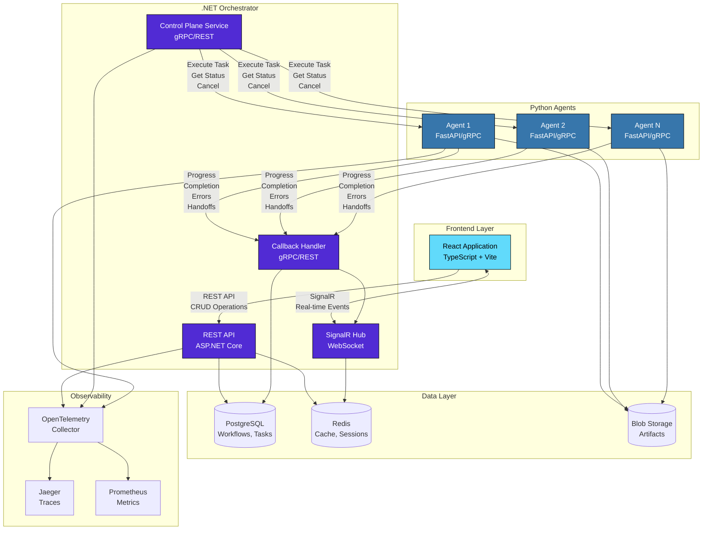

---

## API Communication Flow

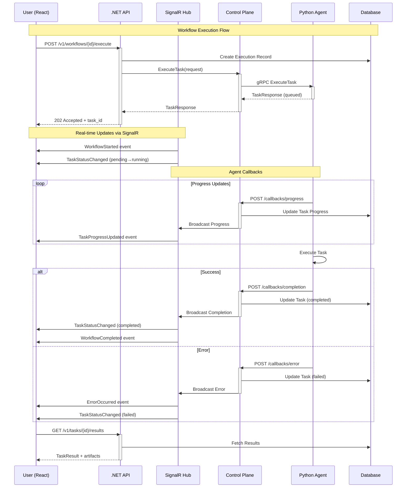

---

## SignalR Event Flow

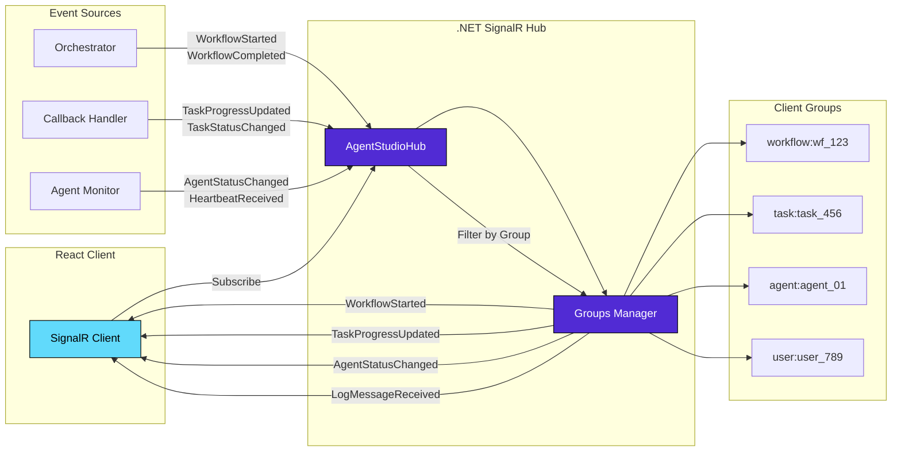

---

## Authentication Flow (OAuth 2.0 + PKCE)

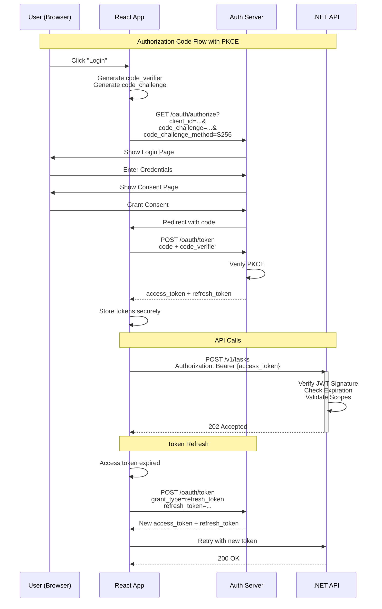

---

## Rate Limiting Architecture

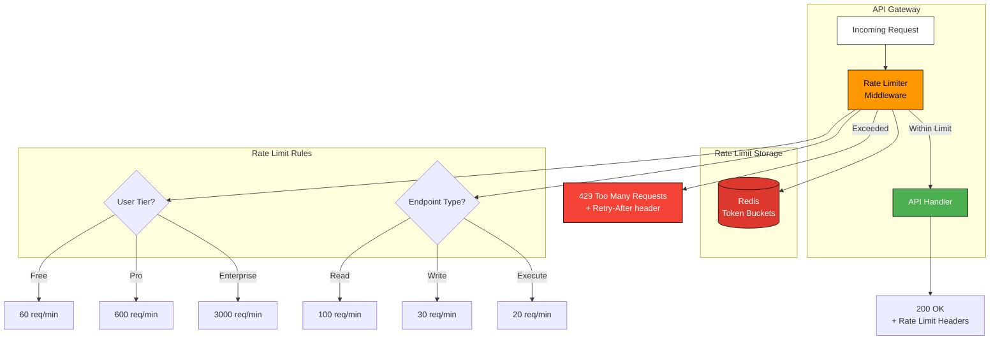

---

## Error Handling Flow

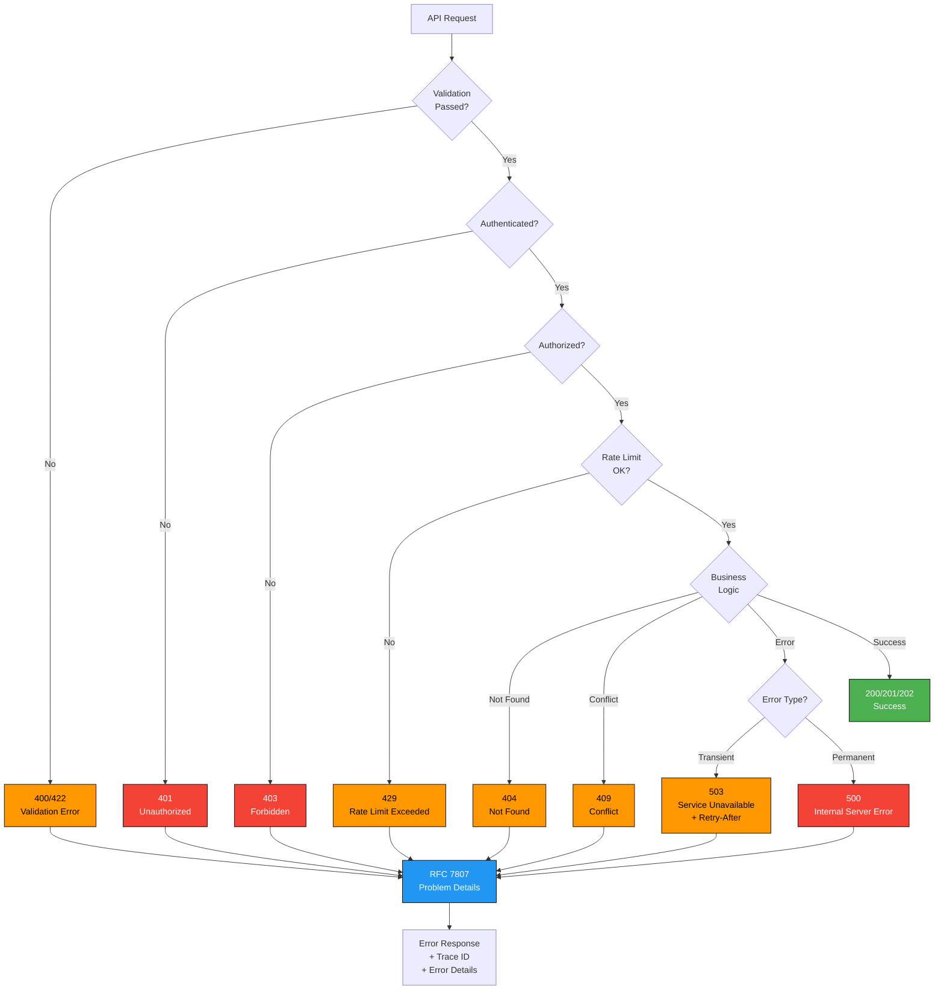

---

## gRPC vs REST Decision Tree

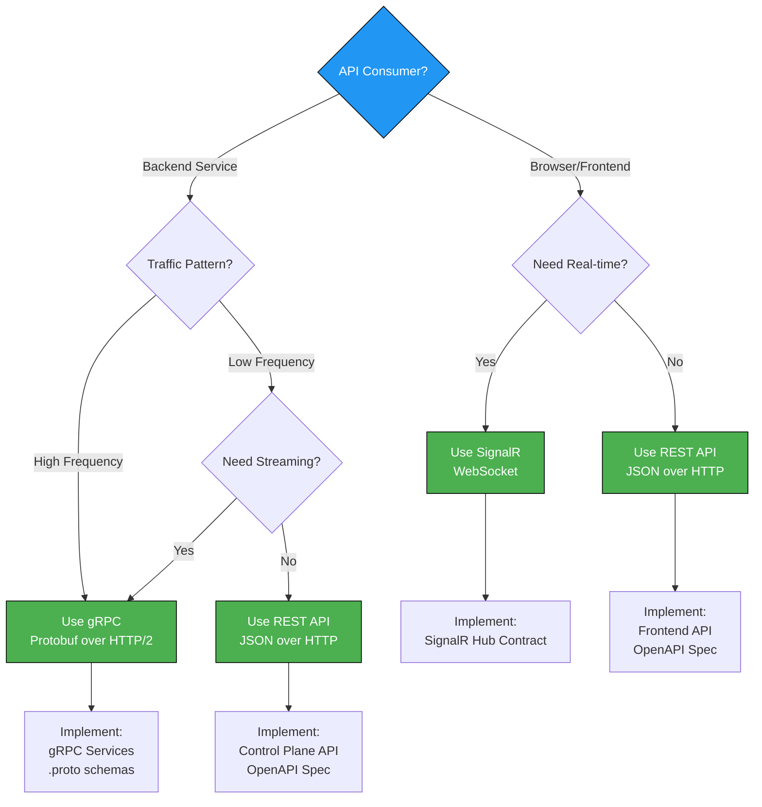

---

## Deployment Architecture

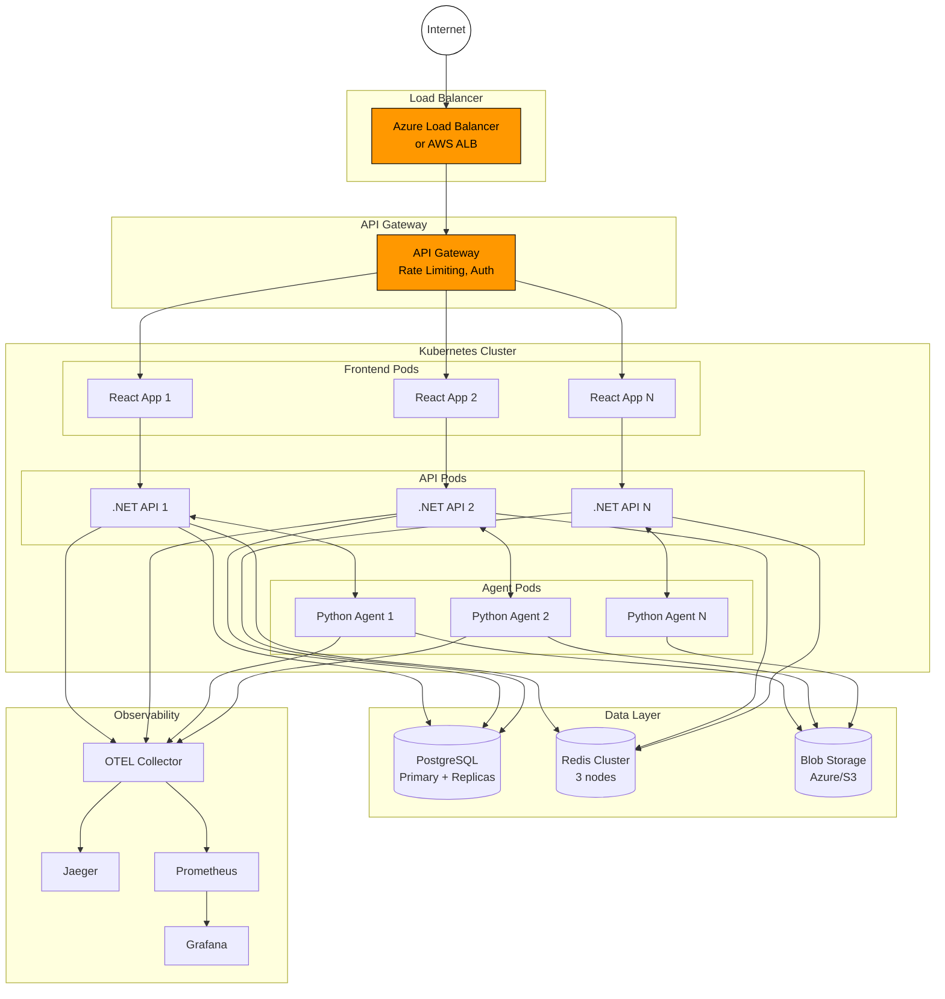

---

## Monitoring Dashboard Layout

```mermaid
graph TB
    subgraph "Grafana Dashboard"
        subgraph "System Metrics"
            CPU[CPU Usage<br/>Time Series]
            Memory[Memory Usage<br/>Time Series]
            Network[Network I/O<br/>Time Series]
        end

        subgraph "API Metrics"
            ReqRate[Request Rate<br/>Counter Graph]
            Latency[Latency p50/p95/p99<br/>Histogram]
            Errors[Error Rate<br/>Pie Chart]
        end

        subgraph "Business Metrics"
            Tasks[Active Tasks<br/>Gauge]
            Workflows[Workflow Executions<br/>Bar Chart]
            Agents[Agent Status<br/>Status Panel]
        end

        subgraph "Alerts"
            Alert1[High Error Rate<br/>> 1%]
            Alert2[High Latency<br/>p95 > 500ms]
            Alert3[Agent Offline<br/>> 5 min]
        end
    end

    subgraph "Data Sources"
        Prometheus[(Prometheus)]
        Jaeger[(Jaeger)]
        Logs[(Elasticsearch)]
    end

    Prometheus --> CPU
    Prometheus --> Memory
    Prometheus --> Network
    Prometheus --> ReqRate
    Prometheus --> Latency
    Prometheus --> Errors
    Prometheus --> Tasks
    Prometheus --> Workflows
    Prometheus --> Agents

    Prometheus --> Alert1
    Prometheus --> Alert2
    Prometheus --> Alert3

    style CPU fill:#4caf50,stroke:#000,color:#fff
    style Memory fill:#4caf50,stroke:#000,color:#fff
    style Network fill:#4caf50,stroke:#000,color:#fff
    style Alert1 fill:#f44336,stroke:#000,color:#fff
    style Alert2 fill:#f44336,stroke:#000,color:#fff
    style Alert3 fill:#f44336,stroke:#000,color:#fff
```

---

## API Lifecycle Management

```mermaid
graph LR
    Design[1. API Design<br/>OpenAPI/Protobuf] --> Mock[2. Mock Server<br/>Prism/gRPC Mock]
    Mock --> Contract[3. Contract Tests<br/>Pact/Spectral]
    Contract --> Implement[4. Implementation<br/>.NET/Python]
    Implement --> Test[5. Integration Tests<br/>Postman/k6]
    Test --> Deploy[6. Deployment<br/>Kubernetes]
    Deploy --> Monitor[7. Monitoring<br/>Grafana/Jaeger]
    Monitor --> Version[8. Versioning<br/>Deprecation]
    Version --> Design

    style Design fill:#2196f3,stroke:#000,color:#fff
    style Mock fill:#4caf50,stroke:#000,color:#fff
    style Contract fill:#4caf50,stroke:#000,color:#fff
    style Implement fill:#ff9800,stroke:#000,color:#000
    style Test fill:#4caf50,stroke:#000,color:#fff
    style Deploy fill:#9c27b0,stroke:#000,color:#fff
    style Monitor fill:#9c27b0,stroke:#000,color:#fff
    style Version fill:#2196f3,stroke:#000,color:#fff
```

---

## Complete Data Flow Example

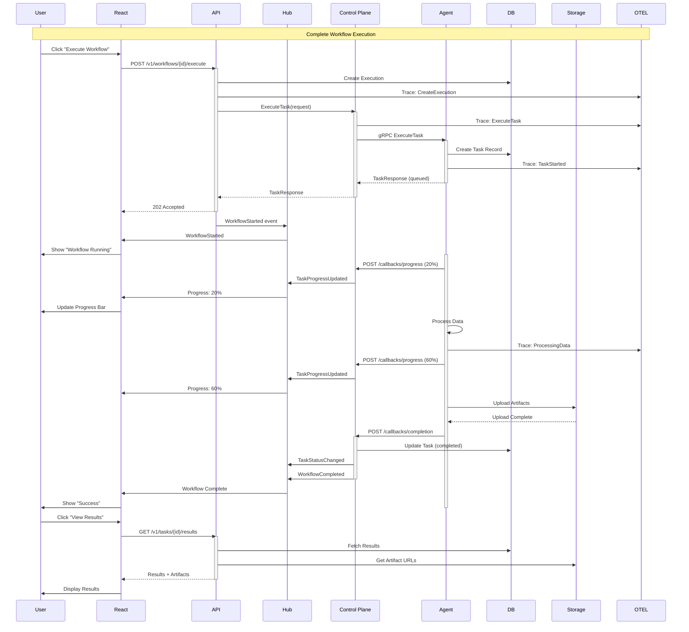

---

These diagrams provide a comprehensive visual representation of the API architecture, covering all major aspects of the system.
