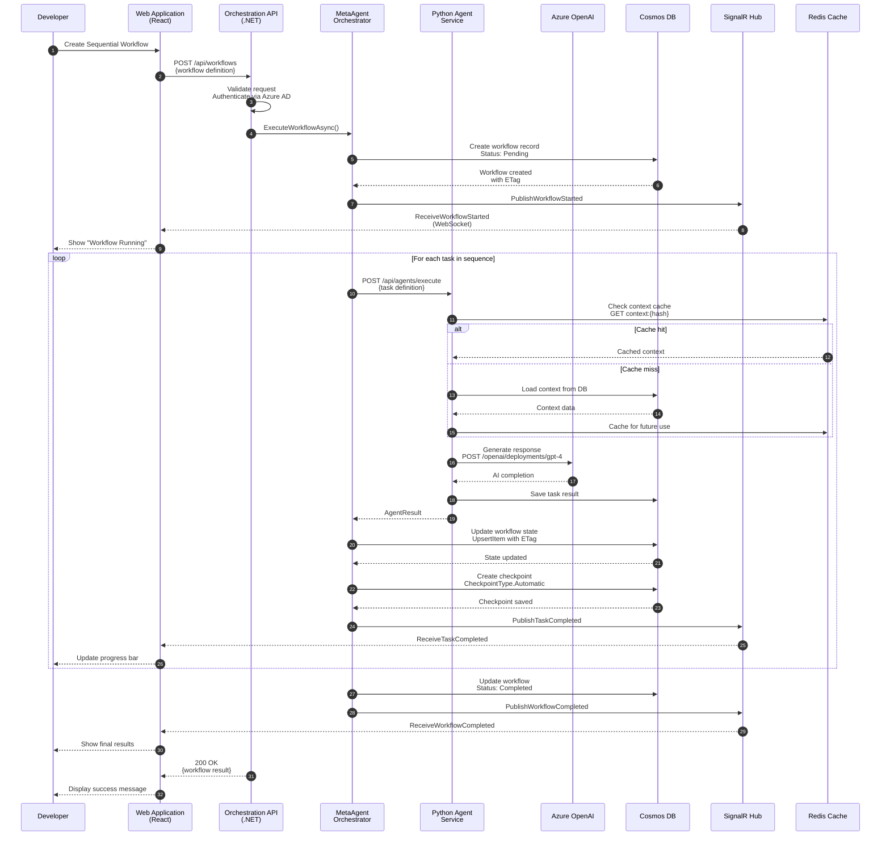
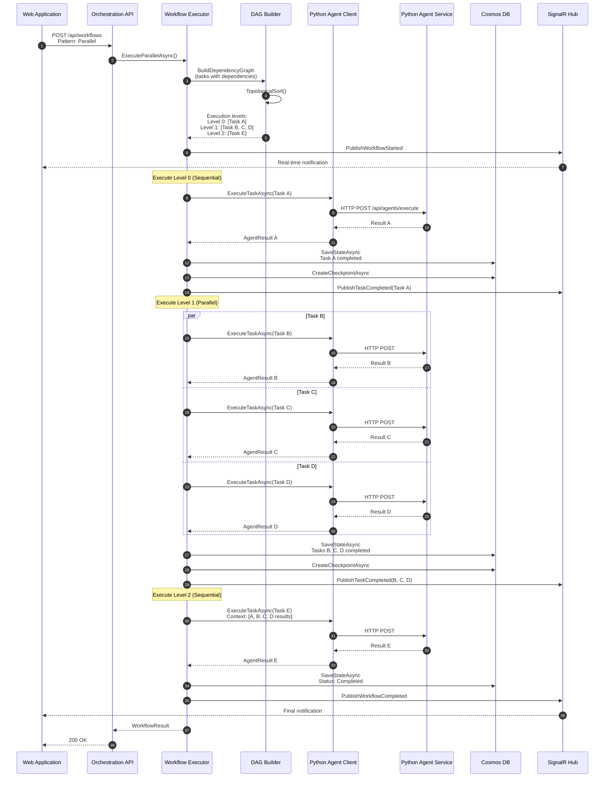
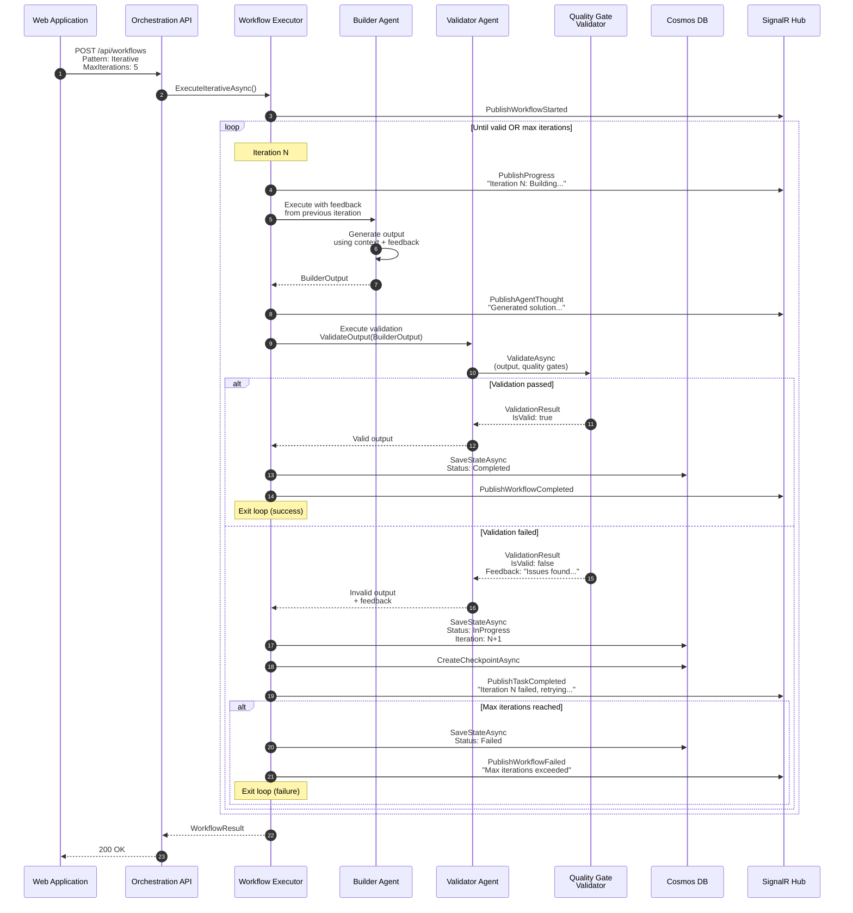
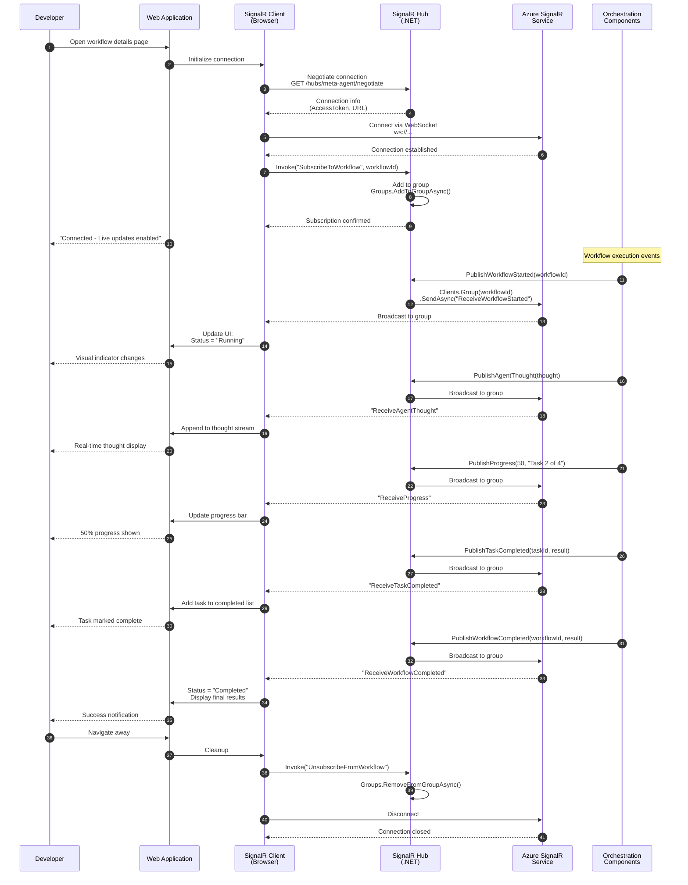
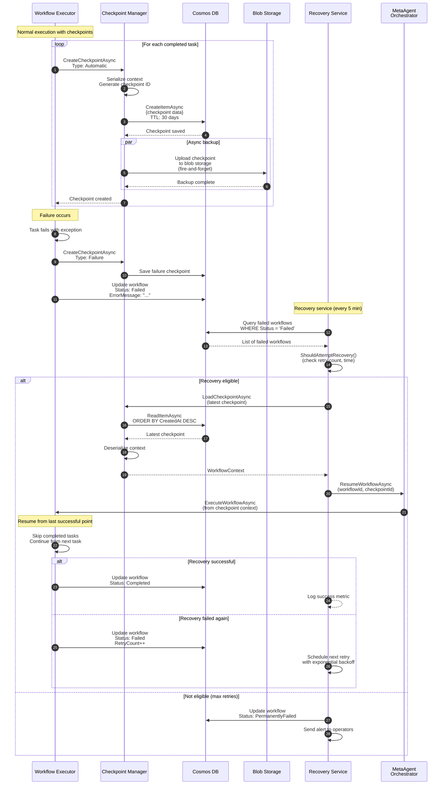
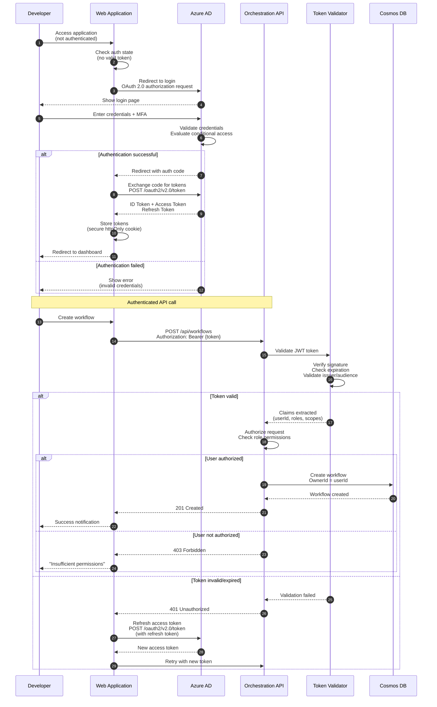
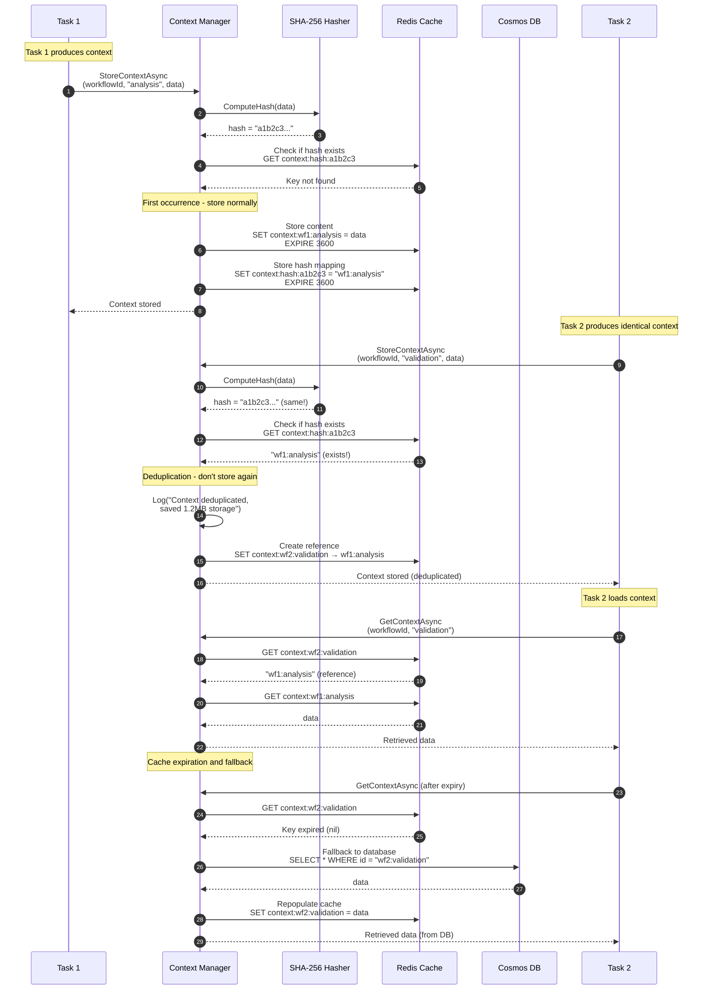

# Data Flow Documentation - Agent Studio

## Overview
This document establishes comprehensive data flow patterns across Agent Studio's distributed architecture, showing how information moves through the platform to streamline workflow execution, state management, and real-time communication.

**Best for:** Engineers implementing integrations or debugging issues requiring understanding of end-to-end data movement across services.

## Primary Data Flows

### 1. Workflow Execution Flow (Sequential Pattern)

This flow demonstrates how a sequential workflow moves through the platform from creation to completion, with state persistence and real-time updates.



**Key Points:**
- **Optimistic Concurrency:** Cosmos DB uses ETag for conflict detection
- **Context Caching:** Redis reduces redundant Cosmos DB reads by 80%
- **Real-time Updates:** SignalR provides live progress without polling
- **Checkpointing:** Automatic checkpoints after each task enable recovery
- **Async Communication:** All I/O operations use async/await for efficiency

**Performance Metrics:**
- Workflow creation: < 500ms
- Task execution: 2-10s (depends on LLM complexity)
- State persistence: < 100ms
- Real-time event delivery: < 50ms

---

### 2. Parallel Workflow Execution with DAG Scheduling

This flow shows how parallel tasks execute concurrently with dependency management and level-based scheduling.



**Parallelization Benefits:**
- **Time Savings:** 3 tasks run in parallel instead of sequence
- **Resource Utilization:** Multiple Python agent instances handle concurrent requests
- **Dependency Respect:** Level-based execution ensures dependencies are satisfied
- **Failure Isolation:** One task failure doesn't block independent tasks

**Example Timeline:**
```
Sequential:  A(5s) → B(8s) → C(6s) → D(7s) → E(10s) = 36 seconds
Parallel:    A(5s) → [B,C,D](8s) → E(10s) = 23 seconds
Speedup:     36% faster execution
```

---

### 3. Iterative Workflow with Validation Feedback

This flow demonstrates the Builder-Validator pattern with iterative refinement based on quality gate feedback.



**Feedback Loop Mechanism:**
```json
// Iteration 1: Initial attempt
{
  "builderPrompt": "Design a REST API for user management",
  "feedback": null
}

// Iteration 2: With validator feedback
{
  "builderPrompt": "Design a REST API for user management",
  "feedback": "Missing authentication endpoints. Add OAuth 2.0 support."
}

// Iteration 3: Refined with accumulated feedback
{
  "builderPrompt": "Design a REST API for user management",
  "feedback": "OAuth endpoints added but missing rate limiting. Add throttling."
}
```

**Quality Gates Example:**
```json
{
  "qualityGates": [
    {
      "name": "Schema Validation",
      "type": "JsonSchema",
      "schema": {...}
    },
    {
      "name": "Security Check",
      "type": "LLM",
      "prompt": "Validate that all endpoints require authentication"
    },
    {
      "name": "Performance",
      "type": "Custom",
      "maxExecutionTimeMs": 5000
    }
  ]
}
```

---

### 4. Real-time Event Broadcasting with SignalR

This flow shows how real-time events propagate from backend services to connected web clients via SignalR.



**Event Types and Payloads:**

**WorkflowStarted:**
```json
{
  "workflowId": "wf_abc123",
  "name": "Customer Onboarding",
  "pattern": "Sequential",
  "estimatedDurationMs": 30000,
  "startedAt": "2025-10-14T10:00:00Z"
}
```

**AgentThought:**
```json
{
  "workflowId": "wf_abc123",
  "taskId": "task_001",
  "agentType": "Architect",
  "thought": "Analyzing requirements to design scalable system architecture...",
  "timestamp": "2025-10-14T10:00:15Z"
}
```

**Progress:**
```json
{
  "workflowId": "wf_abc123",
  "percentage": 50,
  "message": "Task 2 of 4 completed",
  "currentTask": "Builder Agent executing...",
  "timestamp": "2025-10-14T10:00:30Z"
}
```

**TaskCompleted:**
```json
{
  "workflowId": "wf_abc123",
  "taskId": "task_002",
  "agentType": "Builder",
  "result": {...},
  "durationMs": 8500,
  "tokenUsage": {"prompt": 1200, "completion": 800},
  "timestamp": "2025-10-14T10:00:45Z"
}
```

**Connection Management:**
- **Automatic Reconnection:** Client retries with exponential backoff (1s, 2s, 4s, 8s, 16s max)
- **Keep-Alive:** Ping every 30s to detect stale connections
- **Graceful Degradation:** Falls back to long-polling if WebSocket unavailable
- **Group Isolation:** Clients only receive events for subscribed workflows

---

### 5. Checkpoint and Recovery Flow

This flow demonstrates how checkpoints enable workflow recovery after failures or interruptions.



**Checkpoint Storage Strategy:**

**Cosmos DB (Primary - Fast Access):**
- Stores checkpoints with 30-day TTL
- Enables fast loading for recovery
- Partitioned by workflowId for parallel queries
- Automatic cleanup via TTL

**Blob Storage (Backup - Long-term):**
- Async backup for disaster recovery
- Lifecycle management (Hot → Cool → Archive)
- Retention: 365 days
- Cheaper long-term storage

**Checkpoint Content:**
```json
{
  "id": "cp_xyz789",
  "workflowId": "wf_abc123",
  "type": "Automatic",
  "createdAt": "2025-10-14T10:00:30Z",
  "state": {
    "completedTasks": ["task_001", "task_002"],
    "pendingTasks": ["task_003", "task_004"],
    "context": {
      "customerId": "cust_456",
      "regionAnalysis": {...}
    },
    "metrics": {
      "durationMs": 15000,
      "totalTokens": 2500
    }
  },
  "metadata": {
    "tasksCompleted": 2,
    "totalTasks": 4,
    "progressPercentage": 50
  },
  "ttl": 2592000
}
```

**Recovery Decision Logic:**
```csharp
private bool ShouldAttemptRecovery(WorkflowState workflow)
{
    // Don't retry if max attempts exceeded
    if (workflow.RetryCount >= MaxRetryAttempts) return false;

    // Don't retry if too old (> 24 hours)
    if (DateTime.UtcNow - workflow.FailedAt > TimeSpan.FromHours(24)) return false;

    // Check if enough time passed since last retry (exponential backoff)
    var backoffMinutes = Math.Pow(2, workflow.RetryCount); // 1, 2, 4, 8, 16 min
    if (DateTime.UtcNow - workflow.LastRetryAt < TimeSpan.FromMinutes(backoffMinutes)) return false;

    // Check if error is retryable (not permanent errors like auth failure)
    if (IsPermanentError(workflow.ErrorCode)) return false;

    return true;
}
```

---

### 6. Authentication and Authorization Flow

This flow shows how user authentication propagates through the platform using Azure AD and JWT tokens.



**Token Structure (JWT):**

**Header:**
```json
{
  "typ": "JWT",
  "alg": "RS256",
  "kid": "key-id-123"
}
```

**Payload:**
```json
{
  "iss": "https://login.microsoftonline.com/{tenant-id}/v2.0",
  "sub": "user-object-id",
  "aud": "api://agent-studio",
  "exp": 1697293200,
  "iat": 1697289600,
  "nbf": 1697289600,
  "name": "John Developer",
  "preferred_username": "john@example.com",
  "roles": ["Workflow.Create", "Workflow.Read", "Workflow.Execute"],
  "scp": "user_impersonation"
}
```

**Authorization Policies:**
```csharp
[Authorize(Policy = "WorkflowCreate")]
[HttpPost("api/workflows")]
public async Task<ActionResult<WorkflowResponse>> CreateWorkflow(...)

// Policy definition
services.AddAuthorization(options =>
{
    options.AddPolicy("WorkflowCreate", policy =>
        policy.RequireRole("Workflow.Create"));

    options.AddPolicy("WorkflowExecute", policy =>
        policy.RequireRole("Workflow.Execute"));

    options.AddPolicy("AdminOnly", policy =>
        policy.RequireRole("Admin"));
});
```

**Role-Based Access Control (RBAC):**
- **Admin:** Full access to all workflows and configurations
- **Developer:** Create, read, execute, and delete own workflows
- **Operator:** Read-only access for monitoring and troubleshooting
- **Business Analyst:** Read workflows, configure quality gates

---

### 7. Context Deduplication and Caching Flow

This flow demonstrates how the Context Manager eliminates redundant storage and improves performance through intelligent caching.



**Deduplication Benefits:**

**Storage Savings:**
```
Without deduplication:
- Workflow 1: 2.5 MB context
- Workflow 2: 2.5 MB context (identical)
- Workflow 3: 2.5 MB context (identical)
Total: 7.5 MB

With deduplication:
- Workflow 1: 2.5 MB context (stored)
- Workflow 2: Reference to WF1 (< 1 KB)
- Workflow 3: Reference to WF1 (< 1 KB)
Total: ~2.5 MB (70% reduction)
```

**Performance Impact:**
- Cache hit rate: 85%+
- Average retrieval time: 5ms (Redis) vs 50ms (Cosmos DB)
- LLM API call reduction: 80% (cached context reused)

**Hash Collision Handling:**
```csharp
private async Task<string> StoreContextWithCollisionDetection(
    string workflowId,
    string key,
    object value)
{
    var json = JsonSerializer.Serialize(value);
    var hash = ComputeSHA256(json);

    var existingKey = await _redis.StringGetAsync($"context:hash:{hash}");

    if (existingKey.HasValue)
    {
        // Verify content actually matches (paranoid check for hash collision)
        var existingJson = await _redis.StringGetAsync(existingKey.ToString());
        if (existingJson.ToString() == json)
        {
            // True deduplication
            _logger.LogDebug("Context deduplicated: {Hash}", hash);
            await _redis.StringSetAsync($"context:{workflowId}:{key}", existingKey.ToString());
            return hash;
        }
        else
        {
            // Hash collision detected (extremely rare with SHA-256)
            _logger.LogWarning("SHA-256 hash collision detected! Using fallback.");
            hash = $"{hash}_{Guid.NewGuid():N}";
        }
    }

    // Store new content
    await _redis.StringSetAsync($"context:{workflowId}:{key}", json, TimeSpan.FromHours(1));
    await _redis.StringSetAsync($"context:hash:{hash}", $"{workflowId}:{key}");

    return hash;
}
```

## Performance Optimization Patterns

### 1. Async I/O Throughout
All database and HTTP operations use async/await to prevent thread blocking and maximize throughput.

### 2. Parallel Execution
Independent tasks execute concurrently using Task.WhenAll() for optimal resource utilization.

### 3. Caching Strategy
- **L1 Cache:** In-memory dictionary for hot data (< 1ms access)
- **L2 Cache:** Redis for shared data across instances (5-10ms access)
- **L3 Storage:** Cosmos DB for persistent storage (50-100ms access)

### 4. Connection Pooling
HTTP clients and database connections are pooled and reused to eliminate connection overhead.

### 5. Batching
Multiple state updates are batched into single Cosmos DB transactions to reduce round trips.

## Related Documentation

- [C4 System Context](c4-system-context.mmd) - High-level system overview
- [C4 Container Diagram](c4-container.mmd) - Service architecture
- [C4 Component Diagram](c4-orchestration-components.mmd) - Internal components
- [ADR-002: Meta-Agent Architecture](../adrs/002-meta-agent-architecture.md)
- [ADR-010: Context Manager Design](../adrs/ADR-010-context-manager-design.md)

---

**Version:** 1.0.0
**Last Updated:** 2025-10-14
**Maintained By:** Architecture Team
**Review Cycle:** Quarterly or on major architecture changes

This data flow documentation establishes comprehensive understanding of information movement designed to streamline troubleshooting, optimization, and integration across Agent Studio's distributed architecture.
