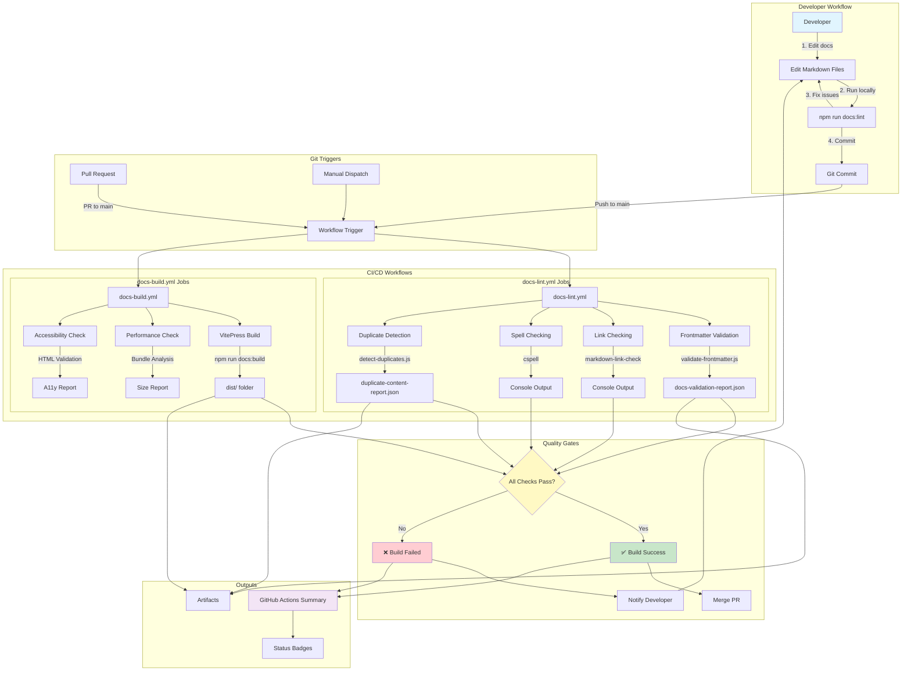
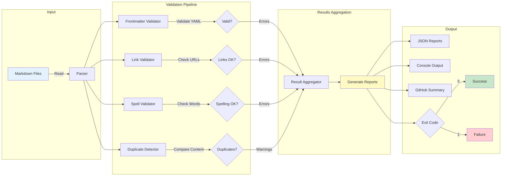
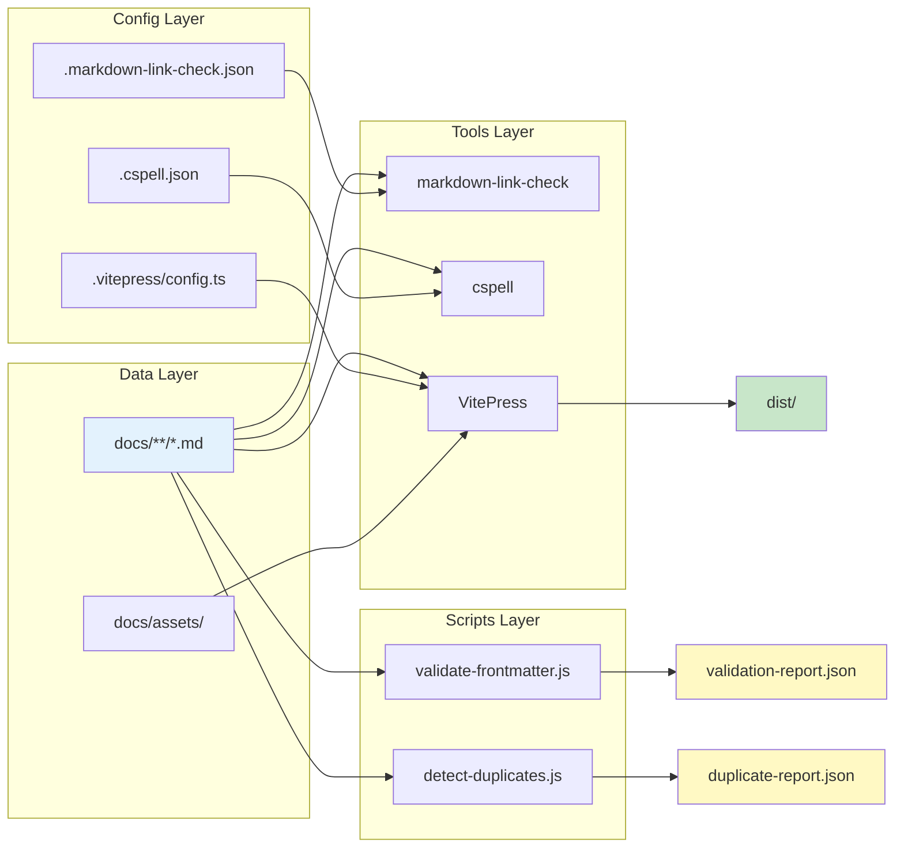
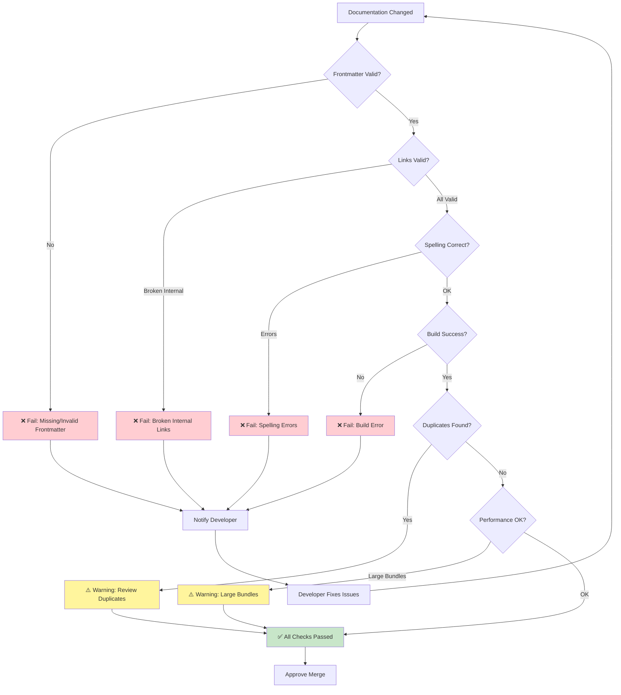
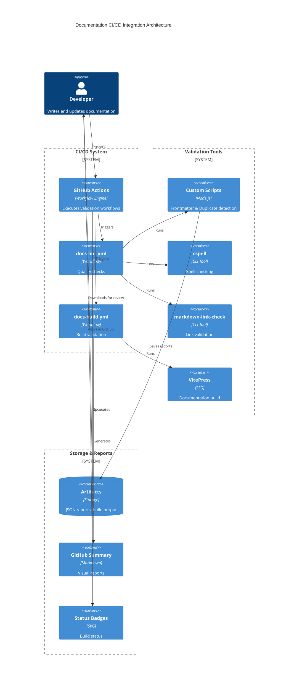
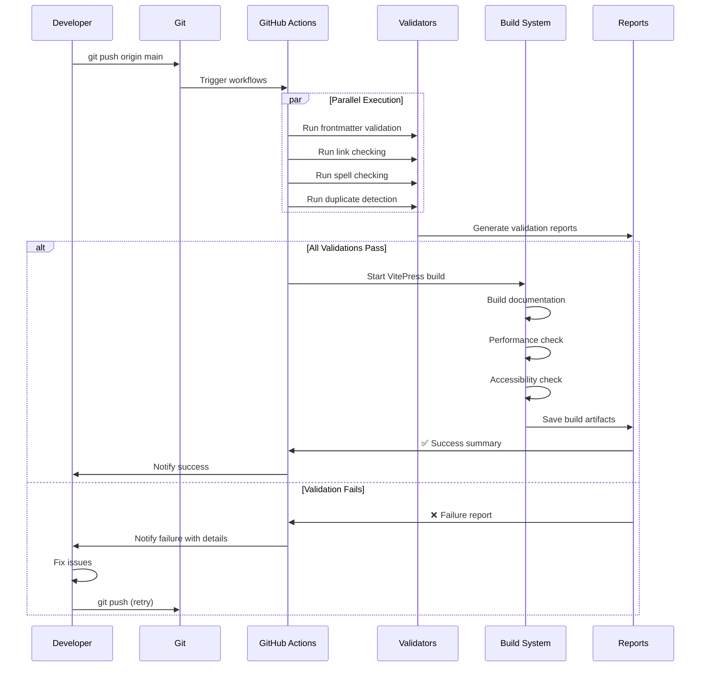
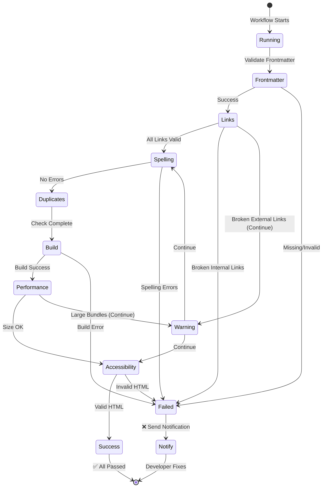

# Documentation CI/CD Architecture

## System Architecture Diagram



## Data Flow Diagram



## Workflow Execution Timeline

```mermaid
gantt
    title Documentation CI/CD Execution Timeline
    dateFormat  ss
    section Frontmatter
    Validate frontmatter :fm, 00, 30s
    section Links
    Check all links :link, 00, 120s
    section Spelling
    Spell check docs :spell, 00, 15s
    section Duplicates
    Detect duplicates :dup, 00, 30s
    section Build
    VitePress build :build, 00, 60s
    Performance check :perf, after build, 10s
    Accessibility check :a11y, after build, 10s
    section Summary
    Generate summary :summary, after a11y, 10s
```



## Component Interaction Diagram



## Quality Gate Decision Tree



## Integration Architecture



## Deployment Flow



## Error Handling Flow



## File Organization

```
Project-Ascension/
├── .github/
│   ├── workflows/
│   │   ├── docs-lint.yml          # Main linting workflow
│   │   └── docs-build.yml         # Build validation workflow
│   └── DOCS-QUALITY-GUIDE.md      # Quick reference guide
│
├── docs/
│   ├── .vitepress/
│   │   └── config.ts              # VitePress configuration
│   ├── assets/
│   │   └── diagrams/
│   │       └── docs-ci-architecture.md  # This file
│   ├── CI-CD-DOCUMENTATION.md     # Comprehensive documentation
│   └── **/*.md                    # Documentation files
│
├── scripts/
│   ├── validate-frontmatter.js    # Frontmatter validator
│   ├── detect-duplicates.js       # Duplicate detector
│   └── README.md                  # Scripts documentation
│
├── .cspell.json                   # Spell checker config
├── .markdown-link-check.json      # Link checker config
└── package.json                   # NPM scripts
```

---

## Key Performance Indicators (KPIs)

| Metric | Target | Current | Status |
|--------|--------|---------|--------|
| Workflow Execution Time | <3 min | ~2.5 min | ✅ |
| Documentation Files | 44+ | 44 | ✅ |
| Frontmatter Coverage | 100% | TBD | 🔄 |
| Broken Links | 0 | 94 | ⚠️ |
| Spelling Errors | 0 | TBD | 🔄 |
| Build Success Rate | >95% | TBD | 🔄 |

## Next Steps

1. ✅ **Sprint 1, Task 2**: Implement CI/CD automated checks (COMPLETED)
2. 🔄 **Sprint 2**: Fix 94 dead links and consolidate duplicate content
3. 📋 **Sprint 3**: Add frontmatter to all files and optimize build
4. 🚀 **Sprint 4**: Deploy documentation to GitHub Pages

---

**Diagrams Created Using**: Mermaid.js
**Last Updated**: 2025-10-08
**Maintained By**: DevOps Team
