# Mermaid Diagram Standards

Comprehensive standards for creating consistent, professional Mermaid diagrams across all Project Ascension documentation.

## Color Palette

```javascript
// Brand colors
const COLORS = {
  primary: '#3eaf7c',
  secondary: '#2c3e50',
  accent: '#42b983',

  // Semantic colors
  success: '#10b981',
  warning: '#f59e0b',
  error: '#ef4444',
  info: '#3b82f6',

  // Component types
  frontend: '#61dafb',
  backend: '#512bd4',
  database: '#336791',
  cache: '#dc382d',
  queue: '#ff6600',
  external: '#94a3b8',

  // Agent layers
  tactical: '#8b5cf6',
  strategic: '#ec4899',
  operational: '#06b6d4',
  quality: '#f97316',
};
```

## C4 Architecture Diagrams

### Context Diagram Template

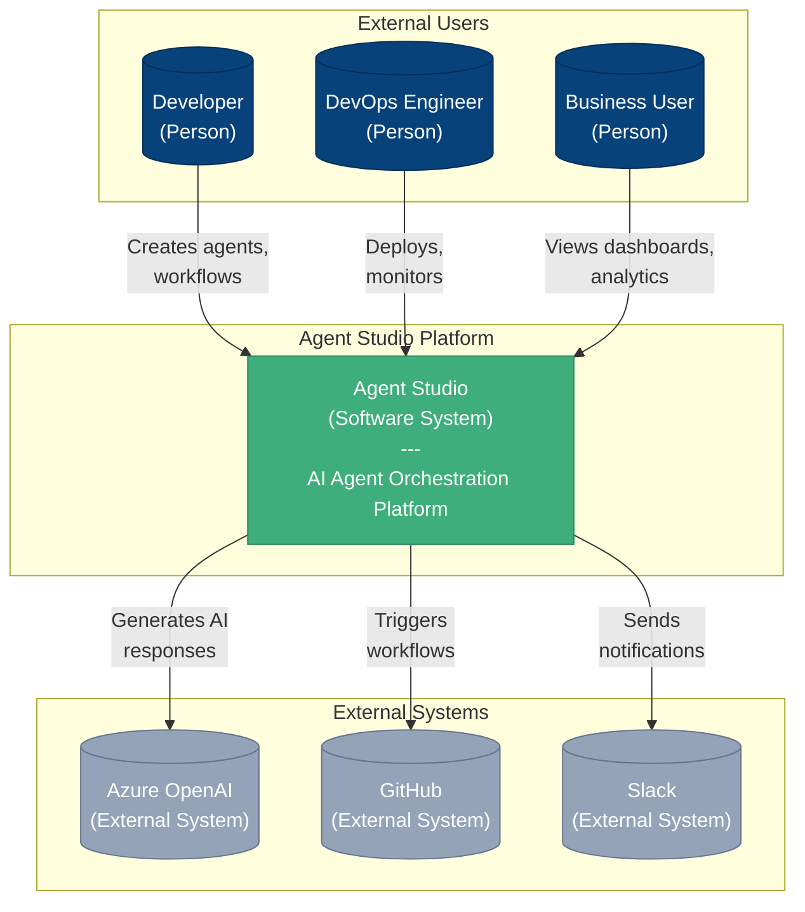

### Container Diagram Template

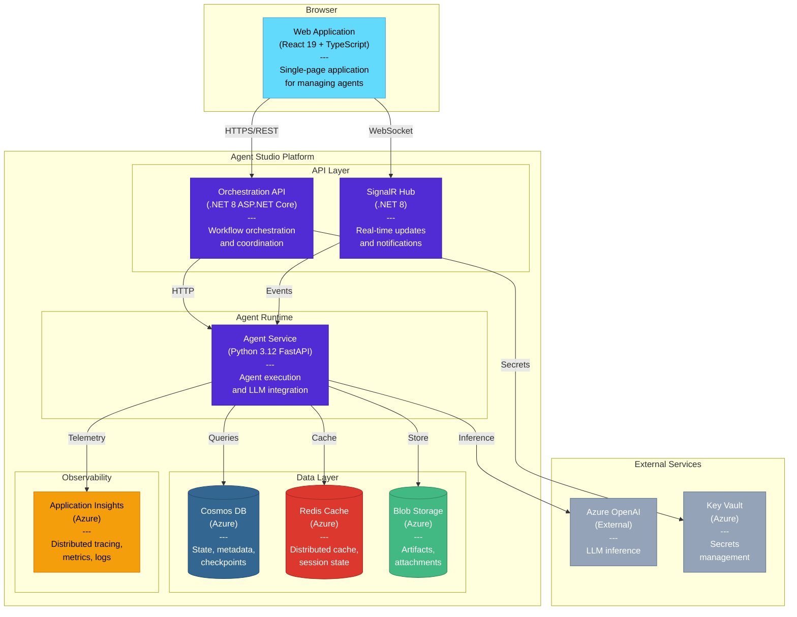

### Component Diagram Template

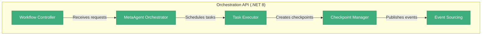

## Workflow Pattern Diagrams

### Sequential Workflow

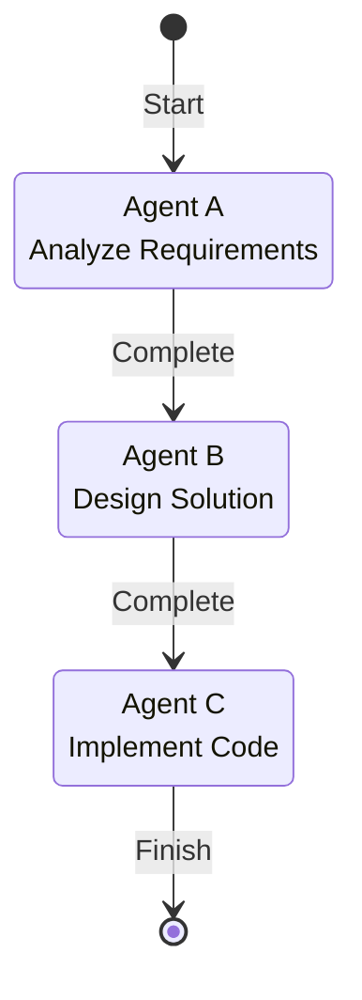

### Parallel Workflow

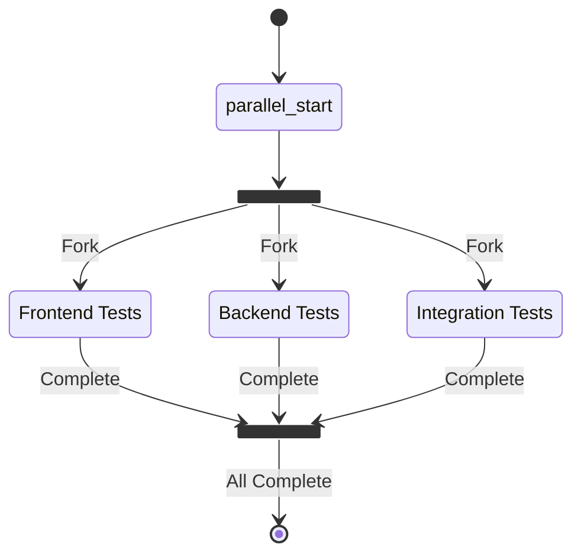

### Saga Pattern with Compensation

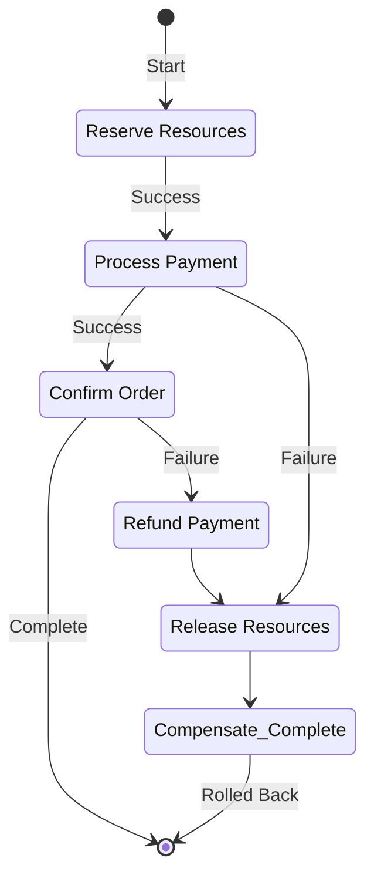

## Data Flow Diagrams

### Agent Execution Flow

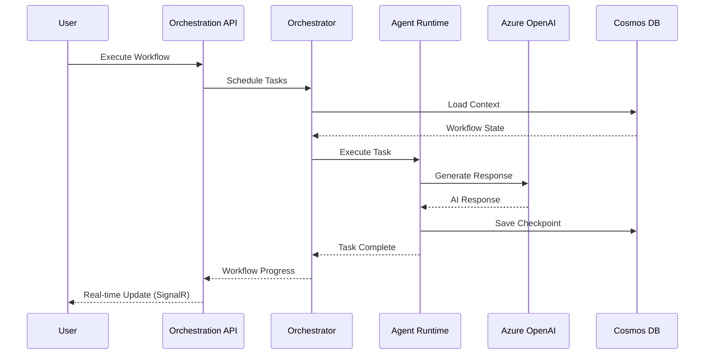

### State Management Flow

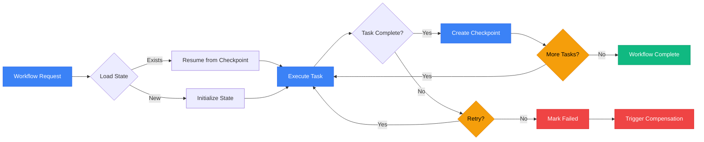

## Integration Pattern Diagrams

### Azure Service Integration

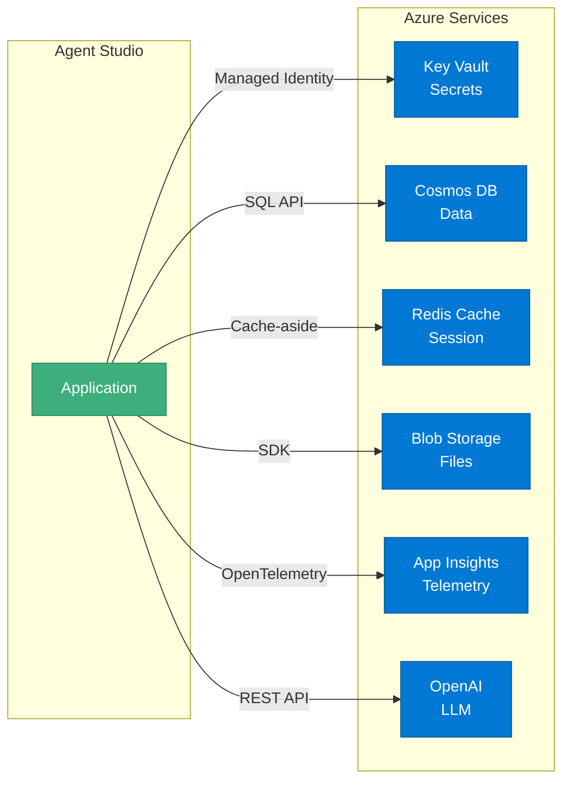

## Security Diagram Standards

### Authentication Flow

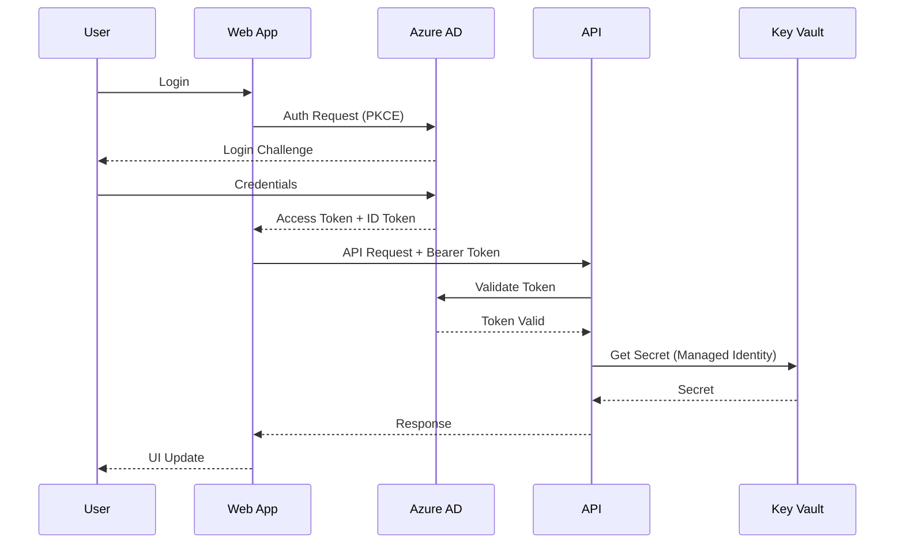

## Database Schema Diagrams

### ERD Template

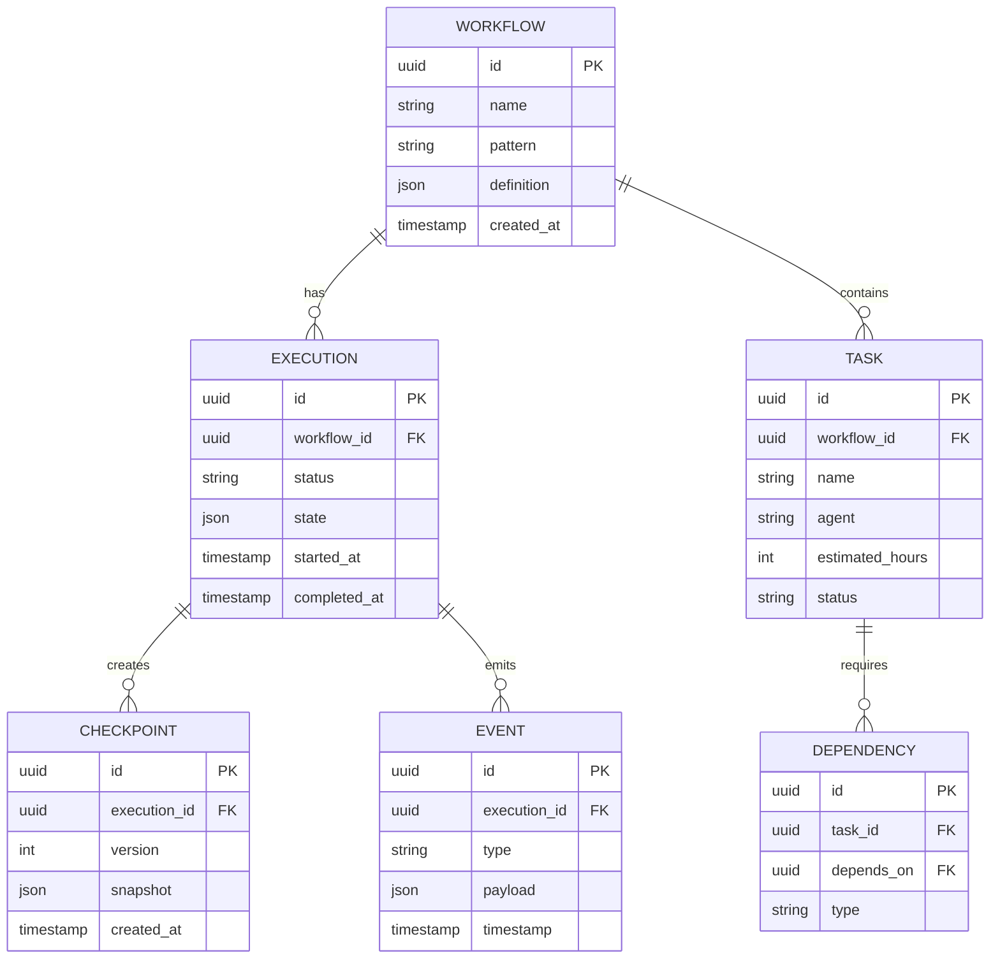

## Deployment Pipeline Diagrams

### CI/CD Flow

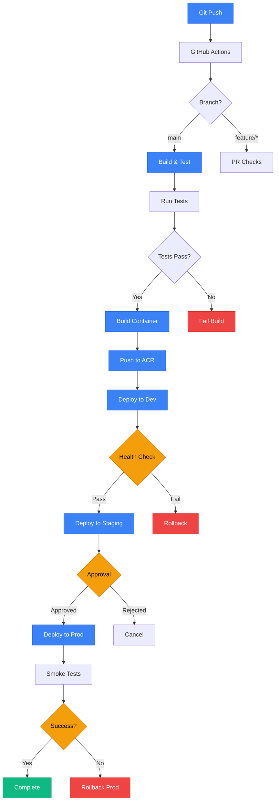

## Best Practices

### 1. Consistent Naming
- Use PascalCase for components
- Use lowercase with hyphens for IDs
- Use clear, descriptive labels

### 2. Color Usage
- Apply semantic colors consistently (success=green, error=red)
- Use brand colors for primary components
- Maintain sufficient contrast (WCAG AA minimum)

### 3. Layout
- Left-to-right for sequence flows
- Top-to-bottom for hierarchies
- Use subgraphs to group related components

### 4. Annotations
- Add notes for complex interactions
- Include version numbers for APIs
- Document assumptions and constraints

### 5. Accessibility
- Include descriptive alt text
- Provide text descriptions for screen readers
- Ensure color is not the only differentiator

### 6. File Organization
```
docs/assets/diagrams/
├── architecture/
│   ├── c4-context.mmd
│   ├── c4-container.mmd
│   └── c4-component.mmd
├── workflows/
│   ├── sequential.mmd
│   ├── parallel.mmd
│   └── saga.mmd
├── data-flows/
│   ├── agent-execution.mmd
│   └── state-management.mmd
├── integrations/
│   └── azure-services.mmd
├── security/
│   └── auth-flow.mmd
├── database/
│   └── erd.mmd
└── deployment/
    └── cicd-flow.mmd
```

### 7. Versioning
- Include diagram version in filename (e.g., `c4-context-v2.mmd`)
- Maintain changelog for major diagram updates
- Archive obsolete diagrams with `_archived` suffix

## Tools & Validation

### Mermaid CLI
```bash
# Install Mermaid CLI
npm install -g @mermaid-js/mermaid-cli

# Generate PNG from Mermaid file
mmdc -i diagram.mmd -o diagram.png -t default -b transparent

# Generate SVG
mmdc -i diagram.mmd -o diagram.svg -t default
```

### VS Code Extensions
- **Mermaid Preview**: Real-time preview in VS Code
- **Mermaid Markdown**: Syntax highlighting

### Validation
```bash
# Lint Mermaid files
npx mermaid-lint docs/assets/diagrams/**/*.mmd

# Check accessibility (color contrast)
npx a11y-audit docs/assets/diagrams/*.png
```

## Examples Gallery

See [examples/](./examples/) for complete examples of each diagram type with annotations and best practices.
