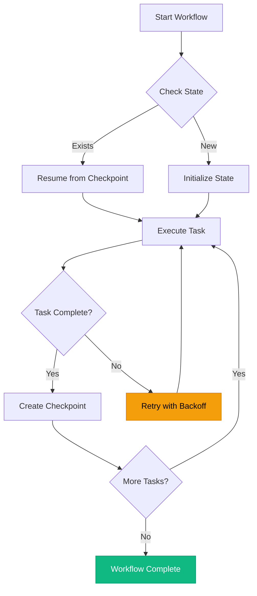
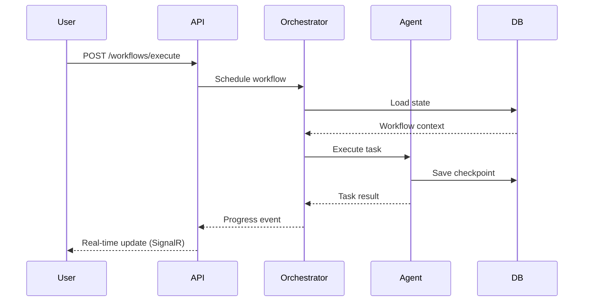
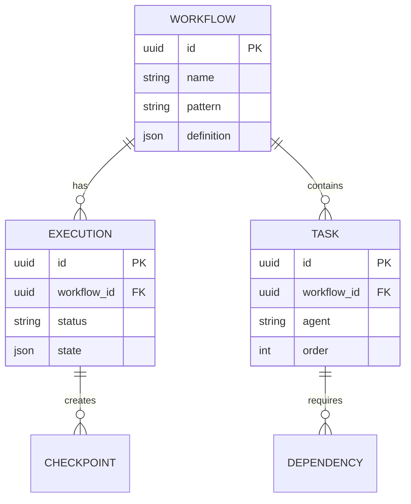
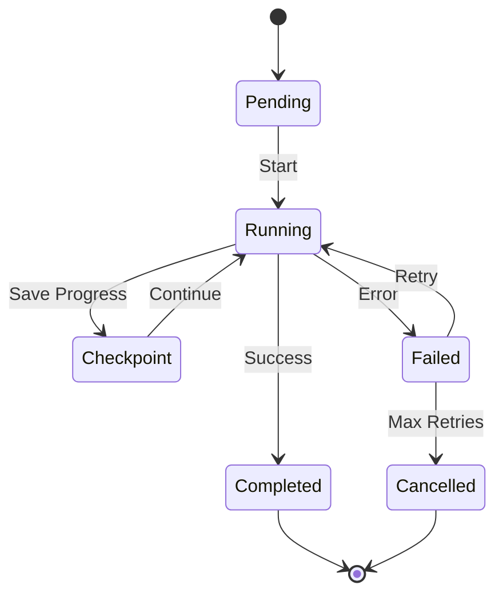
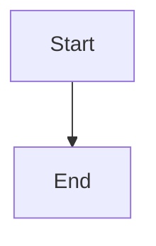

# Documentation Contributing Guide

Welcome to the Agent Studio documentation platform. This guide empowers you to create high-quality, consistent documentation that helps organizations build sustainable, scalable AI agent solutions.

**Best for**: Contributors who want to improve documentation, add new guides, or maintain existing content.

[[toc]]

## Overview

Our documentation platform is designed to streamline knowledge sharing and improve visibility across the Agent Studio ecosystem. Whether you're documenting a new feature, creating operational runbooks, or improving existing guides, this guide establishes structure and rules for maintaining documentation excellence.

### Documentation Quality System

This documentation maintains automated quality checks to ensure accuracy, consistency, and maintainability:

- **Frontmatter Validation** - Required metadata for every document
- **Link Checking** - Verification of all internal and external links
- **Spell Checking** - Technical term validation
- **Duplicate Detection** - Identification of redundant content
- **Build Validation** - VitePress build verification

These quality checks drive measurable outcomes through structured approaches to documentation maintenance.

## Getting Started

### Prerequisites

Establish your local development environment with the following tools:

| Tool | Version | Purpose |
|------|---------|---------|
| **Node.js** | 20.x or later | Runtime for VitePress and validation scripts |
| **npm** | 10.x or later | Package management |
| **Git** | 2.40 or later | Version control |
| **Code Editor** | VS Code recommended | Markdown editing with extensions |

**Recommended VS Code Extensions**:
- **Markdown All in One** - Enhanced markdown editing
- **Markdown Preview Mermaid** - Mermaid diagram preview
- **Code Spell Checker** - Inline spell checking
- **Prettier** - Consistent formatting

### Clone and Setup

```bash
# Clone the repository
git clone https://github.com/Brookside-Proving-Grounds/Project-Ascension.git
cd Project-Ascension

# Install dependencies
npm install

# Verify setup by running validation scripts
npm run docs:frontmatter
npm run docs:links
npm run docs:spell
```

### Running Documentation Locally

Establish a local preview to see your changes in real-time:

```bash
# Start the development server
npm run docs:dev

# Access at http://localhost:5173
# Hot reload enabled - changes appear immediately
```

**Build for Production** (validate your changes work in production):

```bash
# Build static site
npm run docs:build

# Preview production build
npm run docs:preview
```

### Project Structure

Understanding where to place documentation ensures consistent organization:

```
docs/
├── .vitepress/              # VitePress configuration
│   ├── config.ts            # Site configuration
│   └── theme/               # Custom theme components
│
├── getting-started/         # Onboarding and installation
│   ├── installation.md
│   └── quickstart.md
│
├── guides/                  # User guides organized by audience
│   ├── developer/           # Developer-focused guides
│   ├── operator/            # Operations and SRE guides
│   └── business/            # Business stakeholder content
│
├── tutorials/               # Step-by-step learning content
│   └── build-custom-agent.md
│
├── api/                     # API reference documentation
│   ├── rest-api.md
│   ├── signalr-hub-contract.md
│   └── openapi.yaml
│
├── architecture/            # System design and technical decisions
│   ├── index.md
│   └── orchestration-c4.md
│
├── database/                # Database schemas and patterns
│   ├── cosmos-schemas.md
│   └── query-patterns.md
│
├── runbooks/                # Operational procedures
│   ├── deployment-procedures.md
│   └── monitoring.md
│
├── adrs/                    # Architecture Decision Records
│   └── ADR-NNN-title.md
│
└── assets/                  # Images, diagrams, downloads
    └── diagrams/            # Mermaid diagrams organized by type
        ├── architecture/
        ├── workflows/
        ├── security/
        └── database/
```

## Documentation Standards

### Frontmatter Requirements

Every documentation file must include YAML frontmatter with required metadata. This ensures discoverability, SEO optimization, and proper rendering in VitePress.

**Required Fields**:

```yaml
---
title: Clear, Descriptive Title (60 chars max for SEO)
description: Concise description explaining the value and purpose (150-160 chars for SEO)
tags:
  - relevant
  - searchable
  - keywords
lastUpdated: YYYY-MM-DD
---
```

**Optional but Recommended Fields**:

```yaml
---
author: Team or Individual Name
audience: developers, operators, architects, business
status: draft | review | published | archived
version: 1.0.0
related:
  - /path/to/related-doc.md
  - /path/to/another-doc.md
---
```

**Example - Developer Guide**:

```yaml
---
title: Creating Custom Workflow Agents
description: Build scalable custom agents for workflow orchestration. Learn design patterns, best practices, and integration approaches for sustainable agent development.
tags:
  - agents
  - workflows
  - development
  - patterns
lastUpdated: 2025-10-09
author: Agent Studio Team
audience: developers, architects
related:
  - /tutorials/build-custom-agent.md
  - /api/rest-api.md
---
```

**Example - Operational Runbook**:

```yaml
---
title: Production Deployment Procedures
description: Streamline deployment processes with structured runbooks. Ensure reliable production releases through consistent deployment practices.
tags:
  - deployment
  - operations
  - runbook
  - production
lastUpdated: 2025-10-09
author: DevOps Team
audience: operators, sre
status: published
---
```

### Markdown Style Guide

Consistent markdown formatting ensures readability and maintainability.

#### Headings

Use ATX-style headings with proper hierarchy:

```markdown
# H1 - Page Title (One per document)

## H2 - Major Section

### H3 - Subsection

#### H4 - Detail Section

##### H5 - Rarely needed

###### H6 - Avoid if possible
```

**Best Practices**:
- Use sentence case for headings (capitalize first word only)
- Make headings descriptive and actionable
- Avoid skipping heading levels (H2 → H4)
- Keep headings under 60 characters

#### Lists

**Unordered Lists** (use `-` for consistency):

```markdown
- First item establishes context
- Second item provides detail
- Third item completes the thought
  - Nested item adds specificity
  - Another nested item
```

**Ordered Lists** (use `1.` for all items for easier maintenance):

```markdown
1. Clone the repository
1. Install dependencies
1. Configure environment variables
1. Run the application
```

**Task Lists**:

```markdown
- [ ] Complete initial setup
- [ ] Run quality checks locally
- [x] Create pull request
- [ ] Address review feedback
```

#### Code Blocks

Always specify the language for proper syntax highlighting:

````markdown
```typescript
// TypeScript example with proper syntax highlighting
interface WorkflowConfig {
  name: string;
  pattern: 'sequential' | 'parallel' | 'dynamic';
  tasks: Task[];
}
```

```csharp
// C# example
public class WorkflowExecutor
{
    public async Task<WorkflowResult> ExecuteAsync(WorkflowConfig config)
    {
        // Implementation
    }
}
```

```python
# Python example
def execute_workflow(config: WorkflowConfig) -> WorkflowResult:
    """Execute workflow with provided configuration."""
    pass
```

```bash
# Bash commands
npm run docs:dev
dotnet test
pytest --cov
```
````

**Inline Code**:

Use backticks for inline code, commands, file names, and technical terms:

```markdown
Use the `MetaAgentOrchestrator` class to coordinate agents. Configuration is stored in `appsettings.json`. Run `npm install` to install dependencies.
```

#### Links

**Internal Links** (relative, without `.md` extension):

```markdown
See the [API Reference](/api/rest-api) for complete endpoint documentation.
Refer to [Workflow Creation Guide](/guides/developer/workflow-creation) for examples.
```

**External Links**:

```markdown
Built on [Microsoft's Agentic Framework](https://github.com/microsoft/autogen).
Deploy to [Azure Container Apps](https://learn.microsoft.com/azure/container-apps/).
```

**Link with Title Attribute**:

```markdown
[Azure OpenAI](https://azure.microsoft.com/services/openai/ "Azure OpenAI Service Documentation")
```

#### Tables

Use tables to organize structured information:

```markdown
| Component | Technology | Purpose |
|-----------|------------|---------|
| Frontend | React 19 + TypeScript | User interface for agent management |
| API | .NET 8 ASP.NET Core | Workflow orchestration and coordination |
| Agents | Python 3.12 FastAPI | Agent execution and LLM integration |
```

**Alignment**:

```markdown
| Left Aligned | Center Aligned | Right Aligned |
|:-------------|:--------------:|--------------:|
| Content | Content | Content |
```

#### Admonitions

Use custom containers for callouts and warnings:

```markdown
::: info
This feature is designed for organizations scaling AI agents across multiple teams.
:::

::: tip Best Practice
Establish consistent naming conventions for workflows to streamline team collaboration.
:::

::: warning
Ensure proper authentication configuration before deploying to production environments.
:::

::: danger Security Note
Never commit API keys or secrets to version control. Use Azure Key Vault for secret management.
:::

::: details Click to expand
Additional details or verbose content that users can expand when needed.
:::
```

#### Images

```markdown


<!-- With title attribute -->


<!-- Linked image -->
[](https://github.com/org/repo/actions)
```

**Best Practices**:
- Always include descriptive alt text
- Optimize images (compress PNG/JPG, use WebP when possible)
- Store images in `/docs/assets/images/`
- Use lowercase with hyphens for filenames

### Voice and Tone Guidelines

Our documentation reflects Brookside BI's brand identity: **professional, solution-focused, and consultative**.

#### Core Principles

**Professional but Approachable**:
- Maintain corporate professionalism while remaining accessible
- Use clear, concise language
- Avoid unnecessary jargon; define technical terms when first used

**Solution-Focused**:
- Frame content around solving business problems
- Emphasize tangible outcomes: "streamline workflows," "improve visibility," "drive measurable results"
- Use action-oriented language

**Consultative and Strategic**:
- Position documentation as partnership guidance
- Focus on long-term sustainability
- Demonstrate understanding of organizational scaling challenges

#### Writing Style

**Do**:
- ✅ "This orchestration pattern is designed to streamline multi-agent coordination across growing teams."
- ✅ "Establish governance rules to ensure consistent agent behavior across your organization."
- ✅ "Build sustainable practices that support scalable AI agent development."

**Don't**:
- ❌ "This is a cool feature."
- ❌ "Just run this command."
- ❌ "Obviously, you should..."

#### Language Patterns

Use these patterns consistently:

```markdown
<!-- Structure and governance -->
"Establish structure and rules for [process/system]"
"Build sustainable practices that support [goal]"

<!-- Solution positioning -->
"This solution is designed to [outcome]"
"Ideal for organizations scaling [technology] across [context]"

<!-- Outcome focus -->
"Streamline workflows and improve visibility"
"Drive measurable outcomes through structured approaches"
```

#### Audience-Specific Tone

**Developers**:
- Technical depth with implementation details
- Complete, runnable code examples
- Performance implications and best practices
- Professional, precise, technically rigorous

**Operators/SRE**:
- Clear procedures with troubleshooting steps
- Security and reliability considerations
- Monitoring and alerting guidance
- Practical, systematic, action-oriented

**Business Stakeholders**:
- High-level architecture and value proposition
- ROI and business outcomes
- Strategic implications
- Strategic, outcome-focused, clear ROI

## Writing Guidelines

### Content Principles

#### 1. Clear and Concise

**Write for scannability**:
- Use short paragraphs (2-4 sentences)
- Lead with the most important information
- Use bullet points for lists of items
- Break long content into sections with clear headings

**Example - Before**:
```markdown
The MetaAgentOrchestrator class is responsible for coordinating the execution
of multiple agents in a workflow and it handles things like task scheduling,
state management, checkpoint creation, error handling, retry logic, and
communication with the Python agent service through HTTP calls, and it also
publishes events to SignalR for real-time updates.
```

**Example - After**:
```markdown
The `MetaAgentOrchestrator` coordinates multi-agent workflow execution:

- **Task Scheduling**: Determines execution order based on workflow pattern
- **State Management**: Persists workflow state to Cosmos DB
- **Checkpointing**: Creates recovery points after each task
- **Error Handling**: Implements retry logic with exponential backoff
- **Real-time Events**: Publishes progress updates via SignalR
```

#### 2. Actionable and Practical

Every guide should enable readers to accomplish a specific goal.

**Structure for guides**:
1. **Context**: What problem does this solve?
2. **Prerequisites**: What do you need before starting?
3. **Steps**: Clear, numbered steps to accomplish the goal
4. **Validation**: How do you know it worked?
5. **Troubleshooting**: Common issues and solutions
6. **Next Steps**: Where to go from here

**Example**:
```markdown
## Creating a Custom Workflow Agent

**Goal**: Build a custom agent that integrates with your workflow orchestration system.

**Best for**: Organizations extending Agent Studio with domain-specific automation.

### Prerequisites

Before creating a custom agent, ensure you have:
- [ ] Python 3.12 or later installed
- [ ] Agent Studio development environment configured
- [ ] Familiarity with FastAPI and async Python

### Steps

1. **Create agent class structure**

   ```python
   from meta_agents.base import BaseAgent

   class CustomAgent(BaseAgent):
       """Custom agent for domain-specific tasks."""

       async def process(self, input_data: dict) -> dict:
           """Process input and return results."""
           pass
   ```

2. **Implement processing logic**

   [Additional steps...]

### Validation

Verify your agent works correctly:

```bash
pytest tests/test_custom_agent.py -v
```

Expected output:
```
test_custom_agent_execution PASSED
test_custom_agent_error_handling PASSED
```

### Troubleshooting

**Issue**: Agent fails with `ModuleNotFoundError`
**Solution**: Ensure virtual environment is activated: `source venv/bin/activate`

### Next Steps

- [Register your agent](/guides/developer/agent-registration)
- [Deploy to production](/runbooks/deployment-procedures)
```

#### 3. Accurate and Verified

**Test all code examples**:
- Every code example must be tested and verified
- Include full context (imports, setup, teardown)
- Show expected output

**Keep documentation synchronized with code**:
- Update docs when implementation changes
- Cross-reference actual file paths and class names
- Include version compatibility information

#### 4. Complete but Focused

**Cover all necessary information without overwhelming**:
- Start with the essentials
- Use progressive disclosure for advanced topics
- Link to related documentation for deeper dives

**Example structure**:
```markdown
## Basic Usage

Quick start for common scenarios...

## Advanced Configuration

::: details Advanced Options (Click to expand)

Advanced features for complex use cases...

:::

## Related Documentation

- [Complete API Reference](/api/rest-api)
- [Performance Tuning Guide](/guides/developer/performance)
```

### SEO Best Practices

Optimize documentation for discoverability:

**Titles**:
- 50-60 characters (optimal for search results)
- Include primary keyword near the beginning
- Make it descriptive and specific

**Descriptions**:
- 150-160 characters (meta description length)
- Include primary and secondary keywords naturally
- Focus on value proposition and outcomes

**Keywords**:
- Use relevant tags in frontmatter
- Include keywords naturally in content
- Don't keyword stuff

**Example**:
```yaml
---
title: Azure Container Apps Deployment Guide
description: Deploy Agent Studio to Azure Container Apps for scalable, production-ready AI agent orchestration. Step-by-step instructions with infrastructure as code.
tags:
  - azure
  - deployment
  - container-apps
  - production
  - infrastructure
---
```

### Accessibility Guidelines

Ensure documentation is accessible to all users:

**Images**:
- Always include descriptive alt text
- Describe what the image shows, not just "image" or "screenshot"
- For complex diagrams, provide text descriptions

```markdown

```

**Headings**:
- Use proper hierarchy (don't skip levels)
- Make headings descriptive and meaningful
- Screen readers use headings for navigation

**Links**:
- Use descriptive link text (not "click here")
- Indicate external links or downloads

```markdown
<!-- Good -->
See the [API authentication guide](/api/authentication) for setup instructions.

<!-- Bad -->
Click [here](/api/authentication) for more information.
```

**Color**:
- Don't rely solely on color to convey information
- Ensure sufficient contrast (WCAG AA minimum: 4.5:1)
- Use icons or patterns in addition to color

**Tables**:
- Include header rows
- Keep table structure simple
- Consider alternatives for complex data

## Code Examples

### Code Block Formatting

Use syntax highlighting with the appropriate language identifier:

````markdown
```typescript
// TypeScript - Use for frontend React code
import { useMetaAgent } from '@/hooks/useMetaAgent';

export const WorkflowPanel: React.FC = () => {
  const { execute, status } = useMetaAgent();
  // Implementation
};
```

```csharp
// C# - Use for .NET orchestration service
public class WorkflowExecutor : IWorkflowExecutor
{
    public async Task<WorkflowResult> ExecuteAsync(WorkflowDefinition workflow)
    {
        // Implementation
    }
}
```

```python
# Python - Use for agent implementations
async def execute_agent(agent_id: str, input_data: dict) -> AgentResult:
    """Execute agent with provided input data."""
    # Implementation
```

```bash
# Bash - Use for commands and scripts
npm run docs:dev
dotnet test --filter "FullyQualifiedName~WorkflowTests"
pytest -m unit -v
```

```json
{
  "workflow": {
    "name": "code-review-pipeline",
    "pattern": "sequential",
    "tasks": []
  }
}
```

```yaml
# YAML - Use for configuration examples
version: '3.8'
services:
  api:
    image: agentstudio/api:latest
    ports:
      - "5000:80"
```
````

### Inline Code vs Code Blocks

**Use inline code for**:
- Class names, method names, variables
- File paths and filenames
- Short commands
- Technical terms

```markdown
The `MetaAgentOrchestrator` class is located in `AgentStudio.Orchestration`.
Run `npm install` to install dependencies.
```

**Use code blocks for**:
- Multi-line code
- Complete examples
- Commands with output
- Configuration files

### Multi-Language Examples

Show examples in relevant languages when documenting APIs or integrations:

````markdown
## Creating a Workflow

::: code-group

```typescript [TypeScript]
// React/Frontend client
const workflow = await fetch('/api/v1/workflows', {
  method: 'POST',
  headers: { 'Content-Type': 'application/json' },
  body: JSON.stringify({
    name: 'code-review-pipeline',
    pattern: 'sequential',
    tasks: [/* ... */]
  })
});
```

```csharp [C#]
// .NET client
var workflow = new WorkflowDefinition
{
    Name = "code-review-pipeline",
    Pattern = WorkflowPattern.Sequential,
    Tasks = new List<TaskDefinition> { /* ... */ }
};

var result = await workflowService.CreateAsync(workflow);
```

```python [Python]
# Python client
import httpx

async def create_workflow():
    async with httpx.AsyncClient() as client:
        response = await client.post(
            'https://api.example.com/v1/workflows',
            json={
                'name': 'code-review-pipeline',
                'pattern': 'sequential',
                'tasks': []
            }
        )
        return response.json()
```

```bash [cURL]
curl -X POST https://api.example.com/v1/workflows \
  -H "Content-Type: application/json" \
  -H "Authorization: Bearer $TOKEN" \
  -d '{
    "name": "code-review-pipeline",
    "pattern": "sequential",
    "tasks": []
  }'
```

:::
````

### Runnable Examples

Provide complete, runnable examples that users can copy and execute:

````markdown
## Complete Example: Sequential Workflow

This example demonstrates creating and executing a sequential workflow.

```typescript
// src/examples/sequential-workflow.ts

import { WorkflowClient } from '@agent-studio/client';

async function runSequentialWorkflow() {
  const client = new WorkflowClient({
    baseUrl: process.env.API_URL,
    apiKey: process.env.API_KEY
  });

  // 1. Create workflow definition
  const workflow = await client.workflows.create({
    name: 'document-review-pipeline',
    description: 'Review and approve technical documents',
    pattern: 'sequential',
    tasks: [
      {
        id: 'analyze',
        agent: 'technical-reviewer',
        input: { documentId: 'DOC-123' }
      },
      {
        id: 'approve',
        agent: 'approval-manager',
        input: { reviewId: '{{ analyze.reviewId }}' }
      }
    ]
  });

  // 2. Execute workflow
  const execution = await client.workflows.execute(workflow.id);

  // 3. Monitor progress
  client.on('workflow.progress', (event) => {
    console.log(`Task ${event.taskId}: ${event.status}`);
  });

  // 4. Wait for completion
  const result = await execution.waitForCompletion();
  console.log('Workflow completed:', result);
}

// Run the example
runSequentialWorkflow().catch(console.error);
```

**Run this example**:

```bash
# Set environment variables
export API_URL=https://api.agentstudio.example.com
export API_KEY=your_api_key_here

# Install dependencies
npm install @agent-studio/client

# Run the example
npx tsx src/examples/sequential-workflow.ts
```

**Expected output**:
```
Task analyze: running
Task analyze: completed
Task approve: running
Task approve: completed
Workflow completed: {
  status: 'completed',
  duration: 45.2,
  results: { /* ... */ }
}
```
````

### Live Demos

For interactive features, consider embedding live demos:

```markdown
## Interactive Demo

Try the workflow designer interactively:

<iframe src="https://demo.agentstudio.example.com/workflow-designer"
        width="100%"
        height="600"
        frameborder="0"
        title="Interactive Workflow Designer Demo">
</iframe>

[Open in new window](https://demo.agentstudio.example.com/workflow-designer)
```

## Diagrams and Visual Content

### Mermaid Diagram Syntax

VitePress natively supports Mermaid diagrams. Follow our [Mermaid Standards](assets/diagrams/mermaid-standards.md) for consistency.

#### Flowcharts



#### Sequence Diagrams



#### Entity Relationship Diagrams



#### State Diagrams



### When to Use Diagrams

**Use diagrams when**:
- Explaining system architecture or component relationships
- Illustrating workflows or process flows
- Showing sequence of operations or events
- Visualizing data models or schemas
- Clarifying complex concepts that are hard to describe in text

**Avoid diagrams when**:
- Simple lists or tables would suffice
- The information is too detailed for a diagram
- The diagram would be harder to maintain than text

### Image Optimization

**Guidelines**:
- Compress images before committing (use tools like TinyPNG, ImageOptim)
- Use appropriate formats:
  - **PNG**: Screenshots, diagrams with text
  - **JPG**: Photographs
  - **SVG**: Icons, logos, simple graphics
  - **WebP**: Modern browsers, best compression
- Target file sizes:
  - Screenshots: < 200 KB
  - Diagrams: < 100 KB
  - Icons: < 20 KB

**Optimization tools**:
```bash
# Install optimization tools
npm install -g sharp-cli svgo

# Optimize PNG images
npx sharp -i input.png -o output.png resize 1200

# Optimize SVG
svgo input.svg -o output.svg
```

### Screenshot Guidelines

**Capturing screenshots**:
- Use consistent window sizes (1200x800 recommended)
- Capture relevant UI only (avoid unnecessary chrome)
- Use consistent theme (light/dark) throughout documentation
- Highlight or annotate important areas

**Annotating screenshots**:
- Use arrows to point to specific UI elements
- Add numbered labels for step-by-step guides
- Use consistent colors (red for attention, blue for information)
- Keep annotations minimal and clear

**Example**:
```markdown


**Key elements**:
1. Task cards showing agent type and configuration
2. Dependency arrows indicating execution order
3. Add Task button for expanding the workflow
```

## Quality Checks

Run these validation scripts locally before committing to ensure documentation quality.

### Frontmatter Validation

Validates that all markdown files have required frontmatter fields.

```bash
# Run frontmatter validation
npm run docs:frontmatter
```

**What it checks**:
- ✅ All `.md` files have YAML frontmatter
- ✅ Required fields present (`title`, `description`, `tags`, `lastUpdated`)
- ✅ Field formats are correct (dates, arrays, strings)
- ✅ Tag consistency across related documents

**Example output**:
```
✓ docs/guides/developer/workflow-creation.md - Valid
✗ docs/api/rest-api.md - Missing required field: description
✗ docs/architecture/index.md - Invalid date format: lastUpdated

2 errors, 1 warning
```

**How to fix errors**:

```yaml
# Missing description
---
title: REST API Reference
description: Complete REST API documentation for Agent Studio orchestration service. Includes endpoints, authentication, request/response examples, and error codes.
tags: [api, rest, reference]
lastUpdated: 2025-10-09
---

# Invalid date format (use YYYY-MM-DD)
lastUpdated: 2025-10-09  # Correct
lastUpdated: 10/09/2025  # Incorrect
```

### Link Checking

Verifies all internal and external links are valid.

```bash
# Run link checker
npm run docs:links
```

**What it checks**:
- ✅ Internal links resolve to existing files
- ✅ External links return HTTP 200
- ✅ Anchor links point to valid headings
- ✅ No broken images or resources

**Example output**:
```
✓ docs/guides/developer/workflow-creation.md
  ✓ /api/rest-api → docs/api/rest-api.md
  ✓ https://github.com/microsoft/autogen (HTTP 200)
✗ docs/tutorials/build-custom-agent.md
  ✗ /guides/nonexistent.md (404 Not Found)
  ✗ #invalid-anchor (anchor not found)

1 file with errors
```

**How to fix errors**:

```markdown
<!-- Broken internal link -->
[API Reference](/api/rest-api)  <!-- Correct -->
[API Reference](/api/rest-api.md)  <!-- Incorrect (don't include .md) -->

<!-- Broken anchor link -->
[State Management](#state-management-flow)  <!-- Correct (matches heading) -->
[State Management](#state-mgmt)  <!-- Incorrect (heading doesn't exist) -->

<!-- Broken external link -->
Update URL or remove if resource no longer exists
```

### Spell Checking

Checks spelling across all markdown files with technical term awareness.

```bash
# Run spell checker
npm run docs:spell
```

**What it checks**:
- ✅ English spelling correctness
- ✅ Technical term dictionary (cSpell)
- ✅ Proper nouns and product names
- ✅ Code blocks excluded from checking

**Example output**:
```
docs/guides/developer/workflow-creation.md:45:12
  Unknown word: orchestrater
  Suggestions: orchestrator, orchestrate

docs/tutorials/build-custom-agent.md:78:5
  Unknown word: teh
  Suggestions: the, ten, tea
```

**How to fix errors**:

1. **Fix typos** in the document
2. **Add technical terms** to `.cspell.json`:

```json
{
  "words": [
    "Cosmos",
    "SignalR",
    "FastAPI",
    "Bicep",
    "VitePress",
    "OpenTelemetry"
  ]
}
```

### Duplicate Detection

Identifies redundant or duplicate content across documentation.

```bash
# Run duplicate detection
npm run docs:duplicates
```

**What it checks**:
- ✅ Identical content blocks (>50 words)
- ✅ Similar sections across files
- ✅ Copy-pasted code examples
- ✅ Redundant explanations

**Example output**:
```
Duplicate content found:

docs/guides/developer/workflow-creation.md (lines 45-60)
docs/tutorials/build-custom-agent.md (lines 23-38)

Similarity: 95%
Consider consolidating or cross-referencing.
```

**How to resolve**:

1. **Consolidate**: Move common content to a shared location
2. **Cross-reference**: Link to canonical source instead of duplicating
3. **Differentiate**: Adjust content to serve different audiences/contexts

```markdown
<!-- Instead of duplicating -->
For authentication details, see the [Authentication Guide](/api/authentication).

<!-- Or use includes for shared content -->
<<< @/snippets/authentication-setup.md
```

### Running All Checks

Run all quality checks together:

```bash
# Run all documentation linting
npm run docs:lint

# This runs:
# 1. Frontmatter validation
# 2. Link checking
# 3. Spell checking
# 4. Duplicate detection
```

**Interpreting results**:
- **0 errors**: Ready to commit ✅
- **Warnings only**: Review but not blocking
- **Errors present**: Must fix before committing ❌

### Pre-commit Checks

Set up Git hooks to run checks automatically:

```bash
# Install Husky for Git hooks
npm install --save-dev husky

# Initialize Husky
npx husky install

# Add pre-commit hook
npx husky add .husky/pre-commit "npm run docs:lint"
```

Now checks run automatically when you commit:
```bash
git add docs/guides/my-new-guide.md
git commit -m "docs: add new guide for custom agents"

# Husky runs docs:lint automatically
# Commit is blocked if errors exist
```

## Pull Request Process

### Branch Naming Conventions

Use descriptive branch names with appropriate prefixes:

```bash
docs/add-workflow-creation-guide       # New documentation
docs/update-api-reference              # Update existing docs
docs/fix-broken-links-in-runbooks     # Fix documentation issues
docs/restructure-developer-guides      # Major reorganization
```

**Pattern**: `docs/<action>-<brief-description>`

### Commit Message Format

Follow [Conventional Commits](https://www.conventionalcommits.org/) for semantic versioning and changelog generation.

**Format**:
```
docs(<scope>): <subject>

<body>

<footer>
```

**Examples**:

```bash
# Adding new documentation
docs(guides): add workflow creation guide for developers

Comprehensive guide covering workflow patterns, best practices, and
code examples for creating custom workflows in Agent Studio.

Closes #123

# Updating existing docs
docs(api): update REST API reference with v2 endpoints

Add documentation for new v2 endpoints including agent templates
and workflow scheduling. Mark v1 endpoints as deprecated.

BREAKING CHANGE: v1 /workflows endpoint deprecated in favor of v2

# Fixing documentation issues
docs(runbooks): fix broken links in deployment procedures

Update links to architecture diagrams and API reference.
All links now use relative paths for better maintainability.
```

**Commit types**:
- `docs:` - Documentation changes (most common for docs PRs)
- `feat:` - New features (for tooling or infrastructure)
- `fix:` - Bug fixes
- `chore:` - Maintenance tasks

**Scopes** (for documentation):
- `guides` - User guides
- `api` - API documentation
- `tutorials` - Tutorial content
- `runbooks` - Operational runbooks
- `adrs` - Architecture decision records
- `setup` - Getting started / installation

### Creating a Pull Request

1. **Run quality checks locally**:
   ```bash
   npm run docs:lint
   npm run docs:build
   ```

2. **Push your branch**:
   ```bash
   git push origin docs/your-branch-name
   ```

3. **Open PR on GitHub** with descriptive title and details

4. **Fill out PR template**:

```markdown
## Description

Brief description of documentation changes and why they're needed.

## Type of Change

- [ ] New documentation
- [ ] Documentation update
- [ ] Fix broken links or typos
- [ ] Restructuring or reorganization
- [ ] Other (please describe)

## Documentation Checklist

- [ ] Frontmatter is complete and accurate
- [ ] All code examples are tested and working
- [ ] Links are valid (ran `npm run docs:links`)
- [ ] Spelling checked (ran `npm run docs:spell`)
- [ ] Images are optimized and have alt text
- [ ] Mermaid diagrams follow standards
- [ ] Voice and tone align with Brookside BI brand
- [ ] Built successfully (ran `npm run docs:build`)

## Related Issues

Closes #[issue number]
Related to #[issue number]

## Screenshots

(if applicable - before/after for significant visual changes)

## Additional Context

Any additional information reviewers should know.
```

### Review Checklist

Reviewers should verify:

**Content Quality**:
- [ ] Information is accurate and up-to-date
- [ ] Writing is clear, concise, and actionable
- [ ] Voice and tone align with brand guidelines
- [ ] Appropriate audience targeting

**Technical Accuracy**:
- [ ] Code examples are correct and tested
- [ ] API references match actual implementation
- [ ] Version compatibility noted when relevant
- [ ] Links to related documentation are appropriate

**Standards Compliance**:
- [ ] Frontmatter is complete
- [ ] Markdown formatting is consistent
- [ ] Diagrams follow Mermaid standards
- [ ] Images are optimized with alt text

**Quality Checks**:
- [ ] All validation scripts pass
- [ ] No broken links
- [ ] Spelling is correct
- [ ] No duplicate content issues

### CI/CD Checks

Automated checks run on every pull request:

| Check | Purpose | Failure Action |
|-------|---------|---------------|
| **Frontmatter Validation** | Ensures metadata is complete | Fix missing/invalid fields |
| **Link Checker** | Verifies all links work | Update or remove broken links |
| **Spell Checker** | Catches typos and spelling errors | Fix spelling or add to dictionary |
| **Duplicate Detector** | Identifies redundant content | Consolidate or cross-reference |
| **VitePress Build** | Ensures site builds successfully | Fix build errors in config or content |
| **Lighthouse** | Checks accessibility and performance | Address accessibility issues |

**All checks must pass** before merge is allowed.

**View check details**:
- Click "Details" next to failed checks
- Review error messages and file locations
- Fix issues locally and push updates

## Content Types

### Guides

**Purpose**: Step-by-step instructions to accomplish specific goals.

**Structure**:
```markdown
---
title: [Action] for [Outcome]
description: [Value proposition and use case]
tags: [relevant, searchable, keywords]
lastUpdated: YYYY-MM-DD
audience: developers | operators | architects | business
---

# [Guide Title]

## Overview

Brief introduction explaining what this guide covers and the value it provides.

**Best for**: [Target audience and use case]

**Prerequisites**:
- [ ] Requirement 1
- [ ] Requirement 2

## Step 1: [Action]

Clear explanation of what this step accomplishes...

### [Substep if needed]

Detailed instructions...

```[language]
# Code example
```

## Step 2: [Action]

Continue with next step...

## Validation

How to verify the guide worked successfully...

## Troubleshooting

Common issues and solutions...

## Next Steps

- [Related guide 1](/path/to/guide)
- [Related guide 2](/path/to/guide)
```

**Example**: [Creating Custom Workflows](/guides/developer/workflow-creation.md)

### Tutorials

**Purpose**: Learning-focused content with hands-on practice.

**Characteristics**:
- Educational focus (teach concepts)
- Complete working example
- Progressive complexity
- Beginner-friendly

**Structure**:
```markdown
---
title: Build Your First [Thing]
description: Learn [concept] by building [practical project]
tags: [tutorial, beginner, hands-on]
lastUpdated: YYYY-MM-DD
difficulty: beginner | intermediate | advanced
duration: 30 minutes
---

# Build Your First [Thing]

## What You'll Learn

- Concept 1
- Concept 2
- Concept 3

## What You'll Build

Description of the end result...

[Screenshot or diagram of final result]

## Prerequisites

Technical requirements and assumed knowledge...

## Tutorial Steps

### Part 1: [Foundation]

Introduce first concept and build foundation...

### Part 2: [Build On It]

Add complexity and new concepts...

### Part 3: [Complete It]

Finish the project...

## Testing Your Work

How to verify everything works...

## Summary

Recap what was learned...

## Additional Resources

- [Concept deep dive](/guides/concept)
- [Advanced tutorial](/tutorials/advanced)
```

**Example**: [Build a Custom Agent](/tutorials/build-custom-agent.md)

### Reference

**Purpose**: Technical specifications and API documentation.

**Characteristics**:
- Comprehensive and detailed
- Organized for lookup, not reading cover-to-cover
- Minimal narrative explanation
- Complete parameter/option documentation

**Structure**:
```markdown
---
title: [Component/API] Reference
description: Complete technical reference for [thing]
tags: [reference, api, technical]
lastUpdated: YYYY-MM-DD
---

# [Component/API] Reference

## Overview

Brief description of what this reference covers.

## Quick Reference

| Item | Description | Default |
|------|-------------|---------|
| ... | ... | ... |

## [Section 1]

### [Item]

**Description**: What it does...

**Syntax**:
```language
syntax example
```

**Parameters**:
- `param1` (type, required/optional): Description
- `param2` (type, required/optional): Description

**Returns**: Return type and description

**Example**:
```language
complete example
```

## [Additional Sections]

Continue documenting all items...
```

**Example**: [REST API Reference](/api/rest-api.md)

### Runbooks

**Purpose**: Operational procedures for SRE/DevOps teams.

**Characteristics**:
- Action-oriented
- Step-by-step procedures
- Troubleshooting focused
- Assumes operational context

**Structure**:
```markdown
---
title: [Process] Procedures
description: Operational runbook for [process] in production environments
tags: [runbook, operations, procedures]
lastUpdated: YYYY-MM-DD
audience: operators, sre
oncall: true  # Flag for on-call documentation
---

# [Process] Procedures

## Purpose

What this runbook helps you accomplish...

**When to use**: Specific scenarios...

## Prerequisites

Access requirements, tools, permissions...

## Procedure

### Step 1: [Preparation]

What to check before starting...

### Step 2: [Execution]

Detailed steps with exact commands...

```bash
# Command to run
command --with-flags
```

**Expected output**:
```
expected result
```

### Step 3: [Verification]

How to confirm success...

## Rollback

If something goes wrong, how to revert...

## Troubleshooting

### Issue: [Problem]

**Symptoms**: What you observe...

**Diagnosis**: How to confirm this issue...

```bash
# Diagnostic commands
```

**Resolution**: Steps to fix...

## Post-Incident

- [ ] Document any deviations from procedure
- [ ] Update runbook if issues found
- [ ] Notify team of changes

## Related Runbooks

- [Related procedure 1](/runbooks/procedure1)
- [Related procedure 2](/runbooks/procedure2)
```

**Example**: [Deployment Procedures](/runbooks/deployment-procedures.md)

### Architecture Decision Records (ADRs)

**Purpose**: Document significant architectural decisions.

**Structure** (follows ADR format):

```markdown
---
title: ADR-NNN: [Decision Title]
description: [Brief summary of decision]
tags: [adr, architecture, decision]
lastUpdated: YYYY-MM-DD
status: proposed | accepted | deprecated | superseded
---

# ADR-NNN: [Decision Title]

**Status**: Accepted

**Date**: YYYY-MM-DD

**Decision Makers**: [Names/Roles]

## Context

What situation prompted this decision?
What constraints exist?

## Decision

What did we decide to do?

## Consequences

### Positive

- Benefit 1
- Benefit 2

### Negative

- Trade-off 1
- Trade-off 2

### Neutral

- Consideration 1

## Alternatives Considered

### Alternative 1: [Name]

Description and why it wasn't chosen...

### Alternative 2: [Name]

Description and why it wasn't chosen...

## References

- [Related ADR](/adrs/ADR-NNN-related)
- [External resource](https://example.com)
```

**Example**: [ADR-009: DAG-Based Orchestration](/adrs/ADR-009-dag-based-orchestration.md)

## Troubleshooting Common Issues

### VitePress Build Errors

**Issue**: Build fails with `Error: Cannot find module`

**Cause**: Missing dependency or incorrect import path

**Solution**:
```bash
# Clear node modules and reinstall
rm -rf node_modules package-lock.json
npm install

# Verify VitePress is installed
npm list vitepress
```

**Issue**: Build fails with `Invalid frontmatter`

**Cause**: YAML syntax error in frontmatter

**Solution**:
- Check YAML formatting (proper indentation, quotes)
- Validate with online YAML validator
- Run frontmatter validation: `npm run docs:frontmatter`

### Markdown Rendering Issues

**Issue**: Code block not rendering correctly

**Cause**: Missing or incorrect language identifier

**Solution**:
````markdown
<!-- Incorrect -->
```
code here
```

<!-- Correct -->
```typescript
code here
```
````

**Issue**: Links not working in VitePress

**Cause**: Using `.md` extension or wrong path

**Solution**:
```markdown
<!-- Incorrect -->
[Link](/docs/guide.md)
[Link](./guide.md)

<!-- Correct -->
[Link](/guide)
[Link](../guide)
```

**Issue**: Mermaid diagram not rendering

**Cause**: Syntax error in Mermaid code

**Solution**:
- Test diagram in [Mermaid Live Editor](https://mermaid.live)
- Check for syntax errors (missing semicolons, incorrect keywords)
- Ensure proper code block format:

````markdown

````

### Frontmatter Validation Failures

**Issue**: "Missing required field"

**Solution**: Add the required field to frontmatter

```yaml
---
title: My Guide  # Required
description: A helpful guide  # Required
tags: [guide]  # Required
lastUpdated: 2025-10-09  # Required
---
```

**Issue**: "Invalid date format"

**Solution**: Use YYYY-MM-DD format

```yaml
lastUpdated: 2025-10-09  # Correct
lastUpdated: 10/09/2025  # Incorrect
```

### Link Check Failures

**Issue**: "404 Not Found" for internal link

**Solution**: Verify the file exists and path is correct

```bash
# Check file exists
ls docs/guides/developer/workflow-creation.md

# Use path relative to docs/ directory
[Link](/guides/developer/workflow-creation)
```

**Issue**: "Anchor not found"

**Solution**: Verify heading exists and slug is correct

```markdown
## State Management Flow

<!-- Link to this heading -->
[State Management](#state-management-flow)

<!-- Slugs are lowercase with hyphens -->
```

### How to Get Help

**GitHub Discussions**:
- Questions: [Ask in Discussions](https://github.com/Brookside-Proving-Grounds/Project-Ascension/discussions)
- Feature requests: Open a discussion with "enhancement" label

**Slack** (for team members):
- `#docs-contributors` channel for documentation questions
- `#general-help` for general questions

**Email**:
- Documentation team: docs@brookside-proving-grounds.com
- General support: Consultations@BrooksideBI.com
- Phone: +1 209 487 2047

**GitHub Issues**:
- Bug reports: [Open an issue](https://github.com/Brookside-Proving-Grounds/Project-Ascension/issues/new)
- Use "documentation" label for docs-specific issues

## Advanced Topics

### Custom Vue Components in Markdown

VitePress allows embedding Vue components directly in markdown for interactive documentation.

**Create component**:

```vue
<!-- docs/.vitepress/theme/components/WorkflowViewer.vue -->
<template>
  <div class="workflow-viewer">
    <div v-for="task in tasks" :key="task.id" class="task-card">
      <h3>{{ task.name }}</h3>
      <p>{{ task.description }}</p>
    </div>
  </div>
</template>

<script setup>
import { ref } from 'vue';

const tasks = ref([
  { id: 1, name: 'Task 1', description: 'First task' },
  { id: 2, name: 'Task 2', description: 'Second task' }
]);
</script>

<style scoped>
.workflow-viewer { /* styles */ }
</style>
```

**Use in markdown**:

```markdown
# Workflow Example

<WorkflowViewer />

This interactive component shows...
```

**Register globally**:

```typescript
// docs/.vitepress/theme/index.ts
import DefaultTheme from 'vitepress/theme';
import WorkflowViewer from './components/WorkflowViewer.vue';

export default {
  ...DefaultTheme,
  enhanceApp({ app }) {
    app.component('WorkflowViewer', WorkflowViewer);
  }
};
```

### Interactive Examples

**Embedding CodeSandbox**:

```markdown
<iframe
  src="https://codesandbox.io/embed/agent-studio-example-xyz123?fontsize=14&theme=dark"
  style="width:100%; height:500px; border:0; border-radius: 4px; overflow:hidden;"
  title="Agent Studio Workflow Example"
  allow="accelerometer; ambient-light-sensor; camera; encrypted-media; geolocation; gyroscope; hid; microphone; midi; payment; usb; vr; xr-spatial-tracking"
  sandbox="allow-forms allow-modals allow-popups allow-presentation allow-same-origin allow-scripts"
></iframe>
```

**Embedding StackBlitz**:

```markdown
<iframe
  src="https://stackblitz.com/edit/agentstudio-example?embed=1&file=src/workflow.ts"
  style="width:100%; height:500px; border:0; border-radius: 4px;"
  title="Live Code Example"
></iframe>
```

### Multi-language Support

**Setup i18n structure**:

```
docs/
├── en/              # English (default)
│   ├── guides/
│   └── api/
├── es/              # Spanish
│   ├── guides/
│   └── api/
└── fr/              # French
    ├── guides/
    └── api/
```

**Configure in VitePress**:

```typescript
// docs/.vitepress/config.ts
export default defineConfig({
  locales: {
    root: {
      label: 'English',
      lang: 'en'
    },
    es: {
      label: 'Español',
      lang: 'es',
      link: '/es/'
    },
    fr: {
      label: 'Français',
      lang: 'fr',
      link: '/fr/'
    }
  }
});
```

### Versioned Documentation

**Structure for versions**:

```
docs/
├── v1.0/            # Version 1.0 docs
├── v2.0/            # Version 2.0 docs
└── latest/          # Current version (symlink or copy)
```

**Version selector component**:

```vue
<template>
  <select v-model="currentVersion" @change="switchVersion">
    <option value="v2.0">v2.0 (latest)</option>
    <option value="v1.0">v1.0</option>
  </select>
</template>

<script setup>
const switchVersion = () => {
  window.location.href = `/${currentVersion}/`;
};
</script>
```

### Search Optimization

**Optimize for VitePress local search**:

```yaml
---
title: Optimized Title with Keywords
description: Description with important keywords naturally included
tags:
  - primary-keyword
  - secondary-keyword
  - related-term
# Additional search metadata
searchKeywords:
  - alternative term 1
  - alternative term 2
---
```

**Configure search**:

```typescript
// docs/.vitepress/config.ts
export default defineConfig({
  themeConfig: {
    search: {
      provider: 'local',
      options: {
        detailedView: true,
        miniSearch: {
          searchOptions: {
            boost: {
              title: 3,        // Boost title matches
              heading: 2,      // Boost heading matches
              text: 1          // Normal text matches
            }
          }
        }
      }
    }
  }
});
```

**For Algolia DocSearch**:

```typescript
// docs/.vitepress/config.ts
export default defineConfig({
  themeConfig: {
    search: {
      provider: 'algolia',
      options: {
        appId: 'YOUR_APP_ID',
        apiKey: 'YOUR_API_KEY',
        indexName: 'agentstudio'
      }
    }
  }
});
```

## Summary

This guide empowers you to create documentation that:

- **Streamlines workflows** - Clear, actionable content helps users succeed quickly
- **Improves visibility** - Proper SEO and structure makes information discoverable
- **Drives measurable outcomes** - Quality checks ensure accuracy and consistency
- **Supports sustainable growth** - Standards enable long-term maintainability

### Quick Reference Checklist

Before submitting documentation:

- [ ] Frontmatter is complete and accurate
- [ ] Voice and tone align with Brookside BI brand
- [ ] Code examples are tested and working
- [ ] Diagrams follow Mermaid standards
- [ ] Images are optimized with alt text
- [ ] All quality checks pass (`npm run docs:lint`)
- [ ] VitePress builds successfully (`npm run docs:build`)
- [ ] Links are valid and point to correct locations
- [ ] Content is clear, concise, and actionable
- [ ] Appropriate audience targeting

### Resources

- [VitePress Documentation](https://vitepress.dev)
- [Markdown Guide](https://www.markdownguide.org)
- [Mermaid Documentation](https://mermaid.js.org)
- [Conventional Commits](https://www.conventionalcommits.org)
- [Brookside BI Brand Guidelines](https://www.brooksidebi.com/brand)

### Contact

**Documentation Team**:
- Email: docs@brookside-proving-grounds.com
- Slack: `#docs-contributors`

**General Inquiries**:
- Email: Consultations@BrooksideBI.com
- Phone: +1 209 487 2047

---

Thank you for contributing to Agent Studio documentation. Your efforts help organizations build sustainable, scalable AI agent solutions.

**Last Updated**: 2025-10-09 | **Version**: 1.0.0 | **Maintained By**: Agent Studio Documentation Team
