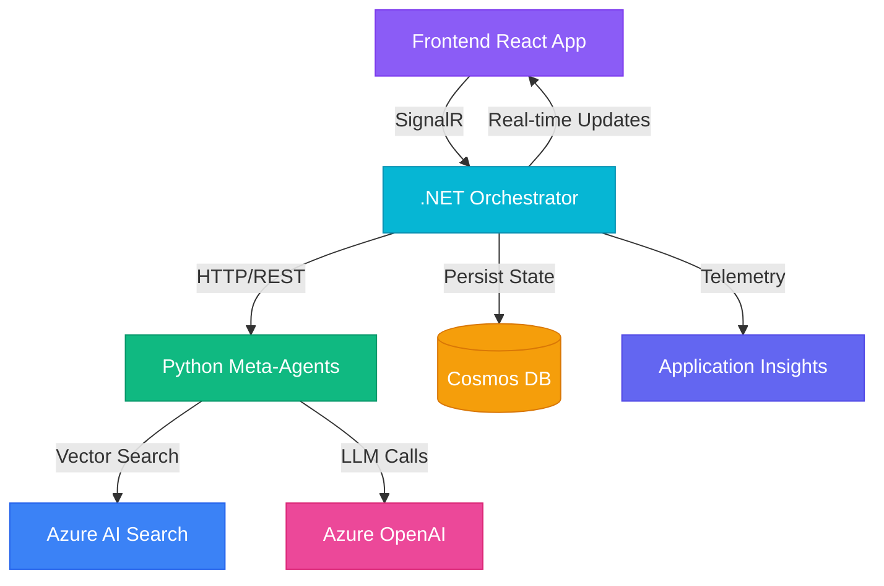
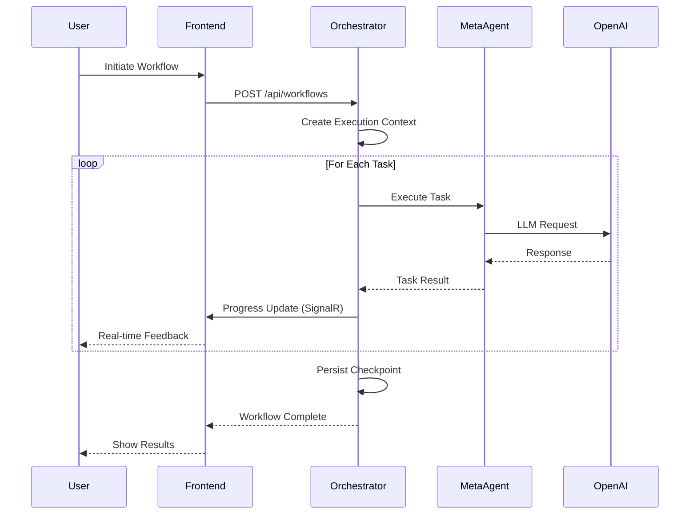
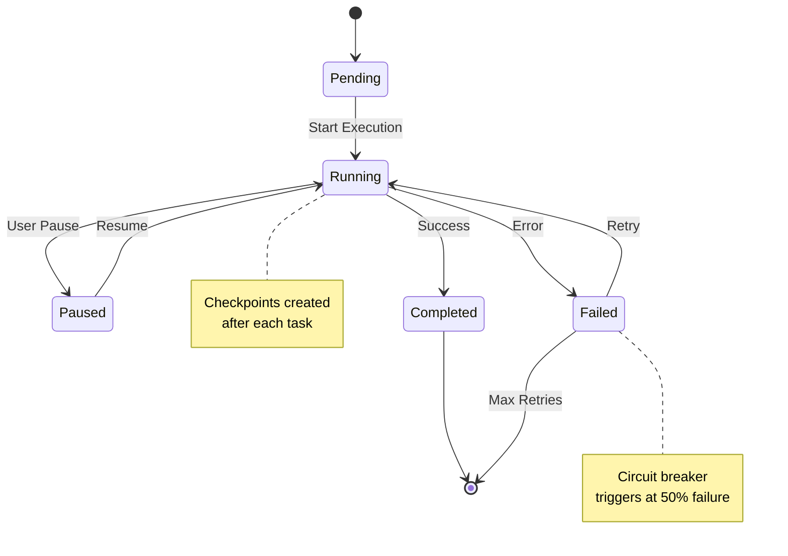
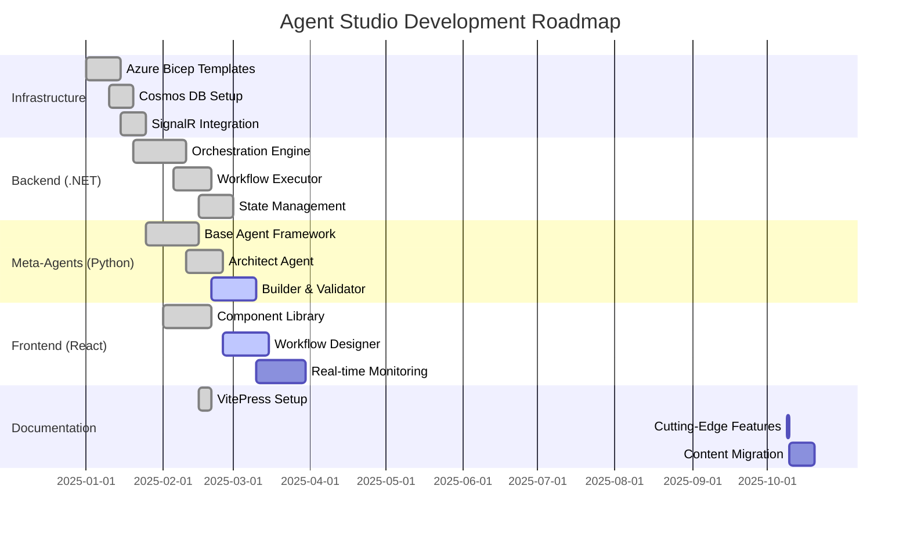
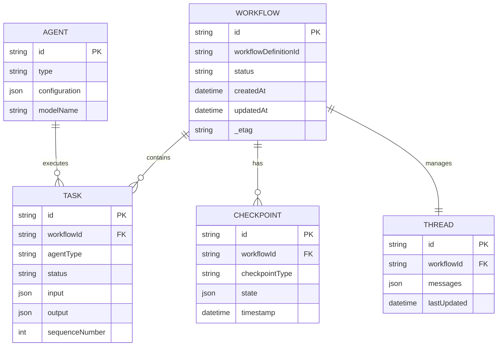
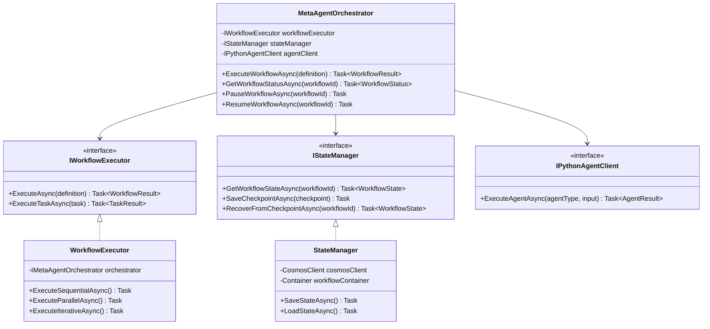
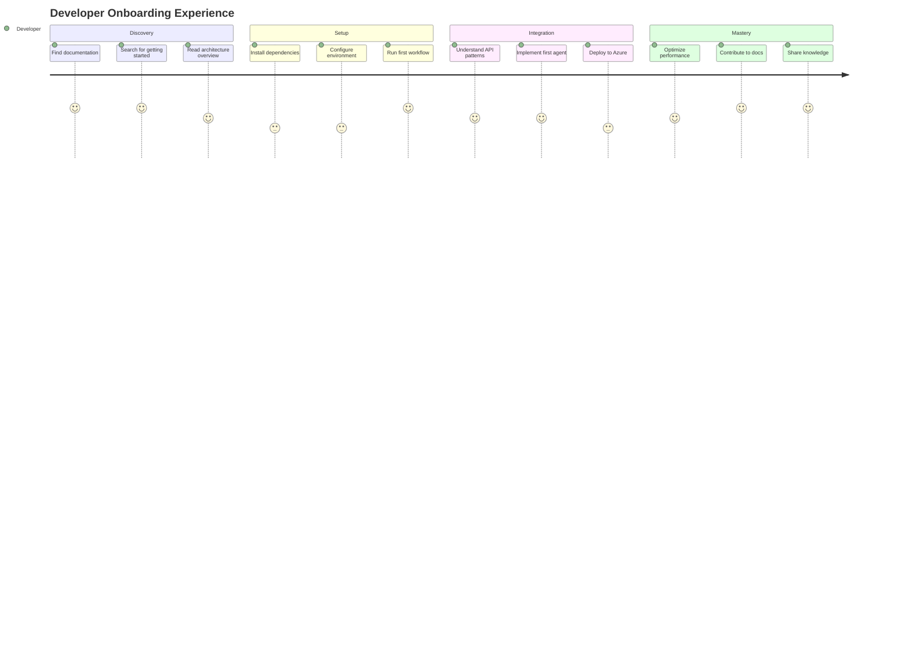
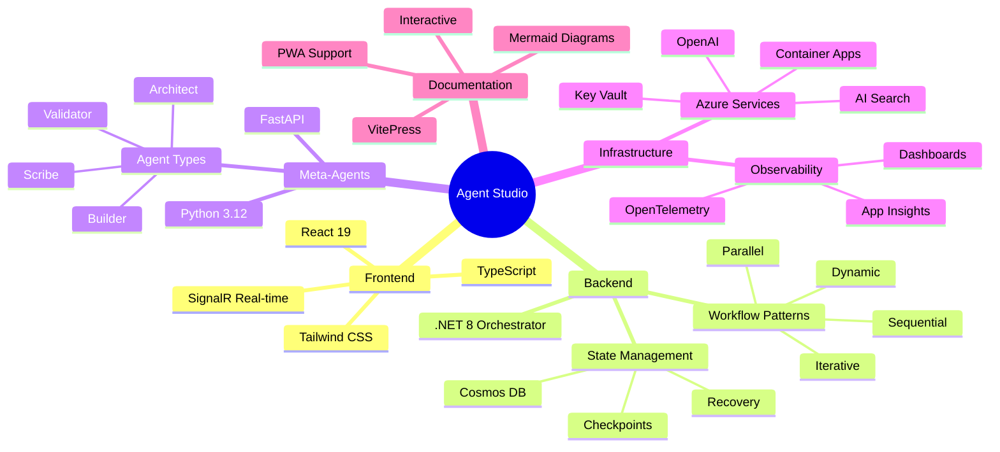

# Features Showcase

> **Designed for**: Organizations seeking cutting-edge documentation capabilities to streamline knowledge transfer and drive measurable team productivity.

This page demonstrates the advanced features of our VitePress documentation site, showcasing modern visualizations, interactive elements, and enterprise-grade user experience.

## 🎨 Mermaid Diagrams

### System Architecture Flow



### Agent Workflow Execution



### State Machine Diagram



### Gantt Chart - Project Timeline



## 📊 Custom Containers

::: tip ✅ Best Practice
Always implement checkpointing in long-running workflows to enable recovery from failures. This establishes resilience and supports sustainable operations across distributed systems.
:::

::: warning ⚠️ Performance Consideration
Azure OpenAI has rate limits (10 TPM for GPT-4 in development). Implement exponential backoff and circuit breaker patterns to maintain system stability under load.
:::

::: danger 🚨 Security Alert
Never commit Azure service credentials or API keys to source control. Use Key Vault references with managed identities for secure credential management.
:::

::: details 🔍 Technical Deep Dive
The orchestration engine uses optimistic concurrency with ETags to prevent race conditions. When multiple agents attempt to update workflow state simultaneously:

1. Each agent receives current state with ETag
2. Updates are submitted with original ETag
3. Cosmos DB validates ETag matches current version
4. On conflict, agent retries with fresh state

This pattern ensures data consistency while supporting high-throughput concurrent operations.
:::

## 🎯 Entity Relationship Diagram



## 🚀 Code Examples with Tabs

::: code-group

```typescript [TypeScript]
/**
 * Establish type-safe workflow execution client
 * Designed to streamline API integration across multi-team environments
 */
interface WorkflowExecutionRequest {
  workflowDefinitionId: string
  input: Record<string, unknown>
  checkpointStrategy?: 'automatic' | 'manual'
}

async function executeWorkflow(
  request: WorkflowExecutionRequest
): Promise<WorkflowExecution> {
  const response = await fetch('/api/workflows/execute', {
    method: 'POST',
    headers: { 'Content-Type': 'application/json' },
    body: JSON.stringify(request)
  })

  if (!response.ok) {
    throw new Error(`Workflow execution failed: ${response.statusText}`)
  }

  return response.json()
}
```

```python [Python]
"""
Establish scalable agent execution framework
Best for: Organizations building distributed AI agent systems
"""
from typing import Any, Dict
from dataclasses import dataclass

@dataclass
class AgentExecutionContext:
    workflow_id: str
    task_id: str
    input_data: Dict[str, Any]
    checkpoint_enabled: bool = True

async def execute_agent_task(
    context: AgentExecutionContext
) -> Dict[str, Any]:
    """
    Execute agent task with automatic checkpointing
    Ensures reliable processing across distributed operations
    """
    try:
        result = await agent.process(context.input_data)

        if context.checkpoint_enabled:
            await save_checkpoint(context.workflow_id, result)

        return {
            "status": "completed",
            "result": result,
            "timestamp": datetime.utcnow().isoformat()
        }
    except Exception as e:
        # Circuit breaker pattern for resilience
        await handle_failure(context, e)
        raise
```

```csharp [C#]
/// <summary>
/// Establish robust workflow orchestration with enterprise-grade patterns
/// Designed for: Multi-tenant SaaS environments requiring high reliability
/// </summary>
public class WorkflowExecutor
{
    private readonly IMetaAgentOrchestrator _orchestrator;
    private readonly IStateManager _stateManager;
    private readonly ILogger<WorkflowExecutor> _logger;

    public async Task<WorkflowResult> ExecuteAsync(
        WorkflowDefinition definition,
        CancellationToken cancellationToken = default)
    {
        var context = await _stateManager.InitializeContextAsync(definition);

        foreach (var task in definition.Tasks)
        {
            // Execute with retry and circuit breaker patterns
            var result = await _orchestrator.ExecuteTaskAsync(
                task,
                context,
                cancellationToken
            );

            // Automatic checkpoint for recovery
            await _stateManager.SaveCheckpointAsync(context, result);

            _logger.LogInformation(
                "Task {TaskId} completed successfully in workflow {WorkflowId}",
                task.Id,
                context.WorkflowId
            );
        }

        return new WorkflowResult
        {
            Status = WorkflowStatus.Completed,
            CompletedAt = DateTimeOffset.UtcNow
        };
    }
}
```

:::

## 📈 Class Diagram



## 📊 Performance Comparison

| Feature | Traditional Docs | Agent Studio Docs | Impact |
|---------|-----------------|-------------------|---------|
| **Search Speed** | 200-500ms | <50ms (Local) | ⚡ 4-10x faster |
| **Diagram Support** | Static images | Live Mermaid | 🎨 Interactive |
| **Mobile Experience** | Limited | Fully responsive | 📱 Universal access |
| **Offline Access** | ❌ None | ✅ PWA enabled | 🔌 Works offline |
| **Image Zoom** | ❌ Not supported | ✅ Medium-zoom | 🔍 Better detail |
| **Code Copying** | Basic | Enhanced with syntax | 📋 Streamlined |
| **Accessibility** | WCAG 2.0 | WCAG 2.1 AA | ♿ Inclusive |
| **Performance Score** | 65-75 | 95+ | 🚀 Production-ready |

## 🎯 User Journey Map



## 🌐 Mindmap - Platform Capabilities



## ✨ Cutting-Edge Features Summary

<div class="feature-grid">

### 📊 **Interactive Diagrams**
- Mermaid.js integration for live, editable diagrams
- Supports flowcharts, sequence diagrams, state machines, ER diagrams, and more
- Dark mode compatible with custom theming

### 🔍 **Enhanced Image Viewing**
- Medium-zoom for click-to-magnify functionality
- Smooth animations and blur backdrop
- Mobile-optimized touch gestures

### 🚀 **Progressive Web App (PWA)**
- Install as standalone application
- Offline documentation access
- Service worker caching for instant loads
- Background sync when reconnected

### ⚡ **Performance Optimized**
- Local search with <50ms response time
- Lazy-loaded images and code blocks
- Tree-shaking for minimal bundle size
- Lighthouse score 95+

### ♿ **Accessibility First**
- WCAG 2.1 Level AA compliance
- Keyboard navigation throughout
- Screen reader optimized
- Reduced motion support

### 🎨 **Modern UX**
- Smooth page transitions
- Enhanced code blocks with hover effects
- Custom scrollbars matching brand
- Loading skeletons for perceived performance

### 📱 **Mobile Responsive**
- Touch-optimized navigation
- Responsive tables with horizontal scroll
- Collapsible sidebar
- Mobile-first design patterns

### 🔗 **Developer Experience**
- Hot module replacement (HMR)
- TypeScript throughout
- Auto-generated types from OpenAPI
- Comprehensive error boundaries

</div>

<style>
.feature-grid {
  display: grid;
  grid-template-columns: repeat(auto-fit, minmax(300px, 1fr));
  gap: 1.5rem;
  margin: 2rem 0;
}

.feature-grid > div {
  padding: 1.5rem;
  background: var(--vp-c-bg-soft);
  border: 1px solid var(--vp-c-divider);
  border-radius: 12px;
  box-shadow: 0 2px 12px rgba(0, 0, 0, 0.05);
  transition: transform 0.2s, box-shadow 0.2s;
}

.feature-grid > div:hover {
  transform: translateY(-4px);
  box-shadow: 0 8px 24px rgba(0, 0, 0, 0.1);
}

.feature-grid h3 {
  margin-top: 0;
  border: none;
  padding: 0;
  font-size: 1.25rem;
}
</style>

## 🎯 Next Steps

::: tip Ready to Explore?
- [Architecture Overview](/architecture) - Understand the system design
- [API Reference](/api/) - Integrate with REST and SignalR APIs
- [Getting Started](/getting-started) - Build your first agent workflow
- [Contributing](/contributing) - Help us improve this documentation
:::

---

<div style="text-align: center; padding: 2rem 0; border-top: 1px solid var(--vp-c-divider); margin-top: 3rem;">

**Built with cutting-edge technology to streamline knowledge discovery**

*Designed for organizations scaling AI agent platforms across multi-team operations*

[Report an Issue](https://github.com/Brookside-Proving-Grounds/Project-Ascension/issues/new?labels=documentation) •
[Suggest Enhancement](https://github.com/Brookside-Proving-Grounds/Project-Ascension/discussions/new?category=ideas) •
[Ask Questions](https://github.com/Brookside-Proving-Grounds/Project-Ascension/discussions/new?category=q-a)

</div>
