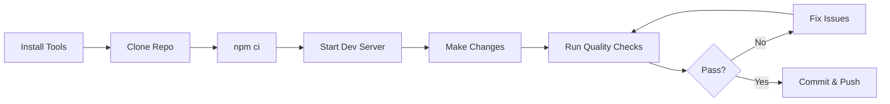

# Installation Guide

Complete guide to setting up Agent Studio for local development, including the documentation quality tools.

## Overview

This guide covers:
- Installing prerequisites (Node.js, .NET, Python)
- Setting up the development environment
- Installing documentation quality tools
- Verifying your installation

## Prerequisites

### Required Software

| Software | Version | Purpose |
|----------|---------|---------|
| Node.js | 20.x or higher | Frontend, VitePress documentation |
| npm | 10.x or higher | Package management |
| .NET SDK | 8.0 | Backend API |
| Python | 3.12 | Agent service |
| Git | Latest | Version control |

### System Requirements

- **OS**: Windows 10/11, macOS 11+, or Linux (Ubuntu 20.04+)
- **RAM**: 8GB minimum, 16GB recommended
- **Disk Space**: 10GB free space
- **Network**: Internet connection for package downloads

## Installation Steps

### 1. Install Node.js and npm

Node.js is required for the frontend, VitePress documentation, and documentation quality tools.

**Windows**:
```bash
# Download installer from https://nodejs.org/
# Or use Chocolatey
choco install nodejs-lts

# Verify installation
node --version  # Should show v20.x or higher
npm --version   # Should show 10.x or higher
```

**macOS**:
```bash
# Using Homebrew
brew install node@20

# Or using nvm (recommended)
curl -o- https://raw.githubusercontent.com/nvm-sh/nvm/v0.39.0/install.sh | bash
nvm install 20
nvm use 20

# Verify installation
node --version
npm --version
```

**Linux**:
```bash
# Using nvm (recommended)
curl -o- https://raw.githubusercontent.com/nvm-sh/nvm/v0.39.0/install.sh | bash
source ~/.bashrc
nvm install 20
nvm use 20

# Or using apt (Ubuntu/Debian)
curl -fsSL https://deb.nodesource.com/setup_20.x | sudo -E bash -
sudo apt-get install -y nodejs

# Verify installation
node --version
npm --version
```

### 2. Install .NET SDK 8.0

The .NET SDK is required for the backend API.

**Windows**:
```bash
# Download installer from https://dot.net/
# Or use Chocolatey
choco install dotnet-sdk

# Verify installation
dotnet --version  # Should show 8.0.x
```

**macOS**:
```bash
# Download installer from https://dot.net/
# Or use Homebrew
brew install dotnet@8

# Verify installation
dotnet --version
```

**Linux**:
```bash
# Ubuntu/Debian
wget https://dot.net/v1/dotnet-install.sh
chmod +x dotnet-install.sh
./dotnet-install.sh --channel 8.0

# Add to PATH (add to ~/.bashrc)
export DOTNET_ROOT=$HOME/.dotnet
export PATH=$PATH:$DOTNET_ROOT:$DOTNET_ROOT/tools

# Verify installation
dotnet --version
```

### 3. Install Python 3.12

Python is required for the agent service.

**Windows**:
```bash
# Download installer from https://www.python.org/
# Or use Chocolatey
choco install python312

# Verify installation
python --version  # Should show 3.12.x
pip --version
```

**macOS**:
```bash
# Using Homebrew
brew install python@3.12

# Verify installation
python3 --version
pip3 --version
```

**Linux**:
```bash
# Ubuntu/Debian
sudo apt update
sudo apt install python3.12 python3.12-venv python3-pip

# Verify installation
python3 --version
pip3 --version
```

### 4. Install Git

Git is required for version control.

**Windows**:
```bash
# Download from https://git-scm.com/
# Or use Chocolatey
choco install git

# Verify installation
git --version
```

**macOS**:
```bash
# Using Homebrew
brew install git

# Or use Xcode Command Line Tools
xcode-select --install

# Verify installation
git --version
```

**Linux**:
```bash
# Ubuntu/Debian
sudo apt install git

# Verify installation
git --version
```

## Clone the Repository

Clone the Agent Studio repository:

```bash
# Clone repository
git clone https://github.com/Brookside-Proving-Grounds/Project-Ascension.git

# Navigate to project directory
cd Project-Ascension

# Verify repository structure
ls -la
```

## Install Project Dependencies

### Install Node.js Dependencies

This installs all dependencies for the frontend and documentation tools:

```bash
# Install dependencies (use ci for reproducible builds)
npm ci

# Verify installation
npm list --depth=0
```

**What gets installed**:
- VitePress - Documentation site generator
- cspell - Spell checker
- markdown-link-check - Link validator
- Semantic release tools
- TypeScript definitions

### Install Backend Dependencies

```bash
# Navigate to backend directory
cd backend

# Restore .NET packages
dotnet restore

# Build project
dotnet build

# Navigate back to root
cd ..
```

### Install Python Dependencies

```bash
# Navigate to Python service directory
cd python-service

# Create virtual environment
python3 -m venv venv

# Activate virtual environment
# Windows
venv\Scripts\activate
# macOS/Linux
source venv/bin/activate

# Install dependencies
pip install -r requirements.txt

# Navigate back to root
cd ..
```

## Install Documentation Quality Tools

The documentation quality tools are included in the npm dependencies, but you can also install them globally for convenience:

### Global Installation (Optional)

```bash
# Install cspell globally
npm install -g cspell

# Install markdown-link-check globally
npm install -g markdown-link-check

# Verify global installation
cspell --version
markdown-link-check --version
```

**Note**: Global installation is optional. The project scripts use local installations.

## Verify Installation

### Run Quick Health Check

```bash
# Verify all tools are available
node --version
npm --version
dotnet --version
python3 --version
git --version

# Verify npm scripts are available
npm run --silent
```

Expected output:
```bash
v20.x.x
10.x.x
8.0.xxx
Python 3.12.x
git version 2.x.x

Available scripts:
  docs:dev
  docs:build
  docs:preview
  docs:lint
  docs:frontmatter
  docs:links
  docs:spell
  docs:duplicates
```

### Run Documentation Quality Checks

Verify documentation tools are working:

```bash
# Run all quality checks
npm run docs:lint
```

Expected output if successful:
```bash
✓ Frontmatter validation passed
✓ Link checking passed
✓ Spell checking passed
✓ Duplicate detection passed

All documentation quality checks passed! ✨
```

**If checks fail**: This is normal on first run. See [CI/CD Troubleshooting Guide](../guides/developer/ci-cd-troubleshooting.md).

### Start Development Server

Test that VitePress documentation works:

```bash
# Start documentation dev server
npm run docs:dev
```

Expected output:
```bash
  vitepress v1.6.4

  ➜  Local:   http://localhost:5173/
  ➜  Network: use --host to expose
  ➜  press h to show help
```

Open your browser to `http://localhost:5173` to view the documentation.

**Press Ctrl+C to stop the server.**

## Configuration

### Configure Git

Set up your Git identity:

```bash
# Configure user name
git config --global user.name "Your Name"

# Configure email
git config --global user.email "your.email@example.com"

# Verify configuration
git config --list
```

### Configure IDE

#### Visual Studio Code (Recommended)

Install recommended extensions:

```bash
# Install VS Code extensions
code --install-extension streetsidesoftware.code-spell-checker
code --install-extension yzhang.markdown-all-in-one
code --install-extension DavidAnson.vscode-markdownlint
code --install-extension ms-dotnettools.csharp
code --install-extension ms-python.python
code --install-extension Vue.volar
```

#### JetBrains Rider

1. Install plugins:
   - Markdown Navigator Enhanced
   - Grazie (spell checker)
   - .NET Core Support
   - Python Support

2. Configure spell checker:
   - Settings → Editor → Natural Languages → Grazie
   - Enable spell checking for markdown files

## Next Steps

Now that you have everything installed:

1. **Run the Application**:
   - [Local Development Guide](../guides/developer/local-development.md)
   - [Your First Agent](../getting-started/first-agent.md)

2. **Explore Documentation**:
   - [Architecture Overview](../architecture/ARCHITECTURE.md)
   - [API Reference](../api/META_AGENTS_API.md)
   - [Development Guide](../development/SETUP.md)

3. **Contribute to Documentation**:
   - [CI/CD Quick Start](../guides/developer/ci-cd-quickstart.md)
   - [Documentation Quality Guide](../../.github/DOCS-QUALITY-GUIDE.md)

## Documentation Development Workflow

### Quick Commands

```bash
# Start documentation dev server (hot reload)
npm run docs:dev

# Run quality checks before committing
npm run docs:lint

# Build production documentation
npm run docs:build

# Preview production build
npm run docs:preview
```

### Recommended Workflow



### Pre-Commit Checklist

Before committing documentation changes:

1. Run quality checks: `npm run docs:lint`
2. Fix any errors reported
3. Test build locally: `npm run docs:build`
4. Preview production build: `npm run docs:preview`
5. Commit changes: `git commit -m "docs: your message"`

## Troubleshooting

### Node.js Version Issues

**Problem**: `npm ci` fails with version error

**Solution**: Use correct Node.js version
```bash
# Install correct version
nvm install 20
nvm use 20

# Verify version
node --version  # Should be v20.x.x
```

### Permission Issues (Linux/macOS)

**Problem**: Permission denied when running scripts

**Solution**: Fix permissions
```bash
# Make scripts executable
chmod +x scripts/*.js

# Or run with explicit interpreter
node scripts/validate-frontmatter.js
```

### npm ci Fails

**Problem**: `npm ci` fails with dependency errors

**Solution**: Clean install
```bash
# Remove existing dependencies
rm -rf node_modules package-lock.json

# Fresh install
npm install

# Create new lockfile
npm ci
```

### Python Virtual Environment Issues

**Problem**: Cannot activate virtual environment

**Solution**: Recreate venv
```bash
# Remove existing venv
rm -rf python-service/venv

# Create new venv
cd python-service
python3 -m venv venv

# Activate and install
source venv/bin/activate  # macOS/Linux
# or
venv\Scripts\activate  # Windows

pip install -r requirements.txt
```

### Port Already in Use

**Problem**: Dev server fails because port 5173 is in use

**Solution**: Kill process or use different port
```bash
# Kill process on port 5173
# Windows
netstat -ano | findstr :5173
taskkill /PID <PID> /F

# macOS/Linux
lsof -ti:5173 | xargs kill -9

# Or use different port
npm run docs:dev -- --port 3000
```

## Additional Resources

### Documentation

- [CI/CD Quick Start Guide](../guides/developer/ci-cd-quickstart.md) - Run quality checks locally
- [CI/CD Troubleshooting](../guides/developer/ci-cd-troubleshooting.md) - Fix common issues
- [Documentation Quality Guide](../../.github/DOCS-QUALITY-GUIDE.md) - Standards and best practices
- [VitePress Documentation](https://vitepress.dev) - Official VitePress docs

### Development Guides

- [Local Development](../guides/developer/local-development.md)
- [.NET Development](../development/DOTNET_DEVELOPMENT.md)
- [Python Development](../development/PYTHON_DEVELOPMENT.md)
- [React Development](../development/REACT_DEVELOPMENT.md)

### Getting Help

- [GitHub Issues](https://github.com/Brookside-Proving-Grounds/Project-Ascension/issues)
- [GitHub Discussions](https://github.com/Brookside-Proving-Grounds/Project-Ascension/discussions)
- [Contributing Guide](../development/CONTRIBUTING.md)

## Verification Checklist

Use this checklist to verify your installation:

- [ ] Node.js 20.x+ installed (`node --version`)
- [ ] npm 10.x+ installed (`npm --version`)
- [ ] .NET SDK 8.0 installed (`dotnet --version`)
- [ ] Python 3.12 installed (`python3 --version`)
- [ ] Git installed (`git --version`)
- [ ] Repository cloned successfully
- [ ] npm dependencies installed (`npm ci`)
- [ ] Documentation quality checks run (`npm run docs:lint`)
- [ ] Dev server starts (`npm run docs:dev`)
- [ ] Documentation loads in browser (`http://localhost:5173`)
- [ ] IDE configured with recommended extensions

**All checked?** You're ready to start developing!

Proceed to [Your First Agent](./first-agent.md) to build your first AI agent.

---

**Need Help?** Check the [CI/CD Troubleshooting Guide](../guides/developer/ci-cd-troubleshooting.md) or ask in [GitHub Discussions](https://github.com/Brookside-Proving-Grounds/Project-Ascension/discussions).
