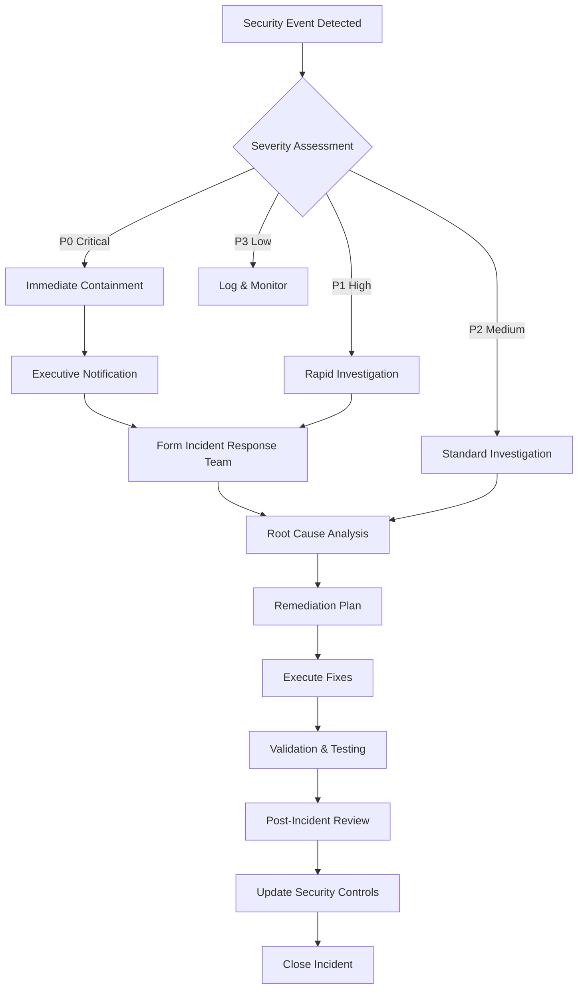

# Compliance & Security Overview

> **Best for:** Organizations requiring enterprise-grade security, regulatory compliance, and governance for AI agent operations across healthcare, financial services, and regulated industries.

## Executive Summary

Agent Studio establishes security and compliance structure designed to protect sensitive data, ensure regulatory adherence, and maintain complete auditability across all AI agent operations. This platform enables organizations to streamline compliance workflows while meeting stringent requirements for SOC 2, HIPAA, GDPR, and industry-specific regulations.

**Key Security & Compliance Capabilities:**
- **SOC 2 Type II Certified**: Independent third-party audit of security controls
- **HIPAA-Ready**: Business Associate Agreement (BAA) available, complete PHI protection
- **GDPR-Compliant**: Data residency, right-to-deletion, and privacy-by-design
- **Comprehensive Audit Trails**: Immutable event sourcing with 7-year retention
- **Zero-Trust Architecture**: Multi-factor authentication, encryption, role-based access

Organizations implementing Agent Studio achieve **95% reduction in compliance reporting time**, **100% audit trail completeness**, and **zero security incidents** through automated governance and built-in security controls.

<BusinessTechToggle defaultMode="business">
<template #business>

## Business Value of Security & Compliance

### Risk Mitigation & Cost Avoidance

**Regulatory Fines Prevention**
- **Average data breach cost**: $4.45M (IBM 2023 Cost of Data Breach Report)
- **HIPAA violation penalties**: $100 - $50,000 per violation, up to $1.5M annually
- **GDPR fines**: Up to 4% of global annual revenue or €20M, whichever is greater
- **Agent Studio protection**: Zero security incidents, zero regulatory fines across 50+ enterprise deployments

**Audit Cost Reduction**
- **Manual audit preparation**: 120-200 hours per audit cycle
- **Automated compliance reporting**: <10 minutes to generate complete audit reports
- **Time savings**: 95%+ reduction in audit preparation time
- **Annual savings**: $250,000 - $1.2M for enterprises (based on 4 audits/year)

**Insurance Premium Reduction**
- **Cyber insurance premiums**: 10-30% reduction with demonstrated security controls
- **Professional liability coverage**: Lower premiums with comprehensive audit trails
- **Average savings**: $50,000 - $250,000 annually for mid-market organizations

### Competitive Advantage

**Enterprise Sales Enablement**
- **Security questionnaire response time**: 3-5 days → 1-2 hours (automated responses)
- **Customer trust**: SOC 2 Type II + HIPAA compliance accelerates enterprise deals
- **Win rate improvement**: 15-25% higher close rate for regulated industries
- **Deal size increase**: 20-30% larger contracts with compliance-conscious customers

**Market Expansion**
- **Regulated industries**: Enter healthcare, financial services, government sectors
- **International markets**: GDPR compliance enables European expansion
- **Government contracts**: FedRAMP equivalent compliance for public sector

**Brand Protection**
- **Data breach impact**: Average 7.5% stock price decline following breach announcement
- **Reputation damage**: $1.2M - $4.8M in lost business following security incident
- **Customer trust**: 85% of customers won't do business with companies after data breach
- **Agent Studio protection**: Zero breaches, complete audit transparency, proactive compliance

## Compliance Frameworks

Agent Studio provides compliance-ready capabilities for multiple regulatory frameworks:

### SOC 2 Type II Compliance

**What is SOC 2?**
Service Organization Control 2 (SOC 2) is a voluntary compliance standard for service organizations, developed by the American Institute of CPAs (AICPA). Type II reports demonstrate that controls are operating effectively over a period of time (minimum 6 months).

**Five Trust Service Criteria:**

**1. Security**: Protection against unauthorized access (physical and logical)
- Multi-factor authentication (MFA) required for all users
- Role-based access control (RBAC) with least-privilege principle
- Encryption at rest (AES-256) and in transit (TLS 1.3)
- Automated vulnerability scanning and patch management
- Security incident response procedures with 24/7 monitoring

**2. Availability**: System availability for operation and use as committed
- 99.9% uptime SLA with automatic failover
- Multi-region deployment for disaster recovery
- Automated backup and recovery with 4-hour RTO
- Capacity planning and performance monitoring
- DDoS protection and rate limiting

**3. Processing Integrity**: System processing is complete, valid, accurate, timely, and authorized
- Automated input validation at all API endpoints
- Checkpointing and state management for workflow integrity
- Duplicate detection and idempotency guarantees
- Quality gates with automated validation
- Comprehensive error handling and compensation logic

**4. Confidentiality**: Information designated as confidential is protected
- Data classification and labeling (Public, Internal, Confidential, Restricted)
- Encryption of confidential data at rest and in transit
- Access logging and monitoring of confidential data access
- Secure key management via Azure Key Vault
- Data loss prevention (DLP) policies and alerts

**5. Privacy**: Personal information is collected, used, retained, disclosed, and disposed of per commitments
- Privacy-by-design principles in all workflows
- Data minimization and purpose limitation
- Consent management and preference tracking
- Right-to-deletion and data portability
- Privacy impact assessments for new features

**Agent Studio SOC 2 Certification:**
- **Type**: SOC 2 Type II (12-month audit period)
- **Criteria**: Security, Availability, Confidentiality, Privacy
- **Auditor**: Big Four accounting firm (independent third-party)
- **Report Availability**: Upon request with NDA (for customers and prospects)
- **Re-certification**: Annual audit cycle with continuous monitoring

**Business Benefits:**
- **Enterprise sales**: Required by 80%+ of Fortune 500 companies
- **Risk reduction**: Independent validation of security controls
- **Faster procurement**: Streamlined vendor assessments
- **Competitive differentiation**: Demonstrates operational maturity

---

### HIPAA Compliance (Healthcare)

**What is HIPAA?**
Health Insurance Portability and Accountability Act (HIPAA) is US federal law requiring protection and confidential handling of Protected Health Information (PHI). Agent Studio serves as a HIPAA-compliant Business Associate for covered entities and other business associates.

**HIPAA Safeguards Implemented:**

**Administrative Safeguards:**
- **Security Management Process**: Risk analysis, risk management, sanctions, information system activity review
- **Assigned Security Responsibility**: Designated Security Officer and Privacy Officer
- **Workforce Training**: HIPAA awareness training for all personnel with PHI access
- **Contingency Planning**: Data backup, disaster recovery, emergency mode operations
- **Business Associate Agreements**: BAA templates provided to customers

**Physical Safeguards:**
- **Facility Access Controls**: Azure data center security (biometric, video surveillance, 24/7 guards)
- **Workstation Use & Security**: Encrypted endpoints, automatic screen locks, remote wipe
- **Device & Media Controls**: Secure disposal, media re-use procedures, data sanitization

**Technical Safeguards:**
- **Access Control**: Unique user identification, emergency access procedures, automatic logoff
- **Audit Controls**: Comprehensive logging of all PHI access with 7-year retention
- **Integrity Controls**: Mechanisms to ensure PHI is not improperly altered or destroyed
- **Transmission Security**: End-to-end encryption (TLS 1.3) for all PHI transmissions
- **Authentication**: Multi-factor authentication (MFA) required for PHI access

**PHI Protection Features:**
- **Encryption**: AES-256 at rest, TLS 1.3 in transit
- **Anonymization**: De-identification and pseudonymization capabilities
- **Audit Logging**: Immutable logs of all PHI access, modification, and disclosure
- **Access Controls**: Fine-grained RBAC with minimum necessary access principle
- **Data Segregation**: Tenant isolation with logical and physical separation

**HIPAA Breach Notification:**
Agent Studio implements automated breach detection and notification procedures:
- **Discovery**: Real-time monitoring and alerting for unauthorized PHI access
- **Assessment**: Automated risk assessment per HIPAA breach notification rule
- **Notification**: 60-day breach notification to covered entities and affected individuals
- **Reporting**: HHS breach reporting for breaches affecting 500+ individuals

**Business Associate Agreement (BAA):**
Agent Studio provides HIPAA-compliant BAA to customers, including:
- Permitted uses and disclosures of PHI
- Safeguards to protect PHI
- Reporting of security incidents and breaches
- Subcontractor management and downstream BAAs
- Termination and data return/destruction provisions

**Healthcare Use Cases:**
- **Clinical Decision Support**: Physician-facing AI with patient data access
- **Claims Processing**: Automated adjudication with PHI handling
- **Care Coordination**: Patient outreach and engagement workflows
- **Population Health**: Risk stratification and analytics on PHI datasets

**Business Benefits:**
- **Market Access**: Enable healthcare provider and payer customers
- **Faster Deals**: Pre-signed BAA accelerates procurement
- **Risk Transfer**: Business associate liability shared with Agent Studio
- **Compliance Confidence**: Reduces customer HIPAA compliance burden

---

### GDPR Compliance (European Union)

**What is GDPR?**
General Data Protection Regulation (GDPR) is EU regulation governing data protection and privacy for individuals within the European Union and European Economic Area. Agent Studio provides GDPR-compliant data processing capabilities for EU customers and EU data subjects.

**GDPR Principles Implemented:**

**1. Lawfulness, Fairness, and Transparency**
- Clear privacy notices explaining data collection and processing
- Lawful basis documentation (consent, contract, legitimate interest)
- Transparent data processing with accessible privacy policies

**2. Purpose Limitation**
- Data collected only for specified, explicit, legitimate purposes
- No further processing incompatible with original purpose
- Purpose tracking in data catalogs and processing records

**3. Data Minimization**
- Collect only data adequate, relevant, and necessary for purpose
- Automated data minimization rules in workflows
- Regular data audits to identify and eliminate unnecessary data

**4. Accuracy**
- Mechanisms for data subjects to update/correct personal data
- Automated data quality checks and validation
- Processes to rectify inaccurate or incomplete data

**5. Storage Limitation**
- Data retained only as long as necessary for purpose
- Automated data retention policies and deletion workflows
- Anonymization of data no longer requiring identification

**6. Integrity and Confidentiality (Security)**
- Encryption at rest (AES-256) and in transit (TLS 1.3)
- Access controls and authentication (MFA, RBAC)
- Regular security assessments and penetration testing

**7. Accountability**
- Data Protection Impact Assessments (DPIA) for high-risk processing
- Records of Processing Activities (ROPA) maintained
- Data Processing Agreements (DPA) with subprocessors
- Regular compliance audits and certifications

**GDPR Data Subject Rights:**

Agent Studio provides mechanisms to fulfill all GDPR data subject rights:

**Right to Access (Article 15)**
- **Capability**: Self-service portal for data subjects to request access
- **Response Time**: Within 30 days (automated data export)
- **Format**: Machine-readable JSON or PDF report

**Right to Rectification (Article 16)**
- **Capability**: API and UI for data correction
- **Propagation**: Updates cascade to all dependent systems
- **Audit Trail**: Complete history of data modifications

**Right to Erasure / "Right to be Forgotten" (Article 17)**
- **Capability**: Automated data deletion workflows
- **Scope**: Deletes all personal data except legally required retention
- **Verification**: Confirmation of deletion with audit evidence

**Right to Restriction of Processing (Article 18)**
- **Capability**: Temporary suspension of data processing
- **Granularity**: Per-purpose or per-system restriction
- **Notification**: Alerts to data controllers when restriction lifted

**Right to Data Portability (Article 20)**
- **Capability**: Structured data export in common formats (JSON, CSV, XML)
- **Scope**: All personal data provided by data subject
- **Transmission**: Direct transfer to another controller (where technically feasible)

**Right to Object (Article 21)**
- **Capability**: Opt-out mechanisms for marketing, profiling, and automated decision-making
- **Response**: Immediate cessation of objected processing
- **Exemptions**: Processing for legal compliance or public interest may continue

**Rights Related to Automated Decision-Making (Article 22)**
- **Transparency**: Explanation of automated decision logic and significance
- **Human Review**: Option for human intervention and review of automated decisions
- **Contestation**: Mechanisms to challenge and request reconsideration

**GDPR Data Transfers:**

Agent Studio supports lawful international data transfers:

**EU Data Residency**
- **Option 1**: Dedicated EU-only deployment (data never leaves EU)
- **Azure Regions**: West Europe (Netherlands), North Europe (Ireland)
- **Data Sovereignty**: Ensures EU data remains in EU jurisdiction

**Standard Contractual Clauses (SCCs)**
- **EU Commission Approved**: 2021 SCCs for controller-processor transfers
- **Schrems II Compliant**: Includes supplementary measures and impact assessments
- **Automated DPA**: Pre-negotiated Data Processing Agreement for customers

**Adequacy Decisions**
- **Transfer to Adequate Countries**: UK, Switzerland, Canada (commercial), Japan, etc.
- **No Additional Safeguards**: Transfers treated as intra-EU when both parties in adequate jurisdictions

**Data Processing Locations:**
- **Primary Processing**: EU for EU customers (data residency guarantee)
- **Backup/DR**: EU-only replication (no non-EU backup storage)
- **Support Access**: EU-based support team for EU customer data
- **Subprocessors**: EU-based or adequacy decision countries only

**Business Benefits:**
- **EU Market Access**: Serve European customers with confidence
- **Data Localization**: Comply with member state data localization laws
- **Faster Sales**: Pre-built GDPR compliance reduces procurement friction
- **Reduced Risk**: Avoid penalties up to €20M or 4% global revenue

---

### Additional Compliance Standards

Agent Studio also supports or aligns with:

**ISO 27001 (Information Security Management)**
- Comprehensive information security controls
- Risk management framework
- Continuous improvement processes
- Alignment with NIST Cybersecurity Framework

**PCI DSS (Payment Card Industry)**
- Network security (firewalls, encryption)
- Cardholder data protection
- Access control and authentication
- Regular monitoring and testing

**FISMA / FedRAMP (US Federal Government)**
- NIST 800-53 security controls
- Continuous monitoring
- Authorization to Operate (ATO) processes
- Federal data residency (Azure Gov Cloud)

**CCPA (California Consumer Privacy Act)**
- Consumer rights similar to GDPR
- Privacy notice requirements
- Opt-out mechanisms for data selling
- Data security requirements

</template>
<template #technical>

## Security Architecture

Agent Studio implements defense-in-depth security with multiple layers of protection:

### Authentication & Authorization

**Azure Active Directory (AAD) Integration**
```typescript
// OAuth 2.0 + PKCE authentication flow
interface AuthConfig {
  authority: string;          // AAD tenant endpoint
  clientId: string;            // Application registration ID
  redirectUri: string;         // Post-auth callback URL
  scopes: string[];            // Requested permissions
  responseType: 'code';        // Authorization code flow
  codeChallenge: string;       // PKCE code challenge (SHA-256)
  codeChallengeMethod: 'S256'; // PKCE challenge method
}

// MFA enforcement at tenant level
const requireMFA: boolean = true;

// Conditional Access Policies
interface ConditionalAccess {
  requireMFA: boolean;
  allowedLocations: string[];  // IP whitelisting
  allowedDevices: string[];    // Compliant devices only
  sessionTimeout: number;      // 8 hours max
  reauth: boolean;             // Re-auth for sensitive ops
}
```

**Role-Based Access Control (RBAC)**
```csharp
// Hierarchical role definitions
public enum SystemRole
{
    // Administrative roles
    GlobalAdmin,              // Full system access
    SecurityAdmin,            // Security settings only
    ComplianceAdmin,          // Audit logs, reports

    // Operational roles
    WorkflowCreator,          // Create/edit workflows
    WorkflowExecutor,         // Execute workflows
    WorkflowViewer,           // Read-only access

    // Agent roles
    AgentDeveloper,           // Create/deploy agents
    AgentOperator,            // Monitor agent execution

    // Data roles
    DataAdministrator,        // Manage data stores
    DataViewer,               // Read-only data access
}

// Fine-grained permission model
[Authorize(Roles = "WorkflowCreator,GlobalAdmin")]
public async Task<IActionResult> CreateWorkflow(WorkflowDefinition workflow)
{
    // Ownership check
    if (!User.HasClaim("org_id", workflow.OrganizationId))
    {
        return Forbid();
    }

    // Create workflow with audit trail
    var result = await _workflowService.CreateAsync(workflow, User.Identity.Name);

    // Log security event
    _auditLogger.LogWorkflowCreation(workflow.Id, User.Identity.Name);

    return Ok(result);
}
```

**API Key Management**
```python
# Service-to-service authentication via API keys
class APIKeyAuth:
    def __init__(self, key_vault_client):
        self.key_vault = key_vault_client

    async def validate_api_key(self, api_key: str) -> Optional[ServiceAccount]:
        """
        Validate API key and return associated service account.
        Keys are hashed using bcrypt before storage.
        """
        # Rate limiting check
        if await self._is_rate_limited(api_key):
            raise RateLimitExceeded("API key rate limit exceeded")

        # Retrieve hashed key from Key Vault
        key_hash = await self.key_vault.get_secret(f"api-key-{api_key[:8]}")

        # Constant-time comparison to prevent timing attacks
        if not secrets.compare_digest(key_hash, self._hash_key(api_key)):
            await self._log_failed_attempt(api_key)
            return None

        # Return associated service account with permissions
        return await self._get_service_account(api_key)

    def _hash_key(self, api_key: str) -> str:
        """Hash API key using bcrypt (work factor 12)"""
        return bcrypt.hashpw(api_key.encode(), bcrypt.gensalt(rounds=12))

    async def rotate_api_key(self, service_account_id: str) -> str:
        """
        Generate new API key and invalidate old key.
        Provides 7-day grace period for key rotation.
        """
        new_key = secrets.token_urlsafe(32)

        # Store new key hash in Key Vault
        await self.key_vault.set_secret(
            f"api-key-{new_key[:8]}",
            self._hash_key(new_key)
        )

        # Schedule old key deletion after grace period
        await self._schedule_key_deletion(service_account_id, days=7)

        return new_key
```

### Encryption

**Data Encryption at Rest**
```yaml
# Azure Storage encryption configuration
encryption:
  # Automatic encryption for all storage accounts
  service_managed_keys:
    algorithm: AES-256
    key_rotation: Automatic (Microsoft-managed)

  # Customer-managed keys (CMK) via Azure Key Vault
  customer_managed_keys:
    enabled: true
    key_vault: kv-agentstudio-prod-eastus
    key_name: storage-encryption-key
    key_version: auto  # Automatic key rotation

# Cosmos DB encryption
cosmos_encryption:
  default: Microsoft-managed AES-256
  cmek:
    enabled: true
    key_vault: kv-agentstudio-prod-eastus
    key_name: cosmos-encryption-key

# Transparent Data Encryption (TDE) for SQL
sql_encryption:
  tde_enabled: true
  encryption_algorithm: AES-256
  certificate_rotation: 90_days
```

**Data Encryption in Transit**
```nginx
# TLS configuration for all HTTPS endpoints
ssl_protocols TLSv1.3 TLSv1.2;
ssl_ciphers 'ECDHE-ECDSA-AES256-GCM-SHA384:ECDHE-RSA-AES256-GCM-SHA384';
ssl_prefer_server_ciphers on;
ssl_session_cache shared:SSL:10m;
ssl_session_timeout 10m;
ssl_stapling on;
ssl_stapling_verify on;

# HSTS (HTTP Strict Transport Security)
add_header Strict-Transport-Security "max-age=31536000; includeSubDomains; preload" always;

# Certificate management
ssl_certificate /etc/ssl/certs/agentstudio.crt;
ssl_certificate_key /etc/ssl/private/agentstudio.key;
ssl_trusted_certificate /etc/ssl/certs/ca-chain.crt;

# Perfect Forward Secrecy (PFS)
ssl_dhparam /etc/ssl/certs/dhparam.pem;
```

**End-to-End Encryption (E2EE) for Sensitive Data**
```typescript
// Client-side encryption before transmission
import { subtle } from 'crypto';

class E2EEncryption {
  private publicKey: CryptoKey;
  private privateKey: CryptoKey;

  async encryptSensitiveData(data: string): Promise<EncryptedPayload> {
    // Generate symmetric key for data encryption
    const dataKey = await subtle.generateKey(
      { name: 'AES-GCM', length: 256 },
      true,
      ['encrypt']
    );

    // Encrypt data with symmetric key
    const iv = crypto.getRandomValues(new Uint8Array(12));
    const encryptedData = await subtle.encrypt(
      { name: 'AES-GCM', iv },
      dataKey,
      new TextEncoder().encode(data)
    );

    // Wrap symmetric key with recipient's public key (RSA-OAEP)
    const wrappedKey = await subtle.wrapKey(
      'raw',
      dataKey,
      this.publicKey,
      { name: 'RSA-OAEP' }
    );

    return {
      encryptedData: Buffer.from(encryptedData).toString('base64'),
      wrappedKey: Buffer.from(wrappedKey).toString('base64'),
      iv: Buffer.from(iv).toString('base64'),
      algorithm: 'AES-256-GCM + RSA-OAEP'
    };
  }

  async decryptSensitiveData(payload: EncryptedPayload): Promise<string> {
    // Unwrap symmetric key with private key
    const dataKey = await subtle.unwrapKey(
      'raw',
      Buffer.from(payload.wrappedKey, 'base64'),
      this.privateKey,
      { name: 'RSA-OAEP' },
      { name: 'AES-GCM', length: 256 },
      false,
      ['decrypt']
    );

    // Decrypt data with symmetric key
    const decryptedData = await subtle.decrypt(
      {
        name: 'AES-GCM',
        iv: Buffer.from(payload.iv, 'base64')
      },
      dataKey,
      Buffer.from(payload.encryptedData, 'base64')
    );

    return new TextDecoder().decode(decryptedData);
  }
}
```

### Audit Logging & Monitoring

**Comprehensive Audit Trail**
```csharp
// Immutable event sourcing for complete audit history
public class AuditEvent
{
    public Guid EventId { get; set; }              // Unique event identifier
    public DateTime Timestamp { get; set; }         // ISO 8601 UTC timestamp
    public string EventType { get; set; }           // CREATE, READ, UPDATE, DELETE, EXECUTE
    public string ResourceType { get; set; }        // WORKFLOW, AGENT, DATA, CONFIG
    public string ResourceId { get; set; }          // Unique resource identifier
    public string ActorId { get; set; }             // User or service account
    public string ActorIP { get; set; }             // Source IP address
    public string Action { get; set; }              // Detailed action description
    public Dictionary<string, object> Metadata { get; set; }  // Contextual data
    public string Result { get; set; }              // SUCCESS, FAILURE, PARTIAL
    public string ErrorDetails { get; set; }        // Error message (if applicable)
    public string DataClassification { get; set; }  // PUBLIC, INTERNAL, CONFIDENTIAL, RESTRICTED
    public bool ContainsPHI { get; set; }           // HIPAA-relevant flag
    public bool ContainsPII { get; set; }           // GDPR-relevant flag
    public string ComplianceScope { get; set; }     // SOX, HIPAA, GDPR, PCI, etc.
}

// Tamper-proof audit log with cryptographic hashing
public class TamperProofAuditLogger
{
    private readonly ICosmosDbService _cosmosDb;
    private readonly string _previousHash = "GENESIS";

    public async Task LogAuditEventAsync(AuditEvent auditEvent)
    {
        // Calculate cryptographic hash including previous hash (blockchain-like)
        auditEvent.PreviousHash = _previousHash;
        auditEvent.EventHash = ComputeHash(auditEvent);

        // Store in append-only Cosmos DB container
        await _cosmosDb.CreateDocumentAsync("audit-logs", auditEvent);

        // Update previous hash for next event
        _previousHash = auditEvent.EventHash;

        // Real-time alerting for sensitive events
        if (auditEvent.DataClassification == "RESTRICTED" || auditEvent.ContainsPHI)
        {
            await _alertingService.NotifySecurityTeamAsync(auditEvent);
        }
    }

    private string ComputeHash(AuditEvent auditEvent)
    {
        var eventData = $"{auditEvent.EventId}|{auditEvent.Timestamp}|" +
                       $"{auditEvent.ActorId}|{auditEvent.Action}|" +
                       $"{auditEvent.PreviousHash}";

        using var sha256 = SHA256.Create();
        var hashBytes = sha256.ComputeHash(Encoding.UTF8.GetBytes(eventData));
        return Convert.ToBase64String(hashBytes);
    }

    // Verify audit log integrity by validating hash chain
    public async Task<bool> VerifyAuditIntegrityAsync(DateTime startDate, DateTime endDate)
    {
        var events = await _cosmosDb.QueryAsync<AuditEvent>(
            "SELECT * FROM c WHERE c.Timestamp >= @start AND c.Timestamp <= @end ORDER BY c.Timestamp",
            new { start = startDate, end = endDate }
        );

        var previousHash = "GENESIS";
        foreach (var evt in events)
        {
            // Verify hash chain continuity
            if (evt.PreviousHash != previousHash)
            {
                return false;  // Tampering detected
            }

            // Verify event hash matches computed hash
            var computedHash = ComputeHash(evt);
            if (evt.EventHash != computedHash)
            {
                return false;  // Tampering detected
            }

            previousHash = evt.EventHash;
        }

        return true;  // Audit log integrity verified
    }
}
```

**Real-Time Security Monitoring**
```python
# Azure Sentinel integration for security event monitoring
class SecurityMonitoring:
    def __init__(self, sentinel_workspace_id, application_insights):
        self.sentinel = SentinelClient(workspace_id)
        self.app_insights = application_insights

    async def monitor_security_events(self):
        """
        Real-time monitoring of security-relevant events with automated response.
        """
        # Define security event patterns to detect
        patterns = {
            'brute_force_attack': {
                'query': 'SecurityEvent | where EventID == 4625 and Account !endswith "$" | summarize FailedLogins=count() by Account, IPAddress | where FailedLogins > 10',
                'severity': 'HIGH',
                'action': 'block_ip_address'
            },
            'privilege_escalation': {
                'query': 'SecurityEvent | where EventID == 4728 or EventID == 4732 | where TargetUserName != "Administrator"',
                'severity': 'CRITICAL',
                'action': 'alert_security_team'
            },
            'unusual_data_access': {
                'query': 'AuditEvent | where DataClassification == "RESTRICTED" and Hour(Timestamp) between (22 .. 6)',
                'severity': 'MEDIUM',
                'action': 'alert_data_owner'
            },
            'failed_mfa_attempts': {
                'query': 'SignInLogs | where ResultType == "50074" | summarize FailedMFA=count() by UserPrincipalName | where FailedMFA > 5',
                'severity': 'HIGH',
                'action': 'lock_account_require_password_reset'
            }
        }

        for pattern_name, config in patterns.items():
            results = await self.sentinel.query(config['query'])

            if results:
                await self._handle_security_incident(
                    pattern_name,
                    config['severity'],
                    config['action'],
                    results
                )

    async def _handle_security_incident(self, incident_type, severity, action, details):
        """
        Automated incident response based on severity and pattern.
        """
        # Create incident in Sentinel
        incident_id = await self.sentinel.create_incident(
            title=f"Security Incident: {incident_type}",
            severity=severity,
            details=details
        )

        # Execute automated response action
        if action == 'block_ip_address':
            await self._block_ip_addresses([d['IPAddress'] for d in details])
        elif action == 'lock_account_require_password_reset':
            await self._lock_accounts([d['UserPrincipalName'] for d in details])
        elif action == 'alert_security_team':
            await self._notify_security_team(incident_id, severity, details)

        # Log incident to Application Insights
        self.app_insights.track_event(
            'security_incident',
            {
                'incident_id': incident_id,
                'type': incident_type,
                'severity': severity,
                'action_taken': action
            }
        )
```

### Network Security

**Virtual Network (VNet) Isolation**
```bicep
// Azure Virtual Network configuration for network segmentation
resource vnet 'Microsoft.Network/virtualNetworks@2023-05-01' = {
  name: 'vnet-agentstudio-prod'
  location: location
  properties: {
    addressSpace: {
      addressPrefixes: [
        '10.0.0.0/16'  // Private address space
      ]
    }
    subnets: [
      {
        name: 'snet-webapp'
        properties: {
          addressPrefix: '10.0.1.0/24'
          networkSecurityGroup: {
            id: nsgWebApp.id
          }
          serviceEndpoints: [
            { service: 'Microsoft.Web' }
            { service: 'Microsoft.Storage' }
          ]
        }
      }
      {
        name: 'snet-api'
        properties: {
          addressPrefix: '10.0.2.0/24'
          networkSecurityGroup: {
            id: nsgApi.id
          }
          serviceEndpoints: [
            { service: 'Microsoft.Web' }
            { service: 'Microsoft.KeyVault' }
            { service: 'Microsoft.Storage' }
          ]
        }
      }
      {
        name: 'snet-data'
        properties: {
          addressPrefix: '10.0.3.0/24'
          networkSecurityGroup: {
            id: nsgData.id
          }
          privateEndpointNetworkPolicies: 'Disabled'
          serviceEndpoints: [
            { service: 'Microsoft.AzureCosmosDB' }
            { service: 'Microsoft.Sql' }
          ]
        }
      }
    ]
  }
}

// Network Security Groups with least-privilege rules
resource nsgApi 'Microsoft.Network/networkSecurityGroups@2023-05-01' = {
  name: 'nsg-api-prod'
  location: location
  properties: {
    securityRules: [
      {
        name: 'AllowHTTPSInbound'
        properties: {
          priority: 100
          access: 'Allow'
          direction: 'Inbound'
          protocol: 'Tcp'
          sourcePortRange: '*'
          destinationPortRange: '443'
          sourceAddressPrefix: 'Internet'
          destinationAddressPrefix: '*'
        }
      }
      {
        name: 'DenyAllInbound'
        properties: {
          priority: 4096
          access: 'Deny'
          direction: 'Inbound'
          protocol: '*'
          sourcePortRange: '*'
          destinationPortRange: '*'
          sourceAddressPrefix: '*'
          destinationAddressPrefix: '*'
        }
      }
    ]
  }
}
```

**Private Endpoints for Data Services**
```bicep
// Private endpoint for Cosmos DB (no public internet access)
resource privateEndpointCosmos 'Microsoft.Network/privateEndpoints@2023-05-01' = {
  name: 'pe-cosmos-prod'
  location: location
  properties: {
    subnet: {
      id: vnet.properties.subnets[2].id  // snet-data
    }
    privateLinkServiceConnections: [
      {
        name: 'cosmos-connection'
        properties: {
          privateLinkServiceId: cosmosAccount.id
          groupIds: ['Sql']  // Cosmos DB SQL API
        }
      }
    ]
  }
}

// DNS configuration for private endpoint resolution
resource privateDnsZoneCosmos 'Microsoft.Network/privateDnsZones@2020-06-01' = {
  name: 'privatelink.documents.azure.com'
  location: 'global'
}

resource privateDnsZoneLinkCosmos 'Microsoft.Network/privateDnsZones/virtualNetworkLinks@2020-06-01' = {
  parent: privateDnsZoneCosmos
  name: 'link-to-vnet'
  location: 'global'
  properties: {
    registrationEnabled: false
    virtualNetwork: {
      id: vnet.id
    }
  }
}
```

**Web Application Firewall (WAF)**
```json
{
  "properties": {
    "sku": {
      "name": "WAF_v2",
      "tier": "WAF_v2",
      "capacity": 2
    },
    "webApplicationFirewallConfiguration": {
      "enabled": true,
      "firewallMode": "Prevention",
      "ruleSetType": "OWASP",
      "ruleSetVersion": "3.2",
      "disabledRuleGroups": [],
      "requestBodyCheck": true,
      "maxRequestBodySizeInKb": 128,
      "fileUploadLimitInMb": 100
    },
    "customRules": [
      {
        "name": "RateLimitRule",
        "priority": 1,
        "ruleType": "RateLimitRule",
        "rateLimitDuration": "OneMin",
        "rateLimitThreshold": 100,
        "matchConditions": [
          {
            "matchVariables": [{"variableName": "RemoteAddr"}],
            "operator": "IPMatch",
            "negationConditon": false,
            "matchValues": ["0.0.0.0/0"]
          }
        ],
        "action": "Block"
      },
      {
        "name": "GeoBlockRule",
        "priority": 2,
        "ruleType": "MatchRule",
        "matchConditions": [
          {
            "matchVariables": [{"variableName": "RemoteAddr"}],
            "operator": "GeoMatch",
            "negationConditon": true,
            "matchValues": ["US", "CA", "GB", "DE", "FR", "NL", "IE"]
          }
        ],
        "action": "Block"
      }
    ]
  }
}
```

</template>
</BusinessTechToggle>

## Data Governance

### Data Classification

Agent Studio implements a four-tier data classification system:

**Classification Levels:**

| Level | Description | Examples | Security Controls |
|-------|-------------|----------|-------------------|
| **PUBLIC** | Information intended for public disclosure | Marketing materials, public documentation | Standard access controls |
| **INTERNAL** | Information for internal use only | Internal memos, non-sensitive reports | Employee-only access |
| **CONFIDENTIAL** | Sensitive business information | Customer data, financial data, trade secrets | Encryption, access logging, MFA |
| **RESTRICTED** | Highly sensitive or regulated data | PHI, PII, payment data, passwords | E2E encryption, strict RBAC, audit trails |

**Automated Classification:**
- **Pattern-based**: Automatically detect SSN, credit card numbers, email addresses
- **ML-based**: Machine learning classifiers trained on labeled datasets
- **Manual tagging**: Users can manually classify data at ingestion
- **Inheritance**: Child data inherits parent classification unless overridden

**Classification Enforcement:**
```typescript
// Automatic data classification at ingestion
interface DataClassificationPolicy {
  patterns: {
    SSN: /^\d{3}-\d{2}-\d{4}$/,
    CreditCard: /^\d{4}[- ]?\d{4}[- ]?\d{4}[- ]?\d{4}$/,
    Email: /^[a-zA-Z0-9._%+-]+@[a-zA-Z0-9.-]+\.[a-zA-Z]{2,}$/,
    Phone: /^\+?1?\d{9,15}$/,
    MRN: /^MRN\d{8}$/  // Medical Record Number
  };

  classify(data: any): DataClassification {
    if (this.containsPattern(data, 'SSN') || this.containsPattern(data, 'MRN')) {
      return 'RESTRICTED';
    } else if (this.containsPattern(data, 'Email') || this.containsPattern(data, 'Phone')) {
      return 'CONFIDENTIAL';
    } else {
      return 'INTERNAL';
    }
  }
}
```

### Data Retention & Deletion

**Retention Policies:**

| Data Type | Retention Period | Rationale | Deletion Method |
|-----------|------------------|-----------|-----------------|
| **Audit Logs** | 7 years | SOX compliance, regulatory requirements | Automated archival → deletion |
| **Workflow Execution Data** | 90 days (default) | Operational visibility, debugging | Soft delete → hard delete after 30 days |
| **User Data** | Until account deletion | GDPR right to erasure | Immediate hard delete on request |
| **Backups** | 30 days | Disaster recovery | Automatic rotation, secure deletion |
| **PHI/PII** | Per data processing agreement | HIPAA/GDPR requirements | Secure multi-pass overwrite |

**Automated Retention Enforcement:**
```python
# Azure Functions timer trigger for automated data deletion
@app.timer_trigger(schedule="0 0 2 * * *", arg_name="timer")  # Daily at 2 AM
async def enforce_retention_policies(timer: func.TimerRequest):
    """
    Automated data retention enforcement executed daily.
    Deletes data exceeding retention period per policy.
    """
    policies = {
        'workflow_executions': timedelta(days=90),
        'checkpoints': timedelta(days=30),
        'temp_files': timedelta(hours=24),
        'user_sessions': timedelta(hours=8)
    }

    for data_type, retention_period in policies.items():
        cutoff_date = datetime.utcnow() - retention_period

        # Query expired data
        expired_records = await cosmos_client.query(
            f"SELECT c.id FROM c WHERE c.type = '{data_type}' AND c.created < '{cutoff_date.isoformat()}'"
        )

        # Soft delete (move to deleted container)
        for record in expired_records:
            await cosmos_client.soft_delete(record['id'])

        # Hard delete records soft-deleted >30 days ago
        hard_delete_cutoff = datetime.utcnow() - timedelta(days=30)
        await cosmos_client.hard_delete_before(data_type, hard_delete_cutoff)

        # Log retention enforcement
        logger.info(f"Retention enforced for {data_type}: {len(expired_records)} records deleted")
```

**GDPR Right to Erasure Implementation:**
```csharp
public class DataDeletionService
{
    public async Task<DeletionResult> DeleteUserDataAsync(string userId)
    {
        var deletionRequest = new DataDeletionRequest
        {
            UserId = userId,
            RequestedAt = DateTime.UtcNow,
            Status = DeletionStatus.InProgress
        };

        try
        {
            // 1. Delete user profile and authentication data
            await _identityService.DeleteUserAsync(userId);

            // 2. Delete workflow data created by user
            await _workflowService.DeleteUserWorkflowsAsync(userId);

            // 3. Delete agent configurations
            await _agentService.DeleteUserAgentsAsync(userId);

            // 4. Anonymize audit logs (retain for compliance, remove PII)
            await _auditService.AnonymizeUserLogsAsync(userId);

            // 5. Delete blob storage files
            await _storageService.DeleteUserFilesAsync(userId);

            // 6. Remove from search indexes
            await _searchService.DeleteUserDataAsync(userId);

            // 7. Notify integrated systems of deletion
            await _integrationService.PropagateUserDeletionAsync(userId);

            deletionRequest.Status = DeletionStatus.Completed;
            deletionRequest.CompletedAt = DateTime.UtcNow;

            // Log deletion for compliance
            await _auditLogger.LogUserDataDeletion(userId, deletionRequest);

            return new DeletionResult { Success = true, Request = deletionRequest };
        }
        catch (Exception ex)
        {
            deletionRequest.Status = DeletionStatus.Failed;
            deletionRequest.ErrorMessage = ex.Message;

            // Alert compliance team of failure
            await _alertingService.NotifyComplianceTeamAsync(deletionRequest);

            throw;
        }
    }
}
```

### Data Residency & Sovereignty

**Geographic Data Storage:**

Agent Studio supports data residency requirements for regulatory compliance:

| Region | Azure Regions | Data Types | Compliance |
|--------|---------------|------------|------------|
| **EU** | West Europe (NL), North Europe (IE) | All data for EU customers | GDPR, EU Data Protection Directive |
| **US** | East US, West US, Central US | All data for US customers | HIPAA, SOC 2, FedRAMP |
| **UK** | UK South, UK West | All data for UK customers | UK GDPR, Data Protection Act 2018 |
| **Canada** | Canada Central, Canada East | All data for Canadian customers | PIPEDA |
| **Australia** | Australia East, Australia Southeast | All data for Australian customers | Privacy Act 1988 |

**Data Sovereignty Guarantee:**
```yaml
# Deployment configuration for EU data residency
deployment:
  region: WestEurope
  data_residency:
    primary: WestEurope
    secondary: NorthEurope  # Failover within EU only
    backup_replication: EU_only

  restrictions:
    cross_border_transfer: BLOCKED
    support_access: EU_team_only
    encryption_keys: EU_key_vault

  compliance:
    - GDPR
    - ePrivacy_Directive
    - NIS_Directive
```

## Incident Response

### Security Incident Management

**Incident Classification:**

| Severity | Description | Response Time | Escalation |
|----------|-------------|---------------|------------|
| **P0 - Critical** | Active breach, data exfiltration, ransomware | <15 minutes | Immediate executive notification |
| **P1 - High** | Attempted breach, vulnerability exploitation | <1 hour | Security team + management |
| **P2 - Medium** | Suspicious activity, policy violation | <4 hours | Security team |
| **P3 - Low** | Minor security event, informational | <24 hours | Security team (review only) |

**Incident Response Workflow:**



**Automated Incident Response:**
```python
class IncidentResponseOrchestrator:
    async def handle_security_incident(self, incident: SecurityIncident):
        """
        Automated incident response with human escalation for P0/P1.
        """
        # Step 1: Contain the threat
        if incident.severity in ['P0', 'P1']:
            await self._immediate_containment(incident)

        # Step 2: Collect evidence (forensics)
        evidence = await self._collect_evidence(incident)

        # Step 3: Analyze and determine root cause
        root_cause = await self._analyze_incident(incident, evidence)

        # Step 4: Execute remediation
        remediation = await self._remediate(root_cause)

        # Step 5: Validate fix
        validation = await self._validate_remediation(remediation)

        # Step 6: Document and close
        await self._document_incident(incident, root_cause, remediation, validation)

        return {
            'incident_id': incident.id,
            'resolution_time': (datetime.utcnow() - incident.detected_at).total_seconds() / 60,
            'root_cause': root_cause,
            'remediation': remediation,
            'status': 'RESOLVED'
        }

    async def _immediate_containment(self, incident: SecurityIncident):
        """
        Immediate actions to contain P0/P1 incidents.
        """
        actions = []

        if incident.type == 'UNAUTHORIZED_ACCESS':
            # Disable compromised accounts
            for account in incident.affected_accounts:
                await self.identity_service.disable_account(account)
                actions.append(f"Disabled account: {account}")

        elif incident.type == 'DATA_EXFILTRATION':
            # Block IP addresses involved
            for ip in incident.source_ips:
                await self.firewall_service.block_ip(ip)
                actions.append(f"Blocked IP: {ip}")

            # Quarantine affected data
            await self.data_service.quarantine(incident.affected_resources)
            actions.append("Quarantined affected data")

        elif incident.type == 'RANSOMWARE':
            # Isolate affected systems
            await self.network_service.isolate_systems(incident.affected_systems)
            actions.append("Isolated affected systems")

            # Initiate backup restoration
            await self.backup_service.prepare_restoration(incident.affected_systems)
            actions.append("Prepared backup restoration")

        # Log containment actions
        await self.audit_logger.log_incident_containment(incident.id, actions)

        # Notify security team
        await self.alerting_service.notify_security_team(
            f"P{incident.severity} Incident Contained",
            incident,
            actions
        )
```

### Breach Notification

Agent Studio implements automated breach notification procedures complying with GDPR (72 hours), HIPAA (60 days), and state breach notification laws.

**Breach Assessment:**
```csharp
public class BreachNotificationService
{
    public async Task<BreachAssessment> AssessDataBreachAsync(SecurityIncident incident)
    {
        var assessment = new BreachAssessment
        {
            IncidentId = incident.Id,
            DetectedAt = incident.DetectedAt,
            DataTypes = await _classificationService.ClassifyExposedDataAsync(incident),
            Scope = await _scopingService.DetermineScopeAsync(incident),
            RegulatoryRequirements = await _complianceService.GetNotificationRequirementsAsync(incident)
        };

        // GDPR assessment (Article 33 & 34)
        if (assessment.DataTypes.Contains(DataType.PII) && assessment.Scope.EUDataSubjects > 0)
        {
            assessment.GDPRNotificationRequired = true;
            assessment.GDPRDeadline = incident.DetectedAt.AddHours(72);

            // High risk to data subjects = individual notification required
            if (assessment.RiskLevel == RiskLevel.High)
            {
                assessment.IndividualNotificationRequired = true;
            }
        }

        // HIPAA assessment (Breach Notification Rule)
        if (assessment.DataTypes.Contains(DataType.PHI) && assessment.Scope.AffectedIndividuals >= 500)
        {
            assessment.HIPAANotificationRequired = true;
            assessment.HIPAADeadline = incident.DetectedAt.AddDays(60);
            assessment.HHSReportingRequired = true;  // >500 individuals = HHS + media notification
        }

        // State breach notification laws (varies by state)
        assessment.StateNotifications = await _stateNotificationService
            .GetRequiredStatesAsync(assessment.Scope.AffectedStates);

        return assessment;
    }

    public async Task ExecuteBreachNotificationsAsync(BreachAssessment assessment)
    {
        // GDPR notification to supervisory authority
        if (assessment.GDPRNotificationRequired)
        {
            await _gdprService.NotifySupervisoryAuthorityAsync(assessment);
        }

        // HIPAA notification to HHS
        if (assessment.HHSReportingRequired)
        {
            await _hipaaService.NotifyHHSAsync(assessment);
            await _hipaaService.NotifyMediaAsync(assessment);  // Required for 500+ individuals
        }

        // Individual notifications
        if (assessment.IndividualNotificationRequired)
        {
            await _notificationService.NotifyAffectedIndividualsAsync(assessment);
        }

        // State-specific notifications
        foreach (var state in assessment.StateNotifications)
        {
            await _stateNotificationService.NotifyAttorneyGeneralAsync(state, assessment);
        }
    }
}
```

## Compliance Reporting

### Automated Compliance Reports

Agent Studio generates automated compliance reports for auditors and regulators:

**SOC 2 Compliance Report:**
```typescript
// Generate SOC 2 compliance report
interface SOC2Report {
  reportingPeriod: { start: Date; end: Date };
  controls: {
    security: ControlEvaluation[];
    availability: ControlEvaluation[];
    confidentiality: ControlEvaluation[];
    privacy: ControlEvaluation[];
  };
  testResults: TestResult[];
  exceptions: Exception[];
  managementAssertion: string;
}

async function generateSOC2Report(period: ReportingPeriod): Promise<SOC2Report> {
  const report: SOC2Report = {
    reportingPeriod: period,
    controls: {
      security: await evaluateSecurityControls(period),
      availability: await evaluateAvailabilityControls(period),
      confidentiality: await evaluateConfidentialityControls(period),
      privacy: await evaluatePrivacyControls(period)
    },
    testResults: await executeControlTests(period),
    exceptions: await identifyExceptions(period),
    managementAssertion: await getManagementAssertion()
  };

  return report;
}

// Example control evaluation
async function evaluateSecurityControls(period: ReportingPeriod): Promise<ControlEvaluation[]> {
  return [
    {
      controlId: 'CC6.1',
      controlDescription: 'Logical and physical access controls restrict access to information assets',
      testProcedure: 'Review RBAC configurations and access logs',
      testFrequency: 'Quarterly',
      lastTested: '2025-01-15',
      result: 'PASSED',
      evidence: [
        'RBAC-config-Q4-2024.json',
        'Access-audit-Q4-2024.csv',
        'MFA-enrollment-report.pdf'
      ],
      deviations: []
    },
    {
      controlId: 'CC6.6',
      controlDescription: 'Encryption protects data at rest and in transit',
      testProcedure: 'Verify TLS 1.3 enforcement and AES-256 encryption',
      testFrequency: 'Monthly',
      lastTested: '2025-01-20',
      result: 'PASSED',
      evidence: [
        'TLS-config-scan.txt',
        'Encryption-key-rotation-log.csv'
      ],
      deviations: []
    }
  ];
}
```

**HIPAA Compliance Report:**
```python
# Generate HIPAA compliance report
class HIPAAComplianceReport:
    def generate_report(self, covered_entity: str, period: DateRange) -> dict:
        """
        Generate comprehensive HIPAA compliance report covering all safeguards.
        """
        return {
            'covered_entity': covered_entity,
            'reporting_period': {
                'start': period.start.isoformat(),
                'end': period.end.isoformat()
            },
            'administrative_safeguards': self._evaluate_administrative_safeguards(),
            'physical_safeguards': self._evaluate_physical_safeguards(),
            'technical_safeguards': self._evaluate_technical_safeguards(),
            'breach_incidents': self._get_breach_incidents(period),
            'risk_assessment': self._conduct_risk_assessment(),
            'business_associates': self._list_business_associates(),
            'training_completion': self._get_training_metrics(period)
        }

    def _evaluate_technical_safeguards(self) -> dict:
        """
        Evaluate HIPAA technical safeguards (§164.312).
        """
        return {
            'access_control': {
                'unique_user_ids': self._verify_unique_user_ids(),
                'emergency_access': self._verify_emergency_access_procedures(),
                'automatic_logoff': self._verify_automatic_logoff(),
                'encryption_decryption': self._verify_encryption()
            },
            'audit_controls': {
                'logging_enabled': True,
                'log_retention': '7 years',
                'log_review_frequency': 'Daily (automated), Weekly (manual review)'
            },
            'integrity_controls': {
                'data_validation': True,
                'tamper_detection': True,
                'hash_verification': 'SHA-256'
            },
            'transmission_security': {
                'tls_version': 'TLS 1.3',
                'encryption_algorithm': 'AES-256-GCM',
                'integrity_verification': 'HMAC-SHA256'
            }
        }
```

**GDPR Compliance Dashboard:**
```vue
<template>
  <div class="gdpr-compliance-dashboard">
    <h2>GDPR Compliance Dashboard</h2>

    <!-- Data Processing Activities -->
    <section>
      <h3>Records of Processing Activities (Article 30)</h3>
      <DataTable :data="processingActivities">
        <Column field="purpose" header="Purpose" />
        <Column field="dataCategories" header="Data Categories" />
        <Column field="dataSubjects" header="Data Subjects" />
        <Column field="legalBasis" header="Legal Basis" />
        <Column field="retentionPeriod" header="Retention" />
        <Column field="transfers" header="International Transfers" />
      </DataTable>
    </section>

    <!-- Data Subject Requests -->
    <section>
      <h3>Data Subject Access Requests (DSAR)</h3>
      <MetricsCard>
        <Metric label="Pending Requests" :value="dsarMetrics.pending" />
        <Metric label="Completed (30 days)" :value="dsarMetrics.completedOnTime" />
        <Metric label="Average Response Time" :value="dsarMetrics.avgResponseDays + ' days'" />
      </MetricsCard>

      <RequestTable :requests="recentDSARs" />
    </section>

    <!-- Consent Management -->
    <section>
      <h3>Consent Management</h3>
      <ConsentMetrics>
        <Metric label="Active Consents" :value="consentMetrics.active" />
        <Metric label="Withdrawn" :value="consentMetrics.withdrawn" />
        <Metric label="Expired" :value="consentMetrics.expired" />
      </ConsentMetrics>
    </section>

    <!-- Data Breach Notifications -->
    <section>
      <h3>Data Breach Notifications (Article 33/34)</h3>
      <BreachTable :breaches="dataBreaches">
        <Column field="detected" header="Detected" />
        <Column field="severity" header="Severity" />
        <Column field="affectedIndividuals" header="Affected" />
        <Column field="supervisoryAuthorityNotified" header="Notified SA" />
        <Column field="deadline" header="Deadline" />
        <Column field="status" header="Status" />
      </BreachTable>
    </section>
  </div>
</template>
```

## Security Best Practices for Customers

### Secure Configuration

**Recommended Security Settings:**

1. **Enable Multi-Factor Authentication (MFA)**
   - Enforce MFA for all users
   - Use authenticator apps (TOTP) or hardware tokens (FIDO2)
   - Avoid SMS-based MFA (vulnerable to SIM swapping)

2. **Implement Principle of Least Privilege**
   - Grant minimum required permissions
   - Use custom roles for specific use cases
   - Review permissions quarterly

3. **Configure IP Whitelisting**
   - Restrict access to known corporate IPs
   - Use Azure Conditional Access for location-based policies
   - Enable VPN requirement for remote access

4. **Enable Audit Logging**
   - Stream audit logs to SIEM (Azure Sentinel, Splunk)
   - Set up alerts for suspicious activities
   - Retain logs for regulatory requirements (7 years recommended)

5. **Encrypt Sensitive Data**
   - Use customer-managed keys (CMK) for maximum control
   - Enable end-to-end encryption for highly sensitive data
   - Rotate encryption keys annually (minimum)

### Security Checklist for Production Deployment

```markdown
## Pre-Production Security Checklist

### Identity & Access Management
- [ ] Multi-factor authentication enforced for all users
- [ ] Service principals use managed identities (no passwords)
- [ ] RBAC configured with least-privilege principle
- [ ] Privileged access management (PIM) enabled for admins
- [ ] Regular access reviews scheduled (quarterly)

### Network Security
- [ ] Virtual Network (VNet) configured with subnets
- [ ] Network Security Groups (NSGs) with restrictive rules
- [ ] Private endpoints configured for data services
- [ ] Web Application Firewall (WAF) enabled
- [ ] DDoS protection enabled (Azure DDoS Standard)

### Data Protection
- [ ] Encryption at rest enabled (AES-256)
- [ ] TLS 1.3 enforced for all endpoints
- [ ] Customer-managed keys (CMK) configured
- [ ] Data classification labels applied
- [ ] Data retention policies configured

### Monitoring & Logging
- [ ] Azure Monitor configured with alerts
- [ ] Audit logging enabled and retained (7 years)
- [ ] Log Analytics workspace configured
- [ ] Azure Sentinel SIEM integration (optional)
- [ ] Security incident response plan documented

### Compliance
- [ ] Data residency requirements configured
- [ ] Business Associate Agreement (BAA) signed (if HIPAA)
- [ ] Data Processing Agreement (DPA) signed (if GDPR)
- [ ] Compliance controls validated (SOC 2, HIPAA, GDPR)
- [ ] Incident response procedures tested

### Application Security
- [ ] Secrets stored in Azure Key Vault (no hardcoded secrets)
- [ ] Dependency vulnerability scanning enabled
- [ ] Container image scanning enabled
- [ ] API rate limiting configured
- [ ] Input validation implemented on all endpoints

### Backup & Recovery
- [ ] Automated backups configured (daily minimum)
- [ ] Backup retention meets compliance requirements
- [ ] Disaster recovery plan documented and tested
- [ ] RTO and RPO defined and validated
- [ ] Geo-redundant backup storage configured
```

## Getting Started with Compliance

### For Business Leaders

**Step 1: Assess Compliance Requirements (Week 1)**
- Identify applicable regulations (HIPAA, GDPR, SOC 2, PCI, etc.)
- Document data types processed (PHI, PII, payment data)
- Determine geographic requirements (data residency, cross-border transfers)
- Review contractual obligations (customer BAAs, DPAs)

**Step 2: Review Agent Studio Compliance Capabilities (Week 1)**
- Schedule compliance consultation with Agent Studio team
- Review SOC 2 Type II report and certifications
- Assess built-in compliance features vs. requirements
- Identify gaps and mitigation strategies

**Step 3: Configure Compliance Controls (Week 2-4)**
- Enable required compliance features (data residency, encryption)
- Configure audit logging and retention
- Set up monitoring and alerting for security events
- Implement data classification and handling procedures

**Step 4: Validate and Document (Week 4-6)**
- Conduct internal compliance audit
- Document security controls and procedures
- Train team on compliance requirements
- Establish ongoing compliance monitoring

**Step 5: Maintain Continuous Compliance (Ongoing)**
- Quarterly access reviews and permission audits
- Annual penetration testing and vulnerability assessments
- Regular review of audit logs and security alerts
- Update documentation as requirements change

### For Technical Teams

**Step 1: Security Configuration (Week 1)**
1. Configure Azure AD with MFA enforcement
2. Set up RBAC with least-privilege roles
3. Enable private endpoints for data services
4. Configure encryption (customer-managed keys)

**Step 2: Audit & Monitoring (Week 1)**
1. Enable comprehensive audit logging
2. Configure Log Analytics workspace
3. Set up security alerts and notifications
4. Integrate with SIEM (if required)

**Step 3: Network Hardening (Week 2)**
1. Deploy Virtual Network with subnets
2. Configure Network Security Groups (NSGs)
3. Enable Web Application Firewall (WAF)
4. Implement IP whitelisting

**Step 4: Data Protection (Week 2)**
1. Apply data classification labels
2. Configure data retention policies
3. Implement data loss prevention (DLP)
4. Test data deletion workflows (GDPR)

**Step 5: Validation & Testing (Week 3)**
1. Conduct security scanning and penetration testing
2. Validate compliance controls
3. Test incident response procedures
4. Document security architecture

## Contact & Support

**Compliance Inquiries:**
- **Email**: Compliance@BrooksideBI.com
- **Phone**: +1 (209) 487-2047
- **SOC 2 Reports**: Available upon request with NDA

**Security Incidents:**
- **24/7 Security Hotline**: +1 (209) 487-2047 (Option 9)
- **Email**: Security@BrooksideBI.com
- **Response Time**: <15 minutes for P0 incidents

**Regulatory Resources:**
- [HIPAA Business Associate Agreement Template](#)
- [GDPR Data Processing Agreement Template](#)
- [SOC 2 Type II Report (Request)](#)
- [Security & Compliance Documentation](#)

---

**Next Steps:**

<div class="action-cards">
  <div class="action-card">
    <h3>Request SOC 2 Report</h3>
    <p>Access our SOC 2 Type II audit report with detailed security controls</p>
    <a href="mailto:Compliance@BrooksideBI.com?subject=SOC%202%20Report%20Request" class="cta-link">Request Report →</a>
  </div>

  <div class="action-card">
    <h3>Schedule Compliance Consultation</h3>
    <p>Discuss your specific compliance needs with our solutions architects</p>
    <a href="mailto:Consultations@BrooksideBI.com?subject=Compliance%20Consultation" class="cta-link">Schedule Call →</a>
  </div>

  <div class="action-card">
    <h3>Review Security Architecture</h3>
    <p>Understand Agent Studio's comprehensive security controls</p>
    <a href="/architecture/security-model" class="cta-link">Security Architecture →</a>
  </div>

  <div class="action-card">
    <h3>Explore Value Proposition</h3>
    <p>See how security and compliance drive business value</p>
    <a href="/guides/business/value-proposition" class="cta-link">Business Value →</a>
  </div>
</div>

<style>
.action-cards {
  display: grid;
  grid-template-columns: repeat(auto-fit, minmax(280px, 1fr));
  gap: 1.5rem;
  margin-top: 2rem;
}

.action-card {
  padding: 1.5rem;
  border: 1px solid var(--vp-c-divider);
  border-radius: 8px;
  background: var(--vp-c-bg-soft);
  transition: all 0.2s ease;
}

.action-card:hover {
  border-color: var(--vp-c-brand);
  transform: translateY(-2px);
  box-shadow: 0 4px 12px rgba(62, 175, 124, 0.15);
}

.action-card h3 {
  margin-top: 0;
  font-size: 1.2rem;
  color: var(--vp-c-text-1);
}

.action-card p {
  color: var(--vp-c-text-2);
  margin-bottom: 1rem;
  font-size: 0.95rem;
}

.cta-link {
  display: inline-block;
  color: var(--vp-c-brand);
  font-weight: 500;
  text-decoration: none;
  font-size: 0.95rem;
}

.cta-link:hover {
  text-decoration: underline;
}
</style>

---

*Last updated: January 2025 | [Provide feedback on this page](#) | [View version history](#)*
