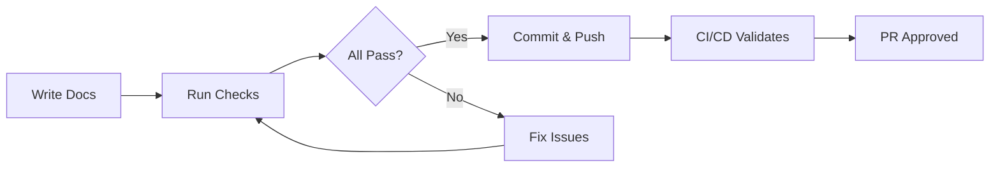
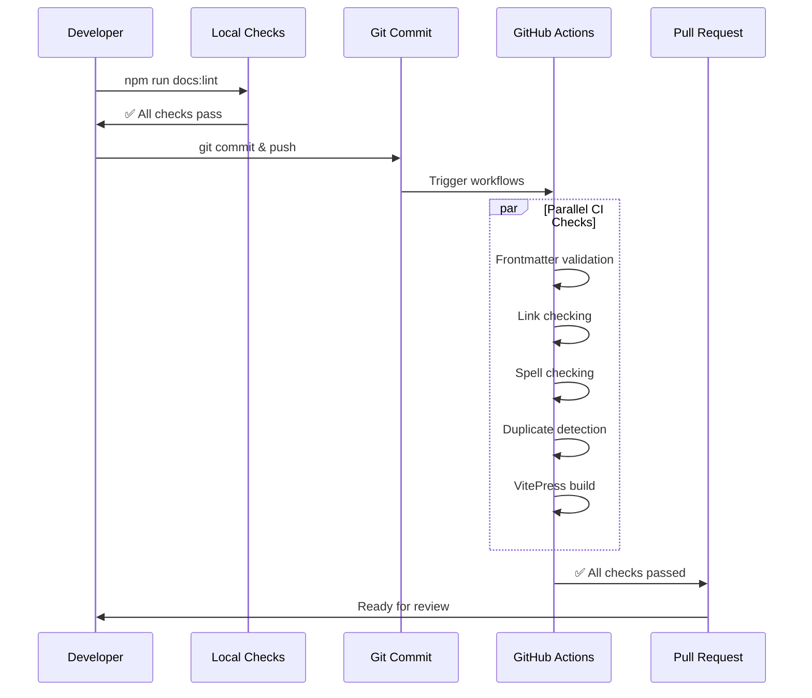
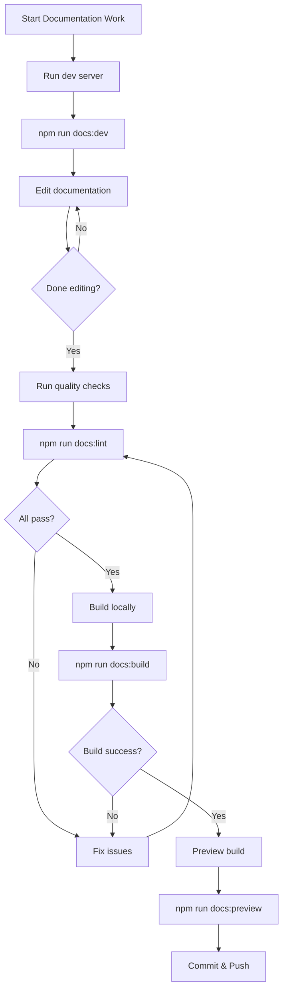

# CI/CD Quick Start Guide

Get up and running with the Agent Studio documentation quality system in 5 minutes.

## Overview

Agent Studio uses automated CI/CD workflows to ensure documentation quality. This guide shows you how to run these checks locally before committing changes.



## Prerequisites

Ensure you have the following installed:

- **Node.js**: Version 20.x or higher
- **npm**: Comes with Node.js
- **Git**: For version control

Verify your setup:

```bash
node --version  # Should show v20.x or higher
npm --version   # Should show 10.x or higher
git --version   # Any recent version
```

## Quick Setup

### 1. Clone and Install

```bash
# Clone the repository
git clone https://github.com/Brookside-Proving-Grounds/Project-Ascension.git
cd Project-Ascension

# Install dependencies
npm ci
```

### 2. Run All Quality Checks

Run the complete documentation quality suite:

```bash
npm run docs:lint
```

This runs four checks in sequence:
1. **Frontmatter Validation** - Ensures all docs have required metadata
2. **Link Checking** - Verifies all internal and external links work
3. **Spell Checking** - Catches typos and validates technical terms
4. **Duplicate Detection** - Identifies redundant content

## Understanding Check Results

### Success Output

When all checks pass, you'll see:

```bash
✓ Frontmatter validation passed
✓ Link checking passed
✓ Spell checking passed
✓ Duplicate detection passed

All documentation quality checks passed! ✨
```

### Failure Output

When checks fail, you'll see detailed errors:

```bash
✗ Frontmatter validation failed
  docs/guides/new-guide.md:
    - Missing required field: title
    - Description too short (80 chars, recommended 120-160)

✗ Spell checking failed
  docs/api/rest-api.md:42
    - Unknown word: 'metaagent' (did you mean: meta-agent?)
```

## Running Individual Checks

Run specific checks when working on particular issues:

### Frontmatter Validation

```bash
npm run docs:frontmatter
```

**Checks for**:
- Required `title` field
- Recommended `description` field (120-160 characters)
- Valid field types and formats
- Duplicate titles across documentation

**Common fixes**:
```yaml
---
title: Your Page Title          # Required, max 60 chars
description: Brief description  # Recommended, 120-160 chars
lastUpdated: 2025-10-08        # Optional, YYYY-MM-DD format
---
```

### Link Checking

```bash
npm run docs:links
```

**Checks for**:
- Broken internal links between documentation files
- Dead external links
- Invalid anchor references

**Common fixes**:
```markdown
<!-- Correct internal links -->
[Architecture](./architecture.md)
[Getting Started](../getting-started.md)

<!-- Correct external links -->
[Azure Docs](https://docs.microsoft.com/azure)
```

### Spell Checking

```bash
npm run docs:spell
```

**Checks for**:
- Misspelled words
- Unknown technical terms

**Common fixes**:

Option 1: Fix the typo
```markdown
# Before
Kubernetes clustr

# After
Kubernetes cluster
```

Option 2: Add technical term to dictionary
```json
// .cspell.json
{
  "words": [
    "kubernetes",
    "vitepress",
    "your-technical-term"
  ]
}
```

### Duplicate Detection

```bash
npm run docs:duplicates
```

**Checks for**:
- Duplicate content blocks (>100 lines identical)
- High similarity between files (>80% match)
- Duplicate "Getting Started" sections

**Common fixes**:
1. Consolidate similar content into one canonical page
2. Link to the canonical page from other locations
3. Remove exact duplicates

## Visual Workflow Guide



## Common Scenarios

### Scenario 1: Creating New Documentation

When creating a new documentation file:

```bash
# 1. Create your markdown file
touch docs/guides/my-new-guide.md

# 2. Add frontmatter
cat > docs/guides/my-new-guide.md << 'EOF'
---
title: My New Guide
description: A comprehensive guide to doing something awesome in Agent Studio
lastUpdated: 2025-10-08
---

# My New Guide

Your content here...
EOF

# 3. Run checks before committing
npm run docs:lint

# 4. Fix any issues, then commit
git add docs/guides/my-new-guide.md
git commit -m "docs: add new guide for awesome feature"
```

### Scenario 2: Updating Existing Documentation

When modifying existing documentation:

```bash
# 1. Make your changes
vim docs/api/rest-api.md

# 2. Run link checker (if you added/changed links)
npm run docs:links

# 3. Run spell checker
npm run docs:spell

# 4. Run all checks
npm run docs:lint

# 5. Commit your changes
git add docs/api/rest-api.md
git commit -m "docs: update REST API endpoint documentation"
```

### Scenario 3: Fixing CI/CD Failures

When CI/CD checks fail on your PR:

```bash
# 1. Pull latest changes
git pull origin main

# 2. Run the same checks locally
npm run docs:lint

# 3. Review detailed error reports
cat docs-validation-report.json     # Frontmatter issues
cat duplicate-content-report.json   # Duplicate content

# 4. Fix issues identified

# 5. Verify fixes
npm run docs:lint

# 6. Commit and push
git add .
git commit -m "docs: fix CI/CD validation errors"
git push
```

## Local Development Workflow

### Recommended Workflow



### Step-by-Step Commands

```bash
# Start development server (auto-reload)
npm run docs:dev
# Opens http://localhost:5173

# In a separate terminal, make changes to documentation
# The dev server will automatically reload

# When ready, run quality checks
npm run docs:lint

# Test production build
npm run docs:build

# Preview production build
npm run docs:preview
# Opens http://localhost:4173

# Commit your changes
git add .
git commit -m "docs: update documentation"
git push
```

## Pro Tips

### 1. Pre-Commit Hook

Set up a pre-commit hook to automatically run checks:

```bash
# Create pre-commit hook
cat > .git/hooks/pre-commit << 'EOF'
#!/bin/bash
echo "Running documentation quality checks..."
npm run docs:lint
if [ $? -ne 0 ]; then
    echo "Documentation checks failed. Please fix issues before committing."
    exit 1
fi
EOF

# Make it executable
chmod +x .git/hooks/pre-commit
```

### 2. VS Code Integration

Install these VS Code extensions for real-time feedback:

- **Code Spell Checker** - Real-time spell checking
  ```bash
  code --install-extension streetsidesoftware.code-spell-checker
  ```

- **Markdown All in One** - Markdown shortcuts and preview
  ```bash
  code --install-extension yzhang.markdown-all-in-one
  ```

- **markdownlint** - Markdown linting
  ```bash
  code --install-extension DavidAnson.vscode-markdownlint
  ```

### 3. Fast Feedback Loop

Run only the checks relevant to your changes:

```bash
# Only added/changed links? Just check links
npm run docs:links

# Only text changes? Just spell check
npm run docs:spell

# New file? Just check frontmatter
npm run docs:frontmatter

# Full check before commit
npm run docs:lint
```

### 4. Understanding Exit Codes

Scripts exit with different codes to indicate status:

| Exit Code | Meaning | Action |
|-----------|---------|--------|
| 0 | Success | Proceed with commit |
| 1 | Validation errors | Fix errors before committing |

Use in scripts:

```bash
npm run docs:lint
if [ $? -eq 0 ]; then
    git commit -m "docs: update"
else
    echo "Fix documentation errors first"
fi
```

## Troubleshooting

### Issue: "Command not found"

**Error**:
```bash
npm run docs:lint
bash: npm: command not found
```

**Solution**: Install Node.js and npm
```bash
# Download from: https://nodejs.org/
# Or use nvm:
curl -o- https://raw.githubusercontent.com/nvm-sh/nvm/v0.39.0/install.sh | bash
nvm install 20
nvm use 20
```

### Issue: "Dependencies not installed"

**Error**:
```bash
Error: Cannot find module 'vitepress'
```

**Solution**: Install dependencies
```bash
npm ci
```

### Issue: "Spell check false positive"

**Error**:
```bash
Unknown word: 'kubernetes'
```

**Solution**: Add to custom dictionary
```json
// .cspell.json
{
  "words": [
    "kubernetes"  // Add your term here
  ]
}
```

### Issue: "Link check timeout"

**Error**:
```bash
[✖] https://example.com → Status: 0 (Request timeout)
```

**Solution**: External site may be slow. This is a warning, not a failure. Internal link failures block the build.

## Next Steps

Now that you know how to run quality checks locally:

1. **Read the Full CI/CD Documentation**: [CI/CD Documentation](../../CI-CD-DOCUMENTATION.md)
2. **Learn About Troubleshooting**: [CI/CD Troubleshooting Guide](./ci-cd-troubleshooting.md)
3. **Explore Documentation Quality Guide**: [Documentation Quality Guide](../../../.github/DOCS-QUALITY-GUIDE.md)
4. **Understand the Architecture**: View workflow files in `.github/workflows/`

## Related Documentation

- [CI/CD Full Documentation](../../CI-CD-DOCUMENTATION.md) - Complete CI/CD system documentation
- [Documentation Quality Guide](../../../.github/DOCS-QUALITY-GUIDE.md) - Quality standards and best practices
- [Scripts README](../../../scripts/README.md) - Technical details about validation scripts
- [Contributing Guide](../../development/CONTRIBUTING.md) - How to contribute to Agent Studio

## Getting Help

**Having trouble?**

1. Check the [Troubleshooting Guide](./ci-cd-troubleshooting.md)
2. Search [GitHub Issues](https://github.com/Brookside-Proving-Grounds/Project-Ascension/issues)
3. Ask in [GitHub Discussions](https://github.com/Brookside-Proving-Grounds/Project-Ascension/discussions)
4. Review [CI/CD workflow logs](https://github.com/Brookside-Proving-Grounds/Project-Ascension/actions)

---

**Remember**: Running `npm run docs:lint` before committing ensures your documentation changes will pass CI/CD checks.
