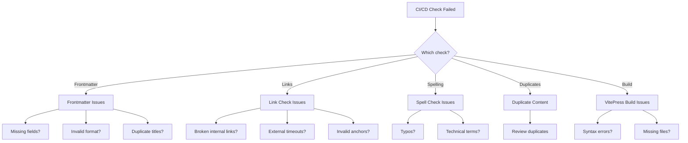

# CI/CD Troubleshooting Guide

Complete guide to diagnosing and fixing documentation quality check failures.

## Quick Diagnosis

Use this flowchart to identify your issue:



## Frontmatter Validation Issues

### Error: Missing Required Field (Title)

**Error Message**:
```bash
✗ docs/guides/my-guide.md
  Missing required field: title
```

**Cause**: The markdown file is missing the required `title` field in frontmatter.

**Solution**: Add frontmatter with a title

```yaml
---
title: Your Page Title
description: Brief description of the page
---

# Your Page Title

Your content starts here...
```

**Prevention**: Use this template for all new markdown files:
```bash
cat > new-file.md << 'EOF'
---
title: Page Title Here
description: Brief description (120-160 characters recommended)
lastUpdated: 2025-10-08
---

# Page Title Here

Content...
EOF
```

### Error: Missing Recommended Field (Description)

**Warning Message**:
```bash
⚠ docs/api/endpoints.md
  Missing recommended field: description
```

**Cause**: The file lacks a `description` field (recommended for SEO).

**Solution**: Add a description to frontmatter

```yaml
---
title: API Endpoints
description: Complete reference for all Agent Studio REST API endpoints including authentication, rate limiting, and error handling
---
```

**Best Practices**:
- Keep descriptions between 120-160 characters
- Include key terms for searchability
- Clearly explain what the page covers
- Avoid duplicate descriptions

### Error: Duplicate Titles

**Error Message**:
```bash
✗ Duplicate titles found:
  - "Getting Started" appears in:
    * docs/getting-started.md
    * docs/guides/getting-started.md
    * docs/api/getting-started.md
```

**Cause**: Multiple files have identical titles, causing confusion.

**Solution**: Make titles unique and specific

```yaml
# docs/getting-started.md
---
title: Getting Started with Agent Studio
---

# docs/guides/getting-started.md
---
title: Developer Getting Started Guide
---

# docs/api/getting-started.md
---
title: API Getting Started Guide
---
```

### Error: Title Too Long

**Warning Message**:
```bash
⚠ docs/architecture/detailed-explanation.md
  Title too long (78 chars). Recommended: ≤60 chars for SEO
```

**Cause**: Title exceeds SEO-recommended length.

**Solution**: Shorten the title

```yaml
# Before
---
title: A Comprehensive and Detailed Guide to the Complete Architecture of Agent Studio
---

# After
---
title: Agent Studio Architecture Guide
description: Comprehensive guide covering system architecture, component interactions, and design decisions
---
```

### Error: Invalid Frontmatter Format

**Error Message**:
```bash
✗ docs/guides/example.md
  Failed to parse frontmatter: Invalid YAML
```

**Cause**: YAML syntax error in frontmatter.

**Common Issues and Fixes**:

```yaml
# ❌ Wrong - Missing quotes for special characters
title: Agent's Guide: Getting Started

# ✅ Correct
title: "Agent's Guide: Getting Started"

# ❌ Wrong - Invalid date format
lastUpdated: 10/08/2025

# ✅ Correct
lastUpdated: 2025-10-08

# ❌ Wrong - Incorrect array syntax
contributors: John Doe, Jane Smith

# ✅ Correct
contributors: [John Doe, Jane Smith]

# ❌ Wrong - Missing closing delimiter
---
title: My Page
description: Description here
# Missing closing ---

# ✅ Correct
---
title: My Page
description: Description here
---
```

### Debugging Frontmatter Issues

Run frontmatter validation with detailed output:

```bash
# Run validation
npm run docs:frontmatter

# Check the detailed report
cat docs-validation-report.json | jq '.'

# Find files without frontmatter
for file in $(find docs -name "*.md"); do
  if ! head -1 "$file" | grep -q "^---$"; then
    echo "Missing frontmatter: $file"
  fi
done
```

## Link Check Issues

### Error: Broken Internal Link

**Error Message**:
```bash
[✖] docs/guides/developer-guide.md → Status: 404
  └─ ./architecture/system-design.md
```

**Cause**: The linked file doesn't exist or path is incorrect.

**Solution**: Fix the link path

```markdown
<!-- ❌ Wrong - File doesn't exist -->
[Architecture](./architecture/system-design.md)

<!-- ✅ Correct - Use actual file path -->
[Architecture](../../architecture/ARCHITECTURE.md)
```

**Debugging**:
```bash
# Verify file exists
ls docs/architecture/ARCHITECTURE.md

# Find all links to a specific file
grep -r "system-design.md" docs/

# Check relative path from current file
cd docs/guides
ls -la ../../architecture/
```

### Error: Broken External Link

**Warning Message**:
```bash
[✖] https://example.com/api/docs → Status: 404
```

**Cause**: External URL is dead or unreachable.

**Solution**: Update or remove the link

```markdown
<!-- Option 1: Update to working URL -->
[API Documentation](https://docs.example.com/api/v2/)

<!-- Option 2: Use archived version -->
[API Documentation](https://web.archive.org/web/20250101/https://example.com/api/docs)

<!-- Option 3: Remove if no longer relevant -->
```

**Note**: Broken external links generate warnings but don't fail the build. Broken internal links DO fail the build.

### Error: Invalid Anchor Reference

**Error Message**:
```bash
[✖] docs/api/rest-api.md#authentication-section → Status: 404
  └─ Anchor not found: #authentication-section
```

**Cause**: The anchor doesn't exist in the target file.

**Solution**: Use correct anchor or fix heading

```markdown
<!-- ❌ Wrong - Anchor doesn't exist -->
[Auth Docs](./rest-api.md#authentication-section)

<!-- ✅ Correct - Match actual heading -->
[Auth Docs](./rest-api.md#authentication)

<!-- VitePress auto-generates anchors from headings -->
# Authentication  → #authentication
## API Keys     → #api-keys
### Bearer Token → #bearer-token
```

**Finding Valid Anchors**:
```bash
# Extract headings from markdown file
grep '^#' docs/api/rest-api.md

# VitePress converts headings to lowercase, replaces spaces with hyphens
# "API Keys" → #api-keys
# "Getting Started Guide" → #getting-started-guide
```

### Error: Link Check Timeout

**Warning Message**:
```bash
[✖] https://slow-site.com/docs → Status: 0 (Request timeout)
```

**Cause**: External site is slow or temporarily unavailable.

**Solutions**:

Option 1: Increase timeout (`.markdown-link-check.json`)
```json
{
  "timeout": "20s"  // Increased from 10s
}
```

Option 2: Add to ignore patterns if consistently slow
```json
{
  "ignorePatterns": [
    {"pattern": "^https://slow-site\\.com"}
  ]
}
```

Option 3: Wait and retry (temporary issue)

### Debugging Link Issues

```bash
# Check all links in a specific file
markdown-link-check docs/guides/my-guide.md --config .markdown-link-check.json

# Check all links with verbose output
find docs -name '*.md' -type f | xargs markdown-link-check --config .markdown-link-check.json

# Test specific URL
curl -I https://example.com/api/docs

# Find all external links in documentation
grep -r 'http[s]*://' docs/ | grep -v '.vitepress'
```

## Spell Check Issues

### Error: Unknown Word (Typo)

**Error Message**:
```bash
docs/guides/deployment.md:42:15
  Unknown word: "deploymnt"
```

**Cause**: Actual typo in the documentation.

**Solution**: Fix the typo

```markdown
<!-- ❌ Wrong -->
Follow the deploymnt guide for Azure.

<!-- ✅ Correct -->
Follow the deployment guide for Azure.
```

### Error: Unknown Word (Technical Term)

**Error Message**:
```bash
docs/api/signalr-hub.md:15:3
  Unknown word: "SignalR"
```

**Cause**: Valid technical term not in dictionary.

**Solution**: Add to custom dictionary

```json
// .cspell.json
{
  "words": [
    "SignalR",
    "VitePress",
    "Kubernetes",
    "your-new-term"
  ]
}
```

**Keep dictionary organized**:
```bash
# Sort dictionary alphabetically
jq '.words |= sort' .cspell.json > .cspell.json.tmp
mv .cspell.json.tmp .cspell.json
```

### Error: Code Block Detected as Misspelling

**Error Message**:
```bash
docs/examples/code.md:25:8
  Unknown word: "const"
```

**Cause**: Code in markdown not properly wrapped in code blocks.

**Solution**: Use proper code block syntax

````markdown
<!-- ❌ Wrong - Inline text, not code -->
Initialize the const variable with kubernetes config.

<!-- ✅ Correct - Code block -->
Initialize the variable:

```typescript
const kubernetesConfig = {...}
```

<!-- ✅ Correct - Inline code -->
Initialize the `kubernetes` config variable.
````

**Note**: cspell ignores:
- Code blocks (triple backticks)
- Inline code (single backticks)
- URLs

### Error: Multiple Words Flagged in One Line

**Error Message**:
```bash
docs/architecture/components.md:89:1
  Unknown words: "microservices", "kubernetes", "istio"
```

**Cause**: Multiple technical terms missing from dictionary.

**Solution**: Add all terms at once

```json
{
  "words": [
    "istio",
    "kubernetes",
    "microservices"
  ]
}
```

### Debugging Spell Check Issues

```bash
# Run spell check with suggestions
cspell "docs/**/*.md" --config .cspell.json --show-suggestions

# Run with context around errors
cspell "docs/**/*.md" --config .cspell.json --show-context

# Check specific file
cspell docs/guides/my-guide.md --config .cspell.json

# List all unknown words
cspell "docs/**/*.md" --config .cspell.json --words-only --unique

# Add multiple words to dictionary
cat << 'EOF' >> .cspell.json
{
  "words": [
    "word1",
    "word2",
    "word3"
  ]
}
EOF
```

## Duplicate Content Issues

### Warning: High Similarity Between Files

**Warning Message**:
```bash
⚠ High similarity detected:
  - docs/guides/getting-started.md
  - docs/api/quick-start.md
  Similarity: 85%
```

**Cause**: Two files contain very similar content.

**Solution**: Consolidate content

```markdown
<!-- Option 1: Create canonical page, link from others -->
<!-- docs/guides/getting-started.md (canonical) -->
# Getting Started
[Full content here...]

<!-- docs/api/quick-start.md (links to canonical) -->
# API Quick Start
For general getting started information, see the [Getting Started Guide](../guides/getting-started.md).

[API-specific content only...]

<!-- Option 2: Clearly differentiate content -->
<!-- Make each guide focus on different audience/purpose -->
```

### Warning: Duplicate "Getting Started" Sections

**Warning Message**:
```bash
⚠ Multiple "Getting Started" sections found with >70% similarity
  - docs/README.md
  - docs/guides/quick-start.md
  - docs/development/setup.md
```

**Cause**: Common pattern where multiple docs include similar onboarding content.

**Solution**: Create single source of truth

```markdown
<!-- docs/getting-started/README.md (canonical) -->
# Getting Started with Agent Studio
[Complete getting started content...]

<!-- Other files reference it -->
<!-- docs/README.md -->
## Quick Links
- [Getting Started Guide](./getting-started/README.md)

<!-- docs/development/setup.md -->
Before setting up your development environment, review the [Getting Started Guide](../getting-started/README.md).
```

### Warning: Duplicate Content Blocks

**Warning Message**:
```bash
⚠ Duplicate content block (125 lines) found in:
  - docs/guides/deployment-azure.md
  - docs/runbooks/azure-deployment.md
```

**Cause**: Large sections of identical content.

**Solution**: Extract to shared document

```markdown
<!-- docs/deployment/azure-prerequisites.md (shared) -->
# Azure Deployment Prerequisites
[Prerequisite content...]

<!-- docs/guides/deployment-azure.md -->
# Deploying to Azure
See [Azure Prerequisites](../deployment/azure-prerequisites.md) before starting.

[Guide-specific content...]

<!-- docs/runbooks/azure-deployment.md -->
# Azure Deployment Runbook
Prerequisites: See [Azure Prerequisites](../deployment/azure-prerequisites.md)

[Runbook-specific content...]
```

### Debugging Duplicate Content

```bash
# Run duplicate detection
npm run docs:duplicates

# View detailed report
cat duplicate-content-report.json | jq '.'

# Find exact duplicate lines between two files
diff docs/file1.md docs/file2.md

# Calculate similarity percentage manually
# (uses Levenshtein distance algorithm)
node scripts/detect-duplicates.js
```

## VitePress Build Issues

### Error: Build Failed - Syntax Error

**Error Message**:
```bash
✖ building client + server bundles...
Error: Parse error on line 42:
Unexpected token
```

**Cause**: Invalid markdown syntax.

**Common Issues**:

```markdown
<!-- ❌ Wrong - Unclosed code block -->
```bash
npm install

<!-- ✅ Correct -->
```bash
npm install
```

<!-- ❌ Wrong - Invalid frontmatter -->
---
title: My Page
description: Description
# Missing closing delimiter

<!-- ✅ Correct -->
---
title: My Page
description: Description
---

<!-- ❌ Wrong - Unescaped special characters in heading -->
## What's the {{issue}}?

<!-- ✅ Correct -->
## What's the issue?
```

**Debugging**:
```bash
# Build locally to see full error
npm run docs:build

# Check specific file syntax
npx prettier --check docs/problematic-file.md

# Validate markdown structure
npx markdownlint docs/**/*.md
```

### Error: Build Failed - Missing File

**Error Message**:
```bash
✖ Error: ENOENT: no such file or directory
  open 'docs/guides/missing-file.md'
```

**Cause**: Link references a file that doesn't exist.

**Solution**: Create the file or remove the link

```bash
# Find broken references
grep -r "missing-file.md" docs/

# Option 1: Create the missing file
touch docs/guides/missing-file.md

# Option 2: Remove references
# Edit files that link to missing-file.md
```

### Error: Build Failed - Circular Dependency

**Error Message**:
```bash
✖ Circular dependency detected:
  docs/guide-a.md → docs/guide-b.md → docs/guide-a.md
```

**Cause**: Pages link to each other in a circle.

**Solution**: Restructure navigation

```markdown
<!-- ❌ Wrong - Circular reference -->
<!-- guide-a.md -->
See [Guide B](./guide-b.md)

<!-- guide-b.md -->
See [Guide A](./guide-a.md)

<!-- ✅ Correct - Hierarchical reference -->
<!-- guide-a.md (parent) -->
See sub-topic: [Guide B](./guide-b.md)

<!-- guide-b.md (child) -->
Back to [Guide A](./guide-a.md)
# Or better: use breadcrumbs in VitePress config
```

### Error: Build Artifact Missing

**Error Message**:
```bash
✖ Build validation failed:
  Expected dist/index.html not found
```

**Cause**: VitePress build didn't complete successfully.

**Solution**: Check build logs

```bash
# Run build with verbose output
npm run docs:build -- --debug

# Check VitePress cache
rm -rf docs/.vitepress/cache
npm run docs:build

# Verify configuration
cat docs/.vitepress/config.ts
```

## CI/CD Workflow Issues

### Issue: Workflow Not Triggering

**Symptom**: Push to main doesn't trigger CI/CD workflows.

**Debugging**:

```bash
# Check if docs files were actually modified
git diff HEAD^ HEAD --name-only

# Workflow only triggers on docs changes
# Check workflow trigger configuration
cat .github/workflows/docs-lint.yml | grep -A 5 "on:"
```

**Solution**: Ensure docs files are modified or trigger manually

```bash
# Manual workflow trigger
# Go to GitHub Actions → Select workflow → Run workflow
```

### Issue: Workflow Stuck/Hanging

**Symptom**: CI/CD check runs for >10 minutes without completing.

**Cause**: Usually link checking on slow/unresponsive external sites.

**Solution**:

```bash
# Cancel workflow run
# GitHub Actions → Select run → Cancel workflow

# Identify slow links locally
time npm run docs:links

# Add problematic domains to ignore list
# .markdown-link-check.json
{
  "ignorePatterns": [
    {"pattern": "^https://slow-domain\\.com"}
  ]
}
```

### Issue: Workflow Fails but Checks Pass Locally

**Symptom**: `npm run docs:lint` passes locally but fails in CI/CD.

**Possible Causes**:

1. **Different Node.js versions**
```bash
# Check local version
node --version

# Check CI version (in .github/workflows/docs-lint.yml)
grep "node-version" .github/workflows/docs-lint.yml

# Solution: Use same version locally
nvm install 20
nvm use 20
```

2. **Missing dependencies**
```bash
# CI uses clean install
npm ci  # Not npm install
```

3. **Environment differences**
```bash
# CI runs on Linux (case-sensitive paths)
# Windows/Mac may not catch case mismatches

# Fix case sensitivity issues
# docs/GUIDE.md vs docs/guide.md
```

### Issue: Permission Denied on Scripts

**Error Message**:
```bash
✖ Permission denied: ./scripts/validate-frontmatter.js
```

**Cause**: Script files not executable.

**Solution**:
```bash
# Make scripts executable
chmod +x scripts/*.js

# Commit permission changes
git add scripts/
git commit -m "fix: make scripts executable"
```

## Performance Issues

### Issue: Checks Take Too Long

**Symptom**: `npm run docs:lint` takes >5 minutes.

**Diagnosis**:

```bash
# Time individual checks
time npm run docs:frontmatter  # Should be <30s
time npm run docs:links        # Usually 1-2min
time npm run docs:spell        # Should be <15s
time npm run docs:duplicates   # Should be <30s
```

**Solutions**:

```bash
# Speed up link checking: reduce timeout
# .markdown-link-check.json
{
  "timeout": "5s"  // Down from 10s
}

# Skip slow external domains
{
  "ignorePatterns": [
    {"pattern": "^https://slow-site\\.com"}
  ]
}

# Speed up spell check: reduce file scope
npm run docs:spell -- "docs/guides/**/*.md"  # Just guides

# Run checks in parallel (advanced)
npm run docs:frontmatter & npm run docs:spell & wait
```

## Getting Reports and Logs

### Local Reports

```bash
# Frontmatter validation report
cat docs-validation-report.json | jq '.'

# Duplicate content report
cat duplicate-content-report.json | jq '.'

# Pretty print with colors
npm run docs:frontmatter
npm run docs:duplicates
```

### CI/CD Reports

1. **Navigate to GitHub Actions**:
   - Go to repository
   - Click "Actions" tab
   - Select failed workflow run

2. **View Job Logs**:
   - Expand failed job
   - Read error messages
   - Download artifacts (JSON reports)

3. **Download Artifacts**:
   - Scroll to bottom of workflow run
   - Click "Artifacts"
   - Download `docs-validation-report` or `duplicate-content-report`

## Frequently Asked Questions

### Q: Can I disable a specific check?

**A**: Yes, but not recommended. Edit `package.json`:

```json
{
  "scripts": {
    "docs:lint": "npm run docs:frontmatter && npm run docs:spell"
    // Removed docs:links and docs:duplicates
  }
}
```

### Q: How do I ignore a specific file?

**A**: Add to ignore patterns:

```json
// .cspell.json (spell checking)
{
  "ignorePaths": [
    "docs/legacy/**",
    "docs/archive/**"
  ]
}

// .markdown-link-check.json (links in specific files)
// Not supported - ignores URL patterns, not files

// For frontmatter: Modify scripts/validate-frontmatter.js
```

### Q: Why are duplicates only warnings?

**A**: Duplicates don't break functionality, they're maintainability issues. The check informs you, but doesn't block commits.

### Q: How do I test CI/CD changes before pushing?

**A**: Run the same commands locally:

```bash
# Exact same commands as CI/CD
npm ci
npm run docs:lint
npm run docs:build
```

### Q: Can I run checks on only changed files?

**A**: Yes, using git:

```bash
# Get changed markdown files
CHANGED_FILES=$(git diff --name-only HEAD^ HEAD | grep '\.md$')

# Run spell check on changed files only
echo "$CHANGED_FILES" | xargs cspell --config .cspell.json

# Note: Frontmatter validation needs all files (checks for duplicate titles)
```

## Emergency Fixes

### Temporarily Disable Strict Checking

If you need to push urgently:

```yaml
# .github/workflows/docs-lint.yml
# Add: continue-on-error: true

jobs:
  frontmatter-validation:
    runs-on: ubuntu-latest
    continue-on-error: true  # Won't fail PR
```

**Important**: Remove this after fixing issues!

### Skip CI/CD for Specific Commit

```bash
git commit -m "docs: urgent fix [skip ci]"
```

**Warning**: Only use for genuine emergencies!

## Additional Resources

- [CI/CD Quick Start Guide](./ci-cd-quickstart.md) - Getting started with checks
- [CI/CD Documentation](../../CI-CD-DOCUMENTATION.md) - Complete system documentation
- [Documentation Quality Guide](../../../.github/DOCS-QUALITY-GUIDE.md) - Quality standards
- [Scripts README](../../../scripts/README.md) - Technical details
- [VitePress Documentation](https://vitepress.dev) - Official VitePress docs
- [cspell Documentation](https://cspell.org) - Spell checker docs
- [markdown-link-check](https://github.com/tcort/markdown-link-check) - Link checker docs

## Getting Help

Still stuck? Here's how to get help:

1. **Search existing issues**: [GitHub Issues](https://github.com/Brookside-Proving-Grounds/Project-Ascension/issues)
2. **Check workflow logs**: [GitHub Actions](https://github.com/Brookside-Proving-Grounds/Project-Ascension/actions)
3. **Ask in discussions**: [GitHub Discussions](https://github.com/Brookside-Proving-Grounds/Project-Ascension/discussions)
4. **Open new issue**: Include:
   - Error message (full text)
   - Command you ran
   - Your environment (OS, Node version)
   - Link to workflow run (if CI/CD)

---

**Pro Tip**: Most issues are fixed by running `npm ci` to reinstall dependencies, then `npm run docs:lint` to see detailed error messages.
