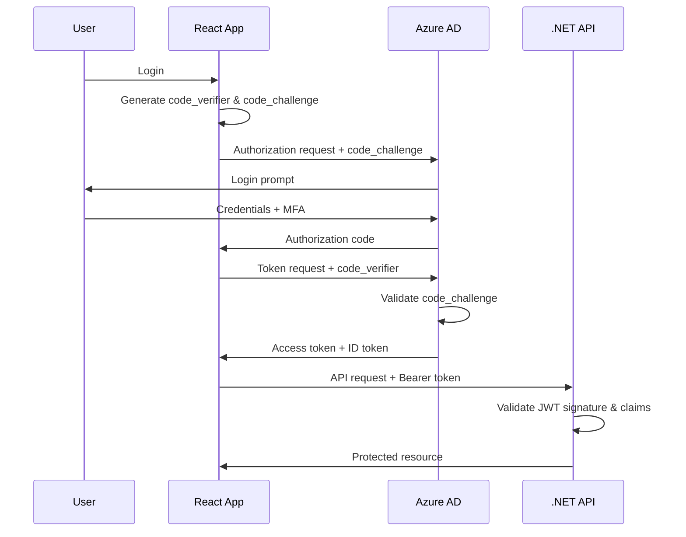

# Security Implementation Guide

## Overview

This guide provides comprehensive security implementation patterns for Agent Studio, covering authentication, authorization, data protection, and compliance requirements. Agent Studio follows **Zero Trust Architecture** principles and implements defense-in-depth security controls across all layers.

### Security Architecture Principles

1. **Zero Trust**: Never trust, always verify. Every request requires explicit authentication and authorization.
2. **Least Privilege**: Grant minimum permissions necessary for functionality.
3. **Defense in Depth**: Layer multiple security controls to protect against threats.
4. **Secure by Default**: All components ship with secure configurations.
5. **Privacy by Design**: Embed privacy protections from the beginning.
6. **Fail Securely**: Security failures default to deny access.

### Technology Stack Security Overview

- **Backend**: ASP.NET Core 8.0 with Azure AD authentication
- **Python Services**: FastAPI with OAuth2 token validation
- **Data Store**: Azure Cosmos DB with encryption at rest
- **Cache**: Azure Redis with TLS and authentication
- **Real-time**: Azure SignalR Service with access tokens
- **Secrets**: Azure Key Vault with Managed Identity
- **Infrastructure**: Azure with RBAC and network security groups

---

## Authentication

### Azure AD Integration

Agent Studio uses **Azure Active Directory (Azure AD)** with **OAuth2 + PKCE** (Proof Key for Code Exchange) for secure authentication. PKCE prevents authorization code interception attacks, critical for single-page applications.

#### OAuth2 + PKCE Flow



#### .NET API - Azure AD Configuration

**appsettings.json**
```json
{
  "AzureAd": {
    "Instance": "https://login.microsoftonline.com/",
    "Domain": "yourtenant.onmicrosoft.com",
    "TenantId": "00000000-0000-0000-0000-000000000000",
    "ClientId": "00000000-0000-0000-0000-000000000000",
    "Audience": "api://agent-studio-api",
    "Scopes": "access_as_user"
  },
  "JwtBearer": {
    "ValidateIssuer": true,
    "ValidateAudience": true,
    "ValidateLifetime": true,
    "ValidateIssuerSigningKey": true,
    "ClockSkew": "00:05:00"
  }
}
```

**Program.cs - Authentication Setup**
```csharp
using Microsoft.AspNetCore.Authentication.JwtBearer;
using Microsoft.Identity.Web;

var builder = WebApplication.CreateBuilder(args);

// Add Azure AD authentication
builder.Services.AddAuthentication(JwtBearerDefaults.AuthenticationScheme)
    .AddMicrosoftIdentityWebApi(options =>
    {
        builder.Configuration.Bind("AzureAd", options);

        // Enhanced token validation
        options.TokenValidationParameters.ValidateIssuer = true;
        options.TokenValidationParameters.ValidateAudience = true;
        options.TokenValidationParameters.ValidateLifetime = true;
        options.TokenValidationParameters.ValidateIssuerSigningKey = true;
        options.TokenValidationParameters.ClockSkew = TimeSpan.FromMinutes(5);

        // Require specific token version
        options.TokenValidationParameters.ValidTypes = new[] { "JWT" };
    },
    options =>
    {
        builder.Configuration.Bind("AzureAd", options);
    });

// Add authorization
builder.Services.AddAuthorization();

var app = builder.Build();

// Order matters: Authentication before Authorization
app.UseAuthentication();
app.UseAuthorization();

app.MapControllers();
app.Run();
```

#### TypeScript Frontend - MSAL Integration

**authConfig.ts**
```typescript
import { Configuration, PublicClientApplication } from '@azure/msal-browser';

export const msalConfig: Configuration = {
  auth: {
    clientId: process.env.REACT_APP_AZURE_CLIENT_ID!,
    authority: `https://login.microsoftonline.com/${process.env.REACT_APP_AZURE_TENANT_ID}`,
    redirectUri: window.location.origin,
    postLogoutRedirectUri: window.location.origin,
    navigateToLoginRequestUrl: false,
  },
  cache: {
    cacheLocation: 'sessionStorage', // More secure than localStorage
    storeAuthStateInCookie: false, // Set to true for IE11/Edge support
  },
  system: {
    loggerOptions: {
      loggerCallback: (level, message, containsPii) => {
        if (containsPii) return;
        console.log(message);
      },
      logLevel: 'Warning',
    },
  },
};

export const msalInstance = new PublicClientApplication(msalConfig);

export const loginRequest = {
  scopes: ['api://agent-studio-api/access_as_user'],
};
```

**AuthProvider.tsx**
```typescript
import { MsalProvider, useMsal, useIsAuthenticated } from '@azure/msal-react';
import { InteractionRequiredAuthError } from '@azure/msal-browser';
import { loginRequest } from './authConfig';

export const useAccessToken = () => {
  const { instance, accounts } = useMsal();

  const acquireToken = async (): Promise<string> => {
    const request = {
      ...loginRequest,
      account: accounts[0],
    };

    try {
      // Try silent token acquisition first
      const response = await instance.acquireTokenSilent(request);
      return response.accessToken;
    } catch (error) {
      if (error instanceof InteractionRequiredAuthError) {
        // Fall back to interactive authentication
        const response = await instance.acquireTokenPopup(request);
        return response.accessToken;
      }
      throw error;
    }
  };

  return { acquireToken };
};

// Axios interceptor for automatic token injection
export const setupAxiosInterceptors = (axiosInstance: AxiosInstance) => {
  const { acquireToken } = useAccessToken();

  axiosInstance.interceptors.request.use(
    async (config) => {
      const token = await acquireToken();
      config.headers.Authorization = `Bearer ${token}`;
      return config;
    },
    (error) => Promise.reject(error)
  );

  // Retry failed requests with token refresh
  axiosInstance.interceptors.response.use(
    (response) => response,
    async (error) => {
      const originalRequest = error.config;

      if (error.response?.status === 401 && !originalRequest._retry) {
        originalRequest._retry = true;
        const token = await acquireToken();
        originalRequest.headers.Authorization = `Bearer ${token}`;
        return axiosInstance(originalRequest);
      }

      return Promise.reject(error);
    }
  );
};
```

#### Python FastAPI - JWT Validation

**auth.py**
```python
from fastapi import Depends, HTTPException, status
from fastapi.security import HTTPBearer, HTTPAuthorizationCredentials
from jose import JWTError, jwt
from typing import Optional
import httpx
from functools import lru_cache
import os

# Security scheme
security = HTTPBearer()

# Azure AD configuration
AZURE_TENANT_ID = os.getenv("AZURE_TENANT_ID")
AZURE_CLIENT_ID = os.getenv("AZURE_CLIENT_ID")
JWKS_URL = f"https://login.microsoftonline.com/{AZURE_TENANT_ID}/discovery/v2.0/keys"

@lru_cache(maxsize=1)
async def get_jwks() -> dict:
    """Fetch and cache Azure AD public signing keys."""
    async with httpx.AsyncClient() as client:
        response = await client.get(JWKS_URL)
        response.raise_for_status()
        return response.json()

async def validate_token(
    credentials: HTTPAuthorizationCredentials = Depends(security)
) -> dict:
    """
    Validate JWT token from Azure AD.

    Args:
        credentials: HTTP Bearer token from Authorization header

    Returns:
        dict: Decoded JWT claims

    Raises:
        HTTPException: If token is invalid or expired
    """
    token = credentials.credentials

    try:
        # Get public keys from Azure AD
        jwks = await get_jwks()

        # Decode header to get key ID
        unverified_header = jwt.get_unverified_header(token)

        # Find matching key
        rsa_key = {}
        for key in jwks["keys"]:
            if key["kid"] == unverified_header["kid"]:
                rsa_key = {
                    "kty": key["kty"],
                    "kid": key["kid"],
                    "use": key["use"],
                    "n": key["n"],
                    "e": key["e"]
                }
                break

        if not rsa_key:
            raise HTTPException(
                status_code=status.HTTP_401_UNAUTHORIZED,
                detail="Unable to find appropriate key"
            )

        # Validate token
        payload = jwt.decode(
            token,
            rsa_key,
            algorithms=["RS256"],
            audience=AZURE_CLIENT_ID,
            issuer=f"https://login.microsoftonline.com/{AZURE_TENANT_ID}/v2.0"
        )

        return payload

    except JWTError as e:
        raise HTTPException(
            status_code=status.HTTP_401_UNAUTHORIZED,
            detail=f"Invalid authentication credentials: {str(e)}"
        )

# Usage in endpoints
from fastapi import APIRouter

router = APIRouter()

@router.get("/secure-endpoint")
async def secure_endpoint(token_payload: dict = Depends(validate_token)):
    """Protected endpoint requiring valid JWT."""
    user_id = token_payload.get("oid")  # Object ID (user ID)
    user_email = token_payload.get("preferred_username")

    return {
        "message": "Access granted",
        "user_id": user_id,
        "user_email": user_email
    }
```

### Token Refresh Flow with Retry Logic

**TypeScript - Token Refresh Service**
```typescript
import { msalInstance } from './authConfig';
import { AccountInfo } from '@azure/msal-browser';

interface TokenRefreshOptions {
  maxRetries?: number;
  retryDelayMs?: number;
  backoffMultiplier?: number;
}

export class TokenRefreshService {
  private static instance: TokenRefreshService;
  private refreshPromise: Promise<string> | null = null;

  private constructor() {}

  static getInstance(): TokenRefreshService {
    if (!TokenRefreshService.instance) {
      TokenRefreshService.instance = new TokenRefreshService();
    }
    return TokenRefreshService.instance;
  }

  async refreshToken(
    account: AccountInfo,
    options: TokenRefreshOptions = {}
  ): Promise<string> {
    const {
      maxRetries = 3,
      retryDelayMs = 1000,
      backoffMultiplier = 2,
    } = options;

    // Prevent multiple simultaneous refresh requests
    if (this.refreshPromise) {
      return this.refreshPromise;
    }

    this.refreshPromise = this.attemptRefreshWithRetry(
      account,
      maxRetries,
      retryDelayMs,
      backoffMultiplier
    );

    try {
      const token = await this.refreshPromise;
      return token;
    } finally {
      this.refreshPromise = null;
    }
  }

  private async attemptRefreshWithRetry(
    account: AccountInfo,
    retriesLeft: number,
    delayMs: number,
    backoffMultiplier: number
  ): Promise<string> {
    try {
      const response = await msalInstance.acquireTokenSilent({
        scopes: ['api://agent-studio-api/access_as_user'],
        account,
        forceRefresh: true,
      });

      return response.accessToken;
    } catch (error) {
      if (retriesLeft === 0) {
        throw new Error('Token refresh failed after maximum retries');
      }

      // Wait before retrying
      await new Promise(resolve => setTimeout(resolve, delayMs));

      return this.attemptRefreshWithRetry(
        account,
        retriesLeft - 1,
        delayMs * backoffMultiplier,
        backoffMultiplier
      );
    }
  }

  // Proactive token refresh before expiration
  scheduleProactiveRefresh(account: AccountInfo, expiresOn: Date) {
    const now = new Date();
    const expiresInMs = expiresOn.getTime() - now.getTime();

    // Refresh 5 minutes before expiration
    const refreshInMs = Math.max(0, expiresInMs - 5 * 60 * 1000);

    setTimeout(() => {
      this.refreshToken(account).catch(console.error);
    }, refreshInMs);
  }
}
```

### Session Management Best Practices

**C# - Secure Cookie Configuration**
```csharp
builder.Services.ConfigureApplicationCookie(options =>
{
    options.Cookie.HttpOnly = true;  // Prevent XSS attacks
    options.Cookie.SecurePolicy = CookieSecurePolicy.Always;  // HTTPS only
    options.Cookie.SameSite = SameSiteMode.Strict;  // CSRF protection
    options.ExpireTimeSpan = TimeSpan.FromHours(1);
    options.SlidingExpiration = true;  // Extend session on activity
    options.Cookie.Name = "AgentStudio.Session";

    // Custom events
    options.Events.OnRedirectToLogin = context =>
    {
        context.Response.StatusCode = StatusCodes.Status401Unauthorized;
        return Task.CompletedTask;
    };
});
```

---

## Authorization

### Role-Based Access Control (RBAC)

Agent Studio implements hierarchical RBAC with the following roles:

- **SystemAdmin**: Full system access, user management, configuration
- **OrgAdmin**: Organization-level administration, team management
- **Developer**: Create/edit agents, workflows, execute tasks
- **Viewer**: Read-only access to agents and workflows
- **ApiUser**: Programmatic access for integrations

#### .NET - RBAC Implementation

**Models/AgentStudioRoles.cs**
```csharp
namespace AgentStudio.Security;

public static class AgentStudioRoles
{
    public const string SystemAdmin = "SystemAdmin";
    public const string OrgAdmin = "OrgAdmin";
    public const string Developer = "Developer";
    public const string Viewer = "Viewer";
    public const string ApiUser = "ApiUser";

    // Combined role policies
    public const string AdminRoles = $"{SystemAdmin},{OrgAdmin}";
    public const string DeveloperRoles = $"{SystemAdmin},{OrgAdmin},{Developer}";
    public const string AllRoles = $"{SystemAdmin},{OrgAdmin},{Developer},{Viewer},{ApiUser}";
}

public static class AgentStudioPolicies
{
    public const string RequireSystemAdmin = "RequireSystemAdmin";
    public const string RequireOrgAdmin = "RequireOrgAdmin";
    public const string RequireDeveloper = "RequireDeveloper";
    public const string RequireViewer = "RequireViewer";
    public const string CanManageAgents = "CanManageAgents";
    public const string CanExecuteWorkflows = "CanExecuteWorkflows";
    public const string CanViewAuditLogs = "CanViewAuditLogs";
}
```

**Program.cs - Authorization Policies**
```csharp
builder.Services.AddAuthorization(options =>
{
    // Role-based policies
    options.AddPolicy(AgentStudioPolicies.RequireSystemAdmin, policy =>
        policy.RequireRole(AgentStudioRoles.SystemAdmin));

    options.AddPolicy(AgentStudioPolicies.RequireOrgAdmin, policy =>
        policy.RequireRole(AgentStudioRoles.SystemAdmin, AgentStudioRoles.OrgAdmin));

    options.AddPolicy(AgentStudioPolicies.RequireDeveloper, policy =>
        policy.RequireRole(
            AgentStudioRoles.SystemAdmin,
            AgentStudioRoles.OrgAdmin,
            AgentStudioRoles.Developer
        ));

    // Permission-based policies
    options.AddPolicy(AgentStudioPolicies.CanManageAgents, policy =>
        policy.RequireAssertion(context =>
            context.User.HasClaim("permissions", "agents.write") ||
            context.User.IsInRole(AgentStudioRoles.Developer) ||
            context.User.IsInRole(AgentStudioRoles.OrgAdmin) ||
            context.User.IsInRole(AgentStudioRoles.SystemAdmin)
        ));

    options.AddPolicy(AgentStudioPolicies.CanExecuteWorkflows, policy =>
        policy.RequireAssertion(context =>
            context.User.HasClaim("permissions", "workflows.execute") ||
            context.User.IsInRole(AgentStudioRoles.Developer)
        ));

    options.AddPolicy(AgentStudioPolicies.CanViewAuditLogs, policy =>
        policy.RequireAssertion(context =>
            context.User.HasClaim("permissions", "audit.read") ||
            context.User.IsInRole(AgentStudioRoles.OrgAdmin) ||
            context.User.IsInRole(AgentStudioRoles.SystemAdmin)
        ));
});
```

**Controllers - Authorization Attributes**
```csharp
using Microsoft.AspNetCore.Authorization;
using Microsoft.AspNetCore.Mvc;

namespace AgentStudio.Api.Controllers;

[ApiController]
[Route("api/[controller]")]
[Authorize] // All endpoints require authentication
public class WorkflowController : ControllerBase
{
    [HttpGet]
    [Authorize(Policy = AgentStudioPolicies.RequireViewer)]
    public async Task<IActionResult> GetWorkflows()
    {
        // Any authenticated user with Viewer role or higher
        return Ok(await _workflowService.GetWorkflowsAsync());
    }

    [HttpPost]
    [Authorize(Policy = AgentStudioPolicies.CanManageAgents)]
    public async Task<IActionResult> CreateWorkflow([FromBody] WorkflowDto workflow)
    {
        // Only developers and admins
        var userId = User.FindFirst("oid")?.Value;
        return Ok(await _workflowService.CreateWorkflowAsync(workflow, userId));
    }

    [HttpDelete("{id}")]
    [Authorize(Policy = AgentStudioPolicies.RequireOrgAdmin)]
    public async Task<IActionResult> DeleteWorkflow(string id)
    {
        // Only org admins and system admins
        await _workflowService.DeleteWorkflowAsync(id);
        return NoContent();
    }
}
```

#### Resource-Based Authorization

For fine-grained access control (e.g., users can only edit their own workflows):

**Authorization/WorkflowAuthorizationHandler.cs**
```csharp
using Microsoft.AspNetCore.Authorization;
using AgentStudio.Data.Models;

namespace AgentStudio.Security.Authorization;

public class WorkflowOwnerRequirement : IAuthorizationRequirement { }

public class WorkflowAuthorizationHandler :
    AuthorizationHandler<WorkflowOwnerRequirement, Workflow>
{
    protected override Task HandleRequirementAsync(
        AuthorizationHandlerContext context,
        WorkflowOwnerRequirement requirement,
        Workflow resource)
    {
        var userId = context.User.FindFirst("oid")?.Value;

        // System admins can access all workflows
        if (context.User.IsInRole(AgentStudioRoles.SystemAdmin))
        {
            context.Succeed(requirement);
            return Task.CompletedTask;
        }

        // Users can access their own workflows
        if (resource.CreatedBy == userId)
        {
            context.Succeed(requirement);
            return Task.CompletedTask;
        }

        // Org admins can access workflows in their organization
        var userOrgId = context.User.FindFirst("organization_id")?.Value;
        if (context.User.IsInRole(AgentStudioRoles.OrgAdmin) &&
            resource.OrganizationId == userOrgId)
        {
            context.Succeed(requirement);
        }

        return Task.CompletedTask;
    }
}

// Register handler
builder.Services.AddSingleton<IAuthorizationHandler, WorkflowAuthorizationHandler>();
builder.Services.AddAuthorization(options =>
{
    options.AddPolicy("WorkflowOwner", policy =>
        policy.Requirements.Add(new WorkflowOwnerRequirement()));
});

// Usage in controller
[HttpPut("{id}")]
public async Task<IActionResult> UpdateWorkflow(string id, [FromBody] WorkflowDto dto)
{
    var workflow = await _workflowService.GetWorkflowAsync(id);

    var authResult = await _authorizationService.AuthorizeAsync(
        User, workflow, "WorkflowOwner");

    if (!authResult.Succeeded)
    {
        return Forbid();
    }

    await _workflowService.UpdateWorkflowAsync(workflow, dto);
    return Ok();
}
```

#### Python FastAPI - RBAC Middleware

**authorization.py**
```python
from fastapi import Depends, HTTPException, status
from typing import List, Callable
from functools import wraps
from auth import validate_token

class RoleChecker:
    """Dependency for role-based authorization."""

    def __init__(self, allowed_roles: List[str]):
        self.allowed_roles = allowed_roles

    async def __call__(self, token_payload: dict = Depends(validate_token)):
        user_roles = token_payload.get("roles", [])

        if not any(role in user_roles for role in self.allowed_roles):
            raise HTTPException(
                status_code=status.HTTP_403_FORBIDDEN,
                detail=f"Insufficient permissions. Required roles: {self.allowed_roles}"
            )

        return token_payload

# Role definitions
class Roles:
    SYSTEM_ADMIN = "SystemAdmin"
    ORG_ADMIN = "OrgAdmin"
    DEVELOPER = "Developer"
    VIEWER = "Viewer"
    API_USER = "ApiUser"

# Usage in routes
from fastapi import APIRouter

router = APIRouter()

@router.post("/agents")
async def create_agent(
    agent_data: dict,
    token: dict = Depends(RoleChecker([Roles.DEVELOPER, Roles.ORG_ADMIN, Roles.SYSTEM_ADMIN]))
):
    """Create agent - requires Developer role or higher."""
    user_id = token.get("oid")
    # Create agent logic
    return {"message": "Agent created", "created_by": user_id}

@router.delete("/agents/{agent_id}")
async def delete_agent(
    agent_id: str,
    token: dict = Depends(RoleChecker([Roles.ORG_ADMIN, Roles.SYSTEM_ADMIN]))
):
    """Delete agent - requires OrgAdmin or higher."""
    # Delete agent logic
    return {"message": f"Agent {agent_id} deleted"}

@router.get("/audit-logs")
async def get_audit_logs(
    token: dict = Depends(RoleChecker([Roles.SYSTEM_ADMIN]))
):
    """View audit logs - requires SystemAdmin role."""
    # Fetch audit logs
    return {"logs": []}
```

---

## Secrets Management

### Azure Key Vault Integration

**CRITICAL**: Never hardcode secrets in code, configuration files, or environment variables committed to version control.

#### .NET - Key Vault Configuration with Managed Identity

**Program.cs**
```csharp
using Azure.Identity;
using Azure.Security.KeyVault.Secrets;
using Microsoft.Extensions.Configuration.AzureKeyVault;

var builder = WebApplication.CreateBuilder(args);

// Add Azure Key Vault
var keyVaultUri = builder.Configuration["KeyVault:VaultUri"];

if (!string.IsNullOrEmpty(keyVaultUri))
{
    var credential = new DefaultAzureCredential(new DefaultAzureCredentialOptions
    {
        // Use Managed Identity in Azure, fallback to Azure CLI locally
        ExcludeEnvironmentCredential = false,
        ExcludeManagedIdentityCredential = false,
        ExcludeSharedTokenCacheCredential = true,
        ExcludeVisualStudioCredential = true,
        ExcludeVisualStudioCodeCredential = true,
        ExcludeAzureCliCredential = false,
        ExcludeInteractiveBrowserCredential = true
    });

    builder.Configuration.AddAzureKeyVault(
        new Uri(keyVaultUri),
        credential);
}

// Access secrets
var cosmosConnectionString = builder.Configuration["CosmosDb-ConnectionString"];
var redisConnectionString = builder.Configuration["Redis-ConnectionString"];
var openAiApiKey = builder.Configuration["OpenAI-ApiKey"];
```

**Services/SecretManager.cs**
```csharp
using Azure.Identity;
using Azure.Security.KeyVault.Secrets;
using Microsoft.Extensions.Caching.Memory;

namespace AgentStudio.Security;

public interface ISecretManager
{
    Task<string> GetSecretAsync(string secretName);
    Task SetSecretAsync(string secretName, string secretValue);
    Task<bool> RotateSecretAsync(string secretName, Func<string, Task<string>> rotationFunc);
}

public class AzureKeyVaultSecretManager : ISecretManager
{
    private readonly SecretClient _secretClient;
    private readonly IMemoryCache _cache;
    private readonly ILogger<AzureKeyVaultSecretManager> _logger;

    public AzureKeyVaultSecretManager(
        IConfiguration configuration,
        IMemoryCache cache,
        ILogger<AzureKeyVaultSecretManager> logger)
    {
        var keyVaultUri = configuration["KeyVault:VaultUri"];
        var credential = new DefaultAzureCredential();

        _secretClient = new SecretClient(new Uri(keyVaultUri), credential);
        _cache = cache;
        _logger = logger;
    }

    public async Task<string> GetSecretAsync(string secretName)
    {
        // Check cache first (5 minute TTL)
        var cacheKey = $"secret:{secretName}";

        if (_cache.TryGetValue(cacheKey, out string cachedValue))
        {
            return cachedValue;
        }

        try
        {
            var secret = await _secretClient.GetSecretAsync(secretName);

            // Cache secret with sliding expiration
            _cache.Set(cacheKey, secret.Value.Value, new MemoryCacheEntryOptions
            {
                SlidingExpiration = TimeSpan.FromMinutes(5),
                Priority = CacheItemPriority.High
            });

            _logger.LogInformation("Retrieved secret {SecretName} from Key Vault", secretName);
            return secret.Value.Value;
        }
        catch (Exception ex)
        {
            _logger.LogError(ex, "Failed to retrieve secret {SecretName}", secretName);
            throw;
        }
    }

    public async Task SetSecretAsync(string secretName, string secretValue)
    {
        try
        {
            await _secretClient.SetSecretAsync(secretName, secretValue);

            // Invalidate cache
            _cache.Remove($"secret:{secretName}");

            _logger.LogInformation("Set secret {SecretName} in Key Vault", secretName);
        }
        catch (Exception ex)
        {
            _logger.LogError(ex, "Failed to set secret {SecretName}", secretName);
            throw;
        }
    }

    public async Task<bool> RotateSecretAsync(string secretName, Func<string, Task<string>> rotationFunc)
    {
        try
        {
            var currentSecret = await GetSecretAsync(secretName);
            var newSecret = await rotationFunc(currentSecret);

            await SetSecretAsync(secretName, newSecret);

            _logger.LogInformation("Rotated secret {SecretName}", secretName);
            return true;
        }
        catch (Exception ex)
        {
            _logger.LogError(ex, "Failed to rotate secret {SecretName}", secretName);
            return false;
        }
    }
}

// Register service
builder.Services.AddSingleton<ISecretManager, AzureKeyVaultSecretManager>();
```

#### TypeScript - Key Vault Integration

**secretManager.ts**
```typescript
import { SecretClient } from '@azure/keyvault-secrets';
import { DefaultAzureCredential } from '@azure/identity';

export class SecretManager {
  private client: SecretClient;
  private cache: Map<string, { value: string; expiresAt: Date }> = new Map();

  constructor(vaultUri: string) {
    const credential = new DefaultAzureCredential();
    this.client = new SecretClient(vaultUri, credential);
  }

  async getSecret(secretName: string): Promise<string> {
    // Check cache
    const cached = this.cache.get(secretName);
    if (cached && cached.expiresAt > new Date()) {
      return cached.value;
    }

    try {
      const secret = await this.client.getSecret(secretName);

      // Cache for 5 minutes
      this.cache.set(secretName, {
        value: secret.value!,
        expiresAt: new Date(Date.now() + 5 * 60 * 1000),
      });

      return secret.value!;
    } catch (error) {
      console.error(`Failed to retrieve secret ${secretName}:`, error);
      throw error;
    }
  }

  async setSecret(secretName: string, secretValue: string): Promise<void> {
    try {
      await this.client.setSecret(secretName, secretValue);
      this.cache.delete(secretName); // Invalidate cache
    } catch (error) {
      console.error(`Failed to set secret ${secretName}:`, error);
      throw error;
    }
  }
}

// Usage
const secretManager = new SecretManager(process.env.KEY_VAULT_URI!);
const cosmosKey = await secretManager.getSecret('CosmosDb-Key');
```

#### Python - Key Vault Integration

**secret_manager.py**
```python
from azure.keyvault.secrets import SecretClient
from azure.identity import DefaultAzureCredential
from typing import Optional
from datetime import datetime, timedelta
import os

class SecretManager:
    """Manages secrets from Azure Key Vault with caching."""

    def __init__(self, vault_uri: Optional[str] = None):
        self.vault_uri = vault_uri or os.getenv("KEY_VAULT_URI")
        if not self.vault_uri:
            raise ValueError("KEY_VAULT_URI must be set")

        credential = DefaultAzureCredential()
        self.client = SecretClient(vault_url=self.vault_uri, credential=credential)
        self.cache = {}

    async def get_secret(self, secret_name: str) -> str:
        """
        Retrieve secret from Key Vault with caching.

        Args:
            secret_name: Name of the secret

        Returns:
            Secret value
        """
        # Check cache
        if secret_name in self.cache:
            cached_value, expires_at = self.cache[secret_name]
            if datetime.now() < expires_at:
                return cached_value

        try:
            secret = self.client.get_secret(secret_name)

            # Cache for 5 minutes
            self.cache[secret_name] = (
                secret.value,
                datetime.now() + timedelta(minutes=5)
            )

            return secret.value
        except Exception as e:
            raise RuntimeError(f"Failed to retrieve secret {secret_name}: {str(e)}")

    async def set_secret(self, secret_name: str, secret_value: str) -> None:
        """Set secret in Key Vault and invalidate cache."""
        try:
            self.client.set_secret(secret_name, secret_value)
            if secret_name in self.cache:
                del self.cache[secret_name]
        except Exception as e:
            raise RuntimeError(f"Failed to set secret {secret_name}: {str(e)}")

# Usage
secret_manager = SecretManager()
cosmos_connection_string = await secret_manager.get_secret("CosmosDb-ConnectionString")
```

### Environment Configuration Best Practices

**appsettings.json** (Safe for version control)
```json
{
  "KeyVault": {
    "VaultUri": "https://agentstudio-kv.vault.azure.net/"
  },
  "Logging": {
    "LogLevel": {
      "Default": "Information"
    }
  }
}
```

**appsettings.Development.json** (Local development, NOT committed)
```json
{
  "CosmosDb": {
    "ConnectionString": "Retrieved from Key Vault or local secrets"
  },
  "Redis": {
    "ConnectionString": "Retrieved from Key Vault or local secrets"
  }
}
```

**User Secrets** (Local development)
```bash
# Initialize user secrets
dotnet user-secrets init --project AgentStudio.Api

# Set secrets
dotnet user-secrets set "CosmosDb:ConnectionString" "AccountEndpoint=..."
dotnet user-secrets set "Redis:ConnectionString" "your-redis-connection"
```

### Secrets in CI/CD

**GitHub Actions - Secrets Management**
```yaml
name: Deploy API

on:
  push:
    branches: [main]

jobs:
  deploy:
    runs-on: ubuntu-latest
    steps:
      - uses: actions/checkout@v3

      - name: Azure Login
        uses: azure/login@v1
        with:
          creds: ${{ secrets.AZURE_CREDENTIALS }}

      - name: Deploy to Azure
        run: |
          # Secrets injected as environment variables
          az webapp config appsettings set \
            --resource-group ${{ secrets.AZURE_RESOURCE_GROUP }} \
            --name ${{ secrets.AZURE_WEBAPP_NAME }} \
            --settings \
              KeyVault__VaultUri=${{ secrets.KEY_VAULT_URI }}
```

**Azure DevOps - Variable Groups**
```yaml
variables:
  - group: agent-studio-secrets  # Linked to Key Vault

stages:
  - stage: Deploy
    jobs:
      - job: DeployAPI
        steps:
          - task: AzureWebApp@1
            inputs:
              appSettings: |
                -KeyVault__VaultUri $(KeyVaultUri)
```

---

## Data Security

### Encryption at Rest

#### Cosmos DB Encryption

Azure Cosmos DB automatically encrypts all data at rest using **AES-256** encryption. Additional security measures:

**Bicep Configuration**
```bicep
resource cosmosAccount 'Microsoft.DocumentDB/databaseAccounts@2023-04-15' = {
  name: cosmosAccountName
  location: location
  properties: {
    databaseAccountOfferType: 'Standard'
    enableAutomaticFailover: true
    enableMultipleWriteLocations: false

    // Encryption
    encryption: {
      keySource: 'Microsoft.KeyVault'  // Customer-managed keys
      keyVaultProperties: {
        keyUri: keyVaultKeyUri
        identity: managedIdentityId
      }
    }

    // Network security
    publicNetworkAccess: 'Disabled'  // Use Private Endpoints
    isVirtualNetworkFilterEnabled: true
    virtualNetworkRules: [
      {
        id: subnetId
        ignoreMissingVNetServiceEndpoint: false
      }
    ]

    // Access control
    disableKeyBasedMetadataWriteAccess: true  // Require RBAC
  }
}
```

**C# - Cosmos DB Client with Encryption**
```csharp
using Microsoft.Azure.Cosmos;
using Azure.Identity;

builder.Services.AddSingleton<CosmosClient>(sp =>
{
    var configuration = sp.GetRequiredService<IConfiguration>();
    var endpoint = configuration["CosmosDb:Endpoint"];

    var credential = new DefaultAzureCredential();

    var cosmosClientOptions = new CosmosClientOptions
    {
        ConnectionMode = ConnectionMode.Direct,
        RequestTimeout = TimeSpan.FromSeconds(30),
        MaxRetryAttemptsOnRateLimitedRequests = 3,
        MaxRetryWaitTimeOnRateLimitedRequests = TimeSpan.FromSeconds(30),

        // Enable client-side encryption for sensitive fields
        SerializerOptions = new CosmosSerializationOptions
        {
            PropertyNamingPolicy = CosmosPropertyNamingPolicy.CamelCase
        }
    };

    return new CosmosClient(endpoint, credential, cosmosClientOptions);
});
```

#### Blob Storage Encryption

**Bicep - Storage Account with Encryption**
```bicep
resource storageAccount 'Microsoft.Storage/storageAccounts@2023-01-01' = {
  name: storageAccountName
  location: location
  sku: {
    name: 'Standard_ZRS'  // Zone-redundant storage
  }
  kind: 'StorageV2'
  properties: {
    minimumTlsVersion: 'TLS1_3'
    allowBlobPublicAccess: false
    supportsHttpsTrafficOnly: true

    encryption: {
      keySource: 'Microsoft.Keyvault'
      requireInfrastructureEncryption: true
      keyvaultproperties: {
        keyname: keyName
        keyvaulturi: keyVaultUri
      }
      services: {
        blob: {
          enabled: true
          keyType: 'Account'
        }
        file: {
          enabled: true
          keyType: 'Account'
        }
      }
    }

    networkAcls: {
      defaultAction: 'Deny'
      bypass: 'AzureServices'
      virtualNetworkRules: [
        {
          id: subnetId
          action: 'Allow'
        }
      ]
    }
  }
}
```

### Encryption in Transit

**TLS 1.3 Configuration**

**Program.cs**
```csharp
using Microsoft.AspNetCore.Server.Kestrel.Core;
using Microsoft.AspNetCore.Server.Kestrel.Https;

builder.WebHost.ConfigureKestrel(serverOptions =>
{
    serverOptions.ConfigureHttpsDefaults(httpsOptions =>
    {
        httpsOptions.SslProtocols = System.Security.Authentication.SslProtocols.Tls13;

        // Client certificate validation (mutual TLS)
        httpsOptions.ClientCertificateMode = ClientCertificateMode.AllowCertificate;
        httpsOptions.ClientCertificateValidation = (cert, chain, errors) =>
        {
            // Custom certificate validation logic
            return errors == System.Net.Security.SslPolicyErrors.None;
        };
    });
});
```

**Python FastAPI - TLS Configuration**
```python
import uvicorn
import ssl

if __name__ == "__main__":
    ssl_context = ssl.SSLContext(ssl.PROTOCOL_TLS_SERVER)
    ssl_context.minimum_version = ssl.TLSVersion.TLSv1_3
    ssl_context.load_cert_chain("cert.pem", "key.pem")

    uvicorn.run(
        "main:app",
        host="0.0.0.0",
        port=8000,
        ssl_context=ssl_context,
        ssl_version=ssl.PROTOCOL_TLS_SERVER
    )
```

### Data Masking and PII Protection

**Logging - Sensitive Data Redaction**

**C# - Custom Log Formatter**
```csharp
using System.Text.RegularExpressions;

public class SensitiveDataFormatter : ILogger
{
    private readonly ILogger _innerLogger;
    private static readonly Regex[] SensitivePatterns = new[]
    {
        new Regex(@"\b[A-Za-z0-9._%+-]+@[A-Za-z0-9.-]+\.[A-Z|a-z]{2,}\b"),  // Email
        new Regex(@"\b\d{3}-\d{2}-\d{4}\b"),  // SSN
        new Regex(@"\b(?:\d{4}[-\s]?){3}\d{4}\b"),  // Credit card
        new Regex(@"""password""\s*:\s*""[^""]+""", RegexOptions.IgnoreCase),  // Password in JSON
        new Regex(@"""api[_-]?key""\s*:\s*""[^""]+""", RegexOptions.IgnoreCase)  // API key
    };

    public SensitiveDataFormatter(ILogger innerLogger)
    {
        _innerLogger = innerLogger;
    }

    public void Log<TState>(
        LogLevel logLevel,
        EventId eventId,
        TState state,
        Exception? exception,
        Func<TState, Exception?, string> formatter)
    {
        var message = formatter(state, exception);
        var sanitizedMessage = SanitizeMessage(message);

        _innerLogger.Log(logLevel, eventId, sanitizedMessage, exception, (s, e) => s.ToString());
    }

    private string SanitizeMessage(string message)
    {
        foreach (var pattern in SensitivePatterns)
        {
            message = pattern.Replace(message, "[REDACTED]");
        }
        return message;
    }

    public bool IsEnabled(LogLevel logLevel) => _innerLogger.IsEnabled(logLevel);
    public IDisposable BeginScope<TState>(TState state) => _innerLogger.BeginScope(state);
}
```

**Python - PII Masking Middleware**
```python
from fastapi import Request, Response
from starlette.middleware.base import BaseHTTPMiddleware
import re
import json

class PIIMaskingMiddleware(BaseHTTPMiddleware):
    """Middleware to mask PII in request/response logs."""

    SENSITIVE_PATTERNS = {
        "email": re.compile(r'\b[A-Za-z0-9._%+-]+@[A-Za-z0-9.-]+\.[A-Z|a-z]{2,}\b'),
        "ssn": re.compile(r'\b\d{3}-\d{2}-\d{4}\b'),
        "credit_card": re.compile(r'\b(?:\d{4}[-\s]?){3}\d{4}\b'),
        "api_key": re.compile(r'(api[_-]?key|token|bearer)\s*[:=]\s*["\']?([^\s"\']+)', re.IGNORECASE),
    }

    async def dispatch(self, request: Request, call_next):
        # Log sanitized request
        body = await request.body()
        sanitized_body = self.sanitize_data(body.decode('utf-8'))

        response = await call_next(request)

        return response

    def sanitize_data(self, data: str) -> str:
        """Remove PII from data."""
        for name, pattern in self.SENSITIVE_PATTERNS.items():
            data = pattern.sub(f"[{name.upper()}_REDACTED]", data)
        return data

# Add to FastAPI app
app.add_middleware(PIIMaskingMiddleware)
```

---

## Secure Coding Practices

### Input Validation and Sanitization

**C# - Input Validation with FluentValidation**
```csharp
using FluentValidation;

public class CreateWorkflowRequest
{
    public string Name { get; set; }
    public string Description { get; set; }
    public List<string> Tags { get; set; }
    public string PythonCode { get; set; }
}

public class CreateWorkflowValidator : AbstractValidator<CreateWorkflowRequest>
{
    public CreateWorkflowValidator()
    {
        RuleFor(x => x.Name)
            .NotEmpty().WithMessage("Workflow name is required")
            .Length(3, 100).WithMessage("Name must be 3-100 characters")
            .Matches(@"^[a-zA-Z0-9\s\-_]+$").WithMessage("Name contains invalid characters");

        RuleFor(x => x.Description)
            .MaximumLength(500).WithMessage("Description cannot exceed 500 characters");

        RuleFor(x => x.Tags)
            .Must(tags => tags == null || tags.Count <= 10)
            .WithMessage("Maximum 10 tags allowed");

        RuleFor(x => x.PythonCode)
            .NotEmpty().WithMessage("Python code is required")
            .Must(BeValidPythonCode).WithMessage("Invalid or potentially dangerous Python code");
    }

    private bool BeValidPythonCode(string code)
    {
        // Block dangerous imports and functions
        var dangerousPatterns = new[]
        {
            @"import\s+os\s*\.",
            @"import\s+subprocess",
            @"eval\s*\(",
            @"exec\s*\(",
            @"__import__",
            @"open\s*\(",
            @"compile\s*\("
        };

        return !dangerousPatterns.Any(pattern =>
            Regex.IsMatch(code, pattern, RegexOptions.IgnoreCase));
    }
}

// Register validator
builder.Services.AddValidatorsFromAssemblyContaining<CreateWorkflowValidator>();

// Controller usage
[ApiController]
[Route("api/[controller]")]
public class WorkflowController : ControllerBase
{
    private readonly IValidator<CreateWorkflowRequest> _validator;

    [HttpPost]
    public async Task<IActionResult> CreateWorkflow([FromBody] CreateWorkflowRequest request)
    {
        var validationResult = await _validator.ValidateAsync(request);

        if (!validationResult.IsValid)
        {
            return BadRequest(new
            {
                Errors = validationResult.Errors.Select(e => new
                {
                    Field = e.PropertyName,
                    Message = e.ErrorMessage
                })
            });
        }

        // Process valid request
        return Ok();
    }
}
```

### SQL Injection Prevention

**C# - Parameterized Queries**
```csharp
// BAD - Vulnerable to SQL injection
var query = $"SELECT * FROM Users WHERE Email = '{email}'";

// GOOD - Parameterized query
var query = "SELECT * FROM Users WHERE Email = @Email";
using var command = new SqlCommand(query, connection);
command.Parameters.AddWithValue("@Email", email);

// BEST - Use ORM (Entity Framework Core)
var user = await _dbContext.Users
    .Where(u => u.Email == email)
    .FirstOrDefaultAsync();
```

**Cosmos DB - Parameterized Queries**
```csharp
var queryDefinition = new QueryDefinition(
    "SELECT * FROM c WHERE c.userId = @userId AND c.status = @status")
    .WithParameter("@userId", userId)
    .WithParameter("@status", "active");

var iterator = container.GetItemQueryIterator<Workflow>(queryDefinition);
```

### XSS Prevention

**TypeScript React - Output Encoding**
```typescript
import DOMPurify from 'dompurify';

// BAD - Vulnerable to XSS
function UnsafeComponent({ userContent }: { userContent: string }) {
  return <div dangerouslySetInnerHTML={{ __html: userContent }} />;
}

// GOOD - Sanitized HTML
function SafeComponent({ userContent }: { userContent: string }) {
  const sanitizedContent = DOMPurify.sanitize(userContent, {
    ALLOWED_TAGS: ['b', 'i', 'em', 'strong', 'a', 'p'],
    ALLOWED_ATTR: ['href'],
  });

  return <div dangerouslySetInnerHTML={{ __html: sanitizedContent }} />;
}

// BEST - React auto-escapes by default
function BestComponent({ userContent }: { userContent: string }) {
  return <div>{userContent}</div>;  // Auto-escaped
}
```

**Content Security Policy (CSP)**
```csharp
app.Use(async (context, next) =>
{
    context.Response.Headers.Add("Content-Security-Policy",
        "default-src 'self'; " +
        "script-src 'self' 'unsafe-inline' 'unsafe-eval'; " +  // Adjust based on needs
        "style-src 'self' 'unsafe-inline'; " +
        "img-src 'self' data: https:; " +
        "font-src 'self' data:; " +
        "connect-src 'self' https://login.microsoftonline.com; " +
        "frame-ancestors 'none';"
    );

    await next();
});
```

### CSRF Protection

**TypeScript - CSRF Token**
```typescript
import axios from 'axios';

// Fetch CSRF token
const getCsrfToken = async (): Promise<string> => {
  const response = await axios.get('/api/csrf-token');
  return response.data.token;
};

// Attach to requests
axios.interceptors.request.use(async (config) => {
  if (['POST', 'PUT', 'DELETE'].includes(config.method?.toUpperCase() || '')) {
    const csrfToken = await getCsrfToken();
    config.headers['X-CSRF-Token'] = csrfToken;
  }
  return config;
});
```

**C# - Anti-Forgery Tokens**
```csharp
builder.Services.AddAntiforgery(options =>
{
    options.HeaderName = "X-CSRF-Token";
    options.Cookie.SecurePolicy = CookieSecurePolicy.Always;
    options.Cookie.SameSite = SameSiteMode.Strict;
});

// Controller
[ValidateAntiForgeryToken]
[HttpPost]
public IActionResult CreateWorkflow([FromBody] WorkflowDto workflow)
{
    // Protected against CSRF
    return Ok();
}
```

### Dependency Security

**Automated Vulnerability Scanning**

**package.json - npm audit**
```json
{
  "scripts": {
    "audit": "npm audit",
    "audit:fix": "npm audit fix",
    "audit:ci": "npm audit --audit-level=moderate"
  }
}
```

**.github/workflows/security-scan.yml**
```yaml
name: Security Scan

on:
  push:
    branches: [main, develop]
  pull_request:
  schedule:
    - cron: '0 0 * * 0'  # Weekly

jobs:
  scan:
    runs-on: ubuntu-latest
    steps:
      - uses: actions/checkout@v3

      - name: Run Snyk Security Scan
        uses: snyk/actions/node@master
        env:
          SNYK_TOKEN: ${{ secrets.SNYK_TOKEN }}
        with:
          args: --severity-threshold=high

      - name: Run npm audit
        run: npm audit --audit-level=moderate

      - name: Scan .NET dependencies
        run: |
          dotnet list package --vulnerable --include-transitive
          dotnet restore
```

---

## API Security

### Rate Limiting with Redis

**C# - Rate Limiting Middleware**
```csharp
using StackExchange.Redis;
using System.Security.Cryptography;
using System.Text;

public class RateLimitingMiddleware
{
    private readonly RequestDelegate _next;
    private readonly IConnectionMultiplexer _redis;
    private readonly ILogger<RateLimitingMiddleware> _logger;

    // Rate limit: 100 requests per minute per user
    private const int MaxRequests = 100;
    private static readonly TimeSpan Window = TimeSpan.FromMinutes(1);

    public RateLimitingMiddleware(
        RequestDelegate next,
        IConnectionMultiplexer redis,
        ILogger<RateLimitingMiddleware> logger)
    {
        _next = next;
        _redis = redis;
        _logger = logger;
    }

    public async Task InvokeAsync(HttpContext context)
    {
        var userId = context.User.FindFirst("oid")?.Value ?? "anonymous";
        var endpoint = context.Request.Path.Value;

        var key = $"ratelimit:{userId}:{endpoint}";
        var db = _redis.GetDatabase();

        // Increment request counter
        var currentCount = await db.StringIncrementAsync(key);

        if (currentCount == 1)
        {
            // Set expiration on first request
            await db.KeyExpireAsync(key, Window);
        }

        if (currentCount > MaxRequests)
        {
            context.Response.StatusCode = StatusCodes.Status429TooManyRequests;
            context.Response.Headers.Add("Retry-After", "60");

            await context.Response.WriteAsJsonAsync(new
            {
                Error = "Rate limit exceeded",
                Message = $"Maximum {MaxRequests} requests per minute allowed"
            });

            _logger.LogWarning(
                "Rate limit exceeded for user {UserId} on endpoint {Endpoint}",
                userId, endpoint);

            return;
        }

        // Add rate limit headers
        context.Response.Headers.Add("X-RateLimit-Limit", MaxRequests.ToString());
        context.Response.Headers.Add("X-RateLimit-Remaining",
            (MaxRequests - currentCount).ToString());

        await _next(context);
    }
}

// Register middleware
app.UseMiddleware<RateLimitingMiddleware>();
```

**Python FastAPI - Rate Limiting**
```python
from fastapi import Request, HTTPException, status
from starlette.middleware.base import BaseHTTPMiddleware
from redis.asyncio import Redis
import time

class RateLimitMiddleware(BaseHTTPMiddleware):
    """Rate limiting middleware using Redis."""

    def __init__(self, app, redis_url: str, max_requests: int = 100, window_seconds: int = 60):
        super().__init__(app)
        self.redis = Redis.from_url(redis_url, decode_responses=True)
        self.max_requests = max_requests
        self.window_seconds = window_seconds

    async def dispatch(self, request: Request, call_next):
        # Get user ID from token
        user_id = request.state.user_id if hasattr(request.state, 'user_id') else 'anonymous'
        endpoint = request.url.path

        key = f"ratelimit:{user_id}:{endpoint}"

        # Increment counter
        current_count = await self.redis.incr(key)

        if current_count == 1:
            await self.redis.expire(key, self.window_seconds)

        if current_count > self.max_requests:
            raise HTTPException(
                status_code=status.HTTP_429_TOO_MANY_REQUESTS,
                detail=f"Rate limit exceeded. Max {self.max_requests} requests per {self.window_seconds}s",
                headers={"Retry-After": str(self.window_seconds)}
            )

        response = await call_next(request)

        # Add rate limit headers
        response.headers["X-RateLimit-Limit"] = str(self.max_requests)
        response.headers["X-RateLimit-Remaining"] = str(self.max_requests - current_count)

        return response

# Add to app
app.add_middleware(
    RateLimitMiddleware,
    redis_url=os.getenv("REDIS_URL"),
    max_requests=100,
    window_seconds=60
)
```

### API Key Management

**C# - API Key Generation and Validation**
```csharp
using System.Security.Cryptography;

public class ApiKeyService
{
    private readonly ISecretManager _secretManager;
    private readonly ILogger<ApiKeyService> _logger;

    public async Task<(string ApiKey, string HashedKey)> GenerateApiKeyAsync()
    {
        // Generate cryptographically secure API key
        var keyBytes = new byte[32];
        using (var rng = RandomNumberGenerator.Create())
        {
            rng.GetBytes(keyBytes);
        }

        var apiKey = Convert.ToBase64String(keyBytes);
        var hashedKey = HashApiKey(apiKey);

        return (apiKey, hashedKey);
    }

    private string HashApiKey(string apiKey)
    {
        using var sha256 = SHA256.Create();
        var hashBytes = sha256.ComputeHash(Encoding.UTF8.GetBytes(apiKey));
        return Convert.ToBase64String(hashBytes);
    }

    public async Task<bool> ValidateApiKeyAsync(string apiKey, string storedHash)
    {
        var computedHash = HashApiKey(apiKey);

        // Use constant-time comparison to prevent timing attacks
        return CryptographicOperations.FixedTimeEquals(
            Encoding.UTF8.GetBytes(computedHash),
            Encoding.UTF8.GetBytes(storedHash)
        );
    }
}

// Middleware for API key authentication
public class ApiKeyAuthenticationMiddleware
{
    private readonly RequestDelegate _next;

    public async Task InvokeAsync(HttpContext context, ApiKeyService apiKeyService)
    {
        if (!context.Request.Headers.TryGetValue("X-API-Key", out var apiKey))
        {
            context.Response.StatusCode = StatusCodes.Status401Unauthorized;
            await context.Response.WriteAsJsonAsync(new { Error = "API key required" });
            return;
        }

        // Validate against stored hash (from database)
        var isValid = await apiKeyService.ValidateApiKeyAsync(apiKey, storedHash);

        if (!isValid)
        {
            context.Response.StatusCode = StatusCodes.Status401Unauthorized;
            await context.Response.WriteAsJsonAsync(new { Error = "Invalid API key" });
            return;
        }

        await _next(context);
    }
}
```

### CORS Configuration

**C# - Secure CORS Policy**
```csharp
builder.Services.AddCors(options =>
{
    options.AddPolicy("Production", policy =>
    {
        policy.WithOrigins(
                "https://agentstudio.yourdomain.com",
                "https://app.agentstudio.yourdomain.com"
            )
            .AllowAnyMethod()
            .AllowAnyHeader()
            .AllowCredentials()  // Required for cookies/auth
            .SetIsOriginAllowedToAllowWildcardSubdomains()  // *.yourdomain.com
            .WithExposedHeaders("X-Pagination", "X-RateLimit-Remaining");
    });

    options.AddPolicy("Development", policy =>
    {
        policy.WithOrigins(
                "http://localhost:3000",
                "http://localhost:5173"
            )
            .AllowAnyMethod()
            .AllowAnyHeader()
            .AllowCredentials();
    });
});

// Use appropriate policy
if (app.Environment.IsProduction())
{
    app.UseCors("Production");
}
else
{
    app.UseCors("Development");
}
```

### Security Headers

**C# - Security Headers Middleware**
```csharp
app.Use(async (context, next) =>
{
    // Prevent clickjacking
    context.Response.Headers.Add("X-Frame-Options", "DENY");

    // Prevent MIME sniffing
    context.Response.Headers.Add("X-Content-Type-Options", "nosniff");

    // XSS protection (legacy browsers)
    context.Response.Headers.Add("X-XSS-Protection", "1; mode=block");

    // Referrer policy
    context.Response.Headers.Add("Referrer-Policy", "strict-origin-when-cross-origin");

    // HSTS (HTTP Strict Transport Security)
    context.Response.Headers.Add("Strict-Transport-Security",
        "max-age=31536000; includeSubDomains; preload");

    // Permissions policy
    context.Response.Headers.Add("Permissions-Policy",
        "geolocation=(), microphone=(), camera=()");

    await next();
});
```

---

## Compliance

### GDPR Requirements

**Data Subject Rights Implementation**

**Controllers/GdprController.cs**
```csharp
[ApiController]
[Route("api/[controller]")]
[Authorize]
public class GdprController : ControllerBase
{
    private readonly IGdprService _gdprService;

    /// <summary>
    /// Right to Access (GDPR Article 15)
    /// Export all user data
    /// </summary>
    [HttpGet("export")]
    public async Task<IActionResult> ExportUserData()
    {
        var userId = User.FindFirst("oid")?.Value;
        var userData = await _gdprService.ExportUserDataAsync(userId);

        return File(
            Encoding.UTF8.GetBytes(JsonSerializer.Serialize(userData)),
            "application/json",
            $"user-data-{userId}-{DateTime.UtcNow:yyyyMMdd}.json"
        );
    }

    /// <summary>
    /// Right to Erasure (GDPR Article 17)
    /// Delete all user data
    /// </summary>
    [HttpDelete("delete-account")]
    public async Task<IActionResult> DeleteUserAccount()
    {
        var userId = User.FindFirst("oid")?.Value;

        // Anonymize or delete user data
        await _gdprService.DeleteUserDataAsync(userId);

        // Audit log
        await _auditService.LogAsync(new AuditEntry
        {
            UserId = userId,
            Action = "AccountDeleted",
            Timestamp = DateTime.UtcNow,
            Details = "User requested account deletion (GDPR Article 17)"
        });

        return NoContent();
    }

    /// <summary>
    /// Right to Rectification (GDPR Article 16)
    /// Update user data
    /// </summary>
    [HttpPut("update-data")]
    public async Task<IActionResult> UpdateUserData([FromBody] UserDataDto data)
    {
        var userId = User.FindFirst("oid")?.Value;
        await _gdprService.UpdateUserDataAsync(userId, data);

        return Ok();
    }

    /// <summary>
    /// Right to Data Portability (GDPR Article 20)
    /// Export data in machine-readable format
    /// </summary>
    [HttpGet("export-portable")]
    public async Task<IActionResult> ExportPortableData()
    {
        var userId = User.FindFirst("oid")?.Value;
        var portableData = await _gdprService.ExportPortableDataAsync(userId);

        return File(
            Encoding.UTF8.GetBytes(portableData),
            "application/json",
            $"portable-data-{userId}.json"
        );
    }
}
```

**Data Retention Policy**
```csharp
public class DataRetentionService : BackgroundService
{
    private readonly IServiceProvider _serviceProvider;
    private readonly ILogger<DataRetentionService> _logger;

    protected override async Task ExecuteAsync(CancellationToken stoppingToken)
    {
        while (!stoppingToken.IsCancellationRequested)
        {
            try
            {
                using var scope = _serviceProvider.CreateScope();
                var dbContext = scope.ServiceProvider.GetRequiredService<ApplicationDbContext>();

                // Delete workflows older than 2 years
                var cutoffDate = DateTime.UtcNow.AddYears(-2);
                var oldWorkflows = await dbContext.Workflows
                    .Where(w => w.CreatedAt < cutoffDate && w.IsArchived)
                    .ToListAsync();

                dbContext.Workflows.RemoveRange(oldWorkflows);
                await dbContext.SaveChangesAsync();

                _logger.LogInformation(
                    "Deleted {Count} workflows older than {CutoffDate}",
                    oldWorkflows.Count, cutoffDate);
            }
            catch (Exception ex)
            {
                _logger.LogError(ex, "Error during data retention cleanup");
            }

            // Run daily
            await Task.Delay(TimeSpan.FromHours(24), stoppingToken);
        }
    }
}
```

### SOC 2 Controls

**Audit Logging**

**Services/AuditService.cs**
```csharp
public interface IAuditService
{
    Task LogAsync(AuditEntry entry);
    Task<List<AuditEntry>> GetAuditLogsAsync(AuditLogQuery query);
}

public class AuditEntry
{
    public string Id { get; set; } = Guid.NewGuid().ToString();
    public DateTime Timestamp { get; set; } = DateTime.UtcNow;
    public string UserId { get; set; }
    public string Action { get; set; }
    public string Resource { get; set; }
    public string ResourceId { get; set; }
    public string IpAddress { get; set; }
    public string UserAgent { get; set; }
    public Dictionary<string, object> Details { get; set; }
    public bool Success { get; set; }
}

public class CosmosAuditService : IAuditService
{
    private readonly Container _auditContainer;
    private readonly ILogger<CosmosAuditService> _logger;

    public async Task LogAsync(AuditEntry entry)
    {
        try
        {
            await _auditContainer.CreateItemAsync(entry, new PartitionKey(entry.UserId));
        }
        catch (Exception ex)
        {
            _logger.LogError(ex, "Failed to write audit log");
            // Don't throw - audit failure shouldn't break application
        }
    }

    public async Task<List<AuditEntry>> GetAuditLogsAsync(AuditLogQuery query)
    {
        var queryDefinition = new QueryDefinition(
            @"SELECT * FROM c
              WHERE c.userId = @userId
              AND c.timestamp >= @startDate
              AND c.timestamp <= @endDate
              ORDER BY c.timestamp DESC")
            .WithParameter("@userId", query.UserId)
            .WithParameter("@startDate", query.StartDate)
            .WithParameter("@endDate", query.EndDate);

        var results = new List<AuditEntry>();
        using var iterator = _auditContainer.GetItemQueryIterator<AuditEntry>(queryDefinition);

        while (iterator.HasMoreResults)
        {
            var response = await iterator.ReadNextAsync();
            results.AddRange(response);
        }

        return results;
    }
}
```

**Audit Middleware**
```csharp
public class AuditMiddleware
{
    private readonly RequestDelegate _next;

    public async Task InvokeAsync(HttpContext context, IAuditService auditService)
    {
        var originalBodyStream = context.Response.Body;

        using var responseBody = new MemoryStream();
        context.Response.Body = responseBody;

        try
        {
            await _next(context);

            // Log successful requests
            await auditService.LogAsync(new AuditEntry
            {
                UserId = context.User.FindFirst("oid")?.Value ?? "anonymous",
                Action = $"{context.Request.Method} {context.Request.Path}",
                IpAddress = context.Connection.RemoteIpAddress?.ToString(),
                UserAgent = context.Request.Headers["User-Agent"].ToString(),
                Success = context.Response.StatusCode < 400
            });
        }
        finally
        {
            responseBody.Seek(0, SeekOrigin.Begin);
            await responseBody.CopyToAsync(originalBodyStream);
        }
    }
}
```

### HIPAA Considerations

**PHI Protection**

```csharp
[AttributeUsage(AttributeTargets.Property)]
public class PHIAttribute : Attribute
{
    public string Category { get; set; }  // e.g., "Name", "SSN", "MedicalRecord"
}

public class Patient
{
    public string Id { get; set; }

    [PHI(Category = "Name")]
    public string FullName { get; set; }

    [PHI(Category = "DateOfBirth")]
    public DateTime DateOfBirth { get; set; }

    [PHI(Category = "SSN")]
    public string EncryptedSSN { get; set; }  // Always encrypted

    [PHI(Category = "MedicalRecord")]
    public string MedicalRecordNumber { get; set; }
}

// Encryption service for PHI
public class PHIEncryptionService
{
    private readonly ISecretManager _secretManager;

    public async Task<string> EncryptPHIAsync(string plaintext)
    {
        var encryptionKey = await _secretManager.GetSecretAsync("PHI-Encryption-Key");

        using var aes = Aes.Create();
        aes.Key = Convert.FromBase64String(encryptionKey);
        aes.GenerateIV();

        using var encryptor = aes.CreateEncryptor();
        var plaintextBytes = Encoding.UTF8.GetBytes(plaintext);
        var ciphertextBytes = encryptor.TransformFinalBlock(plaintextBytes, 0, plaintextBytes.Length);

        // Prepend IV to ciphertext
        var result = new byte[aes.IV.Length + ciphertextBytes.Length];
        Buffer.BlockCopy(aes.IV, 0, result, 0, aes.IV.Length);
        Buffer.BlockCopy(ciphertextBytes, 0, result, aes.IV.Length, ciphertextBytes.Length);

        return Convert.ToBase64String(result);
    }

    public async Task<string> DecryptPHIAsync(string ciphertext)
    {
        var encryptionKey = await _secretManager.GetSecretAsync("PHI-Encryption-Key");
        var combined = Convert.FromBase64String(ciphertext);

        using var aes = Aes.Create();
        aes.Key = Convert.FromBase64String(encryptionKey);

        // Extract IV
        var iv = new byte[aes.IV.Length];
        Buffer.BlockCopy(combined, 0, iv, 0, iv.Length);
        aes.IV = iv;

        // Extract ciphertext
        var ciphertextBytes = new byte[combined.Length - iv.Length];
        Buffer.BlockCopy(combined, iv.Length, ciphertextBytes, 0, ciphertextBytes.Length);

        using var decryptor = aes.CreateDecryptor();
        var plaintextBytes = decryptor.TransformFinalBlock(ciphertextBytes, 0, ciphertextBytes.Length);

        return Encoding.UTF8.GetString(plaintextBytes);
    }
}
```

---

## Security Testing

### Static Application Security Testing (SAST)

**SonarQube Integration**

**.github/workflows/sast.yml**
```yaml
name: SAST with SonarQube

on:
  push:
    branches: [main, develop]
  pull_request:

jobs:
  sonarqube:
    runs-on: ubuntu-latest
    steps:
      - uses: actions/checkout@v3
        with:
          fetch-depth: 0  # Full history for SonarQube

      - name: SonarQube Scan
        uses: sonarsource/sonarqube-scan-action@master
        env:
          SONAR_TOKEN: ${{ secrets.SONAR_TOKEN }}
          SONAR_HOST_URL: ${{ secrets.SONAR_HOST_URL }}
        with:
          args: >
            -Dsonar.projectKey=agent-studio
            -Dsonar.sources=src
            -Dsonar.tests=tests
            -Dsonar.exclusions=**/node_modules/**,**/*.test.ts

      - name: Check Quality Gate
        uses: sonarsource/sonarqube-quality-gate-action@master
        timeout-minutes: 5
        env:
          SONAR_TOKEN: ${{ secrets.SONAR_TOKEN }}
```

**CodeQL Analysis**
```yaml
name: CodeQL Security Scan

on:
  push:
    branches: [main]
  schedule:
    - cron: '0 0 * * 1'  # Weekly on Monday

jobs:
  analyze:
    runs-on: ubuntu-latest
    permissions:
      security-events: write

    strategy:
      matrix:
        language: ['csharp', 'typescript', 'python']

    steps:
      - uses: actions/checkout@v3

      - name: Initialize CodeQL
        uses: github/codeql-action/init@v2
        with:
          languages: ${{ matrix.language }}
          queries: security-extended

      - name: Build (for compiled languages)
        if: matrix.language == 'csharp'
        run: dotnet build

      - name: Perform CodeQL Analysis
        uses: github/codeql-action/analyze@v2
```

### Dynamic Application Security Testing (DAST)

**OWASP ZAP Scan**
```yaml
name: DAST with OWASP ZAP

on:
  schedule:
    - cron: '0 2 * * *'  # Nightly at 2 AM

jobs:
  zap-scan:
    runs-on: ubuntu-latest
    steps:
      - name: ZAP Baseline Scan
        uses: zaproxy/action-baseline@v0.7.0
        with:
          target: 'https://staging.agentstudio.yourdomain.com'
          rules_file_name: '.zap/rules.tsv'
          cmd_options: '-a'

      - name: Upload ZAP Report
        uses: actions/upload-artifact@v3
        with:
          name: zap-report
          path: report_html.html
```

### Penetration Testing Checklist

**Pre-Production Security Validation**

```markdown
## Authentication & Authorization
- [ ] Test password reset flow for account takeover
- [ ] Verify JWT token expiration and refresh logic
- [ ] Test horizontal privilege escalation (access other users' data)
- [ ] Test vertical privilege escalation (unauthorized admin access)
- [ ] Verify MFA bypass attempts fail
- [ ] Test session fixation attacks

## Injection Attacks
- [ ] SQL injection in all input fields
- [ ] NoSQL injection in Cosmos DB queries
- [ ] Command injection in file upload/processing
- [ ] XSS in all user-generated content fields
- [ ] LDAP injection (if applicable)

## API Security
- [ ] Test rate limiting effectiveness
- [ ] Verify CORS configuration
- [ ] Test API authentication bypass
- [ ] Check for information disclosure in error messages
- [ ] Verify security headers are present

## Data Protection
- [ ] Verify encryption at rest (Cosmos DB, Blob Storage)
- [ ] Verify TLS 1.3 on all endpoints
- [ ] Test for sensitive data in logs
- [ ] Verify secrets are not exposed in responses

## Business Logic
- [ ] Test workflow execution sandboxing
- [ ] Verify resource quotas and limits
- [ ] Test for race conditions in concurrent operations
- [ ] Verify data validation on all inputs

## Infrastructure
- [ ] Verify network segmentation (subnets, NSGs)
- [ ] Test Key Vault access controls
- [ ] Verify Managed Identity permissions
- [ ] Test disaster recovery procedures
```

---

## Incident Response

### Detection and Monitoring

**Application Insights - Security Alerts**
```csharp
using Microsoft.ApplicationInsights;

public class SecurityMonitoringService
{
    private readonly TelemetryClient _telemetry;

    public void TrackSecurityEvent(string eventType, Dictionary<string, string> properties)
    {
        _telemetry.TrackEvent($"Security:{eventType}", properties);
    }

    public void TrackFailedAuthentication(string userId, string ipAddress)
    {
        _telemetry.TrackEvent("Security:FailedAuthentication", new Dictionary<string, string>
        {
            ["UserId"] = userId,
            ["IpAddress"] = ipAddress,
            ["Timestamp"] = DateTime.UtcNow.ToString("o")
        });
    }

    public void TrackSuspiciousActivity(string userId, string activity)
    {
        _telemetry.TrackEvent("Security:SuspiciousActivity", new Dictionary<string, string>
        {
            ["UserId"] = userId,
            ["Activity"] = activity,
            ["Severity"] = "High"
        });
    }
}
```

**Azure Monitor Alert Rules**
```bicep
resource authFailureAlert 'Microsoft.Insights/metricAlerts@2018-03-01' = {
  name: 'auth-failure-alert'
  location: 'global'
  properties: {
    description: 'Alert when authentication failures exceed threshold'
    severity: 2
    enabled: true
    scopes: [appInsights.id]
    evaluationFrequency: 'PT5M'
    windowSize: 'PT15M'
    criteria: {
      'odata.type': 'Microsoft.Azure.Monitor.MultipleResourceMultipleMetricCriteria'
      allOf: [
        {
          name: 'FailedAuthAttempts'
          metricName: 'customEvents/count'
          operator: 'GreaterThan'
          threshold: 10
          timeAggregation: 'Total'
        }
      ]
    }
    actions: [
      {
        actionGroupId: securityActionGroup.id
      }
    ]
  }
}
```

### Response Procedures

**Incident Response Playbook**

1. **Detection**: Automated alert triggers
2. **Triage**: Assess severity and scope
3. **Containment**: Isolate affected systems
4. **Eradication**: Remove threat
5. **Recovery**: Restore normal operations
6. **Lessons Learned**: Post-incident review

**Automated Incident Response**
```csharp
public class IncidentResponseService
{
    private readonly IAuditService _auditService;
    private readonly INotificationService _notificationService;

    public async Task HandleSecurityIncidentAsync(SecurityIncident incident)
    {
        // Log incident
        await _auditService.LogAsync(new AuditEntry
        {
            Action = "SecurityIncident",
            Details = new Dictionary<string, object>
            {
                ["IncidentType"] = incident.Type,
                ["Severity"] = incident.Severity,
                ["AffectedUsers"] = incident.AffectedUsers
            }
        });

        // Notify security team
        await _notificationService.SendAsync(new Notification
        {
            Recipients = new[] { "security@yourdomain.com" },
            Subject = $"SECURITY INCIDENT: {incident.Type}",
            Body = $"Severity: {incident.Severity}\nDetails: {incident.Description}"
        });

        // Auto-remediation for high-severity incidents
        if (incident.Severity == IncidentSeverity.Critical)
        {
            await DisableCompromisedAccountsAsync(incident.AffectedUsers);
            await RotateCompromisedSecretsAsync();
        }
    }

    private async Task DisableCompromisedAccountsAsync(List<string> userIds)
    {
        foreach (var userId in userIds)
        {
            // Disable user account
            // Invalidate all active sessions
            // Send notification to user
        }
    }

    private async Task RotateCompromisedSecretsAsync()
    {
        // Rotate API keys, database credentials, etc.
    }
}
```

---

## Security Checklist

### Pre-Production Validation

```markdown
## Authentication
- [ ] Azure AD integration configured with PKCE
- [ ] JWT token validation with proper claims checking
- [ ] Token expiration and refresh working correctly
- [ ] Multi-factor authentication enforced for admins
- [ ] Account lockout after failed login attempts

## Authorization
- [ ] RBAC policies defined and enforced
- [ ] Resource-based authorization for sensitive operations
- [ ] Principle of least privilege applied to all roles
- [ ] API endpoints have proper authorization attributes

## Secrets Management
- [ ] No hardcoded secrets in code or config files
- [ ] Azure Key Vault integrated with Managed Identity
- [ ] Secrets rotated regularly (90-day policy)
- [ ] Local development uses user secrets, not committed files

## Data Security
- [ ] Cosmos DB encryption at rest enabled
- [ ] TLS 1.3 enforced on all connections
- [ ] PII masked in logs and error messages
- [ ] Customer-managed keys (CMK) for sensitive data

## API Security
- [ ] Rate limiting implemented (100 req/min per user)
- [ ] CORS configured with explicit origins (no wildcard *)
- [ ] Security headers present (CSP, HSTS, X-Frame-Options)
- [ ] API versioning implemented

## Input Validation
- [ ] All user inputs validated and sanitized
- [ ] Parameterized queries used (no SQL injection)
- [ ] File uploads scanned for malware
- [ ] Request size limits enforced

## Dependencies
- [ ] npm audit passes with no high/critical vulnerabilities
- [ ] Snyk scan passes
- [ ] Dependabot enabled for automated updates
- [ ] .NET packages scanned for vulnerabilities

## Monitoring & Logging
- [ ] Application Insights configured
- [ ] Audit logging for all sensitive operations
- [ ] Security alerts configured
- [ ] Log retention policy defined (2 years)

## Compliance
- [ ] GDPR data export/deletion implemented
- [ ] SOC 2 audit logging in place
- [ ] Data retention policies enforced
- [ ] Privacy policy and terms of service published

## Infrastructure
- [ ] Network segmentation (subnets, NSGs)
- [ ] Private endpoints for PaaS services
- [ ] Managed Identity used (no service principals with secrets)
- [ ] Disaster recovery tested
```

---

## Resources

### Official Documentation
- [OWASP Top 10](https://owasp.org/www-project-top-ten/)
- [CWE Top 25](https://cwe.mitre.org/top25/)
- [Azure Security Best Practices](https://learn.microsoft.com/en-us/azure/security/fundamentals/best-practices-and-patterns)
- [Microsoft Identity Platform](https://learn.microsoft.com/en-us/azure/active-directory/develop/)
- [NIST Cybersecurity Framework](https://www.nist.gov/cyberframework)

### Security Standards
- [PCI-DSS](https://www.pcisecuritystandards.org/)
- [GDPR Compliance](https://gdpr.eu/)
- [HIPAA Security Rule](https://www.hhs.gov/hipaa/for-professionals/security/index.html)
- [SOC 2 Framework](https://www.aicpa.org/interestareas/frc/assuranceadvisoryservices/aicpasoc2report.html)

### Tools
- [SonarQube](https://www.sonarqube.org/)
- [Snyk](https://snyk.io/)
- [OWASP ZAP](https://www.zaproxy.org/)
- [Burp Suite](https://portswigger.net/burp)
- [Semgrep](https://semgrep.dev/)

### Agent Studio Specific
- [Architecture Documentation](../architecture/overview.md)
- [API Documentation](../api/reference.md)
- [Deployment Guide](../operations/deployment.md)
- [Monitoring Guide](../operations/monitoring.md)

---

## Contact

For security concerns or to report vulnerabilities:
- Email: security@yourdomain.com
- Security Bug Bounty: https://yourdomain.com/security/bug-bounty
- PGP Key: [Link to public key]

**Responsible Disclosure Policy**: We request a 90-day disclosure window for critical vulnerabilities to allow time for patching and user notification.

---

*Last Updated: 2025-10-08*
*Document Version: 1.0*
*Owner: Security Team*
