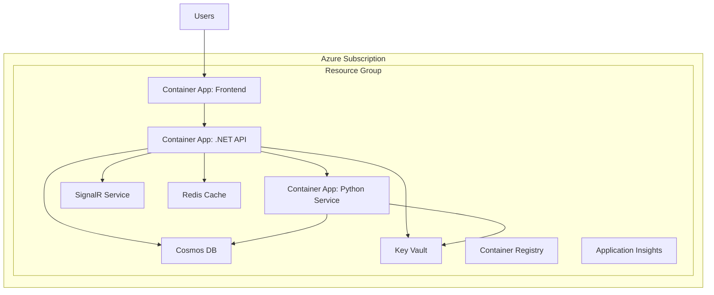

# Azure Deployment Guide

**Best for:** DevOps engineers and operators deploying Agent Studio to Azure environments with enterprise-grade security, scalability, and reliability.

This guide establishes production-ready Agent Studio infrastructure using Azure Bicep templates, ensuring consistent, repeatable deployments across environments.

## Deployment Overview

Agent Studio provides Infrastructure as Code (IaC) using Azure Bicep for:

- **Consistent Deployments**: Identical infrastructure across dev, staging, and production
- **Scalability**: Auto-scaling Container Apps or App Services
- **Security**: Virtual Networks, Private Endpoints, Managed Identities
- **Observability**: Application Insights, distributed tracing, metrics
- **Cost Management**: Right-sized resources for each environment

### Architecture



## Prerequisites

### Required Tools

- **Azure CLI** 2.50.0 or later
- **Azure Bicep** 0.20.0 or later
- **Git** for cloning repository
- **Docker** (optional, for building container images)

### Azure Subscription Requirements

- **Active Azure Subscription** with appropriate permissions
- **Resource Provider Registration**:
  - Microsoft.ContainerRegistry
  - Microsoft.DocumentDB
  - Microsoft.KeyVault
  - Microsoft.App
  - Microsoft.Insights
  - Microsoft.SignalRService
  - Microsoft.Cache

### Required Permissions

Your account needs:
- **Contributor** role on subscription or resource group
- **User Access Administrator** for managed identity assignments
- **Key Vault Administrator** for Key Vault secrets

### Azure OpenAI Service

Deploy Azure OpenAI Service separately:

```bash
az cognitiveservices account create \
  --name "your-openai-service" \
  --resource-group "rg-agent-studio-prod" \
  --location "eastus" \
  --kind "OpenAI" \
  --sku "S0"

# Deploy models
az cognitiveservices account deployment create \
  --resource-group "rg-agent-studio-prod" \
  --name "your-openai-service" \
  --deployment-name "gpt-4" \
  --model-name "gpt-4" \
  --model-version "0613" \
  --model-format "OpenAI" \
  --sku-capacity 10 \
  --sku-name "Standard"
```

## Quick Deployment

### Step 1: Clone Repository

```bash
git clone https://github.com/Brookside-Proving-Grounds/Project-Ascension.git
cd Project-Ascension/infra
```

### Step 2: Login to Azure

```bash
az login
az account set --subscription "your-subscription-id"
```

### Step 3: Deploy Infrastructure

```bash
# For dev environment
./deploy.sh dev

# For production environment
./deploy.sh prod
```

The script will:
1. Validate Bicep templates
2. Create resource group
3. Deploy all infrastructure
4. Configure Key Vault secrets
5. Deploy container images
6. Output connection strings and URLs

### Step 4: Configure Secrets

```bash
# Run secret configuration script
./scripts/set-secrets.sh "kv-agent-studio-prod"
```

You'll be prompted for:
- Azure OpenAI API key
- Cosmos DB connection string
- Application Insights instrumentation key

### Step 5: Verify Deployment

```bash
# Check resource group
az group show --name "rg-agent-studio-prod"

# List deployed resources
az resource list --resource-group "rg-agent-studio-prod" --output table

# Test API endpoint
curl https://api-agent-studio-prod.azurecontainerapps.io/health
```

## Detailed Deployment Steps

### 1. Prepare Bicep Parameters

Create parameter file for your environment:

**`infra/parameters.prod.json`:**

```json
{
  "$schema": "https://schema.management.azure.com/schemas/2019-04-01/deploymentParameters.json#",
  "contentVersion": "1.0.0.0",
  "parameters": {
    "projectName": {
      "value": "agent-studio"
    },
    "environment": {
      "value": "prod"
    },
    "location": {
      "value": "eastus"
    },
    "runtimeType": {
      "value": "containerapps"
    },
    "enableVNet": {
      "value": true
    },
    "enableOpenAI": {
      "value": true
    },
    "enableSignalR": {
      "value": true
    },
    "enableRedis": {
      "value": true
    },
    "enableAISearch": {
      "value": false
    },
    "containerAppsConfig": {
      "value": {
        "frontend": {
          "minReplicas": 2,
          "maxReplicas": 10,
          "cpu": 0.5,
          "memory": "1Gi"
        },
        "dotnetApi": {
          "minReplicas": 2,
          "maxReplicas": 20,
          "cpu": 1.0,
          "memory": "2Gi"
        },
        "pythonService": {
          "minReplicas": 2,
          "maxReplicas": 10,
          "cpu": 1.0,
          "memory": "2Gi"
        }
      }
    },
    "cosmosDbConfig": {
      "value": {
        "serverless": false,
        "throughput": 4000,
        "enableBackup": true,
        "backupIntervalMinutes": 240,
        "backupRetentionHours": 168
      }
    }
  }
}
```

### 2. Validate Deployment

```bash
az deployment sub validate \
  --location eastus \
  --template-file deploy.bicep \
  --parameters parameters.prod.json
```

### 3. Deploy Infrastructure

```bash
az deployment sub create \
  --name "agent-studio-prod-$(date +%Y%m%d-%H%M%S)" \
  --location eastus \
  --template-file deploy.bicep \
  --parameters parameters.prod.json
```

Deployment takes approximately 15-20 minutes.

### 4. Configure Managed Identities

Grant managed identities access to Key Vault:

```bash
# Get identity principal IDs
API_IDENTITY=$(az containerapp show \
  --name "ca-agent-studio-api-prod" \
  --resource-group "rg-agent-studio-prod" \
  --query "identity.principalId" -o tsv)

PYTHON_IDENTITY=$(az containerapp show \
  --name "ca-agent-studio-python-prod" \
  --resource-group "rg-agent-studio-prod" \
  --query "identity.principalId" -o tsv)

# Assign Key Vault Secrets User role
az role assignment create \
  --role "Key Vault Secrets User" \
  --assignee $API_IDENTITY \
  --scope "/subscriptions/{subscription-id}/resourceGroups/rg-agent-studio-prod/providers/Microsoft.KeyVault/vaults/kv-agent-studio-prod"

az role assignment create \
  --role "Key Vault Secrets User" \
  --assignee $PYTHON_IDENTITY \
  --scope "/subscriptions/{subscription-id}/resourceGroups/rg-agent-studio-prod/providers/Microsoft.KeyVault/vaults/kv-agent-studio-prod"
```

### 5. Store Secrets in Key Vault

```bash
KV_NAME="kv-agent-studio-prod"

# Azure OpenAI
az keyvault secret set \
  --vault-name $KV_NAME \
  --name "azure-openai-key" \
  --value "your-api-key"

az keyvault secret set \
  --vault-name $KV_NAME \
  --name "azure-openai-endpoint" \
  --value "https://your-resource.openai.azure.com/"

# Cosmos DB
COSMOS_KEY=$(az cosmosdb keys list \
  --name "cosmos-agent-studio-prod" \
  --resource-group "rg-agent-studio-prod" \
  --query "primaryMasterKey" -o tsv)

az keyvault secret set \
  --vault-name $KV_NAME \
  --name "cosmos-db-key" \
  --value "$COSMOS_KEY"
```

### 6. Build and Push Container Images

```bash
# Login to ACR
az acr login --name "acragentstudioprod"

# Build and push frontend
docker build -t acragentstudioprod.azurecr.io/frontend:latest ./webapp
docker push acragentstudioprod.azurecr.io/frontend:latest

# Build and push .NET API
docker build -t acragentstudioprod.azurecr.io/dotnet-api:latest ./services/dotnet
docker push acragentstudioprod.azurecr.io/dotnet-api:latest

# Build and push Python service
docker build -t acragentstudioprod.azurecr.io/python-service:latest ./src/python
docker push acragentstudioprod.azurecr.io/python-service:latest
```

### 7. Update Container Apps with Images

```bash
# Update frontend
az containerapp update \
  --name "ca-agent-studio-frontend-prod" \
  --resource-group "rg-agent-studio-prod" \
  --image "acragentstudioprod.azurecr.io/frontend:latest"

# Update .NET API
az containerapp update \
  --name "ca-agent-studio-api-prod" \
  --resource-group "rg-agent-studio-prod" \
  --image "acragentstudioprod.azurecr.io/dotnet-api:latest"

# Update Python service
az containerapp update \
  --name "ca-agent-studio-python-prod" \
  --resource-group "rg-agent-studio-prod" \
  --image "acragentstudioprod.azurecr.io/python-service:latest"
```

## Environment-Specific Configurations

### Development Environment

**Characteristics:**
- Minimal cost
- Serverless Cosmos DB
- No VNet
- Single replicas

**Parameters:**

```json
{
  "environment": "dev",
  "enableVNet": false,
  "cosmosDbConfig": {
    "serverless": true
  },
  "containerAppsConfig": {
    "frontend": {"minReplicas": 0, "maxReplicas": 1},
    "dotnetApi": {"minReplicas": 0, "maxReplicas": 2},
    "pythonService": {"minReplicas": 0, "maxReplicas": 2}
  }
}
```

### Staging Environment

**Characteristics:**
- Production-like configuration
- Reduced scale
- VNet enabled
- Backup enabled

**Parameters:**

```json
{
  "environment": "staging",
  "enableVNet": true,
  "cosmosDbConfig": {
    "serverless": false,
    "throughput": 1000
  },
  "containerAppsConfig": {
    "frontend": {"minReplicas": 1, "maxReplicas": 3},
    "dotnetApi": {"minReplicas": 1, "maxReplicas": 5},
    "pythonService": {"minReplicas": 1, "maxReplicas": 3}
  }
}
```

### Production Environment

**Characteristics:**
- High availability (2+ replicas)
- VNet with Private Endpoints
- Geo-redundancy
- Comprehensive backup

**Parameters:**

See [Detailed Deployment Steps](#detailed-deployment-steps) above for full production configuration.

## Post-Deployment Configuration

### Configure DNS

Add custom domain:

```bash
# Add custom domain to Container App
az containerapp hostname add \
  --name "ca-agent-studio-frontend-prod" \
  --resource-group "rg-agent-studio-prod" \
  --hostname "app.yourdomain.com"

# Bind certificate
az containerapp hostname bind \
  --name "ca-agent-studio-frontend-prod" \
  --resource-group "rg-agent-studio-prod" \
  --hostname "app.yourdomain.com" \
  --certificate "your-certificate-id"
```

### Enable Monitoring

Application Insights is deployed automatically. Configure alerts:

```bash
# Create alert for high error rate
az monitor metrics alert create \
  --name "high-error-rate" \
  --resource-group "rg-agent-studio-prod" \
  --scopes "/subscriptions/{id}/resourceGroups/rg-agent-studio-prod/providers/Microsoft.App/containerApps/ca-agent-studio-api-prod" \
  --condition "avg requests/failed > 10" \
  --window-size 5m \
  --evaluation-frequency 1m \
  --action "/subscriptions/{id}/resourceGroups/rg-agent-studio-prod/providers/microsoft.insights/actionGroups/platform-team"
```

### Configure Backup

Cosmos DB backup is enabled automatically in production. To restore:

```bash
az cosmosdb sql database restore \
  --account-name "cosmos-agent-studio-prod" \
  --resource-group "rg-agent-studio-prod" \
  --name "agent-studio-db" \
  --restore-timestamp "2025-10-08T12:00:00Z"
```

## Scaling Considerations

### Auto-Scaling Configuration

Container Apps auto-scale based on HTTP traffic and CPU:

```bash
az containerapp update \
  --name "ca-agent-studio-api-prod" \
  --resource-group "rg-agent-studio-prod" \
  --min-replicas 2 \
  --max-replicas 20 \
  --scale-rule-name "http-scaling" \
  --scale-rule-type "http" \
  --scale-rule-http-concurrency 100
```

### Cosmos DB Scaling

Adjust throughput for production load:

```bash
az cosmosdb sql database throughput update \
  --account-name "cosmos-agent-studio-prod" \
  --resource-group "rg-agent-studio-prod" \
  --name "agent-studio-db" \
  --throughput 10000
```

Or enable autoscale:

```bash
az cosmosdb sql database throughput update \
  --account-name "cosmos-agent-studio-prod" \
  --resource-group "rg-agent-studio-prod" \
  --name "agent-studio-db" \
  --max-throughput 10000
```

## Security Hardening

### Network Security

Enable VNet integration for production:

```json
{
  "enableVNet": true,
  "vnetConfig": {
    "addressPrefix": "10.0.0.0/16",
    "containerAppsSubnetPrefix": "10.0.0.0/23",
    "privateEndpointsSubnetPrefix": "10.0.2.0/24"
  }
}
```

### Private Endpoints

Enable private endpoints for Cosmos DB, Key Vault, and Storage:

```bash
# Create private endpoint for Cosmos DB
az network private-endpoint create \
  --name "pe-cosmos-agent-studio-prod" \
  --resource-group "rg-agent-studio-prod" \
  --vnet-name "vnet-agent-studio-prod" \
  --subnet "snet-private-endpoints" \
  --private-connection-resource-id "/subscriptions/{id}/resourceGroups/rg-agent-studio-prod/providers/Microsoft.DocumentDB/databaseAccounts/cosmos-agent-studio-prod" \
  --group-id "Sql" \
  --connection-name "cosmos-connection"
```

### Managed Identity

All services use managed identities—no API keys in code:

```json
{
  "identity": {
    "type": "SystemAssigned"
  }
}
```

## Monitoring and Observability

### Application Insights Queries

**Monitor Execution Success Rate:**

```kusto
customEvents
| where name == "WorkflowCompleted"
| summarize SuccessRate = countif(customDimensions.status == "completed") * 100.0 / count() by bin(timestamp, 1h)
| render timechart
```

**Track Costs:**

```kusto
customMetrics
| where name == "TokenUsage"
| extend cost = value * 0.00003
| summarize TotalCost = sum(cost) by bin(timestamp, 1d)
| render timechart
```

### Health Probes

Container Apps automatically configured with health probes:

- **Liveness**: `/health/live`
- **Readiness**: `/health/ready`
- **Startup**: `/health/startup`

## Troubleshooting

### Deployment Failures

```bash
# Check deployment status
az deployment sub show \
  --name "your-deployment-name" \
  --query "properties.{Status:provisioningState, Error:error}" -o table

# View detailed error
az deployment sub show \
  --name "your-deployment-name" \
  --query "properties.error" -o json
```

### Container App Logs

```bash
# Stream logs
az containerapp logs show \
  --name "ca-agent-studio-api-prod" \
  --resource-group "rg-agent-studio-prod" \
  --follow

# Query Application Insights
az monitor app-insights query \
  --app "ai-agent-studio-prod" \
  --analytics-query "traces | where timestamp > ago(1h) | order by timestamp desc | take 100"
```

## Best Practices

1. **Environment Parity**: Keep staging as close to production as possible
2. **Infrastructure as Code**: All changes through Bicep templates
3. **Secrets Management**: Never commit secrets—use Key Vault
4. **Monitoring**: Set up comprehensive alerts before going live
5. **Backup Testing**: Regularly test restore procedures
6. **Cost Management**: Use Azure Cost Management + Billing alerts
7. **Security**: Enable all security features (VNet, Private Endpoints, Managed Identities)

## Next Steps

- [Scaling Guide](scaling.md) - Optimize performance and costs
- [Monitoring Guide](monitoring.md) - Comprehensive observability
- [Disaster Recovery Runbook](../../runbooks/disaster-recovery.md) - Recovery procedures

## Support

**Documentation:**
Consultations@BrooksideBI.com

**Technical Support:**
+1 209 487 2047

---

*This guide establishes production-ready Azure infrastructure that supports scalable, secure, and observable agent operations.*

**Last Updated:** 2025-10-09
**Version:** 1.0.0
**Maintained By:** Agent Studio Platform Team
