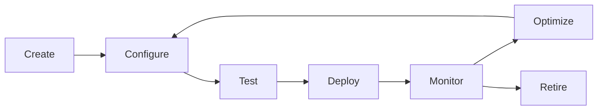

# Agent Management Guide

**Best for:** Organizations building production-ready AI agent systems that require structured governance and sustainable operations.

This guide establishes comprehensive practices for managing AI agents throughout their lifecycle—from initial creation through ongoing monitoring and optimization.

## Overview

Agent Studio provides enterprise-grade agent management capabilities designed to streamline workflows and improve visibility across your agent infrastructure. This solution is designed to help organizations scaling AI operations across multiple teams and departments.

### What You'll Learn

- Creating and configuring agents with Azure OpenAI integration
- Understanding agent roles and capabilities
- Executing tasks and monitoring performance
- Troubleshooting agent issues
- Establishing governance and best practices

## Understanding Agents

### Agent Fundamentals

An **agent** in Agent Studio is an autonomous AI entity that performs specialized tasks within orchestrated workflows. Each agent is:

- **Purpose-built**: Designed for specific tasks (code generation, validation, documentation)
- **Configurable**: Customizable parameters, prompts, and LLM settings
- **Observable**: Full tracing and monitoring of all operations
- **Recoverable**: Built-in checkpointing and error handling

### Agent Types

Agent Studio provides four meta-agent types, each optimized for distinct workflow stages:

| Agent Type | Primary Role | Best For |
|------------|--------------|----------|
| **Architect** | Planning and design | Breaking down complex requirements into actionable tasks |
| **Builder** | Implementation | Generating code, configurations, and artifacts |
| **Validator** | Quality assurance | Testing, validation, and compliance checks |
| **Scribe** | Documentation | Creating comprehensive technical documentation |

### Agent Lifecycle



## Creating Agents

### Prerequisites

Before creating agents, ensure you have:

- **Azure OpenAI Service** deployed with appropriate models
- **API Keys** stored securely in Azure Key Vault
- **RBAC Permissions** to create and manage agents
- **Resource Quotas** configured for your environment

### Step 1: Access Agent Creation

Navigate to the **Agents** page in Agent Studio:

1. Click **Agents** in the main navigation
2. Select **+ Create Agent** button
3. Choose your agent template or start from scratch

### Step 2: Configure Basic Settings

Establish the foundational configuration for your agent:

**Agent Name**
- Use descriptive, purposeful names (e.g., `code-generator-python`, `security-validator`)
- Follow your organization's naming conventions
- Include environment indicators if deploying across multiple stages

**Agent Type**
Select the meta-agent type that aligns with your agent's primary function:
- `Architect`: Strategic planning and task decomposition
- `Builder`: Implementation and artifact generation
- `Validator`: Quality assurance and compliance
- `Scribe`: Documentation and knowledge capture

**Description**
Provide clear context about:
- The agent's purpose and business value
- Specific tasks it performs
- When to use this agent in workflows

### Step 3: Azure OpenAI Configuration

Connect your agent to Azure OpenAI services:

```json
{
  "azureOpenAI": {
    "endpoint": "https://your-resource.openai.azure.com/",
    "deploymentName": "gpt-4",
    "apiVersion": "2024-02-15-preview",
    "apiKeyReference": "@Microsoft.KeyVault(SecretUri=https://your-vault.vault.azure.net/secrets/openai-key/)"
  }
}
```

**Configuration Parameters:**

- **Endpoint**: Your Azure OpenAI resource endpoint
- **Deployment Name**: The specific model deployment (gpt-4, gpt-35-turbo, etc.)
- **API Version**: OpenAI API version (use latest stable)
- **API Key Reference**: Key Vault secret reference (never hardcode keys)

### Step 4: Model Parameters

Establish model behavior to drive consistent, reliable outputs:

```json
{
  "modelParameters": {
    "temperature": 0.7,
    "maxTokens": 4000,
    "topP": 0.95,
    "frequencyPenalty": 0.0,
    "presencePenalty": 0.0
  }
}
```

**Parameter Guidelines:**

| Parameter | Purpose | Recommended Range | Use Case |
|-----------|---------|-------------------|----------|
| `temperature` | Creativity vs. consistency | 0.0-0.3: Deterministic<br>0.7-1.0: Creative | Code: 0.2<br>Documentation: 0.7 |
| `maxTokens` | Response length limit | 1000-8000 | Adjust based on task complexity |
| `topP` | Nucleus sampling | 0.9-1.0 | Higher for diverse outputs |
| `frequencyPenalty` | Reduce repetition | 0.0-1.0 | Increase if seeing repeated phrases |
| `presencePenalty` | Topic diversity | 0.0-1.0 | Increase for broader exploration |

### Step 5: System Prompt Configuration

The system prompt establishes the agent's behavior, capabilities, and constraints:

```markdown
You are a senior software architect specializing in scalable system design.

**Your Mission:**
Analyze requirements and establish architectural patterns that support sustainable growth and measurable outcomes.

**Core Capabilities:**
- Break down complex systems into manageable components
- Identify integration patterns and data flows
- Establish governance and quality standards
- Document architectural decisions with rationale

**Constraints:**
- Always consider scalability and performance implications
- Prioritize maintainability and team productivity
- Follow industry best practices and security standards
- Provide clear, actionable recommendations

**Output Format:**
Deliver structured analysis with:
1. Problem summary and context
2. Proposed architecture with diagrams
3. Implementation phases
4. Risk assessment and mitigation strategies
```

**Best Practices:**

- **Clarity**: Use clear, precise language that defines behavior unambiguously
- **Context**: Include organizational context and domain knowledge
- **Constraints**: Explicitly state what the agent should NOT do
- **Output Format**: Specify expected structure and format
- **Examples**: Include example outputs for complex tasks

### Step 6: Test Your Agent

Before deploying to production workflows, validate agent behavior:

1. Navigate to the **Test** tab in the agent configuration
2. Enter a sample task representative of production use
3. Review the agent's response for:
   - Accuracy and relevance
   - Adherence to system prompt
   - Output format compliance
   - Token usage and performance

**Sample Test Tasks:**

```json
{
  "task": "Design a microservices architecture for a customer data platform that handles 10M requests/day",
  "context": {
    "environment": "Azure",
    "teamSize": "5 developers",
    "timeline": "3 months"
  }
}
```

### Step 7: Save and Deploy

1. Review all configuration settings
2. Click **Save Agent** to persist configuration
3. Test in a staging workflow before production use
4. Monitor initial executions closely

## Agent Configuration Reference

### Complete Configuration Schema

```json
{
  "id": "agent-001",
  "name": "architect-agent-prod",
  "type": "Architect",
  "description": "Production architect agent for system design and planning",
  "version": "1.0.0",
  "enabled": true,

  "azureOpenAI": {
    "endpoint": "https://your-resource.openai.azure.com/",
    "deploymentName": "gpt-4",
    "apiVersion": "2024-02-15-preview",
    "apiKeyReference": "@Microsoft.KeyVault(...)"
  },

  "modelParameters": {
    "temperature": 0.7,
    "maxTokens": 4000,
    "topP": 0.95,
    "frequencyPenalty": 0.0,
    "presencePenalty": 0.0,
    "stopSequences": []
  },

  "systemPrompt": "Your comprehensive system prompt here...",

  "capabilities": {
    "streaming": true,
    "functionCalling": false,
    "codeInterpreter": false
  },

  "retryPolicy": {
    "maxRetries": 3,
    "retryDelayMs": 1000,
    "exponentialBackoff": true
  },

  "rateLimit": {
    "requestsPerMinute": 60,
    "tokensPerMinute": 90000
  },

  "monitoring": {
    "enableTracing": true,
    "enableMetrics": true,
    "logLevel": "info"
  },

  "metadata": {
    "owner": "platform-team@example.com",
    "costCenter": "engineering",
    "environment": "production",
    "tags": ["core", "architecture", "production"]
  }
}
```

## Executing Tasks

### Direct Task Execution

Execute individual tasks directly from the agent management interface:

1. Navigate to **Agents** → Select your agent
2. Click **Execute Task**
3. Provide task details:

```json
{
  "task": "Generate a data migration plan from PostgreSQL to Cosmos DB",
  "context": {
    "databaseSize": "500GB",
    "downtime": "4 hours maximum",
    "complianceRequirements": ["GDPR", "SOC2"]
  },
  "outputFormat": "markdown"
}
```

4. Monitor execution in real-time
5. Review output and metrics

### Workflow Integration

Most production use cases execute agents within orchestrated workflows:

```json
{
  "workflowId": "data-migration-workflow",
  "tasks": [
    {
      "taskId": "task-1",
      "agentId": "architect-agent-prod",
      "input": {
        "task": "Design migration architecture",
        "context": {...}
      }
    },
    {
      "taskId": "task-2",
      "agentId": "validator-agent-prod",
      "input": {
        "task": "Validate migration plan",
        "dependencies": ["task-1"]
      }
    }
  ]
}
```

See [Workflow Designer Guide](workflow-designer.md) for comprehensive workflow orchestration patterns.

## Monitoring Agent Performance

### Real-Time Monitoring

Monitor agent executions through the **Monitoring** dashboard:

**Key Metrics:**

- **Execution Count**: Total tasks completed
- **Success Rate**: Percentage of successful executions
- **Average Duration**: Mean execution time
- **Token Usage**: Consumption metrics for cost tracking
- **Error Rate**: Failed execution percentage

### Performance Analysis

Access detailed performance data:

1. Navigate to **Agents** → Select agent → **Analytics** tab
2. Review performance trends over time
3. Identify optimization opportunities:
   - High token usage → Optimize prompts
   - Long execution times → Adjust max tokens
   - High error rates → Review error logs

### Cost Management

Track and optimize Azure OpenAI costs:

```sql
-- Query Application Insights for cost analysis
customMetrics
| where name == "AgentTokenUsage"
| extend agentId = tostring(customDimensions.agentId)
| extend tokens = toint(value)
| extend estimatedCost = tokens * 0.00003  -- GPT-4 pricing
| summarize
    TotalTokens = sum(tokens),
    TotalCost = sum(estimatedCost),
    AvgTokensPerExecution = avg(tokens)
    by agentId, bin(timestamp, 1d)
| order by TotalCost desc
```

**Cost Optimization Strategies:**

1. **Right-size models**: Use GPT-3.5-Turbo for simpler tasks
2. **Optimize prompts**: Reduce unnecessary context
3. **Cache results**: Store and reuse common responses
4. **Set token limits**: Prevent runaway token consumption
5. **Monitor trends**: Track cost anomalies

## Troubleshooting Agents

### Common Issues and Solutions

#### Issue: Agent Returns Incomplete Responses

**Symptoms:**
- Responses cut off mid-sentence
- Missing expected output sections

**Causes:**
- `maxTokens` limit too low
- Model reaching token limit

**Solutions:**
```json
{
  "modelParameters": {
    "maxTokens": 8000  // Increase from default 4000
  }
}
```

#### Issue: Inconsistent Agent Behavior

**Symptoms:**
- Different outputs for same input
- Unpredictable response quality

**Causes:**
- High `temperature` setting
- Ambiguous system prompt

**Solutions:**
```json
{
  "modelParameters": {
    "temperature": 0.2  // Reduce for consistency
  }
}
```

Clarify system prompt with specific examples and constraints.

#### Issue: Rate Limit Errors

**Symptoms:**
- HTTP 429 errors
- "Rate limit exceeded" messages

**Causes:**
- Exceeding Azure OpenAI quota
- Too many concurrent requests

**Solutions:**
1. Implement exponential backoff retry logic
2. Distribute load across multiple deployments
3. Request quota increase from Azure
4. Implement request queuing

```json
{
  "retryPolicy": {
    "maxRetries": 5,
    "retryDelayMs": 2000,
    "exponentialBackoff": true
  }
}
```

#### Issue: High Token Costs

**Symptoms:**
- Unexpectedly high Azure bills
- Token usage exceeding budgets

**Causes:**
- Verbose system prompts
- Inefficient task decomposition
- No token limits

**Solutions:**
1. Optimize system prompts—remove redundant context
2. Use GPT-3.5-Turbo for simpler tasks
3. Implement token budgets:

```json
{
  "rateLimit": {
    "tokensPerMinute": 60000,  // Enforce strict limits
    "requestsPerMinute": 30
  }
}
```

### Diagnostic Procedures

**Step 1: Check Agent Configuration**

```bash
# Use Azure CLI to verify configuration
az rest --method get \
  --url "https://your-api.azurewebsites.net/api/agents/{agentId}" \
  | jq '.configuration'
```

**Step 2: Review Execution Logs**

Navigate to **Application Insights** → **Logs**:

```kusto
traces
| where customDimensions.agentId == "your-agent-id"
| where timestamp > ago(1h)
| project timestamp, message, severityLevel, customDimensions
| order by timestamp desc
```

**Step 3: Test with Minimal Configuration**

Create a test agent with minimal configuration to isolate issues:

```json
{
  "name": "test-agent-minimal",
  "type": "Builder",
  "modelParameters": {
    "temperature": 0.7,
    "maxTokens": 1000
  },
  "systemPrompt": "You are a helpful assistant. Respond concisely."
}
```

**Step 4: Validate Azure OpenAI Connectivity**

```bash
# Test Azure OpenAI endpoint directly
curl -X POST \
  "https://your-resource.openai.azure.com/openai/deployments/gpt-4/chat/completions?api-version=2024-02-15-preview" \
  -H "api-key: YOUR_KEY" \
  -H "Content-Type: application/json" \
  -d '{
    "messages": [{"role": "user", "content": "Hello"}],
    "max_tokens": 100
  }'
```

## Agent Governance

### Versioning Strategy

Establish structured versioning to support sustainable agent evolution:

**Semantic Versioning:**
- **Major (1.x.x)**: Breaking changes to interface or behavior
- **Minor (x.1.x)**: New capabilities, backward-compatible
- **Patch (x.x.1)**: Bug fixes, configuration adjustments

**Example Workflow:**

```json
{
  "agents": [
    {
      "name": "architect-agent",
      "version": "2.0.0",
      "status": "production",
      "deployedDate": "2025-10-01"
    },
    {
      "name": "architect-agent",
      "version": "1.5.2",
      "status": "deprecated",
      "sunsetDate": "2025-12-01"
    }
  ]
}
```

### Security Best Practices

**1. API Key Management**

Never embed API keys directly—always use Azure Key Vault:

```json
{
  "apiKeyReference": "@Microsoft.KeyVault(SecretUri=https://vault.vault.azure.net/secrets/key/version)"
}
```

**2. Role-Based Access Control**

Establish RBAC for agent operations:

| Role | Permissions |
|------|-------------|
| **Agent Viewer** | Read agent configurations, view execution history |
| **Agent Operator** | Execute tasks, view metrics |
| **Agent Administrator** | Create, modify, delete agents |
| **Agent Owner** | Full control including security settings |

**3. Audit Logging**

Enable comprehensive audit trails:

```json
{
  "monitoring": {
    "auditEvents": [
      "agent.created",
      "agent.modified",
      "agent.deleted",
      "agent.executed",
      "configuration.changed"
    ]
  }
}
```

**4. Network Security**

Implement network isolation for sensitive environments:

- Deploy agents in Azure Virtual Network
- Use Private Endpoints for Azure OpenAI
- Enable Azure Firewall for outbound filtering

### Compliance Considerations

**Data Residency:**
Ensure agent operations comply with data residency requirements by configuring Azure OpenAI in appropriate regions.

**Content Filtering:**
Enable Azure OpenAI content filters to prevent inappropriate content:

```json
{
  "contentFiltering": {
    "hate": "medium",
    "sexual": "medium",
    "violence": "medium",
    "selfHarm": "medium"
  }
}
```

**Retention Policies:**
Configure log retention to meet compliance requirements:

```json
{
  "retention": {
    "executionLogs": "90 days",
    "auditLogs": "7 years",
    "metrics": "13 months"
  }
}
```

## Best Practices

### Agent Design Principles

1. **Single Responsibility**: Each agent should have one clear, well-defined purpose
2. **Composability**: Design agents to work seamlessly in workflows
3. **Idempotency**: Agents should produce consistent results for identical inputs
4. **Error Handling**: Implement comprehensive error handling and retry logic
5. **Observability**: Instrument all agent operations with tracing and metrics

### Configuration Management

1. **Version Control**: Store agent configurations in Git repositories
2. **Environment Parity**: Maintain consistent configurations across environments
3. **Configuration as Code**: Use infrastructure as code practices
4. **Secrets Management**: Never commit secrets—use Key Vault exclusively
5. **Documentation**: Document all configuration decisions and rationale

### Testing Strategy

**Unit Testing:**
Test agent behavior with representative inputs:

```python
def test_architect_agent_system_design():
    agent = ArchitectAgent(config)
    result = agent.execute({
        "task": "Design a microservices architecture",
        "context": {...}
    })

    assert "architecture" in result
    assert result["token_usage"] < 8000
    assert result["execution_time"] < 30.0  # seconds
```

**Integration Testing:**
Validate agent integration within workflows:

```python
def test_workflow_agent_integration():
    workflow = WorkflowExecutor(workflow_config)
    result = workflow.execute()

    assert all(task["status"] == "completed" for task in result["tasks"])
    assert result["overall_status"] == "success"
```

**Load Testing:**
Ensure agents handle production load:

```bash
# Artillery load test configuration
artillery run agent-load-test.yml
```

### Optimization Guidelines

**Prompt Engineering:**
- Use clear, specific instructions
- Include relevant examples
- Specify output format explicitly
- Remove unnecessary context

**Model Selection:**
- GPT-4: Complex reasoning, critical accuracy
- GPT-3.5-Turbo: High-volume, simpler tasks
- Evaluate cost vs. quality tradeoffs

**Caching Strategy:**
- Cache deterministic responses
- Implement semantic caching for similar queries
- Set appropriate TTL based on use case

**Monitoring and Alerts:**
- Set alerts for high error rates (>5%)
- Monitor token usage anomalies
- Track execution time p95 and p99
- Alert on cost threshold breaches

## Next Steps

- [Workflow Designer Guide](workflow-designer.md) - Orchestrate agents in complex workflows
- [Execution Monitoring Guide](execution-monitoring.md) - Monitor and troubleshoot executions
- [API Reference](/api/) - Programmatic agent management
- [Security Implementation Guide](../developer/security-implementation.md) - Advanced security patterns

## Support

**Documentation:**
Consultations@BrooksideBI.com

**Technical Support:**
+1 209 487 2047

**Community:**
[GitHub Discussions](https://github.com/Brookside-Proving-Grounds/Project-Ascension/discussions)

---

*This guide is designed to establish sustainable agent management practices that support organizational growth and drive measurable outcomes across your AI operations.*

**Last Updated:** 2025-10-09
**Version:** 1.0.0
**Maintained By:** Agent Studio Platform Team
