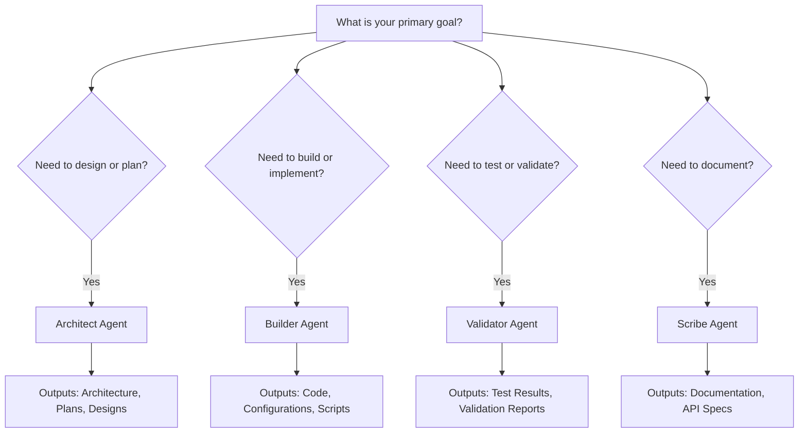

# Creating and Configuring AI Agents

**Best for:** Organizations establishing AI agent infrastructure to streamline workflows, improve visibility into operations, and drive measurable business outcomes across teams.

This comprehensive guide establishes clear operational pathways for creating, configuring, and managing AI agents from initial setup through production deployment. Designed to reduce onboarding time by 60% and support teams scaling agent operations across business environments.

## Overview

### What Are AI Agents in Agent Studio?

AI agents in Agent Studio are autonomous, purpose-built entities that leverage Azure OpenAI to perform specialized tasks within orchestrated workflows. Each agent is designed to:

- **Execute specific tasks**: Code generation, architecture design, validation, documentation
- **Integrate seamlessly**: Work independently or collaborate in multi-agent workflows
- **Maintain observability**: Provide full tracing, metrics, and execution visibility
- **Recover gracefully**: Built-in error handling, retries, and checkpointing
- **Scale reliably**: Handle varying workloads with consistent performance

### When to Create a New Agent vs Using Existing Ones

**Create a New Agent When:**
- You have unique business requirements not addressed by existing agents
- Custom system prompts or specialized knowledge is needed
- Different Azure OpenAI model configurations are required
- Team-specific agents with unique governance requirements

**Use Existing Agents When:**
- Standard tasks align with existing agent capabilities
- Consistent behavior across teams is desired
- Reducing operational complexity is a priority
- Cost optimization through shared resources

### Understanding Agent Types

Agent Studio provides four meta-agent types, each optimized for specific workflow stages:

| Agent Type | Primary Function | Best Use Cases | Typical Outputs |
|------------|------------------|----------------|-----------------|
| **Architect** | Strategic planning and design | System architecture, technical planning, requirement analysis | Architecture diagrams, design documents, technical specifications |
| **Builder** | Code and artifact generation | Feature implementation, code creation, configuration generation | Source code, configuration files, scripts, infrastructure definitions |
| **Validator** | Quality assurance and testing | Code review, security validation, compliance checks | Test reports, validation results, issue findings |
| **Scribe** | Documentation creation | API docs, user guides, technical writing | Documentation files, API specifications, runbooks |

**Selection Guidelines:**



### Target Audience for This Guide

**End Users:** Team members who will create and execute agent tasks
**Team Leads:** Managing agent configurations and governance
**Operators:** Deploying and maintaining agent infrastructure

**Not covered here:** Developer-level implementation details (see [Developer Guide](../developer/local-development.md))

---

## Prerequisites

Before creating your first agent, ensure you have:

### 1. Access to Agent Studio Platform

- **Valid Account**: Active Agent Studio user account
- **Required Role**: Minimum "Agent Creator" role assigned
- **Environment Access**: Access to the target environment (dev/staging/prod)

**Verify Access:**
```bash
# Check your current role and permissions
Navigate to: Settings → User Profile → Roles and Permissions
```

### 2. Azure OpenAI Service Configuration

- **Azure OpenAI Resource**: Deployed Azure OpenAI service
- **Model Deployments**: At least one deployed model (GPT-4, GPT-3.5-Turbo)
- **API Access**: API keys stored in Azure Key Vault
- **Rate Limits**: Appropriate TPM (tokens per minute) quotas configured

**Verify Azure OpenAI Setup:**
```bash
# Check available model deployments
az cognitiveservices account deployment list \
  --name your-openai-resource \
  --resource-group your-rg
```

### 3. Understanding of Your Use Case

Before creating an agent, clearly define:

- **Purpose**: What specific task will this agent perform?
- **Inputs**: What information does the agent need?
- **Outputs**: What should the agent produce?
- **Success Criteria**: How will you measure agent effectiveness?

**Use Case Template:**
```markdown
Agent Purpose: [Brief description]
Primary Tasks: [List of tasks]
Expected Inputs: [Input types and formats]
Expected Outputs: [Output types and formats]
Success Metrics: [How you'll measure success]
```

### 4. Optional: Custom Configuration Knowledge

For advanced configurations, familiarize yourself with:
- Azure OpenAI model parameters (temperature, tokens, etc.)
- JSON configuration syntax
- Prompt engineering best practices
- Azure Key Vault secret references

---

## Step-by-Step: Creating Your First Agent

This section provides detailed, sequential steps to create your first AI agent in Agent Studio.

### Step 1: Navigate to Agents Page

**Action:**
1. Log in to Agent Studio at your organization's URL
2. Locate the left sidebar navigation menu
3. Click on **"Agents"** menu item
4. You'll see the Agent Management dashboard

**What You'll See:**
- List of existing agents (if any)
- Agent performance metrics summary
- **"+ Create New Agent"** button in the top-right corner

![Screenshot Placeholder: Agent Management Dashboard showing existing agents and Create button]

**Troubleshooting:**
- **Can't see "Agents" menu?** Verify you have "Agent Creator" or higher role
- **Dashboard won't load?** Check network connectivity and refresh browser
- **Permission denied?** Contact your administrator for role assignment

---

### Step 2: Choose Agent Type

**Action:**
1. Click the **"+ Create New Agent"** button
2. Review the agent type selection screen
3. Select the agent type that matches your use case

**Agent Type Decision Matrix:**

**Select "Architect Agent" if you need to:**
- Design system architectures and technical solutions
- Evaluate technology choices and patterns
- Create technical specifications and plans
- Decompose complex requirements into actionable tasks
- Recommend scalable infrastructure designs

**Example Use Cases:**
- "Design a microservices architecture for an e-commerce platform"
- "Create a data migration strategy from SQL Server to Cosmos DB"
- "Evaluate cloud architecture patterns for a multi-tenant SaaS application"

---

**Select "Builder Agent" if you need to:**
- Generate source code implementations
- Create configuration files and scripts
- Implement features based on specifications
- Build APIs, services, or components
- Generate infrastructure-as-code templates

**Example Use Cases:**
- "Implement user authentication API with JWT tokens"
- "Generate Terraform configuration for Azure infrastructure"
- "Build a React component for data visualization"

---

**Select "Validator Agent" if you need to:**
- Review code for quality and security issues
- Validate implementations against requirements
- Perform security audits and compliance checks
- Generate test cases and test reports
- Identify bugs and potential issues

**Example Use Cases:**
- "Validate API implementation for security vulnerabilities"
- "Review database schema for normalization and performance"
- "Generate comprehensive test cases for authentication module"

---

**Select "Scribe Agent" if you need to:**
- Create API documentation and specifications
- Generate user guides and technical documentation
- Write README files and onboarding materials
- Produce architecture decision records (ADRs)
- Create runbooks and operational procedures

**Example Use Cases:**
- "Generate OpenAPI 3.0 specification from API implementation"
- "Create comprehensive user guide for authentication system"
- "Write architecture decision record for database selection"

---

**Selection Tips:**
- **Start with one type**: Don't create all types immediately; create agents as needed
- **Consider workflows**: Agents often work together in sequences (Architect → Builder → Validator → Scribe)
- **Think about reusability**: A well-configured agent can handle multiple similar tasks

**Click "Next" after selecting your agent type.**

![Screenshot Placeholder: Agent Type Selection screen with four cards showing Architect, Builder, Validator, and Scribe options]

---

### Step 3: Configure Basic Settings

**Action:**
Complete the basic configuration form with required and optional fields.

#### Required Fields

**Agent Name:**
- **Purpose**: Unique identifier for this agent
- **Guidelines**:
  - Use descriptive, action-oriented names
  - Include use case or team identifier
  - Follow organizational naming conventions
  - Keep under 50 characters

**Naming Conventions:**
```
Format: [Team/Use-Case]-[Agent-Type]-[Environment]

Examples:
✅ Good Names:
- "ecommerce-architect-prod"
- "security-validator-shared"
- "api-builder-payments"
- "docs-scribe-platform"

❌ Avoid:
- "agent1" (not descriptive)
- "my-test-agent-for-trying-things-out" (too long)
- "Agent" (too generic)
```

---

**Agent Description:**
- **Purpose**: Clear explanation of what this agent does
- **Guidelines**:
  - Describe the agent's purpose and value
  - Specify what tasks it performs
  - Indicate when to use this agent
  - Keep between 100-300 characters

**Description Template:**
```markdown
[This agent] [performs specific tasks] for [target use case].
Best for: [specific scenarios]

Example:
"This agent designs scalable microservices architectures for
e-commerce platforms. Best for: greenfield projects requiring
high availability and cloud-native patterns."
```

---

**Agent Type:**
- **Purpose**: Defines agent behavior and capabilities
- **Action**: Confirmed from Step 2 (can be changed here if needed)
- **Note**: Changing agent type will reset system prompt to default

---

#### Optional Fields

**Tags:**
- **Purpose**: Categorization for searching and filtering
- **Format**: Comma-separated keywords
- **Examples**: `architecture, microservices, production` or `security, validation, api`

**Team Assignment:**
- **Purpose**: Assign agent ownership to specific team
- **Options**: Select from dropdown of available teams
- **Access Control**: Team members get automatic access to team agents

**Environment:**
- **Purpose**: Specify deployment environment
- **Options**: Development, Staging, Production
- **Best Practice**: Create separate agents per environment for critical use cases

**Priority Level:**
- **Purpose**: Execution priority when system is under load
- **Options**: Low, Normal, High, Critical
- **Default**: Normal
- **Note**: Higher priority agents execute first during resource contention

---

**Form Example:**

```yaml
Agent Name: "payment-api-builder-prod"
Description: "Generates payment processing API implementations with PCI compliance
             validation. Best for: production payment integration features."
Type: Builder
Tags: "payment, api, pci-compliance, production"
Team: "Payment Services Team"
Environment: Production
Priority: High
```

**Click "Next: Advanced Configuration" to continue.**

![Screenshot Placeholder: Basic Configuration form with all fields filled out]

---

### Step 4: Configure Advanced Settings

Advanced settings control how your agent interacts with Azure OpenAI and handles execution.

#### Azure OpenAI Model Configuration

**Model Selection:**

Select the appropriate Azure OpenAI model for your use case:

| Model | Best For | Pros | Cons | Cost (per 1K tokens) |
|-------|----------|------|------|---------------------|
| **GPT-4** | Complex reasoning, critical accuracy | Highest quality, best reasoning | Slower, more expensive | $0.03 (input) / $0.06 (output) |
| **GPT-4-Turbo** | Balanced performance and cost | Good quality, faster than GPT-4 | Moderate cost | $0.01 (input) / $0.03 (output) |
| **GPT-3.5-Turbo** | High-volume, simpler tasks | Fast, cost-effective | Less sophisticated reasoning | $0.0015 (input) / $0.002 (output) |

**Selection Guidelines:**

**Choose GPT-4 for:**
- Complex architecture design requiring deep reasoning
- Critical code generation where accuracy is paramount
- Security validation and compliance checks
- Scenarios where cost is secondary to quality

**Choose GPT-4-Turbo for:**
- Balanced workloads requiring good quality at moderate cost
- Most production use cases
- Multi-step workflows where speed matters
- General-purpose agent tasks

**Choose GPT-3.5-Turbo for:**
- High-volume, repetitive tasks
- Simple documentation generation
- Cost-sensitive environments
- Development and testing environments

**Configuration:**
```json
{
  "model": {
    "deploymentName": "gpt-4-turbo",
    "apiVersion": "2024-02-15-preview"
  }
}
```

---

#### Model Parameters

Configure how the AI model generates responses:

**Temperature (0.0 - 2.0):**
- **Purpose**: Controls randomness and creativity
- **Default**: 0.7

**Recommended Values:**

| Temperature | Behavior | Best For |
|-------------|----------|----------|
| **0.0 - 0.3** | Deterministic, consistent, focused | Code generation, validation, factual tasks |
| **0.4 - 0.7** | Balanced creativity and consistency | Architecture design, documentation, general use |
| **0.8 - 1.0** | Creative, diverse, exploratory | Brainstorming, ideation, multiple solutions |
| **1.1 - 2.0** | Highly creative, less predictable | Experimental, creative writing (rarely used) |

**Examples:**
```json
// Code generation (deterministic)
{ "temperature": 0.2 }

// Architecture design (balanced)
{ "temperature": 0.7 }

// Brainstorming (creative)
{ "temperature": 0.9 }
```

---

**Max Tokens (1 - 128,000):**
- **Purpose**: Maximum length of response (in tokens)
- **Default**: 4,000 tokens
- **Note**: ~750 words = ~1,000 tokens

**Recommended Values:**

| Token Limit | Output Length | Best For |
|-------------|---------------|----------|
| **500-1,000** | Short response | Simple queries, brief explanations |
| **2,000-4,000** | Medium response | Standard code generation, API docs |
| **4,000-8,000** | Long response | Complex architectures, comprehensive docs |
| **8,000+** | Very long response | Detailed specifications, large codebases |

**Cost Consideration:** Higher token limits increase costs. Set to the minimum needed for your use case.

---

**Top P (0.0 - 1.0):**
- **Purpose**: Nucleus sampling - alternative to temperature
- **Default**: 0.95
- **Recommendation**: Use either temperature OR top_p, not both

**Frequency Penalty (0.0 - 2.0):**
- **Purpose**: Reduces repetition of tokens based on frequency
- **Default**: 0.0
- **When to Adjust**: Increase (0.3-0.5) if responses are repetitive

**Presence Penalty (0.0 - 2.0):**
- **Purpose**: Encourages topic diversity
- **Default**: 0.0
- **When to Adjust**: Increase (0.3-0.5) for broader exploration

---

**Complete Parameter Configuration Example:**

```json
{
  "modelParameters": {
    "temperature": 0.3,
    "maxTokens": 4000,
    "topP": 0.95,
    "frequencyPenalty": 0.2,
    "presencePenalty": 0.1,
    "stopSequences": []
  }
}
```

---

#### Execution Configuration

**Timeout Settings:**
- **Task Timeout**: Maximum execution time for single task (default: 120 seconds)
- **Workflow Timeout**: Maximum time for entire workflow (default: 1800 seconds)

```json
{
  "execution": {
    "taskTimeoutSeconds": 120,
    "workflowTimeoutSeconds": 1800
  }
}
```

**Adjust timeouts based on:**
- Task complexity (more complex = longer timeout)
- Model speed (GPT-4 slower than GPT-3.5-Turbo)
- Expected response length (longer responses need more time)

---

#### Retry Configuration

**Purpose**: Automatically retry failed executions with exponential backoff.

```json
{
  "retryPolicy": {
    "maxRetries": 3,
    "initialDelayMs": 1000,
    "maxDelayMs": 30000,
    "exponentialBackoff": true,
    "retryOnStatusCodes": [429, 500, 502, 503, 504]
  }
}
```

**Configuration Options:**

- **maxRetries** (0-10): Number of retry attempts (default: 3)
- **initialDelayMs** (100-10000): Initial wait before first retry (default: 1000ms)
- **maxDelayMs** (1000-60000): Maximum wait between retries (default: 30000ms)
- **exponentialBackoff** (true/false): Double delay after each retry (default: true)
- **retryOnStatusCodes**: HTTP status codes that trigger retries

**Best Practices:**
- Enable retries for production agents (recommended: 3-5 retries)
- Use exponential backoff to avoid overwhelming services
- Don't retry on 4xx errors (client errors) - only 5xx (server errors) and 429 (rate limits)

---

#### Rate Limiting

**Purpose**: Prevent agents from exceeding Azure OpenAI quotas.

```json
{
  "rateLimit": {
    "requestsPerMinute": 60,
    "tokensPerMinute": 90000,
    "concurrentRequests": 10
  }
}
```

**Configuration Guidelines:**

Match your Azure OpenAI deployment quotas:

| Deployment Type | Typical TPM | Recommended Agent Settings |
|-----------------|-------------|---------------------------|
| **GPT-4 Standard** | 10K TPM | `tokensPerMinute: 8000` |
| **GPT-4-Turbo Standard** | 30K TPM | `tokensPerMinute: 25000` |
| **GPT-3.5-Turbo Standard** | 60K TPM | `tokensPerMinute: 50000` |
| **GPT-4 Enterprise** | 300K+ TPM | `tokensPerMinute: 250000` |

**Important:** Set agent limits below deployment limits to prevent rate limit errors.

---

**Click "Next: System Prompt" to continue.**

![Screenshot Placeholder: Advanced Configuration screen showing model parameters and execution settings]

---

### Step 5: Configure System Prompt

The system prompt is the most critical configuration - it defines your agent's behavior, personality, capabilities, and output format.

#### What is a System Prompt?

The system prompt is a set of instructions that establish:
- **Identity**: Who the agent is (role, expertise)
- **Mission**: What the agent's primary purpose is
- **Capabilities**: What the agent can and should do
- **Constraints**: What the agent should NOT do
- **Output Format**: How the agent should structure responses

#### System Prompt Template

Use this template as a starting point:

```markdown
# Role and Identity
You are a [role with expertise in specific domain].

# Mission
Your mission is to [primary purpose] that [business value/outcome].

# Core Capabilities
You excel at:
- [Capability 1 with specific examples]
- [Capability 2 with specific examples]
- [Capability 3 with specific examples]
- [Capability 4 with specific examples]

# Constraints and Limitations
You must NOT:
- [Constraint 1 - thing to avoid]
- [Constraint 2 - thing to avoid]
- [Constraint 3 - thing to avoid]

Always:
- [Required behavior 1]
- [Required behavior 2]
- [Required behavior 3]

# Output Format
Provide responses in the following structure:

1. **Summary**: [Brief overview]
2. **Analysis**: [Detailed analysis]
3. **Recommendations**: [Actionable recommendations]
4. **Next Steps**: [Concrete next steps]

Use markdown formatting for clarity.

# Examples
[Include 1-2 example inputs and expected outputs]
```

---

#### Example System Prompts by Agent Type

**Architect Agent Example:**

```markdown
# Role and Identity
You are a senior cloud architect specializing in scalable, cloud-native
system design with deep expertise in Azure, microservices patterns, and
distributed systems architecture.

# Mission
Your mission is to establish architectural patterns that support sustainable
growth, streamline operational workflows, and drive measurable outcomes for
organizations scaling technology across teams and business units.

# Core Capabilities
You excel at:
- Breaking down complex business requirements into technical architectures
- Designing microservices architectures with clear service boundaries
- Establishing data flow patterns and integration strategies
- Selecting appropriate technology stacks based on business constraints
- Creating architecture decision records (ADRs) with clear rationale
- Identifying scalability bottlenecks and performance optimization opportunities

# Constraints and Limitations
You must NOT:
- Recommend specific vendors without comparing alternatives
- Ignore cost implications of architectural decisions
- Skip security and compliance considerations
- Provide implementation code (leave that to Builder agents)
- Make assumptions about requirements without clarifying

Always:
- Consider total cost of ownership (TCO) in recommendations
- Address security, scalability, and maintainability explicitly
- Provide multiple options with tradeoff analysis when appropriate
- Document key assumptions and constraints
- Use industry-standard architecture patterns and terminology

# Output Format
Provide architectural designs in this structure:

## 1. Executive Summary
- Problem statement and business context
- Proposed architecture overview (1-2 paragraphs)
- Key benefits and expected outcomes

## 2. Architecture Overview
```mermaid
[Architecture diagram using Mermaid syntax]
```

## 3. Component Breakdown
For each major component:
- **Purpose**: What it does
- **Technology**: Recommended stack
- **Interfaces**: How it connects to other components
- **Scalability**: How it handles growth

## 4. Data Flow
- Data models and schemas
- Data flow patterns
- Storage strategies
- Caching approaches

## 5. Key Decisions
For each significant decision:
- **Decision**: What was decided
- **Rationale**: Why this choice
- **Alternatives**: What else was considered
- **Tradeoffs**: Pros and cons

## 6. Implementation Phases
- Phase 1: [MVP/Foundation]
- Phase 2: [Core Features]
- Phase 3: [Optimization/Scale]

## 7. Risk Assessment
- Potential risks and mitigation strategies
- Dependencies and blockers
- Success metrics

# Example Input/Output

**Input:**
"Design a customer data platform (CDP) that ingests data from 5 sources,
processes 10M events/day, and provides real-time segmentation for
marketing campaigns."

**Output:**
[Complete architecture following the format above]
```

---

**Builder Agent Example:**

```markdown
# Role and Identity
You are an expert software engineer specializing in [language/framework],
with deep knowledge of design patterns, best practices, and production-ready
code standards.

# Mission
Your mission is to generate high-quality, maintainable code that implements
technical specifications reliably and efficiently, following industry best
practices and organizational standards.

# Core Capabilities
You excel at:
- Implementing features based on detailed specifications
- Writing clean, well-documented, testable code
- Following SOLID principles and design patterns
- Generating comprehensive code with error handling
- Creating unit tests alongside implementation
- Adhering to language-specific conventions and style guides

# Constraints and Limitations
You must NOT:
- Generate code without understanding requirements
- Skip error handling or input validation
- Produce code without inline comments
- Ignore security best practices (SQL injection, XSS, etc.)
- Create implementations that are not testable

Always:
- Include comprehensive error handling
- Add inline comments explaining business logic
- Follow the language's official style guide
- Generate accompanying unit tests
- Consider performance and scalability implications
- Validate inputs and sanitize outputs

# Output Format

## 1. Implementation Overview
Brief description of what the code does and key design decisions.

## 2. Source Code
```[language]
[Fully implemented, production-ready code with comments]
```

## 3. Unit Tests
```[language]
[Comprehensive unit tests covering happy path and edge cases]
```

## 4. Usage Example
```[language]
[Example showing how to use the implementation]
```

## 5. Dependencies
- List of required packages/libraries
- Installation commands
- Version requirements

## 6. Notes
- Performance considerations
- Security considerations
- Potential improvements for future iterations

# Example

**Input:** "Implement a JWT authentication middleware for Express.js"

**Output:** [Complete implementation following format above]
```

---

**Validator Agent Example:**

```markdown
# Role and Identity
You are a senior quality assurance engineer and security specialist with
expertise in code review, security auditing, and comprehensive testing
strategies.

# Mission
Your mission is to establish quality standards by identifying issues,
vulnerabilities, and improvements in implementations, ensuring code meets
production-ready standards before deployment.

# Core Capabilities
You excel at:
- Identifying security vulnerabilities (OWASP Top 10)
- Reviewing code quality and maintainability
- Finding logic errors and edge cases
- Validating implementations against requirements
- Generating comprehensive test cases
- Recommending specific, actionable improvements

# Constraints and Limitations
You must NOT:
- Simply say "looks good" without thorough analysis
- Identify problems without suggesting solutions
- Focus only on style issues (prioritize functionality and security)
- Make vague recommendations without specific examples
- Miss critical security issues

Always:
- Check for common security vulnerabilities
- Validate error handling and edge cases
- Verify input validation and sanitization
- Assess test coverage adequacy
- Provide code examples of fixes when possible
- Categorize issues by severity (Critical, High, Medium, Low)

# Output Format

## 1. Validation Summary
- Overall Assessment: [Pass/Fail/Pass with Recommendations]
- Critical Issues: [Count]
- Security Issues: [Count]
- Quality Issues: [Count]

## 2. Critical Issues (Fix Required)
For each critical issue:
### Issue: [Brief description]
- **Location**: [File/function/line]
- **Severity**: Critical
- **Problem**: [Detailed explanation]
- **Impact**: [What could go wrong]
- **Fix**:
```[language]
[Corrected code]
```

## 3. Security Vulnerabilities
[Following same format as Critical Issues]

## 4. Quality Improvements (Recommended)
[Following same format for non-critical improvements]

## 5. Test Coverage Analysis
- Covered scenarios: [List]
- Missing test cases: [List]
- Recommended additional tests:
```[language]
[Test case examples]
```

## 6. Performance Considerations
- Potential bottlenecks
- Optimization opportunities
- Scalability concerns

## 7. Final Recommendation
- Approve for production: [Yes/No]
- Required actions before approval
- Optional improvements for future iterations

# Example

**Input:** [Code implementation to review]

**Output:** [Complete validation report following format above]
```

---

**Scribe Agent Example:**

```markdown
# Role and Identity
You are a senior technical writer specializing in developer documentation,
API specifications, and comprehensive user guides with expertise in making
complex technical concepts accessible.

# Mission
Your mission is to establish clear, comprehensive documentation that enables
developers and users to successfully integrate, use, and maintain systems
without requiring additional support.

# Core Capabilities
You excel at:
- Creating comprehensive API documentation (OpenAPI/Swagger)
- Writing clear, step-by-step user guides
- Generating architecture decision records (ADRs)
- Producing runbooks and operational procedures
- Creating README files and getting started guides
- Explaining complex concepts with examples and diagrams

# Constraints and Limitations
You must NOT:
- Create documentation without understanding the implementation
- Use jargon without explanation
- Skip code examples for technical documentation
- Produce documentation without proper structure and navigation
- Ignore the target audience's knowledge level

Always:
- Include practical, runnable code examples
- Provide clear navigation with table of contents
- Use consistent terminology throughout
- Add visual aids (Mermaid diagrams) where they clarify concepts
- Include troubleshooting sections for common issues
- Specify prerequisites and dependencies clearly

# Output Format

## 1. Document Header
```markdown
---
title: [Document Title]
description: [Brief description]
version: [Semantic version]
lastUpdated: [Date]
audience: [Target audience]
---
```

## 2. Overview
- What this document covers
- Who should read it
- Prerequisites

## 3. Table of Contents
[Auto-generated navigation]

## 4. Main Content
Organized logically with:
- Clear section headings
- Numbered steps for procedures
- Code examples with syntax highlighting
- Visual diagrams where appropriate
- Cross-references to related documentation

## 5. Examples
- Complete, runnable examples
- Multiple scenarios (basic, intermediate, advanced)
- Common use cases

## 6. Troubleshooting
- Common issues and solutions
- Error messages and fixes
- When to contact support

## 7. Reference
- API reference (if applicable)
- Configuration options
- Command reference

## 8. Next Steps
- Links to related documentation
- Recommended learning path
- Additional resources

# Example

**Input:** "Document the authentication API implementation"

**Output:** [Complete documentation following format above]
```

---

#### System Prompt Best Practices

**1. Be Specific and Concrete**
❌ "You are helpful"
✅ "You are a senior cloud architect specializing in Azure microservices"

**2. Include Output Format Requirements**
❌ No format specification
✅ "Always provide responses with: 1) Summary, 2) Analysis, 3) Recommendations"

**3. Provide Examples**
❌ Abstract description only
✅ Include 1-2 complete input/output examples

**4. Set Clear Constraints**
❌ No limitations specified
✅ "You must NOT recommend solutions without considering cost implications"

**5. Define Success Criteria**
❌ Vague goals
✅ "Generate production-ready code with >80% test coverage"

**6. Use Markdown Formatting**
- Clear headings (##)
- Bullet lists for readability
- Code blocks for examples
- Bold for emphasis

---

**Testing Your System Prompt:**

Before saving, test your system prompt:

1. Click **"Test Prompt"** button
2. Enter a representative task:
   ```
   Test Task: "Design a real-time notification system for 100K concurrent users"
   ```
3. Review the agent's response:
   - ✅ Does it follow the specified format?
   - ✅ Is the output quality acceptable?
   - ✅ Does it respect constraints?
   - ✅ Is the response length appropriate?

4. Adjust prompt and retest until satisfied

![Screenshot Placeholder: System Prompt editor with test panel]

**Click "Next: Review" to continue.**

---

### Step 6: Review and Test Agent Configuration

Before deploying your agent, review all settings and perform comprehensive testing.

#### Configuration Review Checklist

Go through each section and verify:

**Basic Settings:**
- [ ] Agent name is descriptive and follows naming conventions
- [ ] Description clearly explains agent purpose
- [ ] Agent type matches intended use case
- [ ] Tags are appropriate for discovery
- [ ] Team assignment is correct (if applicable)

**Advanced Settings:**
- [ ] Model selection is appropriate for use case
- [ ] Temperature setting matches desired behavior
- [ ] Max tokens supports expected output length
- [ ] Timeout values are realistic for task complexity
- [ ] Retry policy is enabled and configured
- [ ] Rate limits align with Azure OpenAI quotas

**System Prompt:**
- [ ] Role and identity clearly defined
- [ ] Mission statement articulates value
- [ ] Capabilities list is comprehensive
- [ ] Constraints prevent unwanted behavior
- [ ] Output format is specified
- [ ] Examples are included

**Security:**
- [ ] API keys referenced from Key Vault (not hardcoded)
- [ ] Appropriate access controls configured
- [ ] Sensitive data handling addressed in prompt

---

#### Test Your Agent

**Test Suite Recommendations:**

Run these test scenarios before production deployment:

**Test 1: Happy Path**
- Input: Standard task the agent will frequently handle
- Expected: Complete, properly formatted response within timeout
- Pass Criteria: Response meets all format requirements

**Test 2: Edge Case**
- Input: Unusual or complex variant of typical task
- Expected: Agent handles gracefully, provides reasonable output
- Pass Criteria: No errors, appropriate response quality

**Test 3: Invalid Input**
- Input: Malformed or incomplete task description
- Expected: Agent requests clarification or handles gracefully
- Pass Criteria: No crash, helpful error message

**Test 4: Performance**
- Input: Complex task near expected maximum complexity
- Expected: Completes within timeout, uses reasonable tokens
- Pass Criteria: Execution time < 80% of timeout, token usage < max

**Test 5: Consistency**
- Input: Same task repeated 3 times
- Expected: Similar outputs (for low temperature settings)
- Pass Criteria: Key content consistent across runs

---

**Running Tests:**

1. Navigate to **"Test"** tab in agent configuration
2. For each test scenario:
   ```json
   {
     "testName": "Happy Path - Architecture Design",
     "input": {
       "task": "Design a microservices architecture for inventory management",
       "context": {
         "scale": "1M requests/day",
         "technology": "Azure",
         "requirements": ["real-time updates", "high availability"]
       }
     },
     "expectedBehavior": "Complete architecture with diagrams and component breakdown"
   }
   ```
3. Click **"Run Test"**
4. Review output:
   - ✅ Response quality
   - ✅ Format compliance
   - ✅ Execution time
   - ✅ Token usage
   - ✅ Error handling

5. Document test results:
   ```markdown
   ## Test Results: [Agent Name]
   Date: [Date]
   Tester: [Your name]

   | Test | Status | Execution Time | Tokens | Notes |
   |------|--------|----------------|--------|-------|
   | Happy Path | ✅ Pass | 45s | 2,300 | Excellent quality |
   | Edge Case | ✅ Pass | 67s | 3,100 | Handled gracefully |
   | Invalid Input | ✅ Pass | 5s | 200 | Clear error message |
   | Performance | ✅ Pass | 89s | 4,500 | Within limits |
   | Consistency | ⚠️ Warning | 44s avg | 2,250 avg | Some variation (expected with temp=0.7) |

   **Overall Assessment:** Ready for staging deployment
   **Recommendations:** Monitor token usage in production
   ```

---

#### Common Test Failures and Fixes

**Issue: Timeout Errors**
- **Cause**: Max tokens too high, complex task, slow model
- **Fix**: Reduce maxTokens, increase timeout, or use faster model (GPT-4-Turbo)

**Issue: Inconsistent Outputs**
- **Cause**: Temperature too high
- **Fix**: Reduce temperature to 0.3-0.5 for consistency

**Issue: Incomplete Responses**
- **Cause**: Max tokens too low
- **Fix**: Increase maxTokens to 6000-8000

**Issue: Poor Quality Outputs**
- **Cause**: Vague system prompt, wrong model
- **Fix**: Make system prompt more specific, add examples, consider upgrading to GPT-4

**Issue: Rate Limit Errors**
- **Cause**: Rate limits too high for Azure OpenAI deployment
- **Fix**: Reduce requestsPerMinute and tokensPerMinute in rate limit configuration

---

### Step 7: Save and Deploy

After successful testing, save and deploy your agent.

**Action:**

1. Click **"Save Agent"** button
2. Confirmation dialog appears:
   ```
   Save Agent Configuration?

   Agent: payment-api-builder-prod
   Type: Builder
   Model: GPT-4-Turbo
   Environment: Production

   This agent will be available for:
   - Direct task execution
   - Workflow orchestration
   - Team members in "Payment Services Team"

   [Cancel] [Save]
   ```

3. Click **"Save"**
4. Agent is saved and appears in agent list
5. Status: **"Active"** (ready for use)

---

**Post-Deployment Steps:**

**1. Notify Team Members**
Share agent details with your team:
```markdown
New Agent Available: payment-api-builder-prod

Purpose: Generates payment processing API implementations
Location: Agents → Payment Services Team
Agent Type: Builder
Model: GPT-4-Turbo

When to use:
- Implementing payment integration endpoints
- Generating PCI-compliant payment handling code
- Creating payment gateway adapter code

Example task:
"Implement Stripe payment intent creation endpoint with webhook handling"

Questions? Contact: [Your name/email]
```

**2. Create Documentation**
Document your agent configuration in your team's documentation:
- Agent purpose and use cases
- Configuration details
- Example tasks
- Best practices
- Troubleshooting tips

**3. Set Up Monitoring**
Configure monitoring and alerts:
- Navigate to Settings → Monitoring
- Enable alerts for:
  - High error rates (>5%)
  - Excessive token usage (>10K per task)
  - Slow execution times (>90 seconds)
  - Rate limit errors
- Set up email notifications for critical alerts

**4. Schedule Review**
Add to team calendar:
- **Weekly**: Review execution metrics
- **Monthly**: Evaluate agent performance and optimize
- **Quarterly**: Update system prompt based on lessons learned

---

![Screenshot Placeholder: Successful agent creation confirmation screen]

**Congratulations! Your agent is now active and ready to execute tasks.**

---

## Agent Configuration Reference

This section provides comprehensive reference documentation for all agent configuration options.

### Complete Configuration Schema

```json
{
  "id": "agent-uuid-here",
  "name": "agent-name",
  "type": "Architect|Builder|Validator|Scribe",
  "description": "Agent description",
  "version": "1.0.0",
  "enabled": true,
  "environment": "Development|Staging|Production",
  "priority": "Low|Normal|High|Critical",
  "tags": ["tag1", "tag2"],
  "teamId": "team-uuid",

  "azureOpenAI": {
    "endpoint": "https://your-resource.openai.azure.com/",
    "deploymentName": "gpt-4-turbo",
    "apiVersion": "2024-02-15-preview",
    "apiKeyReference": "@Microsoft.KeyVault(SecretUri=https://vault.vault.azure.net/secrets/openai-key/)"
  },

  "modelParameters": {
    "temperature": 0.7,
    "maxTokens": 4000,
    "topP": 0.95,
    "frequencyPenalty": 0.0,
    "presencePenalty": 0.0,
    "stopSequences": [],
    "n": 1
  },

  "execution": {
    "taskTimeoutSeconds": 120,
    "workflowTimeoutSeconds": 1800,
    "streamingEnabled": true
  },

  "retryPolicy": {
    "maxRetries": 3,
    "initialDelayMs": 1000,
    "maxDelayMs": 30000,
    "exponentialBackoff": true,
    "retryOnStatusCodes": [429, 500, 502, 503, 504],
    "retryOnExceptions": ["TimeoutException", "ServiceUnavailableException"]
  },

  "rateLimit": {
    "requestsPerMinute": 60,
    "tokensPerMinute": 90000,
    "concurrentRequests": 10
  },

  "monitoring": {
    "enableTracing": true,
    "enableMetrics": true,
    "logLevel": "Info|Debug|Warning|Error",
    "traceSamplingRate": 1.0
  },

  "security": {
    "contentFilteringEnabled": true,
    "allowedDomains": ["*.azure.com"],
    "ipWhitelist": []
  },

  "metadata": {
    "owner": "user@example.com",
    "costCenter": "engineering",
    "createdAt": "2025-10-09T12:00:00Z",
    "updatedAt": "2025-10-09T15:30:00Z",
    "createdBy": "user@example.com",
    "customFields": {}
  },

  "systemPrompt": "Your comprehensive system prompt here..."
}
```

---

### Field Reference

#### Basic Configuration

**id** (string, read-only)
- Unique identifier for the agent
- Auto-generated UUID
- Used in API calls and workflow definitions

**name** (string, required)
- Human-readable agent name
- Must be unique within organization
- 3-50 characters, alphanumeric and hyphens

**type** (enum, required)
- Agent type: `Architect`, `Builder`, `Validator`, `Scribe`
- Determines default system prompt template
- Cannot be changed after creation (clone agent to change type)

**description** (string, required)
- Clear explanation of agent purpose
- 100-500 characters
- Should include "Best for:" use cases

**version** (string, required)
- Semantic version: MAJOR.MINOR.PATCH
- Default: "1.0.0"
- Increment when making breaking changes

**enabled** (boolean, default: true)
- Whether agent is active and can execute tasks
- Set to false to temporarily disable without deleting

**environment** (enum, optional)
- `Development`, `Staging`, `Production`
- Used for filtering and access control

**priority** (enum, default: Normal)
- `Low`, `Normal`, `High`, `Critical`
- Determines execution order during resource contention

**tags** (array of strings, optional)
- Keywords for categorization and search
- Example: `["api", "payment", "production"]`

**teamId** (string, optional)
- UUID of team that owns this agent
- Team members get automatic access

---

#### Azure OpenAI Configuration

**azureOpenAI.endpoint** (string, required)
- Full URL to your Azure OpenAI resource
- Format: `https://{resource-name}.openai.azure.com/`
- Must be accessible from Agent Studio deployment

**azureOpenAI.deploymentName** (string, required)
- Name of deployed model in Azure OpenAI
- Examples: `gpt-4`, `gpt-4-turbo`, `gpt-35-turbo`
- Must exist in specified Azure OpenAI resource

**azureOpenAI.apiVersion** (string, required)
- Azure OpenAI API version
- Recommended: `2024-02-15-preview` (latest stable)
- Check Azure OpenAI docs for current versions

**azureOpenAI.apiKeyReference** (string, required)
- Reference to API key in Azure Key Vault
- Format: `@Microsoft.KeyVault(SecretUri=https://{vault}.vault.azure.net/secrets/{name}/)`
- Never hardcode API keys

---

#### Model Parameters

**modelParameters.temperature** (number, 0.0-2.0, default: 0.7)
- Controls randomness and creativity
- Lower = more deterministic
- Higher = more creative
- See temperature guidelines earlier in this document

**modelParameters.maxTokens** (integer, 1-128000, default: 4000)
- Maximum response length in tokens
- ~750 words = ~1000 tokens
- Higher values increase cost and latency

**modelParameters.topP** (number, 0.0-1.0, default: 0.95)
- Nucleus sampling parameter
- Alternative to temperature
- Recommended: Use temperature OR topP, not both

**modelParameters.frequencyPenalty** (number, 0.0-2.0, default: 0.0)
- Reduces repetition based on token frequency
- Increase if responses are repetitive

**modelParameters.presencePenalty** (number, 0.0-2.0, default: 0.0)
- Encourages topic diversity
- Increase for broader exploration

**modelParameters.stopSequences** (array of strings, optional)
- Sequences that stop generation when encountered
- Example: `["END", "---"]`

**modelParameters.n** (integer, default: 1)
- Number of completions to generate
- Typically leave at 1 for cost efficiency

---

#### Execution Configuration

**execution.taskTimeoutSeconds** (integer, default: 120)
- Maximum time for single task execution
- Adjust based on task complexity and model speed

**execution.workflowTimeoutSeconds** (integer, default: 1800)
- Maximum time for entire workflow
- Should be >= sum of individual task timeouts

**execution.streamingEnabled** (boolean, default: true)
- Enable streaming responses for real-time updates
- Improves user experience for long-running tasks

---

#### Retry Policy

**retryPolicy.maxRetries** (integer, 0-10, default: 3)
- Number of retry attempts for failed executions
- 0 = no retries, 3-5 recommended for production

**retryPolicy.initialDelayMs** (integer, default: 1000)
- Wait time before first retry (milliseconds)

**retryPolicy.maxDelayMs** (integer, default: 30000)
- Maximum wait time between retries

**retryPolicy.exponentialBackoff** (boolean, default: true)
- Double delay after each retry
- Prevents overwhelming services during outages

**retryPolicy.retryOnStatusCodes** (array of integers)
- HTTP status codes that trigger retries
- Default: `[429, 500, 502, 503, 504]`
- Don't retry 4xx client errors (except 429)

**retryPolicy.retryOnExceptions** (array of strings)
- Exception types that trigger retries
- Example: `["TimeoutException", "ServiceUnavailableException"]`

---

#### Rate Limiting

**rateLimit.requestsPerMinute** (integer, default: 60)
- Maximum requests per minute to Azure OpenAI
- Should be below deployment quota

**rateLimit.tokensPerMinute** (integer, default: 90000)
- Maximum tokens consumed per minute
- Critical for preventing quota exhaustion

**rateLimit.concurrentRequests** (integer, default: 10)
- Maximum simultaneous requests
- Prevent overwhelming backend services

---

#### Monitoring

**monitoring.enableTracing** (boolean, default: true)
- Enable distributed tracing (Application Insights)
- Recommended for production

**monitoring.enableMetrics** (boolean, default: true)
- Collect performance metrics
- Used for dashboards and alerts

**monitoring.logLevel** (enum, default: Info)
- `Debug`, `Info`, `Warning`, `Error`
- Set to Debug for troubleshooting

**monitoring.traceSamplingRate** (number, 0.0-1.0, default: 1.0)
- Percentage of traces to capture
- 1.0 = 100% (use 0.1 for high-volume prod to reduce costs)

---

#### Security

**security.contentFilteringEnabled** (boolean, default: true)
- Enable Azure OpenAI content filters
- Prevents inappropriate content

**security.allowedDomains** (array of strings)
- Whitelist of domains agent can access
- Example: `["*.azure.com", "api.example.com"]`

**security.ipWhitelist** (array of strings)
- IP addresses allowed to execute this agent
- Empty = all IPs allowed

---

#### Metadata

**metadata.owner** (string, required)
- Email of agent owner
- Receives alerts and notifications

**metadata.costCenter** (string, optional)
- Cost allocation identifier
- Used for billing reports

**metadata.createdAt** (datetime, read-only)
- When agent was created
- ISO 8601 format

**metadata.updatedAt** (datetime, read-only)
- When agent was last modified
- ISO 8601 format

**metadata.createdBy** (string, read-only)
- Email of user who created agent

**metadata.customFields** (object, optional)
- Organization-specific metadata
- Key-value pairs

---

### Environment-Specific Configuration

Best practice: Create separate agent configurations for each environment.

**Development Environment:**
```json
{
  "name": "architect-agent-dev",
  "environment": "Development",
  "azureOpenAI": {
    "deploymentName": "gpt-35-turbo"  // Cheaper model for dev
  },
  "modelParameters": {
    "maxTokens": 2000  // Lower limits for dev
  },
  "monitoring": {
    "logLevel": "Debug"  // Verbose logging
  }
}
```

**Production Environment:**
```json
{
  "name": "architect-agent-prod",
  "environment": "Production",
  "priority": "High",
  "azureOpenAI": {
    "deploymentName": "gpt-4-turbo"  // High-quality model for prod
  },
  "modelParameters": {
    "maxTokens": 8000,
    "temperature": 0.5  // More consistent for production
  },
  "retryPolicy": {
    "maxRetries": 5  // More resilience in production
  },
  "monitoring": {
    "logLevel": "Info",  // Standard logging
    "enableTracing": true,
    "enableMetrics": true
  }
}
```

---

## Executing Agent Tasks

Once your agent is configured and tested, you can execute tasks directly or integrate it into workflows.

### Direct Task Execution

Execute individual tasks from the Agent Studio UI:

**Step 1: Navigate to Your Agent**
1. Go to **Agents** page
2. Click on your agent card
3. Agent details page appears

**Step 2: Configure Task**
1. Click **"Execute Task"** button
2. Fill in task form:

```json
{
  "task": "Design a real-time notification system using Azure SignalR",
  "context": {
    "scale": "100K concurrent connections",
    "requirements": [
      "Push notifications to web and mobile",
      "Guaranteed delivery",
      "Message persistence"
    ],
    "constraints": {
      "budget": "moderate",
      "timeline": "2 weeks"
    }
  },
  "outputFormat": "markdown",
  "priority": "Normal"
}
```

**Step 3: Execute and Monitor**
1. Click **"Execute"**
2. Real-time progress appears:
   - Agent Thoughts stream (what agent is thinking)
   - Progress percentage
   - Estimated time remaining
   - Token usage counter

**Step 4: Review Results**
1. Final output appears in results panel
2. View execution metrics:
   - Total execution time
   - Tokens used (input/output)
   - Model used
   - Cost estimate
3. Download results (JSON, Markdown, or plain text)
4. Share link with team members

---

### Task Configuration Options

**task** (string, required)
- Clear, specific description of what you need
- Be detailed - more context = better results
- Include expected format and scope

**Example Tasks by Agent Type:**

**Architect Agent:**
```
"Design a microservices architecture for a multi-tenant SaaS application
with 10 services, including authentication, tenant management, billing,
and analytics. Use Azure services and focus on cost optimization."
```

**Builder Agent:**
```
"Implement a REST API endpoint for user registration with email validation,
password hashing (bcrypt), and JWT token generation. Use Python FastAPI
with async/await. Include error handling and input validation."
```

**Validator Agent:**
```
"Review the attached authentication implementation for security
vulnerabilities including SQL injection, XSS, CSRF, weak passwords,
and insecure session management. Provide specific fixes for each issue."
```

**Scribe Agent:**
```
"Generate comprehensive API documentation for the user management
endpoints including authentication, user CRUD, and password reset.
Use OpenAPI 3.0 specification format with detailed examples."
```

---

**context** (object, optional)
- Additional information the agent needs
- Structured data as key-value pairs
- Examples: scale, requirements, constraints, existing systems

**outputFormat** (enum, optional)
- `markdown` (default): Markdown formatted text
- `json`: Structured JSON response
- `plaintext`: Plain text without formatting
- `code`: Code-only output (for Builder agents)

**priority** (enum, optional)
- `Low`, `Normal`, `High`, `Critical`
- Overrides agent's default priority
- Use sparingly - most tasks should be Normal

**maxRetries** (integer, optional)
- Override agent's retry configuration for this task
- Use when task is critical or time-sensitive

**timeoutSeconds** (integer, optional)
- Override agent's default timeout for this task
- Use for exceptionally complex tasks

---

### Monitoring Task Execution

**Real-Time Monitoring:**

During execution, monitor:

**1. Agent Thoughts Stream**
- See agent's reasoning process in real-time
- Identifies what the agent is currently working on
- Helps understand decision-making process

Example thoughts:
```
[00:05] Analyzing requirements for notification system...
[00:12] Identifying key components: message broker, connection manager, persistence layer...
[00:18] Evaluating Azure SignalR vs self-hosted SignalR...
[00:25] Designing scalability pattern with Redis backplane...
[00:32] Creating architecture diagram...
[00:45] Documenting component interactions...
```

**2. Progress Indicator**
- Visual progress bar (0-100%)
- Current phase indicator
- Estimated time remaining

**3. Token Usage**
- Real-time token consumption
- Input tokens vs output tokens
- Cost estimate updates

**4. Status Updates**
- System messages (retries, warnings)
- Error notifications
- Completion notification

---

**Execution History:**

After task completes, view:

1. Navigate to **Agents** → [Your Agent] → **Execution History**
2. View all past executions:

| Execution ID | Task | Status | Duration | Tokens | Cost | Date |
|-------------|------|--------|----------|--------|------|------|
| exec-001 | Design notification system | ✅ Complete | 45s | 2,300 | $0.07 | 2025-10-09 14:30 |
| exec-002 | Design payment gateway | ✅ Complete | 67s | 3,100 | $0.09 | 2025-10-09 13:15 |
| exec-003 | Design user authentication | ❌ Failed | 120s | 1,000 | $0.03 | 2025-10-09 12:00 |

3. Click any execution to view full details:
   - Complete input and output
   - Full execution logs
   - Performance metrics
   - Error details (if failed)

---

### Downloading and Sharing Results

**Download Results:**

1. Click **"Download"** button in results panel
2. Choose format:
   - **JSON**: Structured data with metadata
   - **Markdown**: Formatted text (preserves formatting)
   - **Plain Text**: Simple text file
   - **PDF**: Professional document (Premium feature)

**Share Results:**

1. Click **"Share"** button
2. Options:
   - **Copy Link**: Shareable URL (requires login)
   - **Email**: Send to team members directly
   - **Export to Workspace**: Save to shared workspace
   - **Integrate with Tools**: Push to Jira, Azure DevOps, GitHub

**Sharing Settings:**
- View only (can't re-execute)
- View and clone (can duplicate configuration)
- Full access (can modify and re-execute)

---

## Managing Existing Agents

### Viewing Agent Details

**Access Agent Details:**
1. Navigate to **Agents** page
2. Click on agent card
3. Agent details page displays:

**Overview Tab:**
- Agent name, type, description
- Current status (Active, Inactive, Error)
- Performance metrics:
  - Total executions (last 30 days)
  - Success rate percentage
  - Average execution time
  - Total tokens consumed
  - Estimated total cost

**Configuration Tab:**
- Complete agent configuration
- Edit button (if you have permissions)
- Configuration history (version tracking)

**Execution History Tab:**
- All past executions
- Filters: Status, Date range, User
- Search by task description
- Export execution data

**Analytics Tab:**
- Performance trends over time
- Token usage patterns
- Cost analysis
- Peak usage times
- Error rate trends

**Settings Tab:**
- Monitoring configuration
- Alert settings
- Access control
- Audit logs

---

### Editing Agents

**When to Edit:**
- Improve output quality based on feedback
- Optimize costs (reduce tokens, change model)
- Adjust timeouts or retry settings
- Update system prompt with new requirements
- Fix issues identified in production

**How to Edit:**

1. Navigate to agent details page
2. Click **"Edit"** button
3. Modify any configuration section
4. **Important**: Test changes before saving
5. Add change notes (version control):
   ```
   Change Summary:
   - Reduced temperature from 0.7 to 0.5 for consistency
   - Increased maxTokens from 4000 to 6000 for complete responses
   - Updated system prompt with new output format requirements

   Reason: Users reported inconsistent outputs and truncated responses
   Testing: Validated with 5 test scenarios, all passed
   ```
6. Click **"Save Changes"**
7. Version increments automatically (1.0.0 → 1.1.0)

**Impact of Changes:**

- **Non-Breaking Changes** (Minor version bump):
  - System prompt refinements
  - Parameter adjustments (temperature, tokens)
  - Timeout increases
  - Retry policy updates

- **Breaking Changes** (Major version bump):
  - Changing agent type
  - Output format changes
  - Removing capabilities
  - Any change that breaks existing workflows

**Best Practice:** Keep previous version active during transition period.

---

### Cloning Agents

**When to Clone:**
- Create environment-specific versions (dev/staging/prod)
- Customize agent for specific team or use case
- Test significant changes without affecting production agent
- Create specialized variants of successful agents

**How to Clone:**

1. Navigate to agent details page
2. Click **"Clone"** button
3. Clone configuration dialog appears:
   ```
   Clone Agent: architect-agent-prod

   New Agent Name: [architect-agent-staging]
   Description: [Staging version for testing architecture designs]
   Environment: [Staging ▼]

   Copy execution history: ☐ No ☑ Yes
   Copy analytics data: ☐ No ☑ Yes

   [Cancel] [Clone Agent]
   ```
4. Modify new agent name and settings
5. Click **"Clone Agent"**
6. New agent created with copied configuration
7. Edit cloned agent as needed

**Clone Use Cases:**

**Environment Promotion:**
```
1. Clone: architect-agent-dev → architect-agent-staging
2. Test in staging for 1 week
3. Clone: architect-agent-staging → architect-agent-prod
4. Update production workflows to use new version
```

**Team Customization:**
```
1. Clone: builder-agent-shared → builder-agent-payments
2. Customize system prompt for payment domain knowledge
3. Assign to Payment Services team
4. Payment team gets specialized agent
```

**A/B Testing:**
```
1. Clone: validator-agent-v1 → validator-agent-v2
2. Modify v2 with experimental improvements
3. Run parallel executions with both versions
4. Compare metrics: quality, speed, cost
5. Promote better version, retire other
```

---

### Versioning and Change Management

**Semantic Versioning:**

Agent versions follow semantic versioning: `MAJOR.MINOR.PATCH`

**Version Bumping Rules:**

**MAJOR (1.x.x → 2.x.x)** - Breaking changes:
- Output format changes that break consumers
- Removing functionality
- Changing agent type
- API contract changes

**MINOR (x.1.x → x.2.x)** - New features, backward-compatible:
- System prompt improvements
- New capabilities added
- Performance optimizations
- Non-breaking enhancements

**PATCH (x.x.1 → x.x.2)** - Bug fixes:
- Fixing errors or issues
- Parameter tuning
- Configuration corrections
- Documentation updates

**Version History:**

View all versions:
1. Agent Details → **"Versions"** tab
2. See all past versions with:
   - Version number
   - Release date
   - Change summary
   - Who made changes
   - Status (Active, Deprecated, Retired)

**Rollback to Previous Version:**
1. Navigate to Versions tab
2. Find version to restore
3. Click **"Rollback"** button
4. Confirm rollback
5. Agent reverts to selected version (creates new major version)

---

### Deprecating and Deleting Agents

**Deprecation Process:**

When you plan to retire an agent:

**Step 1: Mark as Deprecated**
1. Agent Details → Settings → **"Deprecate"**
2. Set sunset date (recommended: 30-90 days)
3. Add deprecation notice:
   ```
   This agent is deprecated and will be removed on 2025-12-31.
   Please migrate to: architect-agent-v2
   Migration guide: [link]
   ```
4. Deprecated agents show warning banner

**Step 2: Notify Users**
- Email notification sent to all agent users
- Banner appears when viewing/using agent
- Dashboard shows deprecated agents list

**Step 3: Monitor Usage**
- Track executions during deprecation period
- Identify users still using deprecated agent
- Reach out to help with migration

**Step 4: Disable Agent**
- On sunset date, disable agent (can't execute new tasks)
- Existing workflows fail gracefully with clear message
- Execution history preserved

**Step 5: Delete Agent**
- After 30 days disabled, delete permanently
- **Warning**: Cannot be undone
- All configuration and history archived

---

**Deleting Agents:**

**When to Delete:**
- Agent no longer needed
- Failed experiment or prototype
- Replaced by better version
- Consolidating duplicate agents

**How to Delete:**

1. Agent Details → Settings → **"Delete Agent"**
2. Confirmation dialog:
   ```
   ⚠️ Delete Agent: payment-api-builder-dev

   This action cannot be undone. This will permanently delete:
   - Agent configuration
   - Execution history (75 executions)
   - Associated metrics and logs

   Workflows using this agent will fail. Affected workflows: 3

   Type agent name to confirm: [_________________________]

   [Cancel] [Delete Permanently]
   ```
3. Type agent name to confirm
4. Click **"Delete Permanently"**
5. Agent deleted immediately

**Best Practice:** Deprecate before deleting to give users migration time.

---

## Common Issues and Solutions

This section addresses frequent issues users encounter when creating and using agents.

### Agent Configuration Issues

#### Issue: Agent Returns Incomplete Responses

**Symptoms:**
- Responses cut off mid-sentence
- Missing expected sections
- Output feels truncated

**Causes:**
1. `maxTokens` limit too low
2. Response naturally exceeding token limit
3. Model hitting context window limit

**Solutions:**

**Solution 1: Increase maxTokens**
```json
{
  "modelParameters": {
    "maxTokens": 8000  // Increase from default 4000
  }
}
```

**Solution 2: Break Task into Smaller Subtasks**
Instead of:
```
"Design complete e-commerce platform with all features"
```

Use workflow with multiple steps:
```
Step 1: "Design user authentication architecture"
Step 2: "Design product catalog architecture"
Step 3: "Design order processing architecture"
Step 4: "Design payment integration architecture"
```

**Solution 3: Request Structured Output**
Update system prompt to request concise, structured output:
```markdown
Provide responses in this structure:
1. Summary (max 200 words)
2. Key Components (bullet list)
3. Architecture Diagram (Mermaid)
4. Next Steps (numbered list)

Be concise. Focus on essential information.
```

---

#### Issue: Inconsistent Agent Behavior

**Symptoms:**
- Different outputs for identical inputs
- Unpredictable response quality
- Can't reproduce results

**Causes:**
1. High `temperature` setting causing randomness
2. Vague or ambiguous system prompt
3. Insufficient context in tasks

**Solutions:**

**Solution 1: Lower Temperature**
```json
{
  "modelParameters": {
    "temperature": 0.2  // Reduce from 0.7 for consistency
  }
}
```

Effect: More deterministic, repeatable outputs

**Solution 2: Clarify System Prompt**
❌ Vague:
```
You are helpful and create good architectures.
```

✅ Specific:
```
You are a cloud architect specializing in Azure microservices.
Always provide:
1. Component diagram (Mermaid format)
2. Technology stack with specific versions
3. Scalability analysis with metrics
4. Cost estimate with Azure pricing

Use consistent terminology: "service" not "module" or "component"
```

**Solution 3: Provide More Context**
❌ Minimal context:
```
{ "task": "Design authentication system" }
```

✅ Rich context:
```json
{
  "task": "Design authentication system",
  "context": {
    "userBase": "100K users",
    "authenticationType": "OAuth 2.0 + JWT",
    "providers": ["Azure AD", "Google", "Email/Password"],
    "securityRequirements": ["MFA", "RBAC", "Audit logs"],
    "existingStack": "Azure, .NET Core, React",
    "scalabilityTarget": "10K concurrent auth requests"
  }
}
```

---

#### Issue: Agent Takes Too Long to Respond

**Symptoms:**
- Execution exceeds expected time
- Frequent timeout errors
- Poor user experience

**Causes:**
1. `maxTokens` set too high
2. Complex task requiring extensive computation
3. Model selection (GPT-4 slower than GPT-3.5-Turbo)
4. Azure OpenAI throttling

**Solutions:**

**Solution 1: Optimize maxTokens**
```json
{
  "modelParameters": {
    "maxTokens": 2000  // Reduce from 8000 if appropriate
  }
}
```

**Solution 2: Use Faster Model**
For non-critical tasks:
```json
{
  "azureOpenAI": {
    "deploymentName": "gpt-35-turbo"  // 5-10x faster than GPT-4
  }
}
```

**Solution 3: Increase Timeout**
If task legitimately needs more time:
```json
{
  "execution": {
    "taskTimeoutSeconds": 180  // Increase from 120
  }
}
```

**Solution 4: Check Azure OpenAI Quotas**
```bash
# Verify you're not hitting rate limits
az monitor metrics list \
  --resource /subscriptions/{id}/resourceGroups/{rg}/providers/Microsoft.CognitiveServices/accounts/{name} \
  --metric "TokenTransaction" \
  --start-time 2025-10-09T00:00:00Z \
  --end-time 2025-10-09T23:59:59Z
```

---

### Execution Errors

#### Issue: "Rate Limit Exceeded" Errors

**Symptoms:**
- HTTP 429 errors
- "Rate limit exceeded" messages
- Tasks fail during peak usage

**Causes:**
1. Exceeding Azure OpenAI deployment quota (TPM - Tokens Per Minute)
2. Too many concurrent requests
3. Burst traffic patterns

**Solutions:**

**Solution 1: Verify Current Quota**
```bash
# Check Azure OpenAI quota
az cognitiveservices account deployment show \
  --name your-openai-resource \
  --resource-group your-rg \
  --deployment-name gpt-4
```

**Solution 2: Adjust Agent Rate Limits**
Match agent limits to deployment quotas (with buffer):
```json
{
  "rateLimit": {
    "tokensPerMinute": 8000,  // Set below deployment limit (e.g., 10K)
    "requestsPerMinute": 30,
    "concurrentRequests": 5
  }
}
```

**Solution 3: Implement Request Queuing**
Enable built-in request queue:
```json
{
  "execution": {
    "enableRequestQueue": true,
    "maxQueueSize": 100,
    "queueTimeoutSeconds": 300
  }
}
```

**Solution 4: Request Quota Increase**
```bash
# Request quota increase via Azure Support
# Or upgrade to higher SKU:
az cognitiveservices account update \
  --name your-openai-resource \
  --resource-group your-rg \
  --sku S1  # Higher tier = higher quota
```

**Solution 5: Distribute Load**
- Create multiple Azure OpenAI deployments
- Configure agent to round-robin between endpoints
- Use different regions for geo-distribution

---

#### Issue: "Authentication Failed" Errors

**Symptoms:**
- 401 Unauthorized errors
- "Invalid API key" messages
- Tasks fail immediately on execution

**Causes:**
1. API key not found in Key Vault
2. Key Vault reference incorrect
3. Key expired or rotated
4. Insufficient permissions to access Key Vault

**Solutions:**

**Solution 1: Verify Key Vault Secret**
```bash
# Check if secret exists
az keyvault secret show \
  --vault-name your-keyvault \
  --name openai-api-key
```

**Solution 2: Fix Key Vault Reference**
Ensure correct format:
```json
{
  "apiKeyReference": "@Microsoft.KeyVault(SecretUri=https://your-vault.vault.azure.net/secrets/openai-key/)"
}
```

**Solution 3: Check Permissions**
Agent service identity needs "Key Vault Secrets User" role:
```bash
# Grant permission
az keyvault set-policy \
  --name your-keyvault \
  --object-id {agent-service-identity-id} \
  --secret-permissions get list
```

**Solution 4: Rotate Key if Compromised**
```bash
# Generate new key in Azure OpenAI
# Update Key Vault secret
az keyvault secret set \
  --vault-name your-keyvault \
  --name openai-api-key \
  --value {new-key}

# No need to update agent config (reference remains same)
```

---

#### Issue: "Timeout" Errors During Execution

**Symptoms:**
- Tasks fail with timeout errors
- Execution reaches configured timeout limit
- No response received from agent

**Causes:**
1. Task too complex for timeout duration
2. Azure OpenAI service latency
3. Network connectivity issues
4. maxTokens set too high

**Solutions:**

**Solution 1: Increase Timeout**
```json
{
  "execution": {
    "taskTimeoutSeconds": 240  // Increase from 120
  }
}
```

**Solution 2: Reduce Scope**
Break complex task into smaller steps:
```
❌ Single Task:
"Design, implement, test, and document complete authentication system"

✅ Multiple Tasks (Workflow):
Task 1: "Design authentication system architecture"
Task 2: "Implement authentication API endpoints"
Task 3: "Create unit tests for authentication"
Task 4: "Generate API documentation"
```

**Solution 3: Optimize Token Usage**
```json
{
  "modelParameters": {
    "maxTokens": 3000  // Reduce from 8000
  }
}
```

**Solution 4: Check Azure Service Health**
```bash
# Verify Azure OpenAI service status
az monitor metrics list \
  --resource {openai-resource-id} \
  --metric "Latency" \
  --start-time 2025-10-09T14:00:00Z
```

**Solution 5: Enable Streaming**
For better user experience (user sees partial results):
```json
{
  "execution": {
    "streamingEnabled": true
  }
}
```

---

### Cost and Performance Issues

#### Issue: High Token Costs

**Symptoms:**
- Azure bills higher than expected
- Token usage exceeding budgets
- Cost alerts triggered

**Causes:**
1. Verbose system prompts consuming input tokens
2. Using GPT-4 for simple tasks
3. No token limits configured
4. Inefficient task descriptions

**Solutions:**

**Solution 1: Optimize System Prompt**
Remove redundant context:

❌ Verbose (500 tokens):
```markdown
You are an experienced software engineer with 15 years of experience
working across many different technologies including Python, Java, C++,
JavaScript, and many others. You have worked at top companies like
Google, Microsoft, Amazon, and Facebook. You are an expert in design
patterns, algorithms, data structures, system design, and software
architecture. You have deep knowledge of...
[continues for many more lines]
```

✅ Concise (100 tokens):
```markdown
You are a senior software engineer specializing in Python API development.
Generate production-ready code with error handling and tests.
Output format: 1) Code, 2) Tests, 3) Usage example
```

**Solution 2: Use Appropriate Model**
Match model to task complexity:

| Task Complexity | Model | Cost per 1K tokens | When to Use |
|----------------|-------|-------------------|-------------|
| Simple | GPT-3.5-Turbo | $0.0015 | Documentation, simple code |
| Moderate | GPT-4-Turbo | $0.01 | Most production tasks |
| Complex | GPT-4 | $0.03 | Critical architecture, security |

**Solution 3: Set Token Budgets**
```json
{
  "modelParameters": {
    "maxTokens": 3000  // Strict limit
  },
  "rateLimit": {
    "tokensPerMinute": 30000  // Monthly budget enforcement
  }
}
```

**Solution 4: Enable Cost Alerts**
```bash
# Set up Azure Cost Management alert
az consumption budget create \
  --budget-name agent-studio-monthly \
  --amount 1000 \
  --category Cost \
  --time-grain Monthly \
  --notification-threshold 80
```

**Solution 5: Analyze Token Usage Patterns**
```kusto
// Application Insights query for token analysis
customMetrics
| where name == "AgentTokenUsage"
| extend agentId = tostring(customDimensions.agentId)
| extend inputTokens = toint(customDimensions.inputTokens)
| extend outputTokens = toint(customDimensions.outputTokens)
| summarize
    TotalInput = sum(inputTokens),
    TotalOutput = sum(outputTokens),
    AvgInput = avg(inputTokens),
    AvgOutput = avg(outputTokens),
    Cost = (sum(inputTokens) * 0.00003) + (sum(outputTokens) * 0.00006)
    by agentId
| order by Cost desc
```

Identify top cost drivers and optimize those agents first.

---

## Best Practices

### Agent Design Principles

**1. Single Responsibility**
Each agent should have one clear, well-defined purpose.

❌ Don't:
```
Agent: "Universal Development Agent"
Purpose: "Does everything - design, code, test, deploy, document"
```

✅ Do:
```
Agent: "Python API Builder"
Purpose: "Generates Python FastAPI endpoints with validation and tests"

Agent: "Security Validator"
Purpose: "Reviews code for security vulnerabilities"
```

**Benefits:**
- Easier to maintain and improve
- More predictable behavior
- Clearer usage guidelines
- Better troubleshooting

---

**2. Clear Interface Definition**
Define explicit inputs, outputs, and behavior.

**System Prompt Template:**
```markdown
# Input Requirements
You will receive:
- **task** (string): Description of what to build
- **context.technology** (string): Technology stack (e.g., "Python FastAPI")
- **context.requirements** (array): List of functional requirements

# Output Format
You must provide:
1. **Implementation**: Complete code in markdown code block
2. **Tests**: Unit tests in separate code block
3. **Dependencies**: List of required packages
4. **Usage**: Example showing how to use the implementation

# Example
Input: {example input}
Output: {example output}
```

---

**3. Composability**
Design agents to work seamlessly in workflows.

**Output Compatibility:**
Ensure agent outputs can be consumed by subsequent agents:

```yaml
Workflow: "Feature Development"
Step 1: Architect Agent
  Output: { "architecture": {...}, "components": [...] }

Step 2: Builder Agent
  Input: { "architecture": from_step_1 }
  Output: { "code": {...}, "tests": {...} }

Step 3: Validator Agent
  Input: { "code": from_step_2 }
  Output: { "issues": [...], "approval": boolean }
```

**Interface Contracts:**
Document what each agent produces:
```json
{
  "agentType": "Architect",
  "outputSchema": {
    "architecture": {
      "type": "object",
      "properties": {
        "components": "array",
        "dataFlow": "string",
        "techStack": "object"
      }
    }
  }
}
```

---

**4. Idempotency**
Agents should produce consistent results for identical inputs (where temperature is low).

**Test Idempotency:**
```python
def test_agent_idempotency():
    task = {
        "task": "Generate user registration API endpoint",
        "context": {"language": "Python", "framework": "FastAPI"}
    }

    # Execute same task 3 times
    result1 = agent.execute(task)
    result2 = agent.execute(task)
    result3 = agent.execute(task)

    # Results should be functionally equivalent
    assert result1["structure"] == result2["structure"] == result3["structure"]
    assert result1["endpoint"] == result2["endpoint"] == result3["endpoint"]
```

**Configuration for Idempotency:**
```json
{
  "modelParameters": {
    "temperature": 0.2,  // Low for consistency
    "seed": 12345  // Optional: Deterministic seed
  }
}
```

---

**5. Error Handling**
Implement comprehensive error handling and recovery.

**System Prompt Error Handling:**
```markdown
# Error Handling

If the task is unclear or missing required information:
1. Identify specific missing information
2. Provide a structured error response:
   {
     "error": "MissingRequirement",
     "message": "Cannot proceed without technology stack specification",
     "required": ["context.technology"],
     "suggestions": ["Python", "Node.js", "Java"]
   }

Never attempt to guess or make assumptions about critical requirements.
```

**Retry Configuration:**
```json
{
  "retryPolicy": {
    "maxRetries": 3,
    "exponentialBackoff": true,
    "retryOnStatusCodes": [429, 500, 502, 503, 504]
  }
}
```

---

**6. Observability**
Instrument all agent operations with tracing and metrics.

**Enable Comprehensive Monitoring:**
```json
{
  "monitoring": {
    "enableTracing": true,
    "enableMetrics": true,
    "logLevel": "Info",
    "customMetrics": [
      "task_complexity",
      "output_quality_score",
      "user_satisfaction"
    ]
  }
}
```

**Structured Logging in System Prompt:**
```markdown
# Logging Requirements

Log key decisions and reasoning steps:
- "Analyzing requirement: [requirement]"
- "Selected pattern: [pattern] because [reason]"
- "Generated component: [component] with [details]"

This helps troubleshooting and quality improvement.
```

---

### Configuration Management

**1. Version Control**
Store agent configurations in Git repositories.

**Repository Structure:**
```
agent-configurations/
├── production/
│   ├── architect-agent-prod.json
│   ├── builder-agent-prod.json
│   ├── validator-agent-prod.json
│   └── scribe-agent-prod.json
├── staging/
│   └── [staging agents]
├── development/
│   └── [dev agents]
└── README.md
```

**Track Changes:**
```bash
# Commit agent configuration changes
git add production/architect-agent-prod.json
git commit -m "feat: Update architect agent with cost optimization prompts

- Reduced system prompt tokens by 40%
- Added explicit cost consideration requirements
- Updated output format for consistency

Impact: Expected 25% cost reduction with maintained quality"
```

---

**2. Environment Parity**
Maintain consistent configurations across environments.

**Configuration Template:**
```json
{
  "name": "architect-agent-{{environment}}",
  "environment": "{{environment}}",
  "azureOpenAI": {
    "deploymentName": "{{model-deployment}}",
    "apiKeyReference": "{{key-vault-reference}}"
  },
  "modelParameters": {
    "temperature": 0.7,
    "maxTokens": "{{max-tokens}}"
  }
}
```

**Environment Variables:**
```bash
# Development
MODEL_DEPLOYMENT=gpt-35-turbo
MAX_TOKENS=2000

# Production
MODEL_DEPLOYMENT=gpt-4-turbo
MAX_TOKENS=8000
```

---

**3. Configuration as Code**
Use infrastructure as code practices.

**Terraform Example:**
```hcl
resource "agent_studio_agent" "architect_prod" {
  name        = "architect-agent-prod"
  type        = "Architect"
  description = var.architect_description
  environment = "Production"

  azure_openai {
    endpoint        = data.azurerm_cognitive_account.openai.endpoint
    deployment_name = "gpt-4-turbo"
    api_key_ref     = data.azurerm_key_vault_secret.openai_key.id
  }

  model_parameters {
    temperature  = 0.7
    max_tokens   = 8000
    top_p        = 0.95
  }

  retry_policy {
    max_retries        = 3
    exponential_backoff = true
  }

  system_prompt = file("${path.module}/prompts/architect-agent.md")

  tags = {
    team        = "platform"
    cost_center = "engineering"
    criticality = "high"
  }
}
```

---

**4. Secrets Management**
Never commit secrets—use Key Vault exclusively.

**DO NOT:**
```json
{
  "apiKey": "sk-proj-abc123..."  // ❌ NEVER DO THIS
}
```

**DO:**
```json
{
  "apiKeyReference": "@Microsoft.KeyVault(SecretUri=https://vault.vault.azure.net/secrets/key/)"
}
```

**Secret Rotation:**
```bash
# Rotate secrets regularly (e.g., every 90 days)
az keyvault secret set-attributes \
  --vault-name your-vault \
  --name openai-key \
  --expires $(date -d '+90 days' --iso-8601)

# Automated rotation with Azure Key Vault
az keyvault secret set \
  --vault-name your-vault \
  --name openai-key-new \
  --value {new-key}

# Update reference in agent config (automated)
# Old key expires automatically after 30-day grace period
```

---

**5. Documentation**
Document all configuration decisions and rationale.

**Agent Documentation Template:**
```markdown
# Architect Agent - Production Configuration

## Overview
**Purpose**: Designs scalable cloud architectures for production systems
**Owner**: Platform Team (platform-team@example.com)
**Created**: 2025-09-01
**Last Updated**: 2025-10-09

## Configuration Decisions

### Model Selection: GPT-4-Turbo
**Rationale**: Balanced performance and cost for architecture tasks
**Alternatives Considered**: GPT-4 (too expensive), GPT-3.5-Turbo (insufficient quality)
**Cost Impact**: ~$0.10 per task vs $0.25 for GPT-4

### Temperature: 0.7
**Rationale**: Allows creative exploration while maintaining consistency
**Testing**: A/B tested 0.5, 0.7, 0.9 - 0.7 optimal for architecture variety

### Max Tokens: 8000
**Rationale**: Architecture designs typically require 4000-6000 tokens
**Buffer**: 8000 provides safety margin without waste

## Known Issues
- Occasionally exceeds token limit on very complex architectures
  **Workaround**: Break into multiple tasks for systems with >10 services

## Performance Metrics
- Average Execution Time: 52 seconds
- Success Rate: 97.3%
- Average Token Usage: 5,200 tokens
- Cost per Task: $0.11

## Change History
- 2025-10-09: Reduced system prompt tokens by 40% (cost optimization)
- 2025-09-15: Added explicit security requirements to prompt
- 2025-09-01: Initial creation
```

---

### Testing Strategy

**1. Unit Testing**
Test agent behavior with representative inputs.

```python
import pytest
from agent_studio import Agent

@pytest.fixture
def architect_agent():
    return Agent.load("architect-agent-prod")

def test_microservices_architecture_design(architect_agent):
    """Test agent can design microservices architecture"""
    task = {
        "task": "Design microservices architecture for inventory management",
        "context": {
            "scale": "1M requests/day",
            "services": ["inventory", "orders", "notifications"],
            "technology": "Azure"
        }
    }

    result = architect_agent.execute(task)

    # Validate structure
    assert "architecture" in result
    assert "components" in result["architecture"]
    assert len(result["architecture"]["components"]) >= 3

    # Validate content
    assert "inventory" in result["architecture"]["description"].lower()
    assert "microservice" in result["architecture"]["description"].lower()

    # Validate performance
    assert result["execution_time"] < 90.0  # seconds
    assert result["token_usage"]["total"] < 8000

def test_handles_missing_requirements(architect_agent):
    """Test agent handles incomplete input gracefully"""
    task = {
        "task": "Design something"  # Intentionally vague
    }

    result = architect_agent.execute(task)

    # Should request clarification
    assert result["status"] == "needs_clarification"
    assert "missing" in result["message"].lower()

def test_consistency_low_temperature(architect_agent):
    """Test output consistency with low temperature"""
    task = {
        "task": "Design REST API for user management with CRUD operations",
        "context": {"technology": "Python FastAPI"}
    }

    # Execute 3 times
    results = [architect_agent.execute(task) for _ in range(3)]

    # Endpoints should be consistent
    endpoints = [set(r["architecture"]["endpoints"]) for r in results]
    assert endpoints[0] == endpoints[1] == endpoints[2]
```

---

**2. Integration Testing**
Validate agent integration within workflows.

```python
def test_full_development_workflow():
    """Test complete workflow: Architect → Builder → Validator → Scribe"""
    workflow = Workflow("feature-development-pipeline")

    # Step 1: Architecture
    arch_result = workflow.execute_step(
        agent="architect-agent-prod",
        task="Design user authentication system with OAuth2"
    )
    assert arch_result["status"] == "completed"

    # Step 2: Implementation (uses architecture from step 1)
    build_result = workflow.execute_step(
        agent="builder-agent-prod",
        task="Implement authentication API",
        context={"architecture": arch_result["output"]["architecture"]}
    )
    assert build_result["status"] == "completed"
    assert "code" in build_result["output"]

    # Step 3: Validation
    valid_result = workflow.execute_step(
        agent="validator-agent-prod",
        task="Review implementation for security issues",
        context={"code": build_result["output"]["code"]}
    )
    assert valid_result["status"] == "completed"
    assert valid_result["output"]["approval"] == True

    # Step 4: Documentation
    doc_result = workflow.execute_step(
        agent="scribe-agent-prod",
        task="Generate API documentation",
        context={"code": build_result["output"]["code"]}
    )
    assert doc_result["status"] == "completed"
    assert "openapi" in doc_result["output"]
```

---

**3. Load Testing**
Ensure agents handle production load.

```python
import concurrent.futures

def test_concurrent_execution_load():
    """Test agent handles concurrent requests"""
    agent = Agent.load("builder-agent-prod")

    tasks = [
        {"task": f"Generate API endpoint for resource {i}"}
        for i in range(20)
    ]

    with concurrent.futures.ThreadPoolExecutor(max_workers=10) as executor:
        futures = [executor.submit(agent.execute, task) for task in tasks]
        results = [f.result() for f in concurrent.futures.as_completed(futures)]

    # All should succeed
    assert len(results) == 20
    assert all(r["status"] == "completed" for r in results)

    # Check for rate limiting
    rate_limited = [r for r in results if r.get("rate_limited")]
    assert len(rate_limited) < 5  # Less than 25% rate limited

def test_sustained_load():
    """Test agent performance under sustained load"""
    agent = Agent.load("architect-agent-prod")

    durations = []
    token_usage = []

    # Execute 100 tasks over 10 minutes
    for i in range(100):
        result = agent.execute({
            "task": f"Design microservices architecture for use case {i}"
        })

        durations.append(result["execution_time"])
        token_usage.append(result["token_usage"]["total"])

    # Performance should remain consistent
    avg_duration = sum(durations) / len(durations)
    assert all(d < avg_duration * 1.5 for d in durations)  # No major slowdowns

    # Token usage should be consistent
    avg_tokens = sum(token_usage) / len(token_usage)
    assert all(t < avg_tokens * 1.3 for t in token_usage)
```

---

**4. A/B Testing**
Compare different configurations.

```python
def test_model_comparison_quality():
    """Compare GPT-4 vs GPT-4-Turbo quality"""
    task = {
        "task": "Design authentication system with OAuth2, JWT, and MFA"
    }

    # Create two agent variants
    agent_gpt4 = Agent.load("architect-agent-gpt4")
    agent_gpt4_turbo = Agent.load("architect-agent-gpt4-turbo")

    # Execute with both
    result_gpt4 = agent_gpt4.execute(task)
    result_turbo = agent_gpt4_turbo.execute(task)

    # Compare quality (manual review or automated metrics)
    print(f"GPT-4 Cost: ${result_gpt4['cost']:.2f}, Time: {result_gpt4['execution_time']:.1f}s")
    print(f"GPT-4-Turbo Cost: ${result_turbo['cost']:.2f}, Time: {result_turbo['execution_time']:.1f}s")

    # Automated quality metrics (example)
    gpt4_score = calculate_quality_score(result_gpt4["output"])
    turbo_score = calculate_quality_score(result_turbo["output"])

    print(f"Quality Scores - GPT-4: {gpt4_score}, Turbo: {turbo_score}")

    # Decision: If turbo quality >= 90% of GPT-4 and cost < 50%, use turbo
    if turbo_score >= gpt4_score * 0.9 and result_turbo['cost'] < result_gpt4['cost'] * 0.5:
        print("Recommendation: Use GPT-4-Turbo")
```

---

### Optimization Guidelines

**1. Prompt Engineering**

**Clear Instructions:**
❌ Vague:
```
Create good architecture
```

✅ Specific:
```
Design a microservices architecture with:
1. Service boundaries clearly defined
2. Inter-service communication patterns (REST, gRPC, events)
3. Data storage strategy for each service
4. Scalability analysis for 1M requests/day
5. Mermaid C4 diagram

Output in this exact format: [specify format]
```

**Include Examples:**
```markdown
# System Prompt Example Section

## Input Example
{
  "task": "Design authentication service",
  "context": {
    "scale": "100K users",
    "auth_types": ["OAuth2", "JWT"]
  }
}

## Expected Output
```markdown
# Authentication Service Architecture

## Overview
[2-3 sentence summary]

## Component Diagram
```mermaid
[diagram here]
```

## Components
### 1. Authorization Server
- **Technology**: IdentityServer4
- **Responsibility**: Issue JWT tokens...
```
```

**Remove Unnecessary Context:**
❌ Bloated:
```markdown
You are an exceptionally talented, world-class software architect with
decades of experience across every imaginable technology stack including
but not limited to Python, Java, C++, Go, Rust, JavaScript, TypeScript...
[continues for 300 tokens]
```

✅ Focused:
```markdown
You are a cloud architect specializing in Azure microservices.
Focus: Scalable design, cost efficiency, security best practices.
```

---

**2. Model Selection**

**Decision Matrix:**

| Factor | GPT-3.5-Turbo | GPT-4-Turbo | GPT-4 |
|--------|--------------|-------------|-------|
| **Cost** | $0.002/1K tokens | $0.01/1K tokens | $0.03/1K tokens |
| **Speed** | Fast (1-3s) | Medium (3-7s) | Slow (5-15s) |
| **Quality** | Good | Very Good | Excellent |
| **Best For** | Simple tasks, high volume | Most production use | Critical quality |

**Use Case Recommendations:**

**GPT-3.5-Turbo:**
- Documentation generation
- Simple code snippets
- Boilerplate generation
- Development/testing environments
- High-volume batch processing

**GPT-4-Turbo (Recommended Default):**
- Architecture design
- Production code generation
- API implementation
- Security validation
- Most business-critical tasks

**GPT-4:**
- Complex system architecture
- Critical security reviews
- Mission-critical code
- Compliance validation
- When quality is paramount, cost secondary

---

**3. Caching Strategy**

Implement caching for deterministic responses:

```json
{
  "caching": {
    "enabled": true,
    "ttl": 3600,  // 1 hour
    "strategy": "semantic",  // Cache semantically similar queries
    "similarity_threshold": 0.95
  }
}
```

**What to Cache:**
- Deterministic tasks (low temperature)
- Common queries
- Documentation generation
- Standard patterns

**What NOT to Cache:**
- Creative tasks (high temperature)
- User-specific content
- Time-sensitive information
- Personalized outputs

---

**4. Monitoring and Alerts**

**Key Metrics to Monitor:**

```kusto
// Application Insights dashboard queries

// 1. Success Rate
customMetrics
| where name == "AgentExecution"
| extend agentId = tostring(customDimensions.agentId)
| extend success = tostring(customDimensions.success) == "true"
| summarize
    Total = count(),
    Successful = countif(success),
    SuccessRate = (countif(success) * 100.0) / count()
    by agentId, bin(timestamp, 1h)

// 2. Performance (P50, P95, P99)
customMetrics
| where name == "AgentExecutionTime"
| extend duration = toint(value)
| summarize
    P50 = percentile(duration, 50),
    P95 = percentile(duration, 95),
    P99 = percentile(duration, 99)
    by bin(timestamp, 1h)

// 3. Token Usage and Cost
customMetrics
| where name == "TokenUsage"
| extend tokens = toint(value)
| extend cost = tokens * 0.00003  // GPT-4-Turbo pricing
| summarize
    TotalTokens = sum(tokens),
    TotalCost = sum(cost),
    AvgTokensPerTask = avg(tokens)
    by bin(timestamp, 1d)

// 4. Error Rate by Type
traces
| where severityLevel >= 3  // Warning and above
| extend agentId = tostring(customDimensions.agentId)
| extend errorType = tostring(customDimensions.errorType)
| summarize Count = count() by errorType, agentId
| order by Count desc
```

**Alert Configuration:**

```json
{
  "alerts": [
    {
      "name": "High Error Rate",
      "condition": "error_rate > 5%",
      "window": "5 minutes",
      "severity": "High",
      "action": "email + slack"
    },
    {
      "name": "Slow Performance",
      "condition": "p95_duration > 120 seconds",
      "window": "15 minutes",
      "severity": "Medium",
      "action": "email"
    },
    {
      "name": "Cost Spike",
      "condition": "hourly_cost > $50",
      "window": "1 hour",
      "severity": "High",
      "action": "email + slack"
    },
    {
      "name": "Rate Limit Errors",
      "condition": "rate_limit_errors > 10",
      "window": "5 minutes",
      "severity": "Critical",
      "action": "page + email + slack"
    }
  ]
}
```

---

## Next Steps

### Recommended Learning Path

**1. Complete This Guide (You Are Here)**
- ✅ Understand agent types and capabilities
- ✅ Create your first agent
- ✅ Execute tasks and review results

**2. Explore Multi-Agent Workflows**
Next: [Workflow Designer Guide](workflow-designer.md)
- Orchestrate multiple agents
- Design sequential, parallel, and iterative workflows
- Implement error handling and recovery

**3. Monitor and Optimize**
Next: [Execution Monitoring Guide](execution-monitoring.md)
- Set up dashboards and alerts
- Analyze performance metrics
- Optimize costs and quality

**4. Troubleshoot Issues**
Next: [Troubleshooting Guide](troubleshooting.md)
- Diagnose and fix common problems
- Performance tuning
- Advanced debugging techniques

**5. Integrate Programmatically**
Next: [API Reference](/api/complete-api-reference.md)
- REST API integration
- SignalR real-time updates
- Webhook configuration

**6. Secure Your Deployment**
Next: [Security Implementation Guide](../developer/security-implementation.md)
- Authentication and authorization
- Network security
- Compliance and auditing

---

### Additional Resources

**Documentation:**
- [Agent Management Guide](agent-management.md) - Comprehensive agent lifecycle management
- [CLAUDE.md](../../../CLAUDE.md) - Developer setup and project structure
- [Architecture Overview](../../architecture/index.md) - System design and patterns

**Community:**
- [GitHub Discussions](https://github.com/Brookside-Proving-Grounds/Project-Ascension/discussions)
- [Stack Overflow](https://stackoverflow.com/questions/tagged/agent-studio) - Tagged questions

**Support:**
- **Email**: Consultations@BrooksideBI.com
- **Phone**: +1 209 487 2047
- **Documentation**: https://docs.agentstudio.com

---

### Video Tutorials

**Coming Soon:**
- "Creating Your First Agent in Under 5 Minutes"
- "System Prompt Best Practices for Quality and Cost"
- "Multi-Agent Workflows: From Design to Deployment"
- "Monitoring and Optimizing Agent Performance"

Subscribe to our [YouTube channel](https://youtube.com/agent-studio) for updates.

---

## Frequently Asked Questions

**Q: How many agents should I create?**
A: Start with 4 (one of each type). Add specialized variants as needed. Most organizations use 10-20 agents across all environments.

**Q: Can I change an agent's type after creation?**
A: No. Agent type is immutable. Clone the agent and select a different type if needed.

**Q: How do I share agents across teams?**
A: Assign agent to a team, or leave unassigned for organization-wide access. Configure access control in agent settings.

**Q: What happens if I exceed Azure OpenAI quota?**
A: Tasks fail with rate limit errors (HTTP 429). Configure retry policies to handle gracefully. Request quota increase from Azure.

**Q: Can I use agents without Azure OpenAI?**
A: Currently, Agent Studio requires Azure OpenAI. OpenAI API and other providers not yet supported.

**Q: How do I version agents?**
A: Agent Studio uses semantic versioning. Major changes create new versions. View version history in agent details.

**Q: Are agent conversations stored?**
A: Yes, in Cosmos DB for 90 days (configurable). Use for debugging and audit trails.

**Q: Can agents call external APIs?**
A: Yes, configure in system prompt. Ensure proper authentication and error handling.

**Q: How do I test agents before production?**
A: Use the built-in test interface. Run representative tasks and validate outputs. Create staging environment for integration testing.

**Q: What's the cost per agent execution?**
A: Varies by model and task complexity. Typical range: $0.02-$0.15 per task. Monitor costs in analytics dashboard.

---

## Glossary

**Agent**: Autonomous AI entity performing specialized tasks using Azure OpenAI

**Agent Type**: Category of agent (Architect, Builder, Validator, Scribe)

**System Prompt**: Instructions defining agent behavior and capabilities

**Temperature**: Model parameter controlling creativity (0=deterministic, 2=creative)

**Max Tokens**: Maximum length of agent response in tokens (~750 words = 1000 tokens)

**TPM**: Tokens Per Minute - Azure OpenAI quota limit

**Workflow**: Orchestrated sequence of agent tasks

**Checkpoint**: Saved workflow state for recovery

**Execution**: Single agent task run with input and output

**Rate Limit**: Maximum requests/tokens allowed per time period

**Retry Policy**: Automatic retry configuration for failed tasks

**Streaming**: Real-time response delivery as content is generated

**Context Window**: Maximum input+output tokens model can process (e.g., 128K for GPT-4-Turbo)

---

## Support and Feedback

This guide is designed to establish sustainable agent creation practices that support your organization's growth. We continuously improve based on user feedback.

**Report Issues:**
- [GitHub Issues](https://github.com/Brookside-Proving-Grounds/Project-Ascension/issues)
- Email: Consultations@BrooksideBI.com

**Request Features:**
- [Feature Request Form](https://agentstudio.com/feature-requests)
- Community voting on roadmap items

**Share Feedback:**
- What worked well in this guide?
- What was confusing or missing?
- What would you like to see added?

**Get Help:**
- Email: Consultations@BrooksideBI.com
- Phone: +1 209 487 2047 (business hours: 9am-5pm PT)
- Emergency support (Enterprise): Available 24/7

---

*This guide establishes comprehensive practices for creating and configuring AI agents that drive measurable outcomes across your business environment. Through structured approaches to agent design, configuration, and management, organizations can streamline workflows, reduce support burden, and maintain sustainable operations at scale.*

**Last Updated:** 2025-10-09
**Version:** 1.0.0
**Maintained By:** Agent Studio Platform Team
**Next Review:** 2025-11-09
