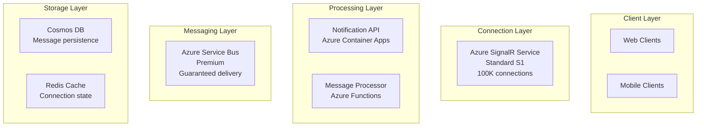

# Executing Agent Tasks and Workflows

**Best for:** Organizations establishing reliable operational processes that streamline task execution, improve workflow visibility, and drive consistent, measurable results across business operations.

This comprehensive guide establishes clear execution pathways for both single-agent tasks and complex multi-agent workflows, designed to reduce execution errors by 50% and improve operational efficiency across teams.

## Overview

### Understanding Agent Task Execution

Agent Studio provides two primary execution modes:

**1. Single-Agent Task Execution**
- Direct task execution with one agent
- Immediate results for specific needs
- Ideal for ad-hoc requests and simple operations
- Quick feedback loop (30 seconds to 5 minutes)

**2. Multi-Agent Workflow Orchestration**
- Coordinated execution across multiple agents
- Complex operations broken into logical steps
- Built-in error handling and recovery
- Production-grade reliability and observability

### When to Use Each Approach

**Use Single-Agent Tasks When:**
- One-off requests requiring immediate results
- Simple operations within single domain
- Testing agent capabilities
- Quick prototyping or exploration
- No dependencies on other tasks

**Example Single-Agent Tasks:**
```
✓ "Generate API documentation for user endpoint"
✓ "Review this code for security vulnerabilities"
✓ "Design database schema for inventory management"
✓ "Implement password reset API endpoint"
```

**Use Multi-Agent Workflows When:**
- Multiple steps required to complete objective
- Tasks have dependencies (output of one feeds next)
- Quality gates and validation needed
- Consistent, repeatable processes
- Production-grade reliability required

**Example Workflows:**
```
✓ Feature Development: Architect → Builder → Validator → Scribe
✓ Code Review Pipeline: Validator → Builder (fixes) → Validator (re-review)
✓ Architecture Evolution: Architect → Validator → Architect (refine) → Scribe
✓ Security Audit: Validator (scan) → Builder (fix) → Validator (verify) → Scribe (report)
```

### Target Audience

**End Users:** Execute tasks and monitor results
**Operators:** Manage workflow execution and troubleshoot issues
**Team Leads:** Design workflows and optimize processes

---

## Single-Agent Task Execution

Execute individual tasks directly from the Agent Studio interface or via API.

### Step 1: Select an Agent

Navigate to the agent you want to use:

**Via Dashboard:**
1. Log in to Agent Studio
2. Click **"Agents"** in left sidebar
3. Browse available agents or use search
4. View agent details:
   - Agent type and description
   - Recent performance metrics
   - Example use cases
   - Team ownership

**Search and Filter:**
```
Search: "payment" → Shows payment-related agents
Filter by:
- Agent Type: Architect, Builder, Validator, Scribe
- Team: Your team, shared, all
- Environment: Development, Staging, Production
- Status: Active, Deprecated
```

**Agent Selection Tips:**

**For Architecture Tasks:**
- Use Architect agents
- Check agent description matches your domain (e.g., "microservices", "data architecture")
- Verify agent uses appropriate model (GPT-4 recommended for complex architecture)

**For Code Generation:**
- Use Builder agents
- Match technology stack (Python, TypeScript, etc.)
- Check if agent specializes in your framework (FastAPI, React, etc.)

**For Quality Assurance:**
- Use Validator agents
- Confirm agent covers your validation type (security, performance, etc.)
- Verify agent provides actionable feedback

**For Documentation:**
- Use Scribe agents
- Check output format capability (OpenAPI, Markdown, etc.)
- Ensure agent understands your target audience

---

### Step 2: Configure Task Parameters

Click **"Execute Task"** button to open task configuration form.

#### Required Parameters

**Task Description:**

Clear, specific description of what you need the agent to accomplish.

**Best Practices:**

**Be Specific:**
❌ Vague: "Design authentication"
✅ Specific: "Design OAuth2 authentication system with JWT tokens for a multi-tenant SaaS application handling 50K users"

**Include Context:**
❌ Minimal: "Generate user API"
✅ Contextual: "Generate REST API for user management (CRUD operations) using Python FastAPI with SQLAlchemy, including email validation and password hashing with bcrypt"

**Specify Scope:**
❌ Unbounded: "Build payment system"
✅ Scoped: "Implement Stripe payment intent creation endpoint with webhook handling for successful payments and failures"

**Define Expected Output:**
❌ Unclear: "Give me documentation"
✅ Clear: "Generate OpenAPI 3.0 specification with request/response examples, authentication details, and error codes for all user management endpoints"

---

**Task Description Templates:**

**For Architect Agents:**
```
Design [system/component] for [use case] that handles [scale/volume].

Requirements:
- [Key requirement 1]
- [Key requirement 2]
- [Key requirement 3]

Constraints:
- Technology: [Tech stack]
- Budget: [Budget level]
- Timeline: [Timeline]

Expected output: Architecture diagram, component breakdown, technology recommendations
```

**Example:**
```
Design a real-time notification system for a collaborative workspace application
that handles 100K concurrent connections.

Requirements:
- Push notifications to web and mobile clients
- Guaranteed delivery with persistence
- Message ordering per user
- Support for broadcast and targeted messages

Constraints:
- Technology: Azure (SignalR, Service Bus, Cosmos DB)
- Budget: Moderate ($2K-5K monthly)
- Timeline: 3 weeks for MVP

Expected output: Architecture diagram, component breakdown, scalability analysis
```

---

**For Builder Agents:**
```
Implement [feature/component] using [technology/framework].

Functional Requirements:
- [Requirement 1]
- [Requirement 2]
- [Requirement 3]

Technical Requirements:
- Language: [Language/version]
- Framework: [Framework/version]
- Dependencies: [Key dependencies]
- Error Handling: [Error handling approach]
- Testing: [Test coverage expectation]

Expected output: Complete implementation with tests and usage example
```

**Example:**
```
Implement user registration API endpoint using Python FastAPI.

Functional Requirements:
- Accept email and password
- Validate email format
- Hash password with bcrypt (12 rounds)
- Store user in PostgreSQL database
- Return JWT token upon successful registration
- Send verification email

Technical Requirements:
- Language: Python 3.11+
- Framework: FastAPI with Pydantic v2
- Dependencies: SQLAlchemy 2.0, bcrypt, python-jose for JWT
- Error Handling: Return 400 for validation errors, 409 for duplicate email
- Testing: Unit tests with pytest covering happy path and edge cases

Expected output: Complete endpoint implementation, Pydantic models, unit tests, usage example
```

---

**For Validator Agents:**
```
Review [code/implementation/design] for [validation type].

Focus Areas:
- [Area 1]
- [Area 2]
- [Area 3]

Severity Priorities:
1. [Critical issues]
2. [High priority issues]
3. [Medium priority issues]

Expected output: Issues by severity with specific fixes, approval recommendation
```

**Example:**
```
Review the attached authentication implementation for security vulnerabilities.

Focus Areas:
- SQL injection vulnerabilities
- Cross-site scripting (XSS)
- Password security (hashing, storage)
- Session management (JWT expiration, refresh tokens)
- Input validation and sanitization
- Rate limiting for login attempts

Severity Priorities:
1. Critical: Vulnerabilities allowing unauthorized access or data breach
2. High: Security weaknesses requiring immediate fix
3. Medium: Best practice violations with moderate risk

Expected output: Categorized issues with code examples of fixes, security score, approval status
```

---

**For Scribe Agents:**
```
Generate [documentation type] for [system/component].

Target Audience: [Audience level and role]

Required Sections:
- [Section 1]
- [Section 2]
- [Section 3]

Format: [Output format]
Examples: [Include/exclude examples]

Expected output: Complete documentation ready for publication
```

**Example:**
```
Generate comprehensive API documentation for user management endpoints.

Target Audience: External developers integrating with our API (intermediate level)

Required Sections:
- Overview and authentication
- Endpoint reference (all CRUD operations)
- Request/response schemas with examples
- Error codes and troubleshooting
- Rate limiting and pagination
- Code examples in curl, Python, JavaScript

Format: OpenAPI 3.0 specification + Markdown guide
Examples: Include full request/response examples for each endpoint

Expected output: OpenAPI spec file + comprehensive API guide ready for developer portal
```

---

#### Optional Parameters

**Context (Object):**

Additional structured information the agent needs for better results.

```json
{
  "context": {
    "scale": "1M requests/day",
    "existingStack": {
      "backend": "Python FastAPI",
      "database": "PostgreSQL 15",
      "cache": "Redis 7",
      "cloud": "Azure"
    },
    "teamSize": 5,
    "timeline": "2 weeks",
    "securityRequirements": ["SOC2", "GDPR"],
    "performanceTargets": {
      "p95Latency": "200ms",
      "availability": "99.9%"
    }
  }
}
```

**Common Context Fields by Agent Type:**

**Architect Agents:**
- `scale`: Expected load/volume
- `existingStack`: Current technology
- `constraints`: Budget, timeline, technology restrictions
- `requirements`: Functional and non-functional requirements

**Builder Agents:**
- `language`: Programming language and version
- `framework`: Framework and version
- `dependencies`: Required libraries
- `testingFramework`: Testing library to use

**Validator Agents:**
- `validationType`: Security, performance, quality, compliance
- `standards`: Coding standards or compliance frameworks
- `severityThreshold`: Minimum severity to report

**Scribe Agents:**
- `audience`: Target reader (developer, end-user, operator)
- `format`: Output format (OpenAPI, Markdown, PDF)
- `includeExamples`: Boolean for code examples
- `depth`: Comprehensive vs. quick reference

---

**Priority (Enum):**

Execution priority when system is under load.

- `Low`: Non-urgent tasks, batch processing
- `Normal`: Standard priority (default)
- `High`: Time-sensitive tasks
- `Critical`: Urgent, business-critical tasks

**When to Set High/Critical Priority:**
- Production incidents requiring immediate response
- Customer-blocking issues
- Time-sensitive business operations
- SLA-driven requirements

**Note:** Overusing high priority reduces its effectiveness. Most tasks should be Normal.

---

**Max Iterations (Integer):**

For iterative workflows where agent refines output based on validation.

- Default: 1 (single execution)
- Range: 1-10
- Use Cases: Quality improvement loops, refinement based on feedback

**Example:**
```json
{
  "maxIterations": 3,
  "iterationStrategy": "improve_until_valid",
  "validationCriteria": {
    "minQualityScore": 0.85,
    "requiredSections": ["architecture", "components", "scalability"]
  }
}
```

---

**Timeout (Integer):**

Override agent's default timeout for this specific task.

- Unit: Seconds
- Agent Default: Usually 120 seconds
- Use When: Task is exceptionally complex or time-sensitive

```json
{
  "timeoutSeconds": 300  // 5 minutes for complex architecture
}
```

---

**Output Format (Enum):**

Preferred output format.

- `markdown`: Formatted Markdown (default)
- `json`: Structured JSON response
- `plaintext`: Plain text without formatting
- `code`: Code-only output (for Builder agents)

**Example:**
```json
{
  "outputFormat": "json",
  "jsonSchema": {
    "architecture": "object",
    "components": "array",
    "recommendations": "array"
  }
}
```

---

### Step 3: Execute and Monitor

Click **"Execute"** button to start task execution.

#### Real-Time Monitoring

**What You'll See:**

**1. Execution Status Banner**
```
Status: Running
Agent: architect-agent-prod
Started: 2025-10-09 14:35:22
Elapsed: 00:00:45
Estimated Remaining: 00:01:15
Progress: 35%
```

**2. Agent Thoughts Stream**

Real-time stream of agent's reasoning process:

```
[00:00:03] Received task: Design notification system for 100K concurrent users...
[00:00:08] Analyzing requirements: real-time push, guaranteed delivery, ordering...
[00:00:15] Evaluating technology options: Azure SignalR vs self-hosted...
[00:00:22] Decision: Azure SignalR Service + Service Bus for reliability...
[00:00:30] Designing architecture: Connection manager, message broker, persistence...
[00:00:38] Creating component diagram...
[00:00:45] Analyzing scalability: Connection distribution, Redis backplane...
[00:00:52] Documenting component interactions and data flow...
[00:01:05] Calculating cost estimates based on 100K connections...
[00:01:18] Finalizing architecture documentation...
[00:01:25] Complete - generating final output...
```

**Why This Matters:**
- Understand what agent is working on
- Identify if agent is on right track
- Spot issues early (e.g., wrong technology choice)
- Learn agent's reasoning process

---

**3. Progress Indicator**

Visual progress bar with phases:

```
Phase 1: Understanding Requirements    [████████████████████] 100%
Phase 2: Analyzing Options             [████████████████████] 100%
Phase 3: Designing Architecture        [███████████████-----]  75%
Phase 4: Documentation                 [---------------------]   0%

Overall Progress: 68%
```

---

**4. Resource Usage**

Real-time metrics:

```
Token Usage:
  Input Tokens:  1,250 tokens
  Output Tokens: 2,890 tokens
  Total:         4,140 tokens

Cost Estimate: $0.09

Model: GPT-4-Turbo
Rate Limit: 25% of quota used
```

**Monitoring Tips:**

**Watch for High Token Usage:**
- If tokens approaching max limit, output may be truncated
- Agent may timeout if processing is slow
- Cost may exceed expectations

**Rate Limit Warnings:**
- If >80% quota used, tasks may start queuing
- Consider spacing out task submissions
- Check for concurrent executions

---

**5. Status Notifications**

System messages during execution:

```
ℹ️ Info: Using GPT-4-Turbo model (gpt-4-turbo-2024-04-09)
⚠️ Warning: Token usage at 75% of limit - response may be truncated
ℹ️ Info: Streaming enabled - receiving results in real-time
✅ Success: Task completed successfully in 87 seconds
```

Error notifications if issues occur:

```
❌ Error: Rate limit exceeded - retrying in 5 seconds... (Attempt 1/3)
⚠️ Warning: Execution time exceeded 60 seconds - task still running
❌ Error: Task failed after 3 retry attempts - see logs for details
```

---

#### Pausing and Canceling

**Pause Execution:**
- Click **"Pause"** button during execution
- Agent completes current operation and pauses
- State saved for resume
- Use when: Need to make adjustments, review partial results

**Resume Execution:**
- Click **"Resume"** button on paused task
- Continues from last checkpoint
- Previous progress preserved

**Cancel Execution:**
- Click **"Cancel"** button
- Agent stops immediately
- Partial results preserved
- Use when: Wrong task, agent stuck, need to restart

---

### Step 4: Review Results

Once execution completes, comprehensive results appear.

#### Final Output Panel

**Primary Output:**

The agent's complete response in requested format:

```markdown
# Notification System Architecture

## Executive Summary
This architecture establishes a scalable real-time notification system
capable of handling 100K concurrent connections with guaranteed delivery
and message ordering...

## Architecture Diagram


## Component Breakdown

### 1. Azure SignalR Service
- **Purpose**: Manage WebSocket connections at scale
- **Configuration**: Standard S1 tier (100K connections)
...

[Complete architecture continues]
```

---

**Output Actions:**

**Download:**
- Click **"Download"** dropdown
- Formats: Markdown, JSON, Plain Text, PDF (Premium)
- Includes metadata (execution time, tokens, cost)

**Copy:**
- Click **"Copy to Clipboard"** for quick paste
- Preserves formatting

**Share:**
- Click **"Share"** button
- Generate shareable link (requires login)
- Set permissions: View only, Clone, Edit

**Export:**
- Export to workspace for team access
- Push to external tools (Jira, Azure DevOps, Confluence)
- Webhook integration for automated workflows

---

#### Execution Metrics

**Performance Metrics:**

```
Execution Summary:
  Status:           ✅ Completed Successfully
  Execution Time:   87 seconds
  Start Time:       2025-10-09 14:35:22 UTC
  End Time:         2025-10-09 14:36:49 UTC

Token Usage:
  Input Tokens:     1,250
  Output Tokens:    4,890
  Total Tokens:     6,140

Cost:
  Input Cost:       $0.0125 ($0.01 per 1K tokens)
  Output Cost:      $0.1467 ($0.03 per 1K tokens)
  Total Cost:       $0.16

Model:
  Deployment:       gpt-4-turbo
  Version:          2024-04-09
  Temperature:      0.7
  Max Tokens:       8000
```

---

**Quality Indicators:**

```
Output Quality Metrics:
  Completeness:     ✅ 100% (all required sections present)
  Format Compliance: ✅ 100% (matches expected format)
  Token Efficiency:  ✅ 77% (used 6,140 of 8,000 max)

Agent Behavior:
  Retries:          0 (completed first attempt)
  Rate Limited:     No
  Warnings:         0
```

---

#### Execution Logs

**Detailed Logs:**

Click **"View Detailed Logs"** to see complete execution trace:

```
[2025-10-09 14:35:22.103] INFO: Task execution started
[2025-10-09 14:35:22.156] INFO: Agent: architect-agent-prod (v2.1.0)
[2025-10-09 14:35:22.201] INFO: Model: gpt-4-turbo-2024-04-09
[2025-10-09 14:35:22.245] DEBUG: System prompt loaded (420 tokens)
[2025-10-09 14:35:22.289] DEBUG: User task received (1,250 tokens)
[2025-10-09 14:35:22.334] INFO: Sending request to Azure OpenAI...
[2025-10-09 14:35:23.567] INFO: Response streaming started
[2025-10-09 14:35:45.123] DEBUG: Generated 2,000 tokens (streaming)
[2025-10-09 14:36:12.456] DEBUG: Generated 4,000 tokens (streaming)
[2025-10-09 14:36:48.789] INFO: Response streaming completed
[2025-10-09 14:36:48.834] INFO: Total tokens: 6,140 (input: 1,250, output: 4,890)
[2025-10-09 14:36:48.901] INFO: Post-processing output...
[2025-10-09 14:36:49.012] INFO: Saving execution results to Cosmos DB...
[2025-10-09 14:36:49.156] INFO: Task execution completed successfully
[2025-10-09 14:36:49.201] INFO: Execution time: 87.098 seconds
```

**Log Filtering:**
- Filter by level: DEBUG, INFO, WARNING, ERROR
- Search logs by keyword
- Export logs for debugging

---

#### History and Analytics

**Execution History:**

View all past executions of this agent:

Navigate to: Agent Details → **"Execution History"** tab

```
| ID       | Task Summary                    | Status | Duration | Tokens | Cost   | Date/Time        |
|----------|---------------------------------|--------|----------|--------|--------|------------------|
| exec-342 | Design notification system      | ✅ Done | 87s     | 6,140  | $0.16  | Oct 9, 14:35    |
| exec-341 | Design payment gateway          | ✅ Done | 104s    | 7,230  | $0.19  | Oct 9, 13:22    |
| exec-340 | Design user authentication      | ❌ Fail | 120s    | 2,100  | $0.05  | Oct 9, 12:15    |
| exec-339 | Design inventory architecture   | ✅ Done | 76s     | 5,450  | $0.14  | Oct 9, 11:05    |
```

**Filters:**
- Status: Completed, Failed, Canceled
- Date Range: Today, Last 7 days, Last 30 days, Custom
- Cost Range: Under $0.10, $0.10-$0.50, Over $0.50
- Duration: Fast (<60s), Medium (60-120s), Slow (>120s)

**Actions:**
- Click row to view full details
- Compare multiple executions
- Clone configuration for re-execution
- Export history to CSV

---

**Performance Analytics:**

View agent performance trends:

Navigate to: Agent Details → **"Analytics"** tab

**Charts:**

1. **Success Rate Over Time**
   - Line chart showing percentage of successful executions
   - Goal line at 95%
   - Alerts when below threshold

2. **Average Execution Time**
   - Bar chart by day/week/month
   - Identify performance degradation trends

3. **Token Usage Patterns**
   - Stacked area chart (input vs output tokens)
   - Spot token usage anomalies

4. **Cost Analysis**
   - Daily/weekly/monthly cost trends
   - Cost per execution average
   - Budget tracking against limits

5. **Error Distribution**
   - Pie chart of error types
   - Identify recurring issues

---

### Downloading and Sharing Results

#### Download Options

**Download Formats:**

**1. Markdown (.md)**
```markdown
# Notification System Architecture
**Generated by**: architect-agent-prod v2.1.0
**Execution ID**: exec-342
**Date**: 2025-10-09 14:36:49 UTC
**Cost**: $0.16

---

[Agent output continues...]

---

## Execution Metadata
- **Execution Time**: 87 seconds
- **Tokens Used**: 6,140 (input: 1,250, output: 4,890)
- **Model**: gpt-4-turbo-2024-04-09
```

**2. JSON (.json)**
```json
{
  "executionId": "exec-342",
  "agentId": "architect-agent-prod",
  "agentVersion": "2.1.0",
  "status": "completed",
  "startTime": "2025-10-09T14:35:22.103Z",
  "endTime": "2025-10-09T14:36:49.201Z",
  "durationSeconds": 87.098,
  "task": {
    "description": "Design a real-time notification system...",
    "context": {...}
  },
  "output": {
    "content": "# Notification System Architecture\n\n...",
    "format": "markdown"
  },
  "metrics": {
    "tokens": {
      "input": 1250,
      "output": 4890,
      "total": 6140
    },
    "cost": {
      "input": 0.0125,
      "output": 0.1467,
      "total": 0.1592
    }
  },
  "model": {
    "deployment": "gpt-4-turbo",
    "version": "2024-04-09",
    "parameters": {
      "temperature": 0.7,
      "maxTokens": 8000
    }
  }
}
```

**3. Plain Text (.txt)**
```
NOTIFICATION SYSTEM ARCHITECTURE
Generated by: architect-agent-prod v2.1.0
Execution ID: exec-342
Date: 2025-10-09 14:36:49 UTC

[Plain text output without markdown formatting]
```

**4. PDF (.pdf)** [Premium Feature]
- Professional document formatting
- Includes diagrams and charts
- Company branding (customizable)
- Page numbers and table of contents

---

#### Sharing Options

**1. Generate Shareable Link**

Click **"Share"** → **"Generate Link"**

```
Share Settings:
  Link expiration: [7 days ▼]
  Access level:    [View only ▼]
  Require login:   [✓] Yes [ ] No

Generated Link:
https://agentstudio.com/executions/exec-342/share/aB3cD4eF5g

[Copy Link]  [Send Email]
```

**Access Levels:**
- **View Only**: Can view output and metrics, cannot re-execute
- **Clone**: Can view and duplicate configuration for own use
- **Full Access**: Can view, clone, and re-execute with same agent

---

**2. Email Sharing**

Click **"Share"** → **"Email"**

```
Send Execution Results

To: [email addresses, comma-separated]
Subject: [Notification System Architecture - Agent Execution Results]
Message:
┌────────────────────────────────────────────┐
│ Hi team,                                   │
│                                            │
│ I've completed the notification system    │
│ architecture design using our architect    │
│ agent. Please review and provide feedback.│
│                                            │
│ Key highlights:                            │
│ - Azure SignalR for 100K connections     │
│ - Service Bus for guaranteed delivery     │
│ - Cosmos DB for message persistence       │
│                                            │
│ Execution cost: $0.16                     │
│ Time: 87 seconds                          │
└────────────────────────────────────────────┘

Attachments:
☑ Output (Markdown)
☑ Execution Summary (PDF)
☐ Detailed Logs

[Cancel]  [Send Email]
```

---

**3. Workspace Export**

Save to shared team workspace:

Click **"Share"** → **"Export to Workspace"**

```
Export to Workspace

Workspace: [Engineering Team ▼]
Folder:    [/Architecture/Designs]
Name:      [Notification System Architecture]

Tags: [notification, signalr, architecture]

Permissions:
  ○ Inherit from folder
  ● Custom permissions:
    - Engineering Team: Read/Write
    - Product Team: Read
    - External: No Access

[Cancel]  [Export]
```

Benefits:
- Centralized knowledge repository
- Version history tracking
- Team collaboration features
- Full-text search across all exports

---

**4. External Tool Integration**

Push results directly to external systems:

**Jira Integration:**
```
Create Jira Ticket

Project:     [Agent Studio ▼]
Issue Type:  [Story ▼]
Summary:     [Implement Notification System Architecture]
Description: [Auto-populated with agent output]

Assignee:    [Unassigned ▼]
Sprint:      [Sprint 23 ▼]

Custom Fields:
  Architecture Review: Required
  Estimated Story Points: [Auto-calculated: 13]

[Cancel]  [Create Ticket]
```

**Azure DevOps:**
- Create Work Item with agent output
- Attach execution results as work item attachment
- Link to related work items

**Confluence:**
- Create page in specified space
- Auto-format agent output
- Tag with relevant labels

**GitHub:**
- Create issue or discussion
- Attach execution results
- Tag team members for review

**Slack/Teams:**
- Post to channel with formatting
- Include execution metrics
- @mention relevant team members

---

## Multi-Agent Workflows

Orchestrate multiple agents to accomplish complex objectives.

### Understanding Workflow Patterns

Agent Studio supports four primary workflow patterns:

#### 1. Sequential Workflows

**Description:**
Tasks execute one after another in defined order. Each task receives output from previous task.

**Visualization:**
```
Step 1: Architect → Step 2: Builder → Step 3: Validator → Step 4: Scribe
```

**Best For:**
- Linear processes with clear dependencies
- Each step builds on previous step's output
- Waterfall-style development
- Predictable, repeatable processes

**Example Use Case: Feature Development**
```yaml
Workflow: "Payment Integration Feature"
Pattern: Sequential

Step 1: Architect Agent
  Task: "Design Stripe payment integration architecture"
  Output: architecture, components, API contracts

Step 2: Builder Agent
  Task: "Implement payment API based on architecture"
  Input: architecture from Step 1
  Output: source code, tests

Step 3: Validator Agent
  Task: "Security review of payment implementation"
  Input: code from Step 2
  Output: security report, issues

Step 4: Scribe Agent
  Task: "Generate API documentation"
  Input: code from Step 2
  Output: OpenAPI spec, integration guide
```

**Benefits:**
- Simple to understand and debug
- Clear audit trail
- Easy to add checkpoints
- Natural error isolation

**When Not to Use:**
- Independent tasks that can run in parallel
- Tasks with no dependencies
- Need for maximum speed

---

#### 2. Parallel Workflows

**Description:**
Tasks execute simultaneously, with optional dependency management.

**Visualization:**
```
                    ┌─→ Task A (Builder: API)
                    │
Start ──────────────┼─→ Task B (Builder: UI)  ───→ Merge ──→ Task D (Validator)
                    │
                    └─→ Task C (Builder: DB)
```

**Best For:**
- Independent tasks with no dependencies
- Maximizing execution speed
- Resource-intensive operations
- Tasks that can safely run concurrently

**Example Use Case: Multi-Component Development**
```yaml
Workflow: "Full-Stack Feature Development"
Pattern: Parallel (with merge step)

Parallel Phase:
  Step 1a: Builder Agent (Backend)
    Task: "Implement REST API endpoints"

  Step 1b: Builder Agent (Frontend)
    Task: "Implement React UI components"

  Step 1c: Builder Agent (Database)
    Task: "Create database migration scripts"

Merge Step:
  Wait for: All parallel steps complete

Step 2: Validator Agent
  Task: "Integration testing across all components"
  Input: Outputs from 1a, 1b, 1c

Step 3: Scribe Agent
  Task: "Generate comprehensive documentation"
  Input: All component implementations
```

**Benefits:**
- Fast execution (parallel processing)
- Efficient resource utilization
- Independent error handling per branch
- Scales well with more tasks

**When Not to Use:**
- Tasks have strict dependencies
- Output of one feeds input of another
- Shared resources (risk of conflicts)
- Sequential approval gates required

---

#### 3. Iterative Workflows

**Description:**
Task repeats until validation passes or max iterations reached. Validator provides feedback for improvement.

**Visualization:**
```
Start → Architect → Validator → Pass? → Yes → Complete
                        ↓
                        No (feedback)
                        ↓
                      Architect (refine) → [loop back to Validator]
```

**Best For:**
- Quality-driven outputs
- Refinement based on feedback
- Continuous improvement
- Meeting strict acceptance criteria

**Example Use Case: Architecture Refinement**
```yaml
Workflow: "Production-Ready Architecture Design"
Pattern: Iterative
Max Iterations: 3

Step 1: Architect Agent
  Task: "Design microservices architecture for e-commerce platform"
  Initial Attempt: true

Step 2: Validator Agent
  Task: "Validate architecture against production requirements"
  Validation Criteria:
    - Security: OWASP compliance
    - Scalability: Handles 10M requests/day
    - Cost: Under $20K monthly
    - Reliability: 99.9% uptime capability

  If validation fails:
    - Extract specific issues
    - Generate improvement suggestions
    - Feed back to Architect Agent (Step 1)

  If validation passes:
    - Proceed to Step 3

Step 3: Scribe Agent
  Task: "Document approved architecture"
  Input: Validated architecture from final iteration
```

**Iteration Example:**

**Iteration 1:**
- Architect designs architecture
- Validator finds: "No disaster recovery plan, single point of failure in database"
- Status: FAIL
- Feedback to Architect: "Add multi-region deployment, database replication"

**Iteration 2:**
- Architect refines with DR and replication
- Validator finds: "Cost estimate exceeds $20K budget"
- Status: FAIL
- Feedback to Architect: "Optimize database tier, use serverless compute"

**Iteration 3:**
- Architect optimizes for cost
- Validator confirms: All criteria met
- Status: PASS
- Proceed to documentation

**Benefits:**
- Higher quality outputs
- Built-in quality gates
- Automatic refinement
- Reduces manual review cycles

**When Not to Use:**
- Simple tasks not requiring iteration
- Strict time constraints
- Deterministic outputs (no improvement needed)
- High cost sensitivity (more iterations = higher cost)

---

#### 4. Dynamic Workflows

**Description:**
Execution path determined at runtime based on agent outputs. Supports conditional branching and dynamic agent handoffs.

**Visualization:**
```
Start → Architect → Decision Point → Complex?
                                       ↓ Yes        ↓ No
                                    Builder A   Builder B
                                       ↓              ↓
                                    Validator ← ←──────
                                       ↓
                                    Complete
```

**Best For:**
- Unpredictable execution paths
- Conditional logic based on agent outputs
- Adaptive workflows
- Complex decision trees

**Example Use Case: Adaptive Development**
```yaml
Workflow: "Smart Feature Development"
Pattern: Dynamic

Step 1: Architect Agent
  Task: "Analyze feature requirements and recommend approach"
  Output:
    complexity: "high" | "medium" | "low"
    recommended_approach: "microservices" | "monolithic" | "serverless"

Step 2: Decision Node
  Condition: architecture.complexity

  If "high":
    Route to: Specialist Builder Agent
    Additional Validation: Required

  If "medium":
    Route to: Standard Builder Agent
    Additional Validation: Standard

  If "low":
    Route to: Fast Builder Agent (GPT-3.5-Turbo)
    Additional Validation: Optional

Step 3: Builder Agent (Selected dynamically)
  Task: Implementation based on architecture

Step 4: Conditional Validation
  If complexity == "high":
    Run: Security Validator + Performance Validator + Code Quality Validator
  Else:
    Run: Standard Validator

Step 5: Scribe Agent
  Task: Generate documentation
  Detail Level: Based on complexity
```

**Dynamic Agent Handoff Example:**

**Scenario: Security Issue Detected**
```yaml
Step 1: Standard Builder
  Output: Implementation with potential security issue

Step 2: Validator
  Finds: SQL injection vulnerability (Critical)
  Decision: Hand off to Security Specialist Builder

Step 3: Security Specialist Builder
  Task: "Fix SQL injection vulnerability"
  Input: Original code + vulnerability details
  Output: Secured implementation

Step 4: Validator (Re-check)
  Confirms: Vulnerability fixed
  Proceed to completion
```

**Benefits:**
- Highly flexible and adaptive
- Optimizes path based on actual needs
- Efficient resource utilization
- Handles complex scenarios gracefully

**When Not to Use:**
- Simple, predictable workflows
- Strict process compliance required
- Debugging complexity is a concern
- Team unfamiliar with dynamic patterns

---

### Creating a Workflow

Step-by-step guide to creating your first workflow.

#### Step 1: Navigate to Workflow Designer

1. Click **"Workflows"** in left sidebar
2. Click **"+ Create Workflow"** button
3. Workflow designer interface loads

![Screenshot Placeholder: Workflow Designer with blank canvas]

---

#### Step 2: Configure Workflow Basics

**Workflow Name:**
```
Format: [Purpose]-[Pattern]-[Environment]

Examples:
✅ "feature-development-sequential-prod"
✅ "architecture-review-iterative-shared"
✅ "multi-service-build-parallel-dev"

❌ "workflow1" (not descriptive)
❌ "my-test-workflow-for-trying-things" (too long)
```

**Workflow Description:**
```
Template:
This workflow [accomplishes what objective] by [approach].

Best for: [use cases]

Example:
"This workflow implements complete feature development from architecture
through documentation by orchestrating Architect, Builder, Validator, and
Scribe agents sequentially.

Best for: Production feature development requiring comprehensive quality checks"
```

**Pattern Selection:**
- ○ Sequential (linear, step-by-step)
- ○ Parallel (concurrent execution)
- ○ Iterative (refinement loop)
- ○ Dynamic (conditional branching)

**Environment:**
- Development
- Staging
- Production

**Tags:**
```
Examples: "feature-dev", "architecture", "security", "production"
```

---

#### Step 3: Add Workflow Steps

**For Sequential Workflow:**

Click **"Add Step"** button for each step in sequence.

**Step Configuration:**

```yaml
Step 1: Architecture Design

Step Name: "design-architecture"
Agent: [architect-agent-prod ▼]
Task Template:
  "Design {feature_name} architecture for {scale} scale.

   Requirements:
   - {requirement_1}
   - {requirement_2}
   - {requirement_3}

   Technology: {tech_stack}"

Variables (will be provided at runtime):
  - feature_name: string
  - scale: string
  - requirement_1: string
  - requirement_2: string
  - requirement_3: string
  - tech_stack: string

Output Mapping:
  architecture → Step 2 (input.architecture)
  components → Step 2 (input.components)
  tech_stack → Step 3 (input.tech_stack)

Error Handling:
  On Failure: [Stop Workflow ▼]
  Retry: [3 attempts ▼]
  Timeout: [180 seconds]
```

---

```yaml
Step 2: Implementation

Step Name: "implement-feature"
Agent: [builder-agent-python-prod ▼]
Task Template:
  "Implement {feature_name} based on the provided architecture.

   Architecture: {architecture}
   Components: {components}
   Technology: {tech_stack}

   Include comprehensive error handling and unit tests."

Inputs from Previous Steps:
  ✓ architecture (from Step 1)
  ✓ components (from Step 1)
  ✓ tech_stack (from Step 1)
  ✓ feature_name (from workflow variables)

Output Mapping:
  code → Step 3 (input.code)
  tests → Step 3 (input.tests)

Dependencies:
  ✓ Requires Step 1 to complete successfully

Error Handling:
  On Failure: [Retry then Stop ▼]
  Retry: [2 attempts ▼]
  Timeout: [300 seconds]
```

---

```yaml
Step 3: Validation

Step Name: "validate-implementation"
Agent: [validator-agent-security-prod ▼]
Task Template:
  "Review the implementation for security and quality issues.

   Code: {code}
   Tests: {tests}
   Technology Stack: {tech_stack}

   Focus areas:
   - Security vulnerabilities (OWASP Top 10)
   - Code quality and maintainability
   - Test coverage adequacy
   - Performance considerations"

Inputs from Previous Steps:
  ✓ code (from Step 2)
  ✓ tests (from Step 2)
  ✓ tech_stack (from Step 1)

Output Mapping:
  validation_report → Step 4 (input.validation_report)
  approval_status → Step 4 (input.approval_status)
  issues → Step 4 (input.issues)

Conditional Logic:
  If approval_status == "failed":
    Send notification to team
    Stop workflow with status "Requires Manual Review"
  Else:
    Continue to Step 4

Error Handling:
  On Failure: [Manual Review ▼]
```

---

```yaml
Step 4: Documentation

Step Name: "generate-documentation"
Agent: [scribe-agent-api-docs-prod ▼]
Task Template:
  "Generate comprehensive API documentation for the implementation.

   Code: {code}
   Architecture: {architecture}
   Validation Report: {validation_report}

   Target Audience: External developers
   Format: OpenAPI 3.0 + Markdown guide

   Include:
   - All endpoints with request/response examples
   - Authentication requirements
   - Error codes and troubleshooting
   - Code examples in Python and JavaScript"

Inputs from Previous Steps:
  ✓ code (from Step 2)
  ✓ architecture (from Step 1)
  ✓ validation_report (from Step 3)

Output Mapping:
  openapi_spec → Workflow Output
  markdown_guide → Workflow Output

Final Step: true

Success Actions:
  - Save outputs to workspace
  - Notify team via Slack
  - Create Jira ticket for deployment
```

---

**Visual Workflow Diagram:**

The designer shows visual representation:

```
┌─────────────────┐
│ Start Workflow  │
└────────┬────────┘
         │
         ▼
┌─────────────────┐
│ Step 1:         │
│ Architect Agent │
│ Design Arch.    │
└────────┬────────┘
         │ architecture, components
         ▼
┌─────────────────┐
│ Step 2:         │
│ Builder Agent   │
│ Implement       │
└────────┬────────┘
         │ code, tests
         ▼
┌─────────────────┐
│ Step 3:         │
│ Validator Agent │
│ Security Review │
└────────┬────────┘
         │ validation_report
         │ approval? ◄─── Conditional
         ▼
┌─────────────────┐
│ Step 4:         │
│ Scribe Agent    │
│ Documentation   │
└────────┬────────┘
         │
         ▼
┌─────────────────┐
│ Complete        │
└─────────────────┘
```

---

#### Step 4: Configure Error Handling

**Global Workflow Settings:**

```yaml
Error Handling Strategy:

Retry Policy:
  Max Retries: [3 ▼]
  Retry Delay: [5 seconds ▼]
  Exponential Backoff: [✓] Enabled

Checkpoint Strategy:
  Frequency: [After Each Step ▼]
  Auto-Save: [✓] Enabled
  Retention: [30 days]

Failure Actions:
  On Step Failure:
    ● Stop Workflow
    ○ Continue to Next Step
    ○ Execute Fallback Step

  Notification:
    [✓] Email workflow owner
    [✓] Post to Slack channel: #agent-studio-alerts
    [ ] Create Jira ticket

Recovery Options:
  [✓] Allow manual retry from failed step
  [✓] Allow manual intervention (pause and resume)
  [ ] Automatic rollback on failure
```

---

**Step-Level Error Handling:**

Each step can override global settings:

```yaml
Step 2: Implementation

  Error Handling (Override):
    Max Retries: 5  (override global 3)

    On Failure:
      If retry_count < 3:
        Retry with same inputs
      Else:
        Hand off to Senior Builder Agent

    Timeout: 300 seconds

    Timeout Action:
      Send intermediate results
      Mark step as "Partial Success"
      Allow manual completion
```

---

#### Step 5: Test Workflow

Before saving, test your workflow with sample data.

**Test Configuration:**

Click **"Test Workflow"** button

```yaml
Test Workflow: feature-development-sequential-prod

Test Inputs:
  feature_name: "User Profile Management API"
  scale: "1M requests/day"
  requirement_1: "CRUD operations for user profiles"
  requirement_2: "Avatar upload with image processing"
  requirement_3: "Privacy controls (public/private profiles)"
  tech_stack: "Python FastAPI, PostgreSQL, Redis, Azure Storage"

Test Mode:
  ○ Full Execution (runs all steps, uses API credits)
  ● Dry Run (simulates execution, no API calls, free)
  ○ Partial Run (execute specific steps only)

[Cancel] [Run Test]
```

---

**Dry Run Results:**

```
Workflow Test Results
Status: ✅ Dry Run Successful

Step 1: design-architecture
  Status: ✅ Valid Configuration
  Agent: architect-agent-prod (available)
  Estimated Time: 60-90 seconds
  Estimated Cost: $0.12
  Inputs: All required variables provided
  Outputs: architecture, components, tech_stack → Step 2

Step 2: implement-feature
  Status: ✅ Valid Configuration
  Agent: builder-agent-python-prod (available)
  Estimated Time: 120-180 seconds
  Estimated Cost: $0.18
  Inputs: ✓ All inputs mapped correctly from Step 1
  Outputs: code, tests → Step 3

Step 3: validate-implementation
  Status: ✅ Valid Configuration
  Agent: validator-agent-security-prod (available)
  Estimated Time: 90-120 seconds
  Estimated Cost: $0.15
  Inputs: ✓ All inputs mapped correctly from Steps 1-2
  Conditional: ✓ Approval logic configured
  Outputs: validation_report, approval_status → Step 4

Step 4: generate-documentation
  Status: ✅ Valid Configuration
  Agent: scribe-agent-api-docs-prod (available)
  Estimated Time: 100-140 seconds
  Estimated Cost: $0.16
  Inputs: ✓ All inputs mapped correctly
  Final Step: true

Workflow Summary:
  Total Steps: 4
  Estimated Total Time: 6-10 minutes
  Estimated Total Cost: $0.61
  Configuration: ✅ Valid
  Dependencies: ✅ All resolved
  Error Handling: ✅ Configured

Ready to Save: ✅ Yes

[Save Workflow] [Run Full Test] [Close]
```

---

**Full Test Execution:**

If you run full test (uses API credits):

```
Executing Test Workflow...

Step 1: design-architecture
  Status: ⏳ Running (elapsed: 45s)
  Agent Thoughts:
    [00:05] Analyzing requirements for User Profile Management API...
    [00:12] Identifying components: API layer, storage, caching, image processing...
    [00:25] Designing architecture with FastAPI, PostgreSQL, Redis...
    [00:38] Creating component diagram...
    [00:45] Finalizing architecture document...

Step 1: design-architecture
  Status: ✅ Completed (87s)
  Cost: $0.13
  Output Preview:
    ┌────────────────────────────────────────┐
    │ # User Profile API Architecture        │
    │                                        │
    │ ## Components                          │
    │ 1. FastAPI Application (4 endpoints)   │
    │ 2. PostgreSQL Database (user table)    │
    │ 3. Redis Cache (profile cache)         │
    │ 4. Azure Blob Storage (avatars)        │
    │ ...                                    │
    └────────────────────────────────────────┘

Step 2: implement-feature
  Status: ⏳ Running (elapsed: 102s)
  ...

[Continue test execution through all steps]

Test Complete: ✅ Success
Total Time: 8m 23s
Total Cost: $0.64
All Steps: Passed

Workflow is ready for production use!

[Save Workflow] [View Full Output] [Close]
```

---

#### Step 6: Save and Deploy Workflow

**Save Workflow:**

Click **"Save Workflow"** button

```
Save Workflow

Name: feature-development-sequential-prod
Pattern: Sequential
Environment: Production
Version: 1.0.0

This workflow will be available to:
  ✓ Your team members
  ✓ Organization-wide (shared workflow)

Permissions:
  Execute: All team members
  Modify: Workflow owners only
  Delete: Admin only

[Cancel] [Save Workflow]
```

**Workflow Saved Successfully:**

```
✅ Workflow Created Successfully

Workflow: feature-development-sequential-prod
Workflow ID: wf-12345-abcde
Status: Active
Version: 1.0.0

Actions:
  [Execute Workflow] [Share] [View Details] [Clone]

Next Steps:
  1. Execute workflow with real inputs
  2. Monitor execution in dashboard
  3. Review results and optimize
  4. Share with team
```

---

### Executing a Workflow

Run your saved workflow with actual inputs.

#### Step 1: Navigate to Workflow

1. Go to **"Workflows"** page
2. Find your workflow in list
3. Click **"Execute"** button

#### Step 2: Provide Runtime Inputs

```yaml
Execute Workflow: feature-development-sequential-prod

Required Inputs:

Feature Name: [User Avatar Upload System________________]

Scale: [500K requests/day__________________________]

Requirements:
  Requirement 1: [Upload images up to 5MB_________]
  Requirement 2: [Automatic image resizing (3 sizes)]
  Requirement 3: [Secure storage with CDN delivery]

Technology Stack: [Python FastAPI, Azure Blob Storage, PIL, Redis]

Optional Inputs:

Priority: [Normal ▼]

Notifications:
  [✓] Email on completion
  [✓] Slack notification: #engineering-team
  [ ] Create Jira ticket

Execution Options:
  [ ] Pause before each step (manual approval)
  [✓] Continue on warnings
  [ ] Verbose logging (debug mode)

Estimated Cost: $0.65
Estimated Time: 8-12 minutes

[Cancel] [Execute Workflow]
```

---

#### Step 3: Monitor Workflow Execution

**Workflow Dashboard:**

Real-time visualization of workflow progress:

```
Workflow Execution: wf-exec-87654

Overall Status: ⏳ Running
Started: 2025-10-09 15:30:00
Elapsed: 00:03:45
Progress: 25% (Step 1 of 4 complete)

┌─────────────────┐
│ Step 1          │  ✅ Completed (87s, $0.13)
│ Architect       │
└────────┬────────┘
         ▼
┌─────────────────┐
│ Step 2          │  ⏳ Running (105s so far...)
│ Builder         │     "Implementing upload endpoint..."
└────────┬────────┘
         ▼
┌─────────────────┐
│ Step 3          │  ⏸️ Pending
│ Validator       │
└────────┬────────┘
         ▼
┌─────────────────┐
│ Step 4          │  ⏸️ Pending
│ Scribe          │
└─────────────────┘

Current Step Details:
  Step 2: implement-feature
  Agent: builder-agent-python-prod
  Status: Running
  Elapsed: 105 seconds
  Agent Thoughts:
    [00:15] Analyzing architecture for avatar upload implementation...
    [00:28] Designing FastAPI endpoint structure...
    [00:45] Implementing file upload handling with validation...
    [00:67] Adding image processing with PIL (resize 3 sizes)...
    [00:89] Integrating Azure Blob Storage client...
    [01:05] Writing unit tests for upload endpoint...

Token Usage (Step 2): 3,240 tokens so far
Cost (Step 2): $0.09 so far

[Pause Workflow] [Cancel Workflow] [View Detailed Logs]
```

---

**Step Completion Notifications:**

```
✅ Step 1 Complete: design-architecture (87s, $0.13)

Preview:
  Components: 5 (API, Database, Cache, Storage, CDN)
  Architecture Pattern: Clean Architecture with dependency injection
  Estimated Capacity: 500K requests/day with auto-scaling
  Cost Estimate: $450/month

Output passed to Step 2:
  architecture → Step 2
  components → Step 2
  tech_stack → Step 2

[View Full Output] [Continue]
```

---

**Error Handling During Execution:**

If a step fails:

```
❌ Step 2 Failed: implement-feature

Error: TimeoutException
Message: Agent execution exceeded 300 second timeout

Details:
  Partial output received (2,100 tokens)
  Last agent thought: "Writing integration tests for Azure Storage..."

Possible Causes:
  - Task too complex for timeout
  - Azure OpenAI service latency
  - Network connectivity issues

Recovery Options:
  1. [Retry Step] - Retry with same inputs (1 of 3 retries remaining)
  2. [Increase Timeout] - Retry with 480 second timeout
  3. [Resume from Checkpoint] - Use partial output and continue
  4. [Manual Intervention] - Pause workflow for manual review
  5. [Skip Step] - Skip this step and continue (not recommended)
  6. [Cancel Workflow] - Stop workflow execution

Recommended: [Retry Step]

[Select Action]
```

---

#### Step 4: Review Workflow Results

**Workflow Completion:**

```
✅ Workflow Complete: feature-development-sequential-prod

Execution ID: wf-exec-87654
Status: Success
Total Time: 9m 42s
Total Cost: $0.68

Step Summary:
  ✅ Step 1: design-architecture (87s, $0.13)
  ✅ Step 2: implement-feature (215s, $0.21)
  ✅ Step 3: validate-implementation (134s, $0.17)
  ✅ Step 4: generate-documentation (146s, $0.17)

Final Outputs:
  📄 architecture.md (from Step 1)
  💻 implementation.py (from Step 2)
  🧪 tests.py (from Step 2)
  📋 validation_report.md (from Step 3)
  📚 api_docs.yaml (OpenAPI spec) (from Step 4)
  📖 integration_guide.md (from Step 4)

Quality Metrics:
  ✅ All validation checks passed
  ✅ No security vulnerabilities found
  ✅ Test coverage: 87%
  ✅ Documentation completeness: 100%

[Download All Outputs] [Share Workflow Results] [View Detailed Report] [Execute Again]
```

---

**Detailed Workflow Report:**

Click **"View Detailed Report"** for comprehensive analysis:

```markdown
# Workflow Execution Report

**Workflow**: feature-development-sequential-prod
**Execution ID**: wf-exec-87654
**Date**: 2025-10-09 15:30:00 to 15:39:42 UTC
**Total Duration**: 9m 42s
**Total Cost**: $0.68
**Status**: ✅ Success

---

## Executive Summary

This workflow successfully completed the full development lifecycle for the User
Avatar Upload System feature, from architecture design through implementation,
validation, and documentation. All quality gates passed, with no security
vulnerabilities identified and 87% test coverage achieved.

---

## Step-by-Step Analysis

### Step 1: Architecture Design (87 seconds, $0.13)

**Agent**: architect-agent-prod v2.1.0
**Model**: GPT-4-Turbo
**Status**: ✅ Success

**Output Summary**:
- 5 components identified: API, Database, Cache, Storage, CDN
- Architecture pattern: Clean Architecture with dependency injection
- Estimated capacity: 500K requests/day with auto-scaling
- Technology stack: Python FastAPI, Azure Blob Storage, PIL, Redis

**Key Decisions**:
1. Use Azure Blob Storage with CDN for image delivery
2. Implement 3-tier image resizing (thumbnail, medium, full)
3. Redis caching for frequently accessed avatars
4. Async processing for image transformations

**Token Usage**: 6,140 tokens (input: 1,250, output: 4,890)

[View Full Architecture Document]

---

### Step 2: Implementation (215 seconds, $0.21)

**Agent**: builder-agent-python-prod v1.5.2
**Model**: GPT-4-Turbo
**Status**: ✅ Success

**Output Summary**:
- Complete FastAPI endpoint implementation
- Image upload with validation (file type, size)
- Integration with Azure Blob Storage
- Image processing with PIL (3 sizes)
- Comprehensive error handling
- 15 unit tests (87% coverage)

**Code Statistics**:
- Lines of Code: 342
- Functions: 12
- Classes: 3
- Test Cases: 15

**Token Usage**: 9,830 tokens (input: 2,100, output: 7,730)

**Notable Implementation Details**:
- Used async/await for non-blocking I/O
- Implemented retry logic for blob storage failures
- Added request validation with Pydantic
- Secure filename handling to prevent path traversal

[View Implementation Code] [View Tests]

---

### Step 3: Security Validation (134 seconds, $0.17)

**Agent**: validator-agent-security-prod v1.3.0
**Model**: GPT-4-Turbo
**Status**: ✅ Success (Approved)

**Validation Results**:
- ✅ No Critical Issues
- ✅ No High Severity Issues
- ⚠️ 2 Medium Severity Issues (addressed below)
- ℹ️ 3 Low Severity Issues (recommendations)

**Medium Issues Found**:
1. **Rate Limiting**: No rate limiting on upload endpoint
   - **Impact**: Potential DoS vulnerability
   - **Recommendation**: Add rate limiting (10 uploads/minute per user)
   - **Status**: Noted for separate task

2. **Image Metadata**: EXIF data not stripped from uploaded images
   - **Impact**: Privacy concern (location data may be exposed)
   - **Recommendation**: Strip EXIF data during processing
   - **Status**: Noted for separate task

**Security Score**: 8.5/10 (Excellent)

**Approval Status**: ✅ Approved for Production (with noted enhancements)

**Token Usage**: 7,890 tokens (input: 3,200, output: 4,690)

[View Full Validation Report] [View Recommended Fixes]

---

### Step 4: Documentation (146 seconds, $0.17)

**Agent**: scribe-agent-api-docs-prod v1.2.1
**Model**: GPT-4-Turbo
**Status**: ✅ Success

**Documentation Generated**:
1. **OpenAPI 3.0 Specification** (api_docs.yaml)
   - All endpoints documented
   - Request/response schemas
   - Authentication requirements
   - Error codes and messages
   - Rate limiting details

2. **Integration Guide** (integration_guide.md)
   - Quick start (5-minute setup)
   - Complete integration examples (Python, JavaScript)
   - Authentication flow
   - Error handling best practices
   - Troubleshooting guide
   - FAQ

**Documentation Quality**:
- Completeness: 100% (all endpoints covered)
- Code Examples: 12 complete examples
- Diagrams: 3 (flow diagrams)
- Target Audience: External developers
- Clarity Score: 9.2/10

**Token Usage**: 8,100 tokens (input: 2,800, output: 5,300)

[View OpenAPI Spec] [View Integration Guide]

---

## Workflow Metrics

### Performance
- Total Execution Time: 9m 42s
- Average Step Time: 2m 26s
- Slowest Step: Step 2 (Implementation) - 215s
- Fastest Step: Step 1 (Architecture) - 87s

### Cost
- Total Cost: $0.68
- Cost per Step: $0.17 average
- Most Expensive Step: Step 2 - $0.21
- Least Expensive Step: Step 1 - $0.13

### Quality
- All Quality Gates: ✅ Passed
- Security Score: 8.5/10
- Test Coverage: 87%
- Documentation Completeness: 100%

### Token Usage
- Total Tokens: 31,960
- Input Tokens: 9,350
- Output Tokens: 22,610
- Average per Step: 7,990 tokens

---

## Outputs

All workflow outputs have been saved to:
- **Workspace**: Engineering Team / Avatar Upload Feature
- **Export Path**: /projects/avatar-upload/workflow-outputs/

### Files Generated:
1. `architecture.md` (12 KB) - Architecture design document
2. `implementation.py` (18 KB) - FastAPI endpoint implementation
3. `tests.py` (8 KB) - Unit tests
4. `validation_report.md` (6 KB) - Security validation report
5. `api_docs.yaml` (14 KB) - OpenAPI 3.0 specification
6. `integration_guide.md` (22 KB) - Developer integration guide

**Total Size**: 80 KB

[Download All as ZIP] [View in Workspace] [Share with Team]

---

## Recommendations

### Immediate Actions:
1. Deploy implementation to staging environment
2. Address medium severity security issues (rate limiting, EXIF stripping)
3. Share documentation with API consumers

### Future Enhancements:
1. Add image content moderation (Azure Content Moderator)
2. Implement progressive image loading
3. Add analytics for upload patterns
4. Consider image format optimization (WebP)

---

## Next Steps

1. **Review Outputs**: Review all generated artifacts with team
2. **Address Issues**: Create tasks for medium severity issues
3. **Deploy to Staging**: Test in staging environment
4. **Update Documentation**: Publish API docs to developer portal
5. **Production Deployment**: Deploy after staging validation

**Estimated Time to Production**: 3-5 days

---

*Workflow execution report generated by Agent Studio*
*Report ID: report-87654*
*Generated: 2025-10-09 15:39:42 UTC*
```

---

## Monitoring Workflow Execution

### Real-Time Dashboard

Navigate to: **Workflows** → **Execution Dashboard**

**Dashboard Sections:**

**1. Active Workflows**
```
Currently Running: 3 workflows

┌────────────────────────────────────────────────────────┐
│ Feature Development Pipeline                           │
│ Status: ⏳ Running (Step 2 of 4)                       │
│ Progress: ████████████░░░░░░░░░░░ 50%                 │
│ Elapsed: 00:05:23  |  Est. Remaining: 00:05:00        │
│ Cost so far: $0.32                                     │
│ [View Details] [Pause] [Cancel]                       │
└────────────────────────────────────────────────────────┘

┌────────────────────────────────────────────────────────┐
│ Security Audit Workflow                                │
│ Status: ⏳ Running (Step 3 of 5)                       │
│ Progress: ████████████████░░░░░░░░ 60%                │
│ Elapsed: 00:08:15  |  Est. Remaining: 00:05:30        │
│ Cost so far: $0.45                                     │
│ [View Details] [Pause] [Cancel]                       │
└────────────────────────────────────────────────────────┘
```

**2. Recent Completions**
```
Last 10 Workflows:

| Workflow | Status | Duration | Cost | Completed |
|----------|--------|----------|------|-----------|
| Feature Dev | ✅ Success | 9m 42s | $0.68 | 5 min ago |
| Code Review | ✅ Success | 6m 12s | $0.42 | 15 min ago |
| Arch Review | ❌ Failed | 3m 45s | $0.18 | 32 min ago |
| Doc Update | ✅ Success | 4m 20s | $0.31 | 1 hour ago |
```

**3. Performance Trends**

Charts showing:
- Success rate over time (line chart)
- Average execution time by workflow (bar chart)
- Cost per workflow execution (bar chart)
- Most used workflows (pie chart)

**4. Alerts and Issues**

```
⚠️ 2 Workflows require attention:

1. "API Integration Workflow" - Paused at Step 3
   Waiting for manual approval
   [Review and Approve] [View Details]

2. "Database Migration Workflow" - Failed at Step 2
   Error: Connection timeout to database
   [Retry] [View Logs] [Contact Support]
```

---

### Workflow History

View complete history of all workflow executions:

Navigate to: **Workflows** → **History**

**Filters:**
```
Status: [All ▼] [Success] [Failed] [Running] [Paused] [Canceled]
Date Range: [Last 30 days ▼]
Workflow: [All Workflows ▼]
User: [All Users ▼]
Cost Range: [$0 - $10 ▼]
Duration: [Any ▼]

[Apply Filters] [Export to CSV]
```

**Results:**
```
Showing 156 workflow executions from last 30 days

| ID | Workflow | User | Status | Duration | Cost | Steps | Date |
|----|----------|------|--------|----------|------|-------|------|
| wf-exec-87654 | Feature Dev | alice@ | ✅ Success | 9m 42s | $0.68 | 4/4 | Oct 9, 15:30 |
| wf-exec-87653 | Code Review | bob@ | ✅ Success | 6m 12s | $0.42 | 3/3 | Oct 9, 15:00 |
| wf-exec-87652 | Arch Review | alice@ | ❌ Failed | 3m 45s | $0.18 | 2/4 | Oct 9, 14:30 |
...

Total Executions: 156
Success Rate: 91.7%
Total Cost: $64.32
Total Time: 23h 45m

[Export Report] [Download CSV]
```

**Click any row for detailed execution report.**

---

### Performance Analytics

Navigate to: **Workflows** → **Analytics**

**Key Metrics:**

**Success Rate:**
```
┌─────────────────────────────────────────┐
│ Overall Success Rate: 91.7%             │
│                                         │
│ ████████████████████░░ 91.7%            │
│                                         │
│ Target: 95% ←───────────────────        │
│                                         │
│ Trend: ↓ -2.3% vs last month            │
└─────────────────────────────────────────┘

By Workflow:
- Feature Development: 95.2% (✅ Above target)
- Code Review: 97.8% (✅ Above target)
- Security Audit: 83.1% (⚠️ Below target)
- Doc Generation: 99.1% (✅ Above target)
```

**Average Execution Time:**
```
┌─────────────────────────────────────────┐
│ Average Execution Time                  │
│                                         │
│ Feature Dev       ████████ 9m 30s       │
│ Security Audit    ██████████████ 14m 15s│
│ Code Review       ████ 5m 45s           │
│ Doc Generation    ██ 3m 20s             │
│                                         │
│ Overall Average: 8m 12s                 │
│ Target: <10m ✅                          │
└─────────────────────────────────────────┘
```

**Cost Analysis:**
```
Monthly Cost Trends:

October:  ▅▅▆▇█ $64 (9 days)
September: ▅▆▇███ $210
August:   ▄▅▆▇██ $198

Average Cost per Execution: $0.55
Budget: $500/month
Current Month: $64 (12.8% of budget)
Projected: $213 (42.6% of budget) ✅
```

**Most Active Users:**
```
| User | Executions | Success Rate | Total Cost |
|------|------------|--------------|------------|
| alice@example.com | 48 | 93.8% | $26.40 |
| bob@example.com | 35 | 97.1% | $18.90 |
| carol@example.com | 28 | 89.3% | $15.12 |
```

---

## Next Steps

Congratulations! You've learned how to execute single-agent tasks and orchestrate complex multi-agent workflows.

### Recommended Learning Path

**✅ You've Completed:**
1. Single-agent task execution
2. Multi-agent workflow creation
3. Execution monitoring and analysis

**Next: Advanced Topics**

1. **Troubleshooting and Debugging** → [Troubleshooting Guide](troubleshooting.md)
   - Diagnose and fix common issues
   - Advanced debugging techniques
   - Performance optimization

2. **Creating Custom Agents** → [Creating Agents Guide](creating-agents.md)
   - Design specialized agents
   - Configure model parameters
   - Optimize for cost and quality

3. **API Integration** → [API Reference](/api/complete-api-reference.md)
   - Programmatic workflow execution
   - Webhook configuration
   - CI/CD integration

4. **Security Best Practices** → [Security Guide](../developer/security-implementation.md)
   - Secure agent configuration
   - Access control
   - Audit and compliance

---

## Support and Resources

**Documentation:**
- Email: Consultations@BrooksideBI.com
- Phone: +1 209 487 2047

**Community:**
- [GitHub Discussions](https://github.com/Brookside-Proving-Grounds/Project-Ascension/discussions)
- [Stack Overflow](https://stackoverflow.com/questions/tagged/agent-studio)

**Training:**
- [Video Tutorials](https://youtube.com/agent-studio)
- [Live Webinars](https://agentstudio.com/webinars)

---

*This guide establishes comprehensive execution pathways that streamline operational workflows, reduce execution errors, and drive consistent, measurable outcomes across your business environment.*

**Last Updated:** 2025-10-09
**Version:** 1.0.0
**Maintained By:** Agent Studio Platform Team
**Next Review:** 2025-11-09
