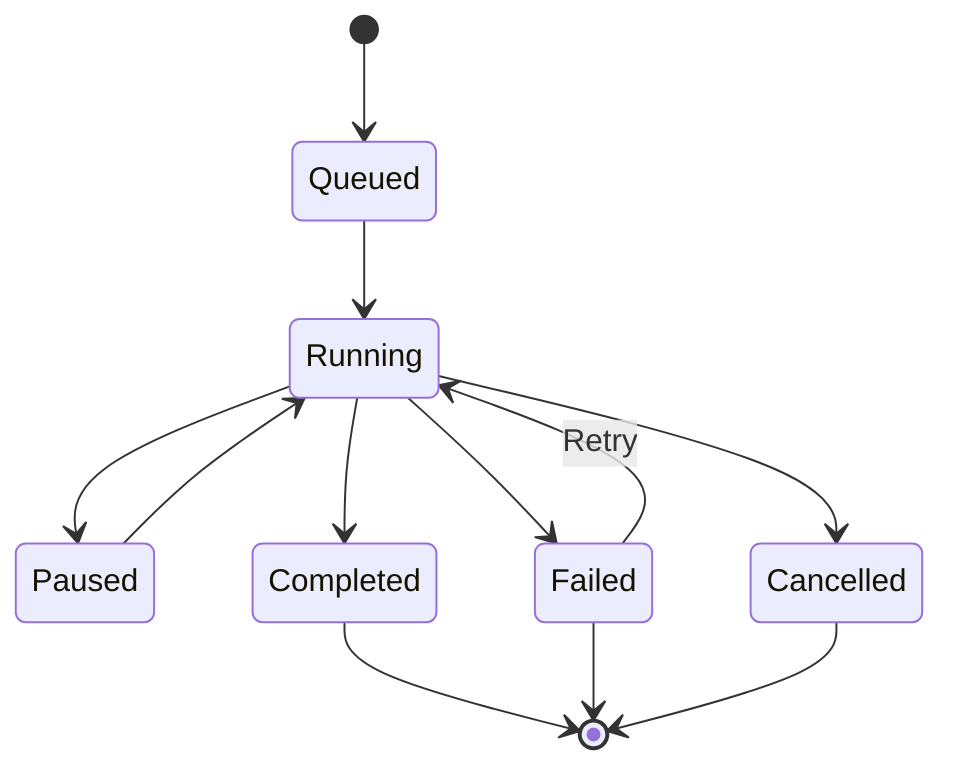
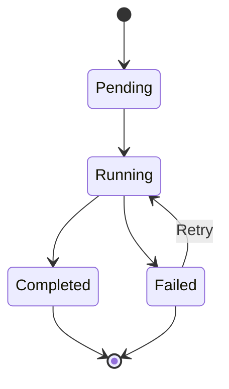

# Execution Monitoring Guide

**Best for:** Organizations requiring real-time visibility into agent operations, comprehensive troubleshooting capabilities, and data-driven optimization of workflow performance.

This guide establishes practices for monitoring workflow executions, analyzing performance patterns, and resolving issues efficiently to ensure reliable, scalable agent operations.

## Overview

Execution monitoring provides real-time visibility and historical analysis of workflow operations across your Agent Studio environment. This solution is designed to support organizations scaling agent systems across multiple teams and business units while maintaining operational excellence.

### What You'll Learn

- Real-time monitoring of active executions
- Understanding execution lifecycle and states
- Reading logs and troubleshooting failures
- Working with checkpoints for recovery
- Pausing, resuming, and canceling workflows
- Performance analysis and optimization
- Cost tracking and budget management

## Execution Lifecycle

### Execution States

Understanding execution states enables effective monitoring and intervention:



| State | Description | Actions Available |
|-------|-------------|-------------------|
| **Queued** | Waiting for execution capacity | Cancel |
| **Running** | Active execution in progress | Pause, Cancel, View logs |
| **Paused** | Temporarily suspended by user | Resume, Cancel |
| **Completed** | Successfully finished all tasks | View results, Clone |
| **Failed** | Execution failed with errors | Retry, View logs, Debug |
| **Cancelled** | Manually terminated by user | View logs, Clone |

### Task States

Each task within a workflow progresses through its own lifecycle:



## Real-Time Monitoring Dashboard

### Accessing the Dashboard

1. Navigate to **Workflows** → **Executions**
2. View all active and recent executions
3. Filter by:
   - Workflow ID
   - Status (Running, Completed, Failed)
   - Date range
   - Owner/Team
   - Environment (dev, staging, production)

### Dashboard Overview

```
┌─────────────────────────────────────────────────────────────────┐
│ Workflow Executions                     [Refresh] [Filters]     │
├─────────────────────────────────────────────────────────────────┤
│                                                                  │
│ ┌─ Active Executions (3) ───────────────────────────────────┐  │
│ │                                                             │  │
│ │ customer-onboarding-wf-exec-001        Running  ██░░░ 45%  │  │
│ │ ├─ validate-compliance     Completed  ✓                    │  │
│ │ ├─ provision-account       Running    ⟳ 2m 15s            │  │
│ │ └─ send-welcome-email      Pending    ...                  │  │
│ │                                                             │  │
│ │ data-pipeline-exec-042                Running  ███░░ 65%  │  │
│ │ deployment-workflow-exec-099          Running  ██░░░ 50%  │  │
│ └─────────────────────────────────────────────────────────────┘  │
│                                                                  │
│ ┌─ Recently Completed (10) ──────────────────────────────────┐  │
│ │ customer-onboarding-wf-exec-000  Completed  3m 42s  ✓      │  │
│ │ security-scan-exec-128           Completed  1m 18s  ✓      │  │
│ │ code-review-exec-501             Failed     5m 02s  ✗      │  │
│ └─────────────────────────────────────────────────────────────┘  │
└─────────────────────────────────────────────────────────────────┘
```

### Real-Time Updates with SignalR

Agent Studio uses SignalR to stream real-time execution updates to your browser:

**Events You'll Receive:**

- **WorkflowStarted**: Execution initiated
- **TaskStarted**: Individual task began
- **AgentThought**: Agent reasoning/decision
- **ProgressUpdate**: Task completion percentage
- **TaskCompleted**: Task finished successfully
- **TaskFailed**: Task encountered error
- **CheckpointCreated**: State snapshot saved
- **WorkflowCompleted**: Execution finished
- **WorkflowFailed**: Execution failed

**Example: Connecting to Real-Time Updates**

```typescript
import { HubConnectionBuilder, LogLevel } from '@microsoft/signalr';

const connection = new HubConnectionBuilder()
  .withUrl('/hubs/meta-agent')
  .withAutomaticReconnect()
  .configureLogging(LogLevel.Information)
  .build();

// Subscribe to workflow
await connection.start();
await connection.invoke('SubscribeToWorkflow', workflowExecutionId);

// Listen for events
connection.on('ReceiveTaskStarted', (data) => {
  console.log(`Task ${data.taskId} started`);
});

connection.on('ReceiveProgress', (data) => {
  console.log(`Progress: ${data.percentage}%`);
});

connection.on('ReceiveAgentThought', (data) => {
  console.log(`Agent thinking: ${data.thought}`);
});
```

## Detailed Execution View

### Accessing Execution Details

1. Click on any execution from the dashboard
2. View comprehensive execution information:

```
┌─────────────────────────────────────────────────────────────────┐
│ Execution: customer-onboarding-wf-exec-001                      │
│ Status: Running (45% complete)          Started: 2m 15s ago     │
├─────────────────────────────────────────────────────────────────┤
│ [Overview] [Tasks] [Logs] [Checkpoints] [Metrics] [Trace]      │
├─────────────────────────────────────────────────────────────────┤
│                                                                  │
│ Workflow: customer-onboarding-workflow v1.2.0                   │
│ Execution ID: wf-exec-001-20251009-143022                       │
│ Environment: production                                          │
│ Triggered By: api-automation                                     │
│                                                                  │
│ ┌─ Task Timeline ────────────────────────────────────────────┐  │
│ │                                                             │  │
│ │ validate-compliance    ✓ Completed      0:35    [View]    │  │
│ │ provision-account      ⟳ Running        2:15    [View]    │  │
│ │ send-welcome-email     ⋯ Pending         --     [Skip]    │  │
│ │                                                             │  │
│ └─────────────────────────────────────────────────────────────┘  │
│                                                                  │
│ ┌─ Current Task: provision-account ────────────────────────┐  │
│ │ Agent: builder-agent-prod v2.1.0                           │  │
│ │ Status: Running (2m 15s elapsed)                           │  │
│ │ Token Usage: 2,340 / 8,000                                 │  │
│ │                                                             │  │
│ │ Latest Output:                                             │  │
│ │ > Creating Azure resources...                              │  │
│ │ > Resource group: rg-customer-12345 created                │  │
│ │ > Provisioning Cosmos DB account...                        │  │
│ │                                                             │  │
│ │ [⏸ Pause] [⏹ Cancel] [📋 Copy Logs]                        │  │
│ └─────────────────────────────────────────────────────────────┘  │
└─────────────────────────────────────────────────────────────────┘
```

### Understanding Task Details

Click on any task to view:

**Task Information:**
- Task ID and name
- Assigned agent
- Execution status
- Start/end timestamps
- Duration
- Retry count

**Input/Output:**
```json
{
  "input": {
    "task": "Validate customer data against compliance requirements",
    "customerData": {
      "companyName": "Acme Corp",
      "country": "US"
    },
    "requirements": ["KYC", "AML", "GDPR"]
  },
  "output": {
    "status": "approved",
    "validationResults": {
      "KYC": "passed",
      "AML": "passed",
      "GDPR": "passed"
    },
    "complianceScore": 100
  }
}
```

**Execution Metrics:**
- Token usage: 1,245 tokens
- API calls: 3 requests
- Cache hits: 0
- Duration: 35 seconds
- Cost estimate: $0.037

## Reading and Analyzing Logs

### Log Levels

Agent Studio uses structured logging with standard severity levels:

| Level | Purpose | When to Use |
|-------|---------|-------------|
| **Trace** | Fine-grained debugging | Development, deep troubleshooting |
| **Debug** | Detailed diagnostic info | Development, investigation |
| **Info** | General informational | Normal operations |
| **Warning** | Non-critical issues | Potential problems |
| **Error** | Operation failures | Failed tasks, exceptions |
| **Critical** | System-level failures | Service outages, data loss |

### Viewing Logs in UI

Navigate to the **Logs** tab in execution details:

```
┌─ Execution Logs ──────────────────────────────────────────────┐
│ [All Levels ▼] [Filter tasks ▼] [🔍 Search]    [📥 Export]  │
├───────────────────────────────────────────────────────────────┤
│                                                                │
│ 14:30:22.145 INFO  [workflow-executor] Workflow started       │
│ 14:30:22.167 INFO  [task:validate] Task started               │
│ 14:30:22.234 DEBUG [agent:validator] Connecting to Azure AI   │
│ 14:30:22.891 INFO  [agent:validator] Received response        │
│ 14:30:22.905 INFO  [task:validate] Task completed (0.76s)     │
│ 14:30:22.920 INFO  [checkpoint] Creating checkpoint #1        │
│ 14:30:23.145 INFO  [task:provision] Task started              │
│ 14:30:25.678 WARN  [agent:builder] Rate limit approaching     │
│ 14:32:40.234 ERROR [agent:builder] API call failed (429)      │
│ 14:32:41.456 INFO  [agent:builder] Retrying with backoff      │
│                                                                │
└────────────────────────────────────────────────────────────────┘
```

**Log Search Tips:**

- **By level**: Filter to ERROR to find failures quickly
- **By task**: Focus on specific task logs
- **By text**: Search for error messages, task names, or keywords
- **Time range**: Narrow to specific time windows

### Application Insights Queries

For advanced log analysis, use Azure Application Insights:

**Query: Find All Failed Executions**

```kusto
traces
| where customDimensions.executionStatus == "failed"
| where timestamp > ago(24h)
| extend workflowId = tostring(customDimensions.workflowId)
| extend executionId = tostring(customDimensions.executionId)
| extend errorMessage = tostring(customDimensions.errorMessage)
| project timestamp, workflowId, executionId, errorMessage
| order by timestamp desc
```

**Query: Task Performance Analysis**

```kusto
customMetrics
| where name == "TaskDuration"
| extend taskId = tostring(customDimensions.taskId)
| extend duration = value
| summarize
    AvgDuration = avg(duration),
    P50Duration = percentile(duration, 50),
    P95Duration = percentile(duration, 95),
    P99Duration = percentile(duration, 99)
    by taskId
| order by P95Duration desc
```

**Query: Token Usage by Workflow**

```kusto
customMetrics
| where name == "TokenUsage"
| extend workflowId = tostring(customDimensions.workflowId)
| extend tokens = toint(value)
| extend cost = tokens * 0.00003  // GPT-4 pricing
| summarize
    TotalTokens = sum(tokens),
    TotalCost = sum(cost),
    AvgTokensPerExecution = avg(tokens)
    by workflowId, bin(timestamp, 1h)
| order by TotalCost desc
```

## Working with Checkpoints

### Understanding Checkpoints

Checkpoints are point-in-time snapshots of workflow state, enabling recovery from failures without restarting from the beginning.

**Checkpoint Types:**

| Type | Created When | Purpose |
|------|--------------|---------|
| **Automatic** | After each task completion | Automatic recovery |
| **Manual** | User-triggered | Before critical operations |
| **Failure** | When task fails | Preserve state for debugging |
| **Paused** | User pauses execution | Resume from exact point |

### Viewing Checkpoints

Navigate to the **Checkpoints** tab:

```
┌─ Execution Checkpoints ───────────────────────────────────────┐
│                                                                │
│ Checkpoint #3 (Latest)                      2m 15s ago        │
│ ├─ Type: Automatic                                            │
│ ├─ Status: task:provision-account running                     │
│ ├─ Size: 14.2 KB                                              │
│ └─ [🔄 Restore] [📥 Download]                                 │
│                                                                │
│ Checkpoint #2                                2m 50s ago        │
│ ├─ Type: Automatic                                            │
│ ├─ Status: task:validate-compliance completed                 │
│ └─ [🔄 Restore] [📥 Download]                                 │
│                                                                │
│ Checkpoint #1                                3m 25s ago        │
│ ├─ Type: Automatic                                            │
│ ├─ Status: workflow started                                   │
│ └─ [🔄 Restore] [📥 Download]                                 │
└────────────────────────────────────────────────────────────────┘
```

### Restoring from Checkpoint

When execution fails or is cancelled, restore from a checkpoint:

1. Navigate to **Checkpoints** tab
2. Select desired checkpoint
3. Click **Restore**
4. Confirm restoration
5. Execution resumes from that state

**Use Cases:**

- **Task Failure Recovery**: Resume after fixing the issue causing failure
- **Configuration Changes**: Restore and retry with updated agent configuration
- **Cost Optimization**: Resume long-running workflow without re-executing completed tasks
- **Testing**: Restore to specific state to test behavior

### Checkpoint Configuration

Configure checkpointing behavior at workflow level:

```json
{
  "checkpointing": {
    "enabled": true,
    "frequency": "afterEachTask",  // or "interval", "manual"
    "intervalSeconds": 300,  // for "interval" frequency
    "retentionDays": 30,
    "maxCheckpoints": 100,
    "compression": true,
    "storageAccount": "checkpoints-storage"
  }
}
```

**Best Practices:**

- **Frequency**: `afterEachTask` for critical workflows, `interval` for long-running tasks
- **Retention**: Balance storage costs with recovery needs (30-90 days typical)
- **Compression**: Enable for large state objects
- **Storage**: Use dedicated storage account for checkpoints

## Execution Control Actions

### Pausing Executions

Temporarily suspend execution while preserving state:

**When to Pause:**
- Investigate suspicious behavior without losing progress
- Wait for external dependency to become available
- Perform system maintenance
- Review intermediate results before continuing

**How to Pause:**

1. Navigate to execution details
2. Click **⏸ Pause Execution**
3. Automatic checkpoint created
4. Current task completes, then execution pauses

**Resume Execution:**

1. Click **▶ Resume Execution**
2. Execution continues from where it paused

### Canceling Executions

Terminate execution permanently:

**When to Cancel:**
- Incorrect input data provided
- Workflow no longer needed
- Resource constraints
- Suspected runaway costs

**How to Cancel:**

1. Navigate to execution details
2. Click **⏹ Cancel Execution**
3. Confirm cancellation
4. Execution terminates gracefully:
   - Current task attempts to complete
   - Resources cleaned up
   - Final checkpoint created
   - Status set to "Cancelled"

### Retrying Failed Executions

Retry failed workflows after resolving issues:

**Retry Options:**

**1. Retry from Beginning**
- Restarts entire workflow
- Use when input data changed or early task failed

**2. Retry from Last Checkpoint**
- Resumes from most recent checkpoint
- Use when late-stage task failed and early tasks succeeded

**3. Retry Failed Tasks Only**
- Re-executes only failed tasks
- Use when most tasks succeeded

**How to Retry:**

1. Navigate to failed execution
2. Click **🔄 Retry Execution**
3. Select retry strategy
4. Optionally update input parameters
5. Confirm retry
6. New execution created, linked to original

## Performance Metrics

### Execution Performance Dashboard

View aggregate performance metrics:

```
┌─ Performance Metrics (Last 24h) ──────────────────────────────┐
│                                                                │
│ Total Executions: 1,247                                        │
│ Success Rate: 94.2%                    ✓ Above target (>90%) │
│ Avg Duration: 3m 45s                   ⚠ Near SLA (5m)       │
│ P95 Duration: 8m 12s                   ✗ Above SLA (7m)      │
│                                                                │
│ ┌─ Execution Duration Trend ──────────────────────────────┐  │
│ │      ▁▂▃▅▄▃▂▁▂▃▅▇▆▅▄▃▂▁                                  │  │
│ │ 10m  │                                                    │  │
│ │  8m  │        ●                                           │  │
│ │  6m  │     ●  │  ●●                                       │  │
│ │  4m  │ ●●● │  │  │ ●●●●                                  │  │
│ │  2m  │ │ │ │  │  │ │ │ │                                │  │
│ │  0   ┴─┴─┴──┴──┴─┴─┴─┴──                                │  │
│ │      0h 4h 8h 12h 16h 20h 24h                            │  │
│ └───────────────────────────────────────────────────────────┘  │
│                                                                │
│ ┌─ Token Usage ────────────────────────────────────────────┐  │
│ │ Total Tokens: 24.5M                                       │  │
│ │ Estimated Cost: $735.00                                   │  │
│ │ Avg per Execution: 19,650 tokens ($0.59)                 │  │
│ │                                                            │  │
│ │ Cost Trend: ▁▂▂▃▃▄▅▅▆▆▇▇ ⚠ Increasing                   │  │
│ └───────────────────────────────────────────────────────────┘  │
└────────────────────────────────────────────────────────────────┘
```

### Key Performance Indicators

**Execution Metrics:**

| Metric | Description | Target |
|--------|-------------|--------|
| **Success Rate** | % of executions completing successfully | > 95% |
| **Avg Duration** | Mean execution time | < SLA threshold |
| **P95 Duration** | 95th percentile execution time | < 1.5x SLA |
| **Throughput** | Executions per hour | Based on capacity |
| **Retry Rate** | % requiring retry | < 10% |

**Task Metrics:**

| Metric | Description | Target |
|--------|-------------|--------|
| **Task Success Rate** | % of tasks completing | > 98% |
| **Avg Task Duration** | Mean task execution time | Based on task type |
| **Token Usage** | Average tokens per task | Optimize for cost |
| **Cache Hit Rate** | % of cached responses | > 30% |

**Cost Metrics:**

| Metric | Description | Target |
|--------|-------------|--------|
| **Cost per Execution** | Average Azure OpenAI cost | < budget threshold |
| **Total Daily Cost** | Sum of all execution costs | < daily budget |
| **Cost Trend** | Cost change over time | Stable or decreasing |

### Custom Metrics

Create custom performance metrics:

```typescript
// Instrument custom metrics
telemetryClient.trackMetric({
  name: 'WorkflowBusinessValue',
  value: calculatedBusinessValue,
  properties: {
    workflowId: workflow.id,
    customerId: customer.id,
    environment: 'production'
  }
});
```

Query custom metrics in Application Insights:

```kusto
customMetrics
| where name == "WorkflowBusinessValue"
| extend workflowId = tostring(customDimensions.workflowId)
| summarize TotalValue = sum(value) by workflowId
| order by TotalValue desc
```

## Troubleshooting Failed Executions

### Diagnostic Workflow

Follow this systematic approach to diagnose failures:

**Step 1: Identify Failed Task**

Navigate to execution details and identify which task failed:

```
Task: provision-account
Status: Failed
Error: HTTP 429 - Rate limit exceeded
Duration: 2m 15s
Retries: 3/3
```

**Step 2: Review Task Logs**

Filter logs to the failed task:

```
14:32:40.234 ERROR [agent:builder] API call failed
  Status Code: 429
  Message: "Requests to the OpenAI API have exceeded rate limit"
  Retry After: 60 seconds

14:32:41.456 INFO [agent:builder] Retrying with backoff (attempt 2/3)
14:32:43.567 ERROR [agent:builder] API call failed (429)
14:32:46.123 INFO [agent:builder] Retrying with backoff (attempt 3/3)
14:32:49.234 ERROR [agent:builder] API call failed (429)
14:32:49.245 ERROR [task:provision] Task failed after 3 retries
```

**Step 3: Analyze Root Cause**

Common failure patterns:

| Error Pattern | Root Cause | Solution |
|---------------|------------|----------|
| **HTTP 429** | Rate limit exceeded | Increase quota or throttle requests |
| **HTTP 401** | Authentication failure | Verify API keys in Key Vault |
| **HTTP 400** | Invalid request | Validate input format |
| **Timeout** | Task exceeding timeout | Increase timeout or optimize task |
| **OOM** | Out of memory | Reduce batch size or scale up |

**Step 4: Review Agent Configuration**

Check agent settings that may cause failures:

```json
{
  "retryPolicy": {
    "maxRetries": 3,  // Increase if transient failures
    "retryDelayMs": 2000,
    "exponentialBackoff": true
  },
  "timeout": 300,  // Increase if tasks timing out
  "rateLimit": {
    "requestsPerMinute": 60  // Adjust based on quota
  }
}
```

**Step 5: Test in Isolation**

Test the agent independently:

1. Navigate to **Agents** → Select agent
2. Click **Test Agent**
3. Use same input as failed task
4. Observe behavior

**Step 6: Check Dependencies**

Verify external dependencies:

- Azure OpenAI endpoint health
- Cosmos DB availability
- Network connectivity
- Authentication services

**Step 7: Implement Fix and Retry**

After resolving the issue:

1. Update agent configuration if needed
2. Navigate to failed execution
3. Click **Retry from Last Checkpoint**
4. Monitor for success

### Common Failure Scenarios

#### Scenario 1: Intermittent Azure OpenAI Failures

**Symptoms:**
- Tasks fail randomly with HTTP 429 or 503
- Success rate drops below 90%

**Root Cause:**
- Rate limiting or service throttling
- Insufficient quota

**Solution:**

```json
{
  "retryPolicy": {
    "maxRetries": 5,  // Increase retries
    "retryDelayMs": 5000,  // Longer initial delay
    "exponentialBackoff": true,
    "maxRetryDelayMs": 60000  // Cap at 1 minute
  },
  "circuitBreaker": {
    "enabled": true,
    "failureThreshold": 5,
    "timeoutSeconds": 300
  }
}
```

Request quota increase from Azure Support.

#### Scenario 2: Tasks Timing Out

**Symptoms:**
- Tasks exceed timeout and fail
- Long-running operations

**Root Cause:**
- Timeout too aggressive
- Agent processing large amounts of data
- Inefficient prompts

**Solution:**

1. Increase task timeout:

```json
{
  "taskTimeout": 600  // 10 minutes instead of 5
}
```

2. Optimize agent prompt to reduce token usage
3. Break large tasks into smaller subtasks

#### Scenario 3: Invalid Agent Output

**Symptoms:**
- Tasks complete but output doesn't match expected format
- Downstream tasks fail due to missing data

**Root Cause:**
- Ambiguous system prompt
- Insufficient output validation

**Solution:**

1. Clarify system prompt with explicit output format:

```markdown
**Output Format:**
Return a JSON object with the following structure:
{
  "status": "approved" | "rejected",
  "details": {
    "validationResults": {...}
  }
}
```

2. Add validation task:

```json
{
  "taskId": "validate-output",
  "agentId": "validator-agent",
  "input": {
    "task": "Validate output format",
    "schema": "${workflow.outputSchema}"
  }
}
```

## Cost Tracking and Optimization

### Viewing Execution Costs

Track Azure OpenAI costs per execution:

Navigate to **Metrics** tab in execution details:

```
┌─ Execution Cost Breakdown ────────────────────────────────────┐
│                                                                │
│ Total Cost: $1.42                                              │
│                                                                │
│ Task                      Tokens    Cost      % of Total      │
│ ──────────────────────── ─────────  ────────  ──────────      │
│ validate-compliance       1,245     $0.037    2.6%            │
│ provision-account         38,420    $1.153    81.2%           │
│ send-welcome-email        7,650     $0.230    16.2%           │
│                          ──────────  ────────                 │
│ Total                     47,315    $1.420                     │
│                                                                │
│ Cost per Task Type:                                            │
│ • Builder tasks: $1.15 (81%)                                   │
│ • Validator tasks: $0.04 (3%)                                  │
│ • Scribe tasks: $0.23 (16%)                                    │
└────────────────────────────────────────────────────────────────┘
```

### Budget Alerts

Configure cost alerts to prevent budget overruns:

```json
{
  "costManagement": {
    "dailyBudget": 500.00,
    "monthlyBudget": 15000.00,
    "alerts": [
      {
        "threshold": 0.80,  // 80% of budget
        "action": "notify",
        "recipients": ["finance-team@example.com"]
      },
      {
        "threshold": 0.95,  // 95% of budget
        "action": "notify",
        "recipients": ["platform-team@example.com"]
      },
      {
        "threshold": 1.00,  // 100% of budget
        "action": "pause",  // Pause new executions
        "recipients": ["platform-team@example.com", "leadership@example.com"]
      }
    ]
  }
}
```

### Cost Optimization Strategies

**1. Right-Size Models**

Use appropriate models for task complexity:

```json
{
  "tasks": [
    {
      "taskId": "simple-validation",
      "agentId": "validator-gpt35"  // GPT-3.5: $0.0005/1K tokens
    },
    {
      "taskId": "complex-architecture",
      "agentId": "architect-gpt4"   // GPT-4: $0.03/1K tokens
    }
  ]
}
```

**2. Implement Caching**

Cache deterministic responses:

```json
{
  "caching": {
    "enabled": true,
    "ttlSeconds": 3600,
    "keyStrategy": "inputHash"
  }
}
```

**3. Optimize Prompts**

Reduce unnecessary context to minimize tokens:

- Remove verbose examples
- Use concise language
- Limit max tokens appropriately

**4. Batch Operations**

Process multiple items in single request when possible:

```json
{
  "input": {
    "task": "Validate the following 10 configurations",
    "configs": [...]  // Process batch instead of 10 separate tasks
  }
}
```

## Best Practices

### Proactive Monitoring

1. **Set up dashboards** for key metrics visible to entire team
2. **Configure alerts** for SLA breaches, high error rates, cost overruns
3. **Review metrics weekly** to identify trends and optimization opportunities
4. **Establish baseline** performance to detect anomalies
5. **Document incidents** and resolutions in runbooks

### Operational Excellence

1. **Monitor continuously** during business hours for production workflows
2. **Respond quickly** to alerts and failures
3. **Maintain runbooks** for common failure scenarios
4. **Conduct post-mortems** for significant incidents
5. **Share learnings** across teams

### Performance Optimization

1. **Review slow executions** and optimize workflow patterns
2. **Analyze token usage** to identify optimization opportunities
3. **Tune agent configurations** based on performance data
4. **Use parallel execution** where possible
5. **Implement caching** for frequently accessed data

## Next Steps

- [Traces & Observability Guide](traces-observability.md) - Deep dive into distributed tracing
- [Workflow Designer Guide](workflow-designer.md) - Optimize workflow patterns
- [Troubleshooting Runbook](../../runbooks/troubleshooting.md) - Detailed troubleshooting procedures
- [API Reference](/api/) - Programmatic monitoring integration

## Support

**Documentation:**
Consultations@BrooksideBI.com

**Technical Support:**
+1 209 487 2047

**Community:**
[GitHub Discussions](https://github.com/Brookside-Proving-Grounds/Project-Ascension/discussions)

---

*This guide establishes comprehensive observability practices that enable reliable, scalable agent operations and drive measurable outcomes across your organization.*

**Last Updated:** 2025-10-09
**Version:** 1.0.0
**Maintained By:** Agent Studio Platform Team
