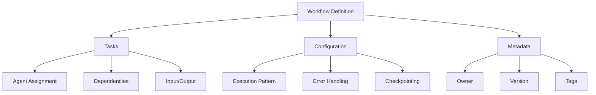
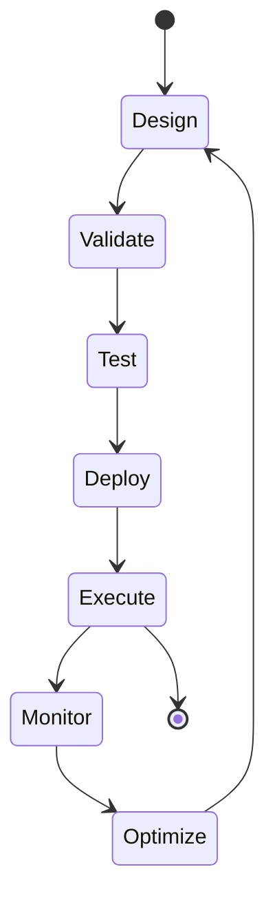
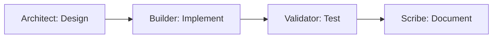
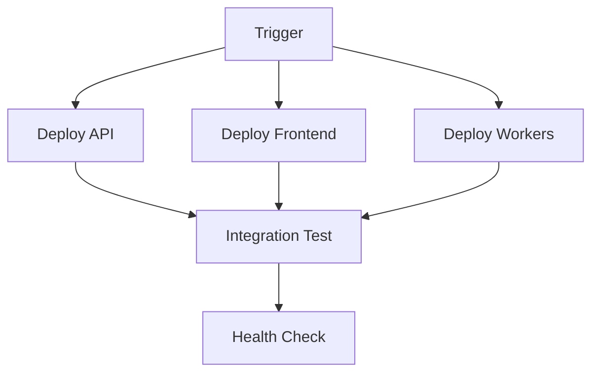
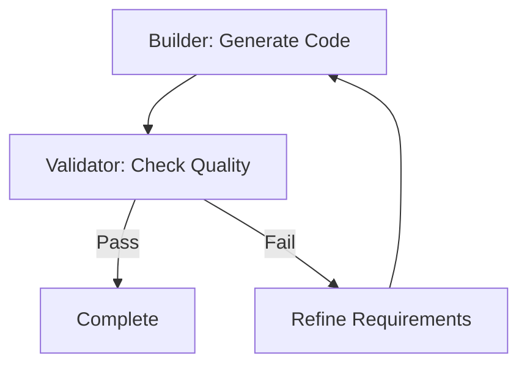
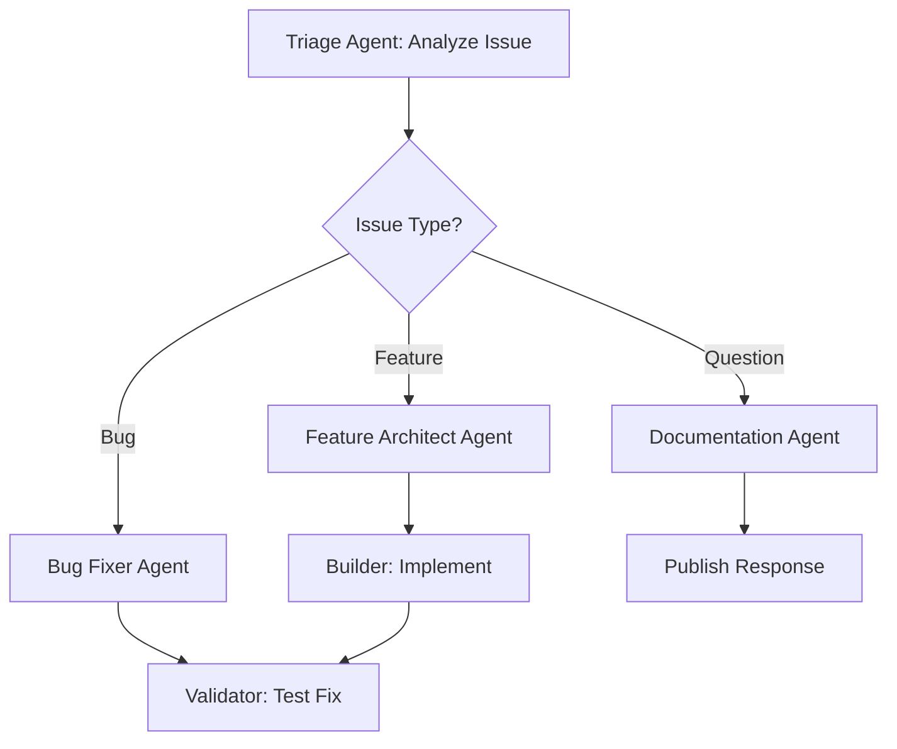
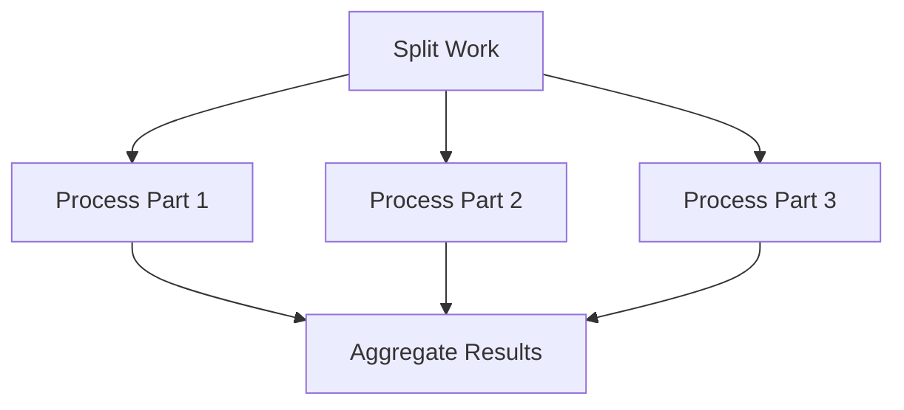

# Workflow Designer Guide

**Best for:** Organizations orchestrating complex multi-agent processes that require structured coordination, fault tolerance, and comprehensive observability.

This guide establishes comprehensive practices for designing, implementing, and optimizing AI agent workflows that deliver reliable, measurable results at scale.

## Overview

The Workflow Designer enables you to orchestrate multiple AI agents into cohesive processes that accomplish complex business objectives. This solution is designed to support organizations scaling agent operations across teams, departments, and business units.

### What You'll Learn

- Understanding workflow patterns and their use cases
- Designing workflows with the visual designer
- Connecting agents and managing dependencies
- Implementing error handling and recovery
- Testing and deploying workflows
- Monitoring and optimizing workflow performance

## Workflow Fundamentals

### What is a Workflow?

A **workflow** is a structured sequence of tasks executed by one or more agents to accomplish a specific business objective. Workflows provide:

- **Orchestration**: Coordinate multiple agents working toward shared goals
- **Fault Tolerance**: Automatic recovery from failures with checkpointing
- **Observability**: Comprehensive tracing and monitoring of all operations
- **Reusability**: Parameterized workflows deployable across environments
- **Governance**: Version control, approval gates, and audit trails

### Workflow Components



**Core Components:**

1. **Tasks**: Individual units of work assigned to agents
2. **Dependencies**: Relationships between tasks defining execution order
3. **Execution Pattern**: How tasks are coordinated (sequential, parallel, etc.)
4. **Configuration**: Runtime settings, timeouts, retry policies
5. **Metadata**: Version, owner, description, tags

### Workflow Lifecycle



## Workflow Patterns

Agent Studio supports four primary workflow patterns, each optimized for specific use cases.

### 1. Sequential Workflows

**Description:** Tasks execute one after another in a defined order. Each task receives output from the previous task.

**Best For:**
- Linear processes with clear steps
- Workflows where each task depends on previous results
- Scenarios requiring strict ordering

**Example Use Case:** Software Development Pipeline



**Configuration:**

```json
{
  "workflowId": "software-pipeline-seq",
  "name": "Sequential Software Development",
  "pattern": "sequential",
  "tasks": [
    {
      "taskId": "design",
      "agentId": "architect-agent",
      "input": {
        "task": "Design system architecture for customer portal",
        "requirements": "High availability, GDPR compliance, <100ms latency"
      }
    },
    {
      "taskId": "implement",
      "agentId": "builder-agent",
      "input": {
        "task": "Implement the designed architecture",
        "dependencies": ["design"]
      }
    },
    {
      "taskId": "test",
      "agentId": "validator-agent",
      "input": {
        "task": "Validate implementation against requirements",
        "dependencies": ["implement"]
      }
    },
    {
      "taskId": "document",
      "agentId": "scribe-agent",
      "input": {
        "task": "Create comprehensive documentation",
        "dependencies": ["test"]
      }
    }
  ]
}
```

**Advantages:**
- Simple to understand and debug
- Clear execution order
- Easy error isolation

**Considerations:**
- Slower than parallel execution
- Single task failure blocks subsequent tasks
- Not ideal for independent tasks

### 2. Parallel Workflows

**Description:** Multiple tasks execute concurrently, optimizing for throughput. Tasks may have dependencies that create execution groups.

**Best For:**
- Independent tasks that can run simultaneously
- Performance-critical workflows requiring minimal execution time
- Scenarios with heterogeneous task durations

**Example Use Case:** Multi-Service Deployment



**Configuration:**

```json
{
  "workflowId": "parallel-deployment",
  "name": "Parallel Service Deployment",
  "pattern": "parallel",
  "tasks": [
    {
      "taskId": "deploy-api",
      "agentId": "deployment-agent",
      "input": {
        "service": "api",
        "environment": "production"
      },
      "dependencies": []
    },
    {
      "taskId": "deploy-frontend",
      "agentId": "deployment-agent",
      "input": {
        "service": "frontend",
        "environment": "production"
      },
      "dependencies": []
    },
    {
      "taskId": "deploy-workers",
      "agentId": "deployment-agent",
      "input": {
        "service": "workers",
        "environment": "production"
      },
      "dependencies": []
    },
    {
      "taskId": "integration-test",
      "agentId": "test-agent",
      "input": {
        "task": "Run end-to-end integration tests"
      },
      "dependencies": ["deploy-api", "deploy-frontend", "deploy-workers"]
    }
  ],
  "parallelism": {
    "maxConcurrentTasks": 5,
    "waitForAll": true
  }
}
```

**Advantages:**
- Significantly faster for independent tasks
- Optimal resource utilization
- Scales well with task count

**Considerations:**
- More complex error handling
- Requires careful dependency management
- May strain resources if too many concurrent tasks

### 3. Iterative Workflows

**Description:** Tasks execute in a loop until validation criteria are met or maximum iterations reached. Feedback from validation agents refines subsequent iterations.

**Best For:**
- Quality-driven processes requiring iterative refinement
- Scenarios where initial attempts may not meet standards
- Code generation, content creation, optimization problems

**Example Use Case:** Code Generation with Quality Gates



**Configuration:**

```json
{
  "workflowId": "iterative-code-gen",
  "name": "Iterative Code Generation",
  "pattern": "iterative",
  "tasks": [
    {
      "taskId": "generate",
      "agentId": "builder-agent",
      "input": {
        "task": "Generate Python API implementation",
        "requirements": "RESTful, async, type hints, 90% test coverage"
      }
    },
    {
      "taskId": "validate",
      "agentId": "validator-agent",
      "input": {
        "task": "Validate code quality and requirements",
        "criteria": [
          "All endpoints have type hints",
          "Test coverage >= 90%",
          "No security vulnerabilities",
          "Follows PEP 8 style guide"
        ]
      }
    }
  ],
  "iteration": {
    "maxIterations": 5,
    "validatorTaskId": "validate",
    "builderTaskId": "generate",
    "feedbackPath": "validation.feedback"
  }
}
```

**Advantages:**
- Self-correcting workflows that improve output quality
- Reduces manual review cycles
- Ensures quality gates are met

**Considerations:**
- Can consume significant tokens/costs
- Requires well-defined validation criteria
- May not converge if validation is too strict

### 4. Dynamic Workflows

**Description:** Execution path determined at runtime based on agent decisions and handoffs. Agents can dynamically spawn new tasks or delegate to specialized agents.

**Best For:**
- Complex decision trees with multiple paths
- Scenarios requiring adaptive behavior
- Agent-to-agent collaboration with context sharing

**Example Use Case:** Intelligent Issue Triage



**Configuration:**

```json
{
  "workflowId": "dynamic-triage",
  "name": "Dynamic Issue Triage",
  "pattern": "dynamic",
  "entryTask": {
    "taskId": "triage",
    "agentId": "triage-agent",
    "input": {
      "task": "Analyze issue and determine next steps",
      "issue": "${workflow.input.issue}"
    }
  },
  "handoffConfig": {
    "enabled": true,
    "allowedAgents": [
      "bug-fixer-agent",
      "feature-architect-agent",
      "documentation-agent",
      "validator-agent"
    ],
    "maxHandoffs": 10
  }
}
```

**Advantages:**
- Highly flexible and adaptive
- Agents make intelligent routing decisions
- Handles complex scenarios with multiple paths

**Considerations:**
- Most complex pattern to design and debug
- Requires sophisticated agents capable of handoffs
- Harder to predict execution path and duration

## Using the Visual Designer

### Accessing the Designer

1. Navigate to **Workflows** in the main menu
2. Click **+ Create Workflow**
3. Select **Visual Designer** (or **JSON Editor** for code-based design)

### Designer Interface Overview

```
┌─────────────────────────────────────────────────────────┐
│ Workflow: Customer Onboarding         [Save] [Deploy]   │
├─────────────────────────────────────────────────────────┤
│                                                          │
│  ┌──────────┐                                           │
│  │ Agent    │       ┌──────────────┐                    │
│  │ Palette  │       │   Canvas     │   ┌─────────────┐  │
│  │          │       │              │   │ Properties  │  │
│  │ Architect│       │    Task 1    │   │             │  │
│  │ Builder  │       │      ↓       │   │ Task ID     │  │
│  │ Validator│       │    Task 2    │   │ Agent       │  │
│  │ Scribe   │       │      ↓       │   │ Input       │  │
│  │          │       │    Task 3    │   │ Dependencies│  │
│  └──────────┘       └──────────────┘   └─────────────┘  │
│                                                          │
└─────────────────────────────────────────────────────────┘
```

### Step-by-Step: Creating Your First Workflow

**Step 1: Define Workflow Metadata**

Click **Settings** icon and configure:

```json
{
  "name": "customer-onboarding",
  "description": "Automate customer onboarding process with compliance checks",
  "owner": "product-team@example.com",
  "version": "1.0.0",
  "tags": ["onboarding", "compliance", "production"]
}
```

**Step 2: Select Workflow Pattern**

Choose the pattern that best fits your use case:
- Sequential: For linear processes
- Parallel: For independent concurrent tasks
- Iterative: For quality-driven refinement
- Dynamic: For adaptive routing

**Step 3: Add Tasks to Canvas**

Drag agents from the palette onto the canvas:

1. Click and drag **Architect** agent → Creates "Task 1"
2. Click and drag **Builder** agent → Creates "Task 2"
3. Click and drag **Validator** agent → Creates "Task 3"

**Step 4: Configure Each Task**

Click on a task to open the **Properties Panel**:

**Task Configuration:**
```json
{
  "taskId": "validate-requirements",
  "agentId": "validator-agent-prod",
  "name": "Validate Customer Requirements",
  "input": {
    "task": "Validate customer data against compliance requirements",
    "requirements": ["KYC", "AML", "GDPR"],
    "customerData": "${workflow.input.customerData}"
  },
  "timeout": 300,  // seconds
  "retryPolicy": {
    "maxRetries": 3,
    "backoffMultiplier": 2
  }
}
```

**Input Expressions:**

Use expressions to reference previous task outputs:

- `${workflow.input.field}`: Workflow input parameter
- `${tasks.taskId.output.field}`: Output from a specific task
- `${tasks.taskId.status}`: Task execution status
- `${workflow.executionId}`: Current execution ID

**Step 5: Define Dependencies**

Connect tasks by drawing arrows between them:

1. Click output port of Task 1
2. Drag to input port of Task 2
3. Dependency automatically created

**Alternative: Manual Dependencies**

In the Properties Panel, add dependencies:

```json
{
  "taskId": "implement-feature",
  "dependencies": [
    "design-architecture",
    "security-review"
  ]
}
```

**Step 6: Configure Error Handling**

Set workflow-level error behavior:

```json
{
  "errorHandling": {
    "onTaskFailure": "continue",  // or "stop", "retry"
    "maxWorkflowRetries": 2,
    "notifyOnError": "platform-team@example.com"
  }
}
```

**Step 7: Enable Checkpointing**

Configure automatic state snapshots for recovery:

```json
{
  "checkpointing": {
    "enabled": true,
    "frequency": "afterEachTask",  // or "interval", "manual"
    "retentionDays": 30
  }
}
```

**Step 8: Validate Workflow**

Click **Validate** button to check:
- All tasks have required configuration
- Dependencies form a valid DAG (no cycles)
- Referenced agents exist and are enabled
- Input expressions are syntactically valid

**Step 9: Test Workflow**

Before deploying to production, test with sample input:

1. Click **Test** button
2. Provide test input data
3. Monitor execution in real-time
4. Review outputs and execution trace

**Step 10: Save and Deploy**

1. Click **Save** to persist workflow definition
2. Click **Deploy** to make available for execution
3. Choose environment: `dev`, `staging`, `production`

## Workflow Configuration Reference

### Complete Workflow Schema

```json
{
  "workflowId": "wf-001",
  "name": "customer-onboarding-workflow",
  "version": "1.0.0",
  "description": "Establish streamlined customer onboarding with automated compliance validation",
  "pattern": "sequential",

  "metadata": {
    "owner": "product-team@example.com",
    "costCenter": "customer-success",
    "environment": "production",
    "tags": ["onboarding", "compliance", "automated"]
  },

  "input": {
    "schema": {
      "type": "object",
      "required": ["customerData", "region"],
      "properties": {
        "customerData": {
          "type": "object",
          "description": "Customer information for onboarding"
        },
        "region": {
          "type": "string",
          "enum": ["US", "EU", "APAC"]
        }
      }
    }
  },

  "tasks": [
    {
      "taskId": "validate-compliance",
      "agentId": "validator-agent-prod",
      "name": "Compliance Validation",
      "input": {
        "task": "Validate customer data against regional compliance requirements",
        "customerData": "${workflow.input.customerData}",
        "region": "${workflow.input.region}"
      },
      "timeout": 300,
      "retryPolicy": {
        "maxRetries": 3,
        "retryDelayMs": 2000,
        "exponentialBackoff": true
      },
      "dependencies": []
    },
    {
      "taskId": "provision-account",
      "agentId": "builder-agent-prod",
      "name": "Account Provisioning",
      "input": {
        "task": "Provision customer account and resources",
        "customerData": "${workflow.input.customerData}",
        "complianceStatus": "${tasks.validate-compliance.output.status}"
      },
      "dependencies": ["validate-compliance"],
      "conditionalExecution": {
        "condition": "${tasks.validate-compliance.output.status == 'approved'}"
      }
    }
  ],

  "errorHandling": {
    "onTaskFailure": "stop",
    "maxWorkflowRetries": 2,
    "notifyOnError": "platform-team@example.com",
    "errorWebhook": "https://api.example.com/webhooks/workflow-error"
  },

  "checkpointing": {
    "enabled": true,
    "frequency": "afterEachTask",
    "retentionDays": 30,
    "storageAccount": "checkpoints-storage"
  },

  "monitoring": {
    "enableTracing": true,
    "enableMetrics": true,
    "sla": {
      "maxDurationSeconds": 600,
      "alertOnBreach": true
    }
  },

  "rateLimit": {
    "maxConcurrentExecutions": 10,
    "maxExecutionsPerHour": 1000
  }
}
```

## Advanced Workflow Patterns

### Conditional Execution

Execute tasks only when specific conditions are met:

```json
{
  "taskId": "deploy-to-production",
  "conditionalExecution": {
    "condition": "${tasks.security-scan.output.vulnerabilities == 0 && tasks.test-suite.output.passRate >= 0.95}",
    "onFalse": "skip"  // or "fail"
  }
}
```

### Fan-Out/Fan-In Pattern

Distribute work across multiple parallel tasks, then aggregate results:



```json
{
  "pattern": "parallel",
  "tasks": [
    {
      "taskId": "split",
      "agentId": "coordinator-agent",
      "input": {
        "task": "Split large dataset into chunks",
        "chunkSize": 1000
      }
    },
    {
      "taskId": "process-1",
      "agentId": "worker-agent",
      "input": {
        "data": "${tasks.split.output.chunks[0]}"
      },
      "dependencies": ["split"]
    },
    // ... more parallel workers ...
    {
      "taskId": "aggregate",
      "agentId": "coordinator-agent",
      "input": {
        "results": "${tasks.*.output.results}"
      },
      "dependencies": ["process-1", "process-2", "process-3"]
    }
  ]
}
```

### Circuit Breaker Pattern

Prevent cascading failures by stopping execution when error threshold is exceeded:

```json
{
  "errorHandling": {
    "circuitBreaker": {
      "enabled": true,
      "errorThreshold": 5,
      "timeWindowSeconds": 60,
      "openDurationSeconds": 300,
      "onOpen": "failFast"
    }
  }
}
```

### Saga Pattern for Compensating Transactions

Implement distributed transactions with rollback capability:

```json
{
  "pattern": "sequential",
  "tasks": [
    {
      "taskId": "reserve-inventory",
      "compensationTask": "release-inventory"
    },
    {
      "taskId": "charge-payment",
      "compensationTask": "refund-payment"
    },
    {
      "taskId": "confirm-order",
      "compensationTask": "cancel-order"
    }
  ],
  "errorHandling": {
    "onTaskFailure": "compensate"
  }
}
```

## Testing Workflows

### Unit Testing Individual Tasks

Test task configurations in isolation:

```python
import pytest
from agent_studio.workflow import Task, TaskExecutor

def test_compliance_validation_task():
    task = Task(
        task_id="validate-compliance",
        agent_id="validator-agent",
        input={
            "customerData": {"name": "Test Corp", "country": "US"},
            "region": "US"
        }
    )

    executor = TaskExecutor()
    result = executor.execute(task)

    assert result.status == "completed"
    assert "complianceStatus" in result.output
    assert result.execution_time < 30.0  # SLA
```

### Integration Testing Complete Workflows

Test end-to-end workflow execution:

```python
def test_customer_onboarding_workflow():
    workflow = WorkflowExecutor.load("customer-onboarding-workflow")

    result = workflow.execute({
        "customerData": {
            "name": "Test Corp",
            "country": "US",
            "industry": "Technology"
        },
        "region": "US"
    })

    assert result.status == "completed"
    assert all(task.status == "completed" for task in result.tasks)
    assert result.output["accountId"] is not None
```

### Load Testing

Validate workflow performance under load:

```bash
# Using Artillery
artillery run workflow-load-test.yml

# Or k6
k6 run workflow-load-test.js
```

**Load Test Configuration (Artillery):**

```yaml
config:
  target: "https://api.agent-studio.com"
  phases:
    - duration: 300
      arrivalRate: 10
      name: "Ramp up"
    - duration: 600
      arrivalRate: 50
      name: "Sustained load"

scenarios:
  - name: "Execute workflow"
    flow:
      - post:
          url: "/api/workflows/customer-onboarding/execute"
          json:
            customerData:
              name: "Load Test Corp {{ $randomString() }}"
              country: "US"
            region: "US"
          expect:
            - statusCode: 202
```

## Monitoring Workflows

### Real-Time Execution Monitoring

View live workflow execution status:

1. Navigate to **Workflows** → **Executions**
2. Click on an active execution
3. View real-time updates:
   - Task completion status
   - Current executing task
   - Agent outputs as they stream
   - Resource consumption

### Execution History

Analyze historical workflow performance:

```sql
-- Application Insights KQL Query
customEvents
| where name == "WorkflowCompleted"
| extend workflowId = tostring(customDimensions.workflowId)
| extend duration = todouble(customDimensions.durationSeconds)
| extend status = tostring(customDimensions.status)
| summarize
    ExecutionCount = count(),
    SuccessRate = countif(status == "completed") * 100.0 / count(),
    AvgDuration = avg(duration),
    P95Duration = percentile(duration, 95)
    by workflowId, bin(timestamp, 1d)
| order by timestamp desc
```

### Performance Metrics

Key metrics to monitor:

| Metric | Description | Target |
|--------|-------------|--------|
| **Execution Duration** | End-to-end workflow time | < SLA threshold |
| **Success Rate** | % of successful executions | > 95% |
| **Task Failure Rate** | % of task failures | < 5% |
| **Checkpoint Overhead** | Time spent checkpointing | < 5% of total |
| **Token Consumption** | Total tokens used | Within budget |

### Alerts and Notifications

Configure proactive alerting:

```json
{
  "alerts": [
    {
      "name": "High Failure Rate",
      "condition": "successRate < 0.90",
      "timeWindow": "5m",
      "actions": ["email", "slack"],
      "recipients": ["platform-team@example.com"]
    },
    {
      "name": "SLA Breach",
      "condition": "duration > sla.maxDurationSeconds",
      "actions": ["pagerduty"],
      "severity": "critical"
    }
  ]
}
```

## Optimizing Workflows

### Performance Optimization

**1. Minimize Task Dependencies**

Reduce sequential chains where possible:

```json
// Before: Sequential (slow)
Task A → Task B → Task C → Task D

// After: Parallel (fast)
Task A → Task B
      ↘ Task C → Task D
```

**2. Use Parallel Execution**

Execute independent tasks concurrently:

```json
{
  "pattern": "parallel",
  "parallelism": {
    "maxConcurrentTasks": 10,
    "strategy": "optimal"  // balance speed vs. resources
  }
}
```

**3. Optimize Agent Configuration**

- Use appropriate models (GPT-3.5 for simple tasks)
- Set reasonable token limits
- Tune temperature for consistency

**4. Implement Caching**

Cache deterministic agent outputs:

```json
{
  "caching": {
    "enabled": true,
    "ttlSeconds": 3600,
    "keyStrategy": "inputHash"
  }
}
```

### Cost Optimization

**1. Monitor Token Usage**

Track and optimize token consumption per workflow:

```sql
customMetrics
| where name == "WorkflowTokenUsage"
| extend workflowId = tostring(customDimensions.workflowId)
| extend tokens = toint(value)
| extend cost = tokens * 0.00003  -- GPT-4 pricing
| summarize TotalCost = sum(cost) by workflowId
| order by TotalCost desc
```

**2. Right-Size Models**

Use cheaper models where appropriate:

- **GPT-4**: Complex reasoning, critical accuracy
- **GPT-3.5-Turbo**: Simple tasks, high volume
- **Embeddings**: Vector search, semantic similarity

**3. Implement Request Throttling**

Prevent runaway costs:

```json
{
  "rateLimit": {
    "maxConcurrentExecutions": 10,
    "maxExecutionsPerHour": 1000,
    "costLimit": {
      "maxCostPerExecution": 5.00,
      "currency": "USD"
    }
  }
}
```

## Best Practices

### Workflow Design Principles

1. **Idempotency**: Workflows should produce consistent results when re-executed
2. **Atomicity**: Each task should be a complete, self-contained unit of work
3. **Composability**: Design workflows that can be nested and reused
4. **Fault Tolerance**: Implement comprehensive error handling and recovery
5. **Observability**: Instrument all operations with tracing and metrics

### Configuration Management

1. **Version Control**: Store workflow definitions in Git
2. **Environment Promotion**: Test in dev → staging → production
3. **Parameterization**: Use input variables instead of hardcoding values
4. **Secret Management**: Reference Key Vault for sensitive data
5. **Documentation**: Document workflow purpose, inputs, outputs, and SLAs

### Security Considerations

1. **Input Validation**: Validate all workflow inputs against schema
2. **Least Privilege**: Grant minimal required permissions to agents
3. **Audit Logging**: Enable comprehensive audit trails
4. **Data Encryption**: Encrypt sensitive data at rest and in transit
5. **Network Isolation**: Use VNets and private endpoints in production

### Operational Excellence

1. **Monitoring**: Set up comprehensive metrics and alerting
2. **SLAs**: Define and track service level agreements
3. **Runbooks**: Create operational procedures for common issues
4. **Disaster Recovery**: Test checkpoint recovery procedures
5. **Cost Management**: Monitor and optimize Azure consumption

## Common Patterns Library

### Data Processing Pipeline

```json
{
  "name": "data-processing-pipeline",
  "pattern": "sequential",
  "tasks": [
    {"taskId": "extract", "agentId": "extractor-agent"},
    {"taskId": "transform", "agentId": "transformer-agent"},
    {"taskId": "validate", "agentId": "validator-agent"},
    {"taskId": "load", "agentId": "loader-agent"}
  ]
}
```

### Multi-Stage Approval Workflow

```json
{
  "name": "approval-workflow",
  "pattern": "sequential",
  "tasks": [
    {"taskId": "peer-review", "agentId": "reviewer-agent"},
    {"taskId": "security-review", "agentId": "security-agent"},
    {"taskId": "compliance-review", "agentId": "compliance-agent"},
    {"taskId": "deploy", "agentId": "deployment-agent"}
  ]
}
```

### Event-Driven Workflow

```json
{
  "name": "event-handler",
  "trigger": {
    "type": "event",
    "source": "azure.servicebus",
    "topic": "customer-events"
  },
  "tasks": [
    {"taskId": "process-event", "agentId": "event-processor"}
  ]
}
```

## Troubleshooting

### Common Issues

**Issue: Workflow Stuck in "Running" State**

**Symptoms:**
- Workflow execution doesn't complete
- Last task shows as "running" indefinitely

**Solutions:**
1. Check task timeout configuration
2. Review agent logs for hung operations
3. Manually terminate execution and review checkpoint

**Issue: High Failure Rate**

**Symptoms:**
- Many workflow executions failing
- Inconsistent results

**Solutions:**
1. Review task error messages
2. Validate agent configurations
3. Check Azure OpenAI quotas and rate limits
4. Verify input data format

**Issue: Slow Execution Performance**

**Symptoms:**
- Workflows taking longer than expected
- SLA breaches

**Solutions:**
1. Convert sequential tasks to parallel where possible
2. Optimize agent prompt lengths
3. Review checkpoint frequency
4. Check for rate limiting

## Next Steps

- [Execution Monitoring Guide](execution-monitoring.md) - Monitor workflow executions
- [Traces & Observability Guide](traces-observability.md) - Deep dive into tracing
- [Agent Management Guide](agent-management.md) - Configure agents for workflows
- [API Reference](/api/) - Programmatic workflow management

## Support

**Documentation:**
Consultations@BrooksideBI.com

**Technical Support:**
+1 209 487 2047

**Community:**
[GitHub Discussions](https://github.com/Brookside-Proving-Grounds/Project-Ascension/discussions)

---

*This guide establishes scalable workflow orchestration practices that streamline multi-agent operations and drive measurable outcomes across your organization.*

**Last Updated:** 2025-10-09
**Version:** 1.0.0
**Maintained By:** Agent Studio Platform Team
