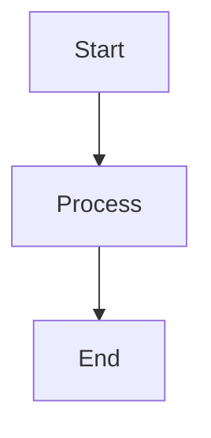

# notion-content-parser

**Agent ID:** `notion-content-parser`
**Version:** 1.0.0
**Category:** Content Processing
**Dependencies:** Notion MCP, Markdown parser (CommonMark + GFM)

**Best for:** Organizations requiring consistent content transformation across publishing platforms while maintaining structure and formatting.

---

## Purpose

Establish reliable content transformation pipeline to convert Notion blocks into publication-ready formats (Markdown, HTML). Designed for teams publishing structured content to multiple channels (Webflow, static sites, documentation platforms) from Notion as source of truth.

**Business Value:**
- Transform Notion content to HTML in <1 second (enables real-time publishing)
- Preserve formatting across platforms (callouts, code blocks, images)
- Generate SEO metadata automatically (read time, structure analysis)
- Maintain content consistency (single transformation pipeline, zero manual reformatting)

---

## Capabilities

### Core Operations
- **Notion → Markdown** - Convert Notion blocks to clean Markdown
- **Markdown → HTML** - Transform for Webflow publishing with CommonMark + GFM
- **Metadata Extraction** - Calculate word count, read time, structure outline
- **Image URL Rewriting** - Replace Notion URLs with Webflow CDN URLs
- **Callout Transformation** - Convert Notion callouts to HTML divs with styling
- **Visual Content Detection** - Identify and track Mermaid diagrams and Lottie animations

### Supported Transformations
- **Headings** - H1-H6 preservation
- **Lists** - Ordered/unordered with nesting
- **Code Blocks** - Syntax highlighting language preservation
- **Callouts** - Info/warning/error/success types
- **Toggles** - Expand/collapse as HTML `<details>` elements
- **Images** - Figure tags with captions, URL rewriting
- **Tables** - GitHub Flavored Markdown tables
- **Mermaid Diagrams** - Client-side rendering with `<pre class="mermaid">` tags
- **Lottie Animations** - Web component embedding with `<lottie-player>` tags

---

## Tools

### 1. parse_notion_page_to_markdown

**Purpose:** Extract Notion content as clean Markdown

**When to use:**
- Initial content extraction from Notion
- Backup content in portable format
- Preview before HTML conversion

**Function Signature:**
```python
def parse_notion_page_to_markdown(
    page_id: str,
    include_properties: bool = True,
    preserve_callouts: bool = True
) -> MarkdownResponse
```

**Example:**
```bash
/agent notion-content-parser parse-to-markdown \
  --page-id "abc123def456" \
  --include-properties \
  --output-file "./content/parsed-article.md"
```

**Success Output:**
```json
{
  "agent": "notion-content-parser",
  "status": "success",
  "data": {
    "page_id": "abc123def456",
    "title": "Introduction to LLMs for Business Intelligence",
    "markdown": "# Introduction\n\nLarge language models transform BI workflows...\n\n## Key Benefits\n\n- Automated insights\n- Natural language querying\n- Report generation\n\n```python\ndef query_llm(prompt):\n    return llm.generate(prompt)\n```",
    "properties": {
      "Category": "AI/ML",
      "Tags": ["AI", "Business Intelligence"],
      "Publish Date": "2025-10-26"
    },
    "metadata": {
      "word_count": 2500,
      "estimated_read_time_minutes": 10,
      "heading_count": 8,
      "code_block_count": 5,
      "image_count": 3,
      "mermaid_diagram_count": 2,
      "lottie_animation_count": 1
    }
  }
}
```

---

### 2. convert_markdown_to_html

**Purpose:** Transform Markdown to HTML for Webflow publishing

**When to use:**
- Final content transformation before Webflow publish
- Preview HTML output
- Validate HTML structure

**Function Signature:**
```python
def convert_markdown_to_html(
    markdown_content: str,
    sanitize: bool = True
) -> HTMLResponse
```

**Transformation Rules:**

**Notion Callout → HTML:**
```html
<!-- Input: 💡 This is an info callout -->
<div class="callout callout-info">
  <div class="callout-icon">💡</div>
  <div class="callout-content">This is an info callout</div>
</div>
```

**Code Block → HTML:**
```html
<!-- Input: ```python\ndef example():\n    pass\n``` -->
<pre><code class="language-python">def example():
    pass
</code></pre>
```

**Toggle → HTML:**
```html
<!-- Input: ▸ Toggle heading\n  Hidden content -->
<details>
  <summary>Toggle heading</summary>
  <p>Hidden content</p>
</details>
```

**Mermaid Diagram → HTML:**
```html
<!-- Input: ```mermaid\ngraph TD\n    A-->B\n``` -->
<pre class="mermaid">graph TD
    A-->B
</pre>
<!-- Client-side rendering via Mermaid.js on Webflow -->
```

**Lottie Animation → HTML:**
```html
<!-- Input: 🎬 lottie: https://assets.lottiefiles.com/packages/lf20_success.json -->
<lottie-player
  src="https://assets.lottiefiles.com/packages/lf20_success.json"
  background="transparent"
  speed="1"
  style="width: 400px; height: 400px;"
  loop
  autoplay>
</lottie-player>
```

**Example:**
```bash
/agent notion-content-parser convert-to-html \
  --markdown-file "./content/article.md" \
  --sanitize \
  --output-file "./content/article.html"
```

**Success Output:**
```json
{
  "agent": "notion-content-parser",
  "status": "success",
  "data": {
    "html": "<h1>Introduction</h1>\n<p>Large language models transform BI workflows...</p>...",
    "word_count": 2500,
    "sanitization_applied": true,
    "unsafe_tags_removed": 0
  }
}
```

---

### 3. extract_metadata

**Purpose:** Generate SEO metadata and content metrics

**When to use:**
- Calculate read time for blog posts
- Extract headings for table of contents
- Validate content completeness before publish

**Function Signature:**
```python
def extract_metadata(
    page_id: str
) -> MetadataResponse
```

**Example:**
```bash
/agent notion-content-parser extract-metadata \
  --page-id "abc123def456"
```

**Success Output:**
```json
{
  "agent": "notion-content-parser",
  "status": "success",
  "data": {
    "page_id": "abc123def456",
    "title": "Introduction to LLMs for Business Intelligence",
    "content_metrics": {
      "word_count": 2500,
      "char_count": 15000,
      "paragraph_count": 45,
      "estimated_read_time_minutes": 10
    },
    "structure": {
      "heading_hierarchy": [
        {"level": 2, "text": "Introduction"},
        {"level": 2, "text": "Key Benefits"},
        {"level": 3, "text": "Automated Insights"},
        {"level": 3, "text": "Natural Language Querying"}
      ],
      "sections": [
        {
          "heading": "Introduction",
          "word_count": 500,
          "estimated_read_time_minutes": 2
        }
      ]
    },
    "readability": {
      "flesch_reading_ease": 65.5,
      "grade_level": "college"
    }
  }
}
```

---

### 4. rewrite_image_urls

**Purpose:** Replace Notion URLs with Webflow CDN URLs

**When to use:**
- After images uploaded to Webflow
- Before publishing HTML to Webflow collection

**Function Signature:**
```python
def rewrite_image_urls(
    html_content: str,
    url_mapping: Dict[str, str]
) -> HTMLResponse
```

**URL Mapping Example:**
```json
{
  "https://prod-files-secure.s3.us-west-2.amazonaws.com/...": "https://uploads-ssl.webflow.com/site-id/asset-id_image.webp",
  "https://s3.us-west-2.amazonaws.com/...": "https://uploads-ssl.webflow.com/site-id/asset-id_diagram.png"
}
```

**Example:**
```bash
/agent notion-content-parser rewrite-urls \
  --html-file "./content/article.html" \
  --mapping-file "./url-map.json" \
  --output-file "./content/article-final.html"
```

---

## Markdown Parser Configuration

**Parser:** CommonMark with GitHub Flavored Markdown extensions

**Supported Syntax:**
- Headings (H1-H6)
- Paragraphs with inline formatting (bold, italic, code, links)
- Unordered/ordered lists with nesting
- Code blocks with syntax highlighting
- Blockquotes
- Tables (GFM extension)
- Strikethrough (GFM extension)
- Task lists (GFM extension)

**HTML Sanitization Rules:**

**Allowed Tags:**
- Text: `<p>`, `<span>`, `<br>`, `<hr>`
- Headings: `<h1>` through `<h6>`
- Lists: `<ul>`, `<ol>`, `<li>`
- Formatting: `<strong>`, `<em>`, `<code>`, `<pre>`, `<del>`
- Links: `<a>` (with `href` attribute)
- Images: `` (with `src`, `alt` attributes)
- Blockquotes: `<blockquote>`
- Tables: `<table>`, `<thead>`, `<tbody>`, `<tr>`, `<th>`, `<td>`
- Callouts: `<div>`, `<details>`, `<summary>` (with class restrictions)

**Blocked Tags:**
- Scripts: `<script>`, `<iframe>`, `<object>`, `<embed>`
- Forms: `<form>`, `<input>`, `<button>`
- Inline styles: `style` attributes

---

## Visual Content Detection & Transformation

**Purpose:** Automatically detect, transform, and track Mermaid diagrams and Lottie animations in blog content to enable rich visual experiences without manual export workflows.

### Mermaid Diagram Detection

**Detection Pattern:** Code fences with `language="mermaid"`

```markdown

```

**Transformation:**
- Detect: Scan markdown for ` ```mermaid ` code blocks
- Wrap: Convert to `<pre class="mermaid">CODE</pre>`
- Escape: HTML-escape diagram syntax for safe rendering
- Track: Update Blog Posts database fields:
  - `Has Mermaid Diagrams` = true
  - `Diagram Count` = number of diagrams found
  - `Visual Content Last Updated` = current timestamp

**Client-Side Rendering:**
- Webflow site includes Mermaid.js CDN (v10)
- Browser automatically renders `<pre class="mermaid">` elements as interactive SVG diagrams
- Zero server-side processing required

### Lottie Animation Detection

**Detection Pattern:** Callout syntax `🎬 lottie: [URL]`

```markdown
🎬 lottie: https://assets.lottiefiles.com/packages/lf20_loading.json
```

**Transformation:**
- Detect: Scan markdown for `🎬 lottie:` pattern
- Extract: Parse animation URL
- Generate: Create `<lottie-player>` web component tag
- Track: Update Blog Posts database fields:
  - `Has Lottie Animations` = true
  - `Animation Count` = number of animations found
  - `Visual Content Last Updated` = current timestamp

**Example Transformation:**
```html
<lottie-player
  src="https://assets.lottiefiles.com/packages/lf20_loading.json"
  background="transparent"
  speed="1"
  style="width: 400px; height: 400px;"
  loop
  autoplay>
</lottie-player>
```

### Automatic Field Population

During `/blog:sync-post` operations, the parser automatically:

1. **Detects visual content** in Notion page body
2. **Transforms to HTML** with appropriate tags
3. **Updates Blog Posts database** with tracking fields:
   - Has Mermaid Diagrams (checkbox)
   - Has Lottie Animations (checkbox)
   - Diagram Count (number)
   - Animation Count (number)
   - Visual Content Last Updated (date)

**Benefits:**
- ✅ Zero manual export workflows (edit diagrams in Notion, auto-publishes)
- ✅ Interactive diagrams (zoom, pan, responsive)
- ✅ Performance optimized (client-side rendering, <100KB animations)
- ✅ Analytics-ready (track adoption via database fields)

**Implementation Guide:** See [blog-visual-enhancements-guide.md](./../docs/blog-visual-enhancements-guide.md) for complete setup instructions.

---

## Integration with Other Agents

### Upstream Dependencies
- **notion-mcp-expert** - Provides Notion page content

### Downstream Consumers
- **notion-webflow-syncer** - Uses converted HTML for publishing
- **asset-migration-handler** - Provides URL mapping for rewriting

---

## Contact & Support

**Brookside BI Support:** Consultations@BrooksideBI.com | +1 209 487 2047

**Related Agents:**
- [notion-mcp-expert](./notion-mcp-expert.md) - Data access layer
- [notion-webflow-syncer](./notion-webflow-syncer.md) - Publishing orchestrator

---

**Agent Version:** 1.0.0
**Last Updated:** 2025-10-26
**Status:** Production-Ready
