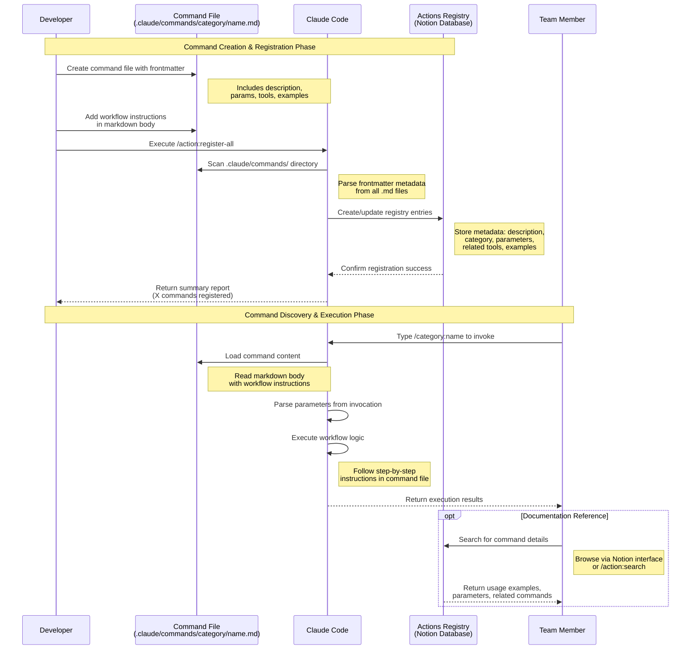

# Slash Commands - Brookside BI Innovation Nexus

**Best for**: Organizations seeking streamlined innovation workflows through repeatable, structured operations designed to drive measurable outcomes while maintaining cost transparency and knowledge preservation.

## Quick Start

After restarting Claude Code, these commands become available for immediate use:

```bash
# Capture new innovation opportunity
/innovation:new-idea Automated deployment pipeline for Power BI reports

# Analyze software spending
/cost:analyze

# Archive completed work with learnings
/knowledge:archive "Cost Dashboard MVP" build

# Assign work to team members
/team:assign "Azure integration research" research
```

## Available Commands

**Total: 49 Commands Across 15 Functional Categories**

| Category | Commands | Key Use Cases |
|----------|----------|---------------|
| Innovation Workflow | 4 | Idea capture, research initiation, project planning |
| Cost Management | 13 | Financial analysis, spend optimization, vendor consolidation |
| Knowledge Management | 1 | Work archival, learnings documentation |
| Team Workflow | 1 | Work assignment, specialization routing |
| Agent Activity Tracking | 5 | Session logging, activity reports, Notion sync |
| Autonomous Operations | 2 | Automated pipelines, deployment orchestration |
| Repository Intelligence | 4 | GitHub analysis, pattern extraction, cost calculation |
| Style Testing & Analysis | 3 | Output quality optimization, comparative testing |
| Documentation Management | 3 | Multi-file updates, diagram generation, PR creation |
| DSP Commands | 3 | Demo environment management, deployment |
| Build Management | 3 | Build lifecycle, software linking, status tracking |
| Idea Management | 3 | Idea search, creation, viability assessment |
| Research Management | 2 | Findings updates, research completion |
| Compliance & Auditing | 1 | Audit trail generation, governance reporting |
| Actions Registry META | 1 | Centralized action registration |

---

### Innovation Workflow (4 Commands)

Commands designed to streamline the capture and progression of innovation opportunities through structured lifecycle stages.

| Command | Purpose | Example |
|---------|---------|---------|
| `/innovation:new-idea` | Capture and structure innovation opportunities with viability assessment | `/innovation:new-idea AI-powered cost tracking dashboard` |
| `/innovation:start-research` | Begin feasibility investigation with research team assignment | `/innovation:start-research "Cost tracking automation" "Cost Dashboard Idea"` |
| `/innovation:project-plan` | Create comprehensive project plans for Innovation Nexus initiatives | `/innovation:project-plan "Cost Dashboard" --phase=research` |
| `/innovation:orchestrate-complex` | Orchestrate multi-phase innovation workflows | `/innovation:orchestrate-complex "Enterprise BI Platform"` |

**Best for**: Organizations managing innovation portfolios requiring structured progression from concept through execution while maintaining cost transparency and knowledge preservation.

---

### Cost Management (13 Commands)

Comprehensive financial analysis and tracking commands that drive measurable cost optimization across software portfolios.

| Command | Purpose | Example |
|---------|---------|---------|
| `/cost:analyze` | Comprehensive spend analysis with optimization recommendations | `/cost:analyze active` |
| `/cost:monthly-spend` | Calculate total monthly software expenditure | `/cost:monthly-spend` |
| `/cost:annual-projection` | Project annual costs with trend analysis | `/cost:annual-projection` |
| `/cost:cost-by-category` | Break down spending by software category | `/cost:cost-by-category` |
| `/cost:unused-software` | Identify tools with no active usage for potential savings | `/cost:unused-software` |
| `/cost:consolidation-opportunities` | Find overlapping tools for vendor consolidation | `/cost:consolidation-opportunities` |
| `/cost:expiring-contracts` | Track contracts expiring in next 60 days | `/cost:expiring-contracts` |
| `/cost:build-costs` | Calculate total software costs for specific builds | `/cost:build-costs "Cost Dashboard MVP"` |
| `/cost:research-costs` | Calculate software costs for research projects | `/cost:research-costs "ML Feasibility Study"` |
| `/cost:what-if-analysis` | Model cost impact of adding/removing software | `/cost:what-if-analysis add "Azure OpenAI" 200` |
| `/cost:cost-impact` | Analyze cost impact of specific changes | `/cost:cost-impact "Power BI Premium upgrade"` |
| `/cost:microsoft-alternatives` | Find Microsoft ecosystem replacements for third-party tools | `/cost:microsoft-alternatives "Notion"` |
| `/cost:add-software` | Add software to cost tracker with relations | `/cost:add-software "Terraform" 0 "IaC"` |

**Best for**: Organizations seeking to optimize software portfolios through data-driven decision making, vendor consolidation, and sustainable cost management practices.

---

### Knowledge Management (1 Command)

Commands that preserve institutional knowledge and document learnings from completed work for future reference and pattern reuse.

| Command | Purpose | Example |
|---------|---------|---------|
| `/knowledge:archive` | Complete work lifecycle with learnings documentation | `/knowledge:archive "Cost Dashboard MVP" build` |

**Best for**: Teams committed to building knowledge repositories that prevent redundant work and accelerate future innovation through documented patterns and lessons learned.

---

### Team Workflow (1 Command)

Commands that streamline work assignment based on team member specializations and workload capacity.

| Command | Purpose | Example |
|---------|---------|---------|
| `/team:assign` | Route work based on specialization and availability | `/team:assign "Azure OpenAI integration" build` |

**Best for**: Distributed teams requiring systematic work distribution that balances workload while matching tasks to expertise areas.

---

### Agent Activity Tracking (5 Commands)

Commands that establish comprehensive activity logging across specialized agents, enabling work visibility, session tracking, and deliverable documentation.

| Command | Purpose | Example |
|---------|---------|---------|
| `/agent:log-activity` | Track agent work sessions with deliverables and metrics | `/agent:log-activity @build-architect completed "Architecture design"` |
| `/agent:activity-summary` | Generate activity reports across agent sessions | `/agent:activity-summary --agent=build-architect --timeframe=30d` |
| `/agent:sync-notion-logs` | Sync logged activity to Agent Activity Hub | `/agent:sync-notion-logs` |
| `/agent:process-queue` | Process queued log entries with batch logic | `/agent:process-queue --batch-size=10` |
| `/agent:assign-work` | Route work to specialized agents based on capabilities | `/agent:assign-work "ML research" research` |

**Best for**: Organizations requiring transparency into AI agent contributions, session metrics, and deliverable tracking for governance and operational visibility.

---

### Autonomous Operations (2 Commands)

Commands that enable autonomous innovation pipelines from high-viability ideas through Azure deployment with minimal human intervention.

| Command | Purpose | Example |
|---------|---------|---------|
| `/autonomous:enable-idea` | Enable 40-60 min autonomous workflow from research to deployment | `/autonomous:enable-idea "Cost Dashboard"` |
| `/autonomous:status` | Display real-time autonomous pipeline status and progress | `/autonomous:status` |

**Best for**: Teams seeking to accelerate time-to-deployment for high-viability innovations through automated research, architecture, and deployment workflows.

---

### Repository Intelligence (4 Commands)

Commands that provide comprehensive GitHub portfolio analysis, pattern extraction, and cost calculation across organizational repositories.

| Command | Purpose | Example |
|---------|---------|---------|
| `/repo:scan-org` | Scan all GitHub organization repositories with viability assessment | `/repo:scan-org --sync --deep` |
| `/repo:analyze` | Analyze single repository with comprehensive assessment | `/repo:analyze "dsp-command-central" --sync` |
| `/repo:extract-patterns` | Extract cross-repository architectural patterns for reusability | `/repo:extract-patterns --min-usage=3 --sync` |
| `/repo:calculate-costs` | Calculate portfolio-wide software costs with optimization recommendations | `/repo:calculate-costs --detailed` |

**Best for**: Organizations managing large repository portfolios requiring centralized visibility, pattern reuse, and cost optimization across development initiatives.

---

### Style Testing & Analysis (3 Commands)

Commands that test agent output styles, compare effectiveness, and generate performance analytics for continuous improvement.

| Command | Purpose | Example |
|---------|---------|---------|
| `/style:test-agent-style` | Test agent+style combinations with effectiveness metrics | `/style:test-agent-style build-architect technical-deep --ultrathink` |
| `/style:compare` | Side-by-side style comparison for same agent+task | `/style:compare build-architect "Database design" --ultrathink` |
| `/style:report` | Generate performance analytics reports for output styles | `/style:report --agent=build-architect --timeframe=30d` |

**Best for**: Teams optimizing agent output quality through systematic style testing, comparative analysis, and data-driven style selection.

---

### Documentation Management (3 Commands)

Commands that manage comprehensive documentation through intelligent parallel agent orchestration, automated diagram generation, and systematic quality enforcement.

| Command | Purpose | Example |
|---------|---------|---------|
| `/docs:sync-notion` | Sync documentation to Notion workspace | `/docs:sync-notion` |
| `/docs:update-simple` | Update single documentation file with basic changes | `/docs:update-simple README.md "Add installation section"` |
| `/docs:update-complex` | Update multi-file documentation with diagrams, validation, and PRs | `/docs:update-complex .claude/docs "Update agent guidelines" --diagrams --create-pr` |

**Best for**: Organizations requiring automated documentation maintenance across complex file hierarchies with architectural diagram generation and quality validation.

---

### DSP (Deployment Support Package) Commands (3 Commands)

Commands specific to managing DSP demo environments, Notion synchronization, and deployment orchestration.

| Command | Purpose | Example |
|---------|---------|---------|
| `/dsp:demo-prep` | Prepare comprehensive demo environment and materials | `/dsp:demo-prep "Q4 Sales Demo"` |
| `/dsp:sync-notion` | Sync DSP data and status to Notion tracking | `/dsp:sync-notion` |
| `/dsp:deploy-demo` | Deploy DSP demo environment to Azure | `/dsp:deploy-demo "production"` |

**Best for**: Teams managing demonstration environments requiring coordinated deployment, data synchronization, and presentation material preparation.

---

### Build Management (3 Commands)

Commands that streamline build lifecycle operations including software linking, creation, and status progression.

| Command | Purpose | Example |
|---------|---------|---------|
| `/build:link-software` | Link software dependencies to builds for cost tracking | `/build:link-software "Cost Dashboard MVP" "Power BI,Azure SQL"` |
| `/build:create` | Create new build entry with GitHub repo and team assignment | `/build:create "ML Model API" mvp` |
| `/build:update-status` | Update build status and progression through lifecycle | `/build:update-status "Cost Dashboard MVP" "In Testing"` |

**Best for**: Development teams tracking build lifecycles with accurate software cost attribution and status visibility.

---

### Idea Management (3 Commands)

Commands focused on idea capture, search, and viability assessment within the innovation pipeline.

| Command | Purpose | Example |
|---------|---------|---------|
| `/idea:search` | Search existing ideas to prevent duplicates | `/idea:search "cost tracking"` |
| `/idea:create` | Create new idea with champion and viability scoring | `/idea:create "Automated reporting pipeline"` |
| `/idea:assess` | Assess idea viability with structured scoring framework | `/idea:assess "Cost Dashboard" --detailed` |

**Best for**: Organizations capturing innovation opportunities systematically while preventing duplicate efforts through comprehensive search and assessment.

---

### Research Management (2 Commands)

Commands that manage research lifecycle including findings updates and completion workflows.

| Command | Purpose | Example |
|---------|---------|---------|
| `/research:update-findings` | Update research findings and progress documentation | `/research:update-findings "ML Feasibility" "Completed spike testing"` |
| `/research:complete` | Complete research with final viability score and recommendations | `/research:complete "Cost Tracking Automation"` |

**Best for**: Research teams documenting investigation progress and delivering actionable recommendations with quantified viability assessments.

---

### Compliance & Auditing (1 Command)

Commands that establish compliance tracking and audit trail generation for governance requirements.

| Command | Purpose | Example |
|---------|---------|---------|
| `/compliance:audit` | Generate compliance audit reports across innovation lifecycle | `/compliance:audit --scope=all --output=detailed` |

**Best for**: Organizations with compliance requirements needing comprehensive audit trails across innovation, cost, and knowledge management operations.

---

### Actions Registry META System (1 Command)

Commands that manage the centralized Actions Registry for automated workflow orchestration.

| Command | Purpose | Example |
|---------|---------|---------|
| `/action:register-all` | Register all slash commands to Actions Registry for orchestration | `/action:register-all` |

**Best for**: System administrators managing workflow automation infrastructure requiring centralized action registration and orchestration capabilities.

---

## Command Lifecycle Visualization

The following diagram illustrates how slash commands progress from developer creation through team member execution, highlighting the role of frontmatter metadata and Notion Actions Registry integration for centralized command discovery.

**Sequence Diagram: Complete Command Lifecycle**



*Figure 2: Slash command lifecycle showing creation, registration via `/action:register-all`, and execution phases. The Actions Registry serves as the centralized metadata repository enabling team-wide command discovery and semantic search capabilities.*

**Key Lifecycle Phases**:

1. **Creation Phase**: Developer creates `.md` file with YAML frontmatter containing business description, allowed tools, and parameter hints
2. **Registration Phase**: `/action:register-all` scans command files, parses metadata, and populates Notion Actions Registry database
3. **Discovery Phase**: Team members search registry for relevant commands using semantic search or browse by category
4. **Execution Phase**: Claude Code loads command file, parses parameters, executes workflow instructions, and returns results

**Business Value**: Establishes self-documenting command infrastructure that drives measurable improvements in team onboarding efficiency and eliminates manual documentation maintenance through automated synchronization workflows.

---

## Command Structure

Each command follows consistent patterns for predictable, reliable execution:

### Frontmatter
Commands include metadata that controls behavior:

```yaml
---
description: Business-focused summary (appears in /help)
allowed-tools: Tool1(pattern:*), Tool2(pattern:*)
argument-hint: [expected parameters]
model: claude-sonnet-4-5-20250929
---
```

### Workflow Pattern
All commands follow this structure:

1. **Search existing content** - Prevent duplicates
2. **Fetch context** - Understand current state
3. **Execute operation** - Create/update with proper linking
4. **Verify and report** - Confirm success, suggest next steps

### Parameter Passing

**Simple parameters** - Use `$ARGUMENTS` for single input:
```bash
/innovation:new-idea This is the complete idea description
# $ARGUMENTS = "This is the complete idea description"
```

**Multiple parameters** - Use positional `$1`, `$2`, `$3`:
```bash
/knowledge:archive "Cost Dashboard" build
# $1 = "Cost Dashboard"
# $2 = "build"
```

**Default values** - Commands provide sensible defaults:
```bash
/cost:analyze
# Defaults to scope = "all"

/cost:analyze unused
# Overrides scope to "unused"
```

## Agent Integration

Commands delegate complex workflows to specialized agents from `.claude/agents/`:

- **@ideas-capture** - Innovation opportunity structuring
- **@cost-analyst** - Financial analysis and optimization
- **@archive-manager** - Lifecycle completion and knowledge preservation
- **@workflow-router** - Team assignment and workload balancing
- **@knowledge-curator** - Knowledge Vault curation
- **@build-architect** - Technical documentation and build structuring
- **@research-coordinator** - Research management and feasibility studies

Commands invoke agents using explicit syntax:
```markdown
Invoke @cost-analyst agent to execute comprehensive cost analysis:
1. Query Software Tracker...
2. Calculate spending metrics...
```

## Namespace Organization

Commands are organized by functional area in subdirectories:

```
.claude/commands/
├── innovation/     # Idea, research, build workflows
├── cost/           # Financial analysis and tracking
├── knowledge/      # Documentation and archival
└── team/           # Assignment and workload management
```

**Invocation syntax**: `/category:command-name`

Example: `/innovation:new-idea` executes `innovation/new-idea.md`

## Usage Examples

### Complete Innovation Lifecycle

```bash
# 1. Capture initial idea
/innovation:new-idea Automated cost tracking dashboard for software spend
# Output: Created idea with champion assignment, cost estimate, next steps

# 2. Start research
/innovation:start-research "Cost tracking automation feasibility" "Automated cost tracking dashboard"
# Output: Research entry with team, documentation links, cost tracking

# 3. Create build
/build:create "Cost Dashboard MVP" mvp
# Output: Build entry with GitHub link, technical docs, team assignments, total cost

# 4. Link software dependencies
/build:link-software "Cost Dashboard MVP" "Power BI,Azure SQL,GitHub"
# Output: Software linked with cost attribution and rollup calculations

# 5. Archive when complete
/knowledge:archive "Cost Dashboard MVP" build
# Output: Archived with Knowledge Vault entry, preserved links, learnings documented
```

### Quarterly Cost Review

```bash
# 1. Overall analysis
/cost:analyze
# Output: Total spend, top expenses, optimization opportunities, category breakdown

# 2. Find unused software
/cost:analyze unused
# Output: Tools with no active work, potential savings

# 3. Check expiring contracts
/cost:analyze expiring
# Output: Renewals needed in next 60 days, decision deadlines
```

### Team Workload Management

```bash
# 1. Assign new work
/team:assign "Azure OpenAI integration for Power BI" build
# Output: Recommended team member with rationale, workload status, alternatives

# 2. Check team workload (once implemented)
/team:workload
# Output: Full team distribution, overloaded members, recommendations
```

## Best Practices

### DO: Effective Command Usage

1. **Use consistent formatting** when passing parameters
   - Quote multi-word parameters: `/command "parameter with spaces"`
   - Provide complete context in descriptions

2. **Review command output** for next steps
   - Commands suggest follow-up actions
   - Look for cost impacts and optimization opportunities

3. **Leverage command chaining** for complete workflows
   - `/innovation:new-idea` → `/innovation:start-research` → `/innovation:create-build` → `/knowledge:archive`

4. **Check verification steps** to confirm success
   - Commands include validation queries
   - Use `/notion:search` to verify entries created

5. **Trust agent delegation**
   - Commands invoke specialized agents for complex workflows
   - Agents apply consistent patterns and brand voice

### DON'T: Common Mistakes

1. **Don't skip parameters** when required
   - Check `argument-hint` in `/help` for expected format
   - Use quotes for multi-word parameters

2. **Don't create duplicates**
   - Commands search existing content first
   - Review matches before proceeding

3. **Don't ignore cost implications**
   - Commands display cost impacts
   - Link software/tools for accurate tracking

4. **Don't forget to archive**
   - Use `/knowledge:archive` when work completes
   - Preserve learnings for future reference

## Getting Help

```bash
# View all available commands with descriptions
/help

# View documentation for specific command (once implemented)
/help innovation:new-idea
```

## Creating Custom Commands

See `SLASH_COMMANDS_GUIDE.md` for comprehensive guide on:

- Command structure standards
- Frontmatter configuration
- Parameter passing conventions
- Agent integration patterns
- Brookside BI brand voice application
- Testing and validation procedures

## Roadmap

**Implementation Status**: 49 commands fully operational across 15 functional categories.

### Completed Implementations (49 Commands)

**Phase 1: Core Innovation Workflow** ✅ COMPLETE
- ✅ `/innovation:new-idea` - Idea capture with viability assessment
- ✅ `/innovation:start-research` - Research initiation with team assignment
- ✅ `/innovation:project-plan` - Comprehensive project planning
- ✅ `/innovation:orchestrate-complex` - Multi-phase workflow orchestration

**Phase 2: Cost Management Excellence** ✅ COMPLETE
- ✅ 13 cost commands operational (analyze, monthly-spend, annual-projection, cost-by-category, unused-software, consolidation-opportunities, expiring-contracts, build-costs, research-costs, what-if-analysis, cost-impact, microsoft-alternatives, add-software)
- Provides comprehensive financial visibility and optimization capabilities

**Phase 3: Build & Idea Management** ✅ COMPLETE
- ✅ `/build:create`, `/build:link-software`, `/build:update-status`
- ✅ `/idea:create`, `/idea:search`, `/idea:assess`
- ✅ `/research:update-findings`, `/research:complete`

**Phase 4: Advanced Operations** ✅ COMPLETE
- ✅ Autonomous pipeline (`/autonomous:enable-idea`, `/autonomous:status`)
- ✅ Repository intelligence (4 repo commands)
- ✅ Agent activity tracking (5 agent commands)
- ✅ Style testing & analysis (3 style commands)

**Phase 5: Infrastructure & Specialized** ✅ COMPLETE
- ✅ Documentation management (3 docs commands)
- ✅ DSP operations (3 dsp commands)
- ✅ Compliance auditing (`/compliance:audit`)
- ✅ Actions Registry META (`/action:register-all`)

---

### Future Enhancements (Planned)

**Knowledge Operations** (Q1 2026)
- `/knowledge:document` - Manual Knowledge Vault entry
- `/knowledge:search` - Semantic search across vault
- `/knowledge:suggest` - Related content recommendations

**Team Collaboration** (Q2 2026)
- `/team:workload` - Workload visualization across members
- `/team:reassign` - Dynamic work redistribution
- `/team:report` - Automated status reporting

**Cost Optimization** (Q2 2026)
- `/cost:optimize` - Interactive optimization workflow
- `/cost:forecast` - Multi-year budget projection with trend analysis

**Notion Operations** (Q3 2026)
- `/notion:search` - Cross-database semantic search
- `/notion:sync-databases` - Database ID refresh and validation
- `/notion:backup` - Workspace backup and recovery

## Support

Questions or issues with commands:

- Review: `SLASH_COMMANDS_GUIDE.md` for detailed documentation
- Check: Project CLAUDE.md for agent descriptions and workflows
- Contact: Consultations@BrooksideBI.com

---

**Brookside BI Innovation Nexus - Streamline Workflows Through Structured Commands**

Designed for organizations scaling innovation management across teams, these commands establish sustainable practices that drive measurable outcomes while maintaining cost transparency and knowledge preservation.
