# /integration:register

**Category**: Integration Management
**Related Databases**: Integration Registry

## Purpose

Establish systematic integration registration to maintain comprehensive system connectivity inventory and drive operational visibility across your integration ecosystem.

**Best for**: Organizations managing multiple API integrations, webhooks, MCP servers, and Azure services that require centralized tracking, authentication management, and dependency mapping to support sustainable multi-system operations.

---

## Parameters

- `integration-name` - Integration identifier
- `type` - Integration type (api | webhook | mcp-server | azure-service)
- `--endpoint=url` - API endpoint
- `--auth-method=value` - Authentication method

---

## Registration Workflow

**Visual Process Overview**:

```mermaid
sequenceDiagram
    participant User as User/Agent
    participant Cmd as /integration:register
    participant Search as Notion Search
    participant Registry as Integration Registry
    participant Validation as Validation Layer

    User->>Cmd: Invoke with integration details
    Note over User,Cmd: Parameters: name, type,<br/>endpoint, auth-method

    Cmd->>Search: Search for duplicate integration
    Search-->>Cmd: Return existing entries

    alt Duplicate Found
        Cmd->>User: ⚠️ Integration already registered
        Cmd->>User: Return existing entry details
    else No Duplicate
        Cmd->>Validation: Validate parameters
        Validation-->>Cmd: ✓ Parameters valid

        Cmd->>Registry: Create new integration entry
        Note over Registry: Properties:<br/>- Integration Name<br/>- Type (API/Webhook/MCP/Azure)<br/>- Endpoint URL<br/>- Auth Method<br/>- Status: 🟢 Active

        Registry-->>Cmd: ✓ Entry created
        Cmd->>User: ✅ Integration registered successfully
        Cmd->>User: Return Notion page URL
    end

    Note over User,Registry: Integration now tracked<br/>for dependency mapping
```



*Figure: Integration registration workflow with duplicate detection, parameter validation, and automatic status tracking to support operational visibility.*

---

## Implementation

```javascript
await notionCreatePages({
  parent: { data_source_id: '[INTEGRATION_REGISTRY_ID]' },
  pages: [{
    properties: {
      "Integration Name": integrationName,
      "Type": typeMap[type],
      "Endpoint": endpointFlag,
      "Auth Method": authMethodFlag,
      "Status": '🟢 Active'
    }
  }]
});
```

---

## Examples

### API Integration Registration

```bash
# Register Azure OpenAI API with authentication details
/integration:register "Azure OpenAI API" api --endpoint="https://openai.azure.com" --auth-method="Azure Key"

# Register Microsoft Graph API
/integration:register "Microsoft Graph API" api --endpoint="https://graph.microsoft.com/v1.0" --auth-method="OAuth 2.0"
```

### Webhook Integration Registration

```bash
# Register Notion webhook for real-time updates
/integration:register "Notion Database Webhook" webhook --endpoint="https://notion-webhook-brookside.azurewebsites.net/api/NotionWebhook" --auth-method="Shared Secret"
```

### MCP Server Registration

```bash
# Register custom MCP server for specialized operations
/integration:register "Azure MCP Server" mcp-server --endpoint="npx -y @azure/mcp-server-azure" --auth-method="Azure CLI Credential"
```

### Azure Service Registration

```bash
# Register Azure Key Vault integration
/integration:register "Azure Key Vault - Brookside Secrets" azure-service --endpoint="https://kv-brookside-secrets.vault.azure.net" --auth-method="Managed Identity"
```

---

## Expected Outcomes

**Successful Registration**:
1. ✅ New entry created in Integration Registry database
2. ✅ Integration assigned 🟢 Active status
3. ✅ Notion page URL returned for reference
4. ✅ Integration now visible in dependency mapping queries
5. ✅ Authentication method documented for security review

**Duplicate Detection**:
- ⚠️ If integration name already exists, command returns existing entry details
- No duplicate entries created (maintains data integrity)
- User notified to update existing entry if needed

---

## Verification Steps

**Validate Successful Registration**:

```bash
# 1. Search Integration Registry for newly registered integration
/notion:search "Azure OpenAI API" --database="Integration Registry"

# 2. Verify integration properties
# - Integration Name matches input
# - Type correctly mapped (api, webhook, mcp-server, azure-service)
# - Endpoint URL stored accurately
# - Auth Method documented
# - Status = 🟢 Active

# 3. Check dependency relationships
# - Integration available for linking to Example Builds
# - Integration visible in Software Tracker relations
```

**Common Issues & Solutions**:

| Issue | Cause | Solution |
|-------|-------|----------|
| Duplicate entry error | Integration name already exists | Use `/notion:search` to find existing entry and update properties |
| Invalid type parameter | Type not in allowed list | Use one of: api, webhook, mcp-server, azure-service |
| Missing endpoint | --endpoint flag omitted | Provide full endpoint URL with protocol (https://) |
| Authentication method unclear | --auth-method not specified | Document auth method: OAuth 2.0, API Key, Managed Identity, etc. |

---

**Last Updated**: 2025-10-26
