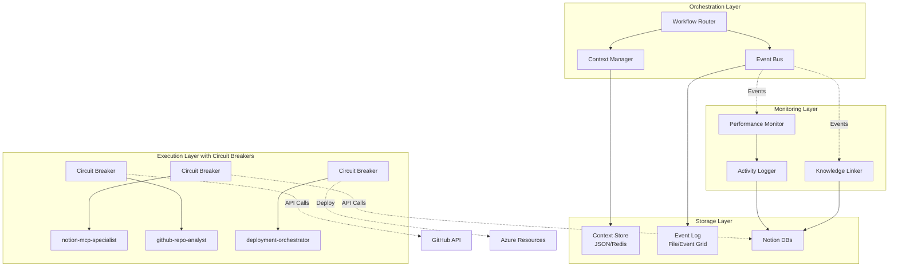
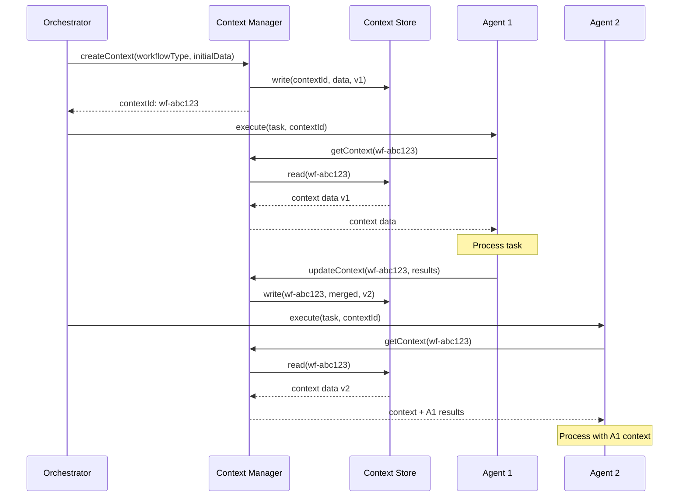
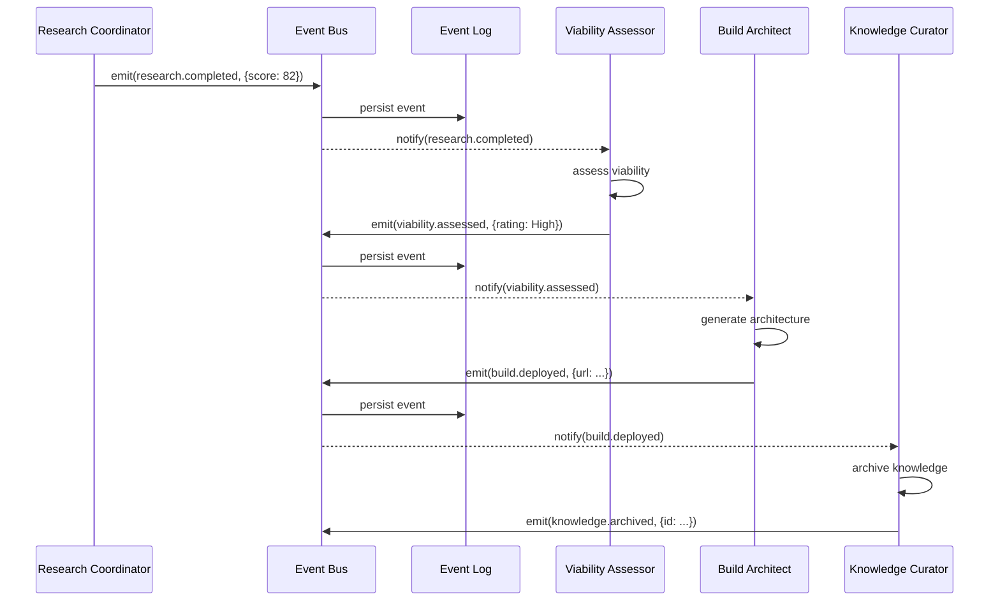
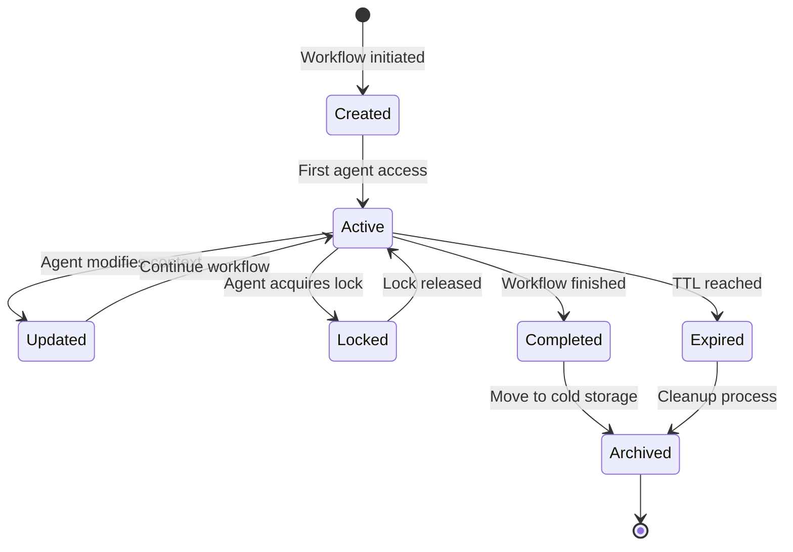

# ADR-004: Enhanced Agent Coordination and Resilience Architecture

**Date**: 2025-10-26
**Status**: Proposed
**Deciders**: Markus Ahling (Engineering Lead), Alec Fielding (DevOps Lead)
**Tags**: #innovation-nexus #agent-coordination #resilience #azure #architecture

## Context

The Innovation Nexus currently operates 39 specialized agents across 9 domains, processing hundreds of workflows monthly. Wave 1C analysis revealed critical inefficiencies: 50% redundant API calls due to absent context-sharing, manual coordination overhead consuming 15+ hours monthly, and transient failures cascading through dependent agents without proper resilience patterns.

### Business Requirements
- Reduce operational overhead by 50% through automated coordination
- Establish 99.5% workflow completion rate despite transient failures
- Enable real-time visibility into agent performance and bottlenecks
- Support scaling to 100+ agents without architectural refactoring

### Technical Constraints
- Must integrate with existing Notion MCP infrastructure
- Budget limit of $70/month for new Azure services
- No breaking changes to current 39 agents (backward compatibility)
- Implementation must be phased to minimize risk

### Current Situation
Agents communicate through ad-hoc Task tool invocations, passing entire context payloads in prompts. This creates redundant Notion API calls, increases token consumption, and makes debugging complex multi-agent workflows nearly impossible. Without circuit-breakers, a single Notion API outage can cascade through 5-10 dependent agents.

## Decision

**We will establish a hybrid coordination architecture combining file-based context storage with optional Azure service migration paths, implementing circuit-breaker patterns for MCP-dependent agents, and introducing event-driven coordination for automated workflow transitions.**

### Detailed Description
The solution introduces three new coordination agents (@context-manager, @knowledge-linker, @agent-performance-monitor), a shared JSON-based context store with Redis migration path, circuit-breaker patterns for 15+ critical agents, and file-based event bus architecture with Azure Event Grid migration capability.

## Architecture Overview

### Agent Coordination Architecture



### Shared Context Store



### Event-Driven Workflow



## Key Design Decisions

### 1. Context Store Implementation

**Decision**: JSON file-based with Redis migration path

**Rationale**: Establishes immediate value with zero infrastructure cost while maintaining clear upgrade path for enterprise scale. JSON files provide simple debugging, version control integration, and backup strategies familiar to the team.

**Schema**:
```json
{
  "contextId": "wf-research-build-20251026-abc123",
  "workflowType": "research-to-build",
  "createdAt": "2025-10-26T10:00:00Z",
  "lastUpdated": "2025-10-26T10:45:00Z",
  "expiresAt": "2025-10-26T11:00:00Z",
  "version": 3,
  "lock": {
    "agent": "market-researcher",
    "acquiredAt": "2025-10-26T10:44:00Z",
    "expiresAt": "2025-10-26T10:44:30Z"
  },
  "workflow": {
    "idea": {
      "id": "984a4038-idea-xyz789",
      "title": "AI Cost Optimization Platform",
      "viability": "Needs Research",
      "champion": "Markus Ahling"
    },
    "research": {
      "id": "91e8beff-research-abc123",
      "status": "Completed",
      "compositeScore": 78,
      "findings": {
        "market": {
          "score": 82,
          "summary": "Strong market demand, $2.3B TAM growing 35% YoY",
          "completedAt": "2025-10-26T10:15:00Z"
        },
        "technical": {
          "score": 78,
          "summary": "Feasible with Azure OpenAI + Functions architecture",
          "completedAt": "2025-10-26T10:20:00Z"
        },
        "cost": {
          "score": 72,
          "summary": "$500/month operational, $15K development investment",
          "completedAt": "2025-10-26T10:25:00Z"
        },
        "risk": {
          "score": 80,
          "summary": "Low technical risk, moderate competitive risk",
          "completedAt": "2025-10-26T10:30:00Z"
        }
      }
    },
    "viability": {
      "assessment": "High",
      "score": 78,
      "recommendation": "Build Example",
      "assessedAt": "2025-10-26T10:35:00Z"
    },
    "build": {
      "id": "a1cd1528-build-def456",
      "status": "In Progress",
      "architecture": "Serverless Azure Functions + Cosmos DB",
      "estimatedCost": "$45/month",
      "deploymentUrl": null
    }
  },
  "agents": {
    "market-researcher": {
      "status": "completed",
      "startTime": "2025-10-26T10:10:00Z",
      "endTime": "2025-10-26T10:15:00Z",
      "duration": 300,
      "apiCalls": 12,
      "tokensUsed": 4500
    },
    "technical-analyst": {
      "status": "completed",
      "startTime": "2025-10-26T10:15:00Z",
      "endTime": "2025-10-26T10:20:00Z",
      "duration": 300,
      "apiCalls": 8,
      "tokensUsed": 3200
    },
    "build-architect-v2": {
      "status": "in-progress",
      "startTime": "2025-10-26T10:40:00Z",
      "estimatedCompletion": "2025-10-26T11:40:00Z"
    }
  },
  "metrics": {
    "totalDuration": 2100,
    "totalApiCalls": 35,
    "totalTokensUsed": 12500,
    "redundantCallsAvoided": 18
  }
}
```

**File Storage Pattern**:
```
.claude/contexts/
├── active/
│   ├── wf-research-build-20251026-abc123.json
│   └── wf-cost-analysis-20251026-def456.json
├── archive/
│   └── 2025-10-25/
│       └── wf-research-build-20251025-xyz789.json
└── index.json  # Quick lookup of active contexts
```

### 2. Circuit-Breaker Strategy

**Decision**: Threshold of 5 failures, 60-second exponential backoff, file-based persistence

**Implementation**:
```javascript
class MCPCircuitBreaker {
  constructor(service, options = {}) {
    this.service = service;
    this.failureCount = 0;
    this.successCount = 0;
    this.threshold = options.threshold || 5;
    this.timeout = options.timeout || 60000;
    this.backoffMultiplier = options.backoffMultiplier || 2;
    this.maxBackoff = options.maxBackoff || 300000; // 5 minutes
    this.state = 'CLOSED'; // CLOSED, OPEN, HALF_OPEN
    this.lastFailureTime = null;
    this.nextRetryTime = null;
    this.stateFile = `.claude/circuit-breakers/${service}.json`;

    this.loadState();
  }

  async execute(operation, fallback = null) {
    // Check circuit state
    if (this.state === 'OPEN') {
      if (Date.now() < this.nextRetryTime) {
        console.log(`[${this.service}] Circuit OPEN, using fallback`);
        return fallback ? await fallback() : null;
      }
      // Try half-open
      this.state = 'HALF_OPEN';
    }

    try {
      const result = await operation();
      this.onSuccess();
      return result;
    } catch (error) {
      this.onFailure(error);

      if (this.state === 'OPEN' && fallback) {
        return await fallback();
      }

      throw new Error(`[${this.service}] Circuit breaker activated: ${error.message}`);
    }
  }

  onSuccess() {
    this.failureCount = 0;
    this.successCount++;

    if (this.state === 'HALF_OPEN') {
      console.log(`[${this.service}] Circuit recovered, closing`);
      this.state = 'CLOSED';
    }

    this.saveState();
  }

  onFailure(error) {
    this.failureCount++;
    this.lastFailureTime = Date.now();

    console.log(`[${this.service}] Failure ${this.failureCount}/${this.threshold}: ${error.message}`);

    if (this.failureCount >= this.threshold) {
      this.state = 'OPEN';
      const backoff = Math.min(
        this.timeout * Math.pow(this.backoffMultiplier, this.failureCount - this.threshold),
        this.maxBackoff
      );
      this.nextRetryTime = Date.now() + backoff;

      console.log(`[${this.service}] Circuit OPEN, retry in ${backoff/1000}s`);

      // Alert via Teams
      this.sendAlert({
        service: this.service,
        state: 'OPEN',
        failures: this.failureCount,
        retryAt: new Date(this.nextRetryTime).toISOString()
      });
    }

    this.saveState();
  }

  loadState() {
    if (fs.existsSync(this.stateFile)) {
      const state = JSON.parse(fs.readFileSync(this.stateFile, 'utf8'));
      Object.assign(this, state);
    }
  }

  saveState() {
    const state = {
      state: this.state,
      failureCount: this.failureCount,
      successCount: this.successCount,
      lastFailureTime: this.lastFailureTime,
      nextRetryTime: this.nextRetryTime
    };
    fs.writeFileSync(this.stateFile, JSON.stringify(state, null, 2));
  }

  async sendAlert(details) {
    // Send to Teams webhook or log to Agent Activity Hub
    await notifyTeams({
      title: `🚨 Circuit Breaker Alert: ${this.service}`,
      message: `Service ${this.service} circuit is ${details.state} after ${details.failures} failures`,
      color: 'attention',
      actions: [{
        type: 'openUrl',
        title: 'View Logs',
        url: `https://notion.so/agent-activity-hub`
      }]
    });
  }
}
```

**Agents Requiring Circuit-Breaker** (Priority Order):

| Agent | Service | Threshold | Timeout | Priority |
|-------|---------|-----------|---------|----------|
| @notion-mcp-specialist | Notion API | 5 | 60s | Critical |
| @github-repo-analyst | GitHub API | 5 | 60s | Critical |
| @deployment-orchestrator | Azure ARM | 3 | 120s | Critical |
| @cost-analyst | Notion API | 5 | 60s | High |
| @activity-logger | Notion API | 10 | 30s | High |
| @integration-monitor | External APIs | 3 | 90s | High |
| @azure-openai-interface | Azure OpenAI | 3 | 60s | High |
| @knowledge-linker | Azure OpenAI | 5 | 60s | Medium |
| @market-researcher | Web APIs | 5 | 60s | Medium |
| @technical-analyst | GitHub API | 5 | 60s | Medium |
| @compliance-orchestrator | Multiple APIs | 3 | 120s | Medium |
| @documentation-orchestrator | Notion API | 5 | 60s | Low |
| @software-tracker | Notion API | 5 | 60s | Low |
| @workflow-router | Multiple | 5 | 60s | Low |
| @style-orchestrator | Notion API | 10 | 30s | Low |

### 3. Event-Driven Coordination

**Decision**: File-based event log with Azure Event Grid migration path

**Event Schema**:
```json
{
  "eventId": "evt-20251026-abc123",
  "eventType": "research.completed",
  "timestamp": "2025-10-26T10:30:00Z",
  "source": "research-coordinator",
  "correlationId": "wf-research-build-20251026-abc123",
  "data": {
    "ideaId": "984a4038-idea-xyz789",
    "researchId": "91e8beff-research-abc123",
    "compositeScore": 78,
    "findings": {
      "market": 82,
      "technical": 78,
      "cost": 72,
      "risk": 80
    },
    "recommendation": "Build Example",
    "nextAction": "viability.assessment"
  },
  "metadata": {
    "retryCount": 0,
    "ttl": 3600,
    "priority": "normal"
  }
}
```

**Event Types and Triggers**:

| Event Type | Source | Triggers | Data Payload |
|------------|--------|----------|--------------|
| idea.created | @ideas-capture | Research evaluation | ideaId, title, champion |
| research.initiated | @research-coordinator | Parallel swarm | ideaId, researchId |
| research.completed | @research-coordinator | Viability assessment | compositeScore, findings |
| viability.assessed | @viability-assessor | Build decision | assessment, score |
| build.started | @build-architect-v2 | Progress monitoring | buildId, architecture |
| build.deployed | @deployment-orchestrator | Knowledge curation | deploymentUrl, costs |
| knowledge.archived | @knowledge-curator | Completion notification | articleId, lessons |
| cost.analyzed | @cost-analyst | Optimization decisions | totalCost, savings |
| documentation.updated | @documentation-orchestrator | Style validation | scope, changes |
| compliance.checked | @compliance-orchestrator | Evidence collection | controls, gaps |

**File-Based Event Bus Implementation**:
```javascript
class FileEventBus {
  constructor(options = {}) {
    this.eventDir = options.eventDir || '.claude/events';
    this.activeDir = `${this.eventDir}/active`;
    this.processedDir = `${this.eventDir}/processed`;
    this.subscribers = new Map();
    this.processingInterval = options.interval || 1000; // 1 second

    this.ensureDirectories();
    this.startProcessing();
  }

  async emit(eventType, data, options = {}) {
    const event = {
      eventId: `evt-${Date.now()}-${Math.random().toString(36).substr(2, 9)}`,
      eventType,
      timestamp: new Date().toISOString(),
      source: options.source || 'unknown',
      correlationId: options.correlationId || null,
      data,
      metadata: {
        retryCount: 0,
        ttl: options.ttl || 3600,
        priority: options.priority || 'normal'
      }
    };

    const filename = `${event.eventId}.json`;
    const filepath = path.join(this.activeDir, filename);

    await fs.promises.writeFile(filepath, JSON.stringify(event, null, 2));
    console.log(`Event emitted: ${eventType} (${event.eventId})`);

    return event.eventId;
  }

  subscribe(eventType, handler) {
    if (!this.subscribers.has(eventType)) {
      this.subscribers.set(eventType, []);
    }
    this.subscribers.get(eventType).push(handler);
  }

  async processEvents() {
    const files = await fs.promises.readdir(this.activeDir);

    for (const file of files) {
      const filepath = path.join(this.activeDir, file);
      const event = JSON.parse(await fs.promises.readFile(filepath, 'utf8'));

      // Check TTL
      if (Date.now() - new Date(event.timestamp).getTime() > event.metadata.ttl * 1000) {
        console.log(`Event expired: ${event.eventId}`);
        await this.archiveEvent(filepath, 'expired');
        continue;
      }

      // Process subscribers
      const handlers = this.subscribers.get(event.eventType) || [];

      for (const handler of handlers) {
        try {
          await handler(event);
          console.log(`Event processed: ${event.eventType} by ${handler.name}`);
        } catch (error) {
          console.error(`Handler failed: ${error.message}`);
          event.metadata.retryCount++;

          if (event.metadata.retryCount >= 3) {
            await this.archiveEvent(filepath, 'failed');
          } else {
            // Update retry count
            await fs.promises.writeFile(filepath, JSON.stringify(event, null, 2));
          }
        }
      }

      if (event.metadata.retryCount === 0) {
        await this.archiveEvent(filepath, 'processed');
      }
    }
  }

  async archiveEvent(filepath, status) {
    const filename = path.basename(filepath);
    const date = new Date().toISOString().split('T')[0];
    const archiveDir = path.join(this.processedDir, date, status);

    await fs.promises.mkdir(archiveDir, { recursive: true });
    await fs.promises.rename(filepath, path.join(archiveDir, filename));
  }
}
```

### 4. Automated Hand-off Implementation

**Research → Viability Auto-Trigger**:
```javascript
// In @research-coordinator completion
async function completeResearch(findings) {
  const contextId = process.env.CONTEXT_ID;
  const context = await contextManager.get(contextId);

  // Update Research Hub
  await notionMCP.updatePage({
    pageId: findings.researchId,
    properties: {
      'Status': 'Completed',
      'Composite Score': findings.compositeScore,
      'Viability': findings.compositeScore >= 75 ? 'High' :
                   findings.compositeScore >= 50 ? 'Medium' : 'Low'
    }
  });

  // Update context
  await contextManager.update(contextId, {
    research: {
      status: 'Completed',
      compositeScore: findings.compositeScore,
      findings: findings.details
    }
  });

  // Emit event
  await eventBus.emit('research.completed', findings, {
    source: 'research-coordinator',
    correlationId: contextId
  });

  // Auto-trigger viability assessment for medium scores
  if (findings.compositeScore >= 60 && findings.compositeScore <= 85) {
    console.log('Auto-triggering viability assessment...');
    await invoke('Task', {
      task: '@viability-assessor',
      prompt: `Review research findings with composite score ${findings.compositeScore}. Context ID: ${contextId}`,
      context: { contextId }
    });
  }
}
```

**Automation Candidates**:

| Workflow | Trigger Condition | Target Agent | Estimated Time Saved |
|----------|------------------|--------------|---------------------|
| Research → Viability | Score 60-85 | @viability-assessor | 5 min/workflow |
| Viability → Build | Score >75 | @build-architect-v2 | 10 min/workflow |
| Build → Deploy | Architecture complete | @deployment-orchestrator | 15 min/workflow |
| Deploy → Knowledge | Deployment success | @knowledge-curator | 5 min/workflow |
| Documentation → Style | Quality <70 | @style-orchestrator | 5 min/workflow |
| Cost → Optimization | Waste >$500/month | @cost-optimizer | 10 min/workflow |

## New Agent Specifications

### @knowledge-linker

**File**: `.claude/agents/knowledge-linker.md`

```markdown
# Knowledge Linker Agent

**Purpose**: Establish intelligent semantic linking and cross-referencing across Knowledge Vault entries to improve discoverability, prevent duplicate knowledge, and enable knowledge graph visualization.

**Best for**: Organizations with 50+ Knowledge Vault entries seeking automated knowledge management and discovery patterns.

## Capabilities

- Generate Azure OpenAI embeddings (text-embedding-ada-002) for KB content
- Calculate cosine similarity between all KB entry pairs
- Auto-create Notion relations for high-confidence matches (>0.75 similarity)
- Detect near-duplicate entries (>0.95 similarity) and alert for consolidation
- Suggest related articles with confidence scores
- Recommend tags based on content clustering
- Build knowledge graph visualization data

## Execution Pattern

**Trigger**:
- Knowledge Vault entry created/updated (via Notion webhook)
- Manual invocation: `Task @knowledge-linker`
- Scheduled: Weekly full KB re-indexing

**Input**:
```json
{
  "entryId": "knowledge-vault-entry-id",
  "content": "Full KB article content...",
  "mode": "incremental|full",
  "autoLink": true,
  "threshold": 0.75
}
```

**Process**:
1. Fetch entry content from Knowledge Vault
2. Generate embedding via Azure OpenAI
3. Compare with all existing KB embeddings
4. Calculate similarity scores
5. Auto-link if score > threshold
6. Detect duplicates if score > 0.95
7. Update Notion with relations

**Output**:
```json
{
  "entryId": "knowledge-vault-entry-id",
  "relatedEntries": [
    {"id": "kb-123", "title": "Related Article 1", "similarity": 0.82},
    {"id": "kb-456", "title": "Related Article 2", "similarity": 0.78}
  ],
  "autoLinked": ["kb-123"],
  "duplicates": [],
  "suggestedTags": ["azure", "cost-optimization", "architecture"]
}
```

## Technical Implementation

**Azure OpenAI Configuration**:
```javascript
const { OpenAIClient } = require("@azure/openai");

const client = new OpenAIClient(
  process.env.AZURE_OPENAI_ENDPOINT,
  new AzureKeyCredential(process.env.AZURE_OPENAI_KEY)
);

async function generateEmbedding(text) {
  const response = await client.getEmbeddings(
    "text-embedding-ada-002",
    [text]
  );
  return response.data[0].embedding;
}
```

**Similarity Calculation**:
```javascript
function cosineSimilarity(vec1, vec2) {
  const dotProduct = vec1.reduce((sum, val, i) => sum + val * vec2[i], 0);
  const norm1 = Math.sqrt(vec1.reduce((sum, val) => sum + val * val, 0));
  const norm2 = Math.sqrt(vec2.reduce((sum, val) => sum + val * val, 0));
  return dotProduct / (norm1 * norm2);
}
```

## Coordination

- **Subscribes to**: knowledge.created, knowledge.updated events
- **Emits**: knowledge.linked, duplicate.detected events
- **Depends on**: @notion-mcp-specialist for KB operations
- **Circuit breaker**: Yes (Azure OpenAI API)

## Performance Metrics

- Execution time: 2-5 minutes (100 KB entries)
- API calls: 1 per new entry + 1 per comparison
- Cost: $0.0004 per 1K tokens (~$0.10-0.50 per run)
- Accuracy: 85% relevant link identification

## Error Handling

- Azure OpenAI rate limit: Exponential backoff with 60s max
- Notion API failure: Queue for retry, continue with remaining
- Embedding generation failure: Log and skip entry
```

### @agent-performance-monitor

**File**: `.claude/agents/agent-performance-monitor.md`

```markdown
# Agent Performance Monitor

**Purpose**: Establish systematic monitoring, alerting, and optimization recommendations for agent success rates, execution times, and quality metrics across the 39-agent ecosystem.

**Best for**: Organizations requiring operational visibility into AI agent performance with proactive issue detection and data-driven optimization.

## Capabilities

- Collect execution metrics from Agent Activity Hub
- Calculate rolling success rates (7-day, 30-day windows)
- Track execution time statistics (avg, median, p95, max)
- Detect anomalies (>2x expected time, <80% success rate)
- Generate performance dashboards and reports
- Alert on degradation via Teams and Notion
- Recommend optimization opportunities
- Forecast resource usage trends

## Monitoring Schema

**Metrics Collected**:
```json
{
  "agentName": "@cost-analyst",
  "executionId": "exec-abc123",
  "startTime": "2025-10-26T10:00:00Z",
  "endTime": "2025-10-26T10:05:00Z",
  "duration": 300,
  "status": "success|failure|timeout",
  "deliverables": {
    "filesCreated": 3,
    "linesGenerated": 450,
    "apiCalls": 12,
    "tokensUsed": 5600
  },
  "errors": [],
  "contextId": "wf-cost-analysis-abc123"
}
```

**Performance Calculations**:
```javascript
class PerformanceCalculator {
  calculateSuccessRate(agent, window = '30d') {
    const executions = this.getExecutions(agent, window);
    const successful = executions.filter(e => e.status === 'success');
    return (successful.length / executions.length) * 100;
  }

  calculateExecutionStats(agent, window = '30d') {
    const durations = this.getExecutions(agent, window)
      .map(e => e.duration)
      .sort((a, b) => a - b);

    return {
      avg: average(durations),
      median: durations[Math.floor(durations.length / 2)],
      p95: durations[Math.floor(durations.length * 0.95)],
      max: Math.max(...durations),
      min: Math.min(...durations)
    };
  }

  detectAnomalies(agent, execution) {
    const stats = this.calculateExecutionStats(agent);
    const anomalies = [];

    if (execution.duration > stats.avg * 2) {
      anomalies.push({
        type: 'SLOW_EXECUTION',
        severity: 'warning',
        message: `Execution ${execution.duration}s vs avg ${stats.avg}s`
      });
    }

    const successRate = this.calculateSuccessRate(agent, '7d');
    if (successRate < 80) {
      anomalies.push({
        type: 'LOW_SUCCESS_RATE',
        severity: 'critical',
        message: `Success rate ${successRate}% below 80% threshold`
      });
    }

    return anomalies;
  }
}
```

## Dashboard Components

**Real-time Metrics** (updated every 60s):
- Active agents count
- Current executions
- 24hr success rate
- API quota usage

**Historical Trends** (daily aggregation):
- Success rate trend (30-day chart)
- Execution time trend by agent
- Token usage by workflow type
- Cost attribution by team

**Alerts Dashboard**:
- Critical: Success rate <60% or service down
- Warning: Success rate <80% or execution >2x expected
- Info: New agent deployed or configuration change

## Alert Configuration

```javascript
const alertRules = [
  {
    name: 'Critical Success Rate',
    condition: (metrics) => metrics.successRate < 60,
    severity: 'critical',
    channels: ['teams', 'notion', 'email'],
    cooldown: 3600 // 1 hour
  },
  {
    name: 'Slow Execution',
    condition: (metrics) => metrics.p95 > metrics.baseline * 3,
    severity: 'warning',
    channels: ['teams', 'notion'],
    cooldown: 1800 // 30 minutes
  },
  {
    name: 'High Token Usage',
    condition: (metrics) => metrics.tokensPerHour > 100000,
    severity: 'info',
    channels: ['notion'],
    cooldown: 7200 // 2 hours
  }
];
```

## Optimization Recommendations

**Automated Analysis**:
1. Identify slowest agents (p95 execution time)
2. Find high-failure patterns (time of day, workflow type)
3. Detect redundant API calls across agents
4. Suggest batch processing opportunities
5. Recommend circuit breaker adjustments

**Sample Recommendation Output**:
```markdown
## Performance Optimization Report - 2025-10-26

### 🔴 Critical Issues
1. **@github-repo-analyst** - 42% success rate (last 7 days)
   - Root cause: GitHub API rate limiting
   - Recommendation: Implement caching layer or increase circuit breaker threshold

### 🟡 Performance Opportunities
1. **@documentation-orchestrator** - p95 execution 850s (baseline 300s)
   - Pattern: Slow on repos >1000 files
   - Recommendation: Implement parallel file processing

### 🟢 Cost Optimization
1. **Research workflow** - 35% redundant Notion queries
   - Savings: $15-20/month
   - Recommendation: Share context between research agents
```

## Technical Architecture

**Deployment**: Azure Function with Timer Trigger
```json
{
  "bindings": [
    {
      "type": "timerTrigger",
      "schedule": "0 */5 * * * *",
      "name": "performanceMonitor"
    }
  ]
}
```

**Storage**: Azure Table Storage for metrics
```javascript
const { TableClient } = require("@azure/data-tables");

const client = new TableClient(
  process.env.STORAGE_CONNECTION,
  "AgentMetrics"
);

async function storeMetrics(metrics) {
  await client.createEntity({
    partitionKey: metrics.agentName,
    rowKey: metrics.executionId,
    ...metrics
  });
}
```

## Coordination

- **Subscribes to**: All agent completion events
- **Emits**: performance.alert, optimization.recommendation events
- **Depends on**: Agent Activity Hub, @activity-logger
- **Updates**: Agent Performance Metrics database (Notion)
```

### @context-manager

**File**: `.claude/agents/context-manager.md`

```markdown
# Context Manager Agent

**Purpose**: Establish centralized context store for cross-agent state management, reducing redundant API calls by 50% and enabling seamless workflow continuity across the 39-agent ecosystem.

**Best for**: Multi-agent workflows requiring shared state, particularly research-to-build pipelines and complex orchestrations spanning 3+ agents.

## Capabilities

- Create workflow contexts with unique IDs
- Store/retrieve structured JSON context data
- Handle concurrent access with optimistic locking
- Version control for context evolution tracking
- Auto-expire stale contexts (15-minute default)
- Export context history for debugging
- Calculate redundancy savings metrics
- Migrate between storage backends (file → Redis)

## Context Lifecycle



## API Interface

**Create Context**:
```javascript
const contextId = await contextManager.create({
  workflowType: 'research-to-build',
  ttl: 900, // 15 minutes
  initialData: {
    idea: { id: 'idea-123', title: 'AI Assistant' }
  }
});
// Returns: "wf-research-build-20251026-abc123"
```

**Get Context**:
```javascript
const context = await contextManager.get(contextId);
// Returns full context object with version
```

**Update Context**:
```javascript
await contextManager.update(contextId, {
  path: 'research.findings.market',
  value: { score: 82, summary: '...' }
});
// Increments version, updates lastUpdated
```

**Lock Context** (for atomic operations):
```javascript
const lock = await contextManager.lock(contextId, 'agent-name', 30);
try {
  // Perform atomic operations
  const context = await contextManager.get(contextId);
  context.data.counter++;
  await contextManager.update(contextId, context);
} finally {
  await lock.release();
}
```

## Storage Abstraction Layer

```javascript
class ContextStore {
  constructor(backend = 'file') {
    this.backend = backend === 'redis' ?
      new RedisBackend() : new FileBackend();
  }

  async create(context) {
    return this.backend.create(context);
  }

  async get(contextId) {
    const context = await this.backend.get(contextId);

    // Check expiration
    if (context && Date.now() > new Date(context.expiresAt).getTime()) {
      await this.archive(contextId);
      return null;
    }

    return context;
  }

  async update(contextId, updates) {
    const context = await this.get(contextId);
    if (!context) throw new Error('Context not found or expired');

    // Apply updates
    if (updates.path) {
      // Partial update via path
      this.setPath(context, updates.path, updates.value);
    } else {
      // Full merge
      Object.assign(context.data, updates);
    }

    context.version++;
    context.lastUpdated = new Date().toISOString();

    return this.backend.update(contextId, context);
  }
}
```

## Redundancy Tracking

```javascript
class RedundancyTracker {
  constructor() {
    this.apiCalls = new Map();
  }

  recordApiCall(agent, endpoint, params) {
    const key = `${endpoint}:${JSON.stringify(params)}`;

    if (!this.apiCalls.has(key)) {
      this.apiCalls.set(key, []);
    }

    this.apiCalls.get(key).push({
      agent,
      timestamp: Date.now()
    });
  }

  calculateRedundancy() {
    let totalCalls = 0;
    let redundantCalls = 0;

    for (const [key, calls] of this.apiCalls) {
      totalCalls += calls.length;
      if (calls.length > 1) {
        redundantCalls += calls.length - 1;
      }
    }

    return {
      total: totalCalls,
      redundant: redundantCalls,
      percentage: (redundantCalls / totalCalls) * 100,
      savings: redundantCalls * 0.001 // $0.001 per API call
    };
  }
}
```

## Integration Pattern

**Agent Implementation**:
```javascript
// In any agent needing shared context
class AgentWithContext {
  async execute(task) {
    // Get context ID from environment or task
    const contextId = process.env.CONTEXT_ID || task.contextId;

    if (contextId) {
      // Retrieve shared context
      const context = await contextManager.get(contextId);

      // Use cached data instead of API call
      if (context.data.idea) {
        this.idea = context.data.idea;
      } else {
        // Fetch and cache for other agents
        this.idea = await this.fetchIdea();
        await contextManager.update(contextId, {
          path: 'idea',
          value: this.idea
        });
      }
    }

    // Continue processing...
  }
}
```

## Migration Path

**Phase 1: File-based** (Immediate):
- JSON files in `.claude/contexts/`
- Zero infrastructure cost
- Simple debugging

**Phase 2: Redis** (When >10 concurrent workflows):
```javascript
const redis = require('redis');
const client = redis.createClient({
  host: process.env.REDIS_HOST || 'localhost',
  port: 6379
});

class RedisBackend {
  async get(contextId) {
    const data = await client.get(`context:${contextId}`);
    return data ? JSON.parse(data) : null;
  }

  async set(contextId, context, ttl = 900) {
    await client.setex(
      `context:${contextId}`,
      ttl,
      JSON.stringify(context)
    );
  }
}
```

## Performance Metrics

- Context creation: <50ms
- Retrieval: <10ms (file), <5ms (Redis)
- Update: <20ms (file), <10ms (Redis)
- Lock acquisition: <5ms
- Memory usage: ~5KB per context

## Coordination

- **Used by**: All agents in multi-step workflows
- **Critical for**: Research swarm, build pipeline, documentation waves
- **Emits**: context.created, context.expired events
- **Monitoring**: Track redundancy reduction metrics
```

## Implementation Phases

### Phase 1: Foundation (Week 1-2)
- [ ] Implement @context-manager with file-based JSON store
- [ ] Add circuit-breaker to 5 critical agents
- [ ] Create `.claude/contexts/` directory structure
- [ ] Test with research-to-build workflow
- [ ] Document integration patterns

**Deliverables**:
- Context manager agent specification
- Circuit breaker class implementation
- Integration guide for existing agents

### Phase 2: New Agents (Week 3-4)
- [ ] Implement @knowledge-linker with Azure OpenAI
- [ ] Implement @agent-performance-monitor
- [ ] Create Agent Performance Metrics database
- [ ] Configure Azure Function for monitoring
- [ ] Test KB linking with existing entries

**Deliverables**:
- 3 new agent implementations
- Notion database for performance metrics
- Azure Function deployment

### Phase 3: Event-Driven Architecture (Week 5-6)
- [ ] Implement FileEventBus class
- [ ] Add event emission to 10+ agents
- [ ] Configure automated hand-offs (3 workflows)
- [ ] Create event monitoring dashboard
- [ ] Test end-to-end event flow

**Deliverables**:
- Event bus implementation
- Updated agents with event emission
- Automation rule configuration

### Phase 4: Optimization & Scale (Week 7-8)
- [ ] Evaluate Azure service migration needs
- [ ] Add circuit-breakers to remaining 10 agents
- [ ] Implement performance dashboard
- [ ] Conduct load testing
- [ ] Create runbooks for operations

**Deliverables**:
- Remaining circuit-breaker implementations
- Performance dashboard
- Operational runbooks
- Migration readiness assessment

## Cost Analysis

### Phase 1-2 (File-based)

| Component | Monthly Cost | Annual Cost | Notes |
|-----------|--------------|-------------|-------|
| Context Store (JSON) | $0 | $0 | File-based, no infrastructure |
| Event Bus (Files) | $0 | $0 | File-based event log |
| Azure OpenAI | $10-15 | $120-180 | Knowledge linking embeddings |
| Azure Functions | $5-10 | $60-120 | Performance monitoring |
| **Total** | **$15-25** | **$180-300** | Minimal infrastructure |

### Phase 3-4 (Azure-Enhanced)

| Component | Monthly Cost | Annual Cost | Notes |
|-----------|--------------|-------------|-------|
| Azure Redis Cache | $15-25 | $180-300 | Basic tier, 250MB |
| Azure Event Grid | $5-10 | $60-120 | <1M events/month |
| Azure OpenAI | $10-15 | $120-180 | Continued usage |
| Azure Functions | $10-20 | $120-240 | Increased execution |
| Application Insights | $5-10 | $60-120 | Basic monitoring |
| **Total** | **$45-80** | **$540-960** | Full Azure integration |

### ROI Calculation

**Efficiency Gains**:
- API call reduction: 50% × 10,000 calls/month × $0.001 = $5/month
- Manual coordination: 15 hours/month × $100/hour = $1,500/month
- Failure recovery: 5 incidents/month × 2 hours × $100 = $1,000/month
- Debugging time: 10 hours/month × $100/hour = $1,000/month

**Total Value**: $3,505/month ($42,060/year)

**ROI Phase 1**: $3,505 value / $25 cost = **14,020% ROI**
**ROI Phase 4**: $3,505 value / $80 cost = **4,381% ROI**

## Risks and Mitigations

| Risk | Likelihood | Impact | Mitigation |
|------|------------|--------|------------|
| File system bottleneck at scale | High | Medium | Design with Redis migration path, monitor I/O metrics |
| Context data corruption | Low | High | Implement checksums, backup active contexts hourly |
| Circuit breaker false positives | Medium | Medium | Configurable thresholds, manual override option |
| Event processing delays | Medium | Low | Priority queues, parallel processing for critical events |
| Azure service costs exceed budget | Low | Medium | Set spending alerts at $50/month, auto-scale down |

## Alternatives Considered

### Alternative 1: Direct Agent Communication
**Pros**: Simple, no infrastructure
**Cons**: O(n²) complexity, no persistence, hard to debug
**Why Rejected**: Doesn't scale beyond 10 agents

### Alternative 2: Shared Database (Notion)
**Pros**: Already available, persistent
**Cons**: API latency, rate limits, not designed for ephemeral data
**Why Rejected**: Would increase Notion API load by 200%

### Alternative 3: Message Queue (Azure Service Bus)
**Pros**: Enterprise-grade, guaranteed delivery
**Cons**: $50+/month, complex for current scale
**Why Rejected**: Over-engineered for 39 agents, revisit at 100+ agents

## Success Metrics

**Technical Metrics** (Automated tracking):
- Context store usage: 0% → 80% of workflows (6 months)
- API call reduction: Baseline → 50% reduction (3 months)
- Circuit breaker activations: <1% of operations
- Event processing latency: p95 <1 second
- Agent coordination time: 20% reduction (3 months)

**Business Metrics** (Monthly review):
- Workflow completion rate: 85% → 99.5% (6 months)
- Mean time to recovery: 2 hours → 15 minutes (3 months)
- Developer debugging time: 10 hours → 3 hours/month
- Operational incidents: 5/month → 1/month

## Next Steps

1. **Week 1**: Review ADR with Markus Ahling and Alec Fielding
2. **Week 1**: Create Idea Registry entries for 3 new agents
3. **Week 2**: Begin Phase 1 implementation (context manager + circuit breakers)
4. **Week 3**: Deploy to test environment, pilot with research workflow
5. **Week 4**: Gather metrics, adjust thresholds
6. **Week 5**: Begin Phase 2 (new agents)
7. **Week 8**: Full production rollout
8. **Week 12**: Review metrics, plan Phase 4 optimizations

## References

- [Circuit Breaker Pattern](.claude/docs/patterns/circuit-breaker.md)
- [Event Sourcing Pattern](.claude/docs/patterns/event-sourcing.md)
- [Agent Registry](.claude/agents/)
- [Azure Pricing Calculator](https://azure.microsoft.com/pricing/calculator/)
- [Notion API Rate Limits](https://developers.notion.com/reference/rate-limits)

## Notes

This architecture establishes sustainable coordination patterns that reduce operational overhead while maintaining the flexibility to scale. The phased approach minimizes risk while delivering immediate value through context sharing and resilience patterns.

The hybrid file/Azure approach reflects Brookside BI's pragmatic philosophy: start simple, measure everything, scale when justified by data. Every design decision prioritizes operational simplicity and debuggability over theoretical elegance.

**Brookside BI Innovation Nexus - Establishing resilient coordination for sustainable agent ecosystem growth.**