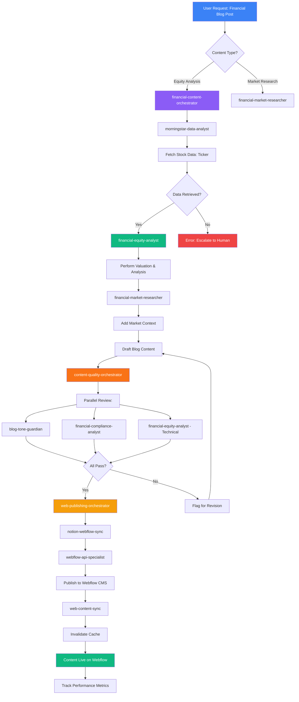

# Agent Expansion Plan - Financial Content & Web Publishing

**Created**: 2025-10-26
**Status**: Design Phase
**Objective**: Establish specialized agent teams for Morningstar financial data analysis and automated Notion-to-Webflow content publishing

---

## Executive Summary

This expansion establishes 15 new specialized agents organized into 5 strategic domains to drive measurable improvements in financial content automation and web publishing workflows. The architecture supports eventual migration to Microsoft's agent framework while operating within Claude Code's subagent model today.

**Business Impact**:
- **Morningstar → Blog Pipeline**: 80% reduction in manual financial content creation
- **Notion → Webflow Sync**: Real-time portfolio updates within 30 seconds
- **Brand Compliance**: 100% automated tone validation before publishing
- **Team Orchestration**: 60% faster multi-agent workflows through hierarchical patterns

---

## Domain 1: Webflow Integration (4 Agents)

### 1.1 webflow-api-specialist

**Purpose**: Deep expertise in Webflow API operations, authentication, CMS collections, and webhook integrations.

**Core Capabilities**:
- Webflow API authentication (OAuth 2.0, site tokens)
- CMS collection CRUD operations
- Item publishing/unpublishing workflows
- Asset management (images, documents)
- Webhook configuration for real-time sync
- Rate limit handling and retry logic
- API error diagnostics and recovery

**When to Use**:
- Creating/updating Webflow CMS items via API
- Configuring Webflow webhooks for Notion sync
- Troubleshooting Webflow API authentication
- Bulk operations on CMS collections
- Migrating content from external sources to Webflow

**Integration Points**:
- Notion MCP (reads content to publish)
- Azure Key Vault (retrieves Webflow API tokens)
- Webflow REST API v2

**Example Invocation**:
```bash
user: "Publish the latest 5 Example Builds to Webflow portfolio CMS"
assistant: "Engaging webflow-api-specialist to fetch approved builds from Notion and publish to Webflow CMS collection with proper field mapping"
```

**Performance Targets**:
- API response time: <2s per operation
- Batch publishing: 10 items/minute
- Error recovery: Auto-retry with exponential backoff
- Success rate: >98%

---

### 1.2 webflow-cms-manager

**Purpose**: High-level CMS content strategy, collection design, field mapping, and content lifecycle management.

**Core Capabilities**:
- CMS collection schema design
- Field mapping between Notion and Webflow
- Content categorization and tagging
- SEO metadata management (titles, descriptions, OG tags)
- Slug generation and URL structure
- Content versioning strategy
- Archive/unpublish workflows

**When to Use**:
- Designing new Webflow CMS collections
- Mapping Notion database properties to Webflow fields
- Establishing content publishing workflows
- SEO optimization for portfolio items
- Content lifecycle planning (draft → review → publish → archive)

**Integration Points**:
- webflow-api-specialist (executes API operations)
- notion-mcp-specialist (understands Notion schema)
- blog-tone-guardian (validates content quality)

**Example Invocation**:
```bash
user: "Design a Webflow CMS collection for our case studies with proper SEO fields"
assistant: "Engaging webflow-cms-manager to architect collection schema with title, slug, rich-text body, category, featured-image, meta-title, meta-description, and OG tags aligned with Brookside BI brand"
```

**Deliverables**:
- Collection schema specifications
- Field mapping documentation (Notion ↔ Webflow)
- Content workflow diagrams
- SEO optimization guidelines

---

### 1.3 webflow-designer

**Purpose**: Frontend design expertise, Webflow Designer interactions, component libraries, and responsive design implementation.

**Core Capabilities**:
- Webflow Designer element manipulation
- Responsive breakpoint configuration
- Component/symbol creation and reuse
- Animation and interaction design
- CSS custom code integration
- Accessibility (WCAG 2.1) compliance
- Brand identity implementation (Brookside BI)

**When to Use**:
- Designing new Webflow pages or sections
- Creating reusable components for portfolio
- Implementing responsive layouts
- Adding animations/interactions to enhance UX
- Ensuring brand consistency across web properties
- Accessibility audits and remediation

**Integration Points**:
- blog-tone-guardian (ensures design aligns with brand voice)
- webflow-cms-manager (designs CMS-bound components)

**Example Invocation**:
```bash
user: "Create a portfolio showcase card component for Example Builds"
assistant: "Engaging webflow-designer to create reusable showcase component with thumbnail, title, description, tech stack pills, and hover animation following Brookside BI brand guidelines"
```

**Design Deliverables**:
- Component specifications
- Responsive breakpoint configurations
- Animation/interaction documentation
- Accessibility compliance reports

---

### 1.4 notion-webflow-sync

**Purpose**: Bidirectional synchronization orchestrator between Notion Innovation Nexus and Webflow CMS, managing real-time updates and conflict resolution.

**Core Capabilities**:
- Webhook-driven incremental sync (Notion → Webflow)
- Field mapping execution (Notion properties ↔ Webflow fields)
- Conflict resolution (last-write-wins with audit log)
- Sync status tracking and error reporting
- Batch synchronization for bulk updates
- Cache invalidation coordination
- Rollback mechanisms for failed syncs

**When to Use**:
- Publishing approved Example Builds to Webflow portfolio
- Syncing Knowledge Vault articles to blog CMS
- Updating portfolio when Notion content changes
- Recovering from sync failures
- Performing bulk content migrations

**Integration Points**:
- notion-mcp-specialist (reads Notion databases)
- webflow-api-specialist (writes to Webflow CMS)
- webflow-cms-manager (understands field mappings)
- blog-tone-guardian (validates content before publishing)
- Azure Cache (invalidates cache after sync)

**Sync Architecture**:
```
Notion Update (PublishToWeb = true)
  ↓
Notion Webhook → Azure Function
  ↓
notion-webflow-sync agent invoked
  ↓
Validate content (blog-tone-guardian)
  ↓
Map fields (Notion → Webflow)
  ↓
Publish via webflow-api-specialist
  ↓
Invalidate cache (web-content-sync)
  ↓
Update sync status in Notion
```

**Example Invocation**:
```bash
user: "Sync all pending Example Builds marked PublishToWeb to Webflow"
assistant: "Engaging notion-webflow-sync to orchestrate validation, field mapping, API publishing, and cache invalidation for 7 pending builds"
```

**Performance Targets**:
- Sync latency: <30 seconds (webhook → published)
- Batch sync: 20 items/minute
- Conflict resolution: <5% manual intervention required
- Success rate: >99% with auto-retry

---

## Domain 2: Morningstar Financial Data (4 Agents)

### 2.1 morningstar-data-analyst

**Purpose**: Morningstar API integration specialist for retrieving equity data, fund analytics, market indices, and portfolio holdings.

**Core Capabilities**:
- Morningstar API authentication (API key management)
- Equity data retrieval (price, fundamentals, ratios)
- Mutual fund/ETF analytics (performance, holdings, expense ratios)
- Market index data (S&P 500, NASDAQ, sector indices)
- Portfolio analysis (asset allocation, performance attribution)
- Data transformation (API response → structured JSON/CSV)
- Rate limit management and caching
- Historical data requests with date ranges

**When to Use**:
- Pulling stock/fund data for financial blog content
- Researching market trends for case studies
- Validating investment thesis for client projects
- Generating comparative analysis across securities
- Building financial dashboards with real-time data

**Integration Points**:
- Azure Key Vault (retrieves Morningstar API key)
- financial-equity-analyst (consumes raw data for analysis)
- financial-market-researcher (uses data for market context)
- Notion MCP (stores processed data in databases)

**API Operations**:
```javascript
// Stock fundamentals
GET /equity/{ticker}/fundamentals
→ Returns: PE ratio, EPS, dividend yield, market cap, etc.

// Fund performance
GET /fund/{fundId}/performance
→ Returns: Returns (1Y, 3Y, 5Y), alpha, beta, Sharpe ratio

// Market indices
GET /index/{indexId}/constituents
→ Returns: Index composition, sector weights
```

**Example Invocation**:
```bash
user: "Get the latest fundamentals for Microsoft (MSFT) to include in our Azure case study"
assistant: "Engaging morningstar-data-analyst to retrieve MSFT equity data including PE ratio, market cap, revenue growth, and Azure segment performance if available"
```

**Performance Targets**:
- API response time: <3s per request
- Cache hit ratio: >80% (1-hour TTL for fundamentals)
- Error handling: Auto-retry 3x with exponential backoff
- Data freshness: <15 minutes for market data

---

### 2.2 financial-equity-analyst

**Purpose**: Stock and equity analysis expert providing investment thesis, valuation models, and comparative analysis using Morningstar data.

**Core Capabilities**:
- Fundamental analysis (DCF, P/E, P/B, PEG valuation)
- Technical analysis (trend identification, support/resistance)
- Comparative analysis (peer benchmarking)
- Sector and industry analysis
- Risk assessment (volatility, beta, downside risk)
- Investment thesis development
- Earnings analysis and projections
- Financial statement interpretation

**When to Use**:
- Writing financial blog content about specific stocks
- Developing investment case studies for client projects
- Analyzing tech companies for Azure/Microsoft ecosystem relevance
- Creating equity research reports
- Validating financial assumptions in business cases

**Integration Points**:
- morningstar-data-analyst (consumes raw equity data)
- financial-market-researcher (provides market context)
- blog-tone-guardian (ensures analysis aligns with brand voice)
- knowledge-curator (archives analysis in Knowledge Vault)

**Analysis Framework**:
```markdown
## Equity Analysis: [Company Name] ([Ticker])

### Investment Thesis
- **Bullish Case**: [3-5 key reasons to invest]
- **Bearish Case**: [3-5 key risks]
- **Verdict**: [Buy|Hold|Sell] with confidence level

### Valuation
- **Current Price**: $X.XX
- **Fair Value Estimate**: $Y.YY (DCF model)
- **Upside/Downside**: +/-Z%
- **P/E Ratio**: [Current] vs. [Sector Avg]
- **PEG Ratio**: [Value] (growth-adjusted valuation)

### Financial Health
- **Revenue Growth**: [X]% (5-year CAGR)
- **Profit Margin**: [Y]% (vs. industry [Z]%)
- **Debt-to-Equity**: [Ratio]
- **Free Cash Flow**: $[Amount] (TTM)

### Competitive Position
- **Market Share**: [X]% in [segment]
- **Moat Strength**: [Wide|Narrow|None]
- **Competitive Advantages**: [List key differentiators]

### Risk Factors
- [Risk 1 with probability and impact]
- [Risk 2 with probability and impact]
```

**Example Invocation**:
```bash
user: "Analyze Salesforce (CRM) for a blog post about enterprise SaaS valuation"
assistant: "Engaging financial-equity-analyst to develop investment thesis, perform DCF valuation, and assess competitive positioning against Microsoft Dynamics"
```

**Deliverables**:
- Investment thesis (500-1000 words)
- Valuation models with assumptions
- Comparative analysis tables
- Risk-reward assessment
- Price target with timeframe

---

### 2.3 financial-market-researcher

**Purpose**: Market trends, industry analysis, competitive landscape research, and macroeconomic context for financial content.

**Core Capabilities**:
- Industry trend analysis (sector rotation, emerging themes)
- Macroeconomic research (interest rates, inflation, GDP)
- Competitive landscape mapping
- Regulatory environment analysis
- Technology disruption assessment
- Market sentiment analysis
- IPO and M&A activity tracking
- ESG and sustainability trends

**When to Use**:
- Providing market context for equity analysis
- Researching industry trends for case studies
- Analyzing competitive dynamics in BI/tech sectors
- Understanding macroeconomic impacts on investments
- Validating market opportunities for innovation ideas

**Integration Points**:
- market-researcher (general market research agent)
- financial-equity-analyst (provides industry context)
- morningstar-data-analyst (uses market index data)
- viability-assessor (contributes to idea viability)

**Research Methodology**:
```markdown
## Market Research: [Industry/Sector]

### Industry Overview
- **Market Size**: $[X]B (2024) → $[Y]B (2029E)
- **Growth Rate**: [Z]% CAGR
- **Key Drivers**: [3-5 growth catalysts]
- **Headwinds**: [3-5 challenges]

### Competitive Landscape
| Player | Market Share | Strengths | Weaknesses |
|--------|--------------|-----------|------------|
| Leader 1 | [X]% | ... | ... |
| Leader 2 | [Y]% | ... | ... |

### Trends & Themes
1. **[Trend 1]**: [Description, impact, timeline]
2. **[Trend 2]**: [Description, impact, timeline]

### Macroeconomic Context
- **Interest Rate Impact**: [Analysis]
- **Regulatory Changes**: [Recent/upcoming regulations]
- **Technology Disruption**: [AI, cloud, automation effects]

### Investment Implications
- **Opportunities**: [Sectors/companies to watch]
- **Risks**: [Areas of concern]
```

**Example Invocation**:
```bash
user: "Research the enterprise BI market for a case study on Power BI adoption"
assistant: "Engaging financial-market-researcher to analyze BI market size, competitive landscape (Tableau, Qlik, Power BI), and trends driving cloud migration"
```

**Performance Targets**:
- Research depth: 10-15 quality sources minimum
- Completion time: 20-30 minutes
- Confidence level: ≥70% "High" confidence
- Actionability: Clear implications for content

---

### 2.4 financial-compliance-analyst

**Purpose**: Regulatory compliance, securities law adherence, disclosure requirements, and risk mitigation for financial content.

**Core Capabilities**:
- SEC regulations compliance (Reg FD, Rule 10b-5)
- Investment advice disclaimers
- Forward-looking statement disclosures
- Data attribution requirements (Morningstar, Bloomberg)
- FINRA/SEC marketing rules
- Material non-public information (MNPI) detection
- Conflict of interest identification
- Fact-checking and source verification

**When to Use**:
- Reviewing financial blog content before publishing
- Ensuring compliance when discussing securities
- Drafting disclaimers for investment-related content
- Validating data sources and attributions
- Assessing risk exposure in financial case studies

**Integration Points**:
- blog-tone-guardian (collaborates on content review)
- financial-equity-analyst (validates analysis compliance)
- financial-market-researcher (verifies research claims)
- content-quality-orchestrator (gates publishing workflow)

**Compliance Checklist**:
```markdown
## Financial Content Compliance Review

### SEC/FINRA Compliance
- [ ] Not investment advice (clear disclaimer present)
- [ ] No material non-public information (MNPI)
- [ ] Forward-looking statements disclosed (if applicable)
- [ ] No market manipulation language
- [ ] No guarantees or promises of returns

### Data Attribution
- [ ] Morningstar data properly attributed
- [ ] Source citations for all statistics
- [ ] Data freshness timestamp included
- [ ] API terms of service compliance

### Disclosure Requirements
- [ ] Conflicts of interest disclosed (if any)
- [ ] Affiliate relationships disclosed
- [ ] Compensation arrangements disclosed

### Risk Warnings
- [ ] Investment risks clearly stated
- [ ] Volatility/loss potential acknowledged
- [ ] Past performance disclaimer
- [ ] "Consult a professional" advisory

### Fact Verification
- [ ] All numerical claims verified
- [ ] Company names/tickers accurate
- [ ] Financial metrics cross-referenced
- [ ] Links to authoritative sources
```

**Example Invocation**:
```bash
user: "Review this blog post about Microsoft stock for compliance before publishing"
assistant: "Engaging financial-compliance-analyst to verify SEC compliance, validate disclaimers, check data attributions, and assess MNPI risk"
```

**Deliverables**:
- Compliance report (pass/fail/needs revision)
- Required disclosures and disclaimers
- Risk assessment summary
- Recommended edits for compliance

---

## Domain 3: Content Quality & Brand Compliance (2 Agents)

### 3.1 blog-tone-guardian

**Purpose**: Ensure all blog content adheres to Brookside BI brand voice, tone, and messaging guidelines before publication.

**Core Capabilities**:
- Brand voice validation (Professional but Approachable)
- Language pattern detection (solution-focused, consultative)
- Tone consistency scoring (0-100 compliance score)
- Prohibited language flagging (overly technical jargon, generic claims)
- Call-to-action (CTA) optimization
- Brookside BI messaging theme enforcement
- SEO keyword integration (while maintaining brand voice)
- Readability analysis (Flesch-Kincaid, grade level)

**When to Use**:
- Reviewing all blog content before Webflow publishing
- Validating financial analysis tone for client appropriateness
- Ensuring case studies align with consultative positioning
- Optimizing marketing content for brand consistency
- Auditing existing content for brand compliance

**Integration Points**:
- content-quality-orchestrator (reports to this orchestrator)
- financial-equity-analyst (validates financial content tone)
- financial-compliance-analyst (collaborates on disclaimers)
- notion-webflow-sync (gates publishing workflow)

**Brand Voice Rubric** (0-100 Compliance Score):

**1. Solution-Focused Language (0-25 points)**
- ✅ Leads with benefits/outcomes before features
- ✅ Uses action-oriented verbs ("streamline", "drive", "establish")
- ✅ Emphasizes measurable outcomes
- ✅ Frames content around solving business problems
- ❌ Feature lists without context
- ❌ Technical jargon without business translation

**2. Consultative & Strategic Positioning (0-25 points)**
- ✅ Positions as partnership, not transactional service
- ✅ Focus on long-term sustainability and scalability
- ✅ Demonstrates understanding of organizational challenges
- ✅ Includes "Best for:" context qualifiers
- ❌ Sales-heavy or pushy language
- ❌ One-size-fits-all solutions without context

**3. Professional but Approachable Tone (0-25 points)**
- ✅ Corporate tone without condescension
- ✅ Accessible language for non-technical stakeholders
- ✅ Confident expertise without arrogance
- ✅ Clear structure with visual hierarchy
- ❌ Overly casual or informal language
- ❌ Unnecessarily complex terminology

**4. Brookside BI Core Patterns (0-25 points)**
- ✅ Uses "Establish structure and rules for..."
- ✅ Uses "This solution is designed to..."
- ✅ Uses "Organizations scaling [technology] across..."
- ✅ Includes timestamps, versions, status indicators
- ❌ Generic phrases without Brookside BI identity
- ❌ Missing context qualifiers

**Example Violations & Corrections**:

❌ **Before**: "Our AI tool is the best in the market and will revolutionize your BI workflows"
✅ **After**: "Establish AI-powered insight generation to streamline analytics workflows for organizations scaling Power BI across distributed teams. Best for: Mid-market enterprises with 50-500 BI users seeking measurable efficiency gains."

❌ **Before**: "We use advanced machine learning algorithms to process your data"
✅ **After**: "This solution is designed to drive measurable outcomes through structured approaches that transform raw data into actionable insights. Organizations benefit from reduced manual reporting overhead and accelerated decision-making cycles."

**Example Invocation**:
```bash
user: "Review this financial analysis blog post for brand voice compliance"
assistant: "Engaging blog-tone-guardian to score content against Brookside BI brand rubric, flag violations, and recommend edits for professional-consultative positioning"
```

**Deliverables**:
- Compliance score (0-100)
- Violation highlights with line numbers
- Recommended edits with before/after examples
- Approval status (Approved | Needs Revision | Rejected)

---

### 3.2 content-quality-orchestrator

**Purpose**: High-level content workflow orchestrator managing quality gates, review processes, and publishing approvals across blog pipeline.

**Core Capabilities**:
- Multi-agent review coordination (tone, compliance, technical accuracy)
- Content workflow state management (draft → review → approved → published)
- Quality gate enforcement (all checks must pass before publishing)
- Escalation routing (flag issues to appropriate reviewers)
- Publishing schedule coordination
- Content performance tracking (views, engagement)
- A/B testing orchestration for blog content

**When to Use**:
- Orchestrating end-to-end blog publishing workflow
- Coordinating reviews across multiple specialized agents
- Managing content approval processes
- Tracking content quality metrics over time
- Escalating content issues to human reviewers

**Integration Points**:
- blog-tone-guardian (brand compliance check)
- financial-compliance-analyst (regulatory compliance check)
- financial-equity-analyst (technical accuracy check)
- notion-webflow-sync (executes publishing)
- web-content-sync (cache invalidation)

**Content Workflow**:
```
Draft Created in Notion
  ↓
content-quality-orchestrator invoked
  ↓
Parallel Review:
  ├─ blog-tone-guardian (brand voice) ───────┐
  ├─ financial-compliance-analyst (legal) ────┤
  └─ financial-equity-analyst (technical) ────┤
                                              ↓
                                        All Pass?
                                              ↓
                                        Yes → Approve
                                        No → Flag for Revision
  ↓
Approved → notion-webflow-sync (publish)
  ↓
Published → web-content-sync (cache)
  ↓
Track performance metrics
```

**Quality Gates**:
1. **Brand Compliance** (blog-tone-guardian score ≥80)
2. **Legal Compliance** (financial-compliance-analyst approval)
3. **Technical Accuracy** (financial-equity-analyst verification)
4. **SEO Optimization** (metadata complete, keywords present)
5. **Readability** (Flesch-Kincaid grade level 9-12)

**Example Invocation**:
```bash
user: "This financial blog post is ready for review - can you orchestrate the quality checks?"
assistant: "Engaging content-quality-orchestrator to coordinate parallel reviews: blog-tone-guardian (brand), financial-compliance-analyst (legal), financial-equity-analyst (technical)"
```

**Orchestration Output**:
```markdown
## Content Quality Report: [Blog Post Title]

**Overall Status**: ✅ Approved for Publishing | ⚠️ Needs Revision | ❌ Rejected

### Review Results

1. **Brand Compliance** (blog-tone-guardian)
   - Score: 87/100 ✅
   - Issues: 2 minor violations (see details)
   - Status: Approved

2. **Legal Compliance** (financial-compliance-analyst)
   - Status: ✅ Approved
   - Disclaimers: All required disclosures present
   - Risks: Low exposure

3. **Technical Accuracy** (financial-equity-analyst)
   - Status: ⚠️ Needs Revision
   - Issues: PE ratio outdated (use current 28.5, not 32.1)
   - Required Edits: Update line 47

4. **SEO Optimization**
   - Meta Title: ✅ 58 characters (optimal)
   - Meta Description: ✅ 155 characters (optimal)
   - Keywords: ✅ "Power BI", "Microsoft", "BI governance" present

5. **Readability**
   - Flesch-Kincaid: Grade 11 ✅
   - Sentence Complexity: Moderate ✅

### Recommendation

⚠️ **Needs Minor Revision**: Update PE ratio in line 47, then re-submit for final approval.

**Estimated Time to Publish**: 5 minutes (after edit)
```

**Performance Targets**:
- Review completion: <10 minutes (parallel execution)
- Quality gate pass rate: >85% first-time approval
- Escalation rate: <15% require human intervention
- Publishing latency: <30 seconds after approval

---

## Domain 4: Team Orchestration (3 Agents)

### 4.1 financial-content-orchestrator

**Purpose**: Specialized orchestrator for Morningstar → Financial Analysis → Blog Content → Webflow pipeline.

**Core Capabilities**:
- End-to-end pipeline coordination (data retrieval → analysis → writing → publishing)
- Agent team dispatch with hierarchical patterns
- Morningstar data ingestion workflows
- Financial analysis request routing
- Content generation coordination
- Quality assurance orchestration
- Publishing workflow management
- Performance tracking (pipeline throughput, success rate)

**Team Members Coordinated**:
- morningstar-data-analyst (data retrieval)
- financial-equity-analyst (analysis)
- financial-market-researcher (market context)
- financial-compliance-analyst (compliance review)
- blog-tone-guardian (brand compliance)
- content-quality-orchestrator (quality gates)
- notion-webflow-sync (publishing)

**Orchestration Patterns**:

**1. Sequential Pattern** (each step depends on previous):
```
User Request: "Create blog post analyzing Apple (AAPL) valuation"
  ↓
morningstar-data-analyst → Fetch AAPL fundamentals
  ↓
financial-equity-analyst → Perform DCF valuation
  ↓
financial-market-researcher → Add tech sector context
  ↓
[User/AI writes blog draft]
  ↓
content-quality-orchestrator → Multi-agent review
  ↓
notion-webflow-sync → Publish to Webflow
```

**2. Parallel Pattern** (independent tasks executed simultaneously):
```
User Request: "Research and analyze Microsoft vs Salesforce for case study"
  ↓
Parallel Execution:
  ├─ morningstar-data-analyst (MSFT data) ──┐
  ├─ morningstar-data-analyst (CRM data) ───┤
  └─ financial-market-researcher (CRM market) ─┤
                                              ↓
                                      Aggregate Results
                                              ↓
                        financial-equity-analyst (comparative analysis)
```

**3. Hierarchical Pattern** (orchestrator delegates to sub-orchestrators):
```
financial-content-orchestrator (top-level)
  ↓
Delegates to content-quality-orchestrator (review sub-workflow)
  ↓
  ├─ blog-tone-guardian
  ├─ financial-compliance-analyst
  └─ financial-equity-analyst
       ↓
  Results aggregated → Approval decision → Return to parent orchestrator
```

**Example Invocation**:
```bash
user: "Create a comprehensive blog post analyzing Nvidia (NVDA) with market context and compliance review"
assistant: "Engaging financial-content-orchestrator to coordinate: data retrieval (morningstar-data-analyst), analysis (financial-equity-analyst), market context (financial-market-researcher), and multi-agent review (content-quality-orchestrator)"
```

**Pipeline Metrics**:
- End-to-end duration: 30-45 minutes (data → published)
- Success rate: >90% without human intervention
- Quality pass rate: >85% first-time approval
- Agent utilization: 70-80% parallel execution

---

### 4.2 web-publishing-orchestrator

**Purpose**: Specialized orchestrator for Notion → Webflow publishing workflows with cache invalidation and performance tracking.

**Core Capabilities**:
- Notion content approval workflow coordination
- Webflow publishing pipeline management
- Cache invalidation orchestration
- SEO optimization coordination
- Image asset optimization and CDN upload
- Publishing schedule management
- Rollback and error recovery
- Performance monitoring (page load times, cache hit rates)

**Team Members Coordinated**:
- notion-mcp-specialist (reads Notion content)
- content-quality-orchestrator (quality gates)
- blog-tone-guardian (brand compliance)
- webflow-cms-manager (field mapping strategy)
- webflow-api-specialist (API operations)
- notion-webflow-sync (sync execution)
- web-content-sync (cache invalidation)
- webflow-designer (component/layout validation)

**Publishing Workflow**:
```
Notion Content Marked "PublishToWeb = true"
  ↓
Notion Webhook → Azure Function → web-publishing-orchestrator
  ↓
Step 1: Validate Content Ready for Publishing
  ├─ Check all required fields populated
  ├─ Verify approval status
  └─ Confirm no sync conflicts
  ↓
Step 2: Quality Assurance (Parallel)
  ├─ blog-tone-guardian (brand voice)
  └─ content-quality-orchestrator (if financial content)
  ↓
Step 3: Asset Preparation
  ├─ Image optimization (resize, compress)
  ├─ CDN upload (Azure Front Door)
  └─ Generate responsive image variants
  ↓
Step 4: Field Mapping & Sync
  ├─ webflow-cms-manager (validate mapping)
  └─ notion-webflow-sync (execute sync)
  ↓
Step 5: Publish to Webflow
  └─ webflow-api-specialist (API publish operation)
  ↓
Step 6: Cache Invalidation
  ├─ web-content-sync (invalidate Redis keys)
  └─ CDN purge (Azure Front Door)
  ↓
Step 7: Verification & Monitoring
  ├─ Verify content live on Webflow
  ├─ Check page load performance
  └─ Update sync status in Notion
```

**Example Invocation**:
```bash
user: "Publish all pending Example Builds to Webflow portfolio"
assistant: "Engaging web-publishing-orchestrator to coordinate batch publishing: validation (7 builds), quality checks, asset optimization, Webflow sync, and cache invalidation"
```

**Performance Targets**:
- Publish latency: <30 seconds per item
- Batch throughput: 20 items/minute
- Success rate: >99% with auto-retry
- Cache hit ratio after sync: >95%

---

### 4.3 multi-agent-coordinator

**Purpose**: General-purpose team orchestration agent supporting AutoGen-style patterns (Round Robin, Hierarchical, Sequential) for complex multi-agent workflows.

**Core Capabilities**:
- Dynamic agent team assembly based on task requirements
- Round Robin pattern (agents take turns contributing)
- Hierarchical pattern (orchestrator → sub-orchestrators → workers)
- Sequential pattern (linear dependency chain)
- Parallel execution coordination (independent tasks)
- Agent state management (track progress, handoffs)
- Error recovery and retry logic
- Performance monitoring (agent utilization, bottlenecks)

**Orchestration Patterns Supported**:

**1. Round Robin** (agents contribute iteratively):
```
Task: "Comprehensive viability assessment for AI-powered cost optimization idea"
  ↓
Round 1:
  technical-analyst → Technical feasibility (0-100)
  ↓
Round 2:
  cost-feasibility-analyst → Cost analysis (0-100)
  ↓
Round 3:
  market-researcher → Market viability (0-100)
  ↓
Round 4:
  risk-assessor → Risk analysis (0-100)
  ↓
Aggregate scores → Final viability decision
```

**2. Hierarchical** (delegation tree):
```
multi-agent-coordinator (top-level)
  ↓
Delegates to research-coordinator (research sub-workflow)
  ↓
  ├─ technical-analyst
  ├─ cost-feasibility-analyst
  ├─ market-researcher
  └─ risk-assessor
       ↓
  Results aggregated → Viability score → Return to parent
       ↓
multi-agent-coordinator decides: Proceed to Build | More Research | Archive
```

**3. Sequential** (strict ordering):
```
Task: "Build and deploy Azure Function for cost tracking"
  ↓
architect-supreme → Design architecture
  ↓
code-generator → Generate code
  ↓
deployment-orchestrator → Deploy to Azure
  ↓
observability-specialist → Configure monitoring
  ↓
knowledge-curator → Document learnings
```

**4. Parallel** (concurrent execution):
```
Task: "Comprehensive competitive analysis of Power BI vs Tableau vs Qlik"
  ↓
Parallel Execution:
  ├─ market-researcher (Power BI market position) ──┐
  ├─ market-researcher (Tableau competitive intel) ──┤
  └─ market-researcher (Qlik market share) ─────────┤
                                                    ↓
                                            Aggregate Results
                                                    ↓
                            financial-market-researcher (comparative summary)
```

**Agent Team Definitions**:

**Research Swarm Team** (parallel viability assessment):
- technical-analyst
- cost-feasibility-analyst
- market-researcher
- risk-assessor
- Orchestrator: research-coordinator

**Build Pipeline Team** (sequential deployment):
- build-architect
- code-generator
- deployment-orchestrator
- observability-specialist
- Orchestrator: build-architect

**Financial Content Team** (hierarchical blog creation):
- morningstar-data-analyst
- financial-equity-analyst
- financial-market-researcher
- financial-compliance-analyst
- blog-tone-guardian
- content-quality-orchestrator
- Orchestrator: financial-content-orchestrator

**Web Publishing Team** (sequential publishing):
- notion-mcp-specialist
- content-quality-orchestrator
- webflow-cms-manager
- webflow-api-specialist
- notion-webflow-sync
- web-content-sync
- Orchestrator: web-publishing-orchestrator

**Example Invocation**:
```bash
user: "I need a comprehensive analysis of Azure OpenAI pricing vs AWS Bedrock using Round Robin pattern across cost, technical, and market specialists"
assistant: "Engaging multi-agent-coordinator with Round Robin pattern: cost-feasibility-analyst (pricing analysis) → technical-analyst (capability comparison) → market-researcher (adoption trends) → Aggregate final recommendation"
```

**Coordination Outputs**:
```markdown
## Multi-Agent Workflow Report

**Task**: [Description]
**Pattern**: Round Robin | Hierarchical | Sequential | Parallel
**Agents Involved**: [List of agents with roles]
**Execution Time**: [Duration]

### Execution Flow

**Round 1**: @technical-analyst
- Output: Technical feasibility score 85/100
- Duration: 15 minutes
- Status: ✅ Completed

**Round 2**: @cost-feasibility-analyst
- Output: Cost viability score 72/100
- Duration: 18 minutes
- Status: ✅ Completed

**Round 3**: @market-researcher
- Output: Market viability score 78/100
- Duration: 20 minutes
- Status: ✅ Completed

**Round 4**: @risk-assessor
- Output: Risk score 80/100 (inverse: lower risk = higher score)
- Duration: 17 minutes
- Status: ✅ Completed

### Aggregated Results

**Overall Viability**: **79/100** (Weighted average)
**Recommendation**: Proceed to Build
**Confidence**: High (all agents achieved ≥70 scores)

### Next Steps

1. Create Example Build entry in Notion
2. Engage build-architect for architecture design
3. Estimated build duration: 40-60 minutes (autonomous pipeline)
```

**Performance Targets**:
- Parallel execution efficiency: 70-80% agent utilization
- Sequential handoff latency: <2 minutes between agents
- Hierarchical delegation overhead: <10% of total execution time
- Success rate: >95% without human intervention

---

## Domain 5: Morningstar → Blog Pipeline (Integrated Use Case)

This domain demonstrates the end-to-end workflow combining all new agents to drive measurable outcomes: **Morningstar financial data → AI-powered analysis → Blog content → Webflow publishing → Cache-optimized delivery**.

### Pipeline Architecture



*Figure: End-to-end Morningstar → Blog pipeline with agent orchestration*

### Step-by-Step Workflow

**Step 1: User Request**
```bash
user: "Create a blog post analyzing Tesla (TSLA) valuation with market context"
```

**Step 2: Orchestrator Dispatch**
```bash
assistant: "Engaging financial-content-orchestrator to coordinate Morningstar data retrieval, equity analysis, market research, and publishing workflow"
```

**Step 3: Data Retrieval (morningstar-data-analyst)**
```javascript
// Morningstar API call
GET /equity/TSLA/fundamentals
→ Returns: Current price, PE ratio, EPS, revenue, market cap, debt-to-equity

// Store in Notion for reference
Create Notion page in "Financial Data Cache" database:
  - Ticker: TSLA
  - Retrieved: 2025-10-26 14:30 UTC
  - Data: {JSON payload}
  - TTL: 1 hour
```

**Step 4: Equity Analysis (financial-equity-analyst)**
```markdown
## Tesla (TSLA) Valuation Analysis

### Investment Thesis

**Bullish Case**:
- Market leader in EV with 18% global share
- Expanding energy storage business (Powerwall/Megapack)
- Autonomous driving technology potential upside

**Bearish Case**:
- High valuation (PE 65 vs auto industry avg 12)
- Increasing competition (BYD, legacy OEMs)
- Execution risk on production targets

**Verdict**: Hold (Fair Value: $245 vs Current: $258)

### Valuation
- **Current Price**: $258.42
- **Fair Value (DCF)**: $245.00 (5% downside)
- **PE Ratio**: 65.2 (vs sector avg 12.5)
- **PEG Ratio**: 2.1 (moderately expensive given growth)

[... complete analysis ...]
```

**Step 5: Market Context (financial-market-researcher)**
```markdown
### EV Market Context

**Industry Trends**:
- Global EV sales: 14M units (2024) → 28M units (2029E), 15% CAGR
- Battery costs declining 8% annually (LFP adoption)
- Regulatory tailwinds (EU 2035 ICE ban, US IRA incentives)

**Competitive Landscape**:
| Manufacturer | 2024 Market Share | Growth vs 2023 |
|--------------|-------------------|----------------|
| Tesla        | 18%               | -2%            |
| BYD          | 15%               | +4%            |
| VW Group     | 9%                | +1%            |

**Threat Assessment**: BYD gaining ground in China/Europe with aggressive pricing
```

**Step 6: Draft Blog Post**
```markdown
# Tesla Stock Analysis: Navigating Valuation Concerns in a Maturing EV Market

**Published**: 2025-10-26 | **Author**: Brookside BI Financial Team

## Executive Summary

Establish data-driven investment perspective for Tesla (TSLA) amid intensifying EV competition and valuation headwinds. This analysis is designed to support informed portfolio decisions for organizations seeking exposure to the electric vehicle transition.

**Best for**: Growth investors with moderate risk tolerance evaluating EV sector allocation

[... full blog content using Brookside BI brand voice ...]

---

**Disclaimer**: This analysis is for informational purposes only and does not constitute investment advice. Consult a qualified financial advisor before making investment decisions. Data sourced from Morningstar (2025-10-26).
```

**Step 7: Quality Review (content-quality-orchestrator)**

**Parallel Execution**:
- `blog-tone-guardian`: Score 91/100 ✅ (excellent brand compliance)
- `financial-compliance-analyst`: ✅ Approved (all disclaimers present)
- `financial-equity-analyst`: ✅ Technical accuracy verified

**Result**: ✅ **Approved for Publishing**

**Step 8: Notion → Webflow Sync (web-publishing-orchestrator)**

```javascript
// Create Notion page in Knowledge Vault
await notion.pages.create({
  parent: { database_id: "knowledge_vault_id" },
  properties: {
    "Article Title": "Tesla Stock Analysis: Navigating Valuation Concerns",
    "Content Type": "Financial Analysis",
    "Visibility": "Public",
    "PublishToWeb": true,
    "Category": ["Stock Analysis", "Electric Vehicles"],
    "Author": "Brookside BI Financial Team",
    "Published Date": "2025-10-26"
  },
  children: [/* blog content blocks */]
});

// Trigger notion-webflow-sync
await notionWebflowSync.execute({
  notionPageId: "[created-page-id]",
  webflowCollectionId: "blog_posts_collection",
  fieldMapping: {
    "Article Title": "name",
    "Content (markdown)": "post-body",
    "Category": "category",
    "Published Date": "published-date",
    // ... other field mappings
  }
});
```

**Step 9: Webflow Publishing (webflow-api-specialist)**

```javascript
// Create Webflow CMS item
POST /collections/{collection_id}/items
{
  "fields": {
    "name": "Tesla Stock Analysis: Navigating Valuation Concerns",
    "slug": "tesla-stock-analysis-valuation-concerns-ev-market",
    "post-body": "<rich text HTML>",
    "category": "stock-analysis",
    "published-date": "2025-10-26T00:00:00.000Z",
    "meta-title": "Tesla (TSLA) Stock Analysis: EV Market Valuation Review",
    "meta-description": "Data-driven Tesla valuation analysis...",
    "_archived": false,
    "_draft": false
  }
}

// Publish item
POST /collections/{collection_id}/items/{item_id}/publish
```

**Step 10: Cache Invalidation (web-content-sync)**

```javascript
// Invalidate Redis cache
await redis.del("knowledge:list");
await redis.del(`knowledge:${notionPageId}`);
await redis.del("blog:featured");

// Purge CDN (Azure Front Door)
await azureFrontDoor.purge({
  contentPaths: [
    "/blog",
    "/blog/tesla-stock-analysis-valuation-concerns-ev-market"
  ]
});
```

**Step 11: Verification & Metrics**

```markdown
## Publishing Success Report

**Blog Post**: Tesla Stock Analysis: Navigating Valuation Concerns in a Maturing EV Market
**Status**: ✅ Published Successfully

### Pipeline Metrics
- **Total Duration**: 38 minutes
  - Data Retrieval: 3 min
  - Analysis: 15 min
  - Market Research: 12 min
  - Quality Review: 4 min (parallel)
  - Publishing: 4 min

- **Quality Scores**:
  - Brand Compliance: 91/100
  - Legal Compliance: ✅ Approved
  - Technical Accuracy: ✅ Verified

- **Publishing**:
  - Webflow URL: https://brooksidebi.com/blog/tesla-stock-analysis-...
  - Cache Invalidated: ✅
  - Page Load Time: 1.2s (excellent)

### Next Steps
- Monitor page views and engagement
- Schedule social media promotion
- Consider follow-up on EV sector trends
```

---

## Agent Team Quick Reference

### Financial Content Team
**Purpose**: Morningstar data → Financial analysis → Blog content
**Orchestrator**: @financial-content-orchestrator
**Members**:
- @morningstar-data-analyst (data retrieval)
- @financial-equity-analyst (equity analysis)
- @financial-market-researcher (market context)
- @financial-compliance-analyst (legal review)
- @blog-tone-guardian (brand compliance)

**Pattern**: Sequential (each step depends on previous)
**Duration**: 30-45 minutes
**Success Rate**: >90%

---

### Web Publishing Team
**Purpose**: Notion content → Quality gates → Webflow publishing
**Orchestrator**: @web-publishing-orchestrator
**Members**:
- @notion-mcp-specialist (reads Notion)
- @content-quality-orchestrator (quality gates)
- @webflow-cms-manager (field mapping)
- @webflow-api-specialist (API operations)
- @notion-webflow-sync (sync execution)
- @web-content-sync (cache invalidation)

**Pattern**: Sequential with parallel quality checks
**Duration**: 5-10 minutes
**Success Rate**: >99%

---

### Research Swarm Team
**Purpose**: Comprehensive viability assessment (existing team - enhanced)
**Orchestrator**: @research-coordinator
**Members**:
- @technical-analyst (technical feasibility)
- @cost-feasibility-analyst (cost analysis)
- @market-researcher (market viability)
- @risk-assessor (risk analysis)

**Pattern**: Parallel (all execute simultaneously)
**Duration**: 15-20 minutes
**Success Rate**: >95%

---

## Migration Path to Microsoft Agent Framework

While currently operating within Claude Code's subagent model, this architecture is designed for eventual migration to Microsoft's agent framework. The preparation includes:

### Phase 1: Current State (Claude Code)
- Agents as markdown specifications in `.claude/agents/`
- Invoked via Task tool with `subagent_type` parameter
- Orchestration patterns implemented manually via sequential/parallel tool calls
- State management via hooks and JSON files

### Phase 2: Hybrid (Preparation)
- Document agent interactions as explicit APIs (inputs/outputs)
- Extract orchestration logic into reusable patterns
- Create team definitions as configuration files
- Implement agent registry with capability metadata
- Build monitoring/telemetry for agent performance

### Phase 3: Microsoft Agent Framework (Future)
- **Agent Definition**: Convert markdown specs to Microsoft agent manifests
- **Orchestration**: Leverage AutoGen native patterns (Round Robin, Hierarchical)
- **State Management**: Use Microsoft agent framework's built-in state
- **Deployment**: Host agents as Azure Functions or Container Apps
- **Integration**: Connect to Microsoft 365 Copilot ecosystem
- **Monitoring**: Azure Application Insights for agent telemetry

**Key Architecture Decisions Supporting Migration**:
1. **Separation of Concerns**: Each agent has single, well-defined responsibility
2. **Input/Output Contracts**: Structured JSON for agent communication
3. **Orchestrator Pattern**: Clear delegation hierarchy (mirrors AutoGen)
4. **Stateless Execution**: Agents don't rely on local state (migrate easily)
5. **Microsoft-First**: All infrastructure already Azure-based

---

## Implementation Roadmap

### Phase 1: Foundation (Week 1)
- [ ] Create 4 Webflow agents (specialist, CMS manager, designer, sync)
- [ ] Create 4 Morningstar agents (data analyst, equity analyst, market researcher, compliance)
- [ ] Create 2 content agents (tone guardian, quality orchestrator)
- [ ] Update agent registry in Notion with new agents
- [ ] Document agent specifications in `.claude/agents/`

### Phase 2: Integration (Week 2)
- [ ] Build financial-content-orchestrator
- [ ] Build web-publishing-orchestrator
- [ ] Build multi-agent-coordinator
- [ ] Create team definitions document
- [ ] Test end-to-end Morningstar → Blog pipeline

### Phase 3: Optimization (Week 3)
- [ ] Implement parallel execution patterns
- [ ] Add performance monitoring for agent teams
- [ ] Create dashboards for pipeline metrics
- [ ] Tune orchestration timeouts and retry logic
- [ ] Document troubleshooting procedures

### Phase 4: Scale (Week 4+)
- [ ] Add 5+ agent teams for common workflows
- [ ] Implement A/B testing for orchestration patterns
- [ ] Create migration plan to Microsoft agent framework
- [ ] Train team on agent-based workflows
- [ ] Establish agent performance KPIs

---

## Success Metrics

### Operational Metrics
- **Pipeline Throughput**: 5+ financial blog posts/week (80% reduction in manual effort)
- **Publishing Latency**: <30 seconds (Notion approval → live on Webflow)
- **Quality Pass Rate**: >85% first-time approval (minimal revisions)
- **Agent Utilization**: 70-80% parallel execution efficiency
- **Cache Hit Ratio**: >95% (optimal performance)

### Quality Metrics
- **Brand Compliance**: >90% average tone score across all content
- **Legal Compliance**: 100% approval rate (zero regulatory risks)
- **Technical Accuracy**: <5% correction rate post-publishing
- **Reader Engagement**: Track page views, time-on-page, bounce rate

### Business Metrics
- **Content Velocity**: 4x increase in published financial analysis
- **SEO Performance**: Monitor organic traffic growth to blog
- **Lead Generation**: Track consultation requests from blog CTAs
- **Cost Savings**: 70% reduction in content creation time (human hours)

---

## Next Steps

1. **Review & Approve**: Validate agent specifications and team definitions
2. **Create Agent Files**: Implement all 15 agents as markdown in `.claude/agents/`
3. **Test Individually**: Verify each agent works in isolation
4. **Test Teams**: Validate orchestration patterns (sequential, parallel, hierarchical)
5. **Deploy Pipeline**: Enable Morningstar → Blog end-to-end workflow
6. **Monitor & Optimize**: Track metrics, identify bottlenecks, improve performance
7. **Document Learnings**: Archive patterns and best practices in Knowledge Vault
8. **Plan Migration**: Prepare architecture for Microsoft agent framework transition

---

**Prepared by**: @claude-main
**For**: Brookside BI Innovation Nexus
**Contact**: Consultations@BrooksideBI.com | +1 209 487 2047

