# Blog Visual Enhancements: Mermaid + Lottie Implementation Guide

**Quick Start:** Add beautiful diagrams and animations to blog posts with zero manual export workflows.

**Status:** Implementation Ready | **Effort:** 4-6 hours | **ROI:** 60 hours/year saved

**Best for:** Organizations publishing technical blog content that require visual workflow diagrams and animations with zero manual export overhead, automated Notion-to-Webflow synchronization, and sustainable content operations to support high-volume publishing.

---

## What You Get

### Mermaid Diagrams (Recommended: Client-Side)
```markdown
<!-- Write this in Notion -->
\`\`\`mermaid
graph LR
    A[Idea] --> B[Research]
    B --> C[Build]
    C --> D[Knowledge]
\`\`\`

<!-- Automatically becomes interactive diagram on Webflow -->
```

**Benefits:**
- ✅ Edit in Notion, auto-updates on website
- ✅ Zero image export workflow
- ✅ Interactive (zoom, pan, click)
- ✅ Responsive mobile scaling

### Lottie Animations
```markdown
<!-- Reference animation in Notion -->
🎬 lottie: https://assets.lottiefiles.com/packages/lf20_success.json

<!-- Automatically embeds with fallback image -->
```

**Benefits:**
- ✅ Lightweight animations (<100KB)
- ✅ Fallback images for accessibility
- ✅ Professional micro-interactions

---

## Choosing Your Rendering Approach

**Visual Decision Framework:**

```mermaid
flowchart TD
    Start{Select Mermaid<br/>Rendering Approach}

    Start --> Q1{Need real-time<br/>diagram editing?}

    Q1 -->|Yes - edit in Notion| Client[Client-Side Rendering]
    Q1 -->|No - static diagrams| Q2{SEO critical<br/>for diagrams?}

    Q2 -->|Yes - crawler indexing| Server[Server-Side Pre-Rendering]
    Q2 -->|No - standard SEO| Q3{High traffic<br/>volume?}

    Q3 -->|Yes - millions/month| Server
    Q3 -->|No - moderate traffic| Client

    Client --> ClientBenefits["✅ Benefits:<br/>- Edit diagrams in Notion<br/>- Zero build pipeline<br/>- Interactive features<br/>- Auto-sync updates<br/>- 2-3 hour setup"]

    Server --> ServerBenefits["✅ Benefits:<br/>- Faster page load<br/>- Better SEO indexing<br/>- No client-side JS<br/>- Cached SVG images<br/>- 6-8 hour setup"]

    ClientBenefits --> ClientTrade["⚠️ Tradeoffs:<br/>- 100-300ms render time<br/>- Requires JavaScript<br/>- CDN dependency"]

    ServerTrade["⚠️ Tradeoffs:<br/>- Build pipeline required<br/>- Cannot edit in Notion<br/>- No interactivity<br/>- Manual diagram updates"]

    ServerBenefits --> ServerTrade

    ClientTrade --> Recommend{Recommendation}
    ServerTrade --> Recommend

    Recommend -->|For 95% of use cases| RecClient["🎯 Client-Side<br/>(Recommended)"]
    Recommend -->|For enterprise scale| RecServer["🎯 Server-Side<br/>(Advanced)"]

    style Start fill:#3B82F6,color:#fff
    style Client fill:#10B981,color:#fff
    style Server fill:#F59E0B,color:#fff
    style RecClient fill:#10B981,color:#fff
    style RecServer fill:#F59E0B,color:#fff
```



*Figure: Decision tree for choosing Mermaid rendering approach based on editing requirements, SEO needs, and traffic volume. Client-side recommended for most organizations.*

---

## Content Flow Architecture

**Visual Process Overview:**


*Figure 1: End-to-end content flow from Notion creation through client-side rendering. Diagrams and animations remain editable in Notion with zero export workflows.*

---

## Mermaid Implementation Roadmap

**Visual Implementation Overview:**


*Figure 2: Mermaid implementation workflow with decision points, validation steps, and debugging paths. Estimated 2-3 hours total.*

---

## Implementation: Mermaid Diagrams (2-3 hours)

### Step 1: Update Content Parser

Edit [notion-content-parser.md](./../agents/notion-content-parser.md) capabilities:

```typescript
// Add Mermaid detection to Markdown transformer
function transformMarkdownToHTML(markdown: string): string {
  return marked(markdown, {
    highlight: function(code, lang) {
      if (lang === 'mermaid') {
        // Return Mermaid-tagged HTML for client-side rendering
        return `<pre class="mermaid">${escapeHtml(code)}</pre>`;
      }
      return highlightCode(code, lang);
    }
  });
}
```

### Step 2: Add Mermaid.js to Webflow

In Webflow: **Site Settings** → **Custom Code** → **Head Code**:

```html
<!-- Mermaid.js Client-Side Renderer -->
<script type="module">
  import mermaid from 'https://cdn.jsdelivr.net/npm/mermaid@10/dist/mermaid.esm.min.mjs';
  mermaid.initialize({
    startOnLoad: true,
    theme: 'default',
    fontFamily: 'Inter, sans-serif'
  });
</script>

<style>
  .mermaid {
    margin: 2rem 0;
    background: #f8fafc;
    padding: 1.5rem;
    border-radius: 8px;
  }
</style>
```

### Step 3: Test

Create test blog post in Notion:

```markdown
# Architecture Overview

\`\`\`mermaid
flowchart TD
    A[User] --> B{Notion}
    B -->|Webhook| C[Agent]
    C --> D[Webflow]
    D --> E[Live Site]
\`\`\`

The workflow processes content automatically.
```

Run: `/blog:sync-post <page-id>`

**Expected:** Interactive diagram renders on published blog post.

---

## Lottie Implementation Roadmap

**Visual Implementation Overview:**

```mermaid
flowchart TD
    Start([Start Lottie Integration]) --> Step1[Step 1: Choose Lottie Syntax]

    Step1 --> Decision{Select writer<br/>preference}
    Decision -->|Simpler| OptA[Option A: Callout Syntax]
    Decision -->|More Control| OptB[Option B: Code Fence Syntax]

    OptA --> Example1["🎬 lottie: URL"]
    OptB --> Example2["```lottie {config}```"]

    Example1 --> Step2[Step 2: Update Content Parser]
    Example2 --> Step2

    Step2 --> Pattern[Define regex pattern for detection]
    Pattern --> Extract[Extract Lottie URL + config]
    Extract --> Transform[Transform to <lottie-player> HTML]

    Transform --> Step3[Step 3: Add Lottie Player to Webflow]

    Step3 --> Script[Add Lottie Player script to <head>]
    Script --> CSS[Add custom CSS for styling]

    CSS --> Step4[Step 4: Test Integration]

    Step4 --> TestCreate[Create test blog post in Notion]
    TestCreate --> TestSync[Run /blog:sync-post command]
    TestSync --> TestVerify{Animation plays<br/>on live site?}

    TestVerify -->|Yes| TestMobile[Test mobile + performance]
    TestVerify -->|No| TestDebug[Debug: Check errors]

    TestDebug --> CheckURL{Valid Lottie<br/>URL?}
    CheckURL -->|No| FixURL[Test at lottiefiles.com/preview]
    CheckURL -->|Yes| CheckPlayer{Player script<br/>loaded?}
    CheckPlayer -->|No| FixScript[Verify script URL in <head>]
    CheckPlayer -->|Yes| CheckJSON{Valid JSON<br/>format?}
    CheckJSON -->|No| FixJSON[Validate JSON structure]

    FixURL --> TestSync
    FixScript --> TestSync
    FixJSON --> TestSync

    TestMobile --> Fallback{Add <noscript><br/>fallback?}
    Fallback -->|Optional| AddFallback[Add fallback PNG image]
    Fallback -->|Skip for v1| Document[Document writer guidelines]

    AddFallback --> Document

    Document --> Complete([✅ Lottie Integration Complete])

    style Start fill:#3B82F6,color:#fff
    style Complete fill:#10B981,color:#fff
    style Step1 fill:#8B5CF6,color:#fff
    style Step2 fill:#8B5CF6,color:#fff
    style Step3 fill:#8B5CF6,color:#fff
    style Step4 fill:#8B5CF6,color:#fff
```

*Figure 3: Lottie implementation workflow with syntax decision tree, validation steps, and optional fallback handling. Estimated 3-4 hours total.*

---

## Implementation: Lottie Animations (3-4 hours)

### Step 1: Define Lottie Syntax

Choose one pattern for writers:

**Option A - Callout (Simpler for writers):**
```markdown
🎬 lottie: https://assets.lottiefiles.com/packages/lf20_loading.json
```

**Option B - Code Fence (More configuration):**
```markdown
\`\`\`lottie
{
  "url": "https://assets.lottiefiles.com/packages/lf20_success.json",
  "loop": false,
  "autoplay": true,
  "width": 400
}
\`\`\`
```

### Step 2: Update Content Parser

Add Lottie detection:

```typescript
// Detect Lottie references
function detectLottieReferences(markdown: string): LottieRef[] {
  const pattern = /🎬 lottie: (.+)/g;
  const matches = [];
  let match;

  while ((match = pattern.exec(markdown)) !== null) {
    matches.push({ url: match[1].trim() });
  }

  return matches;
}

// Transform to Lottie Player HTML
function transformLottieToHTML(url: string): string {
  return `
    <lottie-player
      src="${url}"
      background="transparent"
      speed="1"
      style="width: 400px; height: 400px;"
      loop
      autoplay>
    </lottie-player>
  `;
}
```

### Step 3: Add Lottie Player to Webflow

In Webflow: **Site Settings** → **Custom Code** → **Head Code**:

```html
<!-- Lottie Player Web Component -->
<script src="https://unpkg.com/@lottiefiles/lottie-player@2.0.2/dist/lottie-player.js"></script>

<style>
  lottie-player {
    display: block;
    margin: 2rem auto;
    max-width: 100%;
  }
</style>
```

### Step 4: Test

Create test blog post:

```markdown
# Deployment Success

🎬 lottie: https://assets.lottiefiles.com/packages/lf20_success.json

Your build is now live!
```

Run: `/blog:sync-post <page-id>`

**Expected:** Success animation plays on published post.

---

## Quick Integration Checklist

### Mermaid Integration
- [ ] Update `notion-content-parser` to detect `language="mermaid"` code fences
- [ ] Add Mermaid.js CDN script to Webflow `<head>`
- [ ] Test flowchart, sequence diagram, and ER diagram
- [ ] Validate mobile responsive scaling
- [ ] Document Mermaid syntax for writers (link to [mermaid.live](https://mermaid.live/))

### Lottie Integration
- [ ] Choose Lottie reference syntax (callout vs code fence)
- [ ] Update `notion-content-parser` to detect Lottie references
- [ ] Add Lottie Player script to Webflow `<head>`
- [ ] Test with public Lottie animation URL
- [ ] Add fallback `<noscript>` images (optional Phase 2)
- [ ] Document Lottie guidelines for writers

---

## Writer Guidelines

### Mermaid Diagram Best Practices

**When to use:**
- System architecture diagrams
- Process flowcharts
- API sequence diagrams
- Database ERDs

**Tips:**
- Keep diagrams <15 nodes (readability)
- Test syntax at [mermaid.live](https://mermaid.live/) before adding to Notion
- Use colors sparingly: `style A fill:#3B82F6,color:#fff`
- Add descriptive text below diagram for SEO

**Example:**
```markdown
\`\`\`mermaid
graph TD
    A[💡 Idea] --> B[🔬 Research]
    B --> C[🛠️ Build]
    C --> D[📚 Knowledge]
\`\`\`

*Figure 1: Innovation lifecycle from concept to knowledge archival.*
```

### Lottie Animation Best Practices

**When to use:**
- Loading states
- Success/error confirmations
- Decorative micro-interactions
- Icon animations

**Tips:**
- Keep file size <100KB (check at [lottiefiles.com](https://lottiefiles.com/))
- Use `loop: false` for one-time animations (success checkmarks)
- Preview animations before embedding
- Provide descriptive context for screen readers

**Free Lottie Sources:**
- [LottieFiles](https://lottiefiles.com/featured) - 100k+ free animations
- [Lottie Community](https://lottiefiles.com/community) - User-submitted

---

## Performance & SEO

### Mermaid Performance
- **Client-side rendering:** ~100-300ms per diagram
- **Impact:** Minimal (<0.5s total for 3 diagrams)
- **SEO:** Add descriptive alt text in surrounding paragraph

### Lottie Performance
- **File size target:** <100KB JSON, <50KB fallback PNG
- **Loading:** Lazy load animations below fold
- **Accessibility:** Always provide descriptive text context

---

## Troubleshooting

### Mermaid Not Rendering
1. Check browser console for errors
2. Validate syntax at [mermaid.live](https://mermaid.live/)
3. Verify Mermaid.js script loaded (check Network tab)
4. Ensure code fence uses `language="mermaid"` exactly

### Lottie Not Playing
1. Verify Lottie Player script loaded
2. Check animation URL accessible (no 404 errors)
3. Test animation at [lottiefiles.com/preview](https://lottiefiles.com/preview)
4. Confirm JSON format valid

---

## Cost & ROI

**Development Investment:** 4-6 hours one-time

**Savings:**
- Manual diagram export: 10 min/diagram → 0 min (automated)
- Manual animation export: 15 min/animation → 0 min (automated)
- 10 blog posts/month × 3 diagrams = **5 hours/month saved**

**Payback Period:** 1 month

**Annual ROI:** 60 hours (~$3,600 at $60/hour developer rate)

---

## Next Steps

1. **Choose approach:** Client-side Mermaid (recommended) or server-side pre-rendering
2. **Select Lottie syntax:** Callout (simpler) or code fence (more control)
3. **Update parser:** Add detection logic to `notion-content-parser` agent
4. **Add scripts:** Install Mermaid.js + Lottie Player on Webflow site
5. **Test thoroughly:** Create sample blog post with both features
6. **Document for team:** Share syntax guidelines with content writers

---

**Ready to implement?** Start with Mermaid integration (2-3 hours), test thoroughly, then add Lottie animations (3-4 hours).

**Questions?** Contact: Consultations@BrooksideBI.com | +1 209 487 2047
