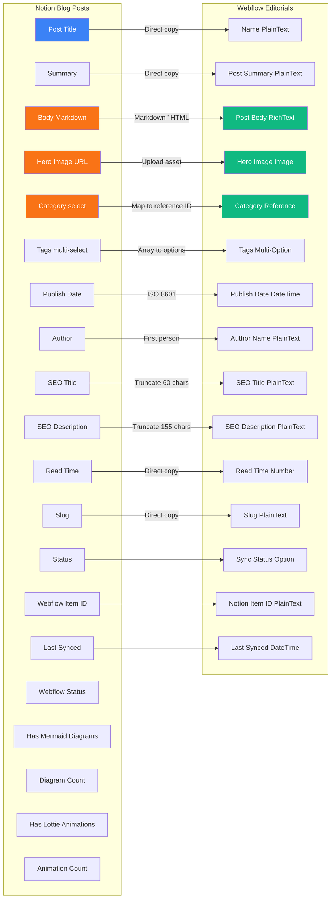
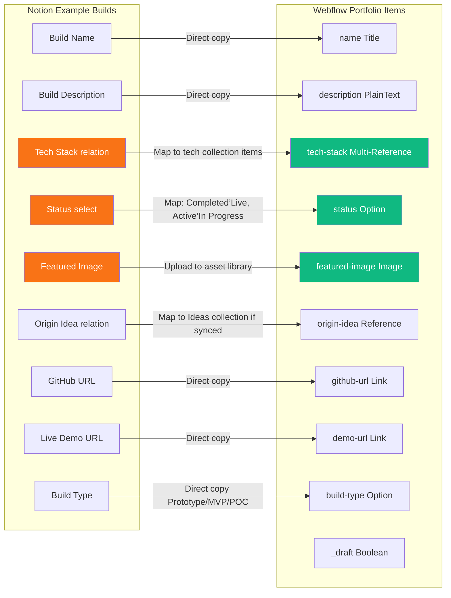
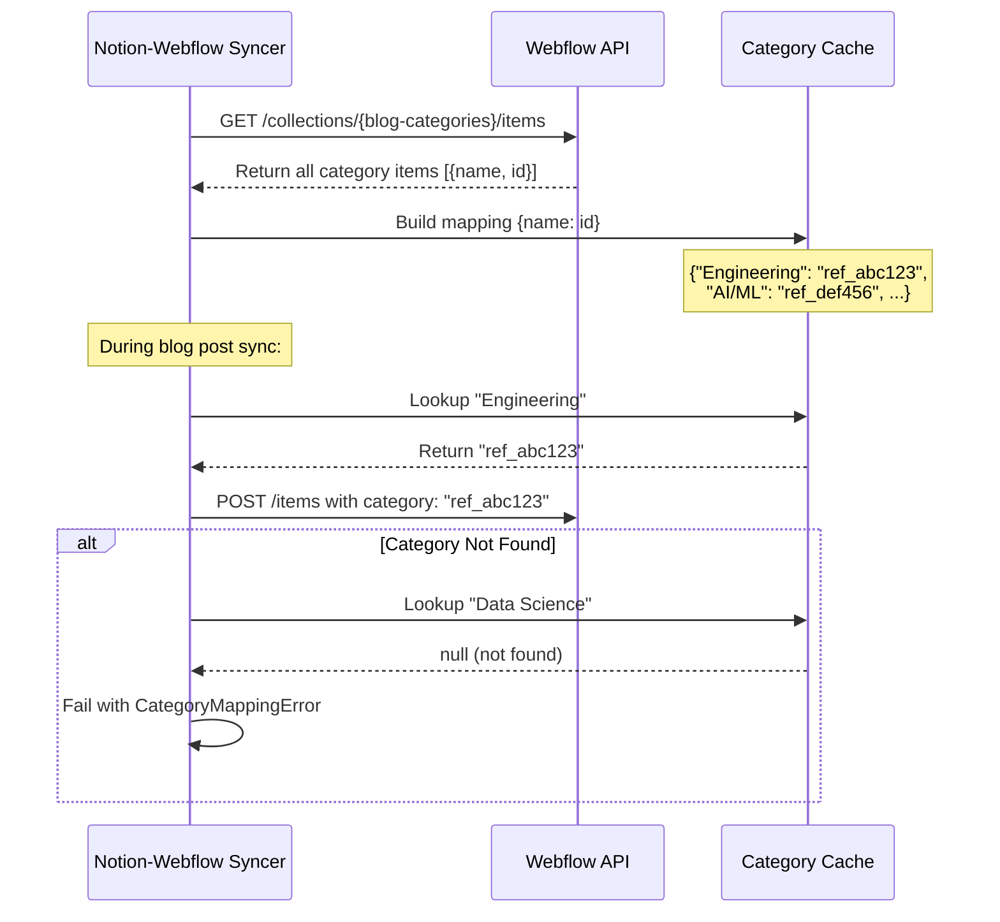

# Field Mapping Specifications

**Version:** 1.0.0
**Status:** Production Reference
**Last Updated:** 2025-10-26

---

## Executive Summary

Establish centralized field mapping reference to streamline content synchronization across Notion and Webflow platforms. This specification provides comprehensive mapping tables, transformation rules, validation requirements, and troubleshooting guidance to support sustainable publishing operations at scale.

**Best for:** Organizations scaling content publishing workflows requiring consistent, error-free synchronization between Notion content management and Webflow presentation layers with zero manual field mapping overhead.

### Quick Navigation

- [Blog Posts Mapping](#blog-posts-mapping) - Blog content ’ Webflow Editorials (17 fields)
- [Example Builds Mapping](#example-builds-mapping) - Portfolio items ’ Webflow Portfolio (9 fields)
- [Field Type Reference](#field-type-transformation-matrix) - Notion ” Webflow type conversions
- [Transformation Rules](#transformation-rules--logic) - Markdown, images, SEO, categories
- [Validation Requirements](#validation-requirements) - Required fields, format constraints
- [Troubleshooting](#troubleshooting-guide) - Common errors and resolutions

---

## Blog Posts Mapping

### Notion Blog Posts ’ Webflow Editorials Collection

**Source Database:** Notion Blog Posts (`97adad39160248d697868056a0075d9c`)
**Target Collection:** Webflow Editorials (`68feaa54e6d5314473f2dc64`)
**Purpose:** Public blog content with comprehensive metadata and SEO optimization

**Visual Field Relationship:**



*Figure 1: Blog Posts field mapping showing direct copies (blue), transformations (orange ’ green), and sync tracking fields.*

---

### Complete Mapping Table

| # | Notion Property | Type | Webflow Field | Type | Transformation | Required |
|---|----------------|------|---------------|------|----------------|----------|
| 1 | **Post Title** | title | Name | PlainText | Direct copy |  Yes |
| 2 | **Summary** | rich_text | Post Summary | PlainText | Strip markdown, plain text only |  Yes |
| 3 | **Body (Markdown)** | rich_text | Post Body | RichText | Markdown ’ HTML conversion |  Yes |
| 4 | **Hero Image URL** | url | Hero Image | Image | Upload to Webflow Assets, reference asset ID |  Yes |
| 5 | **Category** | select | Category | Reference | Map category name ’ Webflow reference ID via lookup |  Yes |
| 6 | **Tags** | multi_select | Tags | Multi-Option | Array mapping to Webflow option values | L No |
| 7 | **Publish Date** | date | Publish Date | DateTime | ISO 8601 format conversion |  Yes |
| 8 | **Author** | person | Author Name | PlainText | Extract first person's name |  Yes |
| 9 | **Read Time** | number | Read Time | Number | Direct copy (minutes estimate) | L No |
| 10 | **SEO Title** | rich_text | SEO Title | PlainText | Use Post Title if empty, truncate at 60 chars |  Yes |
| 11 | **SEO Description** | rich_text | SEO Description | PlainText | Use Summary if empty, truncate at 155 chars |  Yes |
| 12 | **Slug** | rich_text | Slug | PlainText | Direct copy (kebab-case URL identifier) |  Yes |
| 13 | **Status** | status | N/A | N/A | Notion workflow only, not synced | L N/A |
| 14 | **Webflow Item ID** | rich_text | N/A | N/A | Stores Webflow item ID for update operations | ™ Sync |
| 15 | **Last Synced** | date | Last Synced | DateTime | Auto-populated after successful sync | ™ Sync |
| 16 | **Webflow Status** | select | Sync Status | Option | Maps: New/Updated/Synced/Deleted | ™ Sync |
| 17 | **Has Mermaid Diagrams** | checkbox | N/A | N/A | Visual content tracking (Notion only) | ™ Track |
| 18 | **Diagram Count** | number | N/A | N/A | Count of Mermaid diagrams in post | ™ Track |
| 19 | **Has Lottie Animations** | checkbox | N/A | N/A | Visual content tracking (Notion only) | ™ Track |
| 20 | **Animation Count** | number | N/A | N/A | Count of Lottie animations in post | ™ Track |
| 21 | **Visual Content Last Updated** | date | N/A | N/A | Visual content modification timestamp | ™ Track |

**Legend:**
-  **Required** - Must be populated before sync
- L **Optional** - Can be empty, auto-generated if needed
- ™ **Sync/Track** - Auto-managed by sync agents
- **N/A** - Field not synced to target system

---

### Field-Specific Notes

**Post Title (Field #1)**
- **Validation:** Max 100 characters
- **SEO Impact:** Used as default SEO Title if SEO Title empty
- **Error:** `RequiredFieldMissing` if empty

**Body (Markdown) (Field #3)**
- **Minimum:** 500 words recommended for SEO
- **Transformation:** CommonMark + GitHub Flavored Markdown ’ HTML
- **Special Handling:**
  - Mermaid code fences: Wrapped in `<pre class="mermaid">` for client-side rendering
  - Lottie references: Converted to `<lottie-player>` web component
  - Callout blocks: Transformed to `<div class="callout callout-{type}">`
  - Code blocks: Syntax highlighting preserved via `<code class="language-{lang}">`

**Hero Image URL (Field #4)**
- **Validation:** Valid URL, image accessible
- **Pixel Art Rules (if enforced):**
  - Hard edges (no anti-aliasing)
  - Max 32 colors
  - Aspect ratio 16:9
  - Min dimensions 1600x900
  - 3-5 visible characters
- **Upload Process:**
  1. Download from Notion URL
  2. Optimize (resize max 1920px, compress 85%, convert to WebP)
  3. Upload to Webflow Assets API
  4. Return Webflow CDN URL
  5. Replace Notion URL with Webflow URL in HTML

**Category (Field #5)**
- **Validation:** Must exist in both Notion select and Webflow Blog-Categories collection
- **Mapping Process:**
  1. Extract category name from Notion select
  2. Lookup Webflow reference ID from category cache
  3. If not found ’ Fail with `CategoryMappingError`
- **Available Categories (9):**
  - Engineering, AI/ML, DevOps, Business, Security, Data, Operations, Sales, Marketing

**Tags (Field #6)**
- **Mapping:** Notion multi-select array ’ Webflow multi-option array
- **Available Tags (11):** Engineering, AI, DevOps, Sales, Operations, Finance, Marketing, Security, Infrastructure, ML, Data
- **Optional:** Can be empty, no blocking error

**SEO Title/Description (Fields #10-11)**
- **Auto-Generation Logic:**
  ```javascript
  // If SEO Title empty:
  seo_title = notion_page["Post Title"].substring(0, 60);

  // If SEO Description empty:
  seo_description = notion_page["Summary"].substring(0, 155);

  // If Summary also empty (rare edge case):
  first_paragraph = extract_first_paragraph(notion_page["Body"]);
  seo_description = first_paragraph.substring(0, 155);
  ```

---

## Example Builds Mapping

### Notion Example Builds ’ Webflow Portfolio Collection

**Source Database:** Notion Example Builds (`a1cd1528-971d-4873-a176-5e93b93555f6`)
**Target Collection:** Webflow Portfolio Items (TBD)
**Purpose:** Technical showcase of prototypes, MVPs, and proof-of-concepts

**Visual Field Relationship:**



*Figure 2: Example Builds field mapping showing technical metadata transformations and relationship mappings.*

---

### Complete Mapping Table

| # | Notion Property | Type | Webflow Field | Type | Transformation | Required |
|---|----------------|------|---------------|------|----------------|----------|
| 1 | **Build Name** | title | name | Title | Direct copy |  Yes |
| 2 | **Build Description** | rich_text | description | PlainText | Direct copy |  Yes |
| 3 | **Tech Stack** | relation | tech-stack | Multi-Reference | Map to tech-stack collection items | L No |
| 4 | **Status** | select | status | Option | Map: "Completed" ’ "Live", "Active" ’ "In Progress" |  Yes |
| 5 | **Featured Image** | files | featured-image | Image | Upload to Webflow asset library, use URL |  Yes |
| 6 | **Origin Idea** | relation | origin-idea | Reference | Map to Ideas collection (if synced to Webflow) | L No |
| 7 | **GitHub URL** | url | github-url | Link | Direct copy | L No |
| 8 | **Live Demo URL** | url | demo-url | Link | Direct copy | L No |
| 9 | **Build Type** | select | build-type | Option | Direct copy ("Prototype", "MVP", "POC") |  Yes |
| 10 | **Published** | checkbox | _draft | Boolean | Inverse mapping: Published=true ’ _draft=false | ™ Sync |

---

## Field Type Transformation Matrix

### Notion Property Types ’ Webflow Field Types

Comprehensive reference for all property type conversions between Notion and Webflow CMS.

| Notion Type | Webflow Type | Transformation Rule | Example | Notes |
|------------|--------------|---------------------|---------|-------|
| **title** | PlainText | Direct copy | "My Blog Post" ’ "My Blog Post" | Primary identifier, required in both systems |
| **rich_text** | PlainText | Strip markdown formatting | "**Bold** text" ’ "Bold text" | Removes all markdown syntax, plain text only |
| **rich_text** (long) | RichText | Markdown ’ HTML conversion | `# Heading` ’ `<h1>Heading</h1>` | Full markdown parsing with GFM extensions |
| **number** | Number | Direct copy | 42 ’ 42 | Numeric values passed unchanged |
| **select** | Option | Map option name (case-sensitive) | "Engineering" ’ "Engineering" | Must match Webflow option exactly |
| **multi_select** | Multi-Option | Array mapping | ["AI", "ML"] ’ ["AI", "ML"] | All items must exist in Webflow options |
| **date** | DateTime | ISO 8601 format | 2025-10-26 ’ "2025-10-26T00:00:00Z" | Always includes timezone (Z for UTC) |
| **files** | Image | Upload to asset library, reference ID | Notion S3 URL ’ Webflow CDN URL | Downloads file, uploads to Webflow Assets |
| **url** | Link | Direct copy with validation | "https://example.com" ’ "https://example.com" | Validates URL format before sync |
| **email** | PlainText | Direct copy with validation | "user@example.com" ’ "user@example.com" | Validates email format |
| **phone_number** | PlainText | Direct copy | "+1-209-487-2047" ’ "+1-209-487-2047" | No format enforcement |
| **checkbox** | N/A | Not directly synced | true/false ’ (workflow logic only) | Used for conditional sync triggers |
| **relation** (single) | Reference | Lookup related item ID | Notion page ID ’ Webflow item ref ID | Requires target collection synced |
| **relation** (multi) | Multi-Reference | Lookup all related item IDs | [ID1, ID2] ’ [refID1, refID2] | All items must exist in Webflow |
| **people** | PlainText | Extract first person's name | [@MarkusAhling] ’ "Markus Ahling" | Only syncs primary person |
| **formula** | N/A | Not synced | (calculated value) | Notion-only, not supported in Webflow |
| **rollup** | N/A | Not synced | (aggregated value) | Notion-only, not supported in Webflow |

---

## Transformation Rules & Logic

### SEO Metadata Auto-Generation

**Purpose:** Eliminate manual SEO field entry by deriving metadata from primary content

**Rules:**

**SEO Title:**
1. If `SEO Title` field populated ’ Use as-is
2. If `SEO Title` empty ’ Use `Post Title`
3. Truncate at 60 characters (Google SERP display limit)
4. No ellipsis added (truncation silent)

**SEO Description:**
1. If `SEO Description` field populated ’ Use as-is
2. If `SEO Description` empty ’ Use `Summary` field
3. If `Summary` also empty ’ Extract first paragraph from `Body`
4. Truncate at 155 characters (Google SERP display limit)
5. No ellipsis added (truncation silent)

**Implementation:**
```javascript
function generate_seo_metadata(notion_page) {
    // SEO Title
    let seo_title = notion_page["SEO Title"];
    if (!seo_title || seo_title.trim() === "") {
        seo_title = notion_page["Post Title"];
    }
    seo_title = seo_title.substring(0, 60);

    // SEO Description
    let seo_description = notion_page["SEO Description"];
    if (!seo_description || seo_description.trim() === "") {
        seo_description = notion_page["Summary"];
    }
    if (!seo_description || seo_description.trim() === "") {
        // Fallback: extract first paragraph from Body
        const first_paragraph = extract_first_paragraph(notion_page["Body"]);
        seo_description = first_paragraph;
    }
    seo_description = seo_description.substring(0, 155);

    return {
        seo_title: seo_title,
        seo_title_truncated: notion_page["Post Title"].length > 60,
        seo_description: seo_description,
        seo_description_truncated: notion_page["Summary"].length > 155
    };
}
```

---

### Category Mapping Logic

**Process:**



*Figure 3: Category mapping flow showing cache-based lookup and error handling for missing categories.*

---

## Validation Requirements

### Pre-Sync Validation Checklist

**Blog Posts Required Fields (9):**
| Field | Validation Rule | Error Code |
|-------|----------------|------------|
| Post Title | Not empty, max 100 chars | `BLOG_001_TITLE_MISSING` |
| Summary | Not empty, max 500 chars | `BLOG_002_SUMMARY_MISSING` |
| Body (Markdown) | Not empty, min 500 words recommended | `BLOG_003_BODY_MISSING` |
| Hero Image URL | Valid URL, image accessible | `BLOG_004_HERO_MISSING` |
| Category | Selected, exists in Webflow | `BLOG_005_CATEGORY_MISSING` |
| Publish Date | Valid date format | `BLOG_006_DATE_MISSING` |
| Author | At least one person assigned | `BLOG_007_AUTHOR_MISSING` |
| SEO Title | Auto-generated if empty | N/A (auto-filled) |
| SEO Description | Auto-generated if empty | N/A (auto-filled) |

**Example Builds Required Fields (5):**
| Field | Validation Rule | Error Code |
|-------|----------------|------------|
| Build Name | Not empty, max 100 chars | `BUILD_001_NAME_MISSING` |
| Build Description | Not empty | `BUILD_002_DESC_MISSING` |
| Status | Selected | `BUILD_003_STATUS_MISSING` |
| Featured Image | At least one image attached | `BUILD_004_IMAGE_MISSING` |
| Build Type | Selected (Prototype/MVP/POC) | `BUILD_005_TYPE_MISSING` |

---

## Troubleshooting Guide

### Common Errors & Resolutions

#### Error: CategoryMappingError

**Symptom:**
```
L CategoryMappingError: Category 'Data Science' exists in Notion Knowledge Vault
but not found in Webflow Blog-Categories collection.

Available categories: Engineering, AI/ML, Business Intelligence, Data Engineering,
Cloud Architecture, DevOps, Security, Product Management, Leadership
```

**Resolution:**
1. **Option A - Add Category to Webflow:**
   - Navigate to Webflow CMS Editor ’ Blog-Categories collection
   - Create new item: Name = "Data Science", Slug = "data-science"
   - Publish item
   - Run: `/agent notion-webflow-syncer build-category-cache`
   - Retry sync

2. **Option B - Change Category in Notion:**
   - Edit Notion blog post
   - Change Category to one of available categories
   - Retry sync

---

#### Error: ImageUploadTimeout

**Symptom:**
```
L ImageUploadTimeout: Hero image upload exceeded 30 second timeout
Image URL: https://prod-files-secure.s3.us-west-2.amazonaws.com/.../large-image.png
File size: 12.5 MB
```

**Resolution:**
1. **Compress Image:**
   - Download image locally
   - Compress using tool (TinyPNG, ImageOptim)
   - Target: <5MB
   - Re-upload to Notion
   - Retry sync

---

#### Error: RequiredFieldMissing

**Symptom:**
```
L RequiredFieldMissing: Blog post validation failed

Missing Required Fields:
  - Author: No person assigned
  - Publish Date: Empty date field
  - Hero Image URL: No URL provided
```

**Resolution:**
1. Populate missing fields in Notion
2. Verify all required fields present
3. Retry sync: `/blog:sync-post <page-id>`

---

## Visual Content Field Tracking

### Mermaid Diagrams & Lottie Animations

**New Fields (Notion Only):**
| Field | Type | Purpose | Auto-Populated |
|-------|------|---------|----------------|
| Has Mermaid Diagrams | checkbox | Flag posts with diagrams |  Yes (during sync) |
| Diagram Count | number | Count of Mermaid code blocks |  Yes (during sync) |
| Has Lottie Animations | checkbox | Flag posts with animations |  Yes (during sync) |
| Animation Count | number | Count of Lottie player embeds |  Yes (during sync) |
| Visual Content Last Updated | date | Visual content modification timestamp |  Yes (during sync) |

---

## Contact & Support

**Brookside BI Innovation Nexus Team**
=ç Consultations@BrooksideBI.com
=Þ +1 209 487 2047

---

**Brookside BI Innovation Nexus - Centralized Field Mapping Specifications for Sustainable Publishing Operations** 

*Version: 1.0.0 | Status: Production Reference | Last Updated: 2025-10-26*
