```mermaid
graph LR
    IDEA[💡 Ideas Registry] -->|Initiates| RESEARCH[🔬 Research Hub]
    IDEA -->|May Directly Lead To| BUILD[🛠️ Example Builds]
    IDEA -.->|Uses Tools| SOFTWARE[💰 Software Tracker]

    style IDEA fill:#4A90E2,stroke:#2E5C8A,color:#fff
    style RESEARCH fill:#50C878,stroke:#2E8B57,color:#fff
    style BUILD fill:#FF6B6B,stroke:#CC5555,color:#fff
    style SOFTWARE fill:#F39C12,stroke:#D68910,color:#fff
```

```mermaid
graph LR
    IDEA[💡 Ideas Registry] -->|Initiates| RESEARCH[🔬 Research Hub]
    RESEARCH -->|Validates| BUILD[🛠️ Example Builds]
    RESEARCH -.->|Uses Tools| SOFTWARE[💰 Software Tracker]
    RESEARCH -->|Preserves| KNOWLEDGE[📚 Knowledge Vault]

    style IDEA fill:#4A90E2,stroke:#2E5C8A,color:#fff
    style RESEARCH fill:#50C878,stroke:#2E8B57,color:#fff
    style BUILD fill:#FF6B6B,stroke:#CC5555,color:#fff
    style SOFTWARE fill:#F39C12,stroke:#D68910,color:#fff
    style KNOWLEDGE fill:#9B59B6,stroke:#7D3C98,color:#fff
```

```mermaid
graph TB
    BUILD[🛠️ Example Builds] -->|Preserves Patterns| KNOWLEDGE[📚 Knowledge Vault]
    RESEARCH[🔬 Research Hub] -->|Preserves Learnings| KNOWLEDGE
    IDEA[💡 Ideas Registry] -.->|Even Failed Ideas| KNOWLEDGE

    style BUILD fill:#FF6B6B,stroke:#CC5555,color:#fff
    style RESEARCH fill:#50C878,stroke:#2E8B57,color:#fff
    style IDEA fill:#4A90E2,stroke:#2E5C8A,color:#fff
    style KNOWLEDGE fill:#9B59B6,stroke:#7D3C98,color:#fff
```

# Database Architecture

**Brookside BI Notion Database Architecture** - Establish comprehensive innovation tracking through 10 interconnected databases designed to streamline workflows from idea capture through knowledge archival with transparent cost visibility.

**Best for**: Organizations requiring systematic innovation management with complete traceability, cost accountability, and institutional knowledge preservation across distributed teams.

---

## Database Ecosystem Overview

Innovation Nexus uses Notion as the central source of truth for all innovation tracking, with carefully designed database relations that maintain data integrity and enable powerful cost rollups, progress tracking, and knowledge discovery.

### Core Databases

```mermaid
graph TB
    subgraph Innovation Lifecycle
        IDEAS[💡 Ideas Registry]
        RESEARCH[🔬 Research Hub]
        BUILDS[🛠️ Example Builds]
        KNOWLEDGE[📚 Knowledge Vault]
    end

    subgraph Cost & Software
        SOFTWARE[💰 Software & Cost Tracker]
    end

    subgraph Agent Operations
        AGENTS[🤖 Agent Registry]
        ACTIVITY[🤖 Agent Activity Hub]
        STYLES[🎨 Output Styles Registry]
        TESTS[🧪 Agent Style Tests]
    end

    subgraph Supporting Data
        INTEGRATIONS[🔗 Integration Registry]
        OKRS[🎯 OKRs & Initiatives]
    end

    IDEAS -->|Initiates| RESEARCH
    RESEARCH -->|Validates| BUILDS
    BUILDS -->|Preserves| KNOWLEDGE
    IDEAS -.->|Uses| SOFTWARE
    RESEARCH -.->|Uses| SOFTWARE
    BUILDS -.->|Uses| SOFTWARE
    SOFTWARE -->|Rolls Up To| BUILDS
    SOFTWARE -->|Rolls Up To| RESEARCH
    SOFTWARE -->|Rolls Up To| IDEAS
    AGENTS -->|Performs| ACTIVITY
    AGENTS -->|Tested With| STYLES
    STYLES -->|Evaluated In| TESTS
    TESTS -->|References| AGENTS
    BUILDS -.->|Registers| INTEGRATIONS
    IDEAS -.->|Supports| OKRS

    style IDEAS fill:#4A90E2,stroke:#2E5C8A,color:#fff
    style RESEARCH fill:#50C878,stroke:#2E8B57,color:#fff
    style BUILDS fill:#FF6B6B,stroke:#CC5555,color:#fff
    style KNOWLEDGE fill:#9B59B6,stroke:#7D3C98,color:#fff
    style SOFTWARE fill:#F39C12,stroke:#D68910,color:#fff
    style AGENTS fill:#E74C3C,stroke:#C0392B,color:#fff
```



---

## 1. Ideas Registry (💡)

**Purpose**: Centralized innovation idea capture with initial viability assessment and team assignment.

**Data Source ID**: `984a4038-3e45-4a98-8df4-fd64dd8a1032`

**Best for**: Capturing innovation opportunities from any team member, preventing idea loss in email/Slack, and establishing clear ownership from concept stage.

### Schema

| Property | Type | Purpose | Values |
|----------|------|---------|--------|
| **Idea Name** | Title | Unique identifier for idea | Format: "💡 [Descriptive Name]" |
| **Status** | Select | Current lifecycle stage | 🔵 Concept \| 🟢 Active \| ⚫ Not Active \| ✅ Completed |
| **Viability** | Select | Initial feasibility assessment | 💎 High \| ⚡ Medium \| 🔻 Low \| ❓ Needs Research |
| **Business Value** | Select | Expected impact | High \| Medium \| Low |
| **Technical Complexity** | Select | Implementation difficulty | High \| Medium \| Low |
| **Estimated Cost** | Text | Rough cost projection | "$X-Y/month" or "TBD" |
| **Team Owner** | Person | Assigned team member | Markus, Brad, Stephan, Alec, Mitch |
| **Related Research** | Relation | Links to Research Hub | → Research Hub (many-to-many) |
| **Related Builds** | Relation | Links to Example Builds | → Example Builds (many-to-many) |
| **Software Used** | Relation | Links to Software Tracker | → Software & Cost Tracker (many-to-many) |
| **Description** | Text | Detailed explanation | Markdown supported |
| **Next Steps** | Text | Recommended actions | "Start research", "Build POC", etc. |
| **Created Date** | Created Time | Auto-populated | System-generated |
| **Last Edited** | Last Edited Time | Auto-populated | System-generated |

### Key Relations



**Relation Rules**:
- Every Research entry MUST link back to originating Idea (required)
- Builds MAY link to Idea if no intermediate Research phase (optional)
- Ideas MUST link to all Software/Tools used during ideation (required for cost tracking)

### Standard Operations

#### Create New Idea

```bash
# Via slash command (recommended)
/innovation:new-idea "AI-powered contract review assistant with Azure OpenAI"

# Programmatic via Notion MCP
mcp__notion__notion-create-pages {
  "parent": {"data_source_id": "984a4038-3e45-4a98-8df4-fd64dd8a1032"},
  "pages": [{
    "properties": {
      "Idea Name": "💡 AI-Powered Contract Review Assistant",
      "Status": "🔵 Concept",
      "Viability": "❓ Needs Research",
      "Business Value": "High",
      "Technical Complexity": "Medium",
      "Estimated Cost": "$400-800/month",
      "Description": "Automated contract analysis using Azure OpenAI GPT-4 to identify risks, obligations, and key terms. Streamlines legal review process for standard contracts."
    }
  }]
}
```

#### Search for Existing Ideas (ALWAYS DO THIS FIRST)

```bash
# Via Notion MCP search
mcp__notion__notion-search {
  "query": "contract review AI",
  "query_type": "internal",
  "data_source_url": "collection://984a4038-3e45-4a98-8df4-fd64dd8a1032"
}
```

**Critical Rule**: ALWAYS search before creating new ideas to prevent duplicates.

#### Update Idea Status

```bash
# Via Notion MCP
mcp__notion__notion-update-page {
  "data": {
    "page_id": "[idea-page-id]",
    "command": "update_properties",
    "properties": {
      "Status": "🟢 Active",
      "Viability": "💎 High"
    }
  }
}
```

---

## 2. Research Hub (🔬)

**Purpose**: Structured feasibility investigations with parallel 4-agent swarm analysis and data-driven viability scoring.

**Data Source ID**: `91e8beff-af94-4614-90b9-3a6d3d788d4a`

**Best for**: Evidence-based build decisions, comprehensive feasibility analysis, and preventing costly failures through early risk identification.

### Schema

| Property | Type | Purpose | Values |
|----------|------|---------|--------|
| **Research Topic** | Title | Investigation subject | Format: "🔬 [Topic Name]" |
| **Status** | Select | Current phase | 🔵 Planning \| 🟢 Active \| ✅ Complete \| ⚫ Archived |
| **Viability Score** | Number | 0-100 composite score | Calculated from 4-agent findings |
| **Originating Idea** | Relation | Links to Ideas Registry | → Ideas Registry (required, many-to-one) |
| **Related Builds** | Relation | Links to Example Builds | → Example Builds (many-to-many) |
| **Software Used** | Relation | Research tools/services | → Software & Cost Tracker (many-to-many) |
| **Total Cost** | Formula | SUM of related software | `rollup(Software Used, Cost per License)` |
| **Market Findings** | Text | @market-researcher output | Competitive analysis, demand validation |
| **Technical Findings** | Text | @technical-analyst output | Implementation complexity, architecture |
| **Cost Findings** | Text | @cost-feasibility-analyst | TCO, ROI projections |
| **Risk Findings** | Text | @risk-assessor output | Security, compliance, technical debt |
| **Executive Summary** | Text | Synthesized recommendation | Go/No-Go with rationale |
| **Team Owner** | Person | Lead researcher | Stephan (default), others as needed |
| **Created Date** | Created Time | Auto-populated | System-generated |
| **Completed Date** | Date | Research completion | Manual entry |

### Viability Score Calculation

**Formula**: 0-100 composite score from weighted agent findings

```
Viability Score =
  (25 × Market Score) +
  (30 × Technical Feasibility) +
  (25 × Cost/ROI Score) +
  (20 × Risk Assessment)

Interpretation:
  85-100: Auto-approved for build (high confidence)
  60-84:  Team review required (viable but needs discussion)
  0-59:   Archive with learnings (not viable at this time)
```

### Key Relations



**Relation Rules**:
- MUST link to Originating Idea (required - every research has a source)
- MUST link to all research tools used (e.g., market research databases, Azure services)
- MAY link to Build if research leads to implementation
- SHOULD link to Knowledge Vault when archived (preserve learnings)

### Standard Operations

#### Create Research Entry

```bash
# Via slash command (recommended)
/innovation:start-research "Azure OpenAI contract review feasibility" "AI-Powered Contract Review Assistant"

# Programmatic via Notion MCP
mcp__notion__notion-create-pages {
  "parent": {"data_source_id": "91e8beff-af94-4614-90b9-3a6d3d788d4a"},
  "pages": [{
    "properties": {
      "Research Topic": "🔬 Azure OpenAI Contract Review Feasibility",
      "Status": "🟢 Active",
      "Originating Idea": ["[idea-page-id]"]  // Relation to Ideas Registry
    },
    "content": "# Research Objectives\n- Validate market demand for AI contract review\n- Assess Azure OpenAI GPT-4 accuracy for legal document analysis\n- Calculate TCO and ROI\n- Identify compliance and security risks"
  }]
}
```

#### Update Viability Score

```bash
# After 4-agent swarm completes
mcp__notion__notion-update-page {
  "data": {
    "page_id": "[research-page-id]",
    "command": "update_properties",
    "properties": {
      "Viability Score": 87,
      "Status": "✅ Complete",
      "Completed Date": "2025-01-15"
    }
  }
}
```

---

## 3. Example Builds (🛠️)

**Purpose**: Production-ready implementations with comprehensive documentation, cost tracking, and architectural patterns for reuse.

**Data Source ID**: `a1cd1528-971d-4873-a176-5e93b93555f6`

**Best for**: Deployed solutions, POCs, prototypes, and reference implementations with full Azure infrastructure, CI/CD pipelines, and knowledge preservation.

### Schema

| Property | Type | Purpose | Values |
|----------|------|---------|--------|
| **Build Name** | Title | Project identifier | Format: "🛠️ [Build Name]" |
| **Status** | Select | Current state | 🟢 Active \| ✅ Completed \| ⚫ Archived \| 🔴 Failed |
| **Build Type** | Select | Implementation category | POC \| Prototype \| Production \| Example |
| **Technology Stack** | Multi-select | Languages and frameworks | Python, TypeScript, C#, Bicep, etc. |
| **Azure Services** | Multi-select | Cloud resources used | App Service, Functions, SQL, etc. |
| **Originating Idea** | Relation | Links to Ideas Registry | → Ideas Registry (many-to-one) |
| **Related Research** | Relation | Links to Research Hub | → Research Hub (many-to-one) |
| **Software Used** | Relation | All tools and services | → Software & Cost Tracker (many-to-many, REQUIRED) |
| **Total Cost** | Formula | SUM of related software | `rollup(Software Used, Cost per License × License Count)` |
| **Repository URL** | URL | GitHub repository link | https://github.com/brookside-bi/[repo-name] |
| **Deployment URL** | URL | Production/staging endpoint | https://[app-name].azurewebsites.net |
| **Viability Score** | Number | 0-100 repository health | Auto-populated by @repo-scanner |
| **Claude Maturity** | Select | AI integration level | Expert \| Advanced \| Intermediate \| Basic \| None |
| **Team Owner** | Person | Lead developer | Alec, Markus, Mitch (typical) |
| **Architecture Diagram** | Files | Visual architecture | Mermaid diagrams or image uploads |
| **Key Learnings** | Text | Success/failure insights | Preserved in Knowledge Vault |
| **Created Date** | Created Time | Auto-populated | System-generated |
| **Deployed Date** | Date | Production release date | Manual entry |

### Key Relations



```mermaid
graph TB
    IDEA[💡 Ideas Registry] -.->|May Skip Research| BUILD[🛠️ Example Builds]
    RESEARCH[🔬 Research Hub] -->|Validates| BUILD
    BUILD -->|Preserves| KNOWLEDGE[📚 Knowledge Vault]
    BUILD -.->|Uses ALL Tools| SOFTWARE[💰 Software Tracker]
    BUILD -.->|Registers| INTEGRATION[🔗 Integration Registry]

    style IDEA fill:#4A90E2,stroke:#2E5C8A,color:#fff
    style RESEARCH fill:#50C878,stroke:#2E8B57,color:#fff
    style BUILD fill:#FF6B6B,stroke:#CC5555,color:#fff
    style KNOWLEDGE fill:#9B59B6,stroke:#7D3C98,color:#fff
    style SOFTWARE fill:#F39C12,stroke:#D68910,color:#fff
    style INTEGRATION fill:#1ABC9C,stroke:#16A085,color:#fff
```

**Relation Rules** (CRITICAL for Cost Tracking):
- MUST link to Originating Idea (required - every build has a source)
- SHOULD link to Related Research (if research phase occurred)
- MUST link to ALL Software/Tools used (required for cost rollups)
  - Azure subscription costs
  - Third-party services (APIs, SaaS tools)
  - Development tools (IDEs, testing frameworks)
  - Monitoring and observability services
- MUST link to Knowledge Vault when completed (preserve patterns)

### Cost Rollup Formula

**Total Cost** = `SUM(Software Used.Cost per License × Software Used.License Count)`

**Example**:
```
Build: Invoice Processing Platform
├─ Azure Subscription ($267/month × 1) = $267
├─ GitHub Enterprise ($84/month × 1 seat) = $84
├─ Application Insights ($15/month × 1) = $15
└─ Total Cost = $366/month
```

### Standard Operations

#### Create Build Entry

```bash
# Via autonomous pipeline (recommended)
/autonomous:enable-idea "AI-Powered Contract Review Assistant"

# Manual creation via Notion MCP
mcp__notion__notion-create-pages {
  "parent": {"data_source_id": "a1cd1528-971d-4873-a176-5e93b93555f6"},
  "pages": [{
    "properties": {
      "Build Name": "🛠️ Contract Review AI Platform",
      "Status": "🟢 Active",
      "Build Type": "Production",
      "Technology Stack": ["Python", "TypeScript", "Bicep"],
      "Azure Services": ["App Service", "Azure OpenAI", "Key Vault"],
      "Originating Idea": ["[idea-page-id]"],
      "Related Research": ["[research-page-id]"],
      "Repository URL": "https://github.com/brookside-bi/contract-review-ai"
    }
  }]
}
```

#### Link Software/Tools (REQUIRED)

```bash
# CRITICAL: Every build MUST link all software used for accurate cost rollups
mcp__notion__notion-update-page {
  "data": {
    "page_id": "[build-page-id]",
    "command": "update_properties",
    "properties": {
      "Software Used": [
        "[azure-subscription-page-id]",
        "[github-enterprise-page-id]",
        "[azure-openai-page-id]",
        "[application-insights-page-id]"
      ]
    }
  }
}
```

**Common Mistake**: Forgetting to link software → Total Cost shows $0 despite actual spending

#### Update Viability Score (from Repository Scanner)

```bash
# Automated via /repo:scan-org --sync
# Manual update if needed:
mcp__notion__notion-update-page {
  "data": {
    "page_id": "[build-page-id]",
    "command": "update_properties",
    "properties": {
      "Viability Score": 94,
      "Claude Maturity": "Expert"
    }
  }
}
```

---

## 4. Knowledge Vault (📚)

**Purpose**: Institutional memory preservation with searchable lessons learned, architectural patterns, and troubleshooting guides.

**Data Source ID**: Query programmatically (not pinned - search by page properties)

**Best for**: Preventing knowledge loss, accelerating new team member onboarding, reusing proven patterns, and avoiding repeated mistakes.

### Schema

| Property | Type | Purpose | Values |
|----------|------|---------|--------|
| **Article Name** | Title | Knowledge entry title | Format: "📚 [Topic/Pattern Name]" |
| **Category** | Select | Knowledge type | Pattern \| Lesson \| Guide \| Troubleshooting \| Reference |
| **Technology Tags** | Multi-select | Searchable tech stack | Azure, Python, Bicep, React, etc. |
| **Origin Build** | Relation | Source project | → Example Builds (many-to-one) |
| **Origin Research** | Relation | Source investigation | → Research Hub (many-to-one) |
| **Reusability** | Select | Pattern reuse potential | High \| Medium \| Low |
| **Usage Count** | Number | Times pattern reused | Manual tracking (updated when used) |
| **Time Saved** | Text | Efficiency gain | "5.2 hours per reuse" |
| **Content** | Text (long) | Detailed documentation | Markdown with code examples |
| **Search Keywords** | Multi-select | Discoverability | invoice, authentication, bicep, etc. |
| **Created Date** | Created Time | Auto-populated | System-generated |
| **Last Updated** | Last Edited Time | Auto-populated | System-generated |

### Key Relations



**Relation Rules**:
- MUST link to Origin Build OR Origin Research (required - every entry has a source)
- SHOULD preserve even failed experiments (document what didn't work and why)
- Archive all completed Builds and Research (prevent knowledge loss)

### Standard Operations

#### Archive Build Learnings

```bash
# Via slash command (recommended)
/knowledge:archive "Contract Review AI Platform" build

# Programmatic via Notion MCP
mcp__notion__notion-create-pages {
  "parent": {"database_id": "[knowledge-vault-db-id]"},
  "pages": [{
    "properties": {
      "Article Name": "📚 Azure OpenAI Contract Analysis Pattern",
      "Category": "Pattern",
      "Technology Tags": ["Azure OpenAI", "Python", "GPT-4"],
      "Origin Build": ["[build-page-id]"],
      "Reusability": "High",
      "Search Keywords": ["contract-analysis", "document-ai", "azure-openai"]
    },
    "content": "# Pattern: Azure OpenAI Contract Analysis\n\n## Problem\nManual contract review is time-consuming (2-4 hours per contract) and error-prone.\n\n## Solution\n[Detailed implementation with code examples]\n\n## Lessons Learned\n✅ GPT-4 achieves 94% accuracy on standard contract clauses\n⚠️ Requires legal expert review for non-standard terms\n✅ Azure Managed Identity eliminates API key management\n\n## Reuse Instructions\n[Step-by-step pattern application guide]"
  }]
}
```

#### Search Knowledge Vault

```bash
# Semantic search across all Knowledge Vault entries
mcp__notion__notion-search {
  "query": "Azure Managed Identity authentication patterns",
  "query_type": "internal"
}
```

**Pro Tip**: Use specific technology tags for faster discovery (e.g., "azure-managed-identity" not just "authentication")

---

## 5. Software & Cost Tracker (💰)

**Purpose**: Centralized software inventory with cost tracking, license management, and utilization monitoring for spend optimization.

**Data Source ID**: `13b5e9de-2dd1-45ec-839a-4f3d50cd8d06`

**Best for**: Transparent cost visibility, identifying waste (unused tools), consolidation opportunities, and accurate budget forecasting.

### Schema

| Property | Type | Purpose | Values |
|----------|------|---------|--------|
| **Software Name** | Title | Tool/service identifier | Exact product name (e.g., "Microsoft 365 E5") |
| **Category** | Select | Software type | SaaS \| IaaS \| PaaS \| Development Tools \| Other |
| **Cost per License** | Number | Monthly cost per seat/unit | Dollar amount (e.g., 280 for M365 E5) |
| **License Count** | Number | Number of seats/units | Active license quantity |
| **Total Monthly Cost** | Formula | Cost × Count | `Cost per License × License Count` |
| **Status** | Select | Current state | Active \| Inactive \| Expiring \| Cancelled |
| **Renewal Date** | Date | Contract expiration | Manual entry |
| **Utilization** | Select | Usage level | High (>70%) \| Medium (30-70%) \| Low (<30%) \| None (0%) |
| **Used By Ideas** | Relation | Links FROM Ideas Registry | ← Ideas Registry (many-to-many) |
| **Used By Research** | Relation | Links FROM Research Hub | ← Research Hub (many-to-many) |
| **Used By Builds** | Relation | Links FROM Example Builds | ← Example Builds (many-to-many) |
| **Microsoft Alternative** | Text | Ecosystem replacement | "Included in M365" or "Azure [Service]" |
| **Vendor** | Text | Provider name | Microsoft, AWS, Google, etc. |
| **Notes** | Text | Additional details | Usage restrictions, contact info, etc. |

### Key Relations (SOFTWARE TRACKER = CENTRAL HUB)

```mermaid
graph TB
    IDEAS[💡 Ideas Registry] -.->|Links TO| SOFTWARE[💰 Software Tracker]
    RESEARCH[🔬 Research Hub] -.->|Links TO| SOFTWARE
    BUILDS[🛠️ Example Builds] -.->|Links TO| SOFTWARE

    SOFTWARE -->|Rolls Up Costs TO| IDEAS
    SOFTWARE -->|Rolls Up Costs TO| RESEARCH
    SOFTWARE -->|Rolls Up Costs TO| BUILDS

    style IDEAS fill:#4A90E2,stroke:#2E5C8A,color:#fff
    style RESEARCH fill:#50C878,stroke:#2E8B57,color:#fff
    style BUILDS fill:#FF6B6B,stroke:#CC5555,color:#fff
    style SOFTWARE fill:#F39C12,stroke:#D68910,color:#fff
```



**CRITICAL LINKING RULE**:
- **Other databases link TO Software Tracker** (NOT the reverse)
- Software Tracker entries have "Used By [Database]" relations
- Ideas/Research/Builds have "Software Used" relations pointing TO Software Tracker
- This enables cost rollups in Ideas/Research/Builds via formulas

**Common Mistake**: Trying to link FROM Software Tracker TO Builds (backwards - breaks cost rollups)

### Cost Rollup Mechanism

**In Example Builds**:
```
Total Cost (Formula) = rollup(Software Used, Cost per License × License Count)

Example:
Software Used:
  ├─ Azure Subscription ($267/month × 1) = $267
  ├─ GitHub Enterprise ($84/month × 1) = $84
  └─ Application Insights ($15/month × 1) = $15
Total Cost = $366/month (automatic calculation)
```

### Standard Operations

#### Create Software Entry

```bash
# Via Notion MCP
mcp__notion__notion-create-pages {
  "parent": {"data_source_id": "13b5e9de-2dd1-45ec-839a-4f3d50cd8d06"},
  "pages": [{
    "properties": {
      "Software Name": "Azure OpenAI Service",
      "Category": "PaaS",
      "Cost per License": 150,  // $150/month for GPT-4 tier
      "License Count": 1,
      "Status": "Active",
      "Utilization": "High (>70%)",
      "Vendor": "Microsoft"
    }
  }]
}
```

#### Link Software to Build (REQUIRED for cost tracking)

```bash
# From the BUILD side (not software side)
mcp__notion__notion-update-page {
  "data": {
    "page_id": "[build-page-id]",
    "command": "update_properties",
    "properties": {
      "Software Used": [
        "[azure-subscription-page-id]",
        "[azure-openai-page-id]",
        "[github-page-id]"
      ]
    }
  }
}
```

#### Identify Unused Software (Cost Optimization)

```bash
# Query software with zero utilization
mcp__notion__notion-search {
  "query": "utilization:none status:active",
  "data_source_url": "collection://13b5e9de-2dd1-45ec-839a-4f3d50cd8d06"
}

# OR use slash command
/cost:unused-software
```

---

## 6-10. Supporting Databases

### 6. Agent Registry (🤖)

**Data Source ID**: `5863265b-eeee-45fc-ab1a-4206d8a523c6`

**Purpose**: Catalog of 38+ specialized agents with capabilities, specializations, and usage tracking.

**Key Properties**: Agent Name, Specialization, Category, Status (Active/Deprecated), Usage Count, Success Rate

### 7. Agent Activity Hub (🤖)

**Data Source ID**: `7163aa38-f3d9-444b-9674-bde61868bd2b`

**Purpose**: Centralized tracking of agent work for transparency and workflow continuity.

**Key Properties**: Agent, Status (In Progress/Completed/Blocked), Work Description, Files Changed, Duration, Notion Items (relations to Ideas/Research/Builds)

### 8. Output Styles Registry (🎨)

**Data Source ID**: `199a7a80-224c-470b-9c64-7560ea51b257`

**Purpose**: Catalog of 5 output styles (Technical Implementer, Strategic Advisor, Visual Architect, Interactive Teacher, Compliance Auditor) with performance metrics.

**Key Properties**: Style Name, Style ID, Category, Target Audience, Performance Score, Usage Count, Compatible Agents (relation to Agent Registry)

### 9. Agent Style Tests (🧪)

**Data Source ID**: `b109b417-2e3f-4eba-bab1-9d4c047a65c4`

**Purpose**: Historical test results for agent+style combinations with effectiveness metrics and UltraThink analysis.

**Key Properties**: Agent (relation), Style (relation), Task Description, Effectiveness Score, Technical Density, Clarity Score, UltraThink Tier (Gold/Silver/Bronze)

### 10. Integration Registry (🔗)

**Data Source ID**: Query programmatically

**Purpose**: Catalog of API integrations, webhooks, and MCP server configurations.

**Key Properties**: Integration Name, Type (API/Webhook/MCP), Source Build (relation to Example Builds), Status, Endpoint URL

---

## Standard Notion Operations Protocol

**ALWAYS follow this search-first protocol to prevent duplicate entries:**


### Step-by-Step Protocol

#### Step 1: Search for Existing Content

```bash
# ALWAYS search before creating (prevents duplicates)
mcp__notion__notion-search {
  "query": "[user's idea/topic]",
  "query_type": "internal",
  "data_source_url": "collection://[target-database-id]"
}
```

**Example**:
```bash
# User: "Create idea for invoice automation"
# Agent: First, search Ideas Registry for "invoice automation"
mcp__notion__notion-search {
  "query": "invoice automation",
  "data_source_url": "collection://984a4038-3e45-4a98-8df4-fd64dd8a1032"
}
```

#### Step 2: Fetch Related Items

```bash
# If creating Research, fetch originating Idea
mcp__notion__notion-fetch {
  "id": "[idea-page-id]"
}

# If creating Build, fetch originating Idea AND Research
```

#### Step 3: Check Existing Relations

```bash
# Verify Software Tracker entries exist before linking
mcp__notion__notion-search {
  "query": "Azure OpenAI",
  "data_source_url": "collection://13b5e9de-2dd1-45ec-839a-4f3d50cd8d06"
}
```

#### Step 4: Propose Action to User

**Always explain:**
- What you found (or didn't find)
- What you plan to create or update
- How relations will be established
- Expected cost implications (if linking software)

**Example**:
```
Agent: "I searched Ideas Registry and found no existing entries for 'invoice automation with Azure Form Recognizer'. I recommend creating a new idea with:
- Viability: Needs Research (requires feasibility analysis)
- Team Owner: Markus Ahling (AI/ML expertise)
- Software: Azure subscription (for Form Recognizer costs)

Shall I proceed?"
```

#### Step 5: Execute with Proper Linking

```bash
# Create with all required relations
mcp__notion__notion-create-pages {
  "parent": {"data_source_id": "[database-id]"},
  "pages": [{
    "properties": {
      "Title": "...",
      "Originating Idea": ["[idea-page-id]"],  // Required relation
      "Software Used": ["[azure-id]", "[github-id]"]  // Required for cost tracking
    }
  }]
}
```

---

## Database Relation Best Practices

### ✅ DO THIS

**Link All Software/Tools**:
```bash
# Every Build MUST link ALL software for accurate cost rollups
Software Used: [Azure Subscription, GitHub Enterprise, Azure OpenAI, Application Insights]
```

**Maintain Lifecycle Relations**:
```bash
Idea → Research → Build → Knowledge Vault
# Preserve full lineage with bidirectional relations
```

**Search Before Creating**:
```bash
# ALWAYS search first to prevent duplicates
mcp__notion__notion-search {
  "query": "[concept]",
  "data_source_url": "collection://[target-db]"
}
```

### ❌ DON'T DO THIS

**Skip Software Linking**:
```bash
# ❌ NO: Build with no software relations
Software Used: []  // Total Cost = $0 (incorrect!)
```

**Break Relation Chains**:
```bash
# ❌ NO: Build without originating Idea
Originating Idea: []  // Lost traceability
```

**Create Without Searching**:
```bash
# ❌ NO: Immediate creation without duplicate check
mcp__notion__notion-create-pages {...}  // May create duplicate
```

---

## Cost Tracking Troubleshooting

### Issue: Total Cost Shows $0 Despite Software Relations

**Symptoms**: Build has linked software in "Software Used" but "Total Cost" formula shows $0

**Root Cause**: Software Tracker entries missing "Cost per License" or "License Count"

**Resolution**:
```bash
# 1. Fetch Software Tracker entry
mcp__notion__notion-fetch {
  "id": "[software-page-id]"
}

# 2. Verify properties exist:
#    - Cost per License: [number] (e.g., 267)
#    - License Count: [number] (e.g., 1)

# 3. Update if missing:
mcp__notion__notion-update-page {
  "data": {
    "page_id": "[software-page-id]",
    "command": "update_properties",
    "properties": {
      "Cost per License": 267,
      "License Count": 1
    }
  }
}

# 4. Total Cost formula will auto-recalculate
```

### Issue: Cannot Link Software to Build

**Symptoms**: Attempting to add "Software Used" relation but database shows no options

**Root Cause**: Relation configured backwards (trying to link FROM Software Tracker instead of TO)

**Resolution**:
```bash
# Correct: Update BUILD page to link TO software
mcp__notion__notion-update-page {
  "data": {
    "page_id": "[build-page-id]",  // Edit the BUILD
    "command": "update_properties",
    "properties": {
      "Software Used": ["[software-id-1]", "[software-id-2]"]  // Link TO Software Tracker
    }
  }
}

# Incorrect: DO NOT update Software Tracker page to link TO build
```

---

## Workspace Configuration

**Workspace ID**: `81686779-099a-8195-b49e-00037e25c23e`

**Access URL**: https://www.notion.so/81686779-099a-8195-b49e-00037e25c23e

**Authentication**: OAuth integration (configured in Claude Code MCP settings)

**Permissions**: All team members have workspace access with edit permissions on core databases

---

## Next Steps

Continue to:
- **[Quick Start Checklist](04-quick-start-checklist.md)** - Complete your first week tasks with practical exercises
- **[Innovation Nexus Overview](01-innovation-nexus-overview.md)** - Review the complete innovation lifecycle
- **[Agent Registry Guide](02-agent-registry-guide.md)** - Learn about specialized agents for automation

---

**Database Architecture - 10 Interconnected Databases Driving Transparent Innovation Tracking with Complete Cost Visibility**
