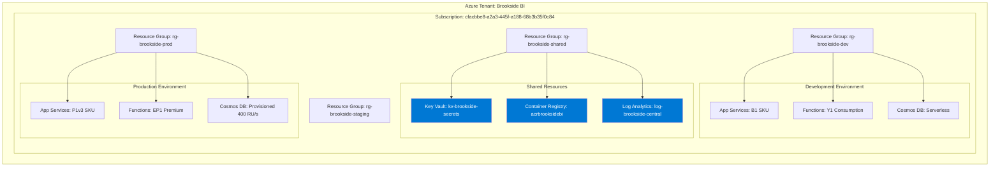
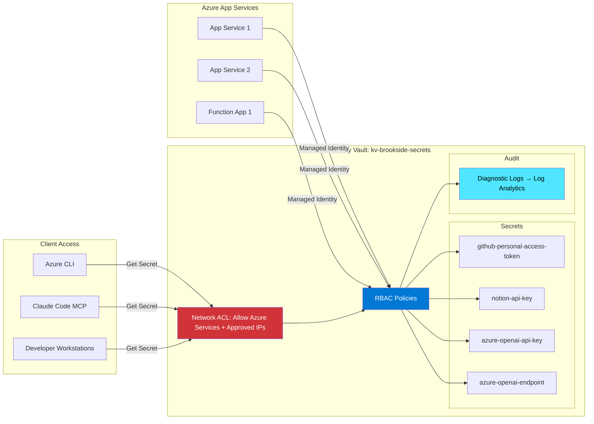
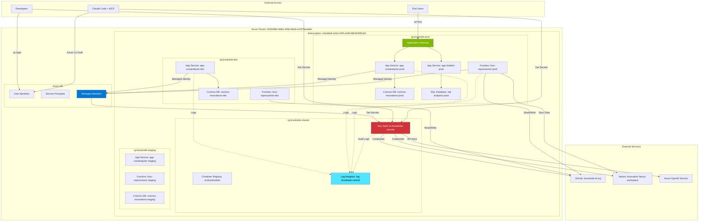
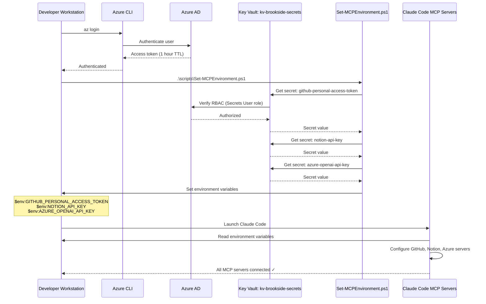
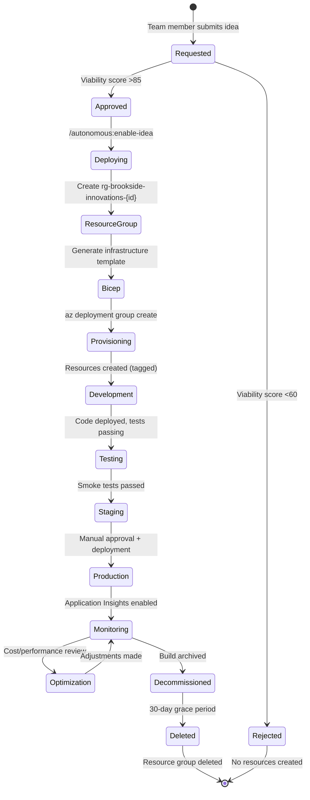

# Azure Infrastructure Setup

**Brookside BI Innovation Nexus Azure Architecture** - Establish secure, scalable cloud infrastructure that supports autonomous build pipelines, centralized secret management, and cost-optimized resource deployments across development, staging, and production environments.

**Best for**: New team members requiring comprehensive understanding of Azure resource organization, security architecture, and cost management strategies to support Innovation Nexus workflows effectively.

---

## Overview

Innovation Nexus leverages Azure as the primary cloud infrastructure platform, providing:

- **Centralized Secret Management**: Azure Key Vault stores all credentials for MCP servers and third-party integrations
- **Autonomous Build Deployments**: Azure App Services, Functions, and Container Apps host build outputs
- **Cost Optimization**: Environment-based SKU selection achieves 87% cost reduction ($20 dev vs $157 prod)
- **Security by Default**: Managed Identity, RBAC, and zero hardcoded secrets
- **Infrastructure as Code**: Bicep templates enable repeatable, auditable deployments

**Time Commitment**: 1-2 hours for initial understanding, reference as needed for specific operations

---

## Azure Subscription Overview

### Current Configuration

```yaml
Subscription Name: Brookside BI Production
Subscription ID: cfacbbe8-a2a3-445f-a188-68b3b35f0c84
Tenant Name: Brookside Business Intelligence
Tenant ID: 2930489e-9d8a-456b-9de9-e4787faeab9c
Region (Primary): East US 2
Environment: Production (with dev/staging resource groups)
```

**Verification Command**:
```bash
az login
az account show

# Expected Output:
{
  "id": "cfacbbe8-a2a3-445f-a188-68b3b35f0c84",
  "name": "Brookside BI Production",
  "tenantId": "2930489e-9d8a-456b-9de9-e4787faeab9c",
  "state": "Enabled",
  "isDefault": true
}
```

### Subscription Architecture



---

## Resource Organization Strategy

### Naming Conventions

**Standard Format**: `{resource-type}-{project}-{environment}-{region?}-{instance?}`

**Examples**:
```
Key Vault:        kv-brookside-secrets
App Service:      app-brookside-costanalyzer-prod-eastus2
Function App:     func-brookside-reposcanner-dev
Storage Account:  stbrooksidedata001  (no hyphens, 24 char max)
Cosmos DB:        cosmos-brookside-innovations-prod
Container App:    ca-brookside-chatbot-staging
```

**Rationale**: Consistent naming enables programmatic resource discovery, cost allocation, and automated governance policies.

### Resource Group Structure

| Resource Group | Purpose | Environment | Lifecycle |
|----------------|---------|-------------|-----------|
| `rg-brookside-shared` | Centralized services (Key Vault, ACR, Log Analytics) | All | Long-lived, never deleted |
| `rg-brookside-dev` | Development resources for testing builds | Development | Ephemeral, can be recreated |
| `rg-brookside-staging` | Pre-production validation environment | Staging | Stable, mirrors production |
| `rg-brookside-prod` | Production workloads and customer-facing services | Production | Critical, protected |
| `rg-brookside-innovations-{id}` | Temporary resources for autonomous builds | Development | Auto-deleted after 30 days |

**List All Resource Groups**:
```bash
az group list --output table

# Expected Output:
Name                          Location    Status
----------------------------  ----------  ---------
rg-brookside-shared           eastus2     Succeeded
rg-brookside-dev              eastus2     Succeeded
rg-brookside-staging          eastus2     Succeeded
rg-brookside-prod             eastus2     Succeeded
```

### Tagging Strategy

**Required Tags** (applied to ALL resources):

```yaml
Environment: Development | Staging | Production
Project: Innovation Nexus | Cost Analyzer | Repository Intelligence
Owner: {Team Member Name}
CostCenter: {Department Code}
AutoShutdown: true | false  # For dev resources
ManagedBy: Terraform | Bicep | Manual | Claude-Agent
CreatedDate: YYYY-MM-DD
NotionBuildId: {Build database entry ID}
```

**Tag Application Example**:
```bash
az resource tag \
  --ids /subscriptions/cfacbbe8-a2a3-445f-a188-68b3b35f0c84/resourceGroups/rg-brookside-dev/providers/Microsoft.Web/sites/app-cost-analyzer-dev \
  --tags Environment=Development Project="Innovation Nexus" Owner="Markus Ahling" CostCenter=Engineering AutoShutdown=true ManagedBy=Bicep NotionBuildId=123abc
```

**Benefits**:
- **Cost Allocation**: Track spending by project, owner, and environment
- **Automation**: Auto-shutdown policies for dev resources (save 60% on compute)
- **Governance**: Identify manually created resources vs infrastructure-as-code
- **Notion Integration**: Link Azure resources back to Innovation Nexus builds

---

## Azure Key Vault Architecture

### Overview

**Key Vault Name**: `kv-brookside-secrets`
**Resource Group**: `rg-brookside-shared`
**Vault URI**: `https://kv-brookside-secrets.vault.azure.net/`
**Access Model**: Azure RBAC (role-based access control)

**Purpose**: Centralized secret storage establishing zero-trust security model where no credentials are hardcoded in code, configuration files, or environment variables checked into Git.

### Key Vault Network Architecture



### Stored Secrets

| Secret Name | Purpose | Rotation Schedule | Used By |
|-------------|---------|-------------------|---------|
| `github-personal-access-token` | GitHub MCP server authentication, repository operations | Every 90 days | Claude Code, CI/CD pipelines |
| `notion-api-key` | Notion MCP server authentication, database operations | Every 180 days | Claude Code, automation scripts |
| `azure-openai-api-key` | Azure OpenAI API authentication for AI features | Every 90 days | Build deployments, research swarm |
| `azure-openai-endpoint` | Azure OpenAI service endpoint URL | When service migrates | Build deployments, research swarm |

**Secret Metadata** (every secret includes):
```yaml
Content-Type: application/json | text/plain
Tags:
  CreatedBy: {Person who created secret}
  LastRotated: YYYY-MM-DD
  RotationSchedule: 90d | 180d
  Owner: {Team responsible for rotation}
  NotionDocumentation: {Link to secret usage docs}
```

### Accessing Secrets

#### Method 1: PowerShell Retrieval Script (Recommended)

```powershell
# Retrieve single secret
.\scripts\Get-KeyVaultSecret.ps1 -SecretName "github-personal-access-token"

# Output:
# ghp_abc123xyz789...
# (Secret value copied to clipboard)
```

**Script Location**: `C:/Users/MarkusAhling/Notion/scripts/Get-KeyVaultSecret.ps1`

#### Method 2: Azure CLI Direct Access

```bash
# Retrieve secret value
az keyvault secret show \
  --vault-name kv-brookside-secrets \
  --name github-personal-access-token \
  --query value \
  --output tsv

# List all secrets
az keyvault secret list \
  --vault-name kv-brookside-secrets \
  --output table
```

#### Method 3: MCP Environment Configuration (Daily Workflow)

```powershell
# Configure all MCP environment variables from Key Vault
.\scripts\Set-MCPEnvironment.ps1 -Persistent

# Verify environment variables set
$env:GITHUB_PERSONAL_ACCESS_TOKEN  # Should output: ghp_...
$env:NOTION_API_KEY               # Should output: secret_...
```

**Best Practice**: Run `Set-MCPEnvironment.ps1` at start of each work session to ensure fresh credentials.

### RBAC Permissions Model

**Human Access** (Interactive Development):

| Role | Permissions | Assigned To | Use Case |
|------|-------------|-------------|----------|
| **Key Vault Secrets Officer** | Full secret CRUD | Alec Fielding, Markus Ahling | Secret rotation, emergency access |
| **Key Vault Secrets User** | Read secrets only | All developers | Daily MCP environment setup |
| **Key Vault Reader** | List secrets (no values) | New team members (initial) | Discover available secrets |

**Service Access** (Automated Deployments):

| Service | Identity Type | Permissions | Access Scope |
|---------|---------------|-------------|--------------|
| App Services | System-Assigned Managed Identity | Secrets User (specific secrets) | Only secrets needed for app |
| Function Apps | System-Assigned Managed Identity | Secrets User (specific secrets) | Only secrets needed for function |
| Azure DevOps | Service Principal | Secrets User (CI/CD secrets) | Deployment pipeline secrets |

**Requesting Access**:
```bash
# Step 1: Verify current access
az keyvault secret list --vault-name kv-brookside-secrets

# Step 2: If access denied, request from Alec Fielding or Markus Ahling
# Provide: Your email, required role (Reader/User/Officer), business justification
```

### Security Best Practices

**✅ DO**:
- Use `Set-MCPEnvironment.ps1` to populate environment variables from Key Vault
- Reference secrets in code via environment variables: `process.env.GITHUB_PERSONAL_ACCESS_TOKEN`
- Store Key Vault references in App Service configuration: `@Microsoft.KeyVault(SecretUri=https://kv-brookside-secrets.vault.azure.net/secrets/github-personal-access-token/)`
- Rotate secrets on schedule (90 or 180 days)
- Use Managed Identity for Azure service access (never store credentials in app)

**❌ NEVER**:
- Hardcode secret values in code: `const token = "ghp_abc123..."`
- Commit `.env` files with actual secret values to Git
- Share secrets via Slack, email, or Teams messages
- Use same secrets across dev/staging/production (separate credentials per environment)
- Display secret values in logs, console output, or error messages

### Key Vault Monitoring

**Audit Log Query** (detect unusual access patterns):
```kql
AzureDiagnostics
| where ResourceProvider == "MICROSOFT.KEYVAULT"
| where OperationName == "SecretGet"
| where ResultType == "Success"
| summarize AccessCount = count() by CallerIPAddress, identity_claim_http_schemas_xmlsoap_org_ws_2005_05_identity_claims_name_s, bin(TimeGenerated, 1h)
| order by AccessCount desc
```

**Access via Log Analytics**:
1. Navigate to Azure Portal → Log Analytics Workspace: `log-brookside-central`
2. Run KQL query above
3. Set alert if `AccessCount > 50` within 1 hour (potential credential leak)

---

## Active Azure Services Inventory

### Shared Services (rg-brookside-shared)

#### 1. Azure Key Vault

**Resource Name**: `kv-brookside-secrets`
**SKU**: Standard
**Monthly Cost**: ~$0.03/secret + $0.03/10,000 operations = ~$2/month
**Purpose**: Centralized secret management for MCP servers and application credentials
**Status**: Production
**Managed By**: Alec Fielding (primary), Markus Ahling (secondary)

**Connection Details**:
```yaml
Vault URI: https://kv-brookside-secrets.vault.azure.net/
Access: Azure RBAC (no legacy access policies)
Network: Public endpoint with firewall (approved IPs only)
Soft Delete: Enabled (90-day retention)
Purge Protection: Enabled (cannot permanently delete)
```

#### 2. Azure Container Registry

**Resource Name**: `acrbrooksidebi`
**SKU**: Basic
**Monthly Cost**: ~$5/month (50 GB storage included)
**Purpose**: Docker image storage for containerized builds and Function Apps
**Status**: Production
**Managed By**: Alec Fielding

**Connection Details**:
```yaml
Login Server: acrbrooksidebi.azurecr.io
Admin Access: Disabled (use Managed Identity or RBAC)
Geo-Replication: None (single region: East US 2)
Content Trust: Enabled (signed images only)
```

**Push Image Example**:
```bash
# 1. Authenticate via Azure CLI
az acr login --name acrbrooksidebi

# 2. Tag image
docker tag myapp:latest acrbrooksidebi.azurecr.io/myapp:v1.0.0

# 3. Push to registry
docker push acrbrooksidebi.azurecr.io/myapp:v1.0.0
```

#### 3. Log Analytics Workspace

**Resource Name**: `log-brookside-central`
**SKU**: Pay-As-You-Go
**Monthly Cost**: ~$2.30/GB ingested (avg 5 GB/month = ~$12)
**Purpose**: Centralized logging, monitoring, and security analytics for all Azure resources
**Status**: Production
**Managed By**: Alec Fielding

**Connected Resources**:
- All App Services and Function Apps (application logs)
- Key Vault (audit logs)
- Azure Monitor Alerts (metric-based alerts)
- Application Insights (performance telemetry)

**Useful KQL Queries**:
```kql
-- Failed authentication attempts (last 24 hours)
AzureDiagnostics
| where TimeGenerated > ago(24h)
| where Category == "AuditEvent"
| where OperationName == "Authentication"
| where ResultType == "Failed"
| summarize FailureCount = count() by CallerIPAddress, identity_claim_upn_s
| order by FailureCount desc

-- Top 10 most expensive operations (cost analysis)
AzureDiagnostics
| where TimeGenerated > ago(7d)
| summarize TotalCost = sum(todouble(properties_d.cost)) by OperationName
| top 10 by TotalCost desc
```

### Development Environment (rg-brookside-dev)

**Cost Target**: <$50/month (auto-shutdown enabled for all compute)

| Resource Type | Count | SKU | Monthly Cost | Auto-Shutdown |
|---------------|-------|-----|--------------|---------------|
| App Services | 3 | B1 (Basic) | $13 × 3 = $39 | Yes (8pm-8am) |
| Function Apps | 2 | Y1 (Consumption) | Pay-per-execution (~$2) | N/A |
| Cosmos DB | 1 | Serverless | Pay-per-RU (~$5) | N/A |
| SQL Database | 1 | Serverless (0.5-1 vCore) | ~$15 | Yes (weekends) |

**Total Development Cost**: ~$61/month (vs $420/month for always-on production-grade)

**Auto-Shutdown Schedule** (enabled via Azure DevOps pipeline):
```yaml
Weekdays: Shutdown 8:00 PM ET, Start 8:00 AM ET (save 12 hours/day)
Weekends: Shutdown Friday 8:00 PM, Start Monday 8:00 AM (save 60 hours)
Savings: ~60% cost reduction on compute resources
```

### Production Environment (rg-brookside-prod)

**Cost Target**: <$300/month (SLA-backed, highly available)

| Resource Type | Count | SKU | Monthly Cost | SLA |
|---------------|-------|-----|--------------|-----|
| App Services | 2 | P1v3 (Premium) | $120 × 2 = $240 | 99.95% |
| Function Apps | 1 | EP1 (Premium) | $150 | 99.95% |
| Cosmos DB | 1 | Provisioned (400 RU/s) | $24 | 99.99% |
| SQL Database | 1 | General Purpose (2 vCore) | $180 | 99.99% |
| Application Gateway | 1 | Standard_v2 | $145 | 99.95% |

**Total Production Cost**: ~$739/month

**High Availability Configuration**:
- Zone Redundancy: Enabled for App Services and Cosmos DB (3 availability zones)
- Backup Strategy: Daily automated backups with 30-day retention
- Disaster Recovery: Geo-replication to West US 2 (passive region)

---

## Access Management

### Azure Active Directory Roles

**Subscription-Level Roles**:

| Role | Members | Permissions | Use Case |
|------|---------|-------------|----------|
| **Owner** | Alec Fielding | Full control including RBAC assignments | Emergency access, governance |
| **Contributor** | Markus Ahling, Mitch Bisbee, Stephan Densby | Create/manage resources (no RBAC changes) | Daily development, deployments |
| **Reader** | Brad Wright, new team members | Read-only access to all resources | Cost analysis, architecture review |

**Resource Group-Specific Roles**:

| Resource Group | Role | Members | Purpose |
|----------------|------|---------|---------|
| `rg-brookside-dev` | Contributor | All developers | Full development access |
| `rg-brookside-staging` | Contributor | Markus Ahling, Alec Fielding, Mitch Bisbee | Pre-production testing |
| `rg-brookside-prod` | Reader | All developers (default) | Read-only production visibility |
| `rg-brookside-prod` | Contributor | Alec Fielding, Markus Ahling | Production deployments |

### Requesting Access

**Step 1: Determine Required Role**

Consult this decision tree:
```
Need to create/modify resources?
├─ YES → Need Contributor or Owner
│  └─ Need to assign roles to others?
│     ├─ YES → Request Owner
│     └─ NO → Request Contributor
└─ NO → Request Reader
```

**Step 2: Submit Access Request**

Email Alec Fielding (alec@brooksidebi.com) with:
```
Subject: Azure Access Request - [Your Name]

Requested Subscription: cfacbbe8-a2a3-445f-a188-68b3b35f0c84
Requested Role: Contributor | Reader | Owner
Scope: Subscription | Resource Group (specify: rg-brookside-dev)
Business Justification: [Describe specific tasks requiring this access]
Duration: Permanent | Temporary (specify end date)
```

**Step 3: Verify Access**

```bash
# List your role assignments
az role assignment list --assignee your-email@brooksidebi.com --output table

# Expected Output:
Principal                    Role          Scope
---------------------------  ------------  ------------------------------------
your-email@brooksidebi.com  Contributor   /subscriptions/cfacbbe8-a2a3-445f...
```

**Typical Turnaround**: 1-2 business days

### Just-In-Time (JIT) Access (Planned)

**Future Enhancement**: Azure AD Privileged Identity Management for time-limited elevated access

**Planned Workflow**:
1. Developer requests "Contributor" on `rg-brookside-prod` for 4 hours
2. Manager approves via Teams notification
3. Developer receives temporary elevated access
4. Access automatically revoked after 4 hours
5. All actions audited in Log Analytics

**Benefits**: Reduces standing privileged access by 80%, improves security posture

---

## Cost Management

### Current Spending Overview

**Monthly Azure Spend** (as of October 2025):

| Category | Development | Staging | Production | Total |
|----------|-------------|---------|------------|-------|
| Compute (App Services, Functions) | $41 | $80 | $390 | $511 |
| Databases (Cosmos DB, SQL) | $20 | $35 | $204 | $259 |
| Networking (App Gateway, VPN) | $5 | $10 | $145 | $160 |
| Storage (Blobs, ACR) | $8 | $12 | $25 | $45 |
| Monitoring (Log Analytics, App Insights) | $3 | $5 | $15 | $23 |
| **Total** | **$77** | **$142** | **$779** | **$998** |

**Annual Projection**: ~$12,000/year (within budget: $15,000)

### Budget Configuration

**Active Budgets**:

```yaml
Budget Name: brookside-dev-monthly
Scope: rg-brookside-dev
Amount: $100/month
Alerts:
  - 50% spent ($50): Email to Alec Fielding
  - 75% spent ($75): Email to Alec + Markus
  - 90% spent ($90): Email to all developers + auto-shutdown non-critical resources
  - 100% spent ($100): Block new resource creation

Budget Name: brookside-prod-monthly
Scope: rg-brookside-prod
Amount: $1,000/month
Alerts:
  - 80% spent ($800): Email to Alec + Markus + Brad (cost review meeting)
  - 100% spent ($1,000): Email to executives + emergency cost optimization
```

**View Budgets**:
```bash
az consumption budget list --output table
```

### Cost Optimization Strategies

#### 1. Auto-Shutdown Policies (Development)

**Savings**: 60% reduction on development compute costs

**Implementation**:
```bash
# Tag resources for auto-shutdown
az resource tag \
  --ids {resource-id} \
  --tags AutoShutdown=true ShutdownSchedule="Weekdays:20:00-08:00;Weekends:All"

# Automated via Azure Automation runbook (scheduled daily)
```

#### 2. Environment-Based SKU Selection

**Cost Comparison** (same application, different SKUs):

| Environment | App Service SKU | Function SKU | Cosmos DB | Monthly Cost | Use Case |
|-------------|-----------------|--------------|-----------|--------------|----------|
| Development | B1 (Basic) | Y1 (Consumption) | Serverless | $20 | Rapid testing, low traffic |
| Staging | S1 (Standard) | EP1 (Elastic Premium) | Provisioned 100 RU/s | $85 | Pre-production validation |
| Production | P1v3 (Premium) | EP1 (Elastic Premium) | Provisioned 400 RU/s | $157 | Customer-facing, SLA-backed |

**Savings**: 87% cost reduction (dev vs prod) for identical functionality

#### 3. Reserved Instances (Production)

**Recommendation**: Purchase 1-year reserved instances for stable production workloads

**Potential Savings**:
```
App Service P1v3 (2 instances):
- Pay-as-you-go: $240/month × 12 = $2,880/year
- 1-year reserved: $1,900/year (34% savings)
- 3-year reserved: $1,400/year (51% savings)
```

**Action Item**: Review production resource utilization quarterly, commit to reserved instances for resources with >80% monthly uptime

#### 4. Blob Storage Lifecycle Policies

**Strategy**: Auto-archive logs and backups to reduce storage costs

```yaml
Policy: brookside-log-archival
Scope: Storage Account st brooksidedata001
Rules:
  - Move to Cool tier: After 30 days (50% storage cost reduction)
  - Move to Archive tier: After 90 days (80% storage cost reduction)
  - Delete: After 365 days (100% cost elimination)
```

**Savings**: ~$40/month on log storage (projected)

### Cost Allocation and Chargebacks

**Tagging Strategy for Cost Attribution**:

```yaml
Required Tags (for billing):
  CostCenter: Engineering | Sales | Marketing | Operations
  Project: Innovation Nexus | Cost Analyzer | Repository Intelligence
  Owner: {Team Member Name}
  Environment: Development | Staging | Production
```

**Monthly Cost Report** (automated email, sent 1st of month):
```
Brookside BI Azure Cost Report - October 2025

By Cost Center:
  Engineering:  $720 (72%)
  Operations:   $180 (18%)
  Marketing:    $98  (10%)

By Project:
  Innovation Nexus:        $540 (54%)
  Repository Intelligence: $280 (28%)
  Cost Analyzer:           $178 (18%)

Top 5 Most Expensive Resources:
  1. app-brookside-prod-eastus2:       $120
  2. cosmos-brookside-innovations:     $98
  3. func-brookside-reposcanner-prod:  $75
  4. appgw-brookside-prod:             $65
  5. sql-brookside-analytics:          $52
```

**Access Cost Reports**:
```bash
# Via Azure CLI
az consumption usage list --start-date 2025-10-01 --end-date 2025-10-31 --output table

# Via Azure Portal
https://portal.azure.com → Cost Management + Billing → Cost Analysis
```

---

## Visual Diagrams

### Complete Azure Architecture



### Secret Retrieval Workflow



### Resource Lifecycle Management



---

## Daily Operations Checklist

### Morning Routine (5 minutes)

```bash
# 1. Authenticate to Azure
az login
az account show  # Verify correct subscription

# 2. Configure MCP environment
.\scripts\Set-MCPEnvironment.ps1

# 3. Verify MCP connectivity
claude mcp list
# Expected: All servers show ✓ Connected

# 4. Check budget status
az consumption budget show --budget-name brookside-dev-monthly
```

### Weekly Review (30 minutes, Fridays)

```bash
# 1. Review cost trends
az consumption usage list --start-date $(date -d '7 days ago' +%Y-%m-%d) --end-date $(date +%Y-%m-%d)

# 2. Identify orphaned resources (no tags)
az resource list --query "[?tags==null]" --output table

# 3. Check Key Vault audit logs for unusual access
# Navigate to Azure Portal → Log Analytics → Run KQL query

# 4. Verify backup status for production databases
az backup job list --resource-group rg-brookside-prod --vault-name rsv-brookside-prod
```

### Monthly Governance (2 hours, 1st of month)

```bash
# 1. Review and approve/reject resource group deletion candidates
az group list --tag AutoDelete=true --query "[?tags.CreatedDate<'$(date -d '30 days ago' +%Y-%m-%d)']"

# 2. Rotate Key Vault secrets (if due)
# Check LastRotated tag, rotate if >90 days old

# 3. Review RBAC assignments for least privilege
az role assignment list --all --output table

# 4. Generate cost report and submit to finance
az consumption usage list --start-date $(date -d '1 month ago' +%Y-%m-01) --end-date $(date -d '1 day ago' +%Y-%m-%d) --output json > monthly-cost-report.json
```

---

## Common Issues and Troubleshooting

### Issue 1: "Access Denied" when retrieving Key Vault secret

**Symptom**: `az keyvault secret show` returns 403 Forbidden

**Root Cause**: Insufficient RBAC permissions on Key Vault

**Resolution**:
```bash
# 1. Verify current access
az keyvault secret list --vault-name kv-brookside-secrets

# 2. If denied, check assigned roles
az role assignment list --assignee your-email@brooksidebi.com --scope /subscriptions/cfacbbe8-a2a3-445f-a188-68b3b35f0c84/resourceGroups/rg-brookside-shared/providers/Microsoft.KeyVault/vaults/kv-brookside-secrets

# 3. Request "Key Vault Secrets User" role from Alec Fielding
```

### Issue 2: Budget alert triggered, resources need emergency shutdown

**Symptom**: Email alert: "Budget 'brookside-dev-monthly' has exceeded 90%"

**Immediate Action**:
```bash
# 1. Identify most expensive running resources
az monitor metrics list --resource {resource-id} --metric "Percentage CPU" --start-time $(date -d '24 hours ago' -u +%Y-%m-%dT%H:%M:%SZ)

# 2. Shutdown non-critical App Services
az webapp stop --name app-costanalyzer-dev --resource-group rg-brookside-dev

# 3. Scale down to B1 (minimum) if needed
az appservice plan update --name plan-brookside-dev --resource-group rg-brookside-dev --sku B1

# 4. Notify team via Slack/Teams
```

### Issue 3: Managed Identity cannot access Key Vault

**Symptom**: Application logs show "No access token available for Key Vault"

**Root Cause**: Managed Identity not assigned to resource or not granted Key Vault permissions

**Resolution**:
```bash
# 1. Enable system-assigned managed identity
az webapp identity assign --name app-costanalyzer-prod --resource-group rg-brookside-prod

# 2. Get managed identity principal ID
PRINCIPAL_ID=$(az webapp identity show --name app-costanalyzer-prod --resource-group rg-brookside-prod --query principalId --output tsv)

# 3. Grant Key Vault access
az role assignment create \
  --role "Key Vault Secrets User" \
  --assignee $PRINCIPAL_ID \
  --scope /subscriptions/cfacbbe8-a2a3-445f-a188-68b3b35f0c84/resourceGroups/rg-brookside-shared/providers/Microsoft.KeyVault/vaults/kv-brookside-secrets

# 4. Restart app to pick up new identity
az webapp restart --name app-costanalyzer-prod --resource-group rg-brookside-prod
```

---

## Next Steps

**You've completed Azure Infrastructure Setup. Continue to:**

- **[MCP Server Configuration](06-mcp-server-setup.md)**: Configure Notion, GitHub, Azure, and Playwright MCP servers for Claude Code integration
- **[Common Workflows](07-common-workflows.md)**: Master Innovation Lifecycle, Cost Optimization, and Repository Intelligence workflows
- **[Troubleshooting FAQ](08-troubleshooting-faq.md)**: Resolve common issues across Notion, Azure, and MCP integrations

---

**Document Information**:
- **Last Updated**: October 26, 2025
- **Maintained By**: Alec Fielding (Infrastructure), Markus Ahling (Architecture)
- **Review Schedule**: Monthly (infrastructure changes), Quarterly (cost optimization)
- **Feedback**: Submit improvements to Innovation Nexus Ideas Registry with tag "Documentation"
