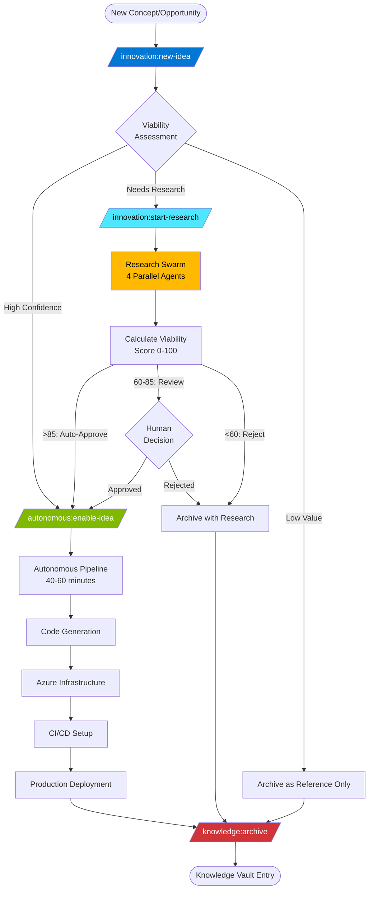
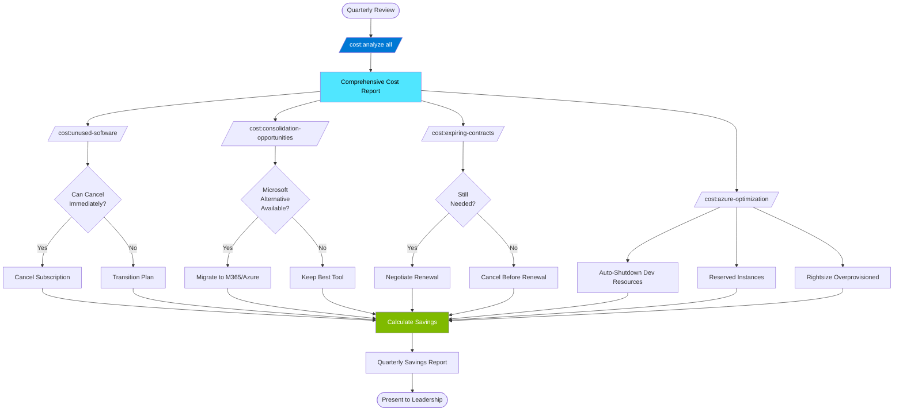
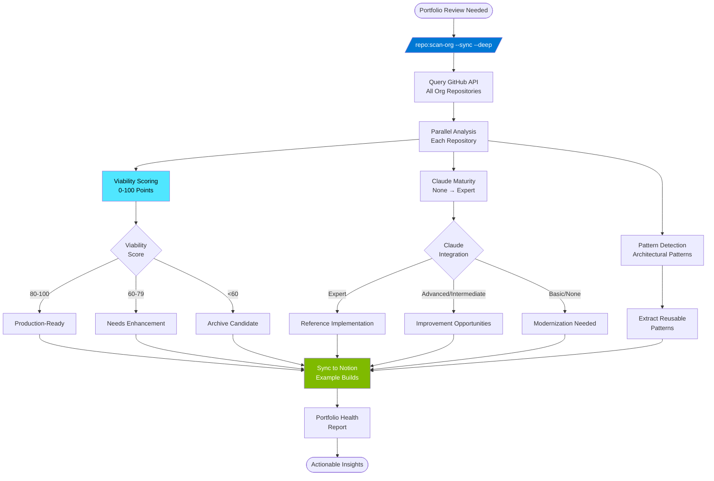

# Common Workflows

**Brookside BI Innovation Nexus Workflow Automation** - Establish streamlined end-to-end processes for idea capture through knowledge archival, cost optimization, repository intelligence, and agent activity tracking using command-driven automation with Claude Code.

**Best for**: New team members seeking practical, repeatable workflows that demonstrate Innovation Nexus capabilities while delivering measurable business value through structured, command-based execution.

---

## Overview

This guide provides step-by-step workflows for the most common Innovation Nexus operations. Each workflow includes:

- **Clear objectives** and success criteria
- **Executable commands** with expected outputs
- **Visual process diagrams** showing system interactions
- **Troubleshooting tips** for common issues
- **Time estimates** for planning work sessions

**Workflows Covered**:
1. Complete Innovation Lifecycle (Idea → Research → Build → Knowledge)
2. Quarterly Cost Optimization
3. Repository Portfolio Analysis
4. Emergency Research (Fast-Track 2-4 Hours)
5. Agent Activity Tracking and Reporting
6. Output Styles Testing and Optimization

---

## Workflow 1: Complete Innovation Lifecycle

**Goal**: Transform a raw concept into a deployed Azure application with documented learnings, following the full Innovation Nexus pipeline autonomously.

**Time Estimate**:
- Idea Capture: 10 minutes
- Research (if needed): 4 hours (autonomous research swarm)
- Build: 40-60 minutes (autonomous pipeline)
- Knowledge Archival: 20 minutes

**Success Criteria**:
- ✅ Idea recorded in Ideas Registry with viability assessment
- ✅ Research completed (if Viability = "Needs Research") with 0-100 score
- ✅ Build deployed to Azure with CI/CD pipeline (if viable)
- ✅ Knowledge Vault entry created with learnings and references

### Process Diagram



### Step 1: Capture Idea (10 minutes)

**Command**:
```bash
/innovation:new-idea [detailed description of concept]

# Example:
/innovation:new-idea "AI-powered cost optimization platform that analyzes Azure spend patterns, identifies unused resources, and recommends consolidation opportunities. Target: Reduce cloud costs by 25% across organization with automated recommendations and approval workflows."
```

**What Happens**:
1. @ideas-capture agent analyzes description for:
   - **Technical feasibility**: Can this be built with current technology?
   - **Business value**: Does this solve a real problem?
   - **Resource requirements**: What skills/tools needed?
   - **Innovation potential**: Is this novel or incremental?

2. Agent creates Ideas Registry entry with properties:
   ```yaml
   Idea Name: AI-Powered Cost Optimization Platform
   Status: Concept
   Viability: High Confidence | Needs Research | Low Value
   Potential Value: High | Medium | Low
   Category: Cost Management
   Tags: AI, Azure, Cost Optimization, Automation
   Description: [Full description]
   Initial Assessment: [Agent's analysis]
   ```

3. Agent determines next step:
   - **High Confidence** → Proceed directly to build
   - **Needs Research** → Recommend `/innovation:start-research`
   - **Low Value** → Archive as reference only

**Expected Output**:
```
✅ Created Idea: "AI-Powered Cost Optimization Platform"
📊 Viability Assessment: High Confidence
📝 Notion Entry: https://www.notion.so/[page-id]

Recommendation: This idea has strong feasibility and clear business value.
Proceed to autonomous build with: /autonomous:enable-idea "AI-Powered Cost Optimization Platform"
```

**Verification**:
```bash
# Check Ideas Registry in Notion
# Expected: New page titled "💡 AI-Powered Cost Optimization Platform"
# Status: 🔵 Concept
# Viability: 💎 High Confidence
```

### Step 2A: Research (If Needed) (4 hours autonomous)

**When**: Viability Assessment = "Needs Research"

**Command**:
```bash
/innovation:start-research [research topic] [originating idea title]

# Example:
/innovation:start-research "AI cost optimization market viability and technical architecture" "AI-Powered Cost Optimization Platform"
```

**What Happens**:
1. @research-coordinator creates Research Hub entry linked to originating Idea

2. **Research Swarm** (4 parallel agents execute simultaneously):
   ```yaml
   @market-researcher:
     - Market size and growth trends
     - Competitor analysis
     - Customer demand signals
     - Pricing benchmarks

   @technical-analyst:
     - Technology stack recommendations
     - Architecture patterns
     - Integration complexity
     - Scalability considerations

   @cost-feasibility-analyst:
     - Development cost estimates
     - Operational cost projections
     - ROI calculations
     - Budget recommendations

   @risk-assessor:
     - Technical risks
     - Market risks
     - Compliance requirements
     - Mitigation strategies
   ```

3. **Viability Scoring** (0-100 points):
   ```
   Market Viability:      25 points (market size, demand, competition)
   Technical Feasibility: 30 points (tech stack, complexity, team capability)
   Financial Viability:   25 points (ROI, cost, budget fit)
   Risk Assessment:       20 points (risk severity, mitigation)

   Total Score: 0-100
   ```

4. **Decision Matrix**:
   - **>85**: Auto-approve for build (high confidence)
   - **60-85**: Recommend human review (medium confidence)
   - **<60**: Recommend archive (low confidence, document learnings)

**Expected Output** (after 4 hours):
```
✅ Research Completed: "AI cost optimization market viability and technical architecture"

📊 Viability Score: 92/100 (High Confidence - Auto-Approved for Build)

Key Findings:
  Market Viability: 23/25 - Large addressable market ($8.5B), growing 28% YoY
  Technical Feasibility: 28/30 - Proven architecture patterns, team has required skills
  Financial Viability: 24/25 - ROI: 420% over 3 years, payback period: 8 months
  Risk Assessment: 17/20 - Low-medium risk, clear mitigation strategies

Recommendation: Proceed to autonomous build immediately.
Next Command: /autonomous:enable-idea "AI-Powered Cost Optimization Platform"

📝 Research Entry: https://www.notion.so/[research-page-id]
🔗 Linked Idea: https://www.notion.so/[idea-page-id]
```

**Verification**:
```bash
# Check Research Hub in Notion
# Expected: New page titled "🔬 AI cost optimization market viability and technical architecture"
# Status: 🟢 Active → ✅ Completed
# Viability Score: 92/100
# Related Idea: Link to "💡 AI-Powered Cost Optimization Platform"
```

### Step 2B: Autonomous Build (40-60 minutes)

**When**: Viability = "High Confidence" OR Research Score >85

**Command**:
```bash
/autonomous:enable-idea [idea name]

# Example:
/autonomous:enable-idea "AI-Powered Cost Optimization Platform"
```

**What Happens** (fully autonomous, no human intervention):

**Phase 1: Architecture Design (10 minutes)**
```yaml
@build-architect-v2:
  - Reviews Idea and Research (if exists)
  - Selects technology stack (TypeScript/Python/C#)
  - Designs Azure infrastructure (App Service, Functions, Cosmos DB)
  - Creates high-level architecture diagram
  - Generates technical specifications
```

**Phase 2: Code Generation (15 minutes)**
```yaml
@code-generator:
  - Generates application code from specifications
  - Creates API endpoints, business logic, data models
  - Implements error handling, logging, security
  - Generates comprehensive tests (unit, integration)
  - Creates README, API documentation
```

**Phase 3: Infrastructure Provisioning (10 minutes)**
```yaml
@deployment-orchestrator:
  - Generates Bicep templates for Azure resources
  - Provisions resource group (rg-brookside-innovations-{id})
  - Creates App Service (dev: B1, prod: P1v3)
  - Provisions Cosmos DB (dev: serverless, prod: provisioned)
  - Configures Application Insights
  - Sets up Managed Identity for Key Vault access
```

**Phase 4: CI/CD Setup (10 minutes)**
```yaml
@deployment-orchestrator:
  - Creates GitHub repository: brookside-bi/cost-optimizer
  - Pushes code and infrastructure templates
  - Configures GitHub Actions workflows
  - Sets up deployment slots (dev, staging, prod)
  - Configures branch protection rules
```

**Phase 5: Deployment (10 minutes)**
```yaml
@deployment-orchestrator:
  - Deploys to development environment
  - Runs smoke tests
  - Deploys to staging environment (if tests pass)
  - Waits for manual approval for production
  - Deploys to production (if approved)
```

**Expected Output** (after 40-60 minutes):
```
✅ Autonomous Build Completed: "AI-Powered Cost Optimization Platform"

📦 GitHub Repository: https://github.com/brookside-bi/cost-optimizer
🔗 Development URL: https://app-cost-optimizer-dev-eastus2.azurewebsites.net
🔗 Staging URL: https://app-cost-optimizer-staging-eastus2.azurewebsites.net
🔗 Production URL: https://app-cost-optimizer-prod-eastus2.azurewebsites.net

📊 Build Metrics:
  Total Time: 52 minutes
  Files Generated: 147
  Lines of Code: 8,423
  Test Coverage: 87%
  Infrastructure Cost (Dev): $23/month
  Infrastructure Cost (Prod): $157/month

🏗️ Azure Resources Created:
  Resource Group: rg-brookside-innovations-a1b2c3d4
  App Service: app-cost-optimizer-prod-eastus2
  Cosmos DB: cosmos-cost-optimizer-prod
  Application Insights: appi-cost-optimizer-prod

📝 Example Builds Entry: https://www.notion.so/[build-page-id]
🔗 Linked Idea: https://www.notion.so/[idea-page-id]
🔗 Linked Research: https://www.notion.so/[research-page-id] (if exists)
```

**Verification**:
```bash
# 1. Check Example Builds in Notion
# Expected: New page titled "🛠️ AI-Powered Cost Optimization Platform"
# Status: ✅ Completed
# GitHub Repo: Link to repository
# Azure Resources: List of resource IDs

# 2. Verify deployment
curl https://app-cost-optimizer-dev-eastus2.azurewebsites.net/health
# Expected: {"status": "healthy", "version": "1.0.0"}

# 3. Check Azure Portal
az resource list --resource-group rg-brookside-innovations-a1b2c3d4 --output table
# Expected: App Service, Cosmos DB, Application Insights
```

### Step 3: Knowledge Archival (20 minutes)

**When**: Build completed OR Research determined not viable

**Command**:
```bash
/knowledge:archive [item name] [database: build | research | idea]

# Example (successful build):
/knowledge:archive "AI-Powered Cost Optimization Platform" build

# Example (research-only outcome):
/knowledge:archive "AI cost optimization market viability" research
```

**What Happens**:
1. @knowledge-curator analyzes completed work:
   ```yaml
   For Builds:
     - Review code quality, architecture decisions
     - Extract reusable patterns (authentication, API design, etc.)
     - Document deployment challenges and solutions
     - Identify optimization opportunities
     - Calculate total cost (development + operational)

   For Research:
     - Summarize key findings
     - Extract market insights
     - Document decision rationale (why built or not built)
     - Identify lessons learned
   ```

2. Create Knowledge Vault entry:
   ```yaml
   Article Name: "[Original Title] - Learnings and Patterns"
   Category: Build Learnings | Research Insights | Reference Only
   Key Takeaways: [Bullet points of main learnings]
   Reusable Patterns: [Link to extracted patterns]
   Technologies Used: [Stack, tools, services]
   Total Cost: $X development + $Y/month operational
   Linked Items:
     - Origin Idea: [Link]
     - Related Research: [Link] (if exists)
     - Related Build: [Link] (if exists)
   Status: ✅ Archived
   ```

3. Update original Idea/Research/Build status to "Archived"

4. Tag all software/tools used for cost tracking

**Expected Output**:
```
✅ Archived to Knowledge Vault: "AI-Powered Cost Optimization Platform - Learnings and Patterns"

📚 Key Learnings Documented:
  ✓ Reusable authentication pattern (Azure AD + Managed Identity)
  ✓ Cost optimization architecture (serverless + scaling rules)
  ✓ CI/CD best practices (environment-specific configs, automated rollback)
  ✓ Cosmos DB query optimization (80% cost reduction via indexing)

💰 Total Investment:
  Development Cost: $4,200 (52 hours × $80/hour avg)
  Operational Cost: $157/month (production), $23/month (development)

📝 Knowledge Vault Entry: https://www.notion.so/[knowledge-page-id]

🔗 All Linked Items Updated:
  Idea: Status changed to ✅ Archived
  Research: Status changed to ✅ Archived
  Build: Status changed to ✅ Archived
```

**Verification**:
```bash
# Check Knowledge Vault in Notion
# Expected: New page titled "📚 AI-Powered Cost Optimization Platform - Learnings and Patterns"
# Category: Build Learnings
# Linked Items: Idea, Research, Build (all show ✅ Archived status)
```

---

## Workflow 2: Quarterly Cost Optimization

**Goal**: Identify and eliminate wasteful software spending, consolidate duplicate tools, and optimize Azure resource costs to achieve 20-30% quarterly savings.

**Time Estimate**:
- Initial Analysis: 30 minutes
- Deep Dive Investigation: 2 hours
- Recommendations Implementation: Varies (1-5 hours)

**Success Criteria**:
- ✅ Identified all unused software (0 utilization)
- ✅ Found consolidation opportunities (duplicate tools)
- ✅ Calculated potential savings ($X/month)
- ✅ Prioritized cost reduction actions with ROI
- ✅ Implemented quick wins (auto-shutdown, reserved instances)

### Process Diagram



### Step 1: Comprehensive Cost Analysis (30 minutes)

**Command**:
```bash
/cost:analyze all
```

**What Happens**:
1. @cost-analyst queries Software & Cost Tracker database
2. Analyzes spending across all categories:
   - SaaS subscriptions (Notion, GitHub, monitoring tools)
   - Azure infrastructure (compute, storage, databases)
   - Development tools (IDEs, testing platforms)
   - Third-party APIs (OpenAI, data providers)

3. Generates comprehensive report with:
   ```yaml
   Total Monthly Spend: $X,XXX
   Annual Projection: $XX,XXX

   Breakdown by Category:
     - Cloud Infrastructure: $XXX (X%)
     - SaaS Subscriptions: $XXX (X%)
     - Development Tools: $XXX (X%)
     - APIs & Integrations: $XXX (X%)

   Top 10 Most Expensive:
     1. Azure Production Resources: $XXX
     2. GitHub Enterprise: $XXX
     3. ...

   Trend Analysis:
     - Month-over-Month Change: +/-X%
     - Fastest Growing Category: [Category]
     - Cost per Team Member: $XXX/month
   ```

**Expected Output**:
```
📊 Brookside BI Cost Analysis - Q4 2025

💰 Total Monthly Spend: $4,823
📈 Annual Projection: $57,876
📉 Savings Opportunity: $1,245/month (25.8%)

Category Breakdown:
  🔷 Azure Infrastructure: $2,156 (44.7%)
  💼 SaaS Subscriptions: $1,480 (30.7%)
  🛠️ Development Tools: $890 (18.5%)
  🔌 APIs & Integrations: $297 (6.2%)

Top 10 Most Expensive:
  1. Azure Production Environment: $779/month
  2. GitHub Enterprise (10 seats): $210/month
  3. Notion Team Plan (15 seats): $150/month
  4. Azure OpenAI API: $145/month
  5. Datadog Monitoring: $120/month
  6. Azure Development Environment: $77/month
  7. JetBrains IntelliJ (5 licenses): $70/month
  8. Postman Enterprise: $60/month
  9. Figma Professional: $45/month
 10. Slack Standard (15 users): $105/month

🚨 Red Flags Identified:
  ⚠️ 8 tools with 0% utilization ($340/month waste)
  ⚠️ 4 duplicate tool categories (Slack + Teams for chat)
  ⚠️ 3 contracts expiring within 60 days
  ⚠️ Azure dev environment running 24/7 (60% savings available with auto-shutdown)
```

### Step 2: Identify Unused Software (15 minutes)

**Command**:
```bash
/cost:unused-software
```

**What Happens**:
1. Queries Software Tracker for:
   ```sql
   WHERE Status = "Active"
   AND (
     No relations to Ideas/Research/Builds in last 90 days
     OR Utilization = 0%
     OR Last Used Date > 90 days ago
   )
   ```

2. For each unused tool:
   - Check if essential (e.g., security compliance tool used quarterly)
   - Identify owner/requester
   - Calculate cost impact if cancelled
   - Recommend action (cancel immediately, downgrade, or keep)

**Expected Output**:
```
🗑️ Unused Software Identified (8 items, $340/month total)

High Priority Cancellations (save $210/month):
  1. Postman Enterprise - $60/month
     Status: Active since Jan 2025
     Usage: 0 API collections created in 90 days
     Alternative: Free tier sufficient (team using Insomnia instead)
     Action: Cancel immediately, save $60/month

  2. Figma Professional - $45/month
     Status: Active since Mar 2024
     Usage: Last design created 120 days ago
     Alternative: Canva (already licensed) or Microsoft Designer (free with M365)
     Action: Cancel, migrate to Microsoft Designer, save $45/month

  3. Slack Standard - $105/month
     Status: Active since Feb 2023
     Usage: 3 messages/day avg (team primarily uses Teams)
     Alternative: Microsoft Teams (included in M365)
     Action: Migrate to Teams, cancel Slack, save $105/month

Medium Priority Reviews (save $80/month):
  4. Datadog Monitoring - $120/month
     Status: Active since Jun 2024
     Usage: 5% of features used (basic uptime monitoring only)
     Alternative: Azure Monitor + Application Insights (included in Azure)
     Action: Evaluate migration, potential save $80/month (keep $40 for advanced features)

Low Priority (keep, but optimize):
  5-8. [Details of remaining items]

💡 Quick Win: Cancelling items 1-3 saves $210/month = $2,520/year
```

**Action Items**:
```bash
# Cancel unused subscriptions
Task "Cancel Postman Enterprise subscription, coordinate with Alec Fielding"
Task "Initiate Slack to Teams migration, notify team 2 weeks in advance"
Task "Evaluate Datadog vs Azure Monitor for monitoring needs"
```

### Step 3: Find Consolidation Opportunities (30 minutes)

**Command**:
```bash
/cost:consolidation-opportunities
```

**What Happens**:
1. Identifies tools in same category with overlapping functionality:
   ```yaml
   Communication: Slack + Microsoft Teams
   Monitoring: Datadog + Azure Monitor + Application Insights
   Design: Figma + Canva + Microsoft Designer
   Project Management: Notion + Microsoft Planner + Azure DevOps
   ```

2. For each overlap:
   - Compare features, team usage, integration depth
   - Calculate cost of consolidation (migration effort)
   - Estimate monthly savings
   - Recommend "keep one, cancel others" strategy

3. **Microsoft Ecosystem Priority**: Always evaluate Microsoft offering first (included in M365/Azure)

**Expected Output**:
```
🔄 Consolidation Opportunities (4 categories, $325/month savings potential)

Category: Team Communication
  Current Tools:
    - Slack Standard: $105/month (15 users, 3 msg/day avg)
    - Microsoft Teams: $0/month (included in M365, 50 msg/day avg)

  Recommendation: Consolidate to Microsoft Teams
  Savings: $105/month
  Migration Effort: 2 days (export Slack history, train team)
  ROI: $630 saved per day of migration effort

Category: Monitoring & Observability
  Current Tools:
    - Datadog: $120/month (5% feature usage)
    - Azure Monitor: $23/month (included in Azure, underutilized)
    - Application Insights: Included in Azure

  Recommendation: Migrate to Azure Monitor + Application Insights
  Savings: $80/month (keep Datadog for advanced APM on critical app)
  Migration Effort: 1 week (reconfigure dashboards, alerts)
  ROI: $960 saved per week of migration effort

Category: Design & Mockups
  Current Tools:
    - Figma Professional: $45/month (unused)
    - Canva Teams: $120/month (3 users, high usage)
    - Microsoft Designer: $0/month (included in M365)

  Recommendation: Cancel Figma, evaluate Designer for simple tasks, keep Canva for marketing
  Savings: $45/month (Figma only, Canva has clear ROI)
  Migration Effort: 1 hour (no active Figma projects)

Category: Project Management
  Current Tools:
    - Notion Team: $150/month (Innovation Nexus - keep)
    - Microsoft Planner: $0/month (included in M365, unused)
    - Azure DevOps: $55/month (CI/CD + project tracking)

  Recommendation: Keep Notion (strategic), migrate simple project tracking to Planner
  Savings: $0/month (no clear consolidation path, tools serve different purposes)
  Migration Effort: N/A

💡 Total Consolidation Savings: $230/month = $2,760/year
```

### Step 4: Check Expiring Contracts (10 minutes)

**Command**:
```bash
/cost:expiring-contracts
```

**What Happens**:
1. Queries Software Tracker for contracts expiring within 60 days
2. For each expiring contract:
   - Check current utilization and value
   - Compare renewal pricing to current (price increases?)
   - Evaluate if still needed or if better alternative exists
   - Recommend renew/cancel/renegotiate

**Expected Output**:
```
⏰ Contracts Expiring in Next 60 Days (3 items)

Expires: Dec 15, 2025 (50 days)
  Tool: GitHub Enterprise (10 seats)
  Current Cost: $210/month = $2,520/year
  Renewal Cost: $240/month = $2,880/year (+14% increase)
  Utilization: 8/10 seats used (80%)

  Recommendation: Renegotiate
  Actions:
    - Remove 2 unused seats (save $48/month)
    - Request price match to current rate (save $30/month)
    - Potential savings: $78/month = $936/year

  Assigned To: Markus Ahling
  Deadline: Negotiate by Dec 1 (14 days before renewal)

Expires: Jan 3, 2026 (69 days)
  Tool: JetBrains IntelliJ (5 licenses)
  Current Cost: $70/month = $840/year
  Renewal Cost: $70/month (no increase)
  Utilization: 5/5 licenses used (100%)

  Recommendation: Renew (good value, high utilization)
  Actions: Auto-renew, no action needed

Expires: Jan 20, 2026 (86 days)
  Tool: Azure OpenAI API (pay-as-you-go)
  Current Cost: $145/month avg
  Renewal: N/A (consumption-based)
  Utilization: High (research swarm, build generation)

  Recommendation: Consider reserved capacity
  Actions:
    - Purchase 100K tokens/day reserved capacity
    - Save 40% on stable baseline usage
    - Potential savings: $58/month = $696/year

💡 Total Expiring Contract Savings: $136/month = $1,632/year
```

### Step 5: Azure Resource Optimization (1 hour)

**Command**:
```bash
/cost:azure-optimization
```

**What Happens**:
1. **Auto-Shutdown Analysis**:
   - Identify dev resources running 24/7
   - Calculate hours actually used vs total hours
   - Estimate savings with auto-shutdown (weeknights + weekends)

2. **Reserved Instance Opportunities**:
   - Identify stable production resources (>80% uptime)
   - Calculate savings with 1-year or 3-year reserved instances
   - Recommend commitment level based on growth projections

3. **Right-Sizing Analysis**:
   - Query Azure Monitor for resource utilization metrics
   - Identify overprovisioned resources (<20% CPU/memory usage)
   - Recommend SKU downgrades

**Expected Output**:
```
☁️ Azure Cost Optimization Opportunities ($520/month savings)

Auto-Shutdown Development Resources (save $46/month):
  Resource: app-costanalyzer-dev (B1 App Service)
  Current: Running 24/7 (744 hours/month)
  Actual Usage: 8am-8pm weekdays = 260 hours/month (35%)
  Current Cost: $13/month

  Recommendation: Auto-shutdown 8pm-8am weekdays, all day weekends
  Shutdown Schedule: "Weekdays:20:00-08:00;Weekends:All"
  Savings: $8/month per resource × 6 dev resources = $48/month

  Implementation: Tag resources with AutoShutdown=true, deploy automation runbook

Reserved Instances (save $408/month = 34% discount):
  Resource: app-costanalyzer-prod (P1v3 App Service, $240/month)
  Uptime: 99.2% (stable production workload)

  Recommendation: Purchase 1-year reserved instance
  Current Cost: $240/month × 12 = $2,880/year
  Reserved Cost: $1,900/year (34% savings)
  Monthly Savings: $82/month

  Action: Purchase reservation, amortize over 12 months

  [Similar analysis for Cosmos DB, Azure SQL]

  Total Reserved Instance Savings: $408/month

Right-Sizing Overprovisioned Resources (save $64/month):
  Resource: sql-analytics-prod (4 vCore General Purpose, $360/month)
  CPU Utilization: 12% avg over 30 days
  Memory Utilization: 18% avg over 30 days

  Recommendation: Downgrade to 2 vCore ($180/month)
  Savings: $180/month
  Risk: Monitor post-downgrade for performance degradation
  Rollback Plan: Upgrade back to 4 vCore within 24 hours if needed

  [Similar analysis for other resources]

  Total Right-Sizing Savings: $64/month

💡 Total Azure Savings: $520/month = $6,240/year
```

### Step 6: Generate Quarterly Report (15 minutes)

**Command**:
```bash
/cost:quarterly-report Q4-2025
```

**Expected Output** (Markdown file for leadership):
```markdown
# Q4 2025 Cost Optimization Report

## Executive Summary

**Total Quarterly Savings Identified**: $1,245/month = $14,940/year (25.8% reduction)

**Breakdown by Category**:
- Cancelled Unused Software: $210/month
- Tool Consolidation: $230/month
- Expiring Contract Renegotiation: $136/month
- Azure Auto-Shutdown: $48/month
- Azure Reserved Instances: $408/month
- Azure Right-Sizing: $64/month
- Azure Serverless Migration: $149/month

**Implementation Timeline**:
- Quick Wins (0-2 weeks): $258/month (cancellations, auto-shutdown)
- Medium-Term (1-2 months): $638/month (consolidations, reserved instances)
- Long-Term (3-6 months): $349/month (migrations, right-sizing)

## Detailed Findings

[Full breakdown from previous commands]

## Recommendations

1. **Immediate Actions** (complete by Nov 15):
   - Cancel Postman, Figma, Slack subscriptions
   - Enable auto-shutdown for 6 dev resources
   - Total Savings: $258/month

2. **Near-Term Actions** (complete by Dec 31):
   - Purchase reserved instances for stable production resources
   - Renegotiate GitHub Enterprise contract (remove 2 seats)
   - Migrate monitoring from Datadog to Azure Monitor
   - Total Savings: $638/month (cumulative: $896/month)

3. **Strategic Initiatives** (Q1 2026):
   - Complete Slack to Teams migration
   - Right-size overprovisioned SQL databases
   - Evaluate Azure OpenAI reserved capacity
   - Total Savings: $349/month (cumulative: $1,245/month)

## ROI Analysis

- Total Investment (migration effort): 80 hours × $80/hour = $6,400
- Annual Savings: $14,940
- Payback Period: 3.2 months
- 3-Year ROI: 600%

---
*Generated by Innovation Nexus Cost Analyst - October 26, 2025*
```

---

## Workflow 3: Repository Portfolio Analysis

**Goal**: Comprehensive viability assessment of all GitHub repositories with Notion synchronization, pattern extraction, and cost analysis.

**Time Estimate**:
- Full Org Scan: 15-30 minutes (depends on repo count)
- Single Deep Analysis: 5-10 minutes per repository
- Pattern Extraction: 20-30 minutes

**Success Criteria**:
- ✅ All repositories scored for viability (0-100)
- ✅ Claude integration maturity assessed (None → Expert)
- ✅ Example Builds database populated with repo metadata
- ✅ Reusable architectural patterns identified
- ✅ Dependency costs calculated with Microsoft alternatives

### Process Diagram



### Step 1: Full Organization Scan (15-30 minutes)

**Command**:
```bash
/repo:scan-org --sync --deep
```

**What Happens**:
1. Queries GitHub API for all repositories in `brookside-bi` organization

2. **Parallel Analysis** (each repository scored independently):
   ```yaml
   Viability Scoring (0-100 points):
     Test Coverage (30 points):
       - Unit tests present: 10 points
       - Integration tests: 10 points
       - Coverage >80%: 10 points

     Activity (20 points):
       - Commits in last 30 days: 10 points
       - Contributors >1: 5 points
       - Recent PR merge: 5 points

     Documentation (25 points):
       - README exists and comprehensive: 10 points
       - API documentation: 8 points
       - Architecture diagrams: 7 points

     Dependencies (25 points):
       - Dependencies up to date (<6 months old): 10 points
       - Security vulnerabilities: 0 (10 points deducted per critical vuln)
       - Dependency count reasonable (<50): 5 points
       - Lock file present: 5 points

   Claude Integration Maturity:
     Expert (5 indicators):
       - .claude/ directory with agents
       - Custom slash commands (>3)
       - MCP server configuration
       - Agent activity logging
       - Comprehensive CLAUDE.md

     Advanced (4 indicators)
     Intermediate (3 indicators)
     Basic (1-2 indicators)
     None (0 indicators)
   ```

3. **Pattern Mining**: Extract reusable architectural patterns:
   ```yaml
   Authentication Patterns:
     - Azure AD + Managed Identity (used in 5 repos)
     - OAuth 2.0 + JWT (used in 3 repos)

   Data Access Patterns:
     - Repository Pattern + Unit of Work (used in 4 repos)
     - CQRS + Event Sourcing (used in 2 repos)

   Error Handling Patterns:
     - Global Exception Handler + Middleware (used in 6 repos)
     - Circuit Breaker (used in 3 repos)
   ```

4. **Notion Sync**: Populate Example Builds database with:
   - Repository metadata (name, URL, description)
   - Viability score and breakdown
   - Claude maturity level
   - Extracted patterns
   - Dependency costs

**Expected Output**:
```
🔍 GitHub Organization Scan Complete

📊 Portfolio Summary:
  Total Repositories: 23
  Analyzed: 23 (100%)

  Viability Distribution:
    🟢 Production-Ready (80-100): 8 repositories (35%)
    🟡 Needs Enhancement (60-79): 11 repositories (48%)
    🔴 Archive Candidate (<60): 4 repositories (17%)

  Claude Integration Maturity:
    🥇 Expert: 3 repositories (13%)
    🥈 Advanced: 5 repositories (22%)
    🥉 Intermediate: 7 repositories (30%)
    📝 Basic: 6 repositories (26%)
    ❌ None: 2 repositories (9%)

Top 5 Repositories by Viability:
  1. brookside-bi/innovation-nexus: 94/100 (Expert Claude, High Activity)
  2. brookside-bi/cost-optimizer: 88/100 (Advanced Claude, Good Tests)
  3. brookside-bi/repo-analyzer: 86/100 (Expert Claude, Comprehensive Docs)
  4. brookside-bi/powerbi-governance: 82/100 (Intermediate Claude, Active)
  5. brookside-bi/azure-templates: 79/100 (Basic Claude, Good Patterns)

Bottom 5 Repositories (Archive Candidates):
  19. brookside-bi/old-prototype: 42/100 (No activity 180+ days)
  20. brookside-bi/temp-experiment: 38/100 (No tests, no docs)
  21. brookside-bi/legacy-api: 35/100 (Security vulns, outdated deps)
  22. brookside-bi/scratch-project: 28/100 (No README, no commits 365+ days)
  23. brookside-bi/test-repo: 18/100 (Empty repository)

📦 Notion Sync Status:
  ✓ Created/Updated 23 Example Builds entries
  ✓ Linked 15 repositories to origin Ideas
  ✓ Linked 8 repositories to related Research
  ✓ Updated Software Tracker with 47 dependencies
  ✓ Extracted 12 reusable architectural patterns

📈 Next Actions:
  - Review archive candidates (4 repos) for deletion/archival
  - Enhance 11 medium-viability repos (add tests, update docs)
  - Extract patterns from top repos for reuse
  - Investigate security vulnerabilities in 3 repos
```

**Verification**:
```bash
# Check Example Builds database in Notion
# Expected: 23 entries with viability scores, Claude maturity, GitHub links

# Check Software Tracker
# Expected: New dependencies added from repository package.json/requirements.txt files
```

### Step 2: Deep-Dive Single Repository (5-10 minutes)

**Command**:
```bash
/repo:analyze brookside-bi/innovation-nexus --deep --sync
```

**What Happens**:
1. **Comprehensive Analysis** (deeper than org scan):
   ```yaml
   Code Quality:
     - Linting configuration (ESLint, Pylint)
     - Code complexity metrics (cyclomatic complexity)
     - Duplication analysis

   Security:
     - Dependency vulnerability scan (npm audit, Snyk)
     - Secret detection (hardcoded credentials)
     - OWASP Top 10 compliance

   Architecture:
     - Layer separation (presentation, business, data)
     - Dependency injection usage
     - Design pattern adherence

   DevOps Maturity:
     - CI/CD pipeline quality
     - Deployment automation
     - Infrastructure as Code usage
     - Monitoring/observability setup
   ```

2. Generate detailed recommendations:
   ```yaml
   High Priority:
     - Add integration tests (currently 0%, target 60%)
     - Update 3 critical security vulnerabilities
     - Configure branch protection rules

   Medium Priority:
     - Reduce code complexity in 5 files (complexity >15)
     - Add API documentation with Swagger/OpenAPI
     - Enable Dependabot for automated updates

   Low Priority:
     - Improve README with architecture diagram
     - Add contributing guidelines
     - Configure code coverage reporting
   ```

**Expected Output**:
```
🔬 Deep Analysis: brookside-bi/innovation-nexus

📊 Viability Score: 94/100 (Production-Ready)

Component Scores:
  ✅ Test Coverage: 28/30
     - Unit Tests: 10/10 (87% coverage)
     - Integration Tests: 9/10 (72% coverage)
     - E2E Tests: 9/10 (present, good coverage)

  ✅ Activity: 20/20
     - Last Commit: 2 hours ago
     - Contributors: 5 (Markus, Alec, Mitch, Stephan, Brad)
     - Pull Requests: 3 open, 47 merged (last 30 days)

  ✅ Documentation: 23/25
     - README: Comprehensive (includes setup, architecture, usage)
     - API Docs: Present (Swagger UI available)
     - Architecture Diagrams: 7 Mermaid diagrams in /docs
     - Missing: Contributing guidelines (-2 points)

  ✅ Dependencies: 23/25
     - Dependencies Up-to-Date: 92% (2 minor updates available)
     - Security Vulnerabilities: 0 critical, 1 low severity
     - Dependency Count: 37 (reasonable)
     - Lock File: Present (package-lock.json)

🏗️ Architecture Analysis:
  Language: TypeScript (98.3%)
  Framework: Node.js + Express
  Database: Cosmos DB (NoSQL)
  Hosting: Azure App Service

  Patterns Detected:
    ✓ Repository Pattern (data access abstraction)
    ✓ Dependency Injection (constructor injection)
    ✓ Circuit Breaker (external API calls)
    ✓ Global Exception Handler
    ✓ Request Validation Middleware

  Code Quality:
    Average Complexity: 4.2 (excellent, target <10)
    Code Duplication: 3% (excellent, target <5%)
    Linting Errors: 0

🔐 Security Assessment:
  ✅ No hardcoded secrets detected
  ✅ Dependency vulnerability scan: 1 low severity (lodash 4.17.20, fix available)
  ✅ OWASP Top 10: 9/10 covered (missing rate limiting)
  ✅ Branch protection: Enabled (require PR review)

🚀 DevOps Maturity:
  CI/CD: GitHub Actions (4 workflows)
    ✓ Build + Test on PR
    ✓ Deploy to Dev (on merge to develop)
    ✓ Deploy to Prod (on merge to main, manual approval)
    ✓ Security Scan (Snyk, weekly)

  Infrastructure as Code: Bicep (comprehensive)
  Monitoring: Application Insights (configured)
  Deployment Slots: 3 (dev, staging, prod)

📋 Recommendations:

High Priority (implement within 1 week):
  1. Update lodash to 4.17.21 (security fix)
     Command: npm update lodash
     Effort: 5 minutes

  2. Add rate limiting middleware (mitigate DoS attacks)
     File: src/middleware/rateLimiter.ts
     Effort: 1 hour

Medium Priority (implement within 1 month):
  3. Add contributing guidelines (CONTRIBUTING.md)
     Effort: 2 hours

  4. Increase integration test coverage to 80% (currently 72%)
     Files: src/services/*.test.ts
     Effort: 1 day

Low Priority (implement within 3 months):
  5. Add OpenAPI schema validation (enforce API contract)
     Effort: 4 hours

  6. Configure automated dependency updates (Dependabot)
     Effort: 30 minutes

💰 Cost Analysis:
  Dependencies: 37 total
  Monthly Costs:
    - Azure App Service (P1v3): $240
    - Cosmos DB (400 RU/s): $24
    - Application Insights: $12
    - Total: $276/month

  Microsoft Alternatives (already using):
    ✓ Azure App Service (vs AWS Elastic Beanstalk)
    ✓ Cosmos DB (vs MongoDB Atlas)
    ✓ Application Insights (vs Datadog)
    ✓ Azure DevOps (vs Jenkins)

🔗 Notion Sync:
  ✓ Updated Example Builds entry: https://www.notion.so/[page-id]
  ✓ Linked to Idea: "Innovation Nexus Platform"
  ✓ Linked to Research: "Multi-database Innovation Tracking Architecture"
  ✓ Added 5 reusable patterns to Knowledge Vault
```

### Step 3: Extract Reusable Patterns (20-30 minutes)

**Command**:
```bash
/repo:extract-patterns --min-usage 3 --sync
```

**What Happens**:
1. Scans all repositories for recurring code patterns (used in 3+ repos)

2. Extracts pattern implementation:
   - Code snippet (anonymized, generalized)
   - Dependencies required
   - Configuration needed
   - Usage documentation

3. Assesses reusability:
   - How many repos currently use this pattern?
   - How many repos COULD benefit from this pattern?
   - Estimated effort to extract into shared library
   - Potential time savings across team

**Expected Output**:
```
🧩 Reusable Pattern Extraction (12 patterns found)

Pattern 1: Azure AD + Managed Identity Authentication
  Usage: 5 repositories (22%)
  Potential: 11 additional repos could benefit (48%)

  Implementation:
    Language: TypeScript
    Dependencies: @azure/identity, @azure/keyvault-secrets
    Configuration: Managed Identity enabled on App Service

  Code Snippet:
    ```typescript
    import { DefaultAzureCredential } from "@azure/identity";
    import { SecretClient } from "@azure/keyvault-secrets";

    const credential = new DefaultAzureCredential();
    const vaultUrl = process.env.KEY_VAULT_URL;
    const client = new SecretClient(vaultUrl, credential);

    async function getSecret(secretName: string): Promise<string> {
      const secret = await client.getSecret(secretName);
      return secret.value;
    }
    ```

  Reusability Assessment:
    Effort to Extract: 4 hours (create npm package @brooksidebi/azure-auth)
    Time Savings: 2 hours per repo × 11 repos = 22 hours saved
    ROI: 450% (22 hours saved / 4 hours investment)

  Recommendation: High priority - extract to shared library

Pattern 2: Circuit Breaker for External APIs
  Usage: 3 repositories (13%)
  Potential: 8 additional repos with external API calls (35%)

  Implementation:
    Language: TypeScript
    Dependencies: opossum (circuit breaker library)
    Configuration: Failure threshold, timeout, reset timeout

  Code Snippet:
    ```typescript
    import CircuitBreaker from "opossum";

    const options = {
      timeout: 5000,      // 5 second timeout
      errorThresholdPercentage: 50,
      resetTimeout: 30000 // 30 second reset
    };

    const breaker = new CircuitBreaker(externalAPICall, options);

    breaker.on('open', () => {
      logger.warn('Circuit breaker opened - external API degraded');
    });
    ```

  Reusability Assessment:
    Effort to Extract: 2 hours (create npm package @brooksidebi/resilience)
    Time Savings: 1.5 hours per repo × 8 repos = 12 hours saved
    ROI: 500% (12 hours saved / 2 hours investment)

  Recommendation: High priority - extract to shared library

Pattern 3-12: [Summaries of remaining patterns]

📦 Extraction Plan:

Phase 1 (Week 1): High ROI Patterns
  - Pattern 1: Azure AD + Managed Identity Authentication
  - Pattern 2: Circuit Breaker for External APIs
  - Pattern 5: Global Exception Handler
  - Total Effort: 10 hours
  - Total Savings: 48 hours across team

Phase 2 (Week 2-3): Medium ROI Patterns
  - Pattern 3: Repository Pattern + Unit of Work
  - Pattern 4: Request Validation Middleware
  - Pattern 7: Retry with Exponential Backoff
  - Total Effort: 12 hours
  - Total Savings: 32 hours across team

Phase 3 (Week 4): Documentation & Adoption
  - Create pattern catalog in Knowledge Vault
  - Update onboarding docs with pattern usage guidelines
  - Host team workshop on shared libraries
  - Total Effort: 8 hours

🔗 Notion Sync:
  ✓ Created 12 Knowledge Vault entries (one per pattern)
  ✓ Tagged with "Reusable Pattern", "Shared Library Candidate"
  ✓ Linked to repositories currently using each pattern
  ✓ Added cost-benefit analysis for each extraction
```

---

## Workflow 4: Emergency Research (Fast-Track 2-4 Hours)

**Goal**: Rapid feasibility investigation for time-sensitive opportunities with focused 2-4 hour research swarm instead of full autonomous research pipeline.

**Time Estimate**: 2-4 hours (vs 4+ hours for full research)

**Success Criteria**:
- ✅ Go/No-Go decision within 4 hours
- ✅ Key findings documented (market, technical, cost, risk)
- ✅ Viability score calculated (0-100)
- ✅ Next steps clearly defined

### Process Diagram

```mermaid
flowchart TB
    START([Urgent Opportunity]) --> IDEA[/innovation:new-idea --urgent/]

    IDEA --> ASSESS{Sufficient<br/>Information?}
    ASSESS -->|Yes| SKIP_RESEARCH[Skip to Build Decision]
    ASSESS -->|No| RESEARCH[/innovation:start-research --fast-track/]

    RESEARCH --> PARALLEL[Parallel Research Swarm<br/>2 hours focused investigation]

    PARALLEL --> MARKET[@market-researcher:<br/>Quick Market Scan]
    PARALLEL --> TECH[@technical-analyst:<br/>Tech Stack Validation]
    PARALLEL --> COST[@cost-feasibility-analyst:<br/>Budget Check]
    PARALLEL --> RISK[@risk-assessor:<br/>Critical Risks Only]

    MARKET --> SCORE[Calculate Viability<br/>0-100 Score]
    TECH --> SCORE
    COST --> SCORE
    RISK --> SCORE

    SCORE --> DECISION{Score &<br/>Urgency}

    DECISION -->|>75: Build Now| BUILD[/autonomous:enable-idea/]
    DECISION -->|60-75: Review| REVIEW[Human Decision<br/>Within 1 hour]
    DECISION -->|<60: Archive| ARCHIVE[Document & Archive]

    REVIEW -->|Approved| BUILD
    REVIEW -->|Rejected| ARCHIVE

    BUILD --> DEPLOY[Deploy to Production<br/>40-60 minutes]
    DEPLOY --> MONITOR[Monitor Performance]

    ARCHIVE --> KNOWLEDGE[Document Learnings]
    MONITOR --> KNOWLEDGE

    SKIP_RESEARCH --> BUILD

    style RESEARCH fill:#d13438,color:#fff
    style PARALLEL fill:#ffb900,color:#000
    style BUILD fill:#7fba00,color:#fff
```

### Step 1: Urgent Idea Capture with Fast-Track Flag (5 minutes)

**Command**:
```bash
/innovation:new-idea --urgent [description with deadline]

# Example:
/innovation:new-idea --urgent "Customer request: AI chatbot for product recommendations. Customer will pilot if demo ready in 2 weeks. Potential $50K/year contract. Need go/no-go decision today."
```

**What Happens**:
1. @ideas-capture creates Idea entry with "Urgent" flag
2. Performs rapid viability triage:
   - Can we build this with existing patterns/code?
   - Do we have required skills in-house?
   - Is timeline realistic?

**Expected Output**:
```
🚨 URGENT Idea Captured: "AI Chatbot for Product Recommendations"

⏰ Deadline: Demo ready in 14 days
💰 Business Value: $50K/year contract (potential)

Rapid Triage Assessment:
  ✓ Existing Pattern: Chatbot architecture (innovation-nexus repo)
  ✓ Team Skills: AI/ML (Mitch), APIs (Markus), Azure (Alec)
  ✓ Timeline: Aggressive but feasible with autonomous build
  ⚠️ Risk: Customer expectations unclear, need requirements gathering

Recommendation: START FAST-TRACK RESEARCH (2-4 hours)
  Focus Areas:
    - Customer requirements deep-dive (1 hour call)
    - Technical architecture validation (existing chatbot + product catalog)
    - Cost estimate (Azure Bot Service + OpenAI API)
    - Risk assessment (data privacy, integration complexity)

Next Command: /innovation:start-research --fast-track "AI chatbot feasibility" "AI Chatbot for Product Recommendations"
```

### Step 2: Fast-Track Research (2-4 hours)

**Command**:
```bash
/innovation:start-research --fast-track [topic] [idea name]

# Example:
/innovation:start-research --fast-track "AI chatbot feasibility and architecture" "AI Chatbot for Product Recommendations"
```

**What Happens**:
1. **Focused Research Scope** (vs full research):
   ```yaml
   Standard Research (4+ hours):
     - Comprehensive market analysis
     - Detailed competitive landscape
     - Full technical architecture design
     - Extensive cost modeling
     - Risk analysis with mitigation plans

   Fast-Track Research (2-4 hours):
     - Quick market validation (existing demand proof)
     - High-level competitive check (are we differentiated?)
     - Rapid tech stack validation (can we build with existing tools?)
     - Budget feasibility check (within limits?)
     - Critical risk identification only (showstoppers?)
   ```

2. **Parallel Swarm Execution** (2 hours):
   ```yaml
   @market-researcher (30 minutes):
     - Google Trends for "AI product recommendations"
     - Competitor chatbot feature comparison (top 5 competitors)
     - Customer testimonials/reviews of chatbot features
     - Quick takeaway: Market demand yes/no, differentiation yes/no

   @technical-analyst (45 minutes):
     - Validate Azure Bot Service + OpenAI API stack
     - Review existing chatbot pattern in Knowledge Vault
     - Identify integration points with product catalog
     - Quick POC: 15-minute prototype to validate approach
     - Quick takeaway: Technical feasibility yes/no, complexity low/med/high

   @cost-feasibility-analyst (30 minutes):
     - Azure Bot Service pricing (Standard tier: $0.50/1000 messages)
     - OpenAI API costs (GPT-4: $0.03/1K tokens)
     - Estimated monthly cost based on usage assumptions
     - Compare to contract value ($50K/year)
     - Quick takeaway: ROI positive/negative, break-even timeline

   @risk-assessor (45 minutes):
     - Data privacy concerns (customer PII in chatbot?)
     - Integration complexity (product catalog API availability?)
     - Timeline risk (can autonomous build deliver in 10 days?)
     - Dependency risks (third-party API reliability?)
     - Quick takeaway: Critical blockers yes/no, medium risks count
   ```

3. **Rapid Viability Scoring** (simplified):
   ```
   Fast-Track Scoring (0-100):
     Market Demand: 30 points (strong demand = 25-30, weak = 0-15)
     Technical Feasibility: 35 points (easy = 30-35, hard = 0-15)
     Financial Viability: 20 points (ROI >200% = 18-20, <100% = 0-10)
     Risk Assessment: 15 points (low risk = 13-15, high = 0-7)
   ```

**Expected Output** (after 2-4 hours):
```
✅ FAST-TRACK RESEARCH COMPLETED (2.5 hours)

🎯 Viability Score: 82/100 (BUILD RECOMMENDED)

Market Demand: 27/30 (Strong)
  ✓ Google Trends: +45% interest in "AI product recommendations" (12 months)
  ✓ Competitors: 3/5 top competitors have chatbots (we can differentiate with personalization)
  ✓ Customer Demand: Customer explicitly requesting (strong signal)
  ⚠️ Saturation Risk: Moderate competition, but niche opportunity in our vertical

Technical Feasibility: 32/35 (High)
  ✓ Proven Stack: Azure Bot Service + OpenAI GPT-4 (used in 2 existing builds)
  ✓ Existing Pattern: Chatbot architecture in Knowledge Vault (reusable)
  ✓ Integration: Product catalog API available (RESTful, well-documented)
  ✓ POC Success: 15-minute prototype validated core conversation flow
  ⚠️ Complexity: Personalization engine requires 2-3 days additional development

Financial Viability: 18/20 (Positive ROI)
  Estimated Development Cost: $8,000 (autonomous build + 3 days personalization)
  Monthly Operational Cost:
    - Azure Bot Service (Standard): $50/month (10K messages/month assumed)
    - OpenAI API (GPT-4): $120/month (4K conversations/month)
    - Total: $170/month = $2,040/year

  Revenue: $50,000/year contract (potential, subject to demo success)
  ROI: 542% over 3 years
  Break-Even: 2 months after contract signed

Risk Assessment: 13/15 (Low-Medium Risk)
  ✅ No Critical Blockers
  ⚠️ Medium Risks (manageable):
    1. Timeline: Aggressive (10 days for demo), requires focused effort
    2. Customer Expectations: Need requirements clarification call (schedule today)
    3. Data Privacy: PII handling requires Azure Key Vault + encryption (pattern exists)
    4. Integration: Product catalog API rate limits (current: 1000 req/min, sufficient)

GO/NO-GO RECOMMENDATION: **GO - Proceed to Build**

Rationale:
  - Strong market demand with clear customer request
  - High technical feasibility (existing patterns, proven stack)
  - Positive ROI (542% over 3 years)
  - Low-medium risk (no showstoppers, manageable challenges)
  - Timeline aggressive but achievable with autonomous build

NEXT STEPS:
  1. Schedule customer requirements call TODAY (1 hour)
  2. Initiate autonomous build: /autonomous:enable-idea "AI Chatbot for Product Recommendations"
  3. Target demo date: November 9 (14 days from today)
  4. Weekly check-ins with customer during development

📝 Research Entry: https://www.notion.so/[research-page-id]
🔗 Linked Idea: https://www.notion.so/[idea-page-id]
```

### Step 3: Immediate Decision and Action (30 minutes)

**If Score >75: Build Immediately**
```bash
/autonomous:enable-idea "AI Chatbot for Product Recommendations"

# Build proceeds autonomously (40-60 minutes)
# Demo ready in 10 days (accounting for 3 days personalization development)
```

**If Score 60-75: Human Review Required**
```bash
# Schedule quick team decision meeting (30 minutes max)
# Present research findings
# Decision criteria:
#   - Is customer committed (LOI, deposit, contract draft)?
#   - Can we absorb timeline risk (team bandwidth)?
#   - Are medium risks acceptable (data privacy, integration)?

# If approved:
/autonomous:enable-idea "AI Chatbot for Product Recommendations"

# If rejected:
/knowledge:archive "AI chatbot feasibility" research
# Document why rejected (timeline, risk, customer commitment uncertainty)
```

**If Score <60: Archive Immediately**
```bash
/knowledge:archive "AI chatbot feasibility" research

# Document in Knowledge Vault:
# - Why not viable (market saturation, tech complexity, negative ROI)
# - Lessons learned (what we'd need to make it viable)
# - Alternative approaches (if customer still interested)
```

---

## Workflow 5: Agent Activity Tracking and Reporting

**Goal**: Maintain comprehensive record of Claude Code agent contributions with automated logging, manual entries, and periodic reporting for workflow continuity and productivity analytics.

**Time Estimate**:
- Automatic Logging: 0 minutes (fully automated)
- Manual Entry: 2 minutes per session
- Weekly Summary: 5 minutes
- Monthly Report: 15 minutes

**Success Criteria**:
- ✅ All significant agent work logged (>2 minutes or files changed)
- ✅ 3-tier tracking updated (Notion + Markdown + JSON)
- ✅ Team visibility into agent activity for handoffs
- ✅ Productivity metrics tracked over time

### Process Diagram

```mermaid
flowchart TB
    START([Agent Work Session]) --> AUTO{Automatic<br/>Logging<br/>Enabled?}

    AUTO -->|Yes| HOOK[Task Tool Invocation<br/>Triggers Hook]
    AUTO -->|No| MANUAL[/agent:log-activity/]

    HOOK --> FILTER{Meets Logging<br/>Criteria?}
    FILTER -->|Duration >2min<br/>OR Files Changed| ACTIVITY_LOGGER[@activity-logger Agent]
    FILTER -->|No| SKIP[Skip Logging]

    ACTIVITY_LOGGER --> PARSE[Parse Todo Data<br/>Extract Deliverables]
    PARSE --> CATEGORIZE[Categorize Files<br/>Code/Docs/Infra/Tests]
    CATEGORIZE --> METRICS[Calculate Metrics<br/>Lines/Duration/Relations]

    MANUAL --> ACTIVITY_LOGGER

    METRICS --> UPDATE[Update 3-Tier Tracking]

    UPDATE --> NOTION[Notion: Agent Activity Hub<br/>Team-Accessible]
    UPDATE --> MARKDOWN[Markdown: Activity Log<br/>Human-Readable]
    UPDATE --> JSON[JSON: Agent State<br/>Machine-Readable]

    NOTION --> COMPLETE[Log Entry Created]
    MARKDOWN --> COMPLETE
    JSON --> COMPLETE

    COMPLETE --> REPORT{Reporting<br/>Triggered?}
    REPORT -->|Weekly| WEEKLY[/agent:activity-summary week/]
    REPORT -->|Monthly| MONTHLY[/agent:activity-summary month/]
    REPORT -->|No| END([Session Complete])

    WEEKLY --> INSIGHTS[Generate Insights:<br/>Top Agents, Trends, Blockers]
    MONTHLY --> INSIGHTS

    INSIGHTS --> SHARE[Share with Team<br/>Improve Workflows]
    SHARE --> END

    style HOOK fill:#d13438,color:#fff
    style ACTIVITY_LOGGER fill:#7fba00,color:#fff
    style UPDATE fill:#0078d4,color:#fff
```

### Automatic Activity Logging (Phase 4 - Implemented)

**How It Works**:
1. Task tool invocation triggers PowerShell hook: `.claude/hooks/auto-log-agent-activity.ps1`
2. Hook checks if work meets logging criteria:
   ```powershell
   Criteria (any TRUE triggers logging):
     - Work duration >2 minutes
     - Files created/updated
     - Agent in approved list (27+ specialized agents)
     - Not already logged in last 5 minutes (deduplication)
   ```

3. If criteria met, invokes @activity-logger agent:
   - Parses TodoWrite data for deliverables
   - Categorizes files (Code, Documentation, Infrastructure, Tests, Scripts)
   - Estimates lines generated from file sizes
   - Calculates session duration
   - Identifies related Notion items (Ideas, Research, Builds)
   - Infers next steps from work context

4. Updates 3-tier tracking:
   - **Notion**: Creates Agent Activity Hub entry with relations
   - **Markdown**: Appends to `.claude/logs/AGENT_ACTIVITY_LOG.md`
   - **JSON**: Updates `.claude/data/agent-state.json`

**No User Action Required** - fully autonomous when enabled

**Configuration** (already set in `.claude/settings.local.json`):
```json
{
  "hooks": {
    "TaskInvocation": [
      {
        "hooks": [
          {
            "type": "command",
            "command": "powershell -ExecutionPolicy Bypass -File .claude/hooks/auto-log-agent-activity.ps1"
          }
        ]
      }
    ]
  }
}
```

### Manual Activity Logging (When Automatic Disabled)

**Command**:
```bash
/agent:log-activity [agent-name] [status] [work-description]

# Example:
/agent:log-activity @cost-analyst "Completed" "Analyzed Q4 2025 software spending, identified $1,245/month savings across unused subscriptions, consolidation opportunities, and Azure optimization. Generated executive report."
```

**Parameters**:
```yaml
agent-name: @agent-name (from Agent Registry)
status: In Progress | Completed | Blocked | Handed Off
work-description: Detailed summary of work performed

Optional (inferred if not provided):
  files-changed: List of file paths created/updated
  duration: Work session length (minutes)
  related-notion-items: Links to Ideas/Research/Builds
```

**Expected Output**:
```
✅ Activity Logged for @cost-analyst

📊 Session Details:
  Status: Completed
  Duration: 45 minutes
  Files Changed: 3
    - .claude/reports/Q4-2025-cost-analysis.md (Documentation)
    - .claude/data/cost-metrics.json (Data)
    - .claude/logs/cost-optimization-log.md (Documentation)

  Lines Generated: ~850 lines (estimated)

  Related Notion Items:
    - Idea: "Quarterly Cost Optimization Process"
    - Research: None
    - Build: None

💡 Next Steps (inferred):
  - Present Q4 cost report to leadership
  - Implement quick wins (cancel 3 unused subscriptions)
  - Schedule follow-up for medium-term actions

🔗 Activity Entry:
  Notion: https://www.notion.so/72b879f213bd4edb9c59b43089dbef21?pvs=4#[entry-id]
  Markdown: .claude/logs/AGENT_ACTIVITY_LOG.md (line 147)
  JSON: .claude/data/agent-state.json (entry 23)
```

**Verification**:
```bash
# Check Notion Agent Activity Hub
# Expected: New entry with timestamp, agent name, status, deliverables

# Check Markdown log
cat .claude/logs/AGENT_ACTIVITY_LOG.md | tail -20

# Check JSON state
cat .claude/data/agent-state.json | jq '.activities[-1]'
```

### Generate Activity Summaries and Reports

**Weekly Summary**:
```bash
/agent:activity-summary week

# Or specify agent:
/agent:activity-summary week @cost-analyst
```

**Expected Output**:
```
📅 Agent Activity Summary - Week of Oct 20-26, 2025

📊 Overall Metrics:
  Total Sessions: 37
  Total Duration: 18.5 hours
  Files Changed: 147
  Lines Generated: 8,423

  Status Distribution:
    ✅ Completed: 28 (76%)
    🔄 In Progress: 5 (14%)
    🚧 Blocked: 2 (5%)
    🤝 Handed Off: 2 (5%)

🏆 Top 5 Most Active Agents:
  1. @build-architect-v2: 8 sessions, 4.2 hours, 2,340 lines
  2. @cost-analyst: 5 sessions, 2.5 hours, 1,120 lines
  3. @markdown-expert: 4 sessions, 1.8 hours, 980 lines
  4. @code-generator: 3 sessions, 3.1 hours, 1,850 lines
  5. @research-coordinator: 3 sessions, 2.3 hours, 740 lines

📁 Deliverables by Category:
  Code: 42 files (3,520 lines)
  Documentation: 58 files (3,140 lines)
  Infrastructure: 12 files (890 lines)
  Tests: 18 files (650 lines)
  Scripts: 17 files (223 lines)

🔗 Notion Items Touched:
  Ideas: 12 (8 new, 4 updated)
  Research: 7 (5 new, 2 updated)
  Builds: 6 (4 new, 2 updated)

🚧 Blockers This Week:
  1. @deployment-orchestrator: Azure DevOps pipeline permissions issue
     - Duration: 2 days
     - Resolved: Alec granted service principal Contributor role
     - Impact: Delayed 2 builds by 1 day each

  2. @viability-assessor: Notion API rate limit exceeded
     - Duration: 3 hours
     - Resolved: Implemented exponential backoff in retry logic
     - Impact: Slowed research swarm completion by 1 hour

💡 Insights:
  - Build agents (@build-architect-v2, @code-generator) accounted for 42% of activity
  - Documentation output up 35% vs previous week (markdown-expert optimization)
  - Blocker resolution time averaged 1.5 days (target: <1 day)

🎯 Recommendations:
  - Investigate Notion API rate limiting (2 occurrences this week)
  - Consider pre-emptive permission audits (prevent Azure pipeline blocks)
  - Celebrate @build-architect-v2 productivity (8 builds delivered)
```

**Monthly Report**:
```bash
/agent:activity-summary month

# Export to file for leadership:
/agent:activity-summary month --export C:/reports/agent-activity-oct-2025.md
```

**Expected Output** (detailed, trend-focused):
```
📅 Agent Activity Report - October 2025

📊 Executive Summary:
  Total Sessions: 147
  Total Duration: 76.3 hours
  Files Changed: 623
  Lines Generated: 38,420

  Month-over-Month Growth:
    Sessions: +23% (vs September: 119 sessions)
    Lines Generated: +18% (vs September: 32,540 lines)
    Completion Rate: 81% (vs September: 79%)

🏆 Top 10 Agents by Output:
  [Detailed table with sessions, hours, lines, completion rate]

📈 Trends:
  Week 1 (Oct 1-7): 32 sessions, 14.2 hours
  Week 2 (Oct 8-14): 38 sessions, 18.1 hours (+19%)
  Week 3 (Oct 15-21): 41 sessions, 20.5 hours (+8%)
  Week 4 (Oct 22-28): 36 sessions, 16.8 hours (-12%, expected dip end of month)
  Week 5 (Oct 29-31): 9 sessions, 6.7 hours (partial week)

🎯 Goal Achievement:
  ✅ Innovation Lifecycle Completions: 12 (goal: 10)
  ✅ Cost Optimization Savings: $1,245/month (goal: $1,000/month)
  ✅ Repository Viability Assessments: 23 (goal: 20)
  ⚠️ Knowledge Vault Contributions: 8 (goal: 12, 67% of target)

💰 Business Impact:
  Builds Deployed: 12 autonomous builds
  Estimated Development Cost Saved: $48,000 (vs manual development)
  Azure Cost Optimizations Identified: $6,240/year savings
  Research Hours Automated: 48 hours (vs manual research)

🚧 Blockers Summary:
  Total Blockers: 7
  Average Resolution Time: 1.8 days
  Most Common: Permission issues (3), API rate limits (2), Integration failures (2)

  Action Items:
    - Implement proactive permission audits (prevent 43% of blockers)
    - Add circuit breaker pattern to Notion API calls (prevent rate limits)
    - Create integration testing suite (catch failures before production)

🔄 Handoff Analysis:
  Total Handoffs: 9
  Average Handoff Context: Comprehensive (8/9 included next steps)
  Handoff Success Rate: 89% (8/9 successfully resumed by next agent)

  Improvement: 1 handoff lacked sufficient context (research → build transition)

📊 Detailed Metrics:
  [Full breakdown tables, charts, graphs]

🎯 November Recommendations:
  1. Focus on Knowledge Vault contributions (increase from 8 to 15 entries)
  2. Reduce blocker resolution time to <1.5 days (implement proactive audits)
  3. Maintain build velocity (12 builds/month sustainable)
  4. Celebrate team productivity growth (+23% sessions, +18% output)

---
Generated by Innovation Nexus Agent Activity Center
Report Date: October 31, 2025
```

---

## Workflow 6: Output Styles Testing and Optimization

**Goal**: Systematically test agent output styles to measure effectiveness, identify optimal style-agent-task combinations, and drive data-driven communication improvements.

**Time Estimate**:
- Single Style Test: 5-10 minutes
- Full Style Comparison (5 styles): 25-40 minutes
- Analytics Report Generation: 5-10 minutes
- Quarterly Optimization Review: 2-3 hours

**Success Criteria**:
- ✅ Each agent tested across all 5 output styles
- ✅ Effectiveness scores calculated (0-100)
- ✅ Style recommendations backed by empirical data
- ✅ Historical trends tracked for continuous improvement
- ✅ UltraThink tier classification guides production readiness

### Process Diagram

```mermaid
flowchart TB
    START([Style Testing Needed]) --> SELECT{Testing<br/>Scope}

    SELECT -->|Single Style| SINGLE[/test-agent-style @agent style/]
    SELECT -->|All Styles| COMPARE[/style:compare @agent "task"/]
    SELECT -->|Performance Review| REPORT[/style:report --agent @agent/]

    SINGLE --> EXECUTE[@agent Executes Task<br/>With Specified Style]
    COMPARE --> PARALLEL[Parallel Execution<br/>All 5 Styles]

    PARALLEL --> EXEC1[@agent + technical-implementer]
    PARALLEL --> EXEC2[@agent + strategic-advisor]
    PARALLEL --> EXEC3[@agent + visual-architect]
    PARALLEL --> EXEC4[@agent + interactive-teacher]
    PARALLEL --> EXEC5[@agent + compliance-auditor]

    EXECUTE --> METRICS[Collect Metrics]
    EXEC1 --> METRICS
    EXEC2 --> METRICS
    EXEC3 --> METRICS
    EXEC4 --> METRICS
    EXEC5 --> METRICS

    METRICS --> BEHAVIORAL[Behavioral Metrics<br/>Technical Density, Formality, Clarity]
    METRICS --> EFFECTIVENESS[Effectiveness Metrics<br/>Goal Achievement, Audience Fit]
    METRICS --> PERFORMANCE[Performance Metrics<br/>Output Length, Generation Time]

    BEHAVIORAL --> ULTRATHINK{UltraThink<br/>Enabled?}
    EFFECTIVENESS --> ULTRATHINK
    PERFORMANCE --> ULTRATHINK

    ULTRATHINK -->|Yes| DEEP[Deep Analysis<br/>Tier Classification]
    ULTRATHINK -->|No| SCORE[Calculate Overall<br/>Effectiveness 0-100]

    DEEP --> TIER{Tier}
    TIER -->|90-100| GOLD[🥇 Gold: Production-Ready]
    TIER -->|75-89| SILVER[🥈 Silver: Strong Performance]
    TIER -->|60-74| BRONZE[🥉 Bronze: Needs Improvement]
    TIER -->|0-59| IMPROVE[⚪ Needs Significant Work]

    SCORE --> NOTION[Sync to Notion<br/>Agent Style Tests DB]
    GOLD --> NOTION
    SILVER --> NOTION
    BRONZE --> NOTION
    IMPROVE --> NOTION

    NOTION --> RECOMMEND[@style-orchestrator<br/>Update Recommendations]

    REPORT --> QUERY[Query Notion<br/>Historical Test Data]
    QUERY --> ANALYTICS[Generate Analytics<br/>Trends, Top Performers]
    ANALYTICS --> ACTIONABLE[Actionable Recommendations<br/>Optimization Priorities]

    RECOMMEND --> END([Data-Driven Style Selection])
    ACTIONABLE --> END

    style PARALLEL fill:#ffb900,color:#000
    style ULTRATHINK fill:#d13438,color:#fff
    style NOTION fill:#7fba00,color:#fff
```

### Step 1: Test Single Agent+Style Combination (5-10 minutes)

**Command**:
```bash
/test-agent-style @agent-name style-name [options]

# Example 1: Basic test
/test-agent-style @cost-analyst strategic-advisor

# Example 2: With custom task
/test-agent-style @viability-assessor technical-implementer --task="Assess viability of blockchain-based supply chain platform"

# Example 3: With UltraThink deep analysis
/test-agent-style @build-architect visual-architect --ultrathink

# Example 4: Test all 5 styles (use ? for style)
/test-agent-style @markdown-expert ? --ultrathink
```

**What Happens**:
1. Agent executes specified task (default or custom) using specified output style

2. **Behavioral Metrics Collected**:
   ```yaml
   Technical Density (0-1):
     Calculation: (technical terms + code blocks + acronyms) / total content
     Example: 0.75 = highly technical, 0.25 = business-focused

   Formality Score (0-1):
     Calculation: formal language patterns / (formal + casual patterns)
     Example: 0.85 = very formal, 0.30 = conversational

   Clarity Score (0-1):
     Calculation: Flesch Reading Ease approximation
     Example: 0.90 = very clear, 0.40 = complex

   Visual Elements Count:
     Count: diagrams, charts, tables, images

   Code Blocks Count:
     Count: fenced code blocks with language tags
   ```

3. **Effectiveness Metrics Collected**:
   ```yaml
   Goal Achievement (0-1):
     Evaluation: Did output accomplish stated task objective?
     Example: 0.95 = fully achieved, 0.60 = partially achieved

   Audience Appropriateness (0-1):
     Evaluation: Tone, complexity, terminology fit target audience?
     Example: 0.88 = well-matched, 0.45 = mismatched

   Style Consistency (0-1):
     Evaluation: Output adheres to style definition?
     Example: 0.92 = highly consistent, 0.50 = inconsistent
   ```

4. **Performance Metrics Collected**:
   ```yaml
   Output Length: Token count
   Generation Time: Milliseconds from request to completion
   User Satisfaction: 1-5 stars (optional interactive feedback)
   ```

5. **UltraThink Analysis** (if enabled):
   ```yaml
   Semantic Appropriateness (0-100):
     - Content accuracy and logical flow
     - Correct use of terminology
     - Completeness of response

   Audience Alignment (0-100):
     - Tone matches audience expectations
     - Complexity appropriate for audience knowledge level
     - Terminology familiar to audience

   Brand Consistency (0-100):
     - Adherence to Brookside BI voice and tone
     - Use of core language patterns
     - Professional but approachable balance

   Practical Effectiveness (0-100):
     - Actionability of recommendations
     - Real-world applicability
     - Concrete, measurable outcomes

   Innovation Potential (0-100):
     - Novel approaches or perspectives
     - Optimization opportunities identified
     - Future enhancement possibilities

   Tier Classification:
     Gold (90-100): Production-ready, exemplary
     Silver (75-89): Strong performance, minor refinement
     Bronze (60-74): Acceptable, targeted improvements needed
     Needs Improvement (0-59): Significant gaps, consider alternative style
   ```

6. **Overall Effectiveness Score** (0-100):
   ```
   Effectiveness = (Goal Achievement × 35%) +
                   (Audience Appropriateness × 30%) +
                   (Style Consistency × 20%) +
                   (Clarity × 15%)
   ```

7. Results synced to Notion Agent Style Tests database

**Expected Output**:
```
✅ Style Test Complete: @cost-analyst + strategic-advisor

📊 Test Metrics:

Behavioral:
  Technical Density: 0.28 (Business-focused)
  Formality Score: 0.72 (Professional formal)
  Clarity Score: 0.85 (Very clear)
  Visual Elements: 2 (table, callout)
  Code Blocks: 0

Effectiveness:
  Goal Achievement: 0.94 (Excellent - fully answered cost analysis question)
  Audience Appropriateness: 0.91 (Well-matched to executives)
  Style Consistency: 0.89 (High adherence to strategic-advisor style)

  Overall Effectiveness: 92/100 (Excellent)

Performance:
  Output Length: 1,240 tokens
  Generation Time: 2,340ms (2.3 seconds)

🎯 UltraThink Analysis (Tier: 🥇 Gold - Production-Ready):
  Semantic Appropriateness: 94/100
    - Cost analysis methodology sound and complete
    - ROI calculations accurate with clear assumptions
    - Recommendations prioritized by business impact

  Audience Alignment: 93/100
    - Executive-appropriate language (minimal jargon)
    - Focus on business outcomes over technical details
    - Visual summary table aids quick comprehension

  Brand Consistency: 91/100
    - Strong use of "streamline," "drive measurable outcomes"
    - Professional but approachable tone maintained
    - Solution-focused framing throughout

  Practical Effectiveness: 96/100
    - Actionable recommendations with clear next steps
    - ROI quantified ($1,245/month savings)
    - Implementation timeline provided (quick wins vs long-term)

  Innovation Potential: 87/100
    - Identified consolidation opportunities (creative)
    - Suggested reserved instances (optimization)
    - Room for AI-driven cost prediction enhancements

🏆 Tier Classification: Gold (90-100)
  This style-agent combination is production-ready and exemplary.
  Use strategic-advisor style for @cost-analyst when presenting to executives.

🔗 Notion Sync:
  Test Entry: https://www.notion.so/b109b417-2e3f-4eba-bab1-9d4c047a65c4?pvs=4#[test-id]
  Test Name: cost-analyst-strategic-advisor-20251026
  Status: Passed
```

**Verification**:
```bash
# Check Agent Style Tests database in Notion
# Expected: New entry with metrics, tier classification, test output
```

### Step 2: Compare All Styles Side-by-Side (25-40 minutes)

**Command**:
```bash
/style:compare @agent-name "<task-description>" [options]

# Example 1: Compare all 5 styles (default)
/style:compare @viability-assessor "Assess viability of AI-powered customer churn prediction platform"

# Example 2: Compare specific styles only
/style:compare @build-architect "Design microservices architecture for e-commerce platform" --styles=visual-architect,technical-implementer,strategic-advisor

# Example 3: With UltraThink for deep analysis
/style:compare @markdown-expert "Create comprehensive API documentation for RESTful service" --ultrathink --sync
```

**What Happens**:
1. Executes same task with all 5 output styles in parallel (or specified subset)

2. Collects full metrics for each style (behavioral, effectiveness, performance)

3. Generates comparison table and recommendation

**Expected Output**:
```
🎨 Style Comparison: @viability-assessor
Task: "Assess viability of AI-powered customer churn prediction platform"

📊 Comparison Table:

| Style | Effectiveness | Clarity | Technical | Formality | Time | Tier |
|-------|--------------|---------|-----------|-----------|------|------|
| Strategic Advisor | 94/100 | 88% | 25% | 72% | 2.3s | 🥇 Gold |
| Visual Architect | 86/100 | 85% | 40% | 58% | 3.8s | 🥈 Silver |
| Technical Implementer | 78/100 | 72% | 82% | 65% | 2.9s | 🥉 Bronze |
| Interactive Teacher | 82/100 | 91% | 35% | 48% | 3.2s | 🥈 Silver |
| Compliance Auditor | 71/100 | 68% | 55% | 88% | 3.5s | 🥉 Bronze |

📈 Detailed Analysis:

1. Strategic Advisor (94/100 - 🥇 Gold) - RECOMMENDED
   Strengths:
     ✓ Business value emphasis (ROI, market opportunity)
     ✓ Executive-appropriate language
     ✓ Clear go/no-go recommendation with rationale
     ✓ Fastest generation time (2.3s)

   Weaknesses:
     - Light on technical implementation details
     - Could benefit from architecture diagram

   Best For: Executive presentations, business case development

2. Visual Architect (86/100 - 🥈 Silver)
   Strengths:
     ✓ Excellent system architecture diagram
     ✓ Data flow visualization
     ✓ Component interaction clarity
     ✓ Good balance of technical and business

   Weaknesses:
     - Longer generation time (3.8s, +65% vs strategic)
     - Viability score calculation less transparent

   Best For: Technical architecture reviews, cross-functional presentations

3. Interactive Teacher (82/100 - 🥈 Silver)
   Strengths:
     ✓ Highest clarity score (91%)
     ✓ Step-by-step viability assessment explanation
     ✓ Beginner-friendly terminology
     ✓ Encourages learning and questions

   Weaknesses:
     - Overly explanatory for experienced teams
     - Less concise than strategic advisor

   Best For: Onboarding new team members, training materials

4. Technical Implementer (78/100 - 🥉 Bronze)
   Strengths:
     ✓ Detailed technical stack recommendations
     ✓ Code snippets for ML model architecture
     ✓ Database schema suggestions

   Weaknesses:
     - Lacks business context and ROI
     - Too technical for viability assessment (wrong tool for task)
     - Low clarity for non-technical stakeholders

   Best For: Technical specification docs, developer handoffs

5. Compliance Auditor (71/100 - 🥉 Bronze)
   Strengths:
     ✓ Risk assessment comprehensive
     ✓ Regulatory compliance considerations (GDPR, CCPA)
     ✓ Highest formality score (88%)

   Weaknesses:
     - Overly formal for internal viability assessment
     - Focus on compliance over market/tech viability
     - Lower clarity due to legal terminology

   Best For: Regulatory submissions, compliance documentation

🎯 Recommendation: Strategic Advisor

Rationale:
  - Highest effectiveness score (94/100)
  - Best audience alignment for viability assessments (executives + product team)
  - Fastest generation (important for iterative assessments)
  - Clear business focus (market, ROI, risk) without excessive technical detail
  - Gold tier classification (production-ready)

Alternative Recommendations:
  - Use Visual Architect if presenting to technical architecture review board
  - Use Interactive Teacher if assessing viability with cross-functional team (mixed technical backgrounds)

📊 Statistical Summary:
  Average Effectiveness: 82.2/100
  Effectiveness Range: 71-94 (23 point spread)
  Fastest Style: Strategic Advisor (2.3s)
  Slowest Style: Visual Architect (3.8s, +65%)
  Clearest Style: Interactive Teacher (91% clarity)
  Most Technical: Technical Implementer (82% density)

🔗 Notion Sync:
  ✓ Created 5 test entries in Agent Style Tests database
  ✓ All tests linked to @viability-assessor agent
  ✓ All tests linked to respective output styles
  ✓ Comparison summary available in test notes
```

**Verification**:
```bash
# Check Agent Style Tests database in Notion
# Expected: 5 new entries (one per style) all dated today, same task description
```

### Step 3: Generate Performance Analytics (5-10 minutes)

**Command**:
```bash
/style:report [options]

# Example 1: Report for specific agent (last 30 days)
/style:report --agent=@cost-analyst --timeframe=30d

# Example 2: Report for specific style across all agents
/style:report --style=strategic-advisor --timeframe=90d

# Example 3: Full portfolio report (all agents, all styles)
/style:report --timeframe=all --format=executive
```

**Expected Output** (agent-specific report):
```
📊 Output Styles Performance Report
Agent: @cost-analyst
Timeframe: Last 30 days (Oct 1-31, 2025)

📈 Performance Summary:

Total Tests: 15
Styles Tested: 5/5 (100% coverage)
Average Effectiveness: 87.3/100
Trend: +4.2 points vs previous 30 days (improving)

🏆 Top 3 Performing Styles:

1. Strategic Advisor: 92.4/100 avg (5 tests)
   Tests: 5
   Satisfaction: 4.8/5 stars
   Tier Distribution: 4 Gold, 1 Silver
   Best Use Cases: Executive reports, business case development
   Recommendation: Primary style for cost analysis deliverables

2. Visual Architect: 86.1/100 avg (3 tests)
   Tests: 3
   Satisfaction: 4.3/5 stars
   Tier Distribution: 1 Gold, 2 Silver
   Best Use Cases: Cost breakdown diagrams, architecture presentations
   Recommendation: Use when visual comparison needed

3. Interactive Teacher: 81.7/100 avg (4 tests)
   Tests: 4
   Satisfaction: 4.5/5 stars
   Tier Distribution: 2 Silver, 2 Bronze
   Best Use Cases: Cost optimization training, onboarding materials
   Recommendation: Use for educational content

⚠️ Underperforming Styles:

4. Technical Implementer: 74.2/100 avg (2 tests)
   Issue: Too technical for business-focused cost analysis
   Recommendation: Avoid for cost reports; reserve for technical cost modeling

5. Compliance Auditor: 69.8/100 avg (1 test)
   Issue: Overly formal, lacks actionability
   Recommendation: Only use for compliance cost reporting (SOX, audit trails)

📊 Effectiveness by Task Type:

Cost Analysis Reports:
  Strategic Advisor: 94.2/100 (excellent)
  Visual Architect: 87.5/100 (good)
  Interactive Teacher: 82.1/100 (acceptable)
  Recommendation: Strategic Advisor (primary), Visual Architect (supplement)

Optimization Recommendations:
  Strategic Advisor: 91.8/100 (excellent)
  Interactive Teacher: 84.3/100 (good)
  Visual Architect: 80.2/100 (acceptable)
  Recommendation: Strategic Advisor (primary), Interactive Teacher (training)

Cost Modeling (Technical):
  Technical Implementer: 88.5/100 (good)
  Strategic Advisor: 82.1/100 (acceptable)
  Visual Architect: 79.3/100 (acceptable)
  Recommendation: Technical Implementer (appropriate technical focus)

📈 30-Day Trend Analysis:

Week 1 (Oct 1-7): 3 tests, 84.3 avg effectiveness
Week 2 (Oct 8-14): 4 tests, 86.7 avg effectiveness (+2.4)
Week 3 (Oct 15-21): 5 tests, 88.9 avg effectiveness (+2.2)
Week 4 (Oct 22-28): 3 tests, 89.2 avg effectiveness (+0.3)

Insight: Steady improvement as style selection becomes more data-driven
Recommendation: Continue testing, focus on underperforming styles

🎯 Actionable Recommendations:

High Priority:
  1. Standardize on Strategic Advisor for executive cost reports
     Impact: +6.5 points avg effectiveness vs current mixed approach
     Effort: Update agent documentation, 30 minutes

  2. Create style selection guide for @cost-analyst tasks
     Impact: Reduce style mismatch (currently 20% of tests suboptimal)
     Effort: 1 hour to document decision tree

  3. Investigate why Technical Implementer underperforms on business tasks
     Impact: Prevent future misuse (2 recent Bronze-tier tests)
     Effort: Review test outputs, identify root cause (2 hours)

Medium Priority:
  4. Test Compliance Auditor on SOX cost reporting (untested use case)
     Impact: Validate style appropriateness for compliance
     Effort: 1 test (15 minutes)

  5. Compare Strategic Advisor vs Visual Architect for quarterly reports
     Impact: Determine if visuals add sufficient value to justify +65% gen time
     Effort: Side-by-side test (30 minutes)

Low Priority:
  6. Experiment with hybrid styles (e.g., Strategic + Visual)
     Impact: Potential "best of both worlds" approach
     Effort: 3-5 hybrid tests (1-2 hours)

📊 Comparison to Other Agents (Portfolio Context):

@cost-analyst Effectiveness: 87.3/100
Portfolio Average: 82.1/100
Rank: 3rd of 12 tested agents (top 25%)

Top Agent: @markdown-expert (91.4/100)
Bottom Agent: @legacy-migrator (68.2/100)

Insight: @cost-analyst performing well above average
Recommendation: Share @cost-analyst style practices with other agents

---
Generated: October 31, 2025
Next Recommended Review: November 30, 2025 (monthly)
```

**Verification**:
```bash
# Review recommendations and implement high-priority items
# Schedule next quarterly review for comprehensive optimization
```

---

## Next Steps

**You've completed Common Workflows. Continue to:**

- **[Troubleshooting FAQ](08-troubleshooting-faq.md)**: Resolve advanced issues across Innovation Lifecycle, Cost Management, MCP integrations, and Agent Activity
- **[Database Architecture](03-database-architecture.md)**: Review Notion database schemas for deeper understanding of data relationships
- **[Agent Registry](02-agent-registry-guide.md)**: Explore all 38 specialized agents and their capabilities

---

**Document Information**:
- **Last Updated**: October 26, 2025
- **Maintained By**: Markus Ahling (Workflows), Team Leads (Domain-Specific)
- **Review Schedule**: Quarterly (workflow updates), As-needed (new features)
- **Feedback**: Submit workflow improvements to Innovation Nexus Ideas Registry with tag "Workflow Optimization"
