# Innovation Nexus Overview

**Welcome to Brookside BI** - Establish structured approaches for tracking ideas from concept through research, building, and knowledge archival. This system is designed to streamline innovation workflows across teams while maintaining transparency and driving measurable outcomes.

## Purpose & Value Proposition

The Innovation Nexus enables you to:

- **Track Innovation Systematically**: Transform ideas into actionable research, builds, and knowledge without losing context
- **Drive Measurable Outcomes**: Transparent viability scoring (0-100) and cost tracking ensure data-driven decisions
- **Scale Across Teams**: 5 specialized team members collaborate efficiently with clear ownership and handoffs
- **Eliminate Redundancy**: Search-first protocol prevents duplicate work and maximizes reusability
- **Automate Deployments**: 40-60 minute autonomous pipeline from high-viability idea to Azure deployment
- **Preserve Knowledge**: Every completed build becomes reference material for future innovation

**Best for**: Organizations scaling BI/technology platforms where innovation requires cross-functional collaboration, transparent cost management, and sustainable knowledge preservation.

---

## Core Workflow: Idea → Research → Build → Knowledge

```mermaid
graph LR
    A[💡 Idea<br/>Concept] -->|Viability: Needs Research| B[🔬 Research<br/>Active]
    A -->|Viability: High| C[🛠️ Build<br/>Active]
    B -->|Score >85| C
    B -->|Score 60-85| D{Review}
    B -->|Score <60| E[📚 Archive]
    D -->|Approved| C
    D -->|Rejected| E
    C -->|Completed| E[📚 Knowledge Vault]

    style A fill:#3498db,stroke:#2c3e50,color:#fff
    style B fill:#2ecc71,stroke:#27ae60,color:#fff
    style C fill:#e67e22,stroke:#d35400,color:#fff
    style E fill:#95a5a6,stroke:#7f8c8d,color:#fff
```



### Stage Definitions

| Stage | Status | Purpose | Key Outcomes |
|-------|--------|---------|--------------|
| **💡 Idea** | 🔵 Concept | Capture opportunities with initial viability assessment | Structured idea with business value, technical feasibility, and research needs identified |
| **🔬 Research** | 🟢 Active | Parallel 4-agent swarm analysis (market, technical, cost, risk) | Viability score 0-100, go/no-go recommendation, cost projection, risk mitigation strategies |
| **🛠️ Build** | 🟢 Active | Autonomous or manual implementation with Azure deployment | Production-ready application, infrastructure as code, CI/CD pipeline, comprehensive documentation |
| **📚 Knowledge** | ✅ Archived | Reference material for future innovation | Lessons learned, reusable patterns, cost analysis, technical specifications |

---

## Key Databases & Data Sources

### Innovation Tracking

| Database | Data Source ID | Purpose | Key Fields |
|----------|---------------|---------|------------|
| **💡 Ideas Registry** | `984a4038-3e45-4a98-8df4-fd64dd8a1032` | Capture all innovation opportunities | Title, Viability, Status, Assigned To, Related Research |
| **🔬 Research Hub** | `91e8beff-af94-4614-90b9-3a6d3d788d4a` | Structure feasibility investigations | Research Topic, Viability Score, Origin Idea, Findings, Cost Estimate |
| **🛠️ Example Builds** | `a1cd1528-971d-4873-a176-5e93b93555f6` | Track implementations and deployments | Build Name, Status, Origin Idea, Related Research, Software Used, Total Cost |
| **📚 Knowledge Vault** | Query programmatically | Archive completed work and learnings | Article Name, Category, Key Learnings, Origin Build, Cost Impact |

### Supporting Systems

| Database | Data Source ID | Purpose | Key Fields |
|----------|---------------|---------|------------|
| **💰 Software & Cost** | `13b5e9de-2dd1-45ec-839a-4f3d50cd8d06` | Central cost tracking hub | Tool Name, Category, Cost per License, License Count, Status, Annual Total |
| **🤖 Agent Registry** | `5863265b-eeee-45fc-ab1a-4206d8a523c6` | Specialized agent catalog | Agent Name, Specialization, Trigger Patterns, Status |
| **🤖 Agent Activity Hub** | `7163aa38-f3d9-444b-9674-bde61868bd2b` | Track agent work for continuity | Agent, Status, Work Description, Files Changed, Session Duration |
| **🎨 Output Styles Registry** | `199a7a80-224c-470b-9c64-7560ea51b257` | Communication pattern library | Style Name, Target Audience, Performance Score, Compatible Agents |
| **🧪 Agent Style Tests** | `b109b417-2e3f-4eba-bab1-9d4c047a65c4` | Empirical style effectiveness data | Test Name, Agent, Style, Effectiveness Score, UltraThink Tier |

**Workspace ID**: `81686779-099a-8195-b49e-00037e25c23e`

**Critical Rule**: Software & Cost is the CENTRAL HUB - all databases link TO it (not from). Every build, research, and idea must track software/tools for accurate cost rollups.

---

## Team Structure & Specializations

| Team Member | Focus Areas | Assign When | Slash Command |
|-------------|-------------|-------------|---------------|
| **Markus Ahling** | Engineering, Operations, AI, Infrastructure | Technical architecture decisions, AI/ML projects, infrastructure design | `/team:assign [work] idea` |
| **Brad Wright** | Sales, Business, Finance, Marketing | Business strategy, sales enablement, ROI analysis, market research | `/team:assign [work] idea` |
| **Stephan Densby** | Operations, Continuous Improvement, Research | Process optimization, research coordination, workflow analysis | `/team:assign [work] research` |
| **Alec Fielding** | DevOps, Engineering, Security, Integrations, R&D | Cloud deployments, security architecture, MCP integrations, R&D | `/team:assign [work] build` |
| **Mitch Bisbee** | DevOps, Engineering, ML, Master Data, Quality | Data engineering, ML pipelines, quality assurance, data governance | `/team:assign [work] build` |

**Auto-Assignment Intelligence**: The system analyzes work description and database context to route to the team member with optimal specialization alignment.

**Best for**: Maximizing productivity by ensuring work lands with the most qualified team member while maintaining transparency in ownership.

---

## Success Metrics & KPIs

### Innovation Velocity
- **Ideas Captured**: Target 15-20 per quarter
- **Research Completion**: Average 2-4 hours for fast-track, 1-2 weeks for comprehensive
- **Build Cycle Time**: Autonomous pipeline 40-60 minutes, manual builds 2-4 weeks
- **Knowledge Archival**: 100% of completed builds archived with lessons learned

### Cost Optimization
- **Cost Visibility**: 100% of software/tools tracked with accurate rollups
- **Waste Identification**: Quarterly audits identifying $0 utilization tools
- **Microsoft-First**: 80%+ of solutions leverage M365 → Azure → Power Platform before third-party
- **Savings Realized**: Target 10-15% annual cost reduction through consolidation

### Quality & Governance
- **Viability Scoring**: All research delivers 0-100 score with explicit go/no-go
- **Documentation Coverage**: 100% of builds include AI-agent-executable technical docs
- **Repository Hooks**: 3-layer protection preventing secret leaks and enforcing brand voice
- **Agent Activity**: 95%+ of significant work logged for continuity

### Team Productivity
- **Duplicate Prevention**: <5% of ideas/research/builds are duplicates (search-first protocol)
- **Agent Utilization**: 38+ specialized agents handling routine tasks
- **Handoff Clarity**: Agent Activity Hub provides full context for seamless transitions
- **Knowledge Reuse**: 30%+ of builds leverage patterns from Knowledge Vault

**Best for**: Leadership dashboards, quarterly business reviews, continuous improvement initiatives.

---

## Top 10 Quick Start Commands

### Innovation Lifecycle
```bash
# 1. Capture new idea with viability assessment
/innovation:new-idea [description]

# 2. Start structured research investigation
/innovation:start-research [topic] [originating-idea-title]

# 3. Enable autonomous build pipeline (40-60 min)
/autonomous:enable-idea [idea-name]

# 4. Archive completed work with learnings
/knowledge:archive [item-name] [database: idea|research|build]
```

### Cost Management
```bash
# 5. Comprehensive software spend analysis
/cost:analyze all

# 6. Identify waste ($0 utilization)
/cost:unused-software

# 7. Quick monthly spend total
/cost:monthly-spend
```

### Repository Intelligence
```bash
# 8. Full GitHub organization scan with Notion sync
/repo:scan-org --sync --deep

# 9. Single repository viability assessment
/repo:analyze <repo-name> --sync
```

### Team Coordination
```bash
# 10. Intelligent work routing by specialization
/team:assign [work-description] [database: idea|research|build]
```

**All Commands**: View [.claude/commands/](.claude/commands/) for complete reference with usage examples.

---

## Database Relationships & Critical Rules

### Search-First Protocol

**ALWAYS follow this sequence** (avoid duplicates):

1. **Search** for existing content via Notion
2. **Fetch** related items to understand structure
3. **Check** existing relations (Ideas ↔ Research ↔ Builds)
4. **Propose** action to user
5. **Execute** with proper linking

### Relation Hierarchy

```mermaid
graph TD
    A[💡 Ideas Registry] -->|Links to| B[🔬 Research Hub]
    B -->|Links to| C[🛠️ Example Builds]
    C -->|Links to| D[📚 Knowledge Vault]

    A -->|Links to| E[💰 Software & Cost]
    B -->|Links to| E
    C -->|Links to| E

    F[🤖 Agent Registry] -->|Used by| C
    G[🎨 Output Styles] -->|Applied to| C

    style E fill:#e74c3c,stroke:#c0392b,color:#fff,stroke-width:3px
    style A fill:#3498db,stroke:#2c3e50,color:#fff
    style B fill:#2ecc71,stroke:#27ae60,color:#fff
    style C fill:#e67e22,stroke:#d35400,color:#fff
    style D fill:#95a5a6,stroke:#7f8c8d,color:#fff
```



### Critical Linking Rules

**❌ NEVER Do This**:
- Create without searching for duplicates first
- Skip linking software/tools to builds/research/ideas
- Ignore cost rollups - always verify Software Tracker relations
- Archive without documenting lessons learned
- Create builds without linking origin ideas

**✅ ALWAYS Do This**:
- Link ALL software/tools used (central to cost tracking)
- Maintain Ideas → Research → Builds → Knowledge progression
- Preserve relations when archiving (don't delete, just change status)
- Track costs transparently with accurate rollups
- Document viability explicitly (High/Medium/Low/Needs Research)

---

## Status & Viability Standards

### Status Emojis (Consistent Usage)

| Emoji | Status | Meaning | Database Usage |
|-------|--------|---------|----------------|
| 🔵 | Concept | Initial capture, not yet active | Ideas Registry (new entries) |
| 🟢 | Active | Currently working, in progress | Research Hub, Example Builds |
| ⚫ | Not Active | Paused, on-hold, awaiting decision | All databases (temporary state) |
| ✅ | Completed/Archived | Finished work, reference only | Knowledge Vault, completed Builds |

### Viability Levels

| Emoji | Level | Score Range | Meaning | Next Action |
|-------|-------|-------------|---------|-------------|
| 💎 | High | 75-100 | Production-ready, strong business case | → Build immediately |
| ⚡ | Medium | 50-74 | Needs refinement, moderate potential | → Refine or conditional build |
| 🔻 | Low | 0-49 | Reference only, weak case | → Archive with rationale |
| ❓ | Needs Research | N/A | Insufficient data for decision | → Start research investigation |

**Research Viability Scoring** (0-100):
- **Market Analysis** (25 pts): TAM, competition, differentiation
- **Technical Feasibility** (25 pts): Complexity, dependencies, skillset match
- **Cost Analysis** (25 pts): Development cost, ongoing cost, ROI timeline
- **Risk Assessment** (25 pts): Execution risk, market risk, technical risk

**Auto-Approval Thresholds**:
- **>85**: Automatically approved for build
- **60-85**: Human review required
- **<60**: Archive with learnings documented

---

## Environment Setup (Daily Workflow)

### Prerequisites
- **Azure CLI**: `az login` (verify with `az account show`)
- **Claude Code**: Latest version with MCP support
- **PowerShell**: 7.0+ for automation scripts

### Daily Startup Sequence

```powershell
# 1. Navigate to workspace
cd C:\Users\[YourName]\Notion

# 2. Authenticate to Azure (if expired)
az login
az account show  # Verify subscription: cfacbbe8-a2a3-445f-a188-68b3b35f0c84

# 3. Configure MCP environment variables (retrieves from Key Vault)
.\scripts\Set-MCPEnvironment.ps1

# 4. Verify MCP connectivity
claude mcp list  # All servers should show ✓ Connected

# 5. Launch Claude Code
claude
```

### MCP Server Status

| Server | Purpose | Authentication | Verify Command |
|--------|---------|---------------|----------------|
| **Notion** | Innovation tracking | OAuth (auto-configured) | `claude mcp list` |
| **GitHub** | Repository operations | PAT from Key Vault | `claude mcp list` |
| **Azure** | Cloud resource management | Azure CLI (`az login`) | `az account show` |
| **Playwright** | Browser automation | Local executable | `claude mcp list` |

**Troubleshooting**: If any MCP server shows ✗ Disconnected:
1. Run `.\scripts\Test-AzureMCP.ps1` for diagnostics
2. Verify environment variables: `Get-ChildItem Env: | Where-Object Name -like '*NOTION*'`
3. Re-authenticate to Azure: `az login --tenant 2930489e-9d8a-456b-9de9-e4787faeab9c`

---

## Microsoft Ecosystem Integration Priority

**Selection Order** (always check higher priority first):

1. **Microsoft 365 Suite**: Teams, SharePoint, OneNote, Outlook, Planner
2. **Azure Services**: Azure OpenAI, Functions, SQL, DevOps, App Services, Key Vault
3. **Power Platform**: Power BI, Power Automate, Power Apps, Dataverse
4. **GitHub**: Enterprise repositories, Actions, Projects, Copilot
5. **Third-party**: Only if Microsoft doesn't offer solution

**Cost Optimization Pattern**:
```bash
# Before suggesting new tool:
/cost:microsoft-alternatives [proposed-tool-name]

# System queries Software & Cost tracker for:
# - Existing Microsoft services fulfilling requirement
# - License availability (unused seats)
# - Cost comparison (Microsoft vs. third-party)
```

**Best for**: Maximizing existing license ROI and maintaining ecosystem cohesion.

---

## Security & Credentials Management

### Azure Key Vault (Centralized Secrets)

**Vault Name**: `kv-brookside-secrets`
**Vault URI**: `https://kv-brookside-secrets.vault.azure.net/`

**Stored Secrets**:
- `github-personal-access-token` - GitHub PAT (repo, workflow, admin:org scopes)
- `notion-api-key` - Notion integration token
- `azure-openai-api-key` - Azure OpenAI service key
- `azure-openai-endpoint` - Azure OpenAI endpoint URL

### Secret Retrieval Commands

```powershell
# Retrieve individual secret
.\scripts\Get-KeyVaultSecret.ps1 -SecretName "github-personal-access-token"

# Configure all MCP environment variables (recommended)
.\scripts\Set-MCPEnvironment.ps1

# Persistent configuration (survives PowerShell session restart)
.\scripts\Set-MCPEnvironment.ps1 -Persistent
```

### Security Rules

**✅ ALWAYS Do This**:
- Reference Key Vault in documentation: "Secret stored in Key Vault: kv-brookside-secrets"
- Use environment variables from `Set-MCPEnvironment.ps1`
- Use Managed Identity for Azure deployments
- Document resource IDs and SKUs for cost tracking

**❌ NEVER Do This**:
- Display actual secret values in output
- Commit secrets to Git (3-layer repository hooks prevent this)
- Hardcode credentials in code/documentation
- Use connection strings in application code

**Repository Protection**: 3-layer hooks (pre-commit, commit-msg, branch-protection) with 15+ secret detection patterns and Conventional Commits enforcement.

---

## Common Workflows (Step-by-Step)

### Workflow 1: Complete Innovation Lifecycle

```bash
# Step 1: Capture idea with viability assessment
/innovation:new-idea "AI-powered cost optimization platform for Azure"
# → Creates Ideas Registry entry with initial viability: Needs Research

# Step 2: Start structured research (if viability = Needs Research)
/innovation:start-research "AI cost optimization feasibility" "AI-powered cost optimization platform"
# → Creates Research Hub entry
# → Launches 4-agent parallel swarm:
#    - @market-researcher (TAM, competition, differentiation)
#    - @technical-analyst (architecture, dependencies, complexity)
#    - @cost-feasibility-analyst (development cost, ROI, ongoing cost)
#    - @risk-assessor (execution risk, market risk, mitigation strategies)
# → Generates viability score 0-100

# Step 3: Build decision based on viability score
# If score >85: Auto-approved for autonomous build
/autonomous:enable-idea "AI-powered cost optimization platform"
# → 40-60 minute autonomous pipeline:
#    - @build-architect-v2 (architecture, tech stack, infrastructure design)
#    - @code-generator (implementation, tests, documentation)
#    - @deployment-orchestrator (Bicep templates, CI/CD, Azure deployment)
# → Result: Production-ready app on Azure with zero-downtime CI/CD

# Step 4: Archive with learnings
/knowledge:archive "AI-powered cost optimization platform" build
# → Creates Knowledge Vault entry
# → Preserves: Lessons learned, cost analysis, technical specs, reusable patterns
```

### Workflow 2: Quarterly Cost Optimization

```bash
# Step 1: Comprehensive spend analysis
/cost:analyze all
# → Returns: Total monthly/annual spend, top expenses, utilization metrics

# Step 2: Identify waste
/cost:unused-software
# → Returns: Tools with $0 utilization (Status = Active, no relations to work)

# Step 3: Find consolidation opportunities
/cost:consolidation-opportunities
# → Returns: Duplicate tools, Microsoft alternatives for third-party tools

# Step 4: Check contract renewals (60 days out)
/cost:expiring-contracts
# → Returns: Subscriptions expiring soon with renewal recommendations

# Step 5: Execute changes and measure savings
# - Cancel unused tools
# - Consolidate duplicates
# - Migrate to Microsoft alternatives
# - Update Software & Cost tracker with new costs
```

### Workflow 3: Emergency Fast-Track Research

```bash
# Step 1: Capture urgent opportunity
/innovation:new-idea "Client request: Power BI multi-tenant security assessment"

# Step 2: Start focused research (2-4 hour investigation)
/innovation:start-research "Power BI multi-tenant security" "Client request: Power BI multi-tenant security assessment"

# Step 3: Focus on key questions only:
# - Market: Does this solve real client pain? What's competitive landscape?
# - Technical: Can we deliver with existing skillset? Dependencies?
# - Cost: What's investment vs. expected revenue?
# - Risk: What's biggest execution risk? Mitigation?

# Step 4: Deliver go/no-go decision
# → Viability score 0-100 with explicit recommendation
# → If GO: Immediate build authorization
# → If NO-GO: Archive with rationale for future reference
```

---

## Agent Activity Center (Workflow Continuity)

**Purpose**: Centralized tracking for Claude Code agent work to establish transparency and enable seamless handoffs between team members.

### 3-Tier Tracking System

1. **Notion Database** (Primary): [Agent Activity Hub](https://www.notion.so/72b879f213bd4edb9c59b43089dbef21)
   - Team-accessible source of truth
   - Relations to Ideas, Research, Builds, Agents
   - Searchable, filterable, sortable

2. **Markdown Log** (Reference): [.claude/logs/AGENT_ACTIVITY_LOG.md](.claude/logs/AGENT_ACTIVITY_LOG.md)
   - Human-readable chronological log
   - Quick local reference

3. **JSON State** (Programmatic): [.claude/data/agent-state.json](.claude/data/agent-state.json)
   - Machine-readable for automation
   - Integration with external tools

### Automatic Activity Logging (Phase 4)

**Status**: Implemented October 22, 2025

**How It Works**:
- Hook triggers on agent delegation (Task tool invocation)
- Intelligent filtering: >2 min duration OR files changed
- @activity-logger agent parses deliverables and metrics
- Auto-updates all 3 tiers (Notion + Markdown + JSON)

**Auto-Captured Metrics**:
- Files created/updated (categorized: Code, Docs, Infrastructure, Tests, Scripts)
- Lines generated (estimated from file sizes)
- Session duration (start to completion)
- Related Notion items (Ideas, Research, Builds linked)
- Next steps (inferred from work context)

**Manual Logging** (if needed):
```bash
# Log activity manually
/agent:log-activity [agent-name] [status] [work-description]

# Generate activity reports
/agent:activity-summary [today|week|month|all] [agent-name]
```

**Status Workflow**: In Progress → Completed | Blocked | Handed Off

**Best for**: Ensuring no work is lost when team members switch contexts, enabling seamless collaboration across time zones and work schedules.

---

## Additional Resources

### Documentation
- **Patterns**: [.claude/docs/patterns/](.claude/docs/patterns) - Circuit-breaker, Retry, Saga, Event Sourcing architectural patterns
- **Templates**: [.claude/templates/](.claude/templates) - ADR, Runbook, Research Entry structured templates
- **Commands**: [.claude/commands/](.claude/commands) - Complete slash command reference with examples

### Scripts (PowerShell)
- **Get-KeyVaultSecret.ps1**: Retrieve individual secrets from Azure Key Vault
- **Set-MCPEnvironment.ps1**: Configure all MCP environment variables from Key Vault
- **Test-AzureMCP.ps1**: Validate Azure MCP server connectivity and troubleshoot issues

### Repository Analyzer
- **Quick Start**: [brookside-repo-analyzer/README.md](brookside-repo-analyzer/README.md)
- **Architecture**: [brookside-repo-analyzer/docs/ARCHITECTURE.md](brookside-repo-analyzer/docs/ARCHITECTURE.md)
- **API Reference**: [brookside-repo-analyzer/docs/API.md](brookside-repo-analyzer/docs/API.md)

### Logs & State
- **Agent Activity Log**: [.claude/logs/AGENT_ACTIVITY_LOG.md](.claude/logs/AGENT_ACTIVITY_LOG.md)
- **Agent State JSON**: [.claude/data/agent-state.json](.claude/data/agent-state.json)
- **Notion Activity Hub**: https://www.notion.so/72b879f213bd4edb9c59b43089dbef21

---

## Next Steps for New Team Members

### Week 1: Foundation
1. ✅ Complete environment setup (Azure CLI, Claude Code, MCP servers)
2. ✅ Review this overview document and Agent Registry Guide
3. ✅ Run test commands: `/innovation:new-idea`, `/cost:monthly-spend`, `/team:assign`
4. ✅ Explore Notion databases (Ideas, Research, Builds, Software & Cost)
5. ✅ Review your specialization area and identify 2-3 existing projects to study

### Week 2: Practice
1. ✅ Capture 2-3 ideas using `/innovation:new-idea`
2. ✅ Start one research investigation with `/innovation:start-research`
3. ✅ Analyze cost data with `/cost:analyze all` and `/cost:unused-software`
4. ✅ Review Agent Activity Hub to see recent team work
5. ✅ Participate in workflow: Comment on Ideas/Research, suggest improvements

### Week 3: Contribution
1. ✅ Lead one complete workflow: Idea → Research → (Build) → Archive
2. ✅ Identify cost optimization opportunity and present findings
3. ✅ Create Knowledge Vault entry from completed work
4. ✅ Collaborate with another team member using agent delegation
5. ✅ Propose process improvement or new agent/command

### Ongoing: Excellence
- Monitor Agent Activity Hub weekly for continuity
- Review quarterly metrics: innovation velocity, cost optimization, quality
- Contribute to Knowledge Vault: document learnings, reusable patterns
- Optimize workflows: suggest agent improvements, new slash commands
- Mentor new team members using this documentation

---

**Brookside BI Innovation Nexus - Where Ideas Become Examples, and Examples Become Knowledge - Secured by Azure.**

*Questions or need support? Contact: Consultations@BrooksideBI.com | +1 209 487 2047*
