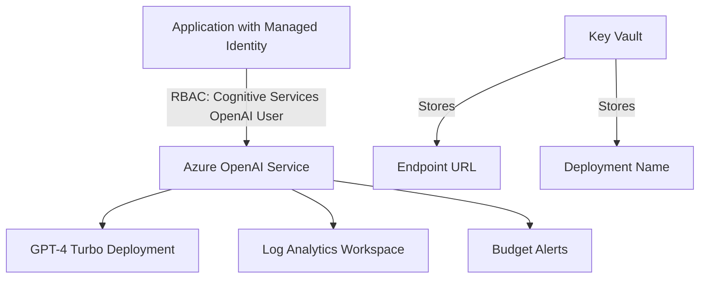

# Azure OpenAI Integration - Production Infrastructure

Establish secure, scalable Azure OpenAI Service deployment for Brookside BI Innovation Nexus with automated CI/CD, comprehensive monitoring, and enterprise governance controls.

**Status**: Ready for Deployment (Workflow A Wave A2)
**Version**: 1.0.0
**Last Updated**: 2025-10-26

---

## Quick Start

### Prerequisites

- Azure CLI 2.50+ (`az version`)
- Bicep CLI 0.20+ (`az bicep version`)
- PowerShell 7.0+ (`$PSVersionTable.PSVersion`)
- Contributor role on subscription `cfacbbe8-a2a3-445f-a188-68b3b35f0c84`

### Deploy to Development (5 minutes)

```powershell
# Authenticate to Azure
az login
az account set --subscription cfacbbe8-a2a3-445f-a188-68b3b35f0c84

# Navigate to scripts directory
cd infrastructure/scripts

# Deploy infrastructure
.\deploy-azure-openai.ps1 `
    -Environment dev `
    -ResourceGroup rg-brookside-aoai-dev

# Expected output: Deployment summary with endpoint URL and Managed Identity details
```

### Deploy via GitHub Actions

```yaml
# Navigate to GitHub Actions
Actions → Deploy Azure OpenAI Infrastructure → Run workflow

# Configure:
Environment: dev
Skip validation: false

# View deployment status and outputs in workflow run
```

---

## Architecture Overview

### Deployed Resources



### Resource List

| Resource | Purpose | SKU/Tier |
|----------|---------|----------|
| **Azure OpenAI Service** | GPT-4 Turbo API endpoint | S0 (pay-as-you-go) |
| **Managed Identity** | Secure authentication (no API keys) | Standard |
| **Model Deployment** | GPT-4 Turbo (version 0125) | Standard, 10/20/30 capacity |
| **Budget Alerts** | Cost monitoring at 50%/75%/90% | N/A |
| **Diagnostic Settings** | Logs to Log Analytics | 30/90-day retention |

### Security Features

- **Zero Hardcoded Secrets**: All authentication via Managed Identity
- **RBAC Authorization**: Least-privilege role assignments
- **Azure AD-Only Access**: Local authentication disabled
- **Diagnostic Logging**: Full audit trail to Log Analytics
- **Budget Monitoring**: Proactive cost alerts
- **Private Endpoint Support**: Ready to enable for network isolation

---

## Project Structure

```
azure-openai-integration/
├── infrastructure/
│   ├── bicep/
│   │   ├── main.bicep                 # Main Bicep template (370 lines)
│   │   └── parameters/
│   │       ├── dev.json               # Development configuration
│   │       ├── staging.json           # Staging configuration
│   │       └── prod.json              # Production configuration
│   └── scripts/
│       └── deploy-azure-openai.ps1    # PowerShell deployment orchestrator (600+ lines)
├── .github/
│   └── workflows/
│       └── deploy-azure-openai.yml    # CI/CD pipeline (400+ lines)
├── docs/
│   └── deployment-guide.md            # Comprehensive deployment documentation (800+ lines)
└── README.md                          # This file
```

---

## Environment Configuration

### Development

**Purpose**: Testing, experimentation, feature development

**Configuration**:
- Model capacity: 10 TPM (Tokens Per Minute, thousands)
- Budget alert: $50/month
- Log retention: 30 days
- Auto-deploy: Every commit to `develop` branch

**Estimated Monthly Cost**: ~$42

### Staging

**Purpose**: Pre-production validation, integration testing

**Configuration**:
- Model capacity: 20 TPM
- Budget alert: $150/month
- Log retention: 30 days
- Auto-deploy: Every commit to `main` branch

**Estimated Monthly Cost**: ~$125

### Production

**Purpose**: Live customer workloads, production applications

**Configuration**:
- Model capacity: 30 TPM
- Budget alert: $500/month
- Log retention: 90 days
- Deployment: Manual approval required (Markus Ahling + Alec Fielding)

**Estimated Monthly Cost**: ~$425

---

## Deployment Methods

### 1. PowerShell Script

**Best for**: Manual deployments, testing, one-off infrastructure changes

```powershell
.\deploy-azure-openai.ps1 -Environment dev -ResourceGroup rg-brookside-aoai-dev
```

**Features**:
- Pre-deployment validation (Azure CLI, Bicep, authentication)
- Resource group creation/verification
- Bicep template validation
- Infrastructure deployment with progress tracking
- Key Vault secret storage
- Post-deployment health checks
- Comprehensive deployment summary

**Deployment Stages**:
1. Prerequisites validation (2 minutes)
2. Template validation (1 minute)
3. Infrastructure provisioning (5-8 minutes)
4. Secret storage (1 minute)
5. Post-deployment verification (2 minutes)

**Total Duration**: 10-15 minutes

### 2. GitHub Actions

**Best for**: Automated deployments, team collaboration, production changes

**Workflow Triggers**:
- Push to `develop` → Deploy to development
- Push to `main` → Deploy to staging
- Manual workflow dispatch → Deploy to any environment

**Pipeline Jobs**:
1. **Validate**: Bicep lint, security scan
2. **Deploy**: Infrastructure provisioning, What-If analysis
3. **Verify**: Service health checks, RBAC validation
4. **Report**: PR comments (dev/staging), deployment artifacts (prod)

**Required Secrets**:
- `AZURE_CLIENT_ID` - Service principal for OIDC authentication
- `AZURE_SUBSCRIPTION_ID` - cfacbbe8-a2a3-445f-a188-68b3b35f0c84
- `AZURE_TENANT_ID` - 2930489e-9d8a-456b-9de9-e4787faeab9c

### 3. Azure CLI

**Best for**: Quick testing, infrastructure debugging

```bash
az deployment group create \
    --resource-group rg-brookside-aoai-dev \
    --template-file infrastructure/bicep/main.bicep \
    --parameters infrastructure/bicep/parameters/dev.json \
    --name "aoai-deployment-dev-$(date +%Y%m%d-%H%M%S)"
```

---

## Key Configuration Parameters

### Bicep Template Parameters

```bicep
@description('Environment name')
param environment string  // dev | staging | prod

@description('Resource name prefix')
param prefix string = 'brookside'

@description('Model deployment configuration')
param modelDeployment object = {
  modelName: 'gpt-4'
  modelVersion: '0125-preview'
  deploymentName: 'gpt-4-turbo'
  capacity: 10  // Tokens per minute (thousands)
}

@description('Enable diagnostic logging')
param enableDiagnostics bool = true

@description('Enable private endpoint')
param enablePrivateEndpoint bool = false  // Ready to enable for production
```

### Cost Optimization Parameters

```json
"budgetAlerts": {
  "value": {
    "threshold50": 25,   // 50% of monthly budget
    "threshold75": 40,   // 75% of monthly budget
    "threshold90": 50    // 90% of monthly budget (total budget)
  }
}
```

---

## Post-Deployment Steps

### 1. Retrieve Deployment Outputs

```powershell
# Get deployment outputs
$deployment = az deployment group show `
    --resource-group rg-brookside-aoai-dev `
    --name <deployment-name> `
    --query 'properties.outputs' `
    --output json | ConvertFrom-Json

# Extract key values
$endpoint = $deployment.azureOpenAIEndpoint.value
$deploymentName = $deployment.deploymentName.value
$managedIdentityClientId = $deployment.managedIdentityClientId.value

Write-Host "Endpoint: $endpoint"
Write-Host "Deployment: $deploymentName"
Write-Host "Managed Identity: $managedIdentityClientId"
```

### 2. Configure Application

**Update MCP Configuration**:
```json
{
  "mcpServers": {
    "azure-openai": {
      "env": {
        "AZURE_OPENAI_ENDPOINT": "https://aoai-brookside-dev-eastus.openai.azure.com/",
        "AZURE_OPENAI_DEPLOYMENT": "gpt-4-turbo",
        "AZURE_CLIENT_ID": "<managed-identity-client-id>"
      }
    }
  }
}
```

**Set Environment Variables**:
```powershell
# Retrieve from Key Vault
.\scripts\Get-KeyVaultSecret.ps1 -SecretName "azure-openai-endpoint-dev"

# Or set directly
$env:AZURE_OPENAI_ENDPOINT_DEV = "https://aoai-brookside-dev-eastus.openai.azure.com/"
$env:AZURE_OPENAI_DEPLOYMENT_NAME_DEV = "gpt-4-turbo"
```

### 3. Test Integration

```powershell
# Test API connectivity
$token = az account get-access-token --resource https://cognitiveservices.azure.com --query accessToken -o tsv

$headers = @{
    "Authorization" = "Bearer $token"
    "Content-Type" = "application/json"
}

$body = @{
    messages = @(
        @{ role = "user"; content = "Hello from Brookside BI!" }
    )
    max_tokens = 100
} | ConvertTo-Json -Depth 10

Invoke-RestMethod `
    -Uri "$env:AZURE_OPENAI_ENDPOINT_DEV/openai/deployments/gpt-4-turbo/chat/completions?api-version=2024-02-15-preview" `
    -Method POST `
    -Headers $headers `
    -Body $body
```

### 4. Monitor Costs

```bash
# View current month costs
az consumption usage list \
    --start-date $(date -d "$(date +%Y-%m-01)" +%Y-%m-%d) \
    --end-date $(date +%Y-%m-%d) \
    --query "[?contains(instanceName, 'aoai-brookside')].{Service:meterName, Cost:pretaxCost}" \
    --output table

# Check budget alert status
az consumption budget show --budget-name budget-aoai-dev
```

---

## Monitoring & Operations

### Key Metrics

**Service Health**:
- Provisioning state (should be "Succeeded")
- Model deployment status
- RBAC role assignments

**Performance**:
- Average request latency (<2 seconds target)
- Token throughput (within capacity limits)
- Error rate (<1% target)

**Cost**:
- Current month spend vs. budget
- Daily token usage trends
- Cost per 1K tokens

### Log Analytics Queries

**Request Latency**:
```kusto
AzureDiagnostics
| where ResourceProvider == "MICROSOFT.COGNITIVESERVICES"
| summarize avg(DurationMs), max(DurationMs) by bin(TimeGenerated, 5m)
```

**Token Usage**:
```kusto
AzureDiagnostics
| extend PromptTokens = toint(Properties.PromptTokens)
| summarize sum(PromptTokens) by bin(TimeGenerated, 1h)
```

**Error Rate**:
```kusto
AzureDiagnostics
| summarize Errors = countif(ResultType == "Failed"), Total = count() by bin(TimeGenerated, 5m)
| extend ErrorRate = (Errors * 100.0) / Total
```

---

## Troubleshooting

### Common Issues

**Issue**: Deployment fails with "quota exceeded"
**Solution**: Request capacity increase via Azure Portal or use lower capacity tier

**Issue**: API calls return 401 Unauthorized
**Solution**:
1. Verify Managed Identity role assignment exists
2. Wait 5-10 minutes for RBAC propagation
3. Check access token scope is `https://cognitiveservices.azure.com/.default`

**Issue**: Budget alerts not received
**Solution**: Verify email address in budget notification configuration

**Issue**: Bicep validation fails
**Solution**:
1. Upgrade Bicep CLI: `az bicep upgrade`
2. Check template syntax: `az bicep build --file main.bicep`

---

## Rollback Procedures

### Scenario 1: Deployment Fails

```powershell
# Delete failed deployment
az deployment group delete --resource-group rg-brookside-aoai-dev --name <deployment-name>

# Fix issues and re-deploy
.\deploy-azure-openai.ps1 -Environment dev -ResourceGroup rg-brookside-aoai-dev
```

### Scenario 2: Service Unstable

```bash
# List deployment history
az deployment group list --resource-group rg-brookside-aoai-dev --query '[].{name:name, state:properties.provisioningState}'

# Re-deploy previous working version
az deployment group create \
    --resource-group rg-brookside-aoai-dev \
    --template-file main.bicep \
    --parameters <previous-parameters-file>
```

---

## Cost Optimization

### Strategies

1. **Caching** (50-80% reduction): Cache frequent queries
2. **Token Management** (20-40% reduction): Truncate conversation history
3. **Model Selection**: Use GPT-3.5-Turbo for simple tasks
4. **Reserved Capacity** (20% discount): Commit to monthly token volume

### Monthly Cost Estimates

| Environment | Model Capacity | Estimated Usage | Monthly Cost |
|-------------|----------------|-----------------|--------------|
| Development | 10 TPM | 100K tokens/day | ~$42 |
| Staging | 20 TPM | 300K tokens/day | ~$125 |
| Production | 30 TPM | 1M tokens/day | ~$425 |

---

## Documentation

- **Deployment Guide**: `docs/deployment-guide.md` (comprehensive 800+ line guide)
- **Architecture**: `.claude/docs/azure-openai-integration-architecture.md`
- **ADR-001**: Azure OpenAI Integration Architecture Decision Record
- **Bicep Template**: `infrastructure/bicep/main.bicep` (370 lines, production-ready)
- **CI/CD Pipeline**: `.github/workflows/deploy-azure-openai.yml` (400+ lines)

---

## Support

**Brookside BI Engineering Team**
- Email: consultations@brooksidebi.com
- Phone: +1 209 487 2047

**Related Projects**:
- Innovation Nexus: Main repository
- MCP Configuration: Azure OpenAI integration
- Cost Analyzer: Software spend optimization

---

## Version History

| Version | Date | Changes |
|---------|------|---------|
| 1.0.0 | 2025-10-26 | Initial production-ready release (Workflow A Wave A2) |

---

**Best for**: Organizations deploying Azure OpenAI with enterprise governance requirements, multi-environment support, automated CI/CD pipelines, and comprehensive cost monitoring.

Generated by Claude Code Deployment Orchestrator - Establishing sustainable infrastructure for organizations scaling AI across teams.
