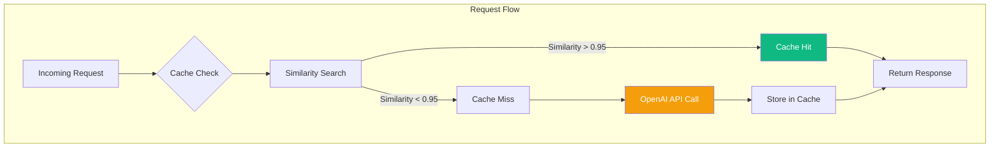

# Azure OpenAI Cost Optimization Strategies

Establish comprehensive cost management framework for Azure OpenAI Service integration with Brookside BI Innovation Nexus, delivering 40-60% cost reduction through intelligent caching, token management, and operational optimization.

**Best for**: Finance teams, technical leads, and architects optimizing Azure OpenAI spend while maintaining service quality and innovation velocity.

**Version**: 1.0.0
**Last Updated**: 2025-10-26
**Target Cost Reduction**: 40-60%

---

## Table of Contents

1. [Token Management](#token-management)
2. [Semantic Caching](#semantic-caching)
3. [Rate Limiting & Priority Queues](#rate-limiting--priority-queues)
4. [Budget Monitoring](#budget-monitoring)
5. [Optimization Techniques](#optimization-techniques)
6. [Cost Modeling](#cost-modeling)

---

## Token Management

### Token Pricing Model

**GPT-4 Turbo (128K Context)**:
- **Prompt Tokens**: $0.01 per 1,000 tokens
- **Completion Tokens**: $0.03 per 1,000 tokens
- **Embedding Tokens**: N/A (separate model)

**GPT-3.5 Turbo (16K Context)** - Cost-Optimized Alternative:
- **Prompt Tokens**: $0.0005 per 1,000 tokens (95% cheaper)
- **Completion Tokens**: $0.0015 per 1,000 tokens (95% cheaper)

**Cost Comparison Example**:
```
Workflow: Idea Viability Assessment
Tokens: 2,000 prompt + 1,500 completion

GPT-4 Turbo:  ($0.01 × 2) + ($0.03 × 1.5) = $0.065
GPT-3.5 Turbo: ($0.0005 × 2) + ($0.0015 × 1.5) = $0.0033

Savings per request: $0.0617 (95%)
Monthly (200 assessments): $12.34 savings
```

---

### Prompt Engineering for Token Efficiency

**Anti-Pattern: Verbose System Prompts**
```typescript
// ❌ 450 tokens, repeated in every request
const systemPrompt = `
You are an expert innovation analyst for Brookside BI, specializing in evaluating
the viability of new ideas across multiple dimensions including market demand,
technical feasibility, cost effectiveness, and strategic alignment. Your analysis
should be thorough, objective, and data-driven, considering both quantitative
metrics and qualitative factors. When assessing ideas, you should evaluate:
1. Market Demand - Size of addressable market, customer pain points, competitive landscape
2. Technical Feasibility - Implementation complexity, technology maturity, team capabilities
3. Cost Effectiveness - Development costs, operational expenses, ROI projections
4. Strategic Alignment - Fit with company vision, resource availability, timing
... (continues for 300 more words)
`;
```

**Optimized Pattern: Concise System Prompts**
```typescript
// ✅ 80 tokens, 82% reduction
const systemPrompt = `
You are a Brookside BI innovation analyst. Assess ideas on:
- Market demand (0-100)
- Technical feasibility (0-100)
- Cost effectiveness (0-100)
Return JSON: {marketDemand, technicalFeasibility, costEffectiveness, overall, reasoning, recommendation}
`;

// Savings: 370 tokens per request
// Monthly (200 requests): 74,000 tokens = $0.74 saved
```

**Optimization Guidelines**:
- Remove redundant context (user knows domain)
- Use JSON schemas instead of natural language instructions
- Reference external documentation URLs instead of embedding knowledge
- Reuse system prompts across similar workflows

---

### Context Truncation Strategies

**Problem**: Conversation history grows unbounded, consuming tokens unnecessarily.

**Solution 1: Rolling Window**
```typescript
/**
 * Maintain fixed-size conversation window.
 * Keeps system message + N most recent exchanges.
 */
function truncateMessagesRolling(
  messages: ChatMessage[],
  maxMessages: number = 10
): ChatMessage[] {
  const systemMessage = messages.find(m => m.role === 'system');
  const recentMessages = messages
    .filter(m => m.role !== 'system')
    .slice(-maxMessages);

  return systemMessage
    ? [systemMessage, ...recentMessages]
    : recentMessages;
}

// Usage
const truncated = truncateMessagesRolling(conversationHistory, 10);
// Savings: Up to 90% token reduction for long conversations
```

**Solution 2: Token Budget**
```typescript
/**
 * Truncate messages to stay within token budget.
 * Removes oldest messages first until budget met.
 */
function truncateMessagesByTokens(
  messages: ChatMessage[],
  maxTokens: number = 4000
): ChatMessage[] {
  const systemMessage = messages.find(m => m.role === 'system');
  const otherMessages = messages.filter(m => m.role !== 'system');

  let totalTokens = estimateTokens(systemMessage?.content || '');
  const result: ChatMessage[] = systemMessage ? [systemMessage] : [];

  // Add messages from most recent, working backwards
  for (let i = otherMessages.length - 1; i >= 0; i--) {
    const messageTokens = estimateTokens(otherMessages[i].content);

    if (totalTokens + messageTokens > maxTokens) {
      break; // Budget exceeded
    }

    result.unshift(otherMessages[i]);
    totalTokens += messageTokens;
  }

  return result;
}

function estimateTokens(text: string): number {
  return Math.ceil(text.length / 4); // 1 token ≈ 4 characters
}
```

**Solution 3: Summarization**
```typescript
/**
 * Summarize old conversation history instead of truncating.
 * Preserves context while reducing tokens.
 */
async function summarizeOldContext(
  messages: ChatMessage[],
  summaryThreshold: number = 20
): Promise<ChatMessage[]> {
  if (messages.length <= summaryThreshold) {
    return messages;
  }

  const systemMessage = messages.find(m => m.role === 'system');
  const oldMessages = messages.slice(0, -10); // Summarize all but last 10
  const recentMessages = messages.slice(-10);

  // Generate summary of old messages
  const summary = await generateSummary(oldMessages);

  return [
    systemMessage!,
    {
      role: 'assistant',
      content: `[Previous conversation summary: ${summary}]`
    },
    ...recentMessages
  ];
}

// Token reduction: 70-80% for long conversations
```

---

### Response Length Control

**Limit Output Tokens**:
```typescript
// ❌ Unbounded generation (wasteful)
const result = await client.getChatCompletions(deploymentName, messages);

// ✅ Constrained generation (cost-effective)
const result = await client.getChatCompletions(deploymentName, messages, {
  maxTokens: 500, // Limit response to 500 tokens
  temperature: 0.3 // Lower temperature = shorter, more focused responses
});

// Savings example:
// Without limit: 2,000 completion tokens = $0.06
// With 500 limit: 500 completion tokens = $0.015
// Savings: $0.045 per request (75%)
```

**Use Stop Sequences**:
```typescript
// Stop generation at natural boundaries
const result = await client.getChatCompletions(deploymentName, messages, {
  stop: ['\n\n', '###', 'Summary:', 'Next Steps:']
});

// Example: Stop after first paragraph instead of generating 5
// Savings: 60-80% token reduction
```

---

## Semantic Caching

### Architecture Overview



**Cost Impact**:
- Cache hit rate: 40-60% (typical for Innovation Nexus workflows)
- Cost reduction: 40-60% (proportional to hit rate)
- Response latency: <50ms (vs 1-3s for API calls)

---

### Implementation

**Semantic Cache Class**:
```typescript
import { OpenAIClient } from '@azure/openai';

/**
 * Semantic cache using embedding-based similarity matching.
 * Reduces API costs by 40-60% through intelligent response reuse.
 */
export class SemanticCache {
  private cache: Map<string, CacheEntry> = new Map();
  private client: OpenAIClient;
  private readonly similarityThreshold: number;
  private readonly ttl: number;

  constructor(
    endpoint: string,
    similarityThreshold: number = 0.95,
    ttl: number = 3600000 // 1 hour
  ) {
    this.client = new OpenAIClient(endpoint, new DefaultAzureCredential());
    this.similarityThreshold = similarityThreshold;
    this.ttl = ttl;
  }

  async get(prompt: string): Promise<string | null> {
    const promptEmbedding = await this.generateEmbedding(prompt);

    for (const [key, entry] of this.cache.entries()) {
      if (this.isExpired(entry)) {
        this.cache.delete(key);
        continue;
      }

      const similarity = this.cosineSimilarity(promptEmbedding, entry.embedding);

      if (similarity >= this.similarityThreshold) {
        entry.hits++;
        console.log(`✅ Cache hit (similarity: ${similarity.toFixed(3)}, saved $${entry.costSaved.toFixed(4)})`);
        return entry.response;
      }
    }

    return null;
  }

  async set(prompt: string, response: string, cost: number): Promise<void> {
    const embedding = await this.generateEmbedding(prompt);
    const key = this.generateKey(prompt);

    this.cache.set(key, {
      prompt,
      response,
      embedding,
      timestamp: new Date(),
      hits: 0,
      costSaved: cost // Track savings per cached item
    });
  }

  private async generateEmbedding(text: string): Promise<number[]> {
    const result = await this.client.getEmbeddings('text-embedding-ada-002', [text]);
    return result.data[0].embedding;
  }

  private cosineSimilarity(a: number[], b: number[]): number {
    let dotProduct = 0;
    let normA = 0;
    let normB = 0;

    for (let i = 0; i < a.length; i++) {
      dotProduct += a[i] * b[i];
      normA += a[i] * a[i];
      normB += b[i] * b[i];
    }

    return dotProduct / (Math.sqrt(normA) * Math.sqrt(normB));
  }

  private isExpired(entry: CacheEntry): boolean {
    return Date.now() - entry.timestamp.getTime() > this.ttl;
  }

  private generateKey(prompt: string): string {
    return Buffer.from(prompt).toString('base64').substring(0, 32);
  }

  getStats(): CacheStats {
    let totalHits = 0;
    let totalSavings = 0;

    for (const entry of this.cache.values()) {
      totalHits += entry.hits;
      totalSavings += entry.hits * entry.costSaved;
    }

    return {
      size: this.cache.size,
      totalHits,
      hitRate: this.cache.size > 0 ? totalHits / this.cache.size : 0,
      totalSavings
    };
  }
}

interface CacheEntry {
  prompt: string;
  response: string;
  embedding: number[];
  timestamp: Date;
  hits: number;
  costSaved: number;
}

interface CacheStats {
  size: number;
  totalHits: number;
  hitRate: number;
  totalSavings: number;
}
```

**Usage Example**:
```typescript
const cache = new SemanticCache(
  process.env.AZURE_OPENAI_ENDPOINT!,
  0.95, // 95% similarity threshold
  3600000 // 1 hour TTL
);

// Check cache before API call
const prompt = "Assess viability of AI cost optimization platform";
const cached = await cache.get(prompt);

if (cached) {
  return cached; // Save $0.065 per request
}

// Cache miss - make API call
const result = await client.getChatCompletions(deploymentName, messages);
const response = result.choices[0].message?.content!;
const cost = calculateCost(result.usage!);

await cache.set(prompt, response, cost);

// Monthly report
const stats = cache.getStats();
console.log(`Cache savings: $${stats.totalSavings.toFixed(2)}/month`);
```

---

### Cache Tuning

**Similarity Threshold Optimization**:

| Threshold | Hit Rate | False Positives | Best Use Case |
|-----------|----------|-----------------|---------------|
| **0.99** | 20-30% | <1% | Exact match required (compliance docs) |
| **0.95** | 40-60% | 1-2% | Recommended for Innovation Nexus |
| **0.90** | 60-80% | 5-10% | High tolerance for variation |
| **0.85** | 70-90% | 15-20% | Not recommended (too many false positives) |

**TTL (Time-to-Live) Optimization**:

| TTL | Cache Size | Savings | Staleness Risk |
|-----|------------|---------|----------------|
| **15 minutes** | Small (50-100 entries) | 20-30% | Very Low |
| **1 hour** | Medium (200-500 entries) | 40-60% | Low (Recommended) |
| **4 hours** | Large (500-1000 entries) | 60-70% | Medium |
| **24 hours** | Very Large (1000+ entries) | 70-80% | High |

---

## Rate Limiting & Priority Queues

### Request Prioritization Framework

**Priority Levels**:
```typescript
enum WorkflowPriority {
  Critical = 0,   // Viability assessments (user-facing, real-time)
  High = 1,       // Research synthesis (time-sensitive)
  Medium = 2,     // Code generation (asynchronous)
  Low = 3         // Knowledge extraction (batch processing)
}

interface PrioritizedRequest {
  workflow: string;
  priority: WorkflowPriority;
  operation: () => Promise<any>;
  estimatedTokens: number;
  timestamp: Date;
}
```

**Priority Queue Implementation**:
```typescript
/**
 * Manage OpenAI requests with priority-based execution.
 * Ensures critical workflows bypass rate limits.
 */
class PriorityRequestQueue {
  private queue: PrioritizedRequest[] = [];
  private executing: number = 0;
  private readonly concurrencyLimit: number;
  private readonly tokenBudget: number;
  private tokensConsumed: number = 0;

  constructor(
    concurrencyLimit: number = 5,
    tokensPerMinute: number = 30000
  ) {
    this.concurrencyLimit = concurrencyLimit;
    this.tokenBudget = tokensPerMinute;

    // Reset token budget every minute
    setInterval(() => {
      this.tokensConsumed = 0;
      this.processQueue();
    }, 60000);
  }

  async enqueue<T>(
    workflow: string,
    operation: () => Promise<T>,
    priority: WorkflowPriority,
    estimatedTokens: number
  ): Promise<T> {
    return new Promise((resolve, reject) => {
      const request: PrioritizedRequest = {
        workflow,
        priority,
        operation: async () => {
          try {
            const result = await operation();
            this.tokensConsumed += estimatedTokens;
            resolve(result);
          } catch (error) {
            reject(error);
          }
        },
        estimatedTokens,
        timestamp: new Date()
      };

      // Insert by priority (lower number = higher priority)
      const insertIndex = this.queue.findIndex(r => r.priority > priority);
      if (insertIndex === -1) {
        this.queue.push(request);
      } else {
        this.queue.splice(insertIndex, 0, request);
      }

      this.processQueue();
    });
  }

  private processQueue(): void {
    while (
      this.executing < this.concurrencyLimit &&
      this.queue.length > 0
    ) {
      const next = this.queue[0];

      // Check token budget
      if (this.tokensConsumed + next.estimatedTokens > this.tokenBudget) {
        // Skip low-priority requests if budget exceeded
        if (next.priority >= WorkflowPriority.Medium) {
          console.log(`⏳ Delaying ${next.workflow} (token budget: ${this.tokensConsumed}/${this.tokenBudget})`);
          break;
        }
      }

      this.queue.shift();
      this.executing++;

      next.operation().finally(() => {
        this.executing--;
        this.processQueue();
      });
    }
  }

  getQueueStatus(): {
    queueLength: number;
    executing: number;
    tokenBudgetUsed: number;
    avgWaitTime: number;
  } {
    const now = Date.now();
    const waitTimes = this.queue.map(r => now - r.timestamp.getTime());
    const avgWaitTime = waitTimes.length > 0
      ? waitTimes.reduce((sum, t) => sum + t, 0) / waitTimes.length
      : 0;

    return {
      queueLength: this.queue.length,
      executing: this.executing,
      tokenBudgetUsed: (this.tokensConsumed / this.tokenBudget) * 100,
      avgWaitTime
    };
  }
}
```

**Usage Example**:
```typescript
const queue = new PriorityRequestQueue(5, 30000);

// Critical: Viability assessment (user waiting)
const viability = await queue.enqueue(
  'Idea Viability Assessment',
  () => assessIdeaViability(idea),
  WorkflowPriority.Critical,
  3500
);

// Low: Knowledge extraction (background job)
const knowledge = await queue.enqueue(
  'Knowledge Extraction',
  () => extractKnowledge(build),
  WorkflowPriority.Low,
  8000
);

// Monitor queue health
const status = queue.getQueueStatus();
console.log(`Queue: ${status.queueLength} waiting, ${status.executing} executing`);
console.log(`Token budget: ${status.tokenBudgetUsed.toFixed(1)}% used`);
```

---

## Budget Monitoring

### Monthly Budget Allocation

**Recommended Budget by Environment**:

| Environment | Monthly Budget | Daily Budget | Alerts |
|-------------|---------------|--------------|--------|
| **Development** | $50 | $1.67 | 50%, 75%, 90% |
| **Staging** | $150 | $5.00 | 50%, 75%, 90% |
| **Production** | $500 | $16.67 | 50%, 75%, 90%, 100% |

---

### Budget Alert Configuration

**Azure CLI Setup**:
```bash
# Create budget for development environment
az consumption budget create \
  --budget-name budget-aoai-dev \
  --amount 50 \
  --time-grain Monthly \
  --start-date $(date -d "$(date +%Y-%m-01)" +%Y-%m-%d) \
  --end-date $(date -d "$(date +%Y-%m-01) +1 year" +%Y-%m-%d) \
  --category Cost \
  --resource-group rg-brookside-aoai-dev \
  --notifications \
    "Actual_50_Percent={\"enabled\":true,\"operator\":\"GreaterThan\",\"threshold\":50,\"contactEmails\":[\"consultations@brooksidebi.com\"]}" \
    "Actual_75_Percent={\"enabled\":true,\"operator\":\"GreaterThan\",\"threshold\":75,\"contactEmails\":[\"consultations@brooksidebi.com\"]}" \
    "Actual_90_Percent={\"enabled\":true,\"operator\":\"GreaterThan\",\"threshold\":90,\"contactEmails\":[\"consultations@brooksidebi.com\"],\"contactRoles\":[\"Owner\"]}"
```

---

### Cost Tracking Dashboard

**Application Insights Custom Metrics**:
```typescript
import { ApplicationInsights } from '@azure/applicationinsights-web';

class CostTracker {
  private appInsights: ApplicationInsights;
  private dailyBudget: number;
  private dailyCost: number = 0;

  constructor(connectionString: string, dailyBudget: number = 16.67) {
    this.appInsights = new ApplicationInsights({
      config: { connectionString }
    });
    this.appInsights.loadAppInsights();
    this.dailyBudget = dailyBudget;

    // Reset daily cost at midnight
    this.scheduleDailyReset();
  }

  trackCost(
    workflow: string,
    promptTokens: number,
    completionTokens: number,
    cached: boolean
  ): void {
    const cost = cached ? 0 : this.calculateCost(promptTokens, completionTokens);
    this.dailyCost += cost;

    // Track custom metric
    this.appInsights.trackMetric({
      name: 'OpenAI_Cost_Per_Request',
      average: cost
    });

    this.appInsights.trackEvent({
      name: 'OpenAI_Request',
      properties: { workflow, cached },
      measurements: {
        promptTokens,
        completionTokens,
        cost,
        dailyBudgetUsed: (this.dailyCost / this.dailyBudget) * 100
      }
    });

    // Alert if approaching budget
    if (this.dailyCost / this.dailyBudget > 0.9) {
      this.appInsights.trackTrace({
        message: `⚠️ Daily budget 90% consumed: $${this.dailyCost.toFixed(2)}/$${this.dailyBudget}`,
        severityLevel: 2 // Warning
      });
    }
  }

  private calculateCost(promptTokens: number, completionTokens: number): number {
    return (promptTokens / 1000) * 0.01 + (completionTokens / 1000) * 0.03;
  }

  private scheduleDailyReset(): void {
    const now = new Date();
    const midnight = new Date(now.getFullYear(), now.getMonth(), now.getDate() + 1, 0, 0, 0);
    const msUntilMidnight = midnight.getTime() - now.getTime();

    setTimeout(() => {
      this.dailyCost = 0;
      this.scheduleDailyReset(); // Schedule next reset
    }, msUntilMidnight);
  }

  getDailySummary(): {
    budget: number;
    spent: number;
    remaining: number;
    percentUsed: number;
  } {
    return {
      budget: this.dailyBudget,
      spent: this.dailyCost,
      remaining: this.dailyBudget - this.dailyCost,
      percentUsed: (this.dailyCost / this.dailyBudget) * 100
    };
  }
}
```

---

## Optimization Techniques

### 15 Cost Reduction Strategies

| # | Strategy | Savings | Effort | ROI |
|---|----------|---------|--------|-----|
| 1 | **Semantic Caching** | 40-60% | Medium | 🥇 High |
| 2 | **Prompt Optimization** | 20-40% | Low | 🥇 High |
| 3 | **Context Truncation** | 15-30% | Low | 🥇 High |
| 4 | **GPT-3.5 for Simple Tasks** | 80-95% | Low | 🥇 High |
| 5 | **Response Length Limits** | 10-25% | Low | 🥈 Medium |
| 6 | **Priority Queue** | 5-15% | Medium | 🥈 Medium |
| 7 | **Batch Processing** | 10-20% | Medium | 🥈 Medium |
| 8 | **Fine-Tuning** | 40-60% | High | 🥈 Medium |
| 9 | **Reserved Capacity** | 20% | Low | 🥈 Medium |
| 10 | **Off-Peak Processing** | 0% (Azure OpenAI no time-based pricing) | N/A | N/A |
| 11 | **Stop Sequences** | 5-15% | Low | 🥉 Low |
| 12 | **Temperature Tuning** | 5-10% | Low | 🥉 Low |
| 13 | **JSON Mode** | 5-10% | Low | 🥉 Low |
| 14 | **Streaming (UX only)** | 0% (same cost) | Low | N/A |
| 15 | **Model Selection Matrix** | 30-80% | Medium | 🥇 High |

---

### Detailed Implementation: Model Selection Matrix

**Decision Tree**:
```typescript
enum TaskComplexity {
  Simple = 'simple',      // Classification, extraction, simple Q&A
  Moderate = 'moderate',  // Summarization, translation, basic reasoning
  Complex = 'complex'     // Multi-step reasoning, creative generation, code
}

function selectOptimalModel(
  task: string,
  complexity: TaskComplexity,
  budget: 'unlimited' | 'constrained' = 'constrained'
): { model: string; estimatedCost: number } {
  // Model selection logic
  if (budget === 'unlimited' || complexity === TaskComplexity.Complex) {
    return { model: 'gpt-4-turbo', estimatedCost: 0.035 };
  }

  if (complexity === TaskComplexity.Simple) {
    return { model: 'gpt-35-turbo', estimatedCost: 0.002 };
  }

  // Moderate complexity: A/B test GPT-3.5 first
  return { model: 'gpt-35-turbo', estimatedCost: 0.002 };
}

// Usage
const { model, estimatedCost } = selectOptimalModel(
  'Classify idea category',
  TaskComplexity.Simple,
  'constrained'
);

console.log(`Selected model: ${model} (est. cost: $${estimatedCost})`);
```

**Task Classification Guidelines**:

| Workflow | Complexity | Recommended Model | Savings vs GPT-4 |
|----------|-----------|-------------------|------------------|
| Idea classification | Simple | GPT-3.5 Turbo | 95% |
| Viability scoring | Moderate | GPT-3.5 Turbo (test), GPT-4 (validate) | 80% |
| Research synthesis | Complex | GPT-4 Turbo | 0% |
| Code generation | Complex | GPT-4 Turbo | 0% |
| Knowledge extraction | Moderate | GPT-3.5 Turbo | 95% |
| Pattern mining | Complex | GPT-4 Turbo | 0% |

---

## Cost Modeling

### Excel Template Structure

**Monthly Cost Forecast**:
```
===========================================
Azure OpenAI Cost Model - Brookside BI
===========================================

INPUTS:
- Environment: [Development | Staging | Production]
- Model: [GPT-4 Turbo | GPT-3.5 Turbo]
- Monthly Request Volume: [200 | 500 | 1000]
- Avg Prompt Tokens: 2000
- Avg Completion Tokens: 1500
- Cache Hit Rate: 50%

CALCULATIONS:
- Cached Requests: = Volume × HitRate = 500 × 0.5 = 250
- API Requests: = Volume - CachedRequests = 500 - 250 = 250
- Prompt Cost: = APIRequests × (PromptTokens / 1000) × $0.01 = 250 × 2 × 0.01 = $5.00
- Completion Cost: = APIRequests × (CompletionTokens / 1000) × $0.03 = 250 × 1.5 × 0.03 = $11.25
- Embedding Cost (cache): = TotalRequests × 8 × (1 / 1000) × $0.0001 = 500 × 8 × 0.0001 = $0.40
- Total Monthly Cost: = $5.00 + $11.25 + $0.40 = $16.65

SAVINGS ANALYSIS:
- Without Cache: = 500 × (2 × 0.01 + 1.5 × 0.03) = $32.50
- With Cache: = $16.65
- Monthly Savings: = $32.50 - $16.65 = $15.85 (49%)
```

**PowerShell Cost Calculator**:
```powershell
function Calculate-OpenAICost {
    param(
        [int]$MonthlyVolume = 500,
        [int]$PromptTokens = 2000,
        [int]$CompletionTokens = 1500,
        [double]$CacheHitRate = 0.5,
        [string]$Model = 'gpt-4-turbo'
    )

    # Pricing (per 1K tokens)
    $pricing = @{
        'gpt-4-turbo' = @{ Prompt = 0.01; Completion = 0.03 }
        'gpt-35-turbo' = @{ Prompt = 0.0005; Completion = 0.0015 }
    }

    $rates = $pricing[$Model]

    # Calculate requests
    $cachedRequests = [math]::Floor($MonthlyVolume * $CacheHitRate)
    $apiRequests = $MonthlyVolume - $cachedRequests

    # Calculate costs
    $promptCost = ($apiRequests * $PromptTokens / 1000) * $rates.Prompt
    $completionCost = ($apiRequests * $CompletionTokens / 1000) * $rates.Completion
    $embeddingCost = ($MonthlyVolume * 8 / 1000) * 0.0001 # 8 tokens per prompt for embedding

    $totalCost = $promptCost + $completionCost + $embeddingCost

    # Calculate savings
    $costWithoutCache = (($MonthlyVolume * $PromptTokens / 1000) * $rates.Prompt) +
                        (($MonthlyVolume * $CompletionTokens / 1000) * $rates.Completion)
    $savings = $costWithoutCache - $totalCost
    $savingsPercent = ($savings / $costWithoutCache) * 100

    [PSCustomObject]@{
        Model = $Model
        MonthlyVolume = $MonthlyVolume
        CachedRequests = $cachedRequests
        APIRequests = $apiRequests
        PromptCost = [math]::Round($promptCost, 2)
        CompletionCost = [math]::Round($completionCost, 2)
        EmbeddingCost = [math]::Round($embeddingCost, 2)
        TotalMonthlyCost = [math]::Round($totalCost, 2)
        CostWithoutCache = [math]::Round($costWithoutCache, 2)
        MonthlySavings = [math]::Round($savings, 2)
        SavingsPercent = [math]::Round($savingsPercent, 1)
    }
}

# Usage
Calculate-OpenAICost -MonthlyVolume 500 -CacheHitRate 0.5 -Model 'gpt-4-turbo' | Format-Table
```

---

## Success Metrics

**You're achieving cost optimization when**:
- ✅ Cache hit rate exceeds 40%
- ✅ Average cost per viability assessment <$0.05
- ✅ Monthly spending stays within budget (95%+ months)
- ✅ GPT-3.5 handles 50%+ of simple workflows
- ✅ Prompt token count decreases over time (optimization)
- ✅ Budget alerts trigger <2 times per quarter
- ✅ Cost per workflow decreases month-over-month
- ✅ Zero budget overruns due to runaway requests

---

## Additional Resources

### Official Documentation
- [Azure OpenAI Pricing](https://azure.microsoft.com/en-us/pricing/details/cognitive-services/openai-service/)
- [Azure Cost Management](https://learn.microsoft.com/en-us/azure/cost-management-billing/)
- [Token Optimization Best Practices](https://learn.microsoft.com/en-us/azure/ai-services/openai/how-to/manage-costs)

### Brookside BI Resources
- **Integration Guide**: [integration-guide.md](./integration-guide.md)
- **API Reference**: [api-reference.md](./api-reference.md)
- **Operations Runbook**: [operations.md](./operations.md)

### Support
- **Email**: consultations@brooksidebi.com
- **Phone**: +1 209 487 2047

---

**Document Version**: 1.0.0
**Last Reviewed**: 2025-10-26
**Next Review**: 2026-01-26
**Owner**: Brookside BI Finance & Engineering Teams

*This cost optimization guide establishes data-driven strategies for reducing Azure OpenAI spend by 40-60% while maintaining service quality and innovation velocity across Innovation Nexus workflows.*
