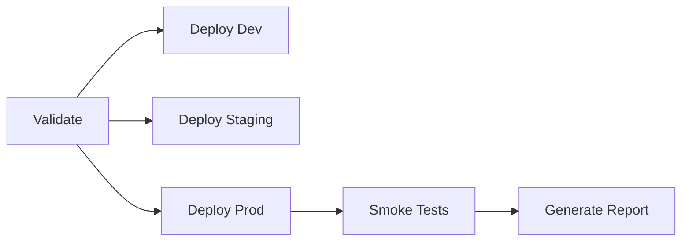

# Azure OpenAI Integration - Deployment Guide

Establish production-ready Azure OpenAI infrastructure for Brookside BI Innovation Nexus with comprehensive automation, security controls, and cost optimization.

**Best for**: Organizations deploying enterprise Azure OpenAI with governance requirements, multi-environment support, and CI/CD automation.

**Version**: 1.0.0
**Last Updated**: 2025-10-26
**Owner**: Brookside BI Engineering Team

---

## Overview

This deployment establishes:

- **Azure OpenAI Service** (GPT-4 Turbo) with Managed Identity authentication
- **RBAC-based access control** (no API keys, zero hardcoded secrets)
- **Environment-specific configurations** (dev/staging/prod)
- **Automated CI/CD pipeline** via GitHub Actions
- **Cost monitoring** with budget alerts at 50%, 75%, 90%
- **Diagnostic logging** to Log Analytics Workspace
- **Rollback capabilities** for deployment failures

---

## Prerequisites

### Azure Permissions

Required roles on subscription `cfacbbe8-a2a3-445f-a188-68b3b35f0c84`:

- **Contributor** - Create/manage resources
- **User Access Administrator** - Assign RBAC roles
- **Key Vault Secrets Officer** - Store endpoint URLs in Key Vault

### Software Requirements

| Tool | Minimum Version | Installation |
|------|----------------|--------------|
| **Azure CLI** | 2.50.0 | `winget install Microsoft.AzureCLI` |
| **Bicep CLI** | 0.20.0 | `az bicep install` |
| **PowerShell** | 7.0+ | `winget install Microsoft.PowerShell` |
| **Git** | 2.40+ | `winget install Git.Git` |

### Verify Installation

```powershell
# Check Azure CLI version
az version

# Verify Bicep CLI
az bicep version

# Test Azure authentication
az login
az account show --query '{name:name, id:id, tenantId:tenantId}'

# Verify subscription access
az account set --subscription cfacbbe8-a2a3-445f-a188-68b3b35f0c84
az account show
```

---

## Architecture

### Resource Naming Convention

```
Azure OpenAI Service:  aoai-{prefix}-{environment}-{region}
Managed Identity:       id-{prefix}-aoai-{environment}
Resource Group:         rg-{prefix}-aoai-{environment}
Budget:                budget-aoai-{environment}
```

**Example**: `aoai-brookside-dev-eastus`

### Environment Configuration

| Environment | Purpose | Model Capacity | Budget Alert | Auto-Deploy |
|-------------|---------|----------------|--------------|-------------|
| **Development** | Testing, experimentation | 10 TPM | $50/month | Every commit to `develop` |
| **Staging** | Pre-production validation | 20 TPM | $150/month | Every commit to `main` |
| **Production** | Live customer workloads | 30 TPM | $500/month | Manual approval required |

**TPM** = Tokens Per Minute (thousands)

### Security Model

```
Application Identity (Managed Identity)
    ↓ (RBAC: Cognitive Services OpenAI User)
Azure OpenAI Service
    ↓ (Sends logs)
Log Analytics Workspace
    ↓ (Budget alerts)
Email Notifications (consultations@brooksidebi.com)
```

**Key Security Features**:
- Disabled local authentication (`disableLocalAuth: true`)
- Azure AD-only authentication
- No API keys in code/configuration
- Endpoint URLs stored in Key Vault
- Private endpoint support (ready to enable)

---

## Deployment Methods

### Method 1: PowerShell Script (Recommended for Manual Deployments)

**Best for**: Initial setup, testing, one-off deployments

```powershell
# Navigate to scripts directory
cd C:\Users\MarkusAhling\Notion\.claude\implementations\azure-openai-integration\infrastructure\scripts

# Development deployment
.\deploy-azure-openai.ps1 `
    -Environment dev `
    -ResourceGroup rg-brookside-aoai-dev `
    -Location eastus

# Staging deployment
.\deploy-azure-openai.ps1 `
    -Environment staging `
    -ResourceGroup rg-brookside-aoai-staging

# Production deployment (with What-If preview)
.\deploy-azure-openai.ps1 `
    -Environment prod `
    -ResourceGroup rg-brookside-aoai-prod `
    -WhatIf

# Skip validation checks (not recommended)
.\deploy-azure-openai.ps1 `
    -Environment dev `
    -ResourceGroup rg-brookside-aoai-dev `
    -SkipValidation
```

**Deployment Stages**:
1. Pre-deployment validation (Azure CLI, Bicep, authentication)
2. Resource group creation/verification
3. Bicep template validation
4. Infrastructure deployment (5-10 minutes)
5. Key Vault secret storage
6. Post-deployment verification
7. Deployment summary report

**Expected Output**:
```
============================================================================
 Azure OpenAI Deployment Summary - dev Environment
============================================================================

Status: DEPLOYED SUCCESSFULLY
Timestamp: 2025-10-26 14:30:45
Duration: 8.32 minutes

Resources Deployed:
  - Azure OpenAI Service: aoai-brookside-dev-eastus
  - Model Deployment: gpt-4-turbo (GPT-4 Turbo)
  - Managed Identity: /subscriptions/.../id-brookside-aoai-dev

Configuration:
  - Endpoint: https://aoai-brookside-dev-eastus.openai.azure.com/
  - Resource Group: rg-brookside-aoai-dev
  - Location: eastus
  - Authentication: Managed Identity (RBAC)

Key Vault Secrets (stored in kv-brookside-secrets):
  - azure-openai-endpoint-dev
  - azure-openai-deployment-name-dev

Next Steps:
  1. Configure application with Managed Identity Client ID
  2. Update MCP configuration with endpoint URL
  3. Test integration with sample API calls
  4. Monitor costs in Azure Cost Management
```

---

### Method 2: GitHub Actions (Automated CI/CD)

**Best for**: Continuous deployment, team collaboration, production changes

**Workflow File**: `.github/workflows/deploy-azure-openai.yml`

#### Trigger Conditions

**Automatic Deployments**:
```yaml
# Development: Every push to develop branch
develop branch → rg-brookside-aoai-dev

# Staging: Every push to main branch
main branch → rg-brookside-aoai-staging
```

**Manual Deployments**:
```yaml
# Navigate to GitHub Actions
Actions → Deploy Azure OpenAI Infrastructure → Run workflow

# Select options:
Environment: [dev | staging | prod]
Skip validation: [false | true]
```

#### Required GitHub Secrets

Configure these in **Settings → Secrets and variables → Actions**:

| Secret Name | Value | Purpose |
|-------------|-------|---------|
| `AZURE_CLIENT_ID` | `<service-principal-client-id>` | OIDC authentication |
| `AZURE_SUBSCRIPTION_ID` | `cfacbbe8-a2a3-445f-a188-68b3b35f0c84` | Target subscription |
| `AZURE_TENANT_ID` | `2930489e-9d8a-456b-9de9-e4787faeab9c` | Azure AD tenant |

#### Environment Protection Rules

**Staging**:
- No approvals required
- Deployment history retained for 30 days

**Production**:
- **Approvers required**: Markus Ahling + Alec Fielding
- Maximum wait time: 4 hours
- Deployment history retained for 90 days

#### Workflow Jobs



1. **Validate**: Bicep lint, security scan, artifact upload
2. **Deploy**: Resource provisioning, What-If analysis, deployment
3. **Verify**: Service health checks, RBAC validation
4. **Report**: PR comments (dev/staging), artifact upload (prod)

---

### Method 3: Azure CLI (Direct Deployment)

**Best for**: Quick testing, infrastructure debugging

```bash
# Set variables
ENVIRONMENT="dev"
RESOURCE_GROUP="rg-brookside-aoai-dev"
LOCATION="eastus"

# Create resource group
az group create \
    --name $RESOURCE_GROUP \
    --location $LOCATION \
    --tags Environment=$ENVIRONMENT ManagedBy=AzureCLI Project=InnovationNexus

# Validate Bicep template
az deployment group validate \
    --resource-group $RESOURCE_GROUP \
    --template-file ../bicep/main.bicep \
    --parameters ../bicep/parameters/$ENVIRONMENT.json

# Deploy infrastructure
az deployment group create \
    --resource-group $RESOURCE_GROUP \
    --template-file ../bicep/main.bicep \
    --parameters ../bicep/parameters/$ENVIRONMENT.json \
    --name "aoai-deployment-$ENVIRONMENT-$(date +%Y%m%d-%H%M%S)" \
    --query 'properties.outputs' \
    --output json

# Store endpoint in Key Vault
ENDPOINT=$(az deployment group show \
    --resource-group $RESOURCE_GROUP \
    --name <deployment-name> \
    --query 'properties.outputs.azureOpenAIEndpoint.value' \
    --output tsv)

az keyvault secret set \
    --vault-name kv-brookside-secrets \
    --name "azure-openai-endpoint-$ENVIRONMENT" \
    --value "$ENDPOINT"
```

---

## Post-Deployment Configuration

### 1. Update MCP Server Configuration

**File**: `.claude/mcp-config.json` (or environment-specific config)

```json
{
  "mcpServers": {
    "azure-openai": {
      "command": "node",
      "args": ["path/to/azure-openai-mcp-server.js"],
      "env": {
        "AZURE_OPENAI_ENDPOINT": "${AZURE_OPENAI_ENDPOINT_DEV}",
        "AZURE_OPENAI_DEPLOYMENT": "${AZURE_OPENAI_DEPLOYMENT_NAME_DEV}",
        "AZURE_CLIENT_ID": "${MANAGED_IDENTITY_CLIENT_ID}"
      }
    }
  }
}
```

**Retrieve values from Key Vault**:
```powershell
$endpoint = az keyvault secret show `
    --vault-name kv-brookside-secrets `
    --name azure-openai-endpoint-dev `
    --query value -o tsv

$deploymentName = az keyvault secret show `
    --vault-name kv-brookside-secrets `
    --name azure-openai-deployment-name-dev `
    --query value -o tsv

# Export to environment variables
$env:AZURE_OPENAI_ENDPOINT_DEV = $endpoint
$env:AZURE_OPENAI_DEPLOYMENT_NAME_DEV = $deploymentName
```

### 2. Configure Application Authentication

**Option A: Managed Identity (Recommended)**

For applications running in Azure (App Service, Container Apps, VMs):

```csharp
// C# example with Azure.AI.OpenAI SDK
using Azure.AI.OpenAI;
using Azure.Identity;

var endpoint = new Uri(Environment.GetEnvironmentVariable("AZURE_OPENAI_ENDPOINT"));
var credential = new ManagedIdentityCredential(clientId: "<managed-identity-client-id>");

var client = new OpenAIClient(endpoint, credential);
```

```python
# Python example with openai SDK
from openai import AzureOpenAI
from azure.identity import ManagedIdentityCredential

credential = ManagedIdentityCredential(client_id="<managed-identity-client-id>")
token = credential.get_token("https://cognitiveservices.azure.com/.default")

client = AzureOpenAI(
    azure_endpoint=os.environ["AZURE_OPENAI_ENDPOINT"],
    azure_ad_token=token.token,
    api_version="2024-02-15-preview"
)
```

**Option B: Azure CLI Authentication (Local Development)**

```bash
# Login to Azure CLI
az login

# Application uses DefaultAzureCredential (falls back to Azure CLI)
```

### 3. Test Integration

**Simple API Call Test**:

```powershell
# Get access token via Azure CLI
$token = az account get-access-token --resource https://cognitiveservices.azure.com --query accessToken -o tsv

# Get endpoint from Key Vault
$endpoint = az keyvault secret show `
    --vault-name kv-brookside-secrets `
    --name azure-openai-endpoint-dev `
    --query value -o tsv

# Get deployment name
$deploymentName = "gpt-4-turbo"

# Test API call
$headers = @{
    "Authorization" = "Bearer $token"
    "Content-Type" = "application/json"
}

$body = @{
    messages = @(
        @{
            role = "system"
            content = "You are a helpful assistant."
        },
        @{
            role = "user"
            content = "Hello! This is a test from Brookside BI Innovation Nexus."
        }
    )
    max_tokens = 100
} | ConvertTo-Json -Depth 10

$response = Invoke-RestMethod `
    -Uri "$endpoint/openai/deployments/$deploymentName/chat/completions?api-version=2024-02-15-preview" `
    -Method POST `
    -Headers $headers `
    -Body $body

$response.choices[0].message.content
```

**Expected Response**:
```
Hello! I'm here to help you with the Brookside BI Innovation Nexus. How can I assist you today?
```

### 4. Monitor Costs

**Azure Cost Management**:
```bash
# View current month costs for Azure OpenAI
az consumption usage list \
    --start-date $(date -d "$(date +%Y-%m-01)" +%Y-%m-%d) \
    --end-date $(date +%Y-%m-%d) \
    --query "[?contains(instanceName, 'aoai-brookside')].{Service:meterName, Cost:pretaxCost, Unit:unit}" \
    --output table
```

**Budget Alert Thresholds**:
- 50% of monthly budget → Email to consultations@brooksidebi.com
- 75% of monthly budget → Email notification
- 90% of monthly budget → Email notification + review required

**Cost Optimization Tips**:
- Use caching for repeated queries (50-80% cost reduction)
- Implement token management (truncate context when needed)
- Monitor usage patterns via Application Insights
- Consider reserved capacity for production (20% discount)

---

## Troubleshooting

### Common Issues

#### Issue 1: `az login` fails with OIDC error

**Symptom**: GitHub Actions workflow fails at Azure login step

**Solution**:
```yaml
# Verify service principal has federated credentials configured
# Azure Portal → App registrations → <app-name> → Certificates & secrets → Federated credentials

# Add credential:
Subject identifier: repo:brookside-bi/innovation-nexus:environment:production
```

#### Issue 2: Bicep deployment validation fails

**Symptom**: "Template validation failed" error

**Solution**:
```powershell
# Run detailed validation
az deployment group validate `
    --resource-group rg-brookside-aoai-dev `
    --template-file main.bicep `
    --parameters dev.json `
    --verbose

# Check Bicep version (should be 0.20+)
az bicep version

# Upgrade if needed
az bicep upgrade
```

#### Issue 3: RBAC role assignment fails

**Symptom**: Managed Identity cannot access Azure OpenAI Service

**Solution**:
```bash
# Verify role assignment exists
az role assignment list \
    --assignee <managed-identity-principal-id> \
    --scope <azure-openai-resource-id> \
    --query '[].roleDefinitionName'

# Expected output: ["Cognitive Services OpenAI User"]

# If missing, assign manually
az role assignment create \
    --assignee <managed-identity-principal-id> \
    --role "Cognitive Services OpenAI User" \
    --scope <azure-openai-resource-id>
```

#### Issue 4: API calls return 401 Unauthorized

**Symptom**: Authentication failures when calling Azure OpenAI API

**Checklist**:
1. Verify Managed Identity has correct role assignment
2. Check `disableLocalAuth` is set to `true` (forces Azure AD auth)
3. Ensure access token scope is `https://cognitiveservices.azure.com/.default`
4. Verify RBAC propagation (can take 5-10 minutes after deployment)

```powershell
# Test token retrieval
$token = az account get-access-token --resource https://cognitiveservices.azure.com --query accessToken -o tsv
echo $token | jq -R 'split(".") | .[1] | @base64d | fromjson'
# Verify 'aud' claim is https://cognitiveservices.azure.com
```

#### Issue 5: Budget alerts not received

**Symptom**: No email notifications despite exceeding thresholds

**Solution**:
```bash
# Verify budget exists
az consumption budget list --query '[].name'

# Check email configuration
az consumption budget show \
    --budget-name budget-aoai-dev \
    --query 'notifications.*.contactEmails'

# Update email if needed
az consumption budget update \
    --budget-name budget-aoai-dev \
    --notifications '{"Actual_50_Percent":{"enabled":true,"operator":"GreaterThan","threshold":50,"contactEmails":["consultations@brooksidebi.com"]}}'
```

---

## Rollback Procedures

### Scenario 1: Deployment Fails During Provisioning

**PowerShell Script Auto-Rollback**:
- Script detects deployment failure
- Outputs detailed error messages
- No resources created (atomic deployment)
- Safe to re-run after fixing issues

**Manual Cleanup**:
```bash
# Delete failed deployment
az deployment group delete \
    --resource-group rg-brookside-aoai-dev \
    --name <deployment-name>

# Optionally delete partially created resources
az group delete --name rg-brookside-aoai-dev --yes
```

### Scenario 2: Post-Deployment Issues (Service Unstable)

**Restore Previous Deployment**:
```bash
# List deployment history
az deployment group list \
    --resource-group rg-brookside-aoai-dev \
    --query '[].{name:name, state:properties.provisioningState, timestamp:properties.timestamp}' \
    --output table

# Re-deploy previous working version
az deployment group create \
    --resource-group rg-brookside-aoai-dev \
    --template-file main.bicep \
    --parameters <previous-parameters-file> \
    --name "aoai-rollback-$(date +%Y%m%d-%H%M%S)"
```

### Scenario 3: Cost Overruns

**Immediate Actions**:
```bash
# Reduce model capacity
az cognitiveservices account deployment update \
    --name aoai-brookside-dev-eastus \
    --resource-group rg-brookside-aoai-dev \
    --deployment-name gpt-4-turbo \
    --sku-capacity 5  # Reduce from 10 to 5

# Or temporarily disable service
az cognitiveservices account update \
    --name aoai-brookside-dev-eastus \
    --resource-group rg-brookside-aoai-dev \
    --custom-domain aoai-brookside-dev-eastus \
    --public-network-access Disabled
```

**Root Cause Analysis**:
```bash
# Review usage metrics
az monitor metrics list \
    --resource <azure-openai-resource-id> \
    --metric "ProcessedPromptTokens" "GeneratedTokens" \
    --start-time $(date -d "7 days ago" +%Y-%m-%dT%H:%M:%S) \
    --end-time $(date +%Y-%m-%dT%H:%M:%S) \
    --interval PT1H \
    --output table
```

---

## Cost Estimation

### Monthly Cost Breakdown

**Development Environment**:
```
Azure OpenAI Service (S0 SKU):
  - Base: $0/month (pay-as-you-go)
  - Usage (estimated 100K tokens/day):
    - Prompt tokens (1M): $10.00
    - Completion tokens (500K): $30.00
  - Total: ~$40/month

Managed Identity: $0/month
Log Analytics Workspace: ~$2.30/month
Budget Alerts: $0/month

TOTAL: ~$42/month
```

**Staging Environment**:
```
Azure OpenAI Service (S0 SKU):
  - Usage (estimated 300K tokens/day):
    - Prompt tokens (3M): $30.00
    - Completion tokens (1.5M): $90.00
  - Total: ~$120/month

Log Analytics Workspace: ~$5/month

TOTAL: ~$125/month
```

**Production Environment**:
```
Azure OpenAI Service (S0 SKU):
  - Usage (estimated 1M tokens/day):
    - Prompt tokens (10M): $100.00
    - Completion tokens (5M): $300.00
  - Total: ~$400/month

Log Analytics Workspace (90-day retention): ~$10/month
Application Insights: ~$15/month

TOTAL: ~$425/month
```

### Cost Optimization Strategies

1. **Caching Layer** (50-80% reduction):
   - Cache frequently asked questions
   - Store common prompt completions
   - Implement semantic similarity search

2. **Token Management** (20-40% reduction):
   - Truncate conversation history intelligently
   - Summarize long contexts
   - Use shorter system prompts

3. **Model Selection** (varies):
   - Use GPT-3.5-Turbo for simple tasks (80% cheaper)
   - Reserve GPT-4 Turbo for complex reasoning

4. **Reserved Capacity** (20% discount):
   - Production workloads with predictable usage
   - Commit to monthly token volume

---

## Maintenance & Operations

### Regular Tasks

**Weekly**:
- Review cost metrics in Azure Cost Management
- Check budget alert emails
- Monitor Application Insights for errors

**Monthly**:
- Analyze usage patterns (peak times, token distribution)
- Optimize prompts for token efficiency
- Review RBAC assignments (least privilege)

**Quarterly**:
- Evaluate reserved capacity pricing
- Test disaster recovery procedures
- Update Bicep templates with latest API versions
- Review security recommendations (Microsoft Defender for Cloud)

### Monitoring Queries (Log Analytics)

**Request Latency**:
```kusto
AzureDiagnostics
| where ResourceProvider == "MICROSOFT.COGNITIVESERVICES"
| where Category == "RequestResponse"
| summarize avg(DurationMs), max(DurationMs), percentile(DurationMs, 95) by bin(TimeGenerated, 5m)
| render timechart
```

**Token Usage**:
```kusto
AzureDiagnostics
| where ResourceProvider == "MICROSOFT.COGNITIVESERVICES"
| extend PromptTokens = toint(Properties.PromptTokens)
| extend CompletionTokens = toint(Properties.CompletionTokens)
| summarize TotalPromptTokens = sum(PromptTokens), TotalCompletionTokens = sum(CompletionTokens) by bin(TimeGenerated, 1h)
| render timechart
```

**Error Rate**:
```kusto
AzureDiagnostics
| where ResourceProvider == "MICROSOFT.COGNITIVESERVICES"
| summarize TotalRequests = count(), ErrorRequests = countif(ResultType == "Failed") by bin(TimeGenerated, 5m)
| extend ErrorRate = (ErrorRequests * 100.0) / TotalRequests
| render timechart
```

---

## Additional Resources

### Documentation
- [Azure OpenAI Service Documentation](https://learn.microsoft.com/en-us/azure/ai-services/openai/)
- [Bicep Language Reference](https://learn.microsoft.com/en-us/azure/azure-resource-manager/bicep/)
- [Managed Identity Best Practices](https://learn.microsoft.com/en-us/azure/active-directory/managed-identities-azure-resources/)

### Architecture Decision Records
- **ADR-001**: Azure OpenAI Integration Architecture
- **ADR-002**: Managed Identity vs API Keys
- **ADR-003**: Cost Optimization Strategies

### Scripts
- **deploy-azure-openai.ps1**: Main deployment orchestration
- **test-azure-openai.ps1**: Integration testing suite
- **rollback-deployment.ps1**: Automated rollback procedure

### Support
- **Email**: consultations@brooksidebi.com
- **Phone**: +1 209 487 2047
- **Documentation**: `.claude/docs/azure-openai-integration-architecture.md`

---

**Document Version**: 1.0.0
**Last Reviewed**: 2025-10-26
**Next Review**: 2026-01-26
**Owner**: Brookside BI Engineering Team

Generated by Claude Code Deployment Orchestrator - Establishing sustainable infrastructure for organizations scaling AI across teams.
