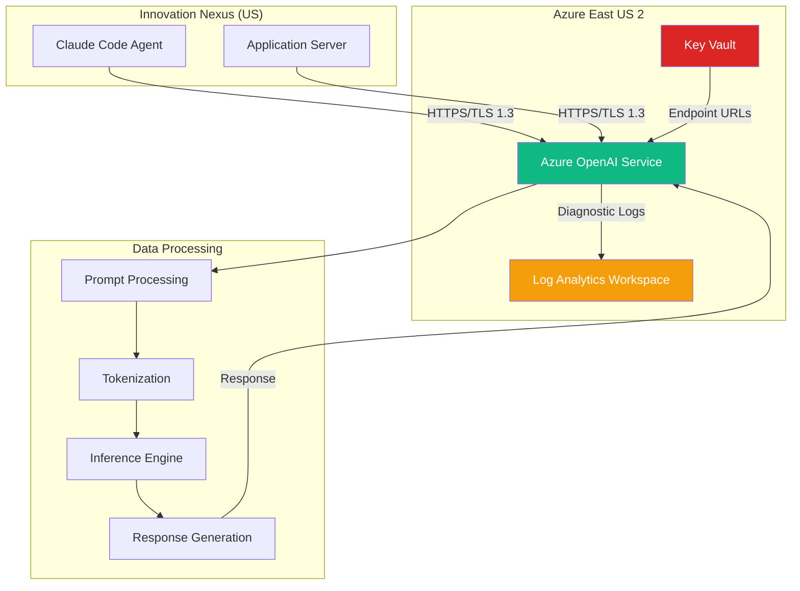
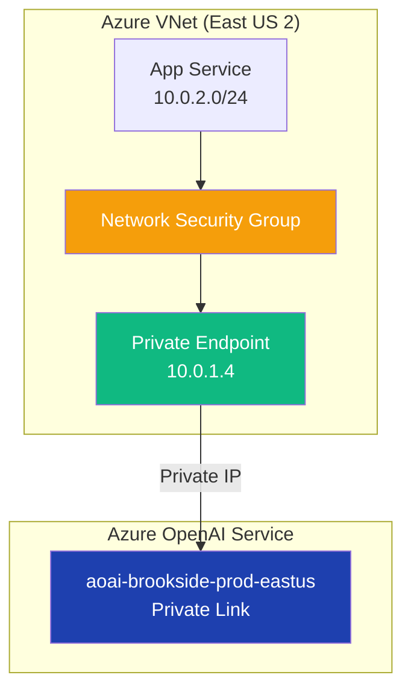

# Azure OpenAI Security & Compliance

Establish enterprise-grade security controls and compliance frameworks for Azure OpenAI Service integration with Brookside BI Innovation Nexus, ensuring data protection, regulatory adherence, and incident response capabilities.

**Best for**: Security architects, compliance officers, and operations teams implementing Azure OpenAI with governance requirements.

**Version**: 1.0.0
**Last Updated**: 2025-10-26
**Compliance Frameworks**: GDPR, HIPAA (BAA-eligible), SOC 2 Type II, ISO 27001

---

## Table of Contents

1. [Data Residency & Sovereignty](#data-residency--sovereignty)
2. [Authentication & Access Control](#authentication--access-control)
3. [Network Security](#network-security)
4. [Compliance Requirements](#compliance-requirements)
5. [Audit Logging & Monitoring](#audit-logging--monitoring)
6. [Incident Response](#incident-response)

---

## Data Residency & Sovereignty

### Regional Deployment Strategy

**Azure OpenAI Resource Location**: East US 2
- **Data Processing**: All API requests processed within US region
- **Data Storage**: Prompts and completions NOT stored by default
- **Model Hosting**: GPT-4 models hosted on Microsoft-managed infrastructure

**Key Data Protection Principles**:
- **No Data Training**: Customer data never used to improve foundation models
- **No Cross-Tenant Access**: Complete tenant isolation
- **Ephemeral Processing**: Requests/responses discarded after processing (unless abuse monitoring enabled)

---

### Data Flow Architecture



**Data Residency Guarantees**:
- ✅ All inference processing in East US 2 region
- ✅ Diagnostic logs stored in same region
- ✅ No data replication to other geographies
- ✅ Compliance with US data protection regulations

---

### Data Retention Policy

| Data Type | Retention Period | Storage Location | Purpose |
|-----------|------------------|------------------|---------|
| **API Requests** | 0 days (ephemeral) | Azure OpenAI (memory only) | Real-time inference |
| **Diagnostic Logs** | 90 days | Log Analytics Workspace (East US 2) | Audit trail, troubleshooting |
| **Cost Metrics** | 13 months | Azure Cost Management | Budget tracking, forecasting |
| **Application Insights** | 90 days | Application Insights (East US 2) | Performance monitoring |
| **Cached Responses** | 1 hour (configurable) | Application cache (in-memory) | Cost optimization |

**Data Deletion Procedures**:
```bash
# Purge Log Analytics data
az monitor log-analytics workspace data-export delete \
  --resource-group rg-brookside-aoai-dev \
  --workspace-name law-innovation-aoai \
  --name openai-diagnostic-logs

# Clear semantic cache
curl -X DELETE https://your-app/api/cache/clear \
  -H "Authorization: Bearer $TOKEN"
```

---

## Authentication & Access Control

### Azure AD-Only Authentication

**Security Configuration**:
```json
{
  "properties": {
    "disableLocalAuth": true,
    "publicNetworkAccess": "Enabled",
    "restrictOutboundNetworkAccess": false
  },
  "identity": {
    "type": "UserAssigned",
    "userAssignedIdentities": {
      "/subscriptions/.../id-brookside-aoai-dev": {}
    }
  }
}
```

**Key Security Features**:
- ❌ **API keys disabled** (`disableLocalAuth: true`)
- ✅ **Azure AD tokens only** (OAuth 2.0)
- ✅ **Token expiration**: 1 hour (automatic refresh)
- ✅ **No shared secrets** in application code

---

### RBAC Role Configuration

**Required Roles**:

| Role | Scope | Permissions | Assigned To |
|------|-------|-------------|-------------|
| **Cognitive Services OpenAI User** | Resource | Read model info, execute inference | Managed Identity (id-brookside-aoai-dev) |
| **Key Vault Secrets User** | Key Vault | Read secrets (endpoints, configs) | Managed Identity, Developers |
| **Log Analytics Reader** | Workspace | Read diagnostic logs | Operations team |
| **Cognitive Services Contributor** | Resource | Manage deployments, scaling | DevOps automation (service principal) |

**Role Assignment Commands**:
```bash
# Assign OpenAI User role to Managed Identity
az role assignment create \
  --assignee-object-id <managed-identity-principal-id> \
  --role "Cognitive Services OpenAI User" \
  --scope /subscriptions/cfacbbe8-a2a3-445f-a188-68b3b35f0c84/resourceGroups/rg-brookside-aoai-dev/providers/Microsoft.CognitiveServices/accounts/aoai-brookside-dev-eastus

# Assign Key Vault Secrets User to developers
az role assignment create \
  --assignee <user-principal-id> \
  --role "Key Vault Secrets User" \
  --scope /subscriptions/cfacbbe8-a2a3-445f-a188-68b3b35f0c84/resourceGroups/rg-innovation-nexus/providers/Microsoft.KeyVault/vaults/kv-brookside-secrets
```

**Least Privilege Principle**:
- ✅ No subscription-level permissions granted
- ✅ Resource-scoped role assignments only
- ✅ Just-in-Time (JIT) access for admin operations
- ✅ Regular access review (quarterly)

---

### Conditional Access Policies

**Azure AD Conditional Access**:
```yaml
Policy Name: Require MFA for Azure OpenAI Access
Conditions:
  - Cloud apps: Microsoft.CognitiveServices/accounts
  - Users: All users accessing Azure OpenAI
  - Locations: Any location
Controls:
  - Grant access: Require multi-factor authentication
  - Session: Sign-in frequency = 1 hour
```

**Implementation**:
- MFA required for all interactive Azure OpenAI access
- Service principal authentication exempted (uses certificate-based auth)
- Managed Identity authentication exempted (implicit trust)

---

## Network Security

### Public Endpoint Configuration

**Current Configuration** (Development/Staging):
```json
{
  "publicNetworkAccess": "Enabled",
  "networkAcls": {
    "defaultAction": "Deny",
    "ipRules": [
      {
        "value": "BROOKSIDE_BI_OFFICE_IP/32"
      },
      {
        "value": "AZURE_GITHUB_ACTIONS_IP_RANGE"
      }
    ],
    "virtualNetworkRules": []
  }
}
```

**Security Features**:
- Default deny for all public access
- IP allowlist for office network and CI/CD
- TLS 1.3 encryption enforced
- Azure DDoS Protection Standard enabled

---

### Private Endpoint Architecture (Production)

**Recommended for production deployment**:



**Private Endpoint Configuration**:
```bash
# Create private endpoint
az network private-endpoint create \
  --name pe-aoai-brookside-prod \
  --resource-group rg-brookside-aoai-prod \
  --vnet-name vnet-innovation-prod \
  --subnet snet-private-endpoints \
  --private-connection-resource-id <azure-openai-resource-id> \
  --group-id account \
  --connection-name plconn-aoai-prod

# Configure DNS
az network private-dns zone create \
  --resource-group rg-brookside-aoai-prod \
  --name privatelink.openai.azure.com

az network private-dns link vnet create \
  --resource-group rg-brookside-aoai-prod \
  --zone-name privatelink.openai.azure.com \
  --name link-aoai-prod \
  --virtual-network vnet-innovation-prod \
  --registration-enabled false

# Create DNS record
az network private-endpoint dns-zone-group create \
  --resource-group rg-brookside-aoai-prod \
  --endpoint-name pe-aoai-brookside-prod \
  --name zg-aoai-prod \
  --private-dns-zone privatelink.openai.azure.com \
  --zone-name privatelink.openai.azure.com
```

**Benefits**:
- ✅ No public internet exposure
- ✅ Traffic never leaves Azure backbone
- ✅ Enhanced security for sensitive workloads
- ✅ Compliance with strict network isolation requirements

---

### TLS/SSL Configuration

**Enforced Security Standards**:
- **Minimum TLS Version**: 1.3
- **Cipher Suites**: ECDHE-RSA-AES256-GCM-SHA384, ECDHE-RSA-AES128-GCM-SHA256
- **Certificate Validation**: Strict (Azure-managed certificates)

**PowerShell Verification**:
```powershell
# Test TLS connection
$endpoint = "https://aoai-brookside-dev-eastus.openai.azure.com"
$response = Invoke-WebRequest -Uri $endpoint -Method HEAD

Write-Host "TLS Protocol: $($response.BaseResponse.SslProtocol)"
Write-Host "Cipher Suite: $($response.BaseResponse.CipherSuite)"

# Expected output:
# TLS Protocol: Tls13
# Cipher Suite: TLS_AES_256_GCM_SHA384
```

---

## Compliance Requirements

### GDPR (General Data Protection Regulation)

**Data Subject Rights**:

| Right | Implementation | Timeline |
|-------|----------------|----------|
| **Right to Access** | Log Analytics query to retrieve user's API calls | 30 days |
| **Right to Erasure** | Purge logs, clear cache, delete user data | 30 days |
| **Right to Portability** | Export diagnostic logs to JSON/CSV | 30 days |
| **Right to Rectification** | Update cached responses (invalidate cache) | Immediate |

**GDPR-Compliant Logging**:
```kusto
// Retrieve all API calls for specific user
AzureDiagnostics
| where ResourceProvider == "MICROSOFT.COGNITIVESERVICES"
| where Category == "RequestResponse"
| extend UserIdentifier = tostring(Properties.userId)
| where UserIdentifier == "<user-email-or-id>"
| project TimeGenerated, OperationName, DurationMs, ResultType
```

**Data Processing Agreement (DPA)**:
- Microsoft standard DPA applies to Azure OpenAI Service
- Brookside BI acts as Data Controller
- Microsoft Azure acts as Data Processor
- DPA includes Standard Contractual Clauses (SCCs) for EU data transfers

---

### HIPAA (Health Insurance Portability and Accountability Act)

**BAA-Eligible Service**:
- Azure OpenAI Service is eligible for Business Associate Agreement (BAA)
- Contact Microsoft Sales to execute BAA for production deployments
- PHI data should NOT be included in prompts without BAA

**HIPAA Safeguards**:
```yaml
Administrative:
  - Security Management Process: Risk assessments quarterly
  - Workforce Security: RBAC role assignments, MFA required
  - Information Access Management: Least privilege principle

Physical:
  - Facility Access: Azure datacenter physical security
  - Workstation Security: Developer workstations encrypted

Technical:
  - Access Control: Azure AD authentication, RBAC
  - Audit Controls: Log Analytics, 90-day retention
  - Integrity: TLS 1.3 encryption in transit
  - Transmission Security: Azure Private Link (prod)
```

**Prohibited PHI in Prompts** (without BAA):
```typescript
// ❌ DO NOT include PHI
const prompt = `Analyze patient John Doe (SSN: 123-45-6789, DOB: 01/01/1980)`;

// ✅ De-identified data only
const prompt = `Analyze patient demographics: Age 45, Gender Male, Condition diabetes`;
```

---

### SOC 2 Type II

**Trust Service Criteria Coverage**:

| Criteria | Azure OpenAI Control | Evidence |
|----------|---------------------|----------|
| **Security** | Azure AD authentication, RBAC, encryption | Azure compliance documentation |
| **Availability** | 99.9% SLA, multi-region failover capability | Azure Service Health dashboard |
| **Processing Integrity** | Deterministic outputs (seed parameter), input validation | API reference documentation |
| **Confidentiality** | Encryption at rest/transit, no data training | Azure Trust Center |
| **Privacy** | GDPR compliance, data residency controls | Privacy documentation |

**Brookside BI Controls**:
- Documented change management for infrastructure updates
- Access review process (quarterly)
- Incident response procedures
- Vendor risk assessment for Microsoft Azure

---

### ISO 27001

**Information Security Management System (ISMS)**:
- Azure OpenAI Service maintains ISO 27001 certification
- Brookside BI inherits controls through Azure platform
- Annual surveillance audits by accredited third party

**Key Controls**:
- **A.9 Access Control**: RBAC, Azure AD, MFA
- **A.10 Cryptography**: TLS 1.3, Azure-managed keys
- **A.12 Operations Security**: Log Analytics, monitoring
- **A.14 System Acquisition**: Secure SDLC, Bicep IaC

---

## Audit Logging & Monitoring

### Diagnostic Logging Configuration

**Log Categories**:
```json
{
  "diagnosticSettings": {
    "name": "diag-aoai-to-law",
    "logs": [
      {
        "category": "Audit",
        "enabled": true,
        "retentionPolicy": {
          "enabled": true,
          "days": 90
        }
      },
      {
        "category": "RequestResponse",
        "enabled": true,
        "retentionPolicy": {
          "enabled": true,
          "days": 90
        }
      },
      {
        "category": "Trace",
        "enabled": false
      }
    ],
    "metrics": [
      {
        "category": "AllMetrics",
        "enabled": true,
        "retentionPolicy": {
          "enabled": true,
          "days": 90
        }
      }
    ]
  }
}
```

**Enable Diagnostic Logging**:
```bash
# Configure diagnostic settings
az monitor diagnostic-settings create \
  --name diag-aoai-to-law \
  --resource <azure-openai-resource-id> \
  --workspace <log-analytics-workspace-id> \
  --logs '[{"category":"Audit","enabled":true},{"category":"RequestResponse","enabled":true}]' \
  --metrics '[{"category":"AllMetrics","enabled":true}]'
```

---

### Audit Trail Queries

**User Access Audit**:
```kusto
AzureDiagnostics
| where ResourceProvider == "MICROSOFT.COGNITIVESERVICES"
| where Category == "Audit"
| where OperationName contains "Authentication"
| extend UserIdentity = tostring(parse_json(Properties).identity)
| project TimeGenerated, UserIdentity, OperationName, ResultType, ClientIP = CallerIpAddress
| order by TimeGenerated desc
```

**API Usage by User**:
```kusto
AzureDiagnostics
| where ResourceProvider == "MICROSOFT.COGNITIVESERVICES"
| where Category == "RequestResponse"
| extend UserId = tostring(Properties.userId)
| summarize RequestCount = count(), TotalTokens = sum(toint(Properties.totalTokens)) by UserId, bin(TimeGenerated, 1h)
| order by TotalTokens desc
```

**Abnormal Activity Detection**:
```kusto
// Detect unusually high token usage
let baseline = AzureDiagnostics
| where ResourceProvider == "MICROSOFT.COGNITIVESERVICES"
| where TimeGenerated between (ago(7d) .. ago(1d))
| summarize AvgTokens = avg(toint(Properties.totalTokens));

AzureDiagnostics
| where ResourceProvider == "MICROSOFT.COGNITIVESERVICES"
| where TimeGenerated > ago(1h)
| extend TotalTokens = toint(Properties.totalTokens)
| where TotalTokens > toscalar(baseline) * 3
| project TimeGenerated, UserId = tostring(Properties.userId), TotalTokens, OperationName
```

---

### Security Alerts

**Azure Sentinel Integration**:
```yaml
# Analytics Rule: Excessive Token Usage
Rule Name: Azure OpenAI - Excessive Token Consumption
Severity: Medium
Trigger: TotalTokens > 50,000 in 1 hour for single user
Actions:
  - Email to security@brooksidebi.com
  - Create incident in Sentinel
  - Log to SIEM

# Analytics Rule: Failed Authentication Attempts
Rule Name: Azure OpenAI - Multiple Auth Failures
Severity: High
Trigger: 5+ failed auth attempts in 10 minutes
Actions:
  - Email to security@brooksidebi.com
  - Block IP address via Network Security Group
  - Create high-priority incident
```

---

## Incident Response

### Incident Classification

| Severity | Definition | Response Time | Examples |
|----------|------------|---------------|----------|
| **Critical (P0)** | Data breach, service outage | 15 minutes | Unauthorized access, API key exposure |
| **High (P1)** | Security vulnerability, significant performance degradation | 1 hour | Suspected intrusion, DDoS attack |
| **Medium (P2)** | Policy violation, minor security issue | 4 hours | Excessive API usage, compliance gap |
| **Low (P3)** | Informational, monitoring alert | 24 hours | Budget threshold exceeded |

---

### Incident Response Procedures

#### Scenario 1: Suspected Data Breach

**Detection**:
- Azure Sentinel alert: Unusual data access pattern
- Log Analytics query shows unauthorized user accessing Azure OpenAI

**Response Steps**:
```yaml
1. Immediate Containment (0-15 minutes):
   - Disable public network access via Azure Portal
   - Revoke all Azure AD tokens for affected users
   - Enable IP restrictions to known-good networks

2. Investigation (15-60 minutes):
   - Review Log Analytics for complete audit trail
   - Identify scope of unauthorized access
   - Determine if data was exfiltrated

3. Remediation (1-4 hours):
   - Rotate all credentials (Managed Identity, service principals)
   - Patch security vulnerability if identified
   - Restore normal operations with enhanced monitoring

4. Post-Incident (24-48 hours):
   - Conduct root cause analysis
   - Update incident response playbook
   - Notify affected parties (if required by regulation)
   - Submit incident report to compliance team
```

**Azure CLI Commands**:
```bash
# Disable public network access (immediate containment)
az cognitiveservices account update \
  --name aoai-brookside-prod-eastus \
  --resource-group rg-brookside-aoai-prod \
  --public-network-access Disabled

# Review audit logs
az monitor log-analytics query \
  --workspace <workspace-id> \
  --analytics-query "AzureDiagnostics | where TimeGenerated > ago(24h) | where Category == 'Audit'"

# Re-enable with IP restrictions
az cognitiveservices account network-rule add \
  --name aoai-brookside-prod-eastus \
  --resource-group rg-brookside-aoai-prod \
  --ip-address <trusted-ip>
```

---

#### Scenario 2: API Key Exposure (Legacy)

**Note**: With `disableLocalAuth: true`, API keys are disabled. This scenario applies only if local auth accidentally enabled.

**Detection**:
- GitHub secret scanning alert
- API key found in public repository commit

**Response Steps**:
```bash
# 1. Revoke exposed key immediately
az cognitiveservices account keys regenerate \
  --name aoai-brookside-dev-eastus \
  --resource-group rg-brookside-aoai-dev \
  --key-name key1

# 2. Disable local auth permanently
az cognitiveservices account update \
  --name aoai-brookside-dev-eastus \
  --resource-group rg-brookside-aoai-dev \
  --custom-domain aoai-brookside-dev-eastus \
  --assign-identity \
  --identity-type UserAssigned \
  --user-assigned <managed-identity-id> \
  --properties '{"disableLocalAuth":true}'

# 3. Verify no API key usage in logs
az monitor log-analytics query \
  --workspace <workspace-id> \
  --analytics-query "AzureDiagnostics | where Properties contains 'api-key'"
```

---

#### Scenario 3: Compliance Violation

**Detection**:
- Manual audit identifies GDPR right-to-erasure not honored within 30 days
- SOC 2 audit finds missing access review documentation

**Response Steps**:
1. **Immediate**: Execute data subject request (delete logs, cache)
2. **Short-term**: Automate compliance workflows (scripts, runbooks)
3. **Long-term**: Implement preventive controls (automated access reviews, data retention policies)

**Data Deletion Script**:
```powershell
# GDPR Right to Erasure - Delete user data
param(
    [Parameter(Mandatory=$true)]
    [string]$UserId
)

# 1. Purge Log Analytics data
az monitor log-analytics workspace data-export delete `
    --resource-group rg-brookside-aoai-dev `
    --workspace-name law-innovation-aoai `
    --name "export-$UserId"

# 2. Clear semantic cache for user
Invoke-RestMethod -Uri "https://your-app/api/cache/clear?userId=$UserId" `
    -Method DELETE `
    -Headers @{ "Authorization" = "Bearer $TOKEN" }

# 3. Document deletion in compliance log
Add-Content -Path "compliance-actions.log" `
    -Value "$(Get-Date -Format 'yyyy-MM-dd HH:mm:ss') - GDPR Erasure: User $UserId data deleted"
```

---

### Incident Communication Plan

**Notification Matrix**:

| Incident Type | Stakeholders | Notification Method | Timeline |
|---------------|--------------|---------------------|----------|
| **Data Breach (P0)** | CEO, CISO, Legal, Affected Users | Email + Phone | Immediate |
| **Security Vulnerability (P1)** | CISO, Engineering Lead | Email + Teams | 1 hour |
| **Compliance Issue (P2)** | Compliance Officer, Engineering Lead | Email | 4 hours |
| **Performance Degradation (P3)** | Operations Team | Teams Channel | 24 hours |

**External Communication**:
- **Regulatory Notification**: GDPR breach notification within 72 hours (if >250 records affected)
- **Customer Notification**: Email within 24 hours for security incidents affecting service
- **Public Disclosure**: Blog post for critical vulnerabilities (after patch deployed)

---

## Security Best Practices Checklist

### Development
- [ ] Use Managed Identity for all authentication (no API keys)
- [ ] Validate and sanitize all user inputs to prevent prompt injection
- [ ] Implement rate limiting to prevent abuse
- [ ] Use semantic caching to reduce API surface area
- [ ] Enable diagnostic logging for all environments
- [ ] Store secrets in Azure Key Vault (never in code)
- [ ] Implement circuit breaker pattern for resilience

### Operations
- [ ] Review RBAC assignments quarterly
- [ ] Monitor Log Analytics for suspicious activity daily
- [ ] Test incident response procedures quarterly
- [ ] Update IP allowlists when network changes occur
- [ ] Patch application dependencies monthly
- [ ] Conduct security training for developers annually

### Compliance
- [ ] Maintain GDPR data processing records
- [ ] Execute BAA for HIPAA workloads (if applicable)
- [ ] Document SOC 2 controls and evidence
- [ ] Perform vendor risk assessment annually
- [ ] Review and update privacy policy annually

---

## Additional Resources

### Microsoft Resources
- [Azure OpenAI Security Overview](https://learn.microsoft.com/en-us/azure/ai-services/openai/concepts/security)
- [Azure Compliance Documentation](https://learn.microsoft.com/en-us/azure/compliance/)
- [Azure Trust Center](https://www.microsoft.com/en-us/trust-center)

### Brookside BI Resources
- **Integration Guide**: [integration-guide.md](./integration-guide.md)
- **API Reference**: [api-reference.md](./api-reference.md)
- **Operations Runbook**: [operations.md](./operations.md)

### Regulatory Resources
- [GDPR Official Text](https://gdpr-info.eu/)
- [HIPAA Security Rule](https://www.hhs.gov/hipaa/for-professionals/security/index.html)
- [SOC 2 Framework](https://www.aicpa.org/interestareas/frc/assuranceadvisoryservices/sorhome)

### Support
- **Email**: consultations@brooksidebi.com
- **Phone**: +1 209 487 2047
- **Security Incidents**: security@brooksidebi.com

---

**Document Version**: 1.0.0
**Last Reviewed**: 2025-10-26
**Next Review**: 2026-01-26
**Owner**: Brookside BI Security & Compliance Team

*This security and compliance guide establishes enterprise-grade controls for Azure OpenAI integration, ensuring data protection, regulatory adherence, and incident response capabilities that support sustainable innovation workflows.*
