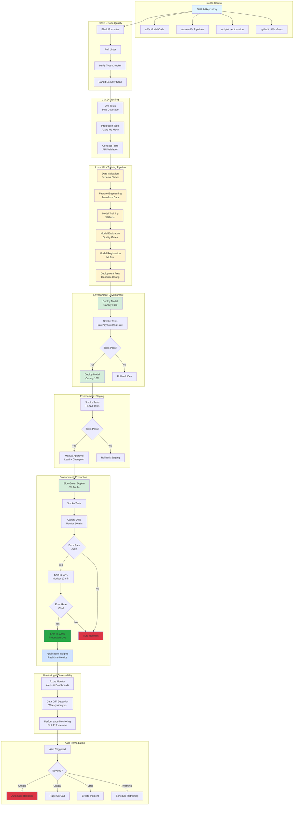

# MLOps Pipeline Architecture
## Brookside BI Innovation Nexus

**Version**: 1.0.0
**Last Updated**: 2025-10-26

---

## Complete Pipeline Architecture



---

## Component Interaction Diagram

```
┌─────────────────────────────────────────────────────────────────────┐
│                        GitHub Actions Runner                         │
│                                                                      │
│  ┌────────────────┐     ┌────────────────┐     ┌────────────────┐  │
│  │ Code Quality   │ --> │ Unit Tests     │ --> │ Integration    │  │
│  │ Checks         │     │ (pytest)       │     │ Tests          │  │
│  └────────────────┘     └────────────────┘     └────────────────┘  │
└──────────────────────────────┬──────────────────────────────────────┘
                               │
                               ▼
┌─────────────────────────────────────────────────────────────────────┐
│                  Azure Machine Learning Workspace                    │
│                                                                      │
│  ┌─────────────────────────────────────────────────────────────┐   │
│  │              Training Pipeline (6 Steps)                     │   │
│  │                                                              │   │
│  │  Data          Feature        Model          Evaluation     │   │
│  │  Validation -> Engineering -> Training   ->  & Gates        │   │
│  │                                                              │   │
│  │  Model         Deployment                                   │   │
│  │  Registration  Preparation                                  │   │
│  └─────────────────────────────────────────────────────────────┘   │
│                               │                                     │
│  ┌─────────────────────────────────────────────────────────────┐   │
│  │                   MLflow Model Registry                      │   │
│  │  - Version: 1.2.3                                           │   │
│  │  - Framework: XGBoost 1.7                                   │   │
│  │  - Metrics: Accuracy 0.92, Precision 0.87, Recall 0.84      │   │
│  │  - Lineage: Training Job abc123                             │   │
│  └─────────────────────────────────────────────────────────────┘   │
└──────────────────────────────┬──────────────────────────────────────┘
                               │
                               ▼
┌─────────────────────────────────────────────────────────────────────┐
│                    Azure ML Managed Endpoints                        │
│                                                                      │
│  ┌────────────────────┐  ┌────────────────────┐  ┌───────────────┐ │
│  │ Dev Endpoint       │  │ Staging Endpoint   │  │ Prod Endpoint │ │
│  │ viability-scoring- │  │ viability-scoring- │  │ viability-    │ │
│  │ dev                │  │ staging            │  │ scoring-prod  │ │
│  │                    │  │                    │  │               │ │
│  │ Instance: DS2_v2   │  │ Instance: DS3_v2   │  │ Instance:     │ │
│  │ Count: 1           │  │ Count: 1           │  │ DS3_v2 × 2    │ │
│  │ Priority: Spot     │  │ Priority: Spot     │  │ Priority:     │ │
│  │ Cost: ~$28/mo      │  │ Cost: ~$57/mo      │  │ Reserved      │ │
│  │                    │  │                    │  │ Cost: ~$360/mo│ │
│  └────────────────────┘  └────────────────────┘  └───────────────┘ │
└──────────────────────────────┬──────────────────────────────────────┘
                               │
                               ▼
┌─────────────────────────────────────────────────────────────────────┐
│              Application Insights + Azure Monitor                    │
│                                                                      │
│  ┌──────────────┐  ┌──────────────┐  ┌──────────────┐             │
│  │ Metrics      │  │ Logging      │  │ Alerting     │             │
│  │ - Error Rate │  │ - Requests   │  │ - Email      │             │
│  │ - Latency    │  │ - Exceptions │  │ - Teams      │             │
│  │ - Throughput │  │ - Traces     │  │ - PagerDuty  │             │
│  │ - Availability│  │ - Custom     │  │ - Webhooks   │             │
│  └──────────────┘  └──────────────┘  └──────────────┘             │
│                                                                      │
│  ┌──────────────────────────────────────────────────────────────┐  │
│  │              Data Drift Detection (Weekly)                    │  │
│  │  - PSI (Categorical)                                         │  │
│  │  - K-S Test (Continuous)                                     │  │
│  │  - Jensen-Shannon Divergence                                 │  │
│  │  → Threshold: 15% Warning, 30% Critical                      │  │
│  └──────────────────────────────────────────────────────────────┘  │
└─────────────────────────────────────────────────────────────────────┘
```

---

## Data Flow Architecture

```
┌────────────────────────────────────────────────────────────────────┐
│                         Training Data Flow                          │
└────────────────────────────────────────────────────────────────────┘

Notion Workspace (Ideas, Research, Builds)
    │
    ├─> Export to CSV/Parquet
    │
    ├─> Upload to Azure Blob Storage
    │       (Data Source: raw_data/)
    │
    ▼
Azure ML Pipeline - Data Validation
    │
    ├─> Schema Validation (viability_schema.json)
    ├─> Quality Checks (missing values <10%)
    ├─> Anomaly Detection
    │
    ▼ (validated_data/)
    │
Azure ML Pipeline - Feature Engineering
    │
    ├─> Categorical Encoding (target encoding)
    ├─> Numerical Scaling (robust scaler)
    ├─> Feature Selection (importance >0.05)
    ├─> Interaction Features
    │
    ▼ (engineered_features/)
    │
Azure ML Pipeline - Model Training
    │
    ├─> Train/Val/Test Split (70/20/10)
    ├─> XGBoost Training (5-fold CV)
    ├─> Hyperparameter Tuning (Bayesian)
    ├─> Early Stopping (50 rounds)
    │
    ▼ (trained_model/)
    │
Azure ML Pipeline - Model Evaluation
    │
    ├─> Calculate Metrics (accuracy, precision, recall)
    ├─> Generate Confusion Matrix
    ├─> SHAP Values (interpretability)
    ├─> Compare with Baseline
    │
    ▼ (evaluation_metrics/)
    │
MLflow Model Registry
    │
    └─> Registered Model: viability_scoring_model
        - Version: 1.2.3
        - Stage: Production
        - Metrics: { accuracy: 0.92, precision: 0.87, recall: 0.84 }


┌────────────────────────────────────────────────────────────────────┐
│                      Inference Data Flow                            │
└────────────────────────────────────────────────────────────────────┘

External Application / API Consumer
    │
    ├─> POST https://viability-scoring-prod.eastus.inference.ml.azure.com/score
    │   Headers: { Authorization: Bearer {api_key} }
    │   Body: {
    │       "data": [{
    │           "idea_title": "AI Cost Optimizer",
    │           "research_score": 85,
    │           "estimated_cost": 15000,
    │           ...
    │       }]
    │   }
    │
    ▼
Azure ML Managed Endpoint (viability-scoring-prod)
    │
    ├─> Load Balancer (2 instances)
    │
    ▼
Model Inference Container
    │
    ├─> Input Validation
    ├─> Feature Transformation (same as training)
    ├─> Model Prediction (XGBoost/ONNX)
    ├─> Output Formatting
    │
    ▼
Response
    {
        "predictions": [{
            "viability_score": 87,
            "confidence": 0.92,
            "category": "High Viability",
            "factors": {
                "research_strength": 0.85,
                "market_potential": 0.91,
                "cost_feasibility": 0.82
            }
        }]
    }
    │
    ├─> Log to Application Insights
    │   - Request duration
    │   - Prediction confidence
    │   - Model version used
    │
    └─> Return to API Consumer
```

---

## Deployment Strategy Details

### Canary Deployment (Dev/Staging)

```
┌─────────────────────────────────────────────────────────────┐
│                  Canary Deployment Flow                      │
└─────────────────────────────────────────────────────────────┘

Time: T+0 minutes
┌─────────────────────────────────────────────────────────────┐
│  Endpoint: viability-scoring-dev                            │
│                                                             │
│  Old Deployment (deploy-20251020):  90% traffic ████████   │
│  New Deployment (deploy-20251026):  10% traffic █          │
│                                                             │
│  Status: Monitoring (10 minutes)                            │
│  - Error Rate: <5%                                          │
│  - Latency P95: <2000ms                                     │
│  - Availability: >99%                                       │
└─────────────────────────────────────────────────────────────┘

Time: T+10 minutes (if metrics OK)
┌─────────────────────────────────────────────────────────────┐
│  Endpoint: viability-scoring-dev                            │
│                                                             │
│  Old Deployment (deploy-20251020):  50% traffic ████        │
│  New Deployment (deploy-20251026):  50% traffic ████        │
│                                                             │
│  Status: Monitoring (10 minutes)                            │
└─────────────────────────────────────────────────────────────┘

Time: T+20 minutes (if metrics OK)
┌─────────────────────────────────────────────────────────────┐
│  Endpoint: viability-scoring-dev                            │
│                                                             │
│  Old Deployment (deploy-20251020):   0% traffic            │
│  New Deployment (deploy-20251026): 100% traffic ████████   │
│                                                             │
│  Status: Deployment Complete                                │
│  Action: Delete old deployment after 24 hours               │
└─────────────────────────────────────────────────────────────┘
```

### Blue-Green Deployment (Production)

```
┌─────────────────────────────────────────────────────────────┐
│              Blue-Green Deployment Flow                      │
└─────────────────────────────────────────────────────────────┘

Phase 1: Current Production (Blue)
┌─────────────────────────────────────────────────────────────┐
│  Endpoint: viability-scoring-prod                           │
│                                                             │
│  Blue (deploy-20251020):  100% traffic ████████████        │
│  Green (not deployed):      0% traffic                      │
│                                                             │
│  Status: Stable Production                                  │
└─────────────────────────────────────────────────────────────┘

Phase 2: Deploy Green (No Traffic)
┌─────────────────────────────────────────────────────────────┐
│  Endpoint: viability-scoring-prod                           │
│                                                             │
│  Blue (deploy-20251020):  100% traffic ████████████        │
│  Green (deploy-20251026):   0% traffic (deployed, testing)  │
│                                                             │
│  Status: Green deployed, smoke tests running                │
│  - Endpoint health check: PASS                              │
│  - Prediction validation: PASS                              │
│  - Latency test: PASS (P95: 1,247ms)                        │
└─────────────────────────────────────────────────────────────┘

Phase 3: Manual Approval Gate
┌─────────────────────────────────────────────────────────────┐
│                 APPROVAL REQUIRED                            │
│                                                             │
│  Approvers: Lead Builder + Champion                         │
│  Test Results: All smoke tests PASSED                       │
│  Model Metrics: Accuracy 0.92 (↑ 0.03 vs baseline)          │
│  Cost Impact: No change ($360/month reserved capacity)      │
│                                                             │
│  Action: [ APPROVE ] [ REJECT ] [ REQUEST CHANGES ]         │
└─────────────────────────────────────────────────────────────┘

Phase 4: Switch Traffic (Instant)
┌─────────────────────────────────────────────────────────────┐
│  Endpoint: viability-scoring-prod                           │
│                                                             │
│  Blue (deploy-20251020):    0% traffic (kept for rollback)  │
│  Green (deploy-20251026): 100% traffic ████████████        │
│                                                             │
│  Status: Production traffic switched (instant)              │
│  Rollback Available: Yes (flip back to blue if needed)      │
└─────────────────────────────────────────────────────────────┘

Phase 5: Monitor & Cleanup (24 hours later)
┌─────────────────────────────────────────────────────────────┐
│  Endpoint: viability-scoring-prod                           │
│                                                             │
│  Green (deploy-20251026): 100% traffic ████████████        │
│  Blue (deploy-20251020): DELETED (after 24h stable)         │
│                                                             │
│  Status: Production stable, old deployment removed          │
└─────────────────────────────────────────────────────────────┘
```

---

## Monitoring Architecture

```
┌────────────────────────────────────────────────────────────────────┐
│                  Application Insights Integration                   │
└────────────────────────────────────────────────────────────────────┘

Endpoint Request
    │
    ├─> Application Insights SDK (auto-instrumentation)
    │       │
    │       ├─> Request Telemetry
    │       │   - Duration
    │       │   - Status code
    │       │   - Custom dimensions
    │       │
    │       ├─> Dependency Telemetry
    │       │   - Model inference time
    │       │   - Feature transformation time
    │       │
    │       ├─> Exception Telemetry
    │       │   - Error stack traces
    │       │   - Failure reasons
    │       │
    │       └─> Custom Events
    │           - Prediction confidence
    │           - Model version
    │           - Viability category
    │
    ▼
Application Insights Analytics
    │
    ├─> Kusto Query Language (KQL)
    │   - requests | summarize percentile(duration, 95)
    │   - exceptions | where timestamp > ago(1h)
    │   - customEvents | where name == "low_confidence_prediction"
    │
    ▼
Azure Monitor Alerts
    │
    ├─> Metric Alerts
    │   - Error rate >5% for 10 minutes
    │   - P95 latency >2000ms for 15 minutes
    │   - Availability <99% for 15 minutes
    │
    ├─> Log Alerts
    │   - Specific exception patterns
    │   - Data quality issues
    │   - Authentication failures
    │
    └─> Smart Detection
        - Anomaly detection
        - Failure rate increases
        - Performance degradation
    │
    ▼
Action Groups
    │
    ├─> Email: consultations@brooksidebi.com
    ├─> Teams: Webhook notification
    ├─> PagerDuty: On-call engineer (critical only)
    └─> Webhook: Auto-remediation trigger


┌────────────────────────────────────────────────────────────────────┐
│                   Data Drift Detection Architecture                 │
└────────────────────────────────────────────────────────────────────┘

Scheduled Trigger (Monday 2 AM UTC)
    │
    ├─> Azure ML Pipeline Job: drift_detection_pipeline
    │       │
    │       ├─> Load Production Predictions (last 7 days)
    │       ├─> Load Training Baseline Distribution
    │       │
    │       ├─> Calculate Drift Metrics per Feature:
    │       │   - PSI (Population Stability Index) for categorical
    │       │   - K-S Test (Kolmogorov-Smirnov) for continuous
    │       │   - Jensen-Shannon Divergence for distributions
    │       │
    │       ├─> Aggregate Drift Score:
    │       │   - % of features with drift >threshold
    │       │   - Weighted by feature importance
    │       │
    │       └─> Generate Drift Report (HTML/JSON)
    │
    ▼
Drift Analysis Results
    │
    ├─> Drift Level: 12% of features (Below 15% threshold)
    │   Status: OK (Informational)
    │   Action: Log to Application Insights
    │
    ├─> Drift Level: 18% of features (Above 15% threshold)
    │   Status: WARNING
    │   Action: Notify data science team + schedule retraining
    │
    └─> Drift Level: 32% of features (Above 30% threshold)
    │   Status: CRITICAL
    │   Action: Immediate retraining + consider rollback
    │
    ▼
Auto-Remediation (if critical)
    │
    ├─> Submit Retraining Pipeline Job
    │   - Use last 90 days of data
    │   - Min 5,000 training samples
    │   - Same quality gates as manual training
    │
    ├─> Monitor Retraining Progress
    │
    ├─> Deploy New Model (if passes quality gates)
    │   - Canary deployment (10% → 50% → 100%)
    │   - Compare performance with current model
    │
    └─> Update Baseline Distribution
        - New model becomes baseline for next drift check
```

---

## Cost Optimization Architecture

```
┌────────────────────────────────────────────────────────────────────┐
│                    Cost Optimization Strategies                     │
└────────────────────────────────────────────────────────────────────┘

Strategy 1: Spot Instances (Dev/Staging)
┌─────────────────────────────────────────────────────────────┐
│  Dev Environment                                            │
│  - Instance: Standard_DS2_v2                                │
│  - Priority: Spot (LowPriority)                             │
│  - Pay-As-You-Go: $0.196/hour × 730 = $143/month           │
│  - Spot Price: $0.039/hour × 730 = $28/month                │
│  - Savings: $115/month (80% reduction)                      │
│                                                             │
│  Tradeoff: Eviction possible (auto-restart configured)      │
└─────────────────────────────────────────────────────────────┘

Strategy 2: Reserved Capacity (Production)
┌─────────────────────────────────────────────────────────────┐
│  Production Environment                                     │
│  - Instance: Standard_DS3_v2 × 2                            │
│  - Pay-As-You-Go: $0.392/hour × 2 × 730 = $572/month       │
│  - Reserved (1-year): $0.247/hour × 2 × 730 = $360/month   │
│  - Savings: $212/month (37% reduction)                      │
│  - Annual Savings: $2,544                                   │
│                                                             │
│  Benefit: Guaranteed availability, predictable costs        │
└─────────────────────────────────────────────────────────────┘

Strategy 3: Auto-Scaling
┌─────────────────────────────────────────────────────────────┐
│  Production Auto-Scale Configuration                        │
│  - Min Instances: 2 (HA requirement)                        │
│  - Max Instances: 10                                        │
│  - Scale Up: CPU >80% for 5 minutes                         │
│  - Scale Down: CPU <30% for 15 minutes                      │
│                                                             │
│  Cost Range:                                                │
│  - Base (2 instances): $360/month                           │
│  - Peak (10 instances): $1,800/month                        │
│  - Average (3 instances): $540/month                        │
│                                                             │
│  Savings: ~$1,260/month vs. static 10 instances             │
└─────────────────────────────────────────────────────────────┘

Strategy 4: Model Compression (ONNX)
┌─────────────────────────────────────────────────────────────┐
│  ONNX Runtime Optimization                                  │
│  - Inference Speed: 30-50% faster                           │
│  - Memory Usage: 40% reduction                              │
│  - Instance Size: DS3_v2 → DS2_v2 (potential)               │
│  - Cost Impact: $360/month → $226/month (37% reduction)     │
│                                                             │
│  Tradeoff: One-time conversion effort                       │
└─────────────────────────────────────────────────────────────┘

Total Optimized Infrastructure Cost:
  Dev: $28/month (spot instances)
  Staging: $57/month (spot instances)
  Production: $360/month (reserved capacity + auto-scale)
  ────────────────────────────────────────────────────────
  Total: $445/month (~$5,344/year)

  vs. Pay-As-You-Go: $657/month (~$7,888/year)
  Annual Savings: $2,544 (32% reduction)
```

---

**Brookside BI Innovation Nexus - Establish structured approaches for sustainable ML operations.**

**Architecture Version**: 1.0.0
**Last Updated**: 2025-10-26
