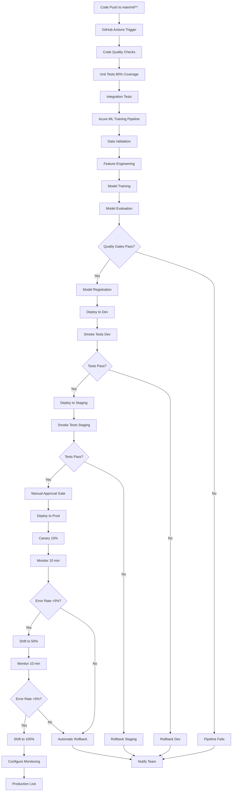

# MLOps Deployment Workflow Guide
## Brookside BI Innovation Nexus

**Purpose**: Establish automated model training, testing, and deployment pipelines for Azure Machine Learning endpoints supporting innovation viability scoring, cost optimization, and pattern mining use cases across development, staging, and production environments.

**Best for**: Organizations requiring scalable, reproducible ML model lifecycle management with comprehensive quality gates, monitoring, and rollback capabilities.

**Version**: 1.0.0
**Last Updated**: 2025-10-26
**Contact**: consultations@brooksidebi.com | +1 209 487 2047

---

## Table of Contents

1. [Architecture Overview](#architecture-overview)
2. [Pipeline Components](#pipeline-components)
3. [Deployment Strategies](#deployment-strategies)
4. [Environment Promotion Workflow](#environment-promotion-workflow)
5. [Quality Gates](#quality-gates)
6. [Monitoring and Alerting](#monitoring-and-alerting)
7. [Rollback Procedures](#rollback-procedures)
8. [Cost Optimization](#cost-optimization)
9. [Troubleshooting Guide](#troubleshooting-guide)

---

## Architecture Overview

### MLOps Pipeline Architecture



### Component Architecture

```
┌─────────────────────────────────────────────────────────────┐
│                    GitHub Repository                         │
│  ml/                  - Model code (training, evaluation)    │
│  azure-ml/pipelines/  - Azure ML pipeline definitions        │
│  scripts/             - Deployment automation scripts        │
│  .github/workflows/   - CI/CD workflows                      │
└─────────────────────────────────────────────────────────────┘
                              │
                              ▼
┌─────────────────────────────────────────────────────────────┐
│                   Azure Machine Learning                     │
│                                                              │
│  ┌────────────────┐  ┌────────────────┐  ┌───────────────┐ │
│  │ Training       │  │ Model          │  │ Managed       │ │
│  │ Pipeline       │─▶│ Registry       │─▶│ Endpoints     │ │
│  │ (6 steps)      │  │ (MLflow)       │  │ (Dev/Stg/Prod)│ │
│  └────────────────┘  └────────────────┘  └───────────────┘ │
└─────────────────────────────────────────────────────────────┘
                              │
                              ▼
┌─────────────────────────────────────────────────────────────┐
│              Application Insights + Azure Monitor            │
│  - Real-time metrics    - Data drift detection              │
│  - Error tracking       - Performance monitoring            │
│  - Custom alerts        - Auto-remediation triggers         │
└─────────────────────────────────────────────────────────────┘
```

---

## Pipeline Components

### 1. Azure ML Training Pipeline

**Location**: `azure-ml/pipelines/ml-training-pipeline.yml`

**Purpose**: Orchestrate end-to-end ML workflow from data validation through model registration with quality gates.

#### Pipeline Steps

##### Step 1: Data Validation
**Duration**: ~3-5 minutes
**Compute**: CPU (Standard_D4s_v3)

```yaml
Responsibilities:
  - Schema compliance validation against viability_schema.json
  - Data quality checks (missing values <10%, minimum 1,000 samples)
  - Data drift detection (compare with training baseline)
  - Anomaly detection (outliers, unexpected distributions)

Quality Gates:
  ✓ Schema matches expected structure
  ✓ Missing value ratio <10%
  ✓ Minimum sample count met (1,000+)
  ✓ No critical anomalies detected

Outputs:
  - validated_data/: Cleaned data passing quality checks
  - validation_report.json: Detailed validation metrics
```

##### Step 2: Feature Engineering
**Duration**: ~5-10 minutes
**Compute**: CPU (Standard_D4s_v3)

```yaml
Responsibilities:
  - Extract predictive features from Notion metadata
  - Encode categorical variables (target encoding)
  - Scale numerical features (robust scaling)
  - Feature selection (importance threshold 0.05)
  - Generate interaction features

Outputs:
  - engineered_features/: Transformed feature sets
  - feature_metadata.json: Feature importance and transformations
```

##### Step 3: Model Training
**Duration**: ~15-45 minutes
**Compute**: CPU (Standard_D4s_v3) or GPU (Standard_NC6 for prod)

```yaml
Responsibilities:
  - Train XGBoost classifier for viability scoring (0-100)
  - 5-fold cross-validation for generalization
  - Hyperparameter optimization (Bayesian search)
  - Early stopping (50 rounds) to prevent overfitting
  - MLflow experiment tracking

Configuration:
  - Framework: XGBoost 1.7+
  - Objective: multi:softmax (score bins)
  - Max Iterations: 1,000
  - Learning Rate: 0.01-0.30 (optimized)
  - Max Depth: 3-10 (optimized)

Outputs:
  - trained_model/: MLflow model artifacts
  - training_metrics.json: Training performance
  - feature_importance.json: Feature contribution scores
```

##### Step 4: Model Evaluation
**Duration**: ~5-10 minutes
**Compute**: CPU (Standard_D4s_v3)

```yaml
Responsibilities:
  - Calculate accuracy, precision, recall, F1, AUC-ROC
  - Generate confusion matrix and classification report
  - Compare with baseline model (A/B test)
  - SHAP values for model interpretability
  - Quality gate validation

Quality Gates (Environment-Specific):
  Dev:
    ✓ Accuracy ≥0.75
    ✓ Precision ≥0.70
    ✓ Recall ≥0.65

  Staging:
    ✓ Accuracy ≥0.85
    ✓ Precision ≥0.80
    ✓ Recall ≥0.75

  Production:
    ✓ Accuracy ≥0.90
    ✓ Precision ≥0.85
    ✓ Recall ≥0.80
    ✓ Performance ≥ Baseline model

Outputs:
  - evaluation_metrics.json: Performance metrics
  - confusion_matrix.png: Visual confusion matrix
  - quality_gate_status.txt: PASSED/FAILED status
```

##### Step 5: Model Registration
**Duration**: ~2-3 minutes
**Compute**: CPU (Standard_D2s_v2)

```yaml
Responsibilities:
  - Register model to MLflow Model Registry (if quality gates pass)
  - Tag with environment, framework, metrics
  - Version model using semantic versioning
  - Create model lineage and metadata

Conditional Logic:
  IF quality_gate_status == PASSED:
    - Register model with version tag
    - Update latest production alias (if prod)
    - Create deployment configuration
  ELSE:
    - Skip registration
    - Log failure reason
    - Exit pipeline with error

Outputs:
  - registered_model_info.json: Model name, version, registry URL
```

##### Step 6: Deployment Preparation
**Duration**: ~2-3 minutes
**Compute**: CPU (Standard_D2s_v2)

```yaml
Responsibilities:
  - Generate endpoint configuration YAML
  - Configure scaling policies (auto-scale 1-10 instances)
  - Set deployment strategy (canary vs blue-green)
  - Create monitoring rules

Deployment Strategies:
  Dev/Staging: Canary (10% initial traffic)
  Production: Blue-Green (0% initial, manual promotion)

Outputs:
  - deployment_config.json: Full deployment specification
  - endpoint_spec.yaml: Endpoint configuration
  - scaling_policy.json: Auto-scaling rules
```

---

### 2. GitHub Actions CI/CD Workflow

**Location**: `.github/workflows/ml-deployment.yml`

**Trigger Events**:
- Push to `main` branch (paths: `ml/**`, `azure-ml/**`)
- Pull request to `main` (validation only)
- Manual workflow dispatch (custom parameters)

#### Job Flow

```
Code Quality (10 min)
  ├─ Black formatter check
  ├─ Ruff linter validation
  ├─ MyPy type checking
  └─ Bandit security scan
       │
       ▼
Unit Tests (20 min)
  ├─ Pytest with 80% coverage requirement
  ├─ Mock Azure ML workspace
  └─ Generate coverage reports
       │
       ▼
Integration Tests (30 min)
  ├─ Azure ML workspace integration (mocked)
  ├─ End-to-end pipeline validation
  └─ API contract testing
       │
       ▼
Model Training (120 min max)
  ├─ Submit Azure ML pipeline job
  ├─ Monitor execution (stream logs)
  ├─ Download evaluation metrics
  └─ Validate quality gates
       │
       ▼
Model Validation (30 min)
  ├─ Compare with baseline model
  ├─ Statistical significance testing
  └─ Generate A/B test report
       │
       ▼
Deploy to Dev (60 min)
  ├─ Create/update managed endpoint
  ├─ Deploy model (canary 10%)
  └─ Execute smoke tests
       │
       ▼
Deploy to Staging (60 min)
  ├─ Same as Dev
  └─ Additional load testing
       │
       ▼
Manual Approval Gate (Production)
  └─ Requires: Lead Builder + Champion approval
       │
       ▼
Deploy to Production (180 min)
  ├─ Blue-green deployment (0% traffic)
  ├─ Smoke tests (5 min)
  ├─ Gradual rollout (10% → 50% → 100%)
  ├─ Monitor error rate at each step
  └─ Configure production monitoring
```

---

### 3. Azure DevOps Pipeline

**Location**: `azure-pipelines/azure-pipelines-ml.yml`

**Differences from GitHub Actions**:
- Variable groups for environment-specific secrets
- Manual approval gates configured in Azure DevOps UI
- Artifact management with retention policies
- Integration with Azure Boards for work item tracking

**Recommended Use Case**: Organizations already standardized on Azure DevOps with established approval workflows and compliance requirements.

---

## Deployment Strategies

### Canary Deployment (Dev/Staging)

**Strategy**: Gradual traffic shift with monitoring between stages

```
┌─────────────────────────────────────────────────┐
│                                                 │
│  Deployment Timeline                            │
│                                                 │
│  T+0min:  Deploy new version (10% traffic)      │
│  T+10min: Monitor error rate, latency           │
│           ├─ If OK: Proceed                     │
│           └─ If Failed: Rollback automatically  │
│                                                 │
│  T+10min: Shift to 50% traffic                  │
│  T+20min: Monitor metrics                       │
│           ├─ If OK: Proceed                     │
│           └─ If Failed: Rollback automatically  │
│                                                 │
│  T+20min: Shift to 100% traffic                 │
│  T+30min: Delete old deployment                 │
│                                                 │
└─────────────────────────────────────────────────┘
```

**Rollback Triggers**:
- Error rate >5% for 5 consecutive minutes
- P95 latency >3000ms for 5 consecutive minutes
- Availability <99% for 10 consecutive minutes

### Blue-Green Deployment (Production)

**Strategy**: Zero-downtime deployment with instant rollback capability

```
┌─────────────────────────────────────────────────┐
│                                                 │
│  Blue Environment (Current Production)          │
│  ├─ 100% traffic                                │
│  └─ viability-scoring-prod-blue-20251020        │
│                                                 │
│  Green Environment (New Deployment)             │
│  ├─ 0% traffic (deployed but not serving)       │
│  ├─ Smoke tests executed                        │
│  ├─ Manual approval required                    │
│  └─ viability-scoring-prod-green-20251026       │
│                                                 │
│  After Approval:                                │
│  ├─ Green: 0% → 100% (instant switch)           │
│  ├─ Blue: 100% → 0% (kept for rollback)         │
│  └─ Monitor for 24 hours before cleanup         │
│                                                 │
└─────────────────────────────────────────────────┘
```

**Benefits**:
- Instant rollback (flip traffic back to blue)
- Zero downtime during deployment
- Full smoke testing before production traffic
- Safe for mission-critical applications

---

## Environment Promotion Workflow

### Development Environment

**Purpose**: Rapid iteration and testing

**Configuration**:
```yaml
Instance Type: Standard_DS2_v2 ($0.196/hour)
Instance Count: 1
Priority: LowPriority (60-80% discount)
Auto-scale: Disabled
Estimated Cost: ~$28/month (spot pricing)

Quality Gates:
  - Accuracy ≥0.75
  - Smoke tests pass
  - No critical errors

Deployment Frequency: Every commit to main/ml/**
Approval Required: No (automatic)
```

**Use Cases**:
- Feature development
- Integration testing
- Rapid experimentation
- Model debugging

---

### Staging Environment

**Purpose**: Pre-production validation

**Configuration**:
```yaml
Instance Type: Standard_DS3_v2 ($0.392/hour)
Instance Count: 1
Priority: LowPriority
Auto-scale: Disabled
Estimated Cost: ~$57/month (spot pricing)

Quality Gates:
  - Accuracy ≥0.85
  - Precision ≥0.80
  - Recall ≥0.75
  - Smoke tests pass
  - Load tests pass (100 req/min)

Deployment Frequency: After dev smoke tests pass
Approval Required: No (automatic)
```

**Use Cases**:
- Production-like testing
- Performance validation
- User acceptance testing
- Integration with downstream systems

---

### Production Environment

**Purpose**: Live customer-facing service

**Configuration**:
```yaml
Instance Type: Standard_DS3_v2 ($0.392/hour)
Instance Count: 2 (HA configuration)
Priority: Standard (SLA 99.9%)
Auto-scale: 2-10 instances (threshold: 80% CPU)
Estimated Cost: ~$572/month (reserved capacity: ~$360/month)

Quality Gates:
  - Accuracy ≥0.90
  - Precision ≥0.85
  - Recall ≥0.80
  - Performance ≥ Baseline model
  - Zero critical vulnerabilities
  - All smoke tests pass
  - Load tests pass (1,000 req/min sustained)

Deployment Frequency: Manual trigger or weekly schedule
Approval Required: Yes (Lead Builder + Champion)
```

**Use Cases**:
- Production workloads
- Business-critical predictions
- External API consumers
- Revenue-generating applications

---

## Quality Gates

### Code Quality Gates

**Enforcement Level**: Blocking (pipeline fails if not met)

```yaml
Black Formatter:
  ✓ All Python files formatted according to Black standards
  ✓ Line length: 88 characters
  ✓ No manual exceptions required

Ruff Linter:
  ✓ No E-level errors (syntax, undefined names)
  ✓ No F-level errors (pyflakes)
  ✓ W-level warnings acceptable (documented)

MyPy Type Checking:
  ✓ Strict mode enabled
  ✓ All function signatures typed
  ✓ No ignore comments without justification

Bandit Security:
  ✓ No high-severity vulnerabilities
  ✓ Medium-severity reviewed and documented
  ✓ Security scan report generated
```

### Testing Quality Gates

**Enforcement Level**: Blocking

```yaml
Unit Test Coverage:
  ✓ Overall coverage ≥80%
  ✓ Critical modules ≥90% (training, evaluation, deployment)
  ✓ All tests pass (0 failures, 0 errors)

Integration Tests:
  ✓ Azure ML workspace integration validated
  ✓ End-to-end pipeline simulation passes
  ✓ API contract tests pass

Smoke Tests:
  ✓ Endpoint responds with 200 status
  ✓ Prediction format valid
  ✓ Latency <2000ms (P95)
  ✓ Success rate ≥95%
```

### Model Quality Gates

**Enforcement Level**: Blocking (environment-specific)

```yaml
Development:
  ✓ Accuracy ≥0.75
  ✓ No critical data quality issues
  ✓ Model converges (training loss decreases)

Staging:
  ✓ Accuracy ≥0.85
  ✓ Precision ≥0.80
  ✓ Recall ≥0.75
  ✓ F1 Score ≥0.77
  ✓ Confusion matrix shows balanced performance

Production:
  ✓ Accuracy ≥0.90
  ✓ Precision ≥0.85
  ✓ Recall ≥0.80
  ✓ F1 Score ≥0.82
  ✓ AUC-ROC ≥0.88
  ✓ Performance ≥ Current baseline model
  ✓ Statistical significance (p <0.05)
```

---

## Monitoring and Alerting

### Real-Time Metrics

**Application Insights Integration**

```yaml
Collected Metrics (every 5 minutes in production):
  - Request count and throughput
  - Error rate and failure distribution
  - Latency percentiles (P50, P95, P99)
  - Endpoint availability
  - Model prediction distribution
  - Inference duration by model version

Custom Dimensions:
  - endpoint_name: viability-scoring-{environment}
  - deployment_name: deploy-{timestamp}
  - model_version: 1.2.3
  - environment: dev | staging | prod
  - prediction_confidence: 0.0-1.0
  - inference_duration_ms: measured latency
```

### Alert Rules

#### Critical Alerts (Immediate Action Required)

```yaml
1. Low Availability
   Condition: Availability <99% for 15 minutes
   Action: Page on-call engineer + automatic rollback
   Severity: Critical (Sev 1)

2. High Error Rate
   Condition: Error rate >5% for 10 minutes
   Action: Notify team + investigate immediately
   Severity: Critical (Sev 1)

3. Zero Traffic
   Condition: No requests for 15 minutes
   Action: Check endpoint health + verify authentication
   Severity: Critical (Sev 1)
```

#### Warning Alerts (Investigation Required)

```yaml
1. High Latency
   Condition: P95 latency >2000ms for 15 minutes
   Action: Notify team + create performance ticket
   Severity: Warning (Sev 3)

2. Data Drift Detected
   Condition: >15% of features drifting
   Action: Notify data science team + schedule retraining
   Severity: Warning (Sev 3)

3. Accuracy Degradation
   Condition: Accuracy drops >5% from baseline
   Action: Analyze prediction errors + consider rollback
   Severity: Error (Sev 2)
```

### Data Drift Monitoring

**Schedule**: Weekly (every Monday at 2 AM UTC)

**Detection Methods**:
1. **Population Stability Index (PSI)** - Categorical features
2. **Kolmogorov-Smirnov Test** - Continuous distributions
3. **Jensen-Shannon Divergence** - Overall distribution shift

**Automated Response**:
```yaml
Drift Level: 15-30% features drifting
  → Warning alert to data science team
  → Create retraining job (scheduled for next maintenance window)
  → Update monitoring dashboard

Drift Level: >30% features drifting (critical)
  → Immediate retraining job submitted
  → Notification escalated to engineering leadership
  → Consider temporary rollback to previous model
```

---

## Rollback Procedures

### Automatic Rollback Triggers

**CI/CD Pipeline**:
```yaml
Trigger 1: Smoke Tests Fail
  Detection: HTTP 500 errors or prediction validation fails
  Response: Immediate rollback to previous deployment (100% traffic)
  Timeline: <5 minutes

Trigger 2: Error Rate Spike
  Detection: Error rate >5% for 5 consecutive minutes
  Response: Gradual rollback (current → 50% → 0%)
  Timeline: <10 minutes

Trigger 3: Availability Drop
  Detection: Availability <99% for 10 minutes
  Response: Immediate rollback + incident creation
  Timeline: <5 minutes
```

### Manual Rollback Procedure

**Use Case**: Investigation needed or planned rollback during maintenance

**Script**: `scripts/rollback-ml-deployment.ps1`

```powershell
# List available deployments
.\rollback-ml-deployment.ps1 `
  -EndpointName viability-scoring-prod `
  -ListDeployments

# Rollback to previous stable deployment (automatic selection)
.\rollback-ml-deployment.ps1 `
  -EndpointName viability-scoring-prod `
  -Reason "High latency after 20251026 deployment"

# Rollback to specific deployment
.\rollback-ml-deployment.ps1 `
  -EndpointName viability-scoring-prod `
  -ToDeployment deploy-20251020-143022 `
  -DeleteFailedDeployment `
  -Reason "Data quality issues detected"
```

**Rollback Timeline**:
```
T+0min:  Confirm rollback decision
T+1min:  Execute traffic shift (100% to previous deployment)
T+2min:  Wait for propagation (30 seconds)
T+3min:  Verify rollback success
T+5min:  Optional: Delete failed deployment
T+10min: Generate audit record and notify team
```

### Post-Rollback Actions

1. **Root Cause Analysis**:
   - Review Application Insights logs
   - Analyze prediction errors
   - Check data quality issues
   - Identify code defects

2. **Corrective Actions**:
   - Fix identified issues
   - Update tests to prevent recurrence
   - Re-run training pipeline with corrections
   - Document lessons learned

3. **Prevention**:
   - Add new quality gates if needed
   - Enhance monitoring rules
   - Update smoke tests
   - Adjust deployment strategy if required

---

## Cost Optimization

### Environment-Specific Costs

```yaml
Development:
  Instance: Standard_DS2_v2 (LowPriority)
  Count: 1
  Hourly: $0.039 (spot pricing, 80% discount)
  Monthly: ~$28
  Annual: ~$340

Staging:
  Instance: Standard_DS3_v2 (LowPriority)
  Count: 1
  Hourly: $0.078 (spot pricing, 80% discount)
  Monthly: ~$57
  Annual: ~$684

Production (Pay-As-You-Go):
  Instance: Standard_DS3_v2 (Standard)
  Count: 2
  Hourly: $0.392 × 2 = $0.784
  Monthly: ~$572
  Annual: ~$6,864

Production (Reserved Capacity, 1-year):
  Instance: Standard_DS3_v2 (Reserved)
  Count: 2
  Hourly: $0.247 × 2 = $0.494 (37% discount)
  Monthly: ~$360
  Annual: ~$4,320
  Savings: ~$2,544/year (37%)

Total MLOps Infrastructure Cost:
  Pay-As-You-Go: ~$657/month (~$7,888/year)
  Optimized (Reserved + Spot): ~$445/month (~$5,344/year)
  Annual Savings: ~$2,544 (32% reduction)
```

### Cost Optimization Strategies

1. **Use Spot Instances for Dev/Staging**:
   - 60-80% cost reduction
   - Acceptable for non-production workloads
   - Auto-restart on eviction

2. **Reserved Capacity for Production**:
   - 37% discount for 1-year commitment
   - Predictable costs
   - SLA-backed availability

3. **Auto-Scaling Configuration**:
   ```yaml
   Production Auto-Scale:
     Min Instances: 2 (for HA)
     Max Instances: 10
     Scale Up Threshold: CPU >80% for 5 minutes
     Scale Down Threshold: CPU <30% for 15 minutes

   Cost Impact:
     Base (2 instances): $360/month
     Peak (10 instances): $1,800/month
     Average (3 instances): $540/month
   ```

4. **Model Compression**:
   - Convert to ONNX runtime (30-50% faster inference)
   - Reduce instance count needed
   - Lower latency improves user experience

5. **Batch Inference**:
   - For non-real-time predictions
   - Use Azure ML Batch Endpoints ($0.01/1000 predictions)
   - 95% cost reduction vs. real-time endpoints

### Cost Tracking Integration

**Notion Software Tracker Sync**:
```powershell
# Automatic cost updates (daily)
Software Name: Azure ML Endpoint - viability-scoring-prod
Category: Infrastructure
Cost: $360/month (reserved capacity)
Status: Active
Licenses: 2 instances
Microsoft Service: Azure Machine Learning
```

---

## Troubleshooting Guide

### Common Issues and Resolutions

#### Issue 1: Training Pipeline Fails at Data Validation

**Symptoms**:
- Error: "Schema validation failed"
- Pipeline stops at Step 1

**Root Causes**:
1. Notion data export format changed
2. New fields added without schema update
3. Data quality degraded (excessive missing values)

**Resolution**:
```bash
# 1. Review validation report
az ml job download \
  --name {job_name} \
  --output-name validation_report \
  --download-path ./outputs

# 2. Check schema file
cat azure-ml/pipelines/validation/schemas/viability_schema.json

# 3. Update schema if needed
# Edit schema to accommodate new fields

# 4. Re-run pipeline
az ml job create \
  --file azure-ml/pipelines/ml-training-pipeline.yml \
  --set inputs.environment=dev
```

---

#### Issue 2: Model Quality Gates Fail

**Symptoms**:
- Error: "Accuracy below threshold (0.82 < 0.85)"
- Model not registered

**Root Causes**:
1. Insufficient training data
2. Data drift (distribution shift)
3. Hyperparameter tuning needed
4. Feature engineering issues

**Resolution**:
```bash
# 1. Analyze evaluation metrics
az ml job download \
  --name {job_name} \
  --output-name evaluation_metrics \
  --download-path ./outputs

# 2. Review confusion matrix
cat outputs/confusion_matrix.json

# 3. Check for data drift
python scripts/analyze_drift.py \
  --baseline-data data/baseline.csv \
  --current-data data/latest.csv

# 4. Options:
#    A. Collect more training data
#    B. Retrain with different hyperparameters
#    C. Add/modify features
#    D. Temporarily lower thresholds (dev only)
```

---

#### Issue 3: Deployment Timeout

**Symptoms**:
- Error: "Deployment creation timed out after 60 minutes"
- Endpoint shows "Transitioning" state

**Root Causes**:
1. Large model size (>1GB)
2. Custom environment build failed
3. Azure resource quota exceeded
4. Network connectivity issues

**Resolution**:
```bash
# 1. Check deployment logs
az ml online-deployment get-logs \
  --name {deployment_name} \
  --endpoint {endpoint_name} \
  --lines 100

# 2. Check resource quota
az vm list-usage \
  --location eastus \
  --query "[?name.value=='standardDSv2Family']"

# 3. Retry with smaller instance type (if quota issue)
az ml online-deployment update \
  --name {deployment_name} \
  --endpoint {endpoint_name} \
  --instance-type Standard_DS2_v2

# 4. If still failing, delete and recreate
az ml online-deployment delete \
  --name {deployment_name} \
  --endpoint {endpoint_name} \
  --yes

scripts/deploy-ml-model.ps1 \
  -Environment dev \
  -EndpointName {endpoint_name}
```

---

#### Issue 4: High Latency After Deployment

**Symptoms**:
- P95 latency >3000ms (threshold: 2000ms)
- User complaints about slow predictions

**Root Causes**:
1. Cold start (first requests after deployment)
2. Inefficient feature engineering
3. Model too complex
4. Insufficient instance resources

**Resolution**:
```powershell
# 1. Check current metrics
.\scripts\monitor-ml-performance.ps1 `
  -EndpointName viability-scoring-prod `
  -Metric latency_p95

# 2. Review Application Insights
# Query: requests | summarize percentile(duration, 95)

# 3. Optimization options:
#    A. Increase instance count (horizontal scaling)
az ml online-endpoint update \
  --name viability-scoring-prod \
  --set deployments[0].instance_count=4

#    B. Upgrade instance type (vertical scaling)
scripts/deploy-ml-model.ps1 \
  -Environment prod \
  -EndpointName viability-scoring-prod \
  -InstanceType Standard_DS4_v2

#    C. Optimize model (ONNX conversion)
python scripts/convert_to_onnx.py \
  --model-path models/viability_scoring.pkl \
  --output-path models/viability_scoring.onnx

#    D. Enable model caching
# Add caching layer for repeated predictions
```

---

#### Issue 5: Automatic Rollback Triggered

**Symptoms**:
- Alert: "Automatic rollback executed for viability-scoring-prod"
- Traffic shifted back to previous deployment

**Root Causes**:
1. Smoke tests failed post-deployment
2. Error rate >5% threshold
3. Availability dropped below 99%

**Resolution**:
```powershell
# 1. Review rollback audit record
cat rollback-audit-viability-scoring-prod-*.json

# 2. Check Application Insights for errors
# Query: exceptions | where timestamp > ago(1h)

# 3. Analyze failed deployment logs
az ml online-deployment get-logs \
  --name {failed_deployment_name} \
  --endpoint viability-scoring-prod \
  --lines 500

# 4. Fix issues and redeploy:
#    A. Fix code defects
#    B. Update tests to catch issue
#    C. Re-run CI/CD pipeline
#    D. Monitor closely during redeployment
```

---

#### Issue 6: Data Drift Alert

**Symptoms**:
- Alert: "Data drift detected: 22% of features drifting"
- Recommendation: Schedule model retraining

**Root Causes**:
1. Business context changed (new markets, products)
2. User behavior shifted
3. Data collection process changed

**Resolution**:
```bash
# 1. Review drift report
python scripts/analyze_drift.py \
  --generate-report \
  --output drift_report.html

# 2. Schedule retraining
az ml job create \
  --file azure-ml/pipelines/ml-training-pipeline.yml \
  --set inputs.environment=prod \
  --set inputs.min_accuracy=0.90

# 3. Update baseline data
# After new model deployed, capture new distribution

# 4. Adjust drift thresholds if needed
# Edit azure-ml/monitoring/monitoring-config.yml
```

---

## Appendix: Quick Reference

### Deployment Commands

```powershell
# Deploy to Dev
.\scripts\deploy-ml-model.ps1 -Environment dev -EndpointName viability-scoring-dev

# Deploy to Staging
.\scripts\deploy-ml-model.ps1 -Environment staging -EndpointName viability-scoring-staging

# Deploy to Production (Blue-Green)
.\scripts\deploy-ml-model.ps1 `
  -Environment prod `
  -EndpointName viability-scoring-prod `
  -DeploymentStrategy blue-green `
  -EnableAppInsights

# Smoke Test
.\scripts\test-ml-endpoint.ps1 `
  -EndpointName viability-scoring-prod `
  -Environment prod `
  -MaxLatency 2000 `
  -MinSuccessRate 0.95

# Monitor Performance
.\scripts\monitor-ml-performance.ps1 `
  -EndpointName viability-scoring-prod `
  -GenerateDashboard

# Configure Alerts
.\scripts\monitor-ml-performance.ps1 `
  -EndpointName viability-scoring-prod `
  -ConfigureAlerts `
  -AlertEmail consultations@brooksidebi.com

# Rollback Deployment
.\scripts\rollback-ml-deployment.ps1 `
  -EndpointName viability-scoring-prod `
  -Reason "High error rate detected"
```

### Azure ML Commands

```bash
# List all endpoints
az ml online-endpoint list

# Show endpoint details
az ml online-endpoint show --name viability-scoring-prod

# List deployments for endpoint
az ml online-deployment list --endpoint-name viability-scoring-prod

# Get deployment logs
az ml online-deployment get-logs \
  --name deploy-20251026-143022 \
  --endpoint viability-scoring-prod \
  --lines 100

# Update traffic distribution
az ml online-endpoint update \
  --name viability-scoring-prod \
  --traffic "deploy-20251026-143022=50,deploy-20251020-143022=50"

# Delete deployment
az ml online-deployment delete \
  --name deploy-20251020-143022 \
  --endpoint viability-scoring-prod \
  --yes
```

### GitHub Actions Commands

```bash
# Trigger manual workflow
gh workflow run ml-deployment.yml \
  -f environment=prod \
  -f skip_tests=false

# View workflow runs
gh run list --workflow=ml-deployment.yml

# Watch workflow run
gh run watch {run_id}

# Download workflow artifacts
gh run download {run_id}
```

---

## Support and Contact

**Technical Support**: consultations@brooksidebi.com
**Phone**: +1 209 487 2047
**Documentation**: https://github.com/brookside-bi/innovation-nexus/docs/mlops

**On-Call Rotation**: Available 24/7 for production incidents
**Response SLA**: 15 minutes for critical (Sev 1) incidents

---

**Document Version**: 1.0.0
**Last Updated**: 2025-10-26
**Next Review Date**: 2026-01-26 (Quarterly)

---

*Brookside BI Innovation Nexus - Establish structured approaches for sustainable ML operations across organizations scaling AI initiatives.*
