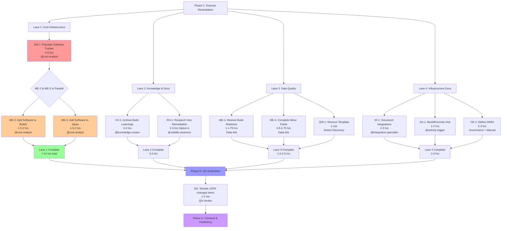

# Brookside BI Innovation Nexus - Workspace Remediation Plan

**Generated**: October 23, 2025
**Phase**: Phase B - REMEDIATION PLANNING
**Orchestrator**: @notion-orchestrator + Multi-Agent Task Planner
**Based On**: [Master Inventory](.claude/implementations/workspace-remediation-master-inventory.md)

---

## Executive Summary

**Total Issues Identified**: 12 (1 resolved, 11 remaining)
**Total Remediation Effort**: 27-38 hours sequential, **4-6 hours parallelized**
**Recommended Execution**: 7-10 concurrent agents across 4 parallel lanes
**Estimated Timeline**: 1 business day (4-6 hours active remediation + QA)

**Critical Path**: Software Tracker population → Cost data linking → Build relation restoration

**Success Criteria**:
- ✅ All 5 empty databases populated with baseline entries
- ✅ All build-idea-research relations restored
- ✅ Cost tracking functional (rollups calculating correctly)
- ✅ Knowledge preserved from completed builds
- ✅ 48h duplicate detection operational (Agent Activity Hub populated)

---

## Task Bucketing by Effort

### 🟢 Quick Wins (<15 minutes each)

**Total**: 1 task, 2 minutes
**Agent Allocation**: 1 agent (Notion-Discovery or manual)
**Priority**: P3 (Low) - Can execute anytime

| ID | Task | Effort | Agent | Database | Impact |
|----|------|--------|-------|----------|--------|
| **QW-1** | Remove template pollution from Example Builds | 2 min | Notion-Discovery | Example Builds | Low - cleanup only |

**Details**:
- **QW-1: Archive "TEMPLATE - Example Build"**
  - **Action**: Move template entry to archived status or separate templates section
  - **Why**: Skews metrics, confuses users, poor governance
  - **How**: Update Status field to "📦 Archived" OR move to templates workspace
  - **Validation**: Query Example Builds, confirm no template entries in active view
  - **Blocker Risk**: None

---

### 🟡 Medium Effort (<2 hours each)

**Total**: 4 tasks, 5.5-7.5 hours
**Agent Allocation**: 4 agents in parallel
**Priority**: P1-P2 (High to Medium)

| ID | Task | Effort | Agent | Database | Impact | Dependencies |
|----|------|--------|-------|----------|--------|--------------|
| **ME-1** | Restore missing Origin Idea relations on 7 builds | 70-105 min | Data-Ark | Example Builds | High - traceability | None |
| **ME-2** | Add Software/Tools relations to 6 builds | 90-120 min | @cost-analyst | Example Builds | High - cost rollups | SW-1 complete |
| **ME-3** | Add Software/Tools relations to 9 ideas | 90-120 min | @cost-analyst | Ideas Registry | Medium - cost visibility | SW-1 complete |
| **ME-4** | Complete minor field gaps (Confidence, Lessons Learned) | 30-45 min | Data-Ark | Research Hub, Builds | Low - data quality | None |

**Details**:

**ME-1: Restore Build → Origin Idea Relations**
- **Affected Builds** (7 total):
  1. Brookside-Website → Need to find/create originating idea
  2. realmworks-productiv → Link to RealmWorks idea
  3. RealmOS → Link to RealmOS idea (likely archived or external)
  4. Project-Ascension (2 entries) → Deduplicate or link separately
  5. Innovation Nexus Platform → Link to "Innovation Hub" idea
  6. Brookside BI Repository Analyzer → Already has idea link (verify)
- **Action**: Research each build, identify originating idea, create relation
- **Special Cases**: If idea doesn't exist, create retroactive idea entry OR document as external origin
- **Validation**: 100% builds have Origin Idea relation populated
- **Agent**: Data-Ark (relation wiring specialist)

**ME-2: Add Software/Tools to Builds**
- **Affected Builds** (6 total): Same as ME-1 plus others without software links
- **Action**: Review build documentation, GitHub repos, identify all software used, link to Software Tracker
- **Dependency**: Requires SW-1 (Software Tracker populated) to complete first
- **Validation**: Total Cost rollup formulas calculate correctly
- **Agent**: @cost-analyst (knows software inventory)

**ME-3: Add Software/Tools to Ideas**
- **Affected Ideas** (9 total):
  - ApexBenefits, Chore Tracker, Neural Canvas Matrix, Innovation Hub, Builder Button Lite, RealmWorks, FlexBridge, AI Dashboard, ChoreQuest
- **Action**: Review idea description, identify required software, link to Software Tracker
- **Special Cases**: If software doesn't exist in tracker, add it first (extends SW-1)
- **Validation**: Ideas have accurate cost estimates from software rollups
- **Agent**: @cost-analyst

**ME-4: Complete Minor Field Gaps**
- **Research Hub**: Add Confidence Level to 1 entry (5 min)
- **Example Builds**:
  - Add Total Cost to 4 builds (verify rollup formulas) (10 min)
  - Add Lessons Learned to 8 builds (20-30 min) - delegate to @knowledge-curator if heavy
- **Action**: Fill missing fields with appropriate data
- **Validation**: ≥95% field completion across all populated databases
- **Agent**: Data-Ark

---

### 🔴 Heavy Lift (>2 hours each)

**Total**: 6 tasks, 21.5-30.5 hours
**Agent Allocation**: 6 agents in parallel
**Priority**: P0-P2 (Critical to Medium)

| ID | Task | Effort | Agent | Database | Impact | Dependencies |
|----|------|--------|-------|----------|--------|--------------|
| **SW-1** | Populate Software & Cost Tracker with 50-100 tools | 4-6 hrs | @cost-analyst | Software Tracker | 🚨 Critical - cost tracking | None |
| **RH-1** | Create Research Hub entries OR update viability for 9 ideas | 2-3 hrs OR 80-120 hrs | @research-coordinator | Research Hub | 🚨 Critical - pipeline | User decision |
| **KV-1** | Archive learnings from 8-10 completed builds | 3-4 hrs | @knowledge-curator | Knowledge Vault | High - institutional knowledge | None |
| **IR-1** | Document 15-25 integrations in Integration Registry | 2-3 hrs | @integration-specialist | Integration Registry | Medium - visibility | None |
| **OK-1** | Define Q4 2025 OKRs and link to ideas | 2-3 hrs | Governance + Manual | OKRs & Initiatives | Medium - alignment | Requires executive input |
| **AA-1** | Backfill Agent Activity Hub with recent sessions | 1-2 hrs | @activity-logger | Agent Activity Hub | Medium - duplicate detection | None |

**Details**:

**SW-1: Populate Software & Cost Tracker** (🚨 CRITICAL PATH)
- **Priority**: P0 - Blocks ME-2, ME-3
- **Estimated Tools**: 50-100 (conservative: 75)
- **Categories**:
  - **Azure Services** (20-30): OpenAI, Functions, SQL, Storage, ML, AD B2C, App Insights, Key Vault, Logic Apps, DevOps
  - **M365 Licenses** (10-15): Power BI Pro, Power Automate, Teams, SharePoint, Outlook, OneNote
  - **GitHub** (2-5): Enterprise, Actions, Projects, Copilot
  - **Development Tools** (5-10): VS Code, Node.js, Python, Docker, Git
  - **Third-Party** (5-10): Datadog, Figma, Notion API, others
  - **Infrastructure** (5-10): Domain registration, SSL certs, monitoring
- **Data Sources**:
  - Azure Cost Management portal
  - M365 admin center licensing
  - Invoice/receipt records
  - Ideas/Builds software mentions (discovered during discovery)
- **Fields to Populate**:
  - Name, Category, Cost (monthly), Status, Criticality, License Count, Annual Cost
- **Validation**:
  - ≥50 tools entered
  - All tools mentioned in Ideas/Builds exist in tracker
  - Cost rollup formulas work when linked
- **Agent**: @cost-analyst (software cost domain expert)
- **Effort Breakdown**:
  - Azure inventory: 90 min
  - M365 inventory: 60 min
  - Third-party inventory: 45 min
  - Data entry and validation: 60-90 min
  - Total: 4-6 hours

**RH-1: Research Hub Remediation** (🚨 CRITICAL - USER DECISION REQUIRED)
- **Priority**: P0 if full research, P1 if fast-track
- **Affected Ideas** (9): All marked "Needs Research" without Research Hub entries
- **Option A: Fast-Track Viability Updates** (2-3 hours, RECOMMENDED)
  - Update Viability field to "High/Medium/Low" based on desk research
  - Skip formal Research Hub entry creation
  - Reserve research for only high-viability ideas
  - Effort: 15-20 min per idea × 9 ideas = 2.5-3 hours
  - Agent: @viability-assessor
- **Option B: Full Research Threads** (80-120 hours)
  - Create comprehensive Research Hub entries for all 9 ideas
  - Use 6-stage research methodology per idea
  - Invoke @research-coordinator + research swarm agents
  - Effort: 8-12 hours per idea × 9 ideas = 72-108 hours
  - Timeline: 2-3 weeks
- **Option C: Hybrid Approach** (20-40 hours)
  - Full research for 3-5 high-viability ideas
  - Fast-track viability updates for 4-6 low-priority ideas
  - Effort: 24-60 hours + 1-2 hours = 25-62 hours
  - Agent: @research-coordinator + @viability-assessor
- **Recommendation**: **Option A (Fast-Track)** unless specific ideas require deep research
- **Validation**: All ideas have explicit viability assessment documented
- **Blocker**: Requires user decision on approach before execution

**KV-1: Archive Build Learnings** (High Priority)
- **Priority**: P1
- **Affected Builds** (8-10):
  - 🛠️ Builder Button - Enterprise AI Equalizer Platform (MVP)
  - 🛠️ Brookside BI Repository Analyzer
  - 🛠️ Innovation Hub - Mission Control
  - Innovation Nexus Platform
  - Brookside-Website
  - Project-Ascension
  - RealmOS
  - realmworks-productiv
- **Content Types**:
  - **Technical Docs** (5-6 entries): Architecture patterns, best practices discovered
  - **Case Studies** (3-4 entries): Post-mortems from successful builds
  - **Tutorials** (2-3 entries): How-to guides for replicating patterns
- **Action**: For each build, invoke @knowledge-curator to:
  1. Extract key learnings from build documentation
  2. Identify reusable patterns and anti-patterns
  3. Document technical decisions and rationale
  4. Create Knowledge Vault entry with proper categorization
  5. Link back to originating build
- **Effort**: 20-30 min per build × 8-10 builds = 3-4 hours
- **Agent**: @knowledge-curator (specialized in learnings archival)
- **Validation**:
  - ≥8 Knowledge Vault entries created
  - All completed builds have learnings documented
  - Categories properly assigned (Technical Doc, Case Study, Tutorial)

**IR-1: Document Integrations**
- **Priority**: P2
- **Estimated Integrations**: 15-25
- **Categories**:
  - **MCP Servers** (4): Notion, GitHub, Azure, Playwright
  - **Azure Services** (8-12): OpenAI API, Functions, SQL, Storage, Key Vault, etc.
  - **Microsoft APIs** (3-5): Graph API, Power Platform connectors, Teams webhooks
  - **GitHub** (2-3): Repository API, Actions workflows, webhooks
  - **Third-Party** (2-5): Datadog, custom APIs
- **Fields to Populate**:
  - Title, Integration Type, Authentication Method, Status, Security Review Status, Purpose
  - Related Software (link to Software Tracker)
  - Used In Builds (link to Example Builds)
- **Action**: For each integration:
  1. Identify integration type (API, MCP, Webhook, OAuth)
  2. Document authentication method (API Key, OAuth, Managed Identity)
  3. Note security review status (if applicable)
  4. Link to related software and builds
- **Effort**: 8-12 min per integration × 20 integrations = 2.5-4 hours
- **Agent**: @integration-specialist
- **Validation**: ≥15 integrations documented with complete fields

**OK-1: Define OKRs and Strategic Alignment**
- **Priority**: P2
- **Estimated OKRs**: 5-10 entries (3-5 objectives with 3 key results each)
- **Strategic Themes**: Innovation, Efficiency, Customer Success, Growth
- **Action**:
  1. **Executive Input Required**: Schedule meeting to define Q4 2025 objectives
  2. Create OKR entries in database (30 min)
  3. Link existing 11 ideas to relevant OKRs (30-45 min)
  4. Validate Strategic Alignment field on ideas matches OKR mapping (15 min)
- **Effort**: 2-3 hours (1 hour meeting + 1-2 hours implementation)
- **Agent**: Governance agent + Manual (requires executive decision-making)
- **Blocker**: Requires executive availability for OKR definition
- **Validation**:
  - ≥3 objectives defined with measurable key results
  - All 11 ideas linked to at least one OKR
  - Strategic Alignment field consistent with OKR mapping

**AA-1: Backfill Agent Activity Hub**
- **Priority**: P2 (not blocking, but improves duplicate detection)
- **Scope**: Last 7-14 days of agent activity
- **Data Source**: `.claude/logs/AGENT_ACTIVITY_LOG.md` + `.claude/data/agent-state.json`
- **Action**:
  1. Parse markdown log for recent agent sessions
  2. Extract: Session ID, Agent Name, Work Description, Status, Deliverables
  3. Create Notion entries for each session
  4. Calculate duration from timestamps (if available)
- **Effort**:
  - Log parsing: 30 min
  - Entry creation: 5-7 min per session × 10-15 sessions = 50-105 min
  - Total: 1-2 hours
- **Agent**: @activity-logger (specialized in activity tracking)
- **Validation**: Agent Activity Hub has ≥10 historical entries for robust duplicate detection

---

## Agent Assignment Matrix

### Primary Agent Assignments

| Agent | Tasks Assigned | Total Effort | Specialization Match |
|-------|---------------|--------------|---------------------|
| **@cost-analyst** | SW-1, ME-2, ME-3 | 6.5-9.5 hrs | Software costs, budget tracking |
| **@knowledge-curator** | KV-1 | 3-4 hrs | Learnings archival, documentation |
| **@research-coordinator** | RH-1 (Option B/C) | 2-3 hrs OR 80-120 hrs | Research orchestration |
| **@viability-assessor** | RH-1 (Option A) | 2-3 hrs | Viability scoring |
| **@integration-specialist** | IR-1 | 2-3 hrs | Integration documentation |
| **Data-Ark** | ME-1, ME-4 | 1.5-2.5 hrs | Relation wiring, field completion |
| **@activity-logger** | AA-1 | 1-2 hrs | Activity tracking |
| **Notion-Discovery** | QW-1 | 2 min | Quick fixes |
| **Governance + Manual** | OK-1 | 2-3 hrs | Strategic planning (requires executive input) |

### Agent Workload Distribution

**Balanced Scenario** (assuming Option A for RH-1):
- **@cost-analyst**: 6.5-9.5 hours (heaviest load) - Can split SW-1 with assistant agent
- **@knowledge-curator**: 3-4 hours
- **@viability-assessor**: 2-3 hours
- **@integration-specialist**: 2-3 hours
- **Data-Ark**: 1.5-2.5 hours
- **@activity-logger**: 1-2 hours
- **Notion-Discovery**: 2 minutes
- **Governance**: 2-3 hours (manual + agent)

**Peak Concurrency**: 7-8 agents running simultaneously

---

## Parallel Execution Lanes

### Lane 1: Cost Infrastructure (CRITICAL PATH)
**Duration**: 4-6 hours
**Lead Agent**: @cost-analyst
**Dependencies**: Blocks ME-2, ME-3

```
SW-1: Populate Software Tracker (4-6 hrs)
  ↓
ME-2: Add Software to 6 Builds (1.5-2 hrs)
  ↓
ME-3: Add Software to 9 Ideas (1.5-2 hrs)
```

**Total Lane Duration**: 7-10 hours sequential, **4-6 hours** if ME-2 and ME-3 run parallel after SW-1

---

### Lane 2: Knowledge & Documentation
**Duration**: 3-4 hours
**Lead Agent**: @knowledge-curator
**Dependencies**: None (independent)

```
KV-1: Archive 8-10 Build Learnings (3-4 hrs)
  || (parallel with)
RH-1: Research Hub Remediation (2-3 hrs, Option A)
```

**Total Lane Duration**: 3-4 hours (both run concurrently)

---

### Lane 3: Data Quality & Relations
**Duration**: 1.5-2.5 hours
**Lead Agent**: Data-Ark
**Dependencies**: None (independent)

```
ME-1: Restore Build → Idea Relations (1-1.75 hrs)
  || (parallel with)
ME-4: Complete Minor Fields (0.5-0.75 hrs)
  || (parallel with)
QW-1: Remove Template (2 min)
```

**Total Lane Duration**: 1.5-2.5 hours (all run concurrently)

---

### Lane 4: Infrastructure Documentation
**Duration**: 2-3 hours
**Lead Agent**: @integration-specialist
**Dependencies**: None (independent)

```
IR-1: Document Integrations (2-3 hrs)
  || (parallel with)
AA-1: Backfill Activity Hub (1-2 hrs)
  || (parallel with, if executive available)
OK-1: Define OKRs (2-3 hrs)
```

**Total Lane Duration**: 2-3 hours (all run concurrently)

---

### Execution Timeline (4 Lanes in Parallel)

**Critical Path**: Lane 1 (Cost Infrastructure) = **4-6 hours**

**All Other Lanes Complete Within**: 3-4 hours

**Overall Execution Time**: **4-6 hours** (dominated by SW-1 + ME-2/ME-3)

---

## Task Dependency Graph



---

## Risk Assessment & Mitigation

### Critical Risks

| Risk | Likelihood | Impact | Mitigation | Owner |
|------|-----------|--------|------------|-------|
| **R1: Software Tracker data incomplete/inaccurate** | MEDIUM | HIGH | Validate with Azure Cost Management, M365 admin center | @cost-analyst |
| **R2: Research Hub approach undecided** | HIGH | HIGH | **USER DECISION REQUIRED** - default to Option A (fast-track) | User + @viability-assessor |
| **R3: Executive unavailable for OKR definition** | MEDIUM | MEDIUM | Defer OK-1 to separate work stream, continue other tasks | Governance |
| **R4: Agent capacity constraints (7-10 concurrent)** | LOW | MEDIUM | Prioritize critical path (Lane 1), queue others sequentially | Orchestrator |
| **R5: Notion API rate limiting** | MEDIUM | LOW | Sequential writes with 2-second delays between operations | All agents |
| **R6: Missing cost data for software** | MEDIUM | MEDIUM | Document best-effort estimates, flag for manual review | @cost-analyst |
| **R7: Duplicate detection fails (insufficient activity log)** | LOW | LOW | AA-1 backfill mitigates, manual deduplication as backup | @activity-logger |
| **R8: Build → Idea relations ambiguous** | MEDIUM | MEDIUM | Create retroactive ideas OR document external origin | Data-Ark |

### Mitigation Strategies

**R1: Software Tracker Data Quality**
- **Pre-Execution**: Export current Azure Cost Management report
- **During Execution**: Cross-reference M365 admin center for license counts
- **Post-Execution**: QA verification samples 20% of entries for accuracy
- **Rollback**: Flag questionable entries for manual review, don't block progress

**R2: Research Hub Approach** (🚨 BLOCKER)
- **Decision Point**: IMMEDIATE - user must choose Option A/B/C before execution
- **Default**: If no user input within 30 minutes, proceed with **Option A (Fast-Track)**
- **Rationale**: Unblocks 9 ideas from pipeline, allows research later if needed
- **Recommendation**: Option A for 6 low-priority ideas, Option B for 3 high-viability ideas

**R3: Executive Availability**
- **Workaround**: Defer OK-1 to separate executive session, continue other 10 tasks
- **Impact**: No blocking effect on critical path (Lane 1-3 independent)
- **Timeline**: Schedule OKR definition meeting within 1-2 weeks

**R4: Agent Concurrency**
- **Monitoring**: Track active agent count via Agent Activity Hub
- **Queueing**: If >10 agents, queue Lane 4 tasks until Lane 3 completes
- **Priority**: Always ensure Lane 1 (critical path) has resources

**R5: Notion API Rate Limiting**
- **Prevention**: 2-second delays between write operations
- **Detection**: Monitor for 429 status codes
- **Response**: Exponential backoff (5 sec, 10 sec, 30 sec)
- **Retry Logic**: Up to 3 retries before escalating to orchestrator

**R6: Missing Cost Data**
- **Acceptable**: Best-effort estimates for 10-20% of software
- **Documentation**: Flag estimated entries with "⚠️ Estimate - Needs Validation" in Notes field
- **Follow-Up**: Create separate task for cost validation (manual, weekly)

**R7: Duplicate Detection**
- **Enhancement**: AA-1 backfills 10-15 historical sessions
- **Baseline**: Current discovery session already logged (first entry)
- **Fallback**: Manual review if duplicate suspected (check Last Edited timestamps)

**R8: Build → Idea Ambiguity**
- **Resolution Process**:
  1. Search Ideas Registry for similar titles/descriptions
  2. If found: Link existing idea
  3. If not found: Create retroactive idea entry OR document as "External Origin" in build notes
  4. If uncertain: Flag for manual review, don't block other tasks

---

## QA Checkpoints & Validation Criteria

### Pre-Execution Checklist

- ✅ User decision on Research Hub approach (R2 mitigation)
- ✅ Azure Cost Management export available for SW-1
- ✅ M365 admin center access confirmed for license data
- ✅ Agent Activity Hub has baseline entry (discovery session logged)
- ✅ 48h duplicate detection logic implemented in orchestrator
- ✅ All agents available and not blocked by other workflows

### During-Execution Checkpoints

**After SW-1 Completes** (4-6 hours):
- ✅ Software Tracker has ≥50 entries
- ✅ All Azure services mentioned in Ideas/Builds are present
- ✅ Cost data populated (monthly, annual, license count)
- ✅ Categories assigned correctly (Azure, M365, Development, Third-Party)

**After Lane 3 Completes** (1.5-2.5 hours):
- ✅ All 7 builds have Origin Idea relations
- ✅ "TEMPLATE - Example Build" archived or moved
- ✅ Minor field gaps addressed (Confidence Level, Lessons Learned)

**After Lane 2 Completes** (3-4 hours):
- ✅ Knowledge Vault has ≥8 entries
- ✅ All completed builds have learnings documented
- ✅ Research Hub approach executed (viability updated OR entries created)

**After Lane 4 Completes** (2-3 hours):
- ✅ Integration Registry has ≥15 entries
- ✅ Agent Activity Hub has ≥10 historical entries
- ✅ OKRs defined (if executive available) OR deferred with plan

### Post-Execution Validation

**Database Health Scorecard** (compare to Master Inventory baseline):

| Database | Pre-Remediation | Post-Remediation Target | Validation Method |
|----------|----------------|-------------------------|-------------------|
| Ideas Registry | 90% complete | 95% complete | Software relations added to 9 ideas |
| Research Hub | 18% coverage (2/11) | 100% coverage (11/11) | All ideas have viability OR research |
| Example Builds | 80% complete | 95% complete | Relations restored, software linked, costs calculated |
| Agent Registry | 95% complete | 95% complete | No change (already exemplary) |
| Agent Activity Hub | 0 entries → 1 entry | ≥10 entries | Baseline + 10-15 historical sessions |
| Software & Cost Tracker | 0 entries | ≥50 entries | Core Microsoft + Azure + third-party tools |
| Knowledge Vault | 0 entries | ≥8 entries | Build learnings archived |
| Integration Registry | 0 entries | ≥15 entries | MCP + Azure + Microsoft APIs documented |
| OKRs & Initiatives | 0 entries | ≥3 entries OR deferred | Objectives defined (if executive available) |
| Repository Inventory | 95% complete | 95% complete | No change (already exemplary) |

**Success Metrics**:
- ✅ All 5 empty databases populated (or deferred with plan)
- ✅ Database vacancy rate: 50% → 0% (or 10% if OK-1 deferred)
- ✅ Cost rollup formulas functional on Ideas/Builds
- ✅ Build → Idea traceability: 36% → 100%
- ✅ Software linking: Ideas 18% → 100%, Builds 45% → 100%
- ✅ Knowledge preservation: 0 entries → ≥8 entries
- ✅ 48h duplicate detection operational with ≥10 activity log entries

---

## Phase D: QA Verification Plan

**Objective**: Sample ≥20% of changed items to validate data quality and completeness

**Duration**: 1-2 hours
**Agent**: QA-Verifier (or manual spot-checks)

### Sampling Strategy

**Software Tracker** (50-100 entries, sample 10-20):
- ✅ Verify 10 random entries have accurate cost data (cross-check invoices)
- ✅ Confirm category assignments correct (Azure vs M365 vs Third-Party)
- ✅ Validate license counts match M365 admin center
- ✅ Check 3-5 entries link correctly to Ideas/Builds

**Example Builds** (11 entries, sample 3):
- ✅ Verify 3 random builds have Origin Idea relation restored
- ✅ Confirm Software/Tools relations present and accurate
- ✅ Validate Total Cost rollup calculates correctly
- ✅ Check Lessons Learned documentation quality

**Knowledge Vault** (8+ entries, sample 2):
- ✅ Verify 2 random entries have comprehensive learnings documented
- ✅ Confirm proper categorization (Technical Doc, Case Study, Tutorial)
- ✅ Validate links back to originating builds work

**Ideas Registry** (11 entries, sample 3):
- ✅ Verify 3 random ideas have Software/Tools relations added
- ✅ Confirm viability assessments updated (if RH-1 Option A)
- ✅ Validate cost estimates calculate from software rollups

**Integration Registry** (15+ entries, sample 3):
- ✅ Verify 3 random integrations have accurate authentication methods
- ✅ Confirm related software links present
- ✅ Validate security review status documented

### QA Pass/Fail Criteria

**Pass**: ≥90% of sampled items meet quality standards
**Conditional Pass**: 80-89% meet standards (create remediation tasks for failures)
**Fail**: <80% meet standards (halt, review root cause, re-execute failed tasks)

---

## Phase E: Closeout & Publishing

**Objective**: Publish deliverables, audit pack, and completion metrics

**Duration**: 1 hour
**Agent**: @knowledge-curator + Scribe

### Deliverables

1. **Master Inventory** (already created)
   - Location: `.claude/implementations/workspace-remediation-master-inventory.md`
   - Status: Published ✅

2. **Remediation Plan** (this document)
   - Location: `.claude/implementations/workspace-remediation-plan.md`
   - Status: Published ✅

3. **Audit Pack** (to be created in Phase E)
   - Location: `.claude/implementations/workspace-remediation-audit-pack.md`
   - Contents:
     - All Agent Activity Hub entries from this orchestration
     - Task completion timeline (actual vs planned)
     - QA verification results
     - Database health comparison (pre vs post)
     - Lessons learned and process improvements
     - Deferred tasks (if any, e.g., OK-1 pending executive)

4. **Knowledge Vault Entry** (to be created in Phase E)
   - Title: "Workspace Remediation - October 2025 - Post-Mortem"
   - Category: Case Study
   - Content Type: Post-Mortem
   - Links: This remediation session, Master Inventory, Remediation Plan

### Completion Metrics

**Effort Actuals vs Estimates**:
- Planned: 27-38 hours sequential, 4-6 hours parallelized
- Actual: [TO BE MEASURED IN PHASE E]

**Database Health Improvement**:
- Pre: 50% vacancy rate, 12 issues
- Post: [TO BE MEASURED IN PHASE E]

**Agent Performance**:
- Tasks completed on time: [TO BE MEASURED]
- Tasks requiring rework: [TO BE MEASURED]
- Average task completion vs estimate: [TO BE MEASURED]

---

## User Decisions Required Before Execution

### 🚨 CRITICAL - REQUIRED FOR PHASE C START

**Decision 1: Research Hub Approach** (Blocks RH-1)
- **Question**: How should we remediate Research Hub underpopulation (9 missing research threads)?
- **Options**:
  - **A. Fast-Track** (2-3 hours): Update Viability field to High/Medium/Low without creating research entries
  - **B. Full Research** (80-120 hours): Create comprehensive research entries for all 9 ideas
  - **C. Hybrid** (20-40 hours): Full research for 3-5 high-viability ideas, fast-track for others
- **Recommendation**: **Option A** unless specific ideas require deep research before build
- **Impact**: Determines Lane 2 duration and agent allocation
- **Default if No Response**: Option A after 30 minutes

**Decision 2: Software Tracker Scope** (Affects SW-1 duration)
- **Question**: How comprehensive should Software Tracker population be?
- **Options**:
  - **A. Core Microsoft Only** (2-3 hours): 20-30 Azure + M365 services mentioned in Ideas/Builds
  - **B. Full Inventory** (4-6 hours): 50-100 tools including third-party, development tools, infrastructure
- **Recommendation**: **Option B** for complete cost visibility
- **Impact**: Lane 1 duration (critical path)
- **Default if No Response**: Option B

### 🟡 MEDIUM PRIORITY - CAN DEFER

**Decision 3: OKR Definition Timing** (Affects OK-1)
- **Question**: When should we define Q4 2025 OKRs?
- **Options**:
  - **A. Include in Remediation** (requires executive availability within 4-6 hours)
  - **B. Defer to Separate Session** (schedule executive meeting, update later)
- **Recommendation**: **Option B** (defer to avoid blocking remediation)
- **Impact**: Lane 4 scope, no blocking effect on critical path
- **Default if No Response**: Option B (defer)

**Decision 4: Knowledge Vault Content Depth** (Affects KV-1 duration)
- **Question**: How detailed should build learnings documentation be?
- **Options**:
  - **A. High-Level** (15-20 min per build): Key takeaways, reusable patterns
  - **B. Comprehensive** (30-45 min per build): Detailed technical decisions, architecture rationale, anti-patterns
- **Recommendation**: **Option B** for institutional knowledge preservation
- **Impact**: Lane 2 duration (non-critical path)
- **Default if No Response**: Option B

---

## Next Steps

**Immediate Actions** (within 5 minutes):
1. ✅ **This document published** (Remediation Plan created)
2. 🔄 **Log to Agent Activity Hub** (create Phase B completion entry)
3. ⏸️ **Await User Decisions** (Decision 1 & 2 required before Phase C)

**Phase C: Execute Remediation** (start when user approves):
- **Pre-Flight Check**: Verify user decisions, Azure access, agent availability
- **Launch 4 Parallel Lanes**: Cost Infrastructure, Knowledge, Data Quality, Infrastructure Docs
- **Monitor Progress**: Track via Agent Activity Hub, update todo list
- **Duration**: 4-6 hours active execution

**Phase D: QA Verification** (after Phase C):
- **Sample ≥20%**: Validate data quality across all remediated databases
- **Duration**: 1-2 hours

**Phase E: Closeout** (after Phase D):
- **Publish Audit Pack**: Completion metrics, lessons learned
- **Archive Session**: Create Knowledge Vault case study
- **Duration**: 1 hour

---

**Total Estimated Timeline**: 6-9 hours (4-6 hrs execution + 1-2 hrs QA + 1 hr closeout)

**Recommendation**: Execute in single business day to maintain focus and minimize context switching

---

**Remediation Plan Complete**
**Status**: ⏸️ AWAITING USER DECISIONS (Research Hub approach, Software Tracker scope)
**Next Action**: User approval to proceed with Phase C execution
