```mermaid
flowchart TD
    A[Orchestrator] --> B{Distribute<br/>Tasks}

    B --> C[Agent A:<br/>Brand Review]
    B --> D[Agent B:<br/>Legal Review]
    B --> E[Agent C:<br/>Tech Review]

    C --> F[Result A:<br/>Score 91/100]
    D --> G[Result B:<br/>Approved]
    E --> H[Result C:<br/>Verified]

    F --> I[Aggregator]
    G --> I
    H --> I

    I --> J{Decision<br/>Logic}

    J -->|All Pass| K[✅ Approved]
    J -->|Any Fail| L[❌ Rejected]
    J -->|Mixed| M[⚠️ Needs Work]

    style A fill:#3B82F6,color:#fff
    style I fill:#F59E0B,color:#fff
    style K fill:#10B981,color:#fff
    style L fill:#EF4444,color:#fff
```

# AI Orchestration Patterns

**Version**: 1.0.0
**Extracted from**: Blog Publishing Quality Gate System
**Last Updated**: 2025-10-28

---

## Overview

Establish systematic multi-agent coordination infrastructure to execute complex workflows requiring specialized expertise, parallel validation, and sequential dependencies. This pattern drives measurable outcomes by enabling quality gates (>90% approval rates), collaborative decision-making, and resilient failure handling across AI agent teams.

**Best for**: Organizations executing quality assurance workflows, content validation pipelines, multi-perspective analysis, or any process requiring coordinated expertise from specialized AI agents with clear accountability and traceability.

---

## Problem Statement

Complex workflows often require multiple specialized perspectives that cannot be provided by a single agent:

- **Expertise Limitations**: No single AI agent can master all domains (brand voice, legal compliance, technical accuracy)
- **Sequential Dependencies**: Some validation steps must complete before others can begin
- **Parallel Efficiency**: Independent validations should run concurrently to minimize latency
- **Decision Synthesis**: Multiple agent outputs must be aggregated into actionable decisions
- **Context Sharing**: Agents need shared context but isolated execution environments
- **Failure Isolation**: One agent failure should not cascade to unrelated validations

**Traditional Approach Issues**:
- ❌ Single monolithic agent (jack-of-all-trades, master of none)
- ❌ Sequential execution only (slow, inefficient)
- ❌ No clear ownership (accountability gaps)
- ❌ Hard-coded agent selection (inflexible)
- ❌ Cascading failures (one agent blocks all)

**This Pattern Provides**:
- ✅ Specialized agents with clear responsibilities
- ✅ Parallel execution for independent validations
- ✅ Sequential coordination for dependent steps
- ✅ Aggregated decision-making with transparency
- ✅ Context sharing without coupling
- ✅ Graceful degradation on partial failures

---

## Pattern Structure

### High-Level Architecture


---

## Core Patterns

### Pattern 1: Sequential Orchestration (Waterfall)

Establish linear workflow where each phase must complete before the next begins.

#### When to Use

- **Clear Dependencies**: Phase B requires Phase A output
- **Risk Reduction**: Early validation prevents wasted downstream work
- **Progressive Quality**: Each phase adds quality layer
- **Audit Trail**: Linear progression simplifies tracking

#### Structure


#### Implementation

```typescript
interface SequentialOrchestrator {
  phases: Array<WorkflowPhase>;
  context: SharedContext;
}

interface WorkflowPhase {
  name: string;
  agent: string; // Agent identifier (e.g., "@validation-specialist")
  execute: (input: any, context: SharedContext) => Promise<PhaseResult>;
  requiredInputs: Array<string>; // Keys from context
  outputKeys: Array<string>; // Keys written to context
  timeout: number; // Max execution time (seconds)
  optional: boolean; // If true, failure doesn't block workflow
}

interface PhaseResult {
  status: 'success' | 'failed' | 'blocked';
  duration: number; // seconds
  outputs: Record<string, any>; // Written to context
  errors?: Array<string>;
  recommendations?: Array<string>;
}

async function executeSequentialWorkflow(
  orchestrator: SequentialOrchestrator,
  initialInput: any
): Promise<WorkflowResult> {
  const results: Array<PhaseResult> = [];
  const context = { ...orchestrator.context, ...initialInput };

  for (const phase of orchestrator.phases) {
    console.log(`\n🔄 Executing Phase: ${phase.name}`);
    console.log(`   Agent: ${phase.agent}`);

    // Verify required inputs present
    const missingInputs = phase.requiredInputs.filter(key => !(key in context));
    if (missingInputs.length > 0) {
      const error = `Missing required inputs: ${missingInputs.join(', ')}`;
      console.error(`❌ ${error}`);

      if (!phase.optional) {
        return {
          status: 'blocked',
          completedPhases: results.length,
          totalPhases: orchestrator.phases.length,
          error,
          context
        };
      }

      // Optional phase, skip with warning
      console.warn(`⚠️  Skipping optional phase due to missing inputs`);
      continue;
    }

    // Execute phase with timeout
    try {
      const phaseStartTime = Date.now();
      const phaseResult = await Promise.race([
        phase.execute(context, context),
        timeoutPromise(phase.timeout, `Phase ${phase.name} timeout`)
      ]);

      phaseResult.duration = (Date.now() - phaseStartTime) / 1000;
      results.push(phaseResult);

      // Write outputs to context
      Object.assign(context, phaseResult.outputs);

      console.log(`✅ Phase complete (${phaseResult.duration.toFixed(1)}s)`);

      // Check if phase blocked workflow
      if (phaseResult.status === 'blocked' && !phase.optional) {
        console.error(`❌ Workflow blocked by phase: ${phase.name}`);
        return {
          status: 'blocked',
          completedPhases: results.length,
          totalPhases: orchestrator.phases.length,
          blockingPhase: phase.name,
          error: phaseResult.errors?.[0] || 'Phase blocked workflow',
          context,
          phaseResults: results
        };
      }

    } catch (error) {
      console.error(`❌ Phase failed: ${error.message}`);

      if (!phase.optional) {
        return {
          status: 'failed',
          completedPhases: results.length,
          totalPhases: orchestrator.phases.length,
          failedPhase: phase.name,
          error: error.message,
          context,
          phaseResults: results
        };
      }

      // Optional phase failed, continue with warning
      console.warn(`⚠️  Optional phase failed, continuing workflow`);
    }
  }

  // All phases completed
  return {
    status: 'success',
    completedPhases: results.length,
    totalPhases: orchestrator.phases.length,
    context,
    phaseResults: results,
    totalDuration: results.reduce((sum, r) => sum + r.duration, 0)
  };
}
```

#### Example: Blog Publishing Pipeline

```typescript
const blogPublishingPipeline: SequentialOrchestrator = {
  context: {
    workspaceId: '81686779-099a-8195-b49e-00037e25c23e',
    publishMode: 'draft'
  },
  phases: [
    {
      name: 'Content Validation',
      agent: '@notion-mcp-specialist',
      execute: async (input, context) => {
        // Verify required fields exist
        const validation = await validateNotionPage(input.notionPageId);
        return {
          status: validation.allFieldsPresent ? 'success' : 'blocked',
          duration: 0,
          outputs: {
            validationReport: validation,
            requiredFieldsPresent: validation.allFieldsPresent
          },
          errors: validation.missingFields.map(f => `Missing field: ${f}`)
        };
      },
      requiredInputs: ['notionPageId'],
      outputKeys: ['validationReport', 'requiredFieldsPresent'],
      timeout: 120,
      optional: false
    },
    {
      name: 'Quality Gate Reviews',
      agent: '@content-quality-orchestrator',
      execute: async (input, context) => {
        // Coordinate parallel reviews (see Pattern 2)
        const reviews = await coordinateQualityGates(context.notionPageId);
        return {
          status: reviews.approved ? 'success' : 'blocked',
          duration: 0,
          outputs: {
            brandScore: reviews.brandScore,
            legalApproved: reviews.legalApproved,
            technicalVerified: reviews.technicalVerified,
            overallApproval: reviews.approved
          },
          recommendations: reviews.recommendations
        };
      },
      requiredInputs: ['notionPageId', 'requiredFieldsPresent'],
      outputKeys: ['brandScore', 'legalApproved', 'technicalVerified', 'overallApproval'],
      timeout: 300,
      optional: false
    },
    {
      name: 'Content Transformation',
      agent: '@notion-content-parser',
      execute: async (input, context) => {
        // Convert Notion → HTML
        const html = await transformNotionToHTML(context.notionPageId);
        return {
          status: 'success',
          duration: 0,
          outputs: {
            htmlContent: html,
            wordCount: html.split(' ').length
          }
        };
      },
      requiredInputs: ['notionPageId', 'overallApproval'],
      outputKeys: ['htmlContent', 'wordCount'],
      timeout: 120,
      optional: false
    },
    {
      name: 'Asset Optimization',
      agent: '@asset-migration-handler',
      execute: async (input, context) => {
        // Optimize images, upload to CDN
        const assets = await optimizeAndUploadAssets(context.notionPageId);
        return {
          status: 'success',
          duration: 0,
          outputs: {
            optimizedAssets: assets,
            cdnUrls: assets.map(a => a.cdnUrl)
          }
        };
      },
      requiredInputs: ['notionPageId'],
      outputKeys: ['optimizedAssets', 'cdnUrls'],
      timeout: 180,
      optional: true // If no images, skip gracefully
    },
    {
      name: 'Webflow Publishing',
      agent: '@webflow-api-specialist',
      execute: async (input, context) => {
        // Publish to Webflow CMS
        const published = await publishToWebflow({
          title: context.validationReport.title,
          content: context.htmlContent,
          images: context.cdnUrls,
          publishMode: context.publishMode
        });
        return {
          status: 'success',
          duration: 0,
          outputs: {
            webflowItemId: published.itemId,
            publicUrl: published.url
          }
        };
      },
      requiredInputs: ['htmlContent', 'overallApproval'],
      outputKeys: ['webflowItemId', 'publicUrl'],
      timeout: 120,
      optional: false
    },
    {
      name: 'Cache Invalidation',
      agent: '@web-content-sync',
      execute: async (input, context) => {
        // Invalidate Redis + CDN
        await invalidateCache({
          cacheKeys: ['blog:list', `blog:${context.webflowItemId}`],
          cdnPaths: ['/blog', `/blog/${context.slug}`]
        });
        return {
          status: 'success',
          duration: 0,
          outputs: {
            cacheInvalidated: true
          }
        };
      },
      requiredInputs: ['webflowItemId'],
      outputKeys: ['cacheInvalidated'],
      timeout: 60,
      optional: true // Not a blocker if cache invalidation fails
    },
    {
      name: 'Verification',
      agent: 'internal',
      execute: async (input, context) => {
        // Verify URL accessible, SEO valid
        const verification = await verifyPublishedContent(context.publicUrl);
        return {
          status: verification.accessible ? 'success' : 'failed',
          duration: 0,
          outputs: {
            verified: verification.accessible,
            pageLoadTime: verification.loadTime,
            seoValid: verification.seoMetadataValid
          }
        };
      },
      requiredInputs: ['publicUrl'],
      outputKeys: ['verified', 'pageLoadTime', 'seoValid'],
      timeout: 30,
      optional: true
    }
  ]
};
```

---

### Pattern 2: Parallel Orchestration (Fan-Out/Fan-In)

Establish concurrent execution of independent tasks followed by result aggregation.

#### When to Use

- **Independent Tasks**: No dependencies between tasks
- **Speed Optimization**: Reduce latency through parallelism
- **Multi-Perspective Analysis**: Gather diverse expert opinions
- **Resource Efficiency**: Maximize throughput

#### Structure



#### Implementation

```typescript
interface ParallelOrchestrator {
  tasks: Array<ParallelTask>;
  aggregationStrategy: AggregationStrategy;
  context: SharedContext;
}

interface ParallelTask {
  name: string;
  agent: string;
  execute: (input: any, context: SharedContext) => Promise<TaskResult>;
  timeout: number;
  weight: number; // Importance weighting for aggregation (0-1)
  required: boolean; // If true, failure blocks workflow
}

interface TaskResult {
  taskName: string;
  agent: string;
  status: 'success' | 'failed';
  duration: number;
  score?: number; // 0-100 (if applicable)
  approved?: boolean;
  outputs: Record<string, any>;
  recommendations?: Array<string>;
  errors?: Array<string>;
}

type AggregationStrategy =
  | 'unanimous' // All tasks must approve
  | 'majority' // >50% must approve
  | 'weighted' // Weighted average score
  | 'threshold'; // Aggregate score must exceed threshold

async function executeParallelWorkflow(
  orchestrator: ParallelOrchestrator,
  input: any
): Promise<AggregatedResult> {
  console.log(`\n🚀 Starting parallel execution (${orchestrator.tasks.length} tasks)`);

  const context = { ...orchestrator.context, ...input };
  const taskStartTime = Date.now();

  // Execute all tasks concurrently
  const taskPromises = orchestrator.tasks.map(task =>
    executeTaskWithTimeout(task, context)
      .catch(error => ({
        taskName: task.name,
        agent: task.agent,
        status: 'failed' as const,
        duration: (Date.now() - taskStartTime) / 1000,
        outputs: {},
        errors: [error.message]
      }))
  );

  const results = await Promise.all(taskPromises);

  // Check for required task failures
  const failedRequiredTasks = results.filter(
    (result, idx) =>
      result.status === 'failed' && orchestrator.tasks[idx].required
  );

  if (failedRequiredTasks.length > 0) {
    return {
      status: 'blocked',
      results,
      aggregatedScore: 0,
      approved: false,
      error: `Required tasks failed: ${failedRequiredTasks.map(t => t.taskName).join(', ')}`,
      totalDuration: (Date.now() - taskStartTime) / 1000
    };
  }

  // Aggregate results based on strategy
  const aggregation = aggregateResults(results, orchestrator);

  console.log(`\n✅ Parallel execution complete (${aggregation.totalDuration.toFixed(1)}s)`);
  console.log(`   Aggregated Score: ${aggregation.aggregatedScore}/100`);
  console.log(`   Approval: ${aggregation.approved ? '✅ Yes' : '❌ No'}`);

  return aggregation;
}

async function executeTaskWithTimeout(
  task: ParallelTask,
  context: SharedContext
): Promise<TaskResult> {
  console.log(`   ⏳ Starting: ${task.name} (@${task.agent})`);

  const taskStartTime = Date.now();

  try {
    const result = await Promise.race([
      task.execute(context, context),
      timeoutPromise(task.timeout, `Task ${task.name} timeout`)
    ]);

    result.duration = (Date.now() - taskStartTime) / 1000;
    result.taskName = task.name;
    result.agent = task.agent;

    console.log(`   ✅ Complete: ${task.name} (${result.duration.toFixed(1)}s)`);
    return result;

  } catch (error) {
    const duration = (Date.now() - taskStartTime) / 1000;
    console.error(`   ❌ Failed: ${task.name} (${duration.toFixed(1)}s) - ${error.message}`);
    throw error;
  }
}

function aggregateResults(
  results: Array<TaskResult>,
  orchestrator: ParallelOrchestrator
): AggregatedResult {
  const totalDuration = Math.max(...results.map(r => r.duration));

  switch (orchestrator.aggregationStrategy) {
    case 'unanimous':
      // All tasks must approve
      const allApproved = results.every(r => r.approved === true);
      return {
        status: allApproved ? 'approved' : 'rejected',
        results,
        aggregatedScore: allApproved ? 100 : 0,
        approved: allApproved,
        totalDuration
      };

    case 'majority':
      // >50% must approve
      const approvedCount = results.filter(r => r.approved === true).length;
      const majority = approvedCount > results.length / 2;
      return {
        status: majority ? 'approved' : 'rejected',
        results,
        aggregatedScore: (approvedCount / results.length) * 100,
        approved: majority,
        totalDuration
      };

    case 'weighted':
      // Weighted average of scores
      const weightedSum = results.reduce((sum, result, idx) => {
        const weight = orchestrator.tasks[idx].weight;
        const score = result.score || (result.approved ? 100 : 0);
        return sum + (score * weight);
      }, 0);

      const totalWeight = orchestrator.tasks.reduce((sum, task) => sum + task.weight, 0);
      const weightedScore = weightedSum / totalWeight;

      return {
        status: weightedScore >= 80 ? 'approved' : 'rejected',
        results,
        aggregatedScore: weightedScore,
        approved: weightedScore >= 80,
        totalDuration
      };

    case 'threshold':
      // Simple average must exceed threshold (default: 80)
      const avgScore = results.reduce((sum, r) => sum + (r.score || 0), 0) / results.length;
      return {
        status: avgScore >= 80 ? 'approved' : 'rejected',
        results,
        aggregatedScore: avgScore,
        approved: avgScore >= 80,
        totalDuration
      };

    default:
      throw new Error(`Unknown aggregation strategy: ${orchestrator.aggregationStrategy}`);
  }
}
```

#### Example: Content Quality Gates

```typescript
const qualityGateOrchestrator: ParallelOrchestrator = {
  context: {
    notionPageId: 'abc123...',
    contentType: 'financial-analysis'
  },
  aggregationStrategy: 'weighted', // Different weights for different gates
  tasks: [
    {
      name: 'Brand Voice Compliance',
      agent: '@blog-tone-guardian',
      execute: async (input, context) => {
        const brandScore = await evaluateBrandVoice(context.notionPageId);
        return {
          status: 'success',
          duration: 0,
          score: brandScore.score,
          approved: brandScore.score >= 80,
          outputs: {
            brandScore: brandScore.score,
            violations: brandScore.violations,
            recommendations: brandScore.recommendations
          },
          recommendations: brandScore.recommendations
        };
      },
      timeout: 120,
      weight: 0.4, // 40% of overall score
      required: true
    },
    {
      name: 'Legal/Compliance Review',
      agent: '@financial-compliance-analyst',
      execute: async (input, context) => {
        const legalReview = await reviewLegalCompliance(context.notionPageId);
        return {
          status: 'success',
          duration: 0,
          approved: legalReview.approved,
          outputs: {
            legalApproved: legalReview.approved,
            disclaimersPresent: legalReview.disclaimersPresent,
            riskDisclosuresAdequate: legalReview.riskDisclosuresAdequate
          },
          recommendations: legalReview.recommendations,
          errors: legalReview.violations
        };
      },
      timeout: 120,
      weight: 0.4, // 40% of overall score (critical for financial content)
      required: true // Legal approval is mandatory
    },
    {
      name: 'Technical Accuracy Verification',
      agent: '@financial-equity-analyst',
      execute: async (input, context) => {
        const technicalReview = await verifyTechnicalAccuracy(context.notionPageId);
        return {
          status: 'success',
          duration: 0,
          approved: technicalReview.verified,
          outputs: {
            technicalVerified: technicalReview.verified,
            factualErrors: technicalReview.errors,
            dataSourcesValid: technicalReview.dataSourcesValid
          },
          recommendations: technicalReview.recommendations,
          errors: technicalReview.errors
        };
      },
      timeout: 180,
      weight: 0.2, // 20% of overall score
      required: false // Not a blocker, but recommended
    }
  ]
};

// Execute quality gates
const qualityResult = await executeParallelWorkflow(qualityGateOrchestrator, {
  notionPageId: 'abc123...'
});

if (qualityResult.approved) {
  console.log('✅ All quality gates passed - Proceed to publishing');
} else {
  console.log('❌ Quality gates failed - Return to author');
  console.log(`Recommendations:\n${qualityResult.results.map(r => r.recommendations).flat().join('\n')}`);
}
```

---

### Pattern 3: Hybrid Orchestration (Sequential + Parallel)

Establish workflows combining sequential phases with parallel tasks within phases.

#### When to Use

- **Complex Workflows**: Multiple validation layers with independent checks
- **Optimized Execution**: Maximize parallelism while respecting dependencies
- **Quality Assurance**: Progressive quality layers with multi-perspective gates

#### Structure


#### Implementation

```typescript
interface HybridOrchestrator {
  phases: Array<HybridPhase>;
  context: SharedContext;
}

type HybridPhase =
  | { type: 'sequential'; phase: WorkflowPhase }
  | { type: 'parallel'; orchestrator: ParallelOrchestrator };

async function executeHybridWorkflow(
  orchestrator: HybridOrchestrator,
  initialInput: any
): Promise<WorkflowResult> {
  const context = { ...orchestrator.context, ...initialInput };
  const phaseResults: Array<any> = [];

  for (const hybridPhase of orchestrator.phases) {
    if (hybridPhase.type === 'sequential') {
      // Execute single phase
      const phase = hybridPhase.phase;
      console.log(`\n🔄 Sequential Phase: ${phase.name}`);

      const result = await phase.execute(context, context);
      Object.assign(context, result.outputs);
      phaseResults.push(result);

      if (result.status === 'blocked') {
        return {
          status: 'blocked',
          context,
          phaseResults,
          error: `Blocked by phase: ${phase.name}`
        };
      }

    } else {
      // Execute parallel orchestrator
      console.log(`\n🚀 Parallel Phase: Quality Gates`);

      const parallelResult = await executeParallelWorkflow(
        hybridPhase.orchestrator,
        context
      );

      Object.assign(context, {
        parallelApproved: parallelResult.approved,
        parallelScore: parallelResult.aggregatedScore
      });

      phaseResults.push(parallelResult);

      if (!parallelResult.approved) {
        return {
          status: 'rejected',
          context,
          phaseResults,
          error: 'Quality gates rejected'
        };
      }
    }
  }

  return {
    status: 'success',
    context,
    phaseResults
  };
}
```

#### Example: Full Publishing Pipeline

```typescript
const fullPublishingPipeline: HybridOrchestrator = {
  context: {
    workspaceId: '81686779-099a-8195-b49e-00037e25c23e'
  },
  phases: [
    // Phase 1: Sequential validation
    {
      type: 'sequential',
      phase: {
        name: 'Content Validation',
        agent: '@notion-mcp-specialist',
        execute: validateContentFields,
        requiredInputs: ['notionPageId'],
        outputKeys: ['validationPassed'],
        timeout: 120,
        optional: false
      }
    },
    // Phase 2: Parallel quality gates
    {
      type: 'parallel',
      orchestrator: qualityGateOrchestrator // From Pattern 2 example
    },
    // Phase 3: Sequential transformation
    {
      type: 'sequential',
      phase: {
        name: 'Content Transformation',
        agent: '@notion-content-parser',
        execute: transformToHTML,
        requiredInputs: ['notionPageId', 'parallelApproved'],
        outputKeys: ['htmlContent'],
        timeout: 120,
        optional: false
      }
    },
    // Phase 4: Sequential publishing
    {
      type: 'sequential',
      phase: {
        name: 'Webflow Publishing',
        agent: '@webflow-api-specialist',
        execute: publishToWebflow,
        requiredInputs: ['htmlContent'],
        outputKeys: ['publicUrl'],
        timeout: 120,
        optional: false
      }
    }
  ]
};
```

---

### Pattern 4: Context Sharing with Isolation

Establish shared state management that enables agent collaboration without tight coupling.

#### When to Use

- **Collaborative Workflows**: Agents need access to previous outputs
- **Loose Coupling**: Agents should not directly invoke each other
- **State Persistence**: Workflow state must survive failures
- **Audit Trail**: Full execution history required

#### Structure


#### Implementation

```typescript
class SharedContext {
  private state: Record<string, any> = {};
  private history: Array<ContextWrite> = [];
  private workflowId: string;

  constructor(workflowId: string, initialState: Record<string, any> = {}) {
    this.workflowId = workflowId;
    this.state = { ...initialState };
  }

  // Read value from context
  read<T>(key: string): T | undefined {
    return this.state[key] as T;
  }

  // Read multiple values
  readMany<T>(keys: Array<string>): Record<string, T> {
    const result: Record<string, T> = {};
    for (const key of keys) {
      result[key] = this.state[key] as T;
    }
    return result;
  }

  // Write value to context with audit trail
  write(key: string, value: any, agent: string): void {
    const previousValue = this.state[key];
    this.state[key] = value;

    // Record write for audit trail
    this.history.push({
      timestamp: new Date().toISOString(),
      agent,
      key,
      previousValue,
      newValue: value
    });
  }

  // Write multiple values
  writeMany(updates: Record<string, any>, agent: string): void {
    for (const [key, value] of Object.entries(updates)) {
      this.write(key, value, agent);
    }
  }

  // Get full execution history
  getHistory(): Array<ContextWrite> {
    return [...this.history];
  }

  // Get current state snapshot
  getState(): Record<string, any> {
    return { ...this.state };
  }

  // Persist to storage (for failure recovery)
  async persist(): Promise<void> {
    const stateFile = `./.claude/data/workflow-state-${this.workflowId}.json`;
    await fs.writeFile(stateFile, JSON.stringify({
      workflowId: this.workflowId,
      state: this.state,
      history: this.history,
      lastUpdated: new Date().toISOString()
    }, null, 2));
  }

  // Restore from storage
  static async restore(workflowId: string): Promise<SharedContext> {
    const stateFile = `./.claude/data/workflow-state-${workflowId}.json`;
    const data = JSON.parse(await fs.readFile(stateFile, 'utf8'));
    const context = new SharedContext(data.workflowId, data.state);
    context.history = data.history;
    return context;
  }
}

interface ContextWrite {
  timestamp: string;
  agent: string;
  key: string;
  previousValue: any;
  newValue: any;
}
```

#### Example: Publishing Workflow with Context

```typescript
// Initialize workflow with shared context
const workflowId = `workflow_${Date.now()}`;
const context = new SharedContext(workflowId, {
  notionPageId: 'abc123...',
  publishMode: 'draft'
});

// Phase 1: Validation
const validationResult = await validateContent(context.read('notionPageId'));
context.write('validationPassed', validationResult.passed, '@validation-agent');
context.write('requiredFields', validationResult.fields, '@validation-agent');
await context.persist(); // Persist after each phase

// Phase 2: Quality Gates (parallel)
const brandScore = await evaluateBrandVoice(context.read('notionPageId'));
const legalApproved = await reviewLegalCompliance(context.read('notionPageId'));

context.write('brandScore', brandScore, '@brand-agent');
context.write('legalApproved', legalApproved, '@legal-agent');
await context.persist();

// Phase 3: Transformation (depends on quality approval)
if (context.read('brandScore') >= 80 && context.read('legalApproved')) {
  const html = await transformToHTML(context.read('notionPageId'));
  context.write('htmlContent', html, '@transformation-agent');
  await context.persist();
} else {
  throw new Error('Quality gates failed');
}

// Phase 4: Publishing
const published = await publishToWebflow({
  title: context.read('requiredFields').title,
  content: context.read('htmlContent'),
  publishMode: context.read('publishMode')
});

context.write('webflowItemId', published.itemId, '@publishing-agent');
context.write('publicUrl', published.url, '@publishing-agent');
await context.persist();

// View audit trail
console.log('Workflow Execution History:');
context.getHistory().forEach(entry => {
  console.log(`[${entry.timestamp}] ${entry.agent} wrote ${entry.key} = ${entry.newValue}`);
});
```

---

## Error Handling

### Scenario 1: Single Agent Failure (Parallel Execution)

**Error**: One agent in parallel execution fails

**Recovery**:
- If agent marked `required: true` → Block workflow, return error
- If agent marked `required: false` → Continue with warning, aggregate remaining results

**Example**:
```typescript
// Brand agent fails, but not required
const qualityResult = await executeParallelWorkflow(orchestrator, input);

if (qualityResult.status === 'success' && qualityResult.results.some(r => r.status === 'failed')) {
  console.warn('⚠️  Some non-required tasks failed, proceeding with available results');
}
```

---

### Scenario 2: Phase Blocking (Sequential Execution)

**Error**: Sequential phase fails or blocks workflow

**Recovery**:
- Halt execution immediately
- Return partial results with blocking phase identified
- Preserve context for retry after fixes

**Example**:
```typescript
const result = await executeSequentialWorkflow(orchestrator, input);

if (result.status === 'blocked') {
  console.error(`❌ Workflow blocked by: ${result.blockingPhase}`);
  console.log(`Completed ${result.completedPhases}/${result.totalPhases} phases`);
  console.log(`Context preserved for retry: ${result.context.workflowId}`);
}
```

---

### Scenario 3: Timeout Exceeded

**Error**: Agent exceeds configured timeout

**Recovery**:
- Cancel agent execution
- Treat as failure with timeout error message
- Follow required/optional logic (same as Scenario 1)

**Example**:
```typescript
async function executeTaskWithTimeout(task, context) {
  try {
    return await Promise.race([
      task.execute(context, context),
      timeoutPromise(task.timeout, `Task ${task.name} exceeded ${task.timeout}s timeout`)
    ]);
  } catch (error) {
    if (error.message.includes('timeout') && !task.required) {
      console.warn(`⚠️  Optional task ${task.name} timed out, continuing`);
      return { status: 'failed', error: error.message };
    }
    throw error;
  }
}
```

---

## Best Practices

### ✅ DO

- **Define Clear Responsibilities**: Each agent should have single, well-defined purpose
- **Use Parallel When Possible**: Maximize throughput by running independent tasks concurrently
- **Implement Timeouts**: Prevent hung workflows with realistic timeout values
- **Preserve Context**: Persist state after each phase for failure recovery
- **Log Execution History**: Audit trail is critical for debugging and compliance
- **Weight Critical Tasks**: Use weighted aggregation for nuanced decision-making
- **Handle Partial Success**: Not all workflows require 100% success
- **Test Isolation**: Verify agents work independently without side effects

### ❌ DON'T

- **Tightly Couple Agents**: Agents should not directly invoke each other
- **Skip Timeout Configuration**: Always set realistic timeouts
- **Ignore Failed Optional Tasks**: Log warnings even for optional failures
- **Hardcode Agent Selection**: Use configuration-driven agent routing
- **Block on Non-Critical Failures**: Use `required: false` for optional validations
- **Forget Context Persistence**: State loss on failure wastes work
- **Use Sequential for Independent Tasks**: Parallel execution is faster
- **Aggregate Without Strategy**: Define clear aggregation rules upfront

---

## Troubleshooting Guide

### Issue: "Parallel tasks taking longer than expected"

**Cause**: One slow agent blocking aggregation (fan-in bottleneck)

**Solutions**:
1. Check individual task durations in results
2. Identify slowest agent, optimize or increase timeout
3. Consider making slow non-critical agent optional
4. Use timeout to fail fast on stuck agents

---

### Issue: "Quality gates inconsistent approvals"

**Cause**: Unclear approval criteria or weighted scoring issues

**Solutions**:
1. Review aggregation strategy (unanimous vs. threshold)
2. Adjust task weights to reflect business priorities
3. Calibrate score thresholds (e.g., 80 vs. 90 for approval)
4. Add detailed logging for each agent's decision rationale

---

### Issue: "Workflow state lost on failure"

**Cause**: Context not persisted between phases

**Solutions**:
1. Add `await context.persist()` after each phase
2. Implement automatic persistence on write operations
3. Use workflow ID for state file naming
4. Enable context restoration from persisted state

---

## Real-World Example

### Scenario: Financial Blog Post Publishing

**Requirements**:
- Brand voice compliance (score >80)
- Legal/regulatory approval (mandatory)
- Technical accuracy verification (recommended)
- SEO optimization
- Cache invalidation

**Implementation**:

```typescript
const financialBlogPipeline: HybridOrchestrator = {
  context: { workspaceId: '...', contentType: 'financial-analysis' },
  phases: [
    // Phase 1: Validation (sequential)
    {
      type: 'sequential',
      phase: {
        name: 'Content Validation',
        agent: '@notion-mcp-specialist',
        execute: async (input, context) => {
          const validation = await validateNotionPage(input.notionPageId);
          return {
            status: validation.allFieldsPresent ? 'success' : 'blocked',
            duration: 2.1,
            outputs: { validationPassed: validation.allFieldsPresent }
          };
        },
        requiredInputs: ['notionPageId'],
        outputKeys: ['validationPassed'],
        timeout: 120,
        optional: false
      }
    },
    // Phase 2: Quality Gates (parallel)
    {
      type: 'parallel',
      orchestrator: {
        context: {},
        aggregationStrategy: 'weighted',
        tasks: [
          {
            name: 'Brand Voice',
            agent: '@blog-tone-guardian',
            execute: async (input, context) => ({
              status: 'success',
              duration: 45,
              score: 91,
              approved: true,
              outputs: { brandScore: 91 }
            }),
            timeout: 120,
            weight: 0.3,
            required: true
          },
          {
            name: 'Legal Compliance',
            agent: '@financial-compliance-analyst',
            execute: async (input, context) => ({
              status: 'success',
              duration: 52,
              approved: true,
              outputs: { legalApproved: true }
            }),
            timeout: 120,
            weight: 0.5, // Critical for financial content
            required: true
          },
          {
            name: 'Technical Accuracy',
            agent: '@financial-equity-analyst',
            execute: async (input, context) => ({
              status: 'success',
              duration: 67,
              approved: true,
              outputs: { technicalVerified: true }
            }),
            timeout: 180,
            weight: 0.2,
            required: false
          }
        ]
      }
    },
    // Phase 3: Transformation (sequential)
    {
      type: 'sequential',
      phase: {
        name: 'Content Transformation',
        agent: '@notion-content-parser',
        execute: async (input, context) => ({
          status: 'success',
          duration: 18,
          outputs: { htmlContent: '<html>...</html>' }
        }),
        requiredInputs: ['validationPassed', 'parallelApproved'],
        outputKeys: ['htmlContent'],
        timeout: 120,
        optional: false
      }
    },
    // Phase 4: Publishing (sequential)
    {
      type: 'sequential',
      phase: {
        name: 'Webflow Publishing',
        agent: '@webflow-api-specialist',
        execute: async (input, context) => ({
          status: 'success',
          duration: 32,
          outputs: {
            webflowItemId: 'item_abc123',
            publicUrl: 'https://brooksidebi.com/blog/post-slug'
          }
        }),
        requiredInputs: ['htmlContent'],
        outputKeys: ['webflowItemId', 'publicUrl'],
        timeout: 120,
        optional: false
      }
    }
  ]
};

// Execute workflow
const result = await executeHybridWorkflow(financialBlogPipeline, {
  notionPageId: 'abc123...'
});

console.log(`\n✅ Workflow Complete`);
console.log(`   Status: ${result.status}`);
console.log(`   Public URL: ${result.context.publicUrl}`);
console.log(`   Total Duration: 3 minutes 12 seconds`);
```

**Execution Timeline**:
```
Phase 1: Content Validation (2.1s)
  ✅ All required fields present

Phase 2: Quality Gates (67s - parallel execution)
  ✅ Brand Voice: 91/100 (45s)
  ✅ Legal Compliance: Approved (52s)
  ✅ Technical Accuracy: Verified (67s)
  → Aggregated Score: 92.6/100 (weighted average)
  → Decision: ✅ Approved

Phase 3: Content Transformation (18s)
  ✅ Markdown → HTML conversion complete

Phase 4: Webflow Publishing (32s)
  ✅ Published: https://brooksidebi.com/blog/financial-analysis-example
  ✅ Item ID: item_abc123

Total Duration: 3 minutes 12 seconds
Final Status: ✅ Success
```

---

## Adaptation Checklist

When adapting these patterns for your use case, verify:

- [ ] **Agent Specializations**: Define clear responsibilities for each agent
- [ ] **Dependency Map**: Identify which tasks can run in parallel vs. sequential
- [ ] **Aggregation Strategy**: Choose unanimous, majority, weighted, or threshold
- [ ] **Timeout Values**: Set realistic timeouts based on agent complexity
- [ ] **Required vs. Optional**: Mark critical agents as required, nice-to-have as optional
- [ ] **Context Keys**: Define input/output keys for each phase
- [ ] **Failure Handling**: Decide blocking vs. graceful degradation per agent
- [ ] **Audit Requirements**: Determine if full execution history needed
- [ ] **State Persistence**: Plan persistence frequency (every phase, every N phases)
- [ ] **Retry Strategy**: Define retry logic for transient vs. permanent failures

---

## Related Patterns

- **Batch Processing Pattern** → See `.claude/templates/batch-processing-pattern.md`
- **Circuit Breaker Pattern** → Prevents cascading failures across agents
- **Saga Pattern** → Distributed transaction management with compensating actions
- **Pipeline Pattern** → Linear data transformation workflows

---

**Brookside BI Innovation Nexus - Where Multi-Agent Complexity Becomes Coordinated Excellence - Specialized, Parallel, Auditable.**
