# Batch Processing Pattern

**Version**: 1.0.0
**Extracted from**: Blog Publishing Migration System
**Last Updated**: 2025-10-28

---

## Overview

Establish systematic batch processing infrastructure to execute high-volume operations with phased validation, real-time progress tracking, partial success handling, and automated retry mechanisms. This pattern drives measurable outcomes by enabling large-scale migrations, bulk updates, and mass synchronization operations with >95% success rates and graceful degradation for edge cases.

**Best for**: Organizations executing data migrations (50+ items), bulk publishing workflows, mass synchronization operations, or any batch process requiring systematic validation, progress visibility, and resilient error handling.

---

## Problem Statement

Organizations face complex challenges when processing large datasets:

- **Risk Management**: No-preview deployments risk catastrophic failures affecting all items
- **Progress Visibility**: Long-running operations lack real-time status updates, causing stakeholder anxiety
- **Partial Failures**: Single item failures should not block entire batch completion
- **Resource Constraints**: API rate limits, network latency, and system capacity require intelligent throttling
- **Rollback Requirements**: Failed batches need clean, reversible cleanup without data corruption

**Traditional Approach Issues**:
- ❌ All-or-nothing execution (one failure = complete rollback)
- ❌ No progress tracking during execution
- ❌ Hard failures on rate limits
- ❌ No preview/validation before committing
- ❌ Manual retry of failed items

**This Pattern Provides**:
- ✅ Phased execution (dry-run → sample → full)
- ✅ Real-time batch-by-batch progress reporting
- ✅ Graceful partial success (e.g., 94% success acceptable)
- ✅ Automatic retry with exponential backoff
- ✅ Dead letter queue for manual investigation

---

## Pattern Structure

### High-Level Architecture

```mermaid
flowchart TD
    A[Batch Request] --> B{Execution Mode?}

    B -->|dry-run| C[Phase 1: Validation Only]
    B -->|sample| D[Phase 2: Sample Batch]
    B -->|full| E[Phase 3: Full Batch]

    C --> F[Validation Report]
    F --> G{All Items Valid?}
    G -->|No| H[❌ Fix Blocking Issues]
    G -->|Yes| I[✅ Ready for Sample]

    D --> J[Process 3-5 Items]
    J --> K[Review Drafts]
    K --> L{Quality Acceptable?}
    L -->|No| M[❌ Revise Strategy]
    L -->|Yes| N[✅ Approve Full Batch]

    E --> O[Batch Controller]
    O --> P[Queue Manager]

    P --> Q[Batch 1<br/>5 items parallel]
    P --> R[Batch 2<br/>5 items parallel]
    P --> S[Batch N<br/>5 items parallel]

    Q --> T[Success Handler]
    Q --> U[Retry Queue]
    R --> T
    R --> U
    S --> T
    S --> U

    U --> V{Retry Attempts < 3?}
    V -->|Yes| W[Exponential Backoff]
    V -->|No| X[Dead Letter Queue]

    W --> P
    X --> Y[Manual Review]

    T --> Z[Progress Tracking]
    Z --> AA[Real-Time Dashboard]

    T --> AB{All Batches Complete?}
    AB -->|Yes| AC[Final Report]
    AB -->|No| P

    AC --> AD{Success Rate >= 90%?}
    AD -->|Yes| AE[✅ Batch Complete]
    AD -->|No| AF[⚠️ Partial Success]

    style C fill:#3B82F6,color:#fff
    style D fill:#F59E0B,color:#fff
    style E fill:#10B981,color:#fff
    style AE fill:#10B981,color:#fff
    style AF fill:#F59E0B,color:#000
    style H fill:#EF4444,color:#fff
    style X fill:#EF4444,color:#fff
```



---

## Core Components

### 1. Phased Execution Strategy

Establish three progressive execution modes to minimize risk and maximize confidence:

#### Phase 1: Dry-Run (Validation Only)

**Purpose**: Identify issues before committing any resources

**Execution**:
- Query all candidate items from source system
- Validate each item against publishing criteria (required fields, data quality, schema compliance)
- Categorize results: ✅ Ready | ⚠️ Warnings (can proceed) | ❌ Blocked (must fix)
- Generate actionable validation report with specific fixes

**Output**:
```
🔍 Dry-Run Validation Report

Total Items Analyzed: 52
✅ Ready: 45 (87%)
⚠️  Warnings: 4 (8%)
❌ Blocked: 3 (5%)

━━━━━━━━━━━━━━━━━━━━━━━━━━━━━━━━━━━━━━━━━━━━━━━

❌ BLOCKED (must fix before proceeding):

1. Item ID: abc123
   Issue: Missing required field "category"
   Fix: Set category property in source system

2. Item ID: def456
   Issue: Referenced relation "XYZ" not found in destination
   Fix: Create "XYZ" in destination or change reference

3. Item ID: ghi789
   Issue: Image validation failed (aspect ratio 1.50, expected 1.78)
   Fix: Re-export image with 16:9 aspect ratio

━━━━━━━━━━━━━━━━━━━━━━━━━━━━━━━━━━━━━━━━━━━━━━

⚠️  WARNINGS (can proceed, quality degradation):

1. Item ID: jkl012
   Warning: Character count 6 (expected 3-5)
   Impact: Minor visual inconsistency

━━━━━━━━━━━━━━━━━━━━━━━━━━━━━━━━━━━━━━━━━━━━━━

NEXT STEPS:
1. Fix 3 blocked items (see details above)
2. Re-run dry-run to verify fixes
3. Proceed to sample mode: --mode=sample
```

**Duration**: 2-3 seconds per item (validation only, no API writes)

---

#### Phase 2: Sample Batch (Limited Testing)

**Purpose**: Validate end-to-end process with representative subset

**Execution**:
- Select 3-5 items with varying complexity (short, medium, long content)
- Execute full processing pipeline (transformation, upload, publish)
- Create items as drafts (not live) for manual review
- Generate URLs for human verification

**Output**:
```
✅ Sample Batch Complete

Processed: 3/3 successful
Duration: 24 seconds
Mode: Draft (not live)

━━━━━━━━━━━━━━━━━━━━━━━━━━━━━━━━━━━━━━━━━━━━━━

PUBLISHED ITEMS (drafts for review):

1. "Short Item Title" [SHORT]
   ✅ Destination ID: item_abc123
   📝 Draft URL: https://yoursite.example.com/drafts/short-item
   📊 500 words, 2 min read, 1 image
   ⏱️  Duration: 6.8 seconds

2. "Medium Item Title" [MEDIUM]
   ✅ Destination ID: item_def456
   📝 Draft URL: https://yoursite.example.com/drafts/medium-item
   📊 1,800 words, 7 min read, 4 images, 1 diagram
   ⏱️  Duration: 9.2 seconds

3. "Long Item Title" [LONG]
   ✅ Destination ID: item_ghi789
   📝 Draft URL: https://yoursite.example.com/drafts/long-item
   📊 3,200 words, 13 min read, 8 images, 3 diagrams
   ⏱️  Duration: 12.5 seconds

━━━━━━━━━━━━━━━━━━━━━━━━━━━━━━━━━━━━━━━━━━━━━━

MANUAL REVIEW REQUIRED:

Please verify draft items before full batch:
1. Content formatting (headings, images, structure)
2. Data accuracy (fields mapped correctly)
3. Visual quality (images, diagrams render correctly)

After approval:
✅ Proceed: --mode=full
❌ Rollback: --rollback-batch batch_2025-10-28T10:30:00Z_sample
```

**Duration**: 20-40 seconds total (3-5 items with full processing)

---

#### Phase 3: Full Batch (Production Execution)

**Purpose**: Process all ready items with real-time progress tracking

**Execution**:
- Query all items passing validation (from Phase 1)
- Divide into batches of N concurrent items (rate limiting)
- Execute batches sequentially with progress reporting
- Handle failures with retry queue and exponential backoff
- Generate comprehensive final report

**Output** (Real-Time):
```
🚀 Full Batch Processing in Progress

Total Items: 45
Batch Size: 5 concurrent items
Estimated Duration: 3-5 minutes

━━━━━━━━━━━━━━━━━━━━━━━━━━━━━━━━━━━━━━━━━━━━━━

Batch 1/9 (Items 1-5)   ████████████████████ 100% ✅ (18.2s)
Batch 2/9 (Items 6-10)  ████████████████████ 100% ✅ (19.8s)
Batch 3/9 (Items 11-15) ████████████████████ 100% ✅ (17.5s)
Batch 4/9 (Items 16-20) ████████████████████ 100% ⚠️  (20.1s, 1 retry)
Batch 5/9 (Items 21-25) ████████████████████ 100% ✅ (18.9s)
Batch 6/9 (Items 26-30) ████████████████████ 100% ✅ (19.3s)
Batch 7/9 (Items 31-35) ████████████████████ 100% ✅ (18.7s)
Batch 8/9 (Items 36-40) ████████░░░░░░░░░░░░  40% ⏳ (8.2s elapsed)
Batch 9/9 (Items 41-45) ░░░░░░░░░░░░░░░░░░░░   0% ⏸️  (queued)

━━━━━━━━━━━━━━━━━━━━━━━━━━━━━━━━━━━━━━━━━━━━━━

Current Status:
✅ Successful: 35
⏳ In Progress: 5
🔄 Retrying: 1
❌ Failed: 0
⏸️  Queued: 4

━━━━━━━━━━━━━━━━━━━━━━━━━━━━━━━━━━━━━━━━━━━━━━

Estimated Time Remaining: 45 seconds
```

**Duration**: 3-10 minutes total (depends on item count and complexity)

---

### 2. Progress Tracking with Real-Time Feedback

Establish comprehensive progress visibility to maintain stakeholder confidence during long-running operations.

#### Dashboard Components

**Batch-Level Progress**:
- Total batches (e.g., 9 batches of 5 items each)
- Current batch number and completion percentage
- Duration per batch (helps identify performance issues)
- Status indicators: ✅ Complete | ⏳ In Progress | ⏸️ Queued

**Item-Level Metrics**:
- Total items processed
- Success count
- Retry count (with reasons)
- Failed count (dead letter queue)
- Items remaining in queue

**Time Estimates**:
- Elapsed time per batch
- Average time per item
- Estimated time remaining (dynamic, based on actual performance)

**Visual Progress Bars**:
```
Batch 8/9 ████████░░░░░░░░░░░░  40% ⏳ (8.2s elapsed)
```

#### Implementation Pattern

```typescript
interface BatchProgress {
  batchId: string;
  totalBatches: number;
  currentBatch: number;
  itemsPerBatch: number;

  metrics: {
    successful: number;
    inProgress: number;
    retrying: number;
    failed: number;
    queued: number;
  };

  timing: {
    elapsedTime: number; // seconds
    avgTimePerItem: number;
    estimatedRemaining: number;
  };

  batchDetails: Array<{
    batchNumber: number;
    status: 'completed' | 'in-progress' | 'queued';
    duration: number;
    itemsProcessed: number;
    retries: number;
  }>;
}

function updateProgress(progress: BatchProgress): void {
  // Clear previous output
  console.clear();

  // Render header
  console.log(`🚀 Full Batch Processing in Progress\n`);
  console.log(`Total Items: ${progress.itemsPerBatch * progress.totalBatches}`);
  console.log(`Batch Size: ${progress.itemsPerBatch} concurrent items`);
  console.log(`Estimated Duration: ${Math.ceil(progress.timing.estimatedRemaining / 60)} minutes\n`);

  console.log(`━`.repeat(70) + `\n`);

  // Render batch progress bars
  progress.batchDetails.forEach((batch) => {
    const percent = (batch.itemsProcessed / progress.itemsPerBatch) * 100;
    const barLength = 20;
    const filledLength = Math.floor((percent / 100) * barLength);
    const bar = '█'.repeat(filledLength) + '░'.repeat(barLength - filledLength);

    const statusIcon = batch.status === 'completed' ? '✅' :
                       batch.status === 'in-progress' ? '⏳' : '⏸️';

    const retryNote = batch.retries > 0 ? `, ${batch.retries} retry` : '';

    console.log(
      `Batch ${batch.batchNumber}/${progress.totalBatches} ` +
      `(Items ${(batch.batchNumber - 1) * progress.itemsPerBatch + 1}-${batch.batchNumber * progress.itemsPerBatch}) ` +
      `${bar} ${Math.floor(percent)}% ${statusIcon} (${batch.duration}s${retryNote})`
    );
  });

  console.log(`\n` + `━`.repeat(70) + `\n`);

  // Render current status summary
  console.log(`Current Status:`);
  console.log(`✅ Successful: ${progress.metrics.successful}`);
  console.log(`⏳ In Progress: ${progress.metrics.inProgress}`);
  console.log(`🔄 Retrying: ${progress.metrics.retrying}`);
  console.log(`❌ Failed: ${progress.metrics.failed}`);
  console.log(`⏸️  Queued: ${progress.metrics.queued}`);

  console.log(`\n` + `━`.repeat(70) + `\n`);

  // Render time estimate
  console.log(`Estimated Time Remaining: ${Math.floor(progress.timing.estimatedRemaining)} seconds`);
}
```

---

### 3. Partial Success Handling

Establish resilient processing that accepts partial success rather than all-or-nothing execution.

#### Success Thresholds

Define acceptable success rates based on business requirements:

**High-Priority Batches** (critical data, zero tolerance):
- **Target**: 100% success required
- **Threshold**: Any failure blocks batch completion
- **Recovery**: Immediate rollback, manual investigation

**Standard Batches** (routine operations, acceptable loss):
- **Target**: 95% success preferred
- **Threshold**: 90% success acceptable (partial success)
- **Recovery**: Complete batch, log failures to dead letter queue

**Low-Priority Batches** (exploratory, experimental):
- **Target**: 80% success sufficient
- **Threshold**: Any non-zero success acceptable
- **Recovery**: Best-effort completion, aggregate failure analysis

#### Implementation Pattern

```typescript
interface BatchResult {
  batchId: string;
  totalItems: number;
  successful: number;
  failed: number;
  successRate: number; // 0-100
  failures: Array<FailedItem>;
}

interface FailedItem {
  itemId: string;
  itemName: string;
  error: string;
  retryAttempts: number;
  lastAttemptTimestamp: string;
}

function evaluateBatchSuccess(
  result: BatchResult,
  threshold: number = 90
): BatchStatus {
  if (result.successRate === 100) {
    return {
      status: 'complete',
      message: `✅ Batch Complete - All ${result.totalItems} items processed successfully`
    };
  } else if (result.successRate >= threshold) {
    return {
      status: 'partial-success',
      message: `⚠️  Partial Success - ${result.successful}/${result.totalItems} items processed (${result.successRate}%)`,
      failedItems: result.failures,
      recommendation: 'Review dead letter queue for ${result.failed} failed items'
    };
  } else {
    return {
      status: 'failed',
      message: `❌ Batch Failed - Only ${result.successful}/${result.totalItems} items processed (${result.successRate}%)`,
      failedItems: result.failures,
      recommendation: 'Investigate systemic issues before retry'
    };
  }
}
```

#### Final Report Example

```
✅ BATCH COMPLETE (Partial Success)

Batch ID: batch_2025-10-28T10:00:00Z_full
Total Items: 45
Successful: 43 (95.6%)
Failed: 2 (4.4%)
Duration: 2 minutes 47 seconds

━━━━━━━━━━━━━━━━━━━━━━━━━━━━━━━━━━━━━━━━━━━━━━

✅ SUCCESSFULLY PROCESSED (43 items)

Average processing time: 3.7 seconds per item
All items published and synced successfully

━━━━━━━━━━━━━━━━━━━━━━━━━━━━━━━━━━━━━━━━━━━━━━

❌ FAILED ITEMS (2 items - Dead Letter Queue)

1. Item: "Security Best Practices" (id: mno345pqr678)
   Error: Timeout after 3 retry attempts (10s max exceeded)
   Last Attempt: 2025-10-28T10:02:45Z
   Recommendation: Simplify content or increase timeout threshold

2. Item: "Database Optimization" (id: stu901vwx234)
   Error: Destination API returned 500 (server error)
   Last Attempt: 2025-10-28T10:02:58Z
   Recommendation: Verify destination system health, retry manually

━━━━━━━━━━━━━━━━━━━━━━━━━━━━━━━━━━━━━━━━━━━━━━

NEXT STEPS:

1. Review 2 failed items in dead letter queue
2. Investigate failure patterns (timeouts vs. API errors)
3. Retry failed items individually after fixes:
   --retry-failed-items batch_2025-10-28T10:00:00Z_full
```

---

### 4. Rate Limiting and Exponential Backoff

Establish intelligent throttling to respect API limits and system capacity constraints.

#### Rate Limit Strategy

**Batch Concurrency**:
- Process N items concurrently (default: 5)
- Adjustable based on API rate limits (e.g., Webflow: 60 req/min → batch size 5 with 5s delay)
- Monitor response times to dynamically adjust batch size

**Retry Logic**:
- Attempt 1: Immediate retry (transient error)
- Attempt 2: 2-second delay (exponential backoff)
- Attempt 3: 4-second delay (exponential backoff)
- Attempt 4: Dead letter queue (manual intervention required)

**Circuit Breaker**:
- If >50% of items in batch fail: Pause processing for 30 seconds
- If >80% of items fail: Abort batch and escalate to human review

#### Implementation Pattern

```typescript
interface RateLimitConfig {
  batchSize: number; // Concurrent items per batch
  delayBetweenBatches: number; // Milliseconds
  maxRetries: number; // Max retry attempts per item
  retryDelayBase: number; // Base delay (ms) for exponential backoff
  circuitBreakerThreshold: number; // Failure rate to trigger circuit breaker
}

async function processBatchWithRateLimiting(
  items: Array<Item>,
  config: RateLimitConfig
): Promise<BatchResult> {
  const batches = chunkArray(items, config.batchSize);
  const results: Array<ItemResult> = [];

  for (let i = 0; i < batches.length; i++) {
    const batch = batches[i];

    console.log(`Processing Batch ${i + 1}/${batches.length} (${batch.length} items)...`);

    // Process items in batch concurrently
    const batchPromises = batch.map((item) => processItemWithRetry(item, config));
    const batchResults = await Promise.allSettled(batchPromises);

    // Collect results
    batchResults.forEach((result, idx) => {
      if (result.status === 'fulfilled') {
        results.push(result.value);
      } else {
        results.push({
          itemId: batch[idx].id,
          status: 'failed',
          error: result.reason.message
        });
      }
    });

    // Circuit breaker check
    const batchFailureRate = batchResults.filter(r => r.status === 'rejected').length / batch.length;
    if (batchFailureRate >= config.circuitBreakerThreshold) {
      console.error(`⚠️  Circuit breaker triggered - ${Math.floor(batchFailureRate * 100)}% failure rate`);
      console.log(`Pausing for 30 seconds before continuing...`);
      await sleep(30000);
    }

    // Delay between batches (rate limiting)
    if (i < batches.length - 1) {
      await sleep(config.delayBetweenBatches);
    }
  }

  return aggregateResults(results);
}

async function processItemWithRetry(
  item: Item,
  config: RateLimitConfig,
  attemptNumber: number = 1
): Promise<ItemResult> {
  try {
    return await processItem(item);
  } catch (error) {
    if (attemptNumber >= config.maxRetries) {
      // Max retries exceeded - send to dead letter queue
      throw new Error(`Max retries exceeded (${config.maxRetries}): ${error.message}`);
    }

    // Exponential backoff delay
    const delay = config.retryDelayBase * Math.pow(2, attemptNumber - 1);
    console.log(`⚠️  Item ${item.id} failed (attempt ${attemptNumber}), retrying in ${delay}ms...`);

    await sleep(delay);
    return processItemWithRetry(item, config, attemptNumber + 1);
  }
}
```

---

### 5. Dead Letter Queue for Retry

Establish systematic handling of persistent failures to prevent silent data loss.

#### Queue Structure

```typescript
interface DeadLetterQueue {
  batchId: string;
  createdAt: string;
  failedItems: Array<FailedItem>;
  aggregateStats: {
    totalFailed: number;
    errorsByType: Record<string, number>;
    mostCommonError: string;
  };
}

interface FailedItem {
  itemId: string;
  itemName: string;
  sourceUrl: string;
  error: {
    message: string;
    type: 'timeout' | 'api-error' | 'validation' | 'unknown';
    statusCode?: number;
    stackTrace?: string;
  };
  retryHistory: Array<{
    attemptNumber: number;
    timestamp: string;
    error: string;
  }>;
  recommendations: Array<string>;
}
```

#### Queue Management

**Automatic Logging**:
- Every failed item (after max retries) automatically added to dead letter queue
- Include full error context (message, type, stack trace)
- Store retry history for pattern analysis

**Manual Review Interface**:
```
❌ DEAD LETTER QUEUE - Manual Review Required

Batch ID: batch_2025-10-28T10:00:00Z_full
Total Failed: 2
Created: 2025-10-28T10:03:00Z

━━━━━━━━━━━━━━━━━━━━━━━━━━━━━━━━━━━━━━━━━━━━━━

ERROR PATTERNS:

1. Timeout Errors: 1 item (50%)
   - Caused by slow content transformation or large assets
   - Recommendation: Increase timeout threshold or optimize content

2. API Errors (500): 1 item (50%)
   - Destination system returned server error
   - Recommendation: Verify destination system health before retry

━━━━━━━━━━━━━━━━━━━━━━━━━━━━━━━━━━━━━━━━━━━━━━

FAILED ITEMS DETAILS:

1. Item: "Security Best Practices"
   ID: mno345pqr678
   Source URL: https://notion.so/workspace/mno345pqr678
   Error Type: timeout
   Error: Processing exceeded 10s threshold
   Retry Attempts: 3
     - Attempt 1 (10:01:30): Timeout after 10s
     - Attempt 2 (10:01:42): Timeout after 10s
     - Attempt 3 (10:02:18): Timeout after 10s

   Recommendations:
     - Reduce content size (currently 8,000 words)
     - Remove heavy assets (5+ images)
     - Split into multiple posts

   Actions Available:
     ✅ Retry: --retry-item mno345pqr678
     ⚠️  Skip: --skip-item mno345pqr678
     🔍 Investigate: --inspect-item mno345pqr678

━━━━━━━━━━━━━━━━━━━━━━━━━━━━━━━━━━━━━━━━━━━━━━

2. Item: "Database Optimization"
   ID: stu901vwx234
   Source URL: https://notion.so/workspace/stu901vwx234
   Error Type: api-error
   Error: Destination API returned 500 (Internal Server Error)
   Status Code: 500
   Retry Attempts: 3
     - Attempt 1 (10:02:15): API 500 error
     - Attempt 2 (10:02:32): API 500 error
     - Attempt 3 (10:02:58): API 500 error

   Recommendations:
     - Verify destination API health (may be temporary outage)
     - Check destination system status page
     - Retry after confirming service restored

   Actions Available:
     ✅ Retry: --retry-item stu901vwx234
     ⚠️  Skip: --skip-item stu901vwx234
     🔍 Investigate: --inspect-item stu901vwx234

━━━━━━━━━━━━━━━━━━━━━━━━━━━━━━━━━━━━━━━━━━━━━━

BULK ACTIONS:

Retry all failed items:
  --retry-dead-letter-queue batch_2025-10-28T10:00:00Z_full

Export dead letter queue for manual processing:
  --export-dead-letter-queue batch_2025-10-28T10:00:00Z_full
```

**Retry Interface**:
```bash
# Retry single item
--retry-item mno345pqr678

# Retry all items in dead letter queue
--retry-dead-letter-queue batch_2025-10-28T10:00:00Z_full

# Retry specific error types only
--retry-dead-letter-queue batch_2025-10-28T10:00:00Z_full --error-type=timeout
```

---

## Implementation Guide

### Step 1: Define Batch Configuration

Establish batch processing parameters based on system constraints and business requirements.

```typescript
interface BatchConfig {
  // Execution control
  mode: 'dry-run' | 'sample' | 'full';
  publishImmediately: boolean; // true = live, false = draft

  // Batch sizing
  batchSize: number; // Concurrent items per batch (rate limiting)
  sampleCount?: number; // Items for sample mode (default: 3)

  // Rate limiting
  delayBetweenBatches: number; // Milliseconds
  maxRetries: number; // Max retry attempts per item
  retryDelayBase: number; // Base delay for exponential backoff

  // Success criteria
  successThreshold: number; // 0-100 (e.g., 90 = accept 90% success)
  circuitBreakerThreshold: number; // 0-1 (e.g., 0.5 = pause if 50% fail)

  // Source filtering
  sourceDatabase: string; // Source system identifier
  filters?: Record<string, any>; // Optional filtering criteria
}

// Example: Standard blog publishing batch
const standardBatchConfig: BatchConfig = {
  mode: 'full',
  publishImmediately: false, // Create drafts for review
  batchSize: 5, // 5 concurrent items (respects 60 req/min limit)
  delayBetweenBatches: 5000, // 5-second delay between batches
  maxRetries: 3,
  retryDelayBase: 2000, // 2s, 4s, 8s exponential backoff
  successThreshold: 90, // Accept 90% success rate
  circuitBreakerThreshold: 0.5, // Pause if >50% fail
  sourceDatabase: 'knowledge-vault',
  filters: {
    status: 'Published',
    publishToWeb: true
  }
};
```

---

### Step 2: Build Item Validation Logic

Establish comprehensive validation to catch issues in dry-run phase.

```typescript
enum ValidationSeverity {
  Blocked = 'blocked', // Must fix before proceeding
  Warning = 'warning', // Can proceed, quality degradation
  Passed = 'passed' // No issues
}

interface ValidationResult {
  itemId: string;
  itemName: string;
  severity: ValidationSeverity;
  issues: Array<ValidationIssue>;
}

interface ValidationIssue {
  field: string;
  message: string;
  fix: string; // Actionable fix description
  impact?: string; // Impact if not fixed (warnings only)
}

function validateItem(item: any): ValidationResult {
  const issues: Array<ValidationIssue> = [];

  // Required field validation
  if (!item.title || item.title.trim().length === 0) {
    issues.push({
      field: 'title',
      message: 'Missing required field "title"',
      fix: 'Set title property in source system'
    });
  }

  if (!item.category) {
    issues.push({
      field: 'category',
      message: 'Missing required field "category"',
      fix: 'Set category relation in source system'
    });
  }

  if (!item.heroImage) {
    issues.push({
      field: 'heroImage',
      message: 'Missing required field "heroImage"',
      fix: 'Upload hero image to source system'
    });
  }

  // Data quality validation (warnings)
  if (item.heroImage) {
    const aspectRatio = item.heroImage.width / item.heroImage.height;
    if (Math.abs(aspectRatio - 1.78) > 0.05) {
      issues.push({
        field: 'heroImage',
        message: `Hero image aspect ratio ${aspectRatio.toFixed(2)} (expected 16:9 = 1.78)`,
        fix: 'Re-export image with 16:9 aspect ratio',
        impact: 'Minor visual inconsistency on list pages'
      });
    }
  }

  // Determine severity
  const hasBlockingIssues = issues.some(i => !i.impact);
  const severity = hasBlockingIssues ? ValidationSeverity.Blocked :
                   issues.length > 0 ? ValidationSeverity.Warning :
                   ValidationSeverity.Passed;

  return {
    itemId: item.id,
    itemName: item.title || 'Untitled',
    severity,
    issues
  };
}

function aggregateValidationResults(
  results: Array<ValidationResult>
): ValidationReport {
  const blocked = results.filter(r => r.severity === ValidationSeverity.Blocked);
  const warnings = results.filter(r => r.severity === ValidationSeverity.Warning);
  const passed = results.filter(r => r.severity === ValidationSeverity.Passed);

  return {
    totalItems: results.length,
    passed: passed.length,
    warnings: warnings.length,
    blocked: blocked.length,
    readyToProceed: blocked.length === 0,
    details: {
      blocked,
      warnings,
      passed: passed.slice(0, 5) // Sample of passed items
    }
  };
}
```

---

### Step 3: Implement Progress Tracking

Establish real-time progress updates using state management and console rendering.

```typescript
class BatchProgressTracker {
  private progress: BatchProgress;
  private startTime: number;
  private updateInterval: NodeJS.Timeout;

  constructor(totalBatches: number, itemsPerBatch: number) {
    this.progress = {
      batchId: `batch_${new Date().toISOString()}`,
      totalBatches,
      currentBatch: 0,
      itemsPerBatch,
      metrics: {
        successful: 0,
        inProgress: 0,
        retrying: 0,
        failed: 0,
        queued: totalBatches * itemsPerBatch
      },
      timing: {
        elapsedTime: 0,
        avgTimePerItem: 0,
        estimatedRemaining: 0
      },
      batchDetails: []
    };

    this.startTime = Date.now();

    // Initialize batch details
    for (let i = 1; i <= totalBatches; i++) {
      this.progress.batchDetails.push({
        batchNumber: i,
        status: 'queued',
        duration: 0,
        itemsProcessed: 0,
        retries: 0
      });
    }
  }

  startBatch(batchNumber: number): void {
    const batch = this.progress.batchDetails[batchNumber - 1];
    batch.status = 'in-progress';
    this.progress.currentBatch = batchNumber;
    this.progress.metrics.inProgress = this.progress.itemsPerBatch;
    this.progress.metrics.queued -= this.progress.itemsPerBatch;
    this.render();
  }

  completeBatch(batchNumber: number, duration: number, retries: number): void {
    const batch = this.progress.batchDetails[batchNumber - 1];
    batch.status = 'completed';
    batch.duration = duration;
    batch.itemsProcessed = this.progress.itemsPerBatch;
    batch.retries = retries;

    this.progress.metrics.successful += this.progress.itemsPerBatch - retries;
    this.progress.metrics.inProgress = 0;

    // Update timing estimates
    const elapsedTime = (Date.now() - this.startTime) / 1000;
    const itemsProcessed = batchNumber * this.progress.itemsPerBatch;
    this.progress.timing.elapsedTime = elapsedTime;
    this.progress.timing.avgTimePerItem = elapsedTime / itemsProcessed;

    const itemsRemaining = (this.progress.totalBatches - batchNumber) * this.progress.itemsPerBatch;
    this.progress.timing.estimatedRemaining = itemsRemaining * this.progress.timing.avgTimePerItem;

    this.render();
  }

  recordRetry(itemId: string): void {
    this.progress.metrics.retrying++;
    this.render();
  }

  recordFailure(itemId: string): void {
    this.progress.metrics.failed++;
    this.progress.metrics.retrying--;
    this.render();
  }

  render(): void {
    updateProgress(this.progress); // From earlier implementation
  }

  stop(): void {
    if (this.updateInterval) {
      clearInterval(this.updateInterval);
    }
  }
}
```

---

### Step 4: Build Retry and Dead Letter Queue Logic

Establish resilient retry mechanism with dead letter queue for persistent failures.

```typescript
class RetryQueue {
  private queue: Map<string, RetryItem> = new Map();
  private deadLetterQueue: DeadLetterQueue;

  constructor(batchId: string) {
    this.deadLetterQueue = {
      batchId,
      createdAt: new Date().toISOString(),
      failedItems: [],
      aggregateStats: {
        totalFailed: 0,
        errorsByType: {},
        mostCommonError: ''
      }
    };
  }

  async retryItem(
    item: any,
    processFunction: (item: any) => Promise<any>,
    config: RateLimitConfig,
    attemptNumber: number = 1
  ): Promise<any> {
    try {
      return await processFunction(item);
    } catch (error) {
      // Record retry attempt
      const retryItem = this.queue.get(item.id) || {
        item,
        attempts: [],
        maxRetries: config.maxRetries
      };

      retryItem.attempts.push({
        attemptNumber,
        timestamp: new Date().toISOString(),
        error: error.message
      });

      this.queue.set(item.id, retryItem);

      // Check if max retries exceeded
      if (attemptNumber >= config.maxRetries) {
        this.moveToDeadLetterQueue(retryItem, error);
        throw new Error(`Max retries exceeded: ${error.message}`);
      }

      // Exponential backoff
      const delay = config.retryDelayBase * Math.pow(2, attemptNumber - 1);
      console.log(`⚠️  Item ${item.id} failed (attempt ${attemptNumber}/${config.maxRetries}), retrying in ${delay}ms...`);

      await sleep(delay);
      return this.retryItem(item, processFunction, config, attemptNumber + 1);
    }
  }

  private moveToDeadLetterQueue(retryItem: RetryItem, lastError: Error): void {
    const failedItem: FailedItem = {
      itemId: retryItem.item.id,
      itemName: retryItem.item.title || 'Untitled',
      sourceUrl: retryItem.item.url || '',
      error: {
        message: lastError.message,
        type: this.classifyError(lastError),
        stackTrace: lastError.stack
      },
      retryHistory: retryItem.attempts,
      recommendations: this.generateRecommendations(retryItem, lastError)
    };

    this.deadLetterQueue.failedItems.push(failedItem);
    this.deadLetterQueue.aggregateStats.totalFailed++;

    // Track error types
    const errorType = failedItem.error.type;
    this.deadLetterQueue.aggregateStats.errorsByType[errorType] =
      (this.deadLetterQueue.aggregateStats.errorsByType[errorType] || 0) + 1;
  }

  private classifyError(error: Error): 'timeout' | 'api-error' | 'validation' | 'unknown' {
    if (error.message.includes('timeout') || error.message.includes('exceeded')) {
      return 'timeout';
    } else if (error.message.includes('API') || error.message.includes('500')) {
      return 'api-error';
    } else if (error.message.includes('validation') || error.message.includes('invalid')) {
      return 'validation';
    }
    return 'unknown';
  }

  private generateRecommendations(retryItem: RetryItem, error: Error): Array<string> {
    const recommendations: Array<string> = [];
    const errorType = this.classifyError(error);

    switch (errorType) {
      case 'timeout':
        recommendations.push('Reduce content size or complexity');
        recommendations.push('Remove heavy assets (large images, videos)');
        recommendations.push('Increase timeout threshold in configuration');
        break;
      case 'api-error':
        recommendations.push('Verify destination API health (may be temporary outage)');
        recommendations.push('Check destination system status page');
        recommendations.push('Retry after confirming service restored');
        break;
      case 'validation':
        recommendations.push('Review item data for missing or invalid fields');
        recommendations.push('Run dry-run validation to identify specific issues');
        break;
      case 'unknown':
        recommendations.push('Review error stack trace for debugging');
        recommendations.push('Contact support with batch ID and item ID');
        break;
    }

    return recommendations;
  }

  getDeadLetterQueue(): DeadLetterQueue {
    // Calculate most common error
    const errorTypes = Object.entries(this.deadLetterQueue.aggregateStats.errorsByType);
    if (errorTypes.length > 0) {
      const mostCommon = errorTypes.reduce((a, b) => (a[1] > b[1] ? a : b));
      this.deadLetterQueue.aggregateStats.mostCommonError = mostCommon[0];
    }

    return this.deadLetterQueue;
  }
}
```

---

### Step 5: Orchestrate Full Batch Execution

Establish main batch processing orchestrator that coordinates all components.

```typescript
async function executeBatchProcess(
  items: Array<any>,
  config: BatchConfig,
  processFunction: (item: any) => Promise<any>
): Promise<BatchResult> {

  // Phase 1: Dry-Run Validation (if enabled)
  if (config.mode === 'dry-run') {
    console.log(`🔍 Running dry-run validation...\n`);
    const validationResults = items.map(item => validateItem(item));
    const report = aggregateValidationResults(validationResults);
    printValidationReport(report);
    return {
      batchId: `batch_${new Date().toISOString()}_dryrun`,
      totalItems: items.length,
      successful: report.passed,
      failed: report.blocked,
      successRate: (report.passed / items.length) * 100,
      failures: []
    };
  }

  // Phase 2: Sample Mode (if enabled)
  if (config.mode === 'sample') {
    const sampleItems = selectSampleItems(items, config.sampleCount || 3);
    console.log(`🧪 Processing sample batch (${sampleItems.length} items)...\n`);
    return await processBatch(sampleItems, config, processFunction);
  }

  // Phase 3: Full Batch Processing
  console.log(`🚀 Starting full batch processing...\n`);
  console.log(`Total Items: ${items.length}`);
  console.log(`Batch Size: ${config.batchSize} concurrent items`);
  console.log(`Success Threshold: ${config.successThreshold}%\n`);

  return await processBatch(items, config, processFunction);
}

async function processBatch(
  items: Array<any>,
  config: BatchConfig,
  processFunction: (item: any) => Promise<any>
): Promise<BatchResult> {

  // Divide into batches
  const batches = chunkArray(items, config.batchSize);
  const totalBatches = batches.length;

  // Initialize progress tracker
  const progressTracker = new BatchProgressTracker(totalBatches, config.batchSize);

  // Initialize retry queue
  const retryQueue = new RetryQueue(`batch_${new Date().toISOString()}_full`);

  // Process batches sequentially
  const allResults: Array<ItemResult> = [];

  for (let i = 0; i < batches.length; i++) {
    const batch = batches[i];
    const batchNumber = i + 1;
    const batchStartTime = Date.now();

    progressTracker.startBatch(batchNumber);

    // Process items in batch concurrently (with retry logic)
    const batchPromises = batch.map((item) =>
      retryQueue.retryItem(item, processFunction, config)
        .catch((error) => {
          progressTracker.recordFailure(item.id);
          return { itemId: item.id, status: 'failed', error: error.message };
        })
    );

    const batchResults = await Promise.allSettled(batchPromises);

    // Collect results
    let batchRetries = 0;
    batchResults.forEach((result, idx) => {
      if (result.status === 'fulfilled') {
        allResults.push(result.value);
        if (result.value.status === 'failed') {
          batchRetries++;
        }
      } else {
        allResults.push({
          itemId: batch[idx].id,
          status: 'failed',
          error: result.reason.message
        });
        batchRetries++;
      }
    });

    // Complete batch
    const batchDuration = (Date.now() - batchStartTime) / 1000;
    progressTracker.completeBatch(batchNumber, batchDuration, batchRetries);

    // Circuit breaker check
    const batchFailureRate = batchRetries / batch.length;
    if (batchFailureRate >= config.circuitBreakerThreshold) {
      console.error(`\n⚠️  Circuit breaker triggered - ${Math.floor(batchFailureRate * 100)}% failure rate`);
      console.log(`Pausing for 30 seconds before continuing...\n`);
      await sleep(30000);
    }

    // Delay between batches (rate limiting)
    if (i < batches.length - 1) {
      await sleep(config.delayBetweenBatches);
    }
  }

  progressTracker.stop();

  // Aggregate final results
  const successful = allResults.filter(r => r.status === 'success').length;
  const failed = allResults.filter(r => r.status === 'failed').length;
  const successRate = (successful / items.length) * 100;

  // Generate final report
  const batchResult: BatchResult = {
    batchId: retryQueue.getDeadLetterQueue().batchId,
    totalItems: items.length,
    successful,
    failed,
    successRate,
    failures: retryQueue.getDeadLetterQueue().failedItems
  };

  // Print final report
  printBatchReport(batchResult, config.successThreshold);

  // Print dead letter queue if failures exist
  if (failed > 0) {
    printDeadLetterQueue(retryQueue.getDeadLetterQueue());
  }

  return batchResult;
}
```

---

## Error Handling

### Common Failure Scenarios

#### Scenario 1: Validation Failure (Dry-Run)

**Error**: Required fields missing, data quality issues

**Recovery**:
1. Identify specific issues per item
2. Provide actionable fix instructions
3. Block progression to sample/full mode
4. Require dry-run re-validation after fixes

**User Action**: Fix blocked items, re-run dry-run

---

#### Scenario 2: Rate Limit Exceeded

**Error**: API returns 429 (Too Many Requests)

**Recovery**:
1. Automatic exponential backoff (2s, 4s, 8s)
2. Retry batch up to 3 times
3. If persistent → Queue batch for later (5-minute delay)
4. User notification (not a failure, normal behavior)

**User Action**: None (automatic recovery)

---

#### Scenario 3: Systemic API Failure

**Error**: >50% of batch items fail with same error

**Recovery**:
1. Circuit breaker triggered → Pause processing (30s)
2. Log error pattern for diagnosis
3. If >80% fail → Abort batch completely
4. Escalate to human review with error details

**User Action**: Investigate root cause (API outage, authentication, network)

---

#### Scenario 4: Individual Item Timeout

**Error**: Single item exceeds processing threshold (e.g., 10s)

**Recovery**:
1. Automatic retry (3 attempts with backoff)
2. If persistent → Move to dead letter queue
3. Continue batch processing (partial success)
4. Include in final report for manual review

**User Action**: Review item complexity, simplify content or increase timeout

---

## Real-World Example

### Context: Blog Publishing Migration

**Scenario**: Migrate 52 blog posts from Notion Knowledge Vault to Webflow CMS

**Requirements**:
- High success rate (>95%)
- Brand compliance validation
- Image optimization
- SEO metadata generation
- Cache invalidation

---

### Execution Steps

#### Step 1: Dry-Run Validation

```bash
/blog:migrate-batch --mode=dry-run --database=knowledge-vault
```

**Output**:
```
🔍 Dry-Run Validation Report

Total Posts: 52
✅ Ready: 45 (87%)
⚠️  Warnings: 4 (8%)
❌ Blocked: 3 (5%)

BLOCKED ISSUES:
- 2 posts missing hero images
- 1 post category not found in Webflow

WARNINGS:
- 3 posts with aspect ratio deviations
- 1 post with color palette excess

NEXT STEPS:
1. Fix 3 blocked posts
2. Re-run dry-run
3. Proceed to sample mode
```

**Duration**: 104 seconds (52 posts × 2 sec validation)

---

#### Step 2: Fix Blocking Issues

**Actions**:
- Upload hero images for 2 posts
- Add missing category to Webflow
- Re-run dry-run validation

**Result**: All 52 posts now ✅ Ready or ⚠️ Warnings (can proceed)

---

#### Step 3: Sample Batch

```bash
/blog:migrate-batch --mode=sample --database=knowledge-vault --sample-count=3
```

**Output**:
```
✅ Sample Batch Complete

Processed: 3/3 successful
Duration: 24 seconds

PUBLISHED DRAFTS:
1. "Azure Functions Guide" → https://site.webflow.io/drafts/azure-functions-guide
2. "Power BI Embedding" → https://site.webflow.io/drafts/power-bi-embedding
3. "Data Pipeline Architecture" → https://site.webflow.io/drafts/data-pipeline

MANUAL REVIEW REQUIRED:
- Verify content formatting
- Check hero image quality
- Validate SEO metadata

After approval: /blog:migrate-batch --mode=full
```

**Duration**: 24 seconds (3 posts × 8 sec average)

---

#### Step 4: Manual Review

**Actions**:
- Open 3 draft URLs in Webflow
- Verify formatting, images, SEO
- Approve quality

**Result**: All drafts approved, ready for full batch

---

#### Step 5: Full Batch Execution

```bash
/blog:migrate-batch --mode=full --database=knowledge-vault
```

**Output** (Real-Time):
```
🚀 Full Batch Processing in Progress

Total Posts: 52
Batch Size: 5 concurrent posts
Estimated Duration: 3-4 minutes

━━━━━━━━━━━━━━━━━━━━━━━━━━━━━━━━━━━━━━━━━━━━━━

Batch 1/11 (Posts 1-5)   ████████████████████ 100% ✅ (18.2s)
Batch 2/11 (Posts 6-10)  ████████████████████ 100% ✅ (19.8s)
Batch 3/11 (Posts 11-15) ████████████████████ 100% ✅ (17.5s)
Batch 4/11 (Posts 16-20) ████████████████████ 100% ⚠️  (20.1s, 1 retry)
Batch 5/11 (Posts 21-25) ████████████████████ 100% ✅ (18.9s)
Batch 6/11 (Posts 26-30) ████████████████████ 100% ✅ (19.3s)
Batch 7/11 (Posts 31-35) ████████████████████ 100% ✅ (18.7s)
Batch 8/11 (Posts 36-40) ████████████████████ 100% ✅ (17.9s)
Batch 9/11 (Posts 41-45) ████████████████████ 100% ✅ (16.5s)
Batch 10/11 (Posts 46-50) ████████████████████ 100% ✅ (18.2s)
Batch 11/11 (Posts 51-52) ████████████████████ 100% ✅ (7.5s)

━━━━━━━━━━━━━━━━━━━━━━━━━━━━━━━━━━━━━━━━━━━━━━

✅ BATCH COMPLETE

Total Duration: 3 minutes 12 seconds
Successful: 51/52 (98.1%)
Failed: 1 (1.9%)
Average time per post: 3.7 seconds
```

**Final Report**:
```
✅ BATCH COMPLETE (Partial Success)

Batch ID: batch_2025-10-28T10:00:00Z_full
Success Rate: 98.1% (exceeds 95% threshold)

━━━━━━━━━━━━━━━━━━━━━━━━━━━━━━━━━━━━━━━━━━━━━━

✅ SUCCESSFULLY PUBLISHED (51 posts)

All posts live at https://brooksidebi.com/blog
Average processing time: 3.7 seconds per post

━━━━━━━━━━━━━━━━━━━━━━━━━━━━━━━━━━━━━━━━━━━━━━

❌ FAILED ITEMS (1 post - Dead Letter Queue)

1. "Database Optimization Tips" (id: xyz789)
   Error: Webflow API timeout after 3 retry attempts
   Recommendation: Reduce content size, retry manually

━━━━━━━━━━━━━━━━━━━━━━━━━━━━━━━━━━━━━━━━━━━━━━

NEXT STEPS:
1. Review failed post manually
2. Verify all posts accessible at public URLs
3. Monitor webhook sync for future edits
```

**Duration**: 3 minutes 12 seconds (52 posts)
**Outcome**: 98.1% success (51/52 published)
**Failed Posts**: 1 (manual retry required)

---

## Performance Metrics

### Throughput Benchmarks

| Batch Size | Items/Minute | Recommended For |
|-----------|--------------|-----------------|
| 1 (serial) | 10-15 | Critical operations, zero tolerance |
| 3 | 25-30 | Low rate limits, careful operations |
| 5 | 35-45 | Standard operations (recommended) |
| 10 | 50-70 | High-volume, permissive rate limits |

### Success Rate Targets

| Operation Type | Target Success | Acceptable Threshold |
|---------------|----------------|---------------------|
| Financial data | 100% | 100% (no tolerance) |
| Blog publishing | 95% | 90% |
| Asset migration | 98% | 95% |
| Bulk updates | 90% | 85% |

---

## Troubleshooting Guide

### Issue: "Dry-run shows 100% blocked"

**Cause**: Systemic validation failure (schema mismatch, missing required fields)

**Solutions**:
1. Verify source system schema matches expectations
2. Check field naming (case-sensitive)
3. Review sample item to identify pattern
4. Run schema validation tool (if available)

---

### Issue: "Sample succeeded, full batch fails"

**Cause**: Sample selected only valid items, full batch includes edge cases

**Solutions**:
1. Review dry-run report for specific blocked items
2. Fix edge cases individually
3. Use filters to exclude problematic items temporarily
4. Consider incremental migration by category/date

---

### Issue: "Batch stuck at 40% for >5 minutes"

**Cause**: Rate limit exhaustion, network timeout, or API outage

**Solutions**:
1. Wait 2-3 minutes for automatic retry
2. Check destination API status page
3. Verify internet connectivity stable
4. Review batch state file for specific error
5. If persistent, abort and investigate root cause

---

### Issue: "95% success but critical posts failed"

**Cause**: Partial success includes high-priority item failures

**Solutions**:
1. Review dead letter queue for failed items
2. Identify critical items (manual priority flag)
3. Retry critical items individually with higher timeout
4. Consider separate batch for critical items only

---

## Best Practices

### ✅ DO

- **Always start with dry-run** to catch issues early
- **Test with sample batch** before full execution (3-5 items)
- **Monitor progress in real-time** to catch systemic issues
- **Review dead letter queue** after batch completion
- **Document failure patterns** for future optimization
- **Set realistic success thresholds** based on data quality
- **Use exponential backoff** for transient errors
- **Log all batch executions** for audit trail

### ❌ DON'T

- **Skip dry-run validation** (risks catastrophic failures)
- **Use batch size >10** (risks rate limit violations)
- **Ignore warnings** (may indicate systemic issues)
- **Set 100% threshold** for non-critical operations (too rigid)
- **Retry indefinitely** (use max retry limit)
- **Process batches in parallel** (risks rate limit exhaustion)
- **Ignore dead letter queue** (silent data loss)

---

## Adaptation Checklist

When adapting this pattern for your use case, verify:

- [ ] **Source System**: Identify source API/database with read access
- [ ] **Destination System**: Identify destination API with write access
- [ ] **Validation Rules**: Define required fields and data quality checks
- [ ] **Rate Limits**: Determine API rate limits, set batch size accordingly
- [ ] **Success Threshold**: Define acceptable success rate (90-100%)
- [ ] **Retry Strategy**: Configure max retries and backoff timing
- [ ] **Progress Tracking**: Implement real-time progress rendering
- [ ] **Dead Letter Queue**: Establish persistent failure storage
- [ ] **Rollback Plan**: Define cleanup procedure for failed batches
- [ ] **Monitoring**: Set up alerts for batch failures or performance degradation

---

## Related Patterns

- **AI Orchestration Patterns** → See `.claude/templates/ai-orchestration-patterns.md`
- **Event-Driven Architecture** → Use for real-time batch triggers
- **Circuit Breaker Pattern** → Integrated for systemic failure detection
- **Queue-Based Processing** → Alternative for asynchronous batch processing

---

**Brookside BI Innovation Nexus - Where Batch Complexity Becomes Systematic Execution - Validated, Resilient, Measurable.**
