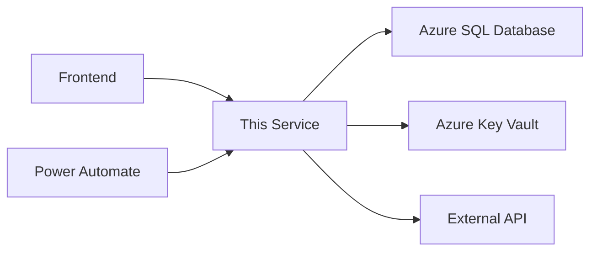
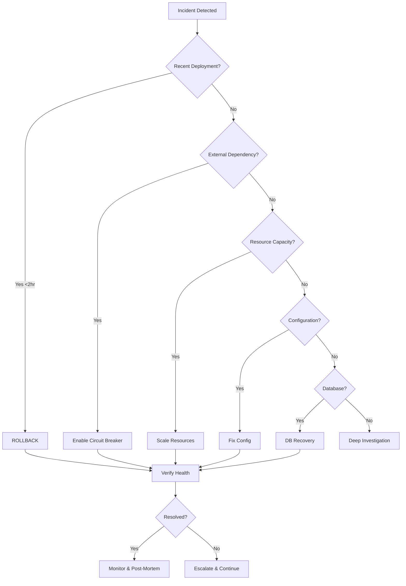

# Runbook: [Service/System Name]

**Service Owner**: [Team Member Name]
**On-Call Escalation**: [Contact method - Phone/Teams/Email]
**Last Updated**: YYYY-MM-DD
**Related Build**: [Link to Notion Example Build entry]
**Criticality**: [Critical | Important | Nice to Have]

---

## Executive Summary

**Purpose**: [What business problem this service solves and measurable outcomes it delivers]

**Service Category**: [API | Web App | Function App | Database | Integration | Automation]

**Business Impact of Outage**:
- **Critical**: [What stops working if this service fails]
- **Affected Users**: [Who is impacted and how many]
- **Financial Impact**: [Revenue/cost implications per hour of downtime]

**Service Dependencies**:


---

## Service Architecture

### High-Level Overview

**Deployment Model**: [App Service | Azure Functions | Container Apps | AKS]

**Geographic Distribution**:
- Primary Region: [Azure region]
- Secondary Region: [Azure region for failover]
- Traffic Manager: [Yes/No]

**Core Components**:

| Component | Azure Resource | Purpose | Status Endpoint |
|-----------|----------------|---------|-----------------|
| Web API | [app-name].azurewebsites.net | REST API for operations | /health |
| Database | [sql-server].database.windows.net | Data persistence | - |
| Storage | [storage-account].blob.core.windows.net | File storage | - |
| Key Vault | [kv-name].vault.azure.net | Secret management | - |
| App Insights | [insights-name] | Monitoring & diagnostics | - |

### Azure Resources

**Resource Group**: `[rg-name]`
**Subscription**: `[subscription-name]` (`[subscription-id]`)
**Tags**:
- Project: [project-name]
- Environment: [dev/staging/prod]
- Owner: [team-member]
- CostCenter: [cost-center-code]

**Resource Inventory**:
```bash
# List all resources in resource group
az resource list --resource-group [rg-name] --output table

# Get resource costs
az consumption usage list \
  --start-date $(date -d '30 days ago' +%Y-%m-%d) \
  --end-date $(date +%Y-%m-%d) \
  --resource-group [rg-name]
```

### External Dependencies

**Required Services**:

| Service | Purpose | Criticality | Timeout | Circuit Breaker |
|---------|---------|-------------|---------|-----------------|
| Azure AD | Authentication | Critical | 10s | Enabled |
| Notion API | Data sync | Important | 30s | Enabled |
| GitHub API | Repository operations | Important | 15s | Enabled |
| [External API] | [Purpose] | [Level] | [Xs] | [Yes/No] |

**Dependency Health Checks**:
```bash
# Check Azure AD health
curl https://login.microsoftonline.com/[tenant-id]/v2.0/.well-known/openid-configuration

# Check Notion API
curl -H "Authorization: Bearer $NOTION_API_KEY" https://api.notion.com/v1/users/me

# Check GitHub API
curl -H "Authorization: token $GITHUB_TOKEN" https://api.github.com/rate_limit
```

### Authentication & Authorization

**Authentication Method**: Azure AD (Entra ID)
**Authorization Model**: Role-Based Access Control (RBAC)

**Service Principal**:
- Application ID: [app-id]
- Display Name: [sp-name]
- Certificate/Secret Location: Azure Key Vault (`[secret-name]`)
- Permissions: [List of delegated/application permissions]

**Key Vault Access Policies**:
```bash
# View current access policies
az keyvault show --name [kv-name] --query properties.accessPolicies

# Grant access to service principal
az keyvault set-policy \
  --name [kv-name] \
  --spn [app-id] \
  --secret-permissions get list
```

### Network Architecture

**Network Isolation**: [Public | VNet Integration | Private Endpoint]

**Firewall Rules**:
- Allowed IPs: [List of IP ranges]
- Service Tags: [AzureCloud, AzureFrontDoor.Backend]
- Private Endpoints: [Yes/No]

**Network Security Groups**:
```bash
# View NSG rules
az network nsg show --name [nsg-name] --resource-group [rg-name]

# Add firewall rule for emergency access
az webapp config access-restriction add \
  --name [app-name] \
  --resource-group [rg-name] \
  --rule-name "Emergency-Access" \
  --action Allow \
  --ip-address [your-ip]/32 \
  --priority 100
```

---

## Service Level Objectives (SLOs)

### Availability Targets

**Production SLA**: 99.9% uptime (allows ~43 minutes downtime/month)

**Error Budget**: 0.1% = ~43 minutes/month
- Current Month Usage: [X minutes] ([Y%] of budget)
- Remaining Budget: [Z minutes]

**Uptime Calculation**:
```bash
# Query Application Insights for availability
az monitor app-insights query \
  --app [app-insights-name] \
  --analytics-query "
    requests
    | where timestamp > ago(30d)
    | summarize
        TotalRequests = count(),
        SuccessfulRequests = countif(success == true),
        AvailabilityPercent = (countif(success == true) * 100.0) / count()
  "
```

### Performance Targets

| Metric | Target | Measurement Window |
|--------|--------|-------------------|
| **Response Time** | P50: <200ms, P95: <500ms, P99: <1s | Rolling 5 min |
| **Throughput** | [X] requests/second | Peak hour |
| **Error Rate** | <0.5% of requests | Rolling 1 hour |
| **Data Freshness** | <5 minutes lag | Continuous |
| **Database Query Time** | P95: <100ms | Rolling 5 min |

### Capacity Limits

**Current Capacity**:
- App Service Plan: [SKU], [# instances]
- Database: [DTU/RU], [Max connections]
- Storage: [TB allocated], [IOPS limit]
- API Rate Limits: [requests/min]

**Scale Triggers**:
- CPU >70% for 5 min → Scale out +1 instance
- Memory >80% for 5 min → Scale up to next tier
- Request queue >100 → Scale out +1 instance
- Error rate >2% → Alert on-call (do not auto-scale)

---

## Monitoring & Alerting

### Azure Monitor Dashboard

**Primary Dashboard**: [Link to Azure Monitor dashboard]
**Application Insights**: [Link to App Insights overview]
**Log Analytics Workspace**: [Workspace name]

**Quick Access Links**:
- Metrics Explorer: [Link]
- Live Metrics: [Link]
- Transaction Search: [Link]
- Availability Tests: [Link]

### Key Metrics

**Infrastructure Metrics**:

| Metric | Normal Range | Warning Threshold | Critical Threshold | Action |
|--------|--------------|-------------------|-------------------|--------|
| CPU Usage | 0-60% | 60-80% | >80% for 5 min | Scale up/out |
| Memory Usage | 0-70% | 70-85% | >85% for 5 min | Investigate leak, scale |
| Disk I/O | <70% | 70-85% | >85% | Optimize queries |
| Network Egress | [X-Y GB/day] | >[Y GB/day] | >[Z GB/day] | Check data sync jobs |
| HTTP Queue Length | 0-50 | 50-100 | >100 | Scale out immediately |

**Application Metrics**:

| Metric | Normal Range | Warning Threshold | Critical Threshold | Action |
|--------|--------------|-------------------|-------------------|--------|
| Request Rate | [X-Y req/s] | >[Y req/s] | >[Z req/s] | Scale out |
| Response Time (P95) | <500ms | 500ms-1s | >1s | Investigate slow queries |
| Error Rate | <0.5% | 0.5-2% | >2% for 5 min | Alert on-call |
| Failed Requests | <10/min | 10-50/min | >50/min | Check dependencies |
| Dependency Duration | <200ms | 200ms-500ms | >500ms | Check external APIs |
| Exception Count | <5/hour | 5-20/hour | >20/hour | Review logs |

**Business Metrics**:

| Metric | Normal Range | Warning Threshold | Critical Threshold | Action |
|--------|--------------|-------------------|-------------------|--------|
| Active Users | [X-Y] | <[X] | <[Z] | Check service availability |
| Successful Operations | >[X]% | [Y-X]% | <[Y]% | Investigate errors |
| Data Processing Lag | <5 min | 5-15 min | >15 min | Check pipeline |

### Kusto Queries (KQL)

**Error Rate Analysis**:
```kql
requests
| where timestamp > ago(1h)
| summarize
    TotalRequests = count(),
    FailedRequests = countif(success == false),
    ErrorRate = (countif(success == false) * 100.0) / count()
    by bin(timestamp, 5m)
| render timechart
```

**Slow Requests Investigation**:
```kql
requests
| where timestamp > ago(1h)
| where duration > 1000  // >1 second
| project timestamp, name, url, duration, resultCode, cloud_RoleName
| order by duration desc
| take 50
```

**Dependency Failures**:
```kql
dependencies
| where timestamp > ago(1h)
| where success == false
| summarize FailureCount = count() by name, resultCode, type
| order by FailureCount desc
```

**Exception Analysis**:
```kql
exceptions
| where timestamp > ago(1h)
| summarize Count = count() by type, outerMessage
| order by Count desc
```

**Top Resource Consumers**:
```kql
requests
| where timestamp > ago(1h)
| summarize
    AvgDuration = avg(duration),
    RequestCount = count()
    by operation_Name
| order by AvgDuration desc
| take 20
```

### Alert Configuration

**Alert Channels**:

| Severity | Channel | Notification Method | Escalation |
|----------|---------|-------------------|------------|
| Critical (Sev1) | Teams + SMS + Email | Immediate | 15 min if no ack |
| High (Sev2) | Teams + Email | Within 15 min | 1 hour if no ack |
| Medium (Sev3) | Teams channel | Within 1 hour | None |
| Low (Sev4) | Email digest | Daily summary | None |

**Critical Alerts**:
- Service Down: HTTP 5xx >50/min for 5 min
- Database Unavailable: Connection failures >10 in 5 min
- High Error Rate: Error rate >2% for 5 min
- Authentication Failure: Azure AD connection errors
- Disk Full: Disk usage >95%

**Action Groups**:
```bash
# Create action group for critical alerts
az monitor action-group create \
  --name "Critical-OnCall-Team" \
  --resource-group [rg-name] \
  --short-name "OnCall" \
  --email-receiver name="[Name]" email="[email]" \
  --sms-receiver name="[Name]" country-code="1" phone="[phone]"

# Create metric alert
az monitor metrics alert create \
  --name "High-Error-Rate" \
  --resource-group [rg-name] \
  --scopes /subscriptions/[sub]/resourceGroups/[rg]/providers/Microsoft.Web/sites/[app] \
  --condition "count requests where success == false > 100" \
  --window-size 5m \
  --evaluation-frequency 1m \
  --action Critical-OnCall-Team \
  --severity 1
```

### Availability Tests

**Synthetic Monitoring**:

| Test Name | Frequency | Locations | Success Criteria |
|-----------|-----------|-----------|------------------|
| Health Check | 5 min | 3 global regions | HTTP 200, <1s response |
| API Endpoint | 5 min | 2 regions | Valid JSON response |
| Database Connectivity | 10 min | 1 region | Query completes <500ms |

**Multi-step Web Test**:
```xml
<!-- Example: Login and perform operation -->
<WebTest>
  <Request Url="https://[app].azurewebsites.net/api/auth/login" Method="POST">
    <ExpectedHttpStatusCode>200</ExpectedHttpStatusCode>
  </Request>
  <Request Url="https://[app].azurewebsites.net/api/data" Method="GET">
    <ExpectedHttpStatusCode>200</ExpectedHttpStatusCode>
  </Request>
</WebTest>
```

---

## Common Operations

### 1. Routine Deployment

**Purpose**: Establish reliable deployment workflow that drives measurable improvements while maintaining service availability.

**Frequency**: [Weekly | Bi-weekly | On-demand]
**Duration**: ~[15-30 minutes]
**Downtime**: Zero-downtime (blue-green deployment)
**Change Window**: [Day/time with stakeholder approval]

**Prerequisites**:
- [ ] All unit and integration tests passing
- [ ] Security scan completed (no critical vulnerabilities)
- [ ] Code review approved by 2+ team members
- [ ] Staging environment validated
- [ ] Stakeholder approval obtained
- [ ] Database migrations tested (if applicable)
- [ ] Rollback plan reviewed
- [ ] On-call engineer available

**Pre-Deployment Checklist**:
```bash
# 1. Verify current production health
az webapp show \
  --name [app-name] \
  --resource-group [rg-name] \
  --query "{Name:name, State:state, HostName:defaultHostName}"

# 2. Check Application Insights for baseline metrics
az monitor app-insights query \
  --app [app-insights-name] \
  --analytics-query "
    requests
    | where timestamp > ago(1h)
    | summarize
        RequestCount = count(),
        AvgDuration = avg(duration),
        ErrorRate = (countif(success == false) * 100.0) / count()
  "

# 3. Verify database backup exists
az sql db show \
  --name [db-name] \
  --server [server-name] \
  --resource-group [rg-name] \
  --query "{Name:name, Status:status, LastBackup:earliestRestoreDate}"

# 4. Check staging slot status
az webapp deployment slot list \
  --name [app-name] \
  --resource-group [rg-name] \
  --output table
```

**Deployment Procedure**:

**Option A: GitHub Actions (Recommended)**
```bash
# Step 1: Trigger deployment workflow
gh workflow run deploy-production.yml \
  --ref main \
  -f environment=production \
  -f version=$(git describe --tags)

# Step 2: Monitor workflow execution
gh run watch

# Step 3: View workflow logs (if needed)
gh run view --log
```

**Option B: Azure CLI (Manual)**
```bash
# Step 1: Deploy to staging slot
az webapp deployment source config-zip \
  --name [app-name] \
  --resource-group [rg-name] \
  --slot staging \
  --src ./build/release.zip

# Step 2: Warm up staging slot
curl https://[app-name]-staging.azurewebsites.net/health

# Step 3: Run smoke tests against staging
npm run test:smoke -- --env=staging

# Step 4: Swap staging to production (blue-green)
az webapp deployment slot swap \
  --name [app-name] \
  --resource-group [rg-name] \
  --slot staging \
  --target-slot production

# Step 5: Monitor production metrics (5 min observation)
watch -n 30 'az monitor app-insights query \
  --app [app-insights-name] \
  --analytics-query "requests | where timestamp > ago(5m) | summarize count() by resultCode"'
```

**Post-Deployment Validation**:
```bash
# 1. Verify health endpoint
curl -f https://[app-name].azurewebsites.net/health || echo "Health check FAILED"

# 2. Test critical API endpoints
curl -X POST https://[app-name].azurewebsites.net/api/critical-operation \
  -H "Authorization: Bearer $TOKEN" \
  -H "Content-Type: application/json" \
  -d '{"test": "data"}'

# 3. Check Application Insights for errors (last 10 min)
az monitor app-insights query \
  --app [app-insights-name] \
  --analytics-query "
    exceptions
    | where timestamp > ago(10m)
    | summarize Count = count() by type
    | order by Count desc
  "

# 4. Verify database connectivity
az sql db show-connection-string \
  --name [db-name] \
  --server [server-name] \
  --client ado.net

# 5. Check Key Vault secret access
az keyvault secret show \
  --vault-name [kv-name] \
  --name [secret-name] \
  --query "attributes.enabled"

# 6. Monitor live metrics for 5 minutes
# Open: https://portal.azure.com -> Application Insights -> Live Metrics
```

**Validation Checklist**:
- [ ] Health endpoint returns HTTP 200 OK
- [ ] No exceptions in Application Insights (last 10 min)
- [ ] Error rate <0.5%
- [ ] Average response time within normal range
- [ ] Database queries executing successfully
- [ ] All critical features functional
- [ ] No alerts triggered
- [ ] Logs show expected behavior

**Communication**:
```markdown
**Deployment Notification Template** (Teams/Email):

📦 Deployment Complete: [Service Name] v[X.Y.Z]

**Status**: ✅ Successful | ⚠️ Partial | ❌ Failed
**Deployed By**: [Your Name]
**Deployment Time**: [Duration]
**Downtime**: Zero-downtime deployment

**Changes**:
- [Feature/fix 1]
- [Feature/fix 2]
- [Feature/fix 3]

**Validation**:
- Health Check: ✅
- Error Rate: [X]% (target: <0.5%)
- Response Time: [X]ms (target: <500ms)

**Related**:
- Build: [Link to Notion Example Build]
- GitHub Release: [Link]
- Application Insights: [Link]

**Next Steps**: Monitoring for 1 hour, no action required.
```

**Rollback Criteria**:
- Error rate >2% for 5 consecutive minutes
- Critical functionality broken
- Database integrity issues
- Security vulnerability introduced
- Performance degradation >50%

**If Rollback Needed**: See Section "2. Emergency Rollback"

---

### 2. Emergency Rollback

**Purpose**: Rapidly restore service to last known good state to minimize business impact.

**When to Execute**:
- Error rate >2% sustained for 5+ minutes
- Critical functionality completely broken
- Data corruption detected
- Security vulnerability actively exploited
- Cascading failure to dependent services
- Performance degradation >50% sustained

**Duration**: ~5-10 minutes
**Downtime**: <2 minutes during swap

**Decision Authority**:
- On-call engineer can execute for Sev1 incidents
- Service owner approval required for planned rollbacks
- Document decision in incident channel

**Rollback Procedure**:

**Immediate Actions (0-2 minutes)**:
```bash
# Step 1: Acknowledge incident
echo "⚠️ ROLLBACK INITIATED: $(date)" | tee -a incident.log

# Step 2: Identify current deployment
az webapp show \
  --name [app-name] \
  --resource-group [rg-name] \
  --query "{Name:name, State:state, LastModified:siteConfig.lastModifiedTimeUtc}"

# Step 3: List deployment history
az webapp deployment list \
  --name [app-name] \
  --resource-group [rg-name] \
  --output table

# Step 4: Identify last known good version
# Look for last successful deployment before incident started
```

**Rollback Execution (2-5 minutes)**:

**Option A: Slot Swap (Fastest - if staging has previous version)**
```bash
# Swap production back to staging (which has previous version)
az webapp deployment slot swap \
  --name [app-name] \
  --resource-group [rg-name] \
  --slot staging \
  --target-slot production

# Verify swap completed
az webapp show \
  --name [app-name] \
  --resource-group [rg-name] \
  --slot production \
  --query "state"
```

**Option B: Redeploy Previous Version (if no staging slot)**
```bash
# Find last known good commit/tag
git log --oneline -10
git tag -l

# Checkout previous version
git checkout [previous-tag-or-commit]

# Trigger deployment
gh workflow run deploy-production.yml --ref [previous-tag]

# OR manual deployment
az webapp deployment source config-zip \
  --name [app-name] \
  --resource-group [rg-name] \
  --src ./previous-version.zip
```

**Option C: Use Azure App Service Snapshot (if configured)**
```bash
# List available snapshots
az webapp snapshot list \
  --name [app-name] \
  --resource-group [rg-name]

# Restore from snapshot
az webapp snapshot restore \
  --name [app-name] \
  --resource-group [rg-name] \
  --snapshot-time "[timestamp]"
```

**Post-Rollback Validation (5-10 minutes)**:
```bash
# 1. Immediate health check
curl -f https://[app-name].azurewebsites.net/health

# 2. Verify error rate decreased
az monitor app-insights query \
  --app [app-insights-name] \
  --analytics-query "
    requests
    | where timestamp > ago(10m)
    | summarize
        ErrorRate = (countif(success == false) * 100.0) / count()
        by bin(timestamp, 1m)
    | render timechart
  "

# 3. Check critical functionality
[Run smoke tests or manual verification]

# 4. Monitor for 10 minutes
# Watch live metrics in Application Insights
```

**Validation Checklist**:
- [ ] Health endpoint returns 200 OK
- [ ] Error rate returned to <0.5%
- [ ] Response times within normal range
- [ ] Critical features working
- [ ] No new alerts triggered
- [ ] Database queries successful
- [ ] User reports of issues stopped

**Communication**:
```markdown
**Rollback Notification Template** (Teams/Email):

🔄 ROLLBACK EXECUTED: [Service Name]

**Severity**: [Sev1/Sev2]
**Initiated By**: [Your Name]
**Rollback Time**: [Duration]
**Rolled Back From**: v[X.Y.Z]
**Rolled Back To**: v[A.B.C]

**Reason**:
[Brief description of issue that triggered rollback]

**Current Status**:
- Service: ✅ Operational
- Error Rate: [X]% (down from [Y]%)
- Response Time: [X]ms (improved from [Y]ms)

**Impact**:
- Duration: [X minutes]
- Affected Users: [Estimate]
- Data Loss: None | [Details]

**Next Steps**:
1. Continue monitoring for 1 hour
2. Root cause analysis scheduled
3. Fix and redeploy plan in progress

**Related**:
- Incident Channel: [Link]
- Application Insights: [Link]
- Notion Build: [Link]
```

**Post-Rollback Actions**:
```bash
# 1. Update Notion Build entry
# Navigate to: [Notion Example Build URL]
# Add note: "Rollback executed at [timestamp] due to [reason]"

# 2. Create incident tracking
# Add entry to incident log

# 3. Monitor extended period (1 hour)
watch -n 60 'az monitor app-insights query \
  --app [app-insights-name] \
  --analytics-query "requests | where timestamp > ago(5m) | summarize count() by resultCode"'

# 4. Notify stakeholders of stability
```

**Root Cause Analysis Requirements**:
- [ ] Create Knowledge Vault post-mortem entry within 48 hours
- [ ] 5 Whys analysis completed
- [ ] Action items identified with owners
- [ ] Monitoring gaps addressed
- [ ] Deployment process improvements documented
- [ ] This runbook updated with lessons learned

**Prevention for Future**:
- Review deployment checklist
- Enhance staging validation
- Add monitoring for this failure mode
- Update automated tests
- Consider feature flags for risky changes

---

### 3. Scale Up/Down Operations

**Purpose**: Optimize resource allocation to match workload demands while maintaining cost efficiency.

**When to Scale**:

**Scale Up Triggers**:
- CPU >70% sustained for 10+ minutes
- Memory >80% sustained for 10+ minutes
- Planned traffic spike (marketing campaign, event)
- Response time degradation (P95 >1s)
- Database DTU/RU exhaustion

**Scale Down Triggers**:
- CPU <30% for 24+ hours (off-peak)
- Memory <50% consistently
- Post-event traffic normalization
- Cost optimization review
- Unused capacity identified

**Scaling Strategy**:
- **Scale Out** (horizontal): Add instances for traffic spikes (preferred for stateless apps)
- **Scale Up** (vertical): Increase instance size for resource-intensive operations
- **Auto-scale**: Configure rules for predictable patterns

**Pre-Scaling Assessment**:
```bash
# 1. Current resource utilization
az monitor metrics list \
  --resource /subscriptions/[sub]/resourceGroups/[rg]/providers/Microsoft.Web/sites/[app] \
  --metric "CpuPercentage,MemoryPercentage" \
  --start-time $(date -u -d '24 hours ago' +%Y-%m-%dT%H:%M:%SZ) \
  --interval PT1H

# 2. Current App Service Plan details
az appservice plan show \
  --name [plan-name] \
  --resource-group [rg-name] \
  --query "{Tier:sku.tier, Size:sku.size, Capacity:sku.capacity, MaxWorkers:maximumNumberOfWorkers}"

# 3. Estimate cost impact
az consumption usage list \
  --start-date $(date -d '7 days ago' +%Y-%m-%d) \
  --end-date $(date +%Y-%m-%d) \
  --query "[?contains(instanceName, '[app-name]')]"
```

**Scaling Procedures**:

**Scale Out (Add Instances)**:
```bash
# Manual scale out
az appservice plan update \
  --name [plan-name] \
  --resource-group [rg-name] \
  --number-of-workers 3

# Verify instance count
az webapp show \
  --name [app-name] \
  --resource-group [rg-name] \
  --query "siteConfig.numberOfWorkers"

# Monitor distribution across instances
az monitor app-insights query \
  --app [app-insights-name] \
  --analytics-query "
    requests
    | where timestamp > ago(10m)
    | summarize RequestCount = count() by cloud_RoleInstance
  "
```

**Scale Up (Increase Instance Size)**:
```bash
# Scale up App Service Plan
az appservice plan update \
  --name [plan-name] \
  --resource-group [rg-name] \
  --sku P2V3

# Available SKUs: B1, B2, B3, S1, S2, S3, P1V2, P2V2, P3V2, P1V3, P2V3, P3V3

# Verify new tier
az appservice plan show \
  --name [plan-name] \
  --resource-group [rg-name] \
  --query "{Tier:sku.tier, Size:sku.size}"

# Expected downtime: ~30 seconds during scale up
```

**Scale Down (After Event/Optimization)**:
```bash
# Scale down instances
az appservice plan update \
  --name [plan-name] \
  --resource-group [rg-name] \
  --number-of-workers 1

# Scale down tier (cost optimization)
az appservice plan update \
  --name [plan-name] \
  --resource-group [rg-name] \
  --sku B1

# Monitor for 30 minutes after scale down
watch -n 60 'az monitor metrics list \
  --resource /subscriptions/[sub]/resourceGroups/[rg]/providers/Microsoft.Web/sites/[app] \
  --metric "CpuPercentage,MemoryPercentage" \
  --start-time $(date -u -d "10 minutes ago" +%Y-%m-%dT%H:%M:%SZ)'
```

**Configure Auto-Scale Rules**:
```bash
# Create auto-scale setting
az monitor autoscale create \
  --name [autoscale-name] \
  --resource-group [rg-name] \
  --resource /subscriptions/[sub]/resourceGroups/[rg]/providers/Microsoft.Web/serverfarms/[plan-name] \
  --min-count 1 \
  --max-count 5 \
  --count 2

# Scale out rule: CPU >70%
az monitor autoscale rule create \
  --autoscale-name [autoscale-name] \
  --resource-group [rg-name] \
  --condition "Percentage CPU > 70 avg 5m" \
  --scale out 1

# Scale in rule: CPU <30%
az monitor autoscale rule create \
  --autoscale-name [autoscale-name] \
  --resource-group [rg-name] \
  --condition "Percentage CPU < 30 avg 10m" \
  --scale in 1

# View auto-scale history
az monitor autoscale show \
  --name [autoscale-name] \
  --resource-group [rg-name]
```

**Database Scaling**:

**Azure SQL Database**:
```bash
# Scale up database
az sql db update \
  --name [db-name] \
  --server [server-name] \
  --resource-group [rg-name] \
  --service-objective S3  # Standard tier, 100 DTUs

# Available tiers: Basic, S0-S12, P1-P15, GP_Gen5_2 (General Purpose)

# Monitor database performance
az monitor metrics list \
  --resource /subscriptions/[sub]/resourceGroups/[rg]/providers/Microsoft.Sql/servers/[server]/databases/[db] \
  --metric "dtu_consumption_percent,storage_percent" \
  --start-time $(date -u -d '1 hour ago' +%Y-%m-%dT%H:%M:%SZ)
```

**Cosmos DB**:
```bash
# Scale Cosmos DB throughput (RU/s)
az cosmosdb sql database throughput update \
  --account-name [cosmos-account] \
  --name [database-name] \
  --resource-group [rg-name] \
  --throughput 1000

# Enable auto-scale
az cosmosdb sql database throughput update \
  --account-name [cosmos-account] \
  --name [database-name] \
  --resource-group [rg-name] \
  --max-throughput 4000

# Monitor RU consumption
az monitor metrics list \
  --resource /subscriptions/[sub]/resourceGroups/[rg]/providers/Microsoft.DocumentDB/databaseAccounts/[account] \
  --metric "TotalRequestUnits,ProvisionedThroughput"
```

**Post-Scaling Validation**:
```bash
# 1. Verify new configuration active
az appservice plan show \
  --name [plan-name] \
  --resource-group [rg-name] \
  --query "{Tier:sku.tier, Size:sku.size, Workers:sku.capacity}"

# 2. Check application health
curl -f https://[app-name].azurewebsites.net/health

# 3. Monitor performance improvement
az monitor app-insights query \
  --app [app-insights-name] \
  --analytics-query "
    requests
    | where timestamp > ago(15m)
    | summarize
        AvgDuration = avg(duration),
        P95Duration = percentile(duration, 95)
        by bin(timestamp, 1m)
    | render timechart
  "

# 4. Verify cost impact
# Estimated new monthly cost: [Calculate based on SKU pricing]
```

**Cost Impact Tracking**:
```bash
# 1. Calculate monthly cost change
# OLD: [SKU] x [instances] = $[X]/month
# NEW: [SKU] x [instances] = $[Y]/month
# DELTA: $[Y-X]/month ([+/-]%)

# 2. Update Software & Cost Tracker in Notion
# Navigate to: [Software Tracker URL]
# Update entry: [Service Name]
# New cost: $[Y]/month
# Link to this runbook: [URL]

# 3. Notify cost owner
# Email/Teams: "Scaled [service] from [old] to [new], cost impact: $[delta]/month"
```

**Validation Checklist**:
- [ ] New configuration active and verified
- [ ] Performance metrics improved (if scale up)
- [ ] No errors introduced
- [ ] Health checks passing
- [ ] Cost impact calculated and documented
- [ ] Software Tracker updated in Notion
- [ ] Monitoring period completed (30 min minimum)
- [ ] Stakeholders notified

**Rollback Plan**:
```bash
# If scaling caused issues, revert
az appservice plan update \
  --name [plan-name] \
  --resource-group [rg-name] \
  --sku [previous-sku] \
  --number-of-workers [previous-count]
```

---

### 4. Database Backup & Restore

**Purpose**: Establish reliable data protection strategy ensuring business continuity through systematic backup and recovery operations.

**Backup Strategy**:

**Automated Backups**:
- **Frequency**: Daily at 2:00 AM UTC
- **Retention**: 30 days
- **Type**: Full database backup
- **Location**: Azure Blob Storage (GRS - Geo-Redundant)
- **Encryption**: At-rest encryption enabled

**Backup Schedule**:
| Backup Type | Frequency | Retention | RPO | RTO |
|-------------|-----------|-----------|-----|-----|
| Automated Daily | Daily 2 AM UTC | 30 days | 24 hours | <1 hour |
| Long-term Retention | Weekly (Sunday) | 12 weeks | 7 days | <2 hours |
| Point-in-Time Restore | Continuous (transaction log) | 7-35 days | 5 minutes | <30 minutes |
| Pre-deployment | Before each prod deploy | 48 hours | 0 (manual) | <15 minutes |

**Azure SQL Database Backup Operations**:

**Verify Backup Configuration**:
```bash
# Check retention policy
az sql db show \
  --name [db-name] \
  --server [server-name] \
  --resource-group [rg-name] \
  --query "{Name:name, Status:status, EarliestRestore:earliestRestoreDate, BackupRetention:retentionPolicy}"

# View available restore points
az sql db list-restorable-time-windows \
  --name [db-name] \
  --server [server-name] \
  --resource-group [rg-name]

# Check long-term retention backups
az sql db ltr-backup list \
  --location [azure-region] \
  --server [server-name] \
  --database [db-name]
```

**Manual Backup (Pre-Deployment)**:
```bash
# Create on-demand backup via export to Blob Storage
az sql db export \
  --name [db-name] \
  --server [server-name] \
  --resource-group [rg-name] \
  --admin-user [admin-username] \
  --admin-password [admin-password-from-keyvault] \
  --storage-key [storage-key] \
  --storage-key-type StorageAccessKey \
  --storage-uri "https://[storage-account].blob.core.windows.net/backups/[db-name]-$(date +%Y%m%d-%H%M%S).bacpac"

# Verify export completed
az sql db export \
  --name [db-name] \
  --server [server-name] \
  --resource-group [rg-name] \
  --show-details
```

**Point-in-Time Restore (PITR)**:
```bash
# Restore to specific point in time (last 7-35 days)
az sql db restore \
  --dest-name [db-name]-restored-$(date +%Y%m%d-%H%M%S) \
  --server [server-name] \
  --resource-group [rg-name] \
  --name [db-name] \
  --time "2025-10-21T14:30:00Z"

# Monitor restore progress
az sql db show \
  --name [db-name]-restored-* \
  --server [server-name] \
  --resource-group [rg-name] \
  --query "{Name:name, Status:status}"

# Once complete, update application connection string to point to restored database
az sql db show-connection-string \
  --name [db-name]-restored-* \
  --server [server-name] \
  --client ado.net
```

**Full Database Restore from Backup**:
```bash
# List available backups
az sql db ltr-backup list \
  --location [azure-region] \
  --server [server-name] \
  --database [db-name] \
  --query "[].{BackupTime:backupTime, DatabaseName:databaseName, BackupId:backupId}"

# Restore from long-term retention backup
az sql db ltr-backup restore \
  --dest-database [db-name]-restored \
  --dest-server [server-name] \
  --dest-resource-group [rg-name] \
  --backup-id [backup-id-from-list]

# Verify restored database
az sql db show \
  --name [db-name]-restored \
  --server [server-name] \
  --resource-group [rg-name]
```

**Cosmos DB Backup Operations**:

**Verify Backup Configuration**:
```bash
# Check backup policy
az cosmosdb show \
  --name [cosmos-account] \
  --resource-group [rg-name] \
  --query "{BackupPolicy:backupPolicy, BackupStorageRedundancy:backupPolicy.periodicModeProperties.backupStorageRedundancy}"

# Cosmos DB uses continuous backup mode (default) or periodic
# Continuous: Point-in-time restore up to 30 days
# Periodic: Full backups at configured intervals
```

**Request Cosmos DB Restore**:
```bash
# Cosmos DB restores require Azure support ticket
# Document details needed:
# - Account name: [cosmos-account]
# - Database/container name: [database/container]
# - Restore time: [timestamp]
# - Restore location: [new account name]

# Create support request via portal or:
az support tickets create \
  --ticket-name "Cosmos DB Restore Request" \
  --title "Point-in-time restore for [cosmos-account]" \
  --description "Requesting restore of [database/container] to [timestamp]" \
  --severity "2" \
  --problem-classification "[classification-id]"

# OR use Azure Portal: Support + Troubleshooting -> New Support Request
```

**Post-Restore Validation**:
```bash
# 1. Connect to restored database
sqlcmd -S [server-name].database.windows.net -d [db-name]-restored -U [username] -P [password]

# 2. Verify row counts match expectations
SELECT
    SCHEMA_NAME(t.schema_id) AS SchemaName,
    t.name AS TableName,
    SUM(p.rows) AS RowCount
FROM sys.tables t
INNER JOIN sys.partitions p ON t.object_id = p.object_id
WHERE p.index_id IN (0,1)
GROUP BY t.schema_id, t.name
ORDER BY RowCount DESC;

# 3. Verify critical tables have expected data
SELECT COUNT(*) FROM [critical_table];
SELECT TOP 10 * FROM [critical_table] ORDER BY created_date DESC;

# 4. Check data integrity constraints
DBCC CHECKDB ([db-name]-restored);

# 5. Compare schemas (original vs restored)
SELECT * FROM INFORMATION_SCHEMA.TABLES;
```

**Cutover to Restored Database**:
```bash
# Option 1: Update connection string in Key Vault
az keyvault secret set \
  --vault-name [kv-name] \
  --name "DatabaseConnectionString" \
  --value "Server=[server].database.windows.net;Database=[db-name]-restored;..."

# Option 2: Rename databases (requires downtime)
# Rename current production database
az sql db rename \
  --name [db-name] \
  --new-name [db-name]-old \
  --server [server-name] \
  --resource-group [rg-name]

# Rename restored database to production name
az sql db rename \
  --name [db-name]-restored \
  --new-name [db-name] \
  --server [server-name] \
  --resource-group [rg-name]

# Restart application to pick up new connection
az webapp restart \
  --name [app-name] \
  --resource-group [rg-name]

# 3. Verify application functionality
curl -f https://[app-name].azurewebsites.net/health
[Run smoke tests]

# 4. Monitor for data consistency issues
az monitor app-insights query \
  --app [app-insights-name] \
  --analytics-query "
    exceptions
    | where timestamp > ago(30m)
    | where outerMessage contains 'database' or outerMessage contains 'sql'
    | summarize Count = count() by outerMessage
  "
```

**Backup Validation Schedule**:
```bash
# Monthly backup validation procedure
# Day 1 of each month: Restore most recent backup to test environment

# 1. Restore to test database
az sql db restore \
  --dest-name [db-name]-validation-$(date +%Y%m) \
  --server [test-server-name] \
  --resource-group [test-rg-name] \
  --name [db-name] \
  --time "$(date -u -d '1 day ago' +%Y-%m-%dT00:00:00Z)"

# 2. Run validation queries
sqlcmd -S [test-server].database.windows.net -d [db-name]-validation -U [username] -P [password] -i validation-queries.sql

# 3. Document results in Notion Knowledge Vault
# Title: "Backup Validation - [Month Year]"
# Status: Pass/Fail
# Issues: [Any findings]

# 4. Cleanup test database
az sql db delete \
  --name [db-name]-validation-$(date +%Y%m) \
  --server [test-server-name] \
  --resource-group [test-rg-name] \
  --yes
```

**Disaster Recovery (Regional Failure)**:
```bash
# If primary region fails, failover to geo-replicated database

# 1. Check geo-replication status
az sql db replica list \
  --name [db-name] \
  --server [server-name] \
  --resource-group [rg-name]

# 2. Force failover to secondary region
az sql db replica set-primary \
  --name [db-name] \
  --server [secondary-server-name] \
  --resource-group [rg-name]

# 3. Update application to point to new primary
az keyvault secret set \
  --vault-name [kv-name] \
  --name "DatabaseConnectionString" \
  --value "Server=[secondary-server].database.windows.net;Database=[db-name];..."

# 4. Restart application in secondary region
az webapp restart \
  --name [app-name] \
  --resource-group [rg-name]
```

**Backup Checklist**:
- [ ] Automated daily backups verified
- [ ] Long-term retention configured (12 weeks)
- [ ] Geo-redundant storage enabled
- [ ] Monthly restore validation documented
- [ ] Recovery procedures tested quarterly
- [ ] Backup costs tracked in Software Tracker
- [ ] Restoration time (RTO) within SLA
- [ ] Data loss tolerance (RPO) within SLA

---

### 5. Certificate Renewal

**Purpose**: Maintain secure HTTPS connections by proactively renewing SSL/TLS certificates before expiration.

**Certificate Inventory**:

| Domain | Certificate Type | Expiration Date | Renewal Source | Auto-Renew |
|--------|-----------------|-----------------|----------------|------------|
| [app-name].azurewebsites.net | Azure Managed | [date] | Azure App Service | Yes |
| [custom-domain].com | Let's Encrypt | [date] | Certbot/ACME | Yes |
| [api-domain].com | Commercial CA | [date] | Manual | No |

**Certificate Monitoring**:
```bash
# Check certificate expiration for custom domain
openssl s_client -connect [domain]:443 -servername [domain] </dev/null 2>/dev/null | openssl x509 -noout -dates

# Check App Service certificate
az webapp config ssl list \
  --resource-group [rg-name] \
  --query "[].{Name:name, Thumbprint:thumbprint, ExpirationDate:expirationDate}"

# Get days until expiration
az webapp config ssl show \
  --certificate-name [cert-name] \
  --resource-group [rg-name] \
  --query "expirationDate"
```

**Automated Certificate Renewal (Let's Encrypt)**:
```bash
# If using Azure App Service with managed certificate
# Renewal is automatic, verify renewal status:
az webapp config hostname list \
  --webapp-name [app-name] \
  --resource-group [rg-name] \
  --query "[].{Hostname:name, SslState:sslState, Thumbprint:thumbprint}"

# If using Certbot on VM/container:
# Setup cron job for automatic renewal
echo "0 3 * * * certbot renew --quiet && az webapp restart --name [app-name] --resource-group [rg-name]" | crontab -
```

**Manual Certificate Renewal**:
```bash
# Step 1: Generate new certificate (commercial CA)
# Follow CA-specific process

# Step 2: Upload to Azure Key Vault
az keyvault certificate import \
  --vault-name [kv-name] \
  --name [cert-name] \
  --file /path/to/certificate.pfx \
  --password [cert-password]

# Step 3: Bind certificate to App Service
az webapp config ssl upload \
  --certificate-file /path/to/certificate.pfx \
  --certificate-password [cert-password] \
  --name [app-name] \
  --resource-group [rg-name]

az webapp config ssl bind \
  --certificate-thumbprint [thumbprint] \
  --ssl-type SNI \
  --name [app-name] \
  --resource-group [rg-name]

# Step 4: Verify HTTPS
curl -I https://[domain]
openssl s_client -connect [domain]:443 -servername [domain] </dev/null 2>/dev/null | openssl x509 -noout -subject -dates
```

**Certificate Expiration Alert**:
```bash
# Create alert for certificates expiring in <30 days
# Manual check via scheduled task or Azure Automation
```

---

### 6. Log Management & Cleanup

**Purpose**: Maintain log storage costs and performance through systematic log retention and archival strategies.

**Log Sources**:
- Application Insights: Application logs, traces, exceptions
- App Service Logs: HTTP logs, application diagnostics
- Azure SQL Database: Query performance, auditing
- Azure Storage: Container/blob access logs

**Log Retention Policy**:

| Log Type | Retention (Hot) | Retention (Archive) | Purpose |
|----------|----------------|---------------------|---------|
| Application Insights | 90 days | 2 years | Troubleshooting, analysis |
| App Service HTTP Logs | 30 days | 1 year | Traffic analysis |
| Application Diagnostics | 30 days | 6 months | Debugging |
| Database Query Logs | 7 days | 90 days | Performance tuning |
| Audit Logs | 90 days | 7 years | Compliance |

**Configure Log Retention**:
```bash
# Application Insights retention
az monitor app-insights component update \
  --app [app-insights-name] \
  --resource-group [rg-name] \
  --retention-time 90

# App Service diagnostic logs
az webapp log config \
  --name [app-name] \
  --resource-group [rg-name] \
  --application-logging filesystem \
  --detailed-error-messages true \
  --failed-request-tracing true \
  --level verbose

# Log Analytics workspace retention
az monitor log-analytics workspace update \
  --resource-group [rg-name] \
  --workspace-name [workspace-name] \
  --retention-time 90
```

**Export Logs to Archive Storage**:
```bash
# Configure diagnostic settings to export to storage
az monitor diagnostic-settings create \
  --name "ArchiveLogs" \
  --resource /subscriptions/[sub]/resourceGroups/[rg]/providers/Microsoft.Web/sites/[app] \
  --storage-account [storage-account-id] \
  --logs '[{"category": "AppServiceHTTPLogs", "enabled": true, "retentionPolicy": {"enabled": true, "days": 365}}]'

# Export Application Insights to Blob Storage
az monitor app-insights component continues-export create \
  --app [app-insights-name] \
  --resource-group [rg-name] \
  --dest-account [storage-account] \
  --dest-container logs \
  --dest-sub-id [subscription-id] \
  --dest-type Blob
```

**Cleanup Old Logs**:
```bash
# Delete old App Service logs (older than 30 days)
az storage blob delete-batch \
  --account-name [storage-account] \
  --source logs \
  --pattern "**/$(date -d '30 days ago' +%Y/%m/%d)*"

# Query and cleanup Application Insights data (via Log Analytics)
# Note: Application Insights data can't be selectively deleted, use retention settings
```

---

### 7. Feature Flag Management

**Purpose**: Enable safe deployment of new features with ability to toggle functionality without code deployments.

**Feature Flag Service**: [Azure App Configuration | LaunchDarkly | Custom]

**Key Feature Flags**:

| Flag Name | Current State | Purpose | Rollout % | Expiry Date |
|-----------|--------------|---------|-----------|-------------|
| `enable-new-api-v2` | OFF | New API version | 0% | 2025-12-31 |
| `enable-batch-processing` | ON | Batch job feature | 100% | None |
| `enable-beta-ui` | ON | New UI for beta users | 10% | 2025-11-30 |

**Toggle Feature Flag**:
```bash
# If using Azure App Configuration
az appconfig kv set \
  --name [appconfig-name] \
  --key "FeatureManagement:NewFeature" \
  --value "true" \
  --label "production"

# Force app to refresh configuration
az webapp restart \
  --name [app-name] \
  --resource-group [rg-name]

# If using LaunchDarkly or similar
# Use web interface or SDK to toggle flag
```

**Emergency Feature Disable**:
```bash
# Quickly disable problematic feature
az appconfig kv set \
  --name [appconfig-name] \
  --key "FeatureManagement:ProblematicFeature" \
  --value "false" \
  --label "production"

# App should refresh within 30 seconds (if using dynamic config)
# If not, restart app
az webapp restart \
  --name [app-name] \
  --resource-group [rg-name]
```

---

### 8. Secret Rotation

**Purpose**: Maintain security posture through regular credential rotation and access key management.

**Rotation Schedule**:

| Secret Type | Rotation Frequency | Next Rotation | Owner |
|-------------|-------------------|---------------|-------|
| Service Principal Secret | 90 days | [date] | [team-member] |
| Database Admin Password | 180 days | [date] | [team-member] |
| API Keys (External) | 365 days | [date] | [team-member] |
| Storage Account Keys | 180 days | [date] | [team-member] |

**Service Principal Secret Rotation**:
```bash
# Step 1: Generate new secret (credential)
az ad sp credential reset \
  --id [app-id] \
  --append \
  --years 1

# Output: New secret value (save this!)

# Step 2: Update Key Vault with new secret
az keyvault secret set \
  --vault-name [kv-name] \
  --name "ServicePrincipal-Secret" \
  --value "[new-secret-value]"

# Step 3: Update application configuration (if not using Key Vault references)
az webapp config appsettings set \
  --name [app-name] \
  --resource-group [rg-name] \
  --settings "AZURE_CLIENT_SECRET=@Microsoft.KeyVault(SecretUri=https://[kv-name].vault.azure.net/secrets/ServicePrincipal-Secret/)"

# Step 4: Restart application
az webapp restart \
  --name [app-name] \
  --resource-group [rg-name]

# Step 5: Verify application functional
curl -f https://[app-name].azurewebsites.net/health

# Step 6: Remove old credential after 24 hours (grace period)
az ad sp credential delete \
  --id [app-id] \
  --key-id [old-credential-key-id]
```

**Database Password Rotation**:
```bash
# Step 1: Generate strong password
NEW_PASSWORD=$(openssl rand -base64 32)

# Step 2: Update database password
az sql server update \
  --name [server-name] \
  --resource-group [rg-name] \
  --admin-password "$NEW_PASSWORD"

# Step 3: Update Key Vault
az keyvault secret set \
  --vault-name [kv-name] \
  --name "DatabasePassword" \
  --value "$NEW_PASSWORD"

# Step 4: Restart applications using this database
az webapp restart \
  --name [app-name] \
  --resource-group [rg-name]

# Step 5: Verify connectivity
sqlcmd -S [server].database.windows.net -d [db-name] -U [admin-user] -P "$NEW_PASSWORD" -Q "SELECT 1"
```

**Storage Account Key Rotation**:
```bash
# Step 1: Regenerate key2 (assuming key1 is active)
az storage account keys renew \
  --account-name [storage-account] \
  --resource-group [rg-name] \
  --key key2

# Step 2: Update Key Vault with new key
NEW_KEY=$(az storage account keys list --account-name [storage-account] --query "[?keyName=='key2'].value" -o tsv)
az keyvault secret set \
  --vault-name [kv-name] \
  --name "StorageAccountKey" \
  --value "$NEW_KEY"

# Step 3: Update application to use key2
# Restart if not using Key Vault references

# Step 4: After 24 hours, regenerate key1
az storage account keys renew \
  --account-name [storage-account] \
  --resource-group [rg-name] \
  --key key1
```

**Validation Checklist**:
- [ ] New secret generated and stored securely
- [ ] Key Vault updated
- [ ] Application configuration updated
- [ ] Application restarted
- [ ] Health checks passing
- [ ] Old credential removed (after grace period)
- [ ] Secret rotation date documented in Notion

---

### 9. Dependency Updates

**Purpose**: Maintain security and stability through systematic dependency management and vulnerability remediation.

**Update Strategy**:
- **Security patches**: Apply within 48 hours
- **Minor updates**: Monthly maintenance window
- **Major updates**: Quarterly with full testing

**Check for Updates**:
```bash
# Node.js (npm)
npm outdated

# Python (pip)
pip list --outdated

# .NET (NuGet)
dotnet list package --outdated

# Check for security vulnerabilities
npm audit
pip-audit
dotnet list package --vulnerable
```

**Security Vulnerability Scan**:
```bash
# GitHub Dependabot alerts
gh api repos/brookside-bi/[repo-name]/dependabot/alerts

# Snyk security scan
snyk test

# OWASP Dependency Check
dependency-check --project [project-name] --scan ./
```

**Update Procedure**:
```bash
# Step 1: Create feature branch
git checkout -b dependency-updates-$(date +%Y%m%d)

# Step 2: Update dependencies
npm update  # or pip install --upgrade, etc.

# Step 3: Run tests
npm test
npm run test:integration

# Step 4: Check for breaking changes
npm run build
npm run lint

# Step 5: Commit and push
git add package.json package-lock.json
git commit -m "chore: Update dependencies for security patches

- Update package1 from x.y.z to a.b.c (security fix)
- Update package2 from x.y.z to a.b.c (minor update)

🤖 Generated with [Claude Code](https://claude.com/claude-code)

Co-Authored-By: Claude <noreply@anthropic.com>"

git push origin dependency-updates-$(date +%Y%m%d)

# Step 6: Create pull request
gh pr create \
  --title "Dependency Updates - $(date +%Y-%m-%d)" \
  --body "Security patches and minor dependency updates" \
  --base main \
  --head dependency-updates-$(date +%Y%m%d)
```

---

### 10. Performance Tuning

**Purpose**: Optimize application performance to meet SLO targets through systematic analysis and tuning.

**Performance Baseline**:
| Metric | Current | Target | Status |
|--------|---------|--------|--------|
| P50 Response Time | [X]ms | <200ms | [✅/⚠️/❌] |
| P95 Response Time | [Y]ms | <500ms | [✅/⚠️/❌] |
| P99 Response Time | [Z]ms | <1000ms | [✅/⚠️/❌] |
| Database Query Time | [X]ms | <100ms | [✅/⚠️/❌] |

**Identify Performance Bottlenecks**:
```bash
# Top 10 slowest requests
az monitor app-insights query \
  --app [app-insights-name] \
  --analytics-query "
    requests
    | where timestamp > ago(24h)
    | where duration > 1000  // >1 second
    | project timestamp, name, url, duration, resultCode
    | order by duration desc
    | take 10
  "

# Slow database queries
az monitor app-insights query \
  --app [app-insights-name] \
  --analytics-query "
    dependencies
    | where type == 'SQL'
    | where timestamp > ago(24h)
    | where duration > 500
    | project timestamp, name, data, duration, success
    | order by duration desc
    | take 20
  "

# External API latency
az monitor app-insights query \
  --app [app-insights-name] \
  --analytics-query "
    dependencies
    | where type == 'HTTP'
    | where timestamp > ago(24h)
    | summarize AvgDuration = avg(duration), Count = count() by name
    | order by AvgDuration desc
  "
```

**Optimization Actions**:
1. **Database**: Add indexes, optimize queries
2. **Caching**: Implement Redis cache for frequent queries
3. **CDN**: Enable Azure CDN for static assets
4. **Connection Pooling**: Optimize database connection pool size
5. **Async Processing**: Move heavy work to background jobs

**Verify Improvements**:
```bash
# Compare performance before/after
az monitor app-insights query \
  --app [app-insights-name] \
  --analytics-query "
    requests
    | where timestamp > ago(7d)
    | summarize
        P50 = percentile(duration, 50),
        P95 = percentile(duration, 95),
        P99 = percentile(duration, 99)
        by bin(timestamp, 1d)
    | render timechart
  "
```

---

## Incident Response

### Incident Severity Levels

**Severity Classification**:

| Severity | Definition | Business Impact | Response Time | Example Scenarios |
|----------|------------|----------------|---------------|-------------------|
| **SEV1 (Critical)** | Complete service outage, major data loss, security breach | Revenue loss, customer-facing impact, regulatory violation | **Immediate** (24/7) | - Service completely down<br>- Database corruption<br>- Active security breach<br>- Data loss affecting customers |
| **SEV2 (High)** | Significant degradation, partial outage, workaround available | Major feature broken, performance severely degraded | **<15 minutes** | - High error rate (>5%)<br>- Critical API failing<br>- Dependent service outage<br>- Authentication issues |
| **SEV3 (Medium)** | Minor impairment, non-critical feature broken, limited users affected | Minor feature broken, cosmetic issues | **<1 hour** | - Single feature not working<br>- Slow performance (not critical)<br>- UI bugs<br>- Integration delays |
| **SEV4 (Low)** | Cosmetic issues, documentation errors, future risk | No immediate business impact | **<1 business day** | - Documentation outdated<br>- Minor UI glitch<br>- Non-critical logs missing<br>- Enhancement requests |

### SEV1 (Critical) Response Procedure

**Immediate Actions (0-5 minutes)**:

```bash
# 1. ACKNOWLEDGE ALERT
# Respond to alert to prevent escalation
# Document incident start time: $(date -u +%Y-%m-%dT%H:%M:%SZ)

# 2. CREATE INCIDENT CHANNEL
# Teams: Create channel "INCIDENT-[date]-[brief-description]"
# Zoom/Call: Establish incident bridge

# 3. ASSESS IMPACT
az monitor app-insights query \
  --app [app-insights-name] \
  --analytics-query "
    requests
    | where timestamp > ago(15m)
    | summarize
        TotalRequests = count(),
        FailedRequests = countif(success == false),
        ErrorRate = (countif(success == false) * 100.0) / count()
  "

# 4. NOTIFY STAKEHOLDERS
# Send initial notification:
```

**Incident Notification Template**:
```markdown
🚨 SEV1 INCIDENT: [Brief Description]

**Status**: Investigating
**Started**: [timestamp]
**Impact**: [Description of user-facing impact]
**Affected Services**: [Service names]
**Incident Commander**: [Your Name]

**Current Actions**:
- Investigating root cause
- [Other immediate actions]

**Next Update**: In 15 minutes or when status changes

**Incident Channel**: [Teams/Zoom link]
```

**Triage Phase (5-15 minutes)**:

```bash
# 1. CHECK APPLICATION INSIGHTS
# View live metrics
# https://portal.azure.com -> Application Insights -> Live Metrics

# 2. REVIEW RECENT DEPLOYMENTS
az webapp deployment list \
  --name [app-name] \
  --resource-group [rg-name] \
  --query "[?status=='Success'].{Time:startTime, Status:status}" \
  --output table

# 3. CHECK DEPENDENCY HEALTH
az monitor app-insights query \
  --app [app-insights-name] \
  --analytics-query "
    dependencies
    | where timestamp > ago(15m)
    | where success == false
    | summarize FailureCount = count() by name, type
    | order by FailureCount desc
  "

# 4. REVIEW ERROR LOGS
az monitor app-insights query \
  --app [app-insights-name] \
  --analytics-query "
    exceptions
    | where timestamp > ago(15m)
    | project timestamp, type, outerMessage, innermostMessage
    | order by timestamp desc
    | take 20
  "

# 5. IDENTIFY ROOT CAUSE CATEGORY
# [ ] Recent deployment issue → ROLLBACK
# [ ] External dependency failure → CIRCUIT-BREAKER
# [ ] Resource capacity issue → SCALE
# [ ] Configuration issue → FIX CONFIG
# [ ] Database issue → DB RECOVERY
# [ ] Security breach → ISOLATE & INVESTIGATE
```

**Mitigation Phase (15-30 minutes)**:

**Decision Tree**:



**Rollback Execution** (if deployment-related):
```bash
# See "2. Emergency Rollback" section
az webapp deployment slot swap \
  --name [app-name] \
  --resource-group [rg-name] \
  --slot staging \
  --target-slot production

# Verify immediately
curl -f https://[app-name].azurewebsites.net/health
```

**Circuit-Breaker Activation** (if external dependency):
```bash
# Update feature flag to disable problematic integration
az appconfig kv set \
  --name [appconfig-name] \
  --key "FeatureManagement:ExternalAPIIntegration" \
  --value "false" \
  --label "production"

# Or update environment variable
az webapp config appsettings set \
  --name [app-name] \
  --resource-group [rg-name] \
  --settings "ENABLE_EXTERNAL_API=false"

az webapp restart --name [app-name] --resource-group [rg-name]
```

**Scale Resources** (if capacity issue):
```bash
# Emergency scale out
az appservice plan update \
  --name [plan-name] \
  --resource-group [rg-name] \
  --number-of-workers 5

# Verify load distribution
watch -n 10 'az monitor app-insights query \
  --app [app-insights-name] \
  --analytics-query "requests | where timestamp > ago(5m) | summarize count() by cloud_RoleInstance"'
```

**Communication Phase (Ongoing)**:

**Update Frequency**:
- SEV1: Every 15 minutes or on status change
- SEV2: Every 30 minutes
- SEV3: Hourly or on resolution

**Status Update Template**:
```markdown
UPDATE [#N] - [timestamp]

**Status**: [Investigating | Identified | Mitigating | Resolved | Monitoring]
**Current Error Rate**: [X]%
**Affected Users**: [Estimate]

**Actions Taken**:
- [Action 1 and outcome]
- [Action 2 and outcome]

**Next Steps**:
- [Planned action]

**Next Update**: [Time]
```

**Resolution Phase (Variable Duration)**:

```bash
# 1. IMPLEMENT PERMANENT FIX
# Deploy hotfix following deployment procedure

# 2. VALIDATE IN STAGING
npm run test:smoke -- --env=staging

# 3. DEPLOY TO PRODUCTION
gh workflow run deploy-production.yml --ref hotfix/incident-[date]

# 4. MONITOR FOR 1 HOUR
# Watch metrics closely
watch -n 60 'az monitor app-insights query \
  --app [app-insights-name] \
  --analytics-query "
    requests
    | where timestamp > ago(5m)
    | summarize
        ErrorRate = (countif(success == false) * 100.0) / count(),
        AvgDuration = avg(duration)
  "'

# 5. CONFIRM RESOLUTION
curl -f https://[app-name].azurewebsites.net/health
[Run full smoke test suite]
```

**Incident Closure**:
```markdown
✅ INCIDENT RESOLVED: [Brief Description]

**Duration**: [X hours Y minutes]
**Root Cause**: [Brief technical explanation]
**Resolution**: [What fixed it]

**Impact Summary**:
- Total Failed Requests: [Count]
- Affected Users: [Estimate]
- Data Loss: None | [Details]
- Revenue Impact: $[Amount]

**Timeline**:
- [HH:MM] - Incident detected
- [HH:MM] - Incident commander assigned
- [HH:MM] - Root cause identified
- [HH:MM] - Mitigation applied
- [HH:MM] - Resolution deployed
- [HH:MM] - Monitoring confirmed stability

**Follow-Up Actions**:
- [ ] Post-mortem scheduled for [date/time]
- [ ] Monitoring enhancements identified
- [ ] Runbook updates documented
- [ ] Knowledge Vault entry created

**Post-Mortem Link**: [Will be created within 48 hours]
```

**Post-Incident Review (Within 48 Hours)**:

**Post-Mortem Template** (Knowledge Vault):
```markdown
# Post-Mortem: [Incident Name] - [Date]

**Status**: Draft | Published
**Content Type**: Post-Mortem
**Severity**: SEV1 | SEV2 | SEV3
**Incident Commander**: [Name]
**Related Build**: [Link to Notion Example Build]

---

## Executive Summary

**What Happened**: [2-3 sentence summary]

**Impact**:
- Duration: [X hours Y minutes]
- Affected Users: [Count/percentage]
- Failed Requests: [Count]
- Revenue Impact: $[Amount]
- Data Loss: None | [Description]

**Root Cause**: [Single sentence]

**Resolution**: [Single sentence]

---

## Timeline

| Time | Event |
|------|-------|
| [HH:MM] | Incident detected by [monitoring alert] |
| [HH:MM] | Incident commander assigned |
| [HH:MM] | Initial investigation started |
| [HH:MM] | Root cause identified: [description] |
| [HH:MM] | Mitigation applied: [action] |
| [HH:MM] | Service partially restored |
| [HH:MM] | Permanent fix deployed |
| [HH:MM] | Monitoring confirmed stability |
| [HH:MM] | Incident closed |

---

## Root Cause Analysis

**5 Whys Analysis**:

1. **Why did the incident occur?**
   - [Answer]

2. **Why [answer from #1]?**
   - [Answer]

3. **Why [answer from #2]?**
   - [Answer]

4. **Why [answer from #3]?**
   - [Answer]

5. **Why [answer from #4]?**
   - [Root cause]

**Contributing Factors**:
- [Factor 1]
- [Factor 2]
- [Factor 3]

**What Went Well**:
- [Thing 1]
- [Thing 2]

**What Didn't Go Well**:
- [Thing 1]
- [Thing 2]

---

## Action Items

| Action | Owner | Due Date | Status |
|--------|-------|----------|--------|
| Add monitoring for [metric] | [Name] | [Date] | [Open/In Progress/Done] |
| Update deployment checklist | [Name] | [Date] | [Open/In Progress/Done] |
| Implement circuit breaker for [dependency] | [Name] | [Date] | [Open/In Progress/Done] |
| Update runbook with new procedure | [Name] | [Date] | [Open/In Progress/Done] |

---

## Prevention Measures

**Immediate** (0-7 days):
- [Action 1]
- [Action 2]

**Short-term** (1-4 weeks):
- [Action 1]
- [Action 2]

**Long-term** (1-3 months):
- [Action 1]
- [Action 2]

---

## Lessons Learned

**Technical Learnings**:
- [Learning 1]
- [Learning 2]

**Process Learnings**:
- [Learning 1]
- [Learning 2]

**Communication Learnings**:
- [Learning 1]
- [Learning 2]

---

## Related Resources

- Incident Channel: [Teams link]
- Application Insights: [Link to timeframe]
- Related Builds: [Notion links]
- GitHub Issues: [Links]

---

**Post-Mortem Review Date**: [Date held]
**Attendees**: [Names]
**Follow-up Date**: [30 days later to verify action items completed]
```

**Post-Mortem Meeting Agenda**:
1. Review timeline (5 min)
2. Root cause deep dive (10 min)
3. What went well / didn't go well (10 min)
4. Action items discussion (15 min)
5. Prevention measures (10 min)
6. Q&A (10 min)

---

### SEV2 (High) Response Procedure

**Streamlined Response** (similar to SEV1 but less urgent):

**0-15 minutes**:
- Acknowledge alert
- Assess impact
- Create incident thread (Teams channel or email thread)
- Begin investigation

**15-30 minutes**:
- Identify root cause
- Implement mitigation
- Notify affected stakeholders

**30-60 minutes**:
- Deploy fix
- Validate resolution
- Document in Notion Build

**Follow-up**:
- Brief post-incident review (not full post-mortem)
- Update monitoring if needed
- Document in Knowledge Vault if valuable learnings

---

### SEV3/SEV4 Response

**Standard Issue Tracking**:
- Create GitHub issue or Azure DevOps work item
- Prioritize in backlog
- Fix during normal development cycle
- No special incident procedures needed

---

## Troubleshooting Guide

### Common Issue: High Memory Usage

**Symptoms**:
- Memory usage >85%
- OutOfMemoryException in logs
- Slow response times
- Application recycling frequently

**Investigation Steps**:

```bash
# 1. Check current memory usage
az monitor metrics list \
  --resource /subscriptions/[sub]/resourceGroups/[rg]/providers/Microsoft.Web/sites/[app] \
  --metric MemoryWorkingSet \
  --start-time $(date -u -d '1 hour ago' +%Y-%m-%dT%H:%M:%SZ) \
  --interval PT5M

# 2. Review memory-related exceptions
az monitor app-insights query \
  --app [app-insights-name] \
  --analytics-query "
    exceptions
    | where timestamp > ago(1h)
    | where outerMessage contains 'OutOfMemory' or outerMessage contains 'memory'
    | project timestamp, type, outerMessage, operation_Name
    | order by timestamp desc
  "

# 3. Check for memory leaks (look for growing memory over time)
az monitor app-insights query \
  --app [app-insights-name] \
  --analytics-query "
    performanceCounters
    | where timestamp > ago(24h)
    | where name == 'Private Bytes' or name == 'Available Memory'
    | project timestamp, name, value
    | render timechart
  "

# 4. Identify largest memory consumers
# Application Insights -> Performance -> Dependencies
# Sort by average duration or count
```

**Immediate Mitigation**:
```bash
# 1. Restart application (temporary relief)
az webapp restart \
  --name [app-name] \
  --resource-group [rg-name]

# 2. Scale up if undersized (if memory consistently high)
az appservice plan update \
  --name [plan-name] \
  --resource-group [rg-name] \
  --sku P2V3  # More memory

# 3. Enable diagnostic logging for memory profiling
az webapp log config \
  --name [app-name] \
  --resource-group [rg-name] \
  --application-logging filesystem \
  --level verbose
```

**Long-term Resolution**:
1. **Profile application** using memory profiler
2. **Review code** for memory leaks:
   - Large objects not disposed
   - Event handlers not unsubscribed
   - Caching without eviction policy
   - File streams not closed
3. **Optimize**:
   - Implement object pooling
   - Add caching eviction policies
   - Dispose of large objects properly
   - Use streaming for large files
4. **Update Software Tracker** if scaling required (cost impact)
5. **Document in Knowledge Vault** for future reference

**Validation**:
```bash
# Monitor memory after fix deployed
watch -n 60 'az monitor metrics list \
  --resource /subscriptions/[sub]/resourceGroups/[rg]/providers/Microsoft.Web/sites/[app] \
  --metric MemoryWorkingSet \
  --start-time $(date -u -d "10 minutes ago" +%Y-%m-%dT%H:%M:%SZ)'
```

---

### Common Issue: Database Connection Failures

**Symptoms**:
- SqlException: "Cannot open database"
- "Login failed for user"
- "Timeout expired" errors
- Error rate spike correlated with database operations

**Investigation Steps**:

```bash
# 1. Check database status
az sql db show \
  --name [db-name] \
  --server [server-name] \
  --resource-group [rg-name] \
  --query "{Name:name, Status:status, ServiceObjective:currentServiceObjectiveName}"

# 2. Verify firewall rules
az sql server firewall-rule list \
  --server [server-name] \
  --resource-group [rg-name] \
  --output table

# 3. Check DTU/CPU usage
az monitor metrics list \
  --resource /subscriptions/[sub]/resourceGroups/[rg]/providers/Microsoft.Sql/servers/[server]/databases/[db] \
  --metric "dtu_consumption_percent,cpu_percent" \
  --start-time $(date -u -d '1 hour ago' +%Y-%m-%dT%H:%M:%SZ)

# 4. Review failed dependencies in Application Insights
az monitor app-insights query \
  --app [app-insights-name] \
  --analytics-query "
    dependencies
    | where type == 'SQL'
    | where timestamp > ago(1h)
    | where success == false
    | project timestamp, name, resultCode, data, duration
    | order by timestamp desc
    | take 50
  "

# 5. Check connection pool exhaustion
az monitor app-insights query \
  --app [app-insights-name] \
  --analytics-query "
    traces
    | where timestamp > ago(1h)
    | where message contains 'connection pool' or message contains 'timeout'
    | order by timestamp desc
  "
```

**Common Causes & Resolutions**:

**Cause 1: Firewall Blocking App Service**
```bash
# Add App Service outbound IPs to SQL firewall
APP_IPS=$(az webapp show \
  --name [app-name] \
  --resource-group [rg-name] \
  --query "outboundIpAddresses" -o tsv)

# Add each IP to firewall
for IP in ${APP_IPS//,/ }; do
  az sql server firewall-rule create \
    --server [server-name] \
    --resource-group [rg-name] \
    --name "AppService-$IP" \
    --start-ip-address $IP \
    --end-ip-address $IP
done

# OR enable "Allow Azure Services" (less secure)
az sql server firewall-rule create \
  --server [server-name] \
  --resource-group [rg-name] \
  --name "AllowAzureServices" \
  --start-ip-address 0.0.0.0 \
  --end-ip-address 0.0.0.0
```

**Cause 2: Connection String Incorrect**
```bash
# Retrieve correct connection string
az sql db show-connection-string \
  --name [db-name] \
  --server [server-name] \
  --client ado.net

# Update Key Vault secret
az keyvault secret set \
  --vault-name [kv-name] \
  --name "DatabaseConnectionString" \
  --value "Server=[server].database.windows.net;Database=[db-name];User Id=[user];Password=[from-keyvault];Encrypt=True;TrustServerCertificate=False;Connection Timeout=30;"

# Restart application
az webapp restart --name [app-name] --resource-group [rg-name]
```

**Cause 3: Connection Pool Exhausted**
```csharp
// Update connection string to increase pool size
"...;Max Pool Size=200;Min Pool Size=10;..."

// Or implement connection disposal pattern
using (var connection = new SqlConnection(connectionString))
{
    // operations
}  // connection properly disposed
```

**Cause 4: Database Overloaded (High DTU)**
```bash
# Scale up database tier
az sql db update \
  --name [db-name] \
  --server [server-name] \
  --resource-group [rg-name] \
  --service-objective S3

# Identify slow queries
az sql db show \
  --name [db-name] \
  --server [server-name] \
  --resource-group [rg-name] \
  --query "queryStore"

# Use Query Performance Insight in Azure Portal
```

**Validation**:
```bash
# Test connection from App Service
az webapp ssh \
  --name [app-name] \
  --resource-group [rg-name]

# Inside SSH session
curl telnet://[server-name].database.windows.net:1433

# Monitor success rate
az monitor app-insights query \
  --app [app-insights-name] \
  --analytics-query "
    dependencies
    | where type == 'SQL'
    | where timestamp > ago(15m)
    | summarize
        TotalCalls = count(),
        SuccessfulCalls = countif(success == true),
        SuccessRate = (countif(success == true) * 100.0) / count()
  "
```

---

### Common Issue: External API Rate Limiting

**Symptoms**:
- HTTP 429 "Too Many Requests" responses
- Dependency failures to external service
- Error messages mentioning rate limits

**Investigation Steps**:

```bash
# 1. Check failed external API calls
az monitor app-insights query \
  --app [app-insights-name] \
  --analytics-query "
    dependencies
    | where type == 'HTTP'
    | where timestamp > ago(1h)
    | where resultCode == '429' or resultCode == '503'
    | summarize Count = count() by name, resultCode
    | order by Count desc
  "

# 2. Analyze request rate
az monitor app-insights query \
  --app [app-insights-name] \
  --analytics-query "
    dependencies
    | where type == 'HTTP'
    | where name contains '[external-api-name]'
    | where timestamp > ago(1h)
    | summarize RequestCount = count() by bin(timestamp, 5m)
    | render timechart
  "

# 3. Check API quota usage (if API provides monitoring)
curl -H "Authorization: Bearer $API_KEY" https://[external-api]/quota
```

**Mitigation Strategies**:

**Strategy 1: Implement Circuit Breaker**
```csharp
// Use Polly or similar library
var circuitBreakerPolicy = Policy
    .HandleResult<HttpResponseMessage>(r => r.StatusCode == HttpStatusCode.TooManyRequests)
    .CircuitBreakerAsync(
        handledEventsAllowedBeforeBreaking: 3,
        durationOfBreak: TimeSpan.FromMinutes(1)
    );
```

**Strategy 2: Implement Retry with Backoff**
```csharp
var retryPolicy = Policy
    .HandleResult<HttpResponseMessage>(r => r.StatusCode == HttpStatusCode.TooManyRequests)
    .WaitAndRetryAsync(
        retryCount: 3,
        sleepDurationProvider: attempt => TimeSpan.FromSeconds(Math.Pow(2, attempt))
    );
```

**Strategy 3: Add Request Throttling**
```csharp
// Limit concurrent requests
using SemaphoreSlim semaphore = new(maxConcurrent: 5);

await semaphore.WaitAsync();
try
{
    var response = await httpClient.GetAsync(url);
}
finally
{
    semaphore.Release();
}
```

**Strategy 4: Implement Caching**
```bash
# Add Azure Redis Cache
az redis create \
  --name [redis-name] \
  --resource-group [rg-name] \
  --location [region] \
  --sku Basic \
  --vm-size C0

# Cache API responses for appropriate TTL
# Reduces external API calls
```

**Strategy 5: Request Rate Limit Increase**
```markdown
Contact external API provider:
- Current limit: [X requests/min]
- Required limit: [Y requests/min]
- Business justification: [Why we need more]
- Expected cost: [If paid tier upgrade]
```

**Emergency Mitigation**:
```bash
# Disable feature temporarily via feature flag
az appconfig kv set \
  --name [appconfig-name] \
  --key "FeatureManagement:ExternalAPIFeature" \
  --value "false" \
  --label "production"

# Or reduce usage by disabling non-critical calls
# Update appsettings to skip optional API calls
```

**Validation**:
```bash
# Monitor external API success rate
az monitor app-insights query \
  --app [app-insights-name] \
  --analytics-query "
    dependencies
    | where type == 'HTTP'
    | where name contains '[external-api-name]'
    | where timestamp > ago(30m)
    | summarize
        TotalCalls = count(),
        FailedCalls = countif(success == false),
        SuccessRate = (countif(success == true) * 100.0) / count()
        by bin(timestamp, 5m)
    | render timechart
  "
```

---

### Common Issue: Slow Performance / High Latency

**Symptoms**:
- Response times >1 second
- User complaints of slowness
- High P95/P99 latency
- Slow page load times

**Investigation Steps**:

```bash
# 1. Identify slowest operations
az monitor app-insights query \
  --app [app-insights-name] \
  --analytics-query "
    requests
    | where timestamp > ago(1h)
    | where duration > 1000
    | summarize
        AvgDuration = avg(duration),
        P95Duration = percentile(duration, 95),
        Count = count()
        by operation_Name
    | order by AvgDuration desc
    | take 10
  "

# 2. Analyze dependency contributions
az monitor app-insights query \
  --app [app-insights-name] \
  --analytics-query "
    requests
    | where timestamp > ago(1h)
    | where operation_Name == '[slow-operation]'
    | join kind=inner (dependencies) on operation_Id
    | project
        RequestDuration = duration,
        DependencyName = name,
        DependencyDuration = duration1,
        DependencyType = type
    | order by DependencyDuration desc
  "

# 3. Check database query performance
az monitor app-insights query \
  --app [app-insights-name] \
  --analytics-query "
    dependencies
    | where type == 'SQL'
    | where timestamp > ago(1h)
    | summarize
        AvgDuration = avg(duration),
        Count = count()
        by name
    | order by AvgDuration desc
    | take 20
  "

# 4. Check server resources
az monitor metrics list \
  --resource /subscriptions/[sub]/resourceGroups/[rg]/providers/Microsoft.Web/sites/[app] \
  --metric "CpuTime,ResponseTime,Http5xx" \
  --start-time $(date -u -d '1 hour ago' +%Y-%m-%dT%H:%M:%SZ)
```

**Optimization Actions**:

**1. Database Optimization**:
```sql
-- Identify missing indexes
SELECT
    OBJECT_NAME(id.object_id) AS TableName,
    id.statement AS IndexStatement,
    id.avg_user_impact AS AvgUserImpact,
    id.user_seeks + id.user_scans AS TotalSeeks
FROM sys.dm_db_missing_index_details AS id
CROSS APPLY sys.dm_db_missing_index_groups AS ig
WHERE id.database_id = DB_ID()
ORDER BY TotalSeeks DESC;

-- Add recommended indexes
CREATE NONCLUSTERED INDEX IX_[TableName]_[Column]
ON [TableName] ([Column])
INCLUDE ([OtherColumns]);
```

**2. Implement Caching**:
```csharp
// Add response caching
services.AddResponseCaching();
services.AddMemoryCache();

// Cache expensive operations
var cacheKey = $"data_{id}";
if (!_cache.TryGetValue(cacheKey, out var data))
{
    data = await GetExpensiveData(id);
    _cache.Set(cacheKey, data, TimeSpan.FromMinutes(10));
}
```

**3. Add CDN for Static Assets**:
```bash
# Create Azure CDN
az cdn profile create \
  --name [cdn-profile] \
  --resource-group [rg-name] \
  --sku Standard_Microsoft

az cdn endpoint create \
  --name [cdn-endpoint] \
  --profile-name [cdn-profile] \
  --resource-group [rg-name] \
  --origin [app-name].azurewebsites.net \
  --origin-host-header [app-name].azurewebsites.net
```

**4. Enable Compression**:
```csharp
// Enable response compression
services.AddResponseCompression(options =>
{
    options.EnableForHttps = true;
});
```

**5. Optimize Queries (N+1 Problem)**:
```csharp
// BAD: N+1 queries
foreach (var user in users)
{
    user.Orders = await GetOrders(user.Id);  // Separate query each iteration
}

// GOOD: Single query with join
var usersWithOrders = await context.Users
    .Include(u => u.Orders)
    .ToListAsync();
```

**Validation**:
```bash
# Compare performance before/after
az monitor app-insights query \
  --app [app-insights-name] \
  --analytics-query "
    requests
    | where timestamp > ago(24h)
    | where operation_Name == '[optimized-operation]'
    | summarize
        P50 = percentile(duration, 50),
        P95 = percentile(duration, 95),
        P99 = percentile(duration, 99)
        by bin(timestamp, 1h)
    | render timechart
  "
```

---

### Common Issue: Authentication Failures

**Symptoms**:
- HTTP 401 Unauthorized errors
- HTTP 403 Forbidden errors
- "Token expired" messages
- Azure AD connection failures

**Investigation Steps**:

```bash
# 1. Check authentication errors
az monitor app-insights query \
  --app [app-insights-name] \
  --analytics-query "
    requests
    | where timestamp > ago(1h)
    | where resultCode in ('401', '403')
    | project timestamp, url, resultCode, operation_Name
    | order by timestamp desc
    | take 50
  "

# 2. Check Azure AD service health
az rest --method get \
  --url "https://graph.microsoft.com/v1.0/servicePrincipal/serviceHealth" \
  --headers "Authorization=Bearer $(az account get-access-token --query accessToken -o tsv)"

# 3. Verify service principal status
az ad sp show --id [app-id] --query "{AppId:appId, DisplayName:displayName}"

# 4. Check certificate/secret expiration
az ad sp credential list --id [app-id] --query "[].{Type:type, EndDate:endDateTime}"

# 5. Review Key Vault access logs
az monitor log-analytics query \
  --workspace [workspace-id] \
  --analytics-query "
    AzureDiagnostics
    | where ResourceType == 'VAULTS'
    | where TimeGenerated > ago(1h)
    | where ResultSignature != 'OK'
    | project TimeGenerated, OperationName, ResultSignature, CallerIPAddress
  "
```

**Common Causes & Resolutions**:

**Cause 1: Expired Certificate/Secret**
```bash
# Rotate service principal secret (see "8. Secret Rotation")
az ad sp credential reset \
  --id [app-id] \
  --append \
  --years 1

# Update Key Vault
az keyvault secret set \
  --vault-name [kv-name] \
  --name "ServicePrincipal-Secret" \
  --value "[new-secret]"

# Restart application
az webapp restart --name [app-name] --resource-group [rg-name]
```

**Cause 2: Key Vault Access Policy Missing**
```bash
# Grant app service managed identity access to Key Vault
az keyvault set-policy \
  --name [kv-name] \
  --object-id [app-service-managed-identity-object-id] \
  --secret-permissions get list

# Get managed identity object ID
az webapp identity show \
  --name [app-name] \
  --resource-group [rg-name] \
  --query "principalId" -o tsv
```

**Cause 3: Azure AD Permissions Missing**
```bash
# Grant API permissions to service principal
az ad app permission add \
  --id [app-id] \
  --api [target-api-app-id] \
  --api-permissions [permission-id]=Scope

# Grant admin consent
az ad app permission admin-consent --id [app-id]
```

**Cause 4: Token Caching Issue**
```csharp
// Clear token cache and re-authenticate
// Update authentication middleware to handle token refresh
services.AddAuthentication(JwtBearerDefaults.AuthenticationScheme)
    .AddMicrosoftIdentityWebApi(options =>
    {
        options.TokenValidationParameters.ValidateLifetime = true;
        options.Events = new JwtBearerEvents
        {
            OnAuthenticationFailed = context =>
            {
                if (context.Exception is SecurityTokenExpiredException)
                {
                    // Handle token expiration
                    context.Response.Headers.Add("Token-Expired", "true");
                }
                return Task.CompletedTask;
            }
        };
    }, options => { Configuration.Bind("AzureAd", options); });
```

**Validation**:
```bash
# Test authentication
curl -X GET https://[app-name].azurewebsites.net/api/protected \
  -H "Authorization: Bearer [valid-token]"

# Monitor authentication success rate
az monitor app-insights query \
  --app [app-insights-name] \
  --analytics-query "
    requests
    | where timestamp > ago(15m)
    | summarize
        TotalRequests = count(),
        AuthFailures = countif(resultCode in ('401', '403')),
        AuthSuccessRate = (countif(resultCode !in ('401', '403')) * 100.0) / count()
  "
```

---

## Maintenance Windows

### Scheduled Maintenance

**Purpose**: Establish predictable maintenance windows for proactive service improvements that drive measurable outcomes through systematic updates and optimizations.

**Standard Maintenance Windows**:
- **Frequency**: Monthly
- **Day**: Second Saturday of each month
- **Time**: 2:00 AM - 6:00 AM [Timezone]
- **Duration**: Up to 4 hours
- **Expected Downtime**: <30 minutes

**Emergency Maintenance**:
- Security patches: Within 48 hours of release
- Critical bugs: As needed (follow SEV1/SEV2 procedures)

**Maintenance Types**:
1. **Routine Maintenance**: Updates, patches, optimization
2. **Infrastructure Maintenance**: Azure platform updates, scaling changes
3. **Security Maintenance**: Security patches, certificate renewals
4. **Database Maintenance**: Index rebuilds, statistics updates, backup validation

### Pre-Maintenance Checklist (1 Week Before)

```markdown
**7 Days Before Maintenance**:
- [ ] Review planned changes with team
- [ ] Test changes in staging environment
- [ ] Backup all databases
- [ ] Notify stakeholders via email/Teams
- [ ] Post maintenance notice (internal)
- [ ] Prepare rollback plan
- [ ] Schedule maintenance window in calendar
- [ ] Update Notion Build entry with maintenance notes

**Stakeholder Notification Template**:

📅 Scheduled Maintenance: [Service Name]

**Date**: [Saturday, Month DD, YYYY]
**Time**: 2:00 AM - 6:00 AM [Timezone]
**Expected Downtime**: <30 minutes
**Impact**: [Service will be unavailable during maintenance window]

**Planned Changes**:
- [Change 1: e.g., Security patches for Azure App Service]
- [Change 2: e.g., Database index optimization]
- [Change 3: e.g., Scale up for improved performance]

**Benefits**:
- [Benefit 1: e.g., Enhanced security]
- [Benefit 2: e.g., Improved query performance]

**What You Need to Do**:
- No action required. Service will automatically resume after maintenance.

**Questions?** Contact [Your Name] or reply to this email.

**Related**: [Link to Notion Build entry with technical details]
```

### Maintenance Day Checklist

**Pre-Maintenance (30 min before)**:
```bash
# 1. Verify staging environment tested successfully
curl -f https://[app-name]-staging.azurewebsites.net/health

# 2. Create full database backup
az sql db export \
  --name [db-name] \
  --server [server-name] \
  --resource-group [rg-name] \
  --admin-user [admin] \
  --admin-password [password] \
  --storage-key [key] \
  --storage-key-type StorageAccessKey \
  --storage-uri "https://[storage].blob.core.windows.net/backups/maintenance-$(date +%Y%m%d).bacpac"

# 3. Snapshot current metrics (baseline)
az monitor app-insights query \
  --app [app-insights-name] \
  --analytics-query "
    requests
    | where timestamp > ago(1h)
    | summarize
        AvgDuration = avg(duration),
        ErrorRate = (countif(success == false) * 100.0) / count()
  " | tee baseline-metrics.json

# 4. Verify rollback plan ready
az webapp deployment slot list \
  --name [app-name] \
  --resource-group [rg-name]

# 5. Post maintenance start notification
# Teams: "🔧 Maintenance starting in 30 minutes. Service will be unavailable 2:00-2:30 AM."
```

**During Maintenance Window**:
```bash
# 1. Post "Maintenance In Progress" notification
# Teams: "⚠️ Maintenance in progress. Service temporarily unavailable."

# 2. Execute planned changes
# [Follow specific procedures for each change]

# Example: Apply security patches
az webapp update \
  --name [app-name] \
  --resource-group [rg-name] \
  --enable-auto-heal true

# Example: Scale up database
az sql db update \
  --name [db-name] \
  --server [server-name] \
  --resource-group [rg-name] \
  --service-objective S3

# Example: Rebuild database indexes
sqlcmd -S [server].database.windows.net -d [db-name] -U [user] -P [password] -Q "
  EXEC sp_MSforeachtable 'ALTER INDEX ALL ON ? REBUILD'
  EXEC sp_updatestats
"

# 3. Validate each change
curl -f https://[app-name].azurewebsites.net/health
[Run smoke tests]

# 4. Monitor metrics continuously
watch -n 30 'az monitor app-insights query \
  --app [app-insights-name] \
  --analytics-query "requests | where timestamp > ago(5m) | summarize count() by resultCode"'
```

**Post-Maintenance Validation**:
```bash
# 1. Comprehensive health checks
curl -f https://[app-name].azurewebsites.net/health
curl -f https://[app-name].azurewebsites.net/api/critical-endpoint

# 2. Run full smoke test suite
npm run test:smoke -- --env=production

# 3. Compare metrics to baseline
az monitor app-insights query \
  --app [app-insights-name] \
  --analytics-query "
    requests
    | where timestamp > ago(1h)
    | summarize
        AvgDuration = avg(duration),
        ErrorRate = (countif(success == false) * 100.0) / count()
  " | tee post-maintenance-metrics.json

# Compare baseline-metrics.json vs post-maintenance-metrics.json

# 4. Check database performance
az monitor metrics list \
  --resource /subscriptions/[sub]/resourceGroups/[rg]/providers/Microsoft.Sql/servers/[server]/databases/[db] \
  --metric "dtu_consumption_percent" \
  --start-time $(date -u -d "30 minutes ago" +%Y-%m-%dT%H:%M:%SZ)

# 5. Verify no alerts triggered
az monitor activity-log list \
  --start-time $(date -u -d "4 hours ago" +%Y-%m-%dT%H:%M:%SZ) \
  --resource-group [rg-name] \
  --query "[?contains(status.value, 'Failed')]"
```

**Post-Maintenance Checklist**:
- [ ] All health checks passing
- [ ] Error rate <0.5% (same or better than baseline)
- [ ] Response times within normal range
- [ ] No alerts triggered
- [ ] Critical functionality verified
- [ ] Database queries performing well
- [ ] Smoke tests passed
- [ ] Stakeholders notified of completion

**Completion Notification**:
```markdown
✅ Maintenance Complete: [Service Name]

**Status**: Successfully Completed
**Duration**: [Actual time taken]
**Downtime**: [Actual downtime]

**Changes Applied**:
- ✅ [Change 1]
- ✅ [Change 2]
- ✅ [Change 3]

**Validation Results**:
- Health Checks: ✅ Passing
- Error Rate: [X]% (target: <0.5%)
- Response Time: [X]ms (baseline: [Y]ms, [improvement/stable])
- Database Performance: ✅ Optimal

**Service Status**: Fully operational

**Follow-Up**:
- Monitoring for next 24 hours
- Performance report available in [Notion link]

Thank you for your patience during maintenance.
```

### Post-Maintenance Documentation

```bash
# 1. Update Notion Build entry
# Add maintenance log:
# - Date/time of maintenance
# - Changes applied
# - Issues encountered
# - Performance improvements observed

# 2. Update Software & Cost Tracker if scaling changes
# Navigate to Software Tracker, update costs

# 3. Create Knowledge Vault entry if valuable learnings
# Title: "Maintenance Notes - [Service] - [Date]"
# Document any unexpected findings or optimizations

# 4. Update this runbook if procedures improved
# Add learnings to relevant sections
```

**Rollback Procedure** (if maintenance fails):
```bash
# If issues detected during validation:

# 1. Announce rollback
# Teams: "⚠️ Maintenance rollback in progress due to [issue]."

# 2. Restore database from backup (if database changes made)
az sql db restore \
  --dest-name [db-name] \
  --server [server-name] \
  --resource-group [rg-name] \
  --name [db-name] \
  --time "[timestamp-before-maintenance]"

# 3. Rollback application deployment
az webapp deployment slot swap \
  --name [app-name] \
  --resource-group [rg-name] \
  --slot staging \
  --target-slot production

# 4. Revert resource scaling
az appservice plan update \
  --name [plan-name] \
  --resource-group [rg-name] \
  --sku [previous-sku]

# 5. Validate rollback successful
curl -f https://[app-name].azurewebsites.net/health
[Run smoke tests]

# 6. Notify stakeholders of rollback
# Teams: "Maintenance rolled back. Service restored to previous state. Issue under investigation."

# 7. Schedule post-mortem to review failure
```

---

## Cost Monitoring

### Cost Structure

**Purpose**: Maintain cost transparency and optimize Azure spending to drive measurable financial outcomes while sustaining service reliability.

**Monthly Cost Breakdown**:

| Resource | SKU/Tier | Quantity | Unit Cost | Total Cost | Tracked In |
|----------|----------|----------|-----------|------------|------------|
| App Service Plan | [P1V3] | [1] | $[X] | $[X] | Software Tracker |
| Azure SQL Database | [S3] | [1] | $[Y] | $[Y] | Software Tracker |
| Storage Account | [General Purpose v2] | [Z GB] | $[A] | $[B] | Software Tracker |
| Application Insights | [Standard] | [data volume] | $[C] | $[D] | Software Tracker |
| Key Vault | [Standard] | [operations] | $[E] | $[F] | Software Tracker |
| Azure CDN | [Standard] | [bandwidth] | $[G] | $[H] | Software Tracker |
| **TOTAL** | | | | **$[SUM]** | |

**Budget**: $[Amount]/month
**Variance**: [% over/under budget]
**Trend**: [Increasing/Stable/Decreasing]

### Cost Monitoring Commands

**View Current Month Spending**:
```bash
# Get current month costs
az consumption usage list \
  --start-date $(date -d "$(date +%Y-%m-01)" +%Y-%m-%d) \
  --end-date $(date +%Y-%m-%d) \
  --query "[?contains(instanceName, '[resource-group-name]')].[usageStart, instanceName, pretaxCost]" \
  --output table

# Get costs by service
az consumption usage list \
  --start-date $(date -d "$(date +%Y-%m-01)" +%Y-%m-%d) \
  --end-date $(date +%Y-%m-%d) \
  --query "[?contains(instanceName, '[resource-group-name]')]" \
  | jq 'group_by(.meterCategory) | map({category: .[0].meterCategory, total: map(.pretaxCost) | add})'
```

**Forecast Monthly Costs**:
```bash
# Get daily average and project month-end
az consumption usage list \
  --start-date $(date -d "$(date +%Y-%m-01)" +%Y-%m-%d) \
  --end-date $(date +%Y-%m-%d) \
  --query "[?contains(instanceName, '[resource-group-name]')]" \
  | jq '[.[].pretaxCost] | add / (now / 86400 | floor - (now | strftime("%Y-%m-01") | fromdateiso8601 / 86400 | floor)) * (now | strftime("%Y-%m-01") | fromdateiso8601 | mktime | strftime("%Y-%m") | . + "-01" | fromdateiso8601 | mktime + 2678400 | strftime("%d") | tonumber)'
```

**Cost Alerts**:
```bash
# Create budget alert at 80% threshold
az consumption budget create \
  --budget-name "[service-name]-monthly-budget" \
  --category cost \
  --amount [budget-amount] \
  --time-grain monthly \
  --start-date $(date -d "$(date +%Y-%m-01)" +%Y-%m-%d) \
  --end-date "2099-12-31" \
  --resource-group [rg-name] \
  --notifications \
    notification1="threshold=80 operator=GreaterThan contact-emails=['email@brooksidebi.com'] contact-roles=['Owner'] enabled=true" \
    notification2="threshold=100 operator=GreaterThan contact-emails=['email@brooksidebi.com'] contact-roles=['Owner'] enabled=true"
```

### Cost Optimization Actions

**Review Azure Advisor Recommendations**:
```bash
# Get cost recommendations
az advisor recommendation list \
  --category Cost \
  --resource-group [rg-name] \
  --query "[].{Category:category, Impact:impact, Description:shortDescription.problem, Solution:shortDescription.solution}"
```

**Common Optimization Opportunities**:

1. **Right-size App Service Plan**:
   - If CPU <30% for 7+ days → Consider scaling down
   - If memory <50% consistently → Consider smaller tier

2. **Optimize Database**:
   - Review DTU/RU usage
   - If DTU <40% for 7+ days → Scale down
   - Enable auto-pause for dev/test databases

3. **Clean Up Unused Resources**:
   - Old staging slots
   - Orphaned disks
   - Unused storage accounts

4. **Enable Reserved Instances** (if workload stable):
   - 1-year commitment: ~30% savings
   - 3-year commitment: ~50% savings

5. **Use Azure Hybrid Benefit** (if applicable):
   - Bring existing Windows Server licenses
   - Save up to 40% on compute

**Track Cost Changes in Notion**:
```bash
# After any scaling or optimization:
# 1. Navigate to Software & Cost Tracker
# 2. Update affected service entries with new costs
# 3. Document reason for change
# 4. Calculate savings: $[old-cost] - $[new-cost] = $[savings]/month
# 5. Link to this runbook maintenance log
```

---

## Related Documentation

### Internal Resources

**Notion Workspace**:
- **Example Build Entry**: [Link to Notion build for this service]
- **Software & Cost Tracker**: [Link to costs for this service]
- **Integration Registry**: [Link if integrations exist]
- **Knowledge Vault**: [Link to related learnings]

**GitHub**:
- **Repository**: [github.com/brookside-bi/[repo-name]]
- **Issues**: [Link to issues]
- **Pull Requests**: [Link to recent PRs]
- **Actions**: [Link to CI/CD workflows]

**Azure Resources**:
- **Resource Group**: [Azure Portal link]
- **Application Insights**: [Direct link to App Insights]
- **Log Analytics**: [Workspace link]
- **Azure DevOps**: [Board/Pipeline link if used]

**Microsoft Teams**:
- **Service Channel**: [Link to Teams channel]
- **Incident Channel**: [Template for creating incident channels]
- **On-Call Rotation**: [Link to on-call schedule]

### External Resources

**Azure Documentation**:
- [App Service Best Practices](https://learn.microsoft.com/azure/app-service/app-service-best-practices)
- [Azure SQL Database Best Practices](https://learn.microsoft.com/azure/azure-sql/database/best-practices)
- [Application Insights Best Practices](https://learn.microsoft.com/azure/azure-monitor/app/app-insights-overview)

**Security & Compliance**:
- [Azure Security Baseline](https://learn.microsoft.com/security/benchmark/azure/)
- [Azure Well-Architected Framework](https://learn.microsoft.com/azure/architecture/framework/)

---

## Runbook Changelog

**Purpose**: Track runbook evolution to improve operational procedures over time.

| Date | Change | Author | Related Incident |
|------|--------|--------|------------------|
| YYYY-MM-DD | Initial runbook creation | [Your Name] | - |
| YYYY-MM-DD | Added troubleshooting section for [issue] | [Name] | INC-12345 |
| YYYY-MM-DD | Updated scaling procedures based on learnings | [Name] | - |
| YYYY-MM-DD | Added database backup validation steps | [Name] | INC-12346 |

**Review Schedule**:
- **Quarterly Review**: [Next review date]
- **Post-Incident Updates**: After each SEV1/SEV2 incident
- **Continuous Improvement**: Add learnings from maintenance windows

**Runbook Ownership**:
- **Primary Owner**: [Name] - Responsible for accuracy and updates
- **Secondary Owner**: [Name] - Backup reviewer
- **Review Frequency**: Quarterly or after major incidents

---

## Quick Reference Card

**Emergency Contacts**:
- On-Call Engineer: [Contact method]
- Service Owner: [Name] | [Email] | [Phone]
- Azure Support: [Support plan level] | [How to escalate]

**Critical URLs**:
- Service: https://[app-name].azurewebsites.net
- Health Check: https://[app-name].azurewebsites.net/health
- Application Insights: [Direct link]
- Azure Portal Resource Group: [Direct link]

**Most Common Operations**:
```bash
# Deploy
gh workflow run deploy-production.yml --ref main

# Rollback
az webapp deployment slot swap --name [app-name] --resource-group [rg-name] --slot staging --target-slot production

# Scale out
az appservice plan update --name [plan-name] --resource-group [rg-name] --number-of-workers 3

# Restart
az webapp restart --name [app-name] --resource-group [rg-name]

# Check health
curl -f https://[app-name].azurewebsites.net/health

# View recent errors
az monitor app-insights query --app [app-insights-name] --analytics-query "exceptions | where timestamp > ago(15m) | order by timestamp desc | take 10"
```

---

**Best for**: Organizations deploying production services to Azure requiring comprehensive operational procedures that establish reliable deployment workflows, streamline incident response, and drive measurable outcomes through systematic maintenance and cost optimization.

**Template Version**: 1.0
**Last Updated**: 2025-10-21
**Maintained By**: Brookside BI DevOps Team
**Next Review**: [Date 3 months from now]

---

## Usage Instructions for This Template

When creating a runbook for a new service using this template:

1. **Replace all placeholders** `[like-this]` with actual values
2. **Remove sections** not applicable to your service
3. **Add service-specific sections** as needed
4. **Test all commands** in staging before documenting
5. **Link to Notion** Example Build entry
6. **Update Software Tracker** with all costs
7. **Create Integration Registry entries** for each external connection
8. **Schedule runbook review** in calendar
9. **Assign ownership** to team member
10. **Store in repository** at `docs/runbooks/[service-name]-runbook.md`

**Remember**: This runbook should enable any team member to operate the service successfully. Document everything you wish you knew during your last incident.
