# CLAUDE.md

**Brookside BI Innovation Nexus** - Establish structured approaches for tracking ideas from concept through research, building, and knowledge archival. Designed for organizations scaling innovation workflows across teams using Notion as the central hub with Microsoft ecosystem integrations.

---

## Quick Start

### Essential Commands

```bash
# Innovation Lifecycle
/innovation:new-idea [description]           # Capture idea with viability assessment
/innovation:start-research [topic] [idea]    # Structure feasibility investigation
/autonomous:enable-idea [name]               # 40-60 min autonomous pipeline (research → deploy)

# Cost Management
/cost:analyze [all|active|unused|expiring]   # Comprehensive spend analysis
/cost:monthly-spend                          # Quick total
/cost:unused-software                        # Identify waste
/cost:add-software <name> <monthly-cost> [--licenses=N]  # Add software to tracker
/cost:cost-impact ADD|REMOVE <software> <amount>          # Quick budget impact

# Repository Intelligence
/repo:scan-org [--sync] [--deep]            # Full GitHub portfolio analysis
/repo:analyze <repo> [--sync]                # Single repository assessment

# Knowledge & Archival
/knowledge:archive [item] [idea|research|build]  # Complete lifecycle with learnings

# Documentation Management
/docs:update-complex <scope> <description> [flags]  # Multi-file docs with diagrams & PR

# Output Styles & Testing
/test-agent-style <agent> <style|?> [--ultrathink]  # Test agent+style effectiveness
/style:compare <agent> "<task>" [--ultrathink]      # Side-by-side comparison
/style:report [--agent=name] [--timeframe=30d]      # Performance analytics

# Team Coordination
/team:assign [work-description] [database]   # Route work by specialization
```

### Command Discovery

Establish self-documenting infrastructure to streamline command visibility and team discoverability.

```bash
/action:register-all     # Bootstrap Actions Registry META system
```

**Best for**: Organizations scaling slash command libraries across teams needing centralized documentation of available automation capabilities.

Automatically scans all slash command files (`.claude/commands/`), extracts metadata (command names, descriptions, parameters), and populates the Actions Registry Notion database. This creates a searchable, team-accessible catalog of all available automation commands with structured parameter definitions and usage guidance.

**Business Value**: Drives measurable improvements in team onboarding efficiency and command discoverability by eliminating manual documentation overhead. Enables non-technical stakeholders to explore available automation capabilities through Notion's familiar interface.

---

### Command Categories Overview

The Innovation Nexus includes 63 specialized slash commands organized across 18 functional categories, each designed to streamline specific workflows and drive measurable outcomes across the innovation lifecycle.

**Mindmap: Complete Command Hierarchy**

```mermaid
mindmap
  root((Innovation Nexus<br/>63 Commands))
    💰 Cost Management
      /cost:monthly-spend
      /cost:analyze
      /cost:add-software
      /cost:cost-impact
      16 total commands
    📊 Agent Activity
      /agent:log-activity
      /agent:activity-summary
      /agent:sync-notion-logs
      7 total commands
    🎨 Style Testing
      /style:test-agent-style
      /style:compare
      /style:report
      6 total commands
    🔬 Repository Intelligence
      /repo:scan-org
      /repo:analyze
      /repo:extract-patterns
      4 total commands
    💡 Innovation Lifecycle
      /innovation:new-idea
      /innovation:start-research
      /innovation:project-plan
      4 total commands
    📖 Documentation
      /docs:update-complex
      /docs:update-simple
      /docs:sync-notion
      3 total commands
    🛠️ Build Management
      /build:create
      /build:link-software
      /build:update-status
      3 total commands
    💭 Idea Management
      /idea:create
      /idea:search
      /idea:assess
      3 total commands
    📚 Knowledge Management
      /knowledge:archive
      /knowledge:search
      /knowledge:retrieve-pattern
      3 total commands
    🗄️ Data Source
      /datasource:register
      /datasource:refresh-status
      3 total commands
    📋 Project Management
      /project:create
      /project:sync-github
      3 total commands
    🤖 Autonomous Operations
      /autonomous:enable-idea
      /autonomous:status
      2 total commands
    🔍 Research Management
      /research:update-findings
      /research:complete
      2 total commands
    🔗 Integration Registry
      /integration:register
      /integration:health-check
      2 total commands
    🎯 OKR Management
      /okr:create
      /okr:progress-update
      2 total commands
    👥 Team Coordination
      /team:assign
      1 total command
    🎬 Actions Registry
      /action:register-all
      1 total command
    ✅ Compliance
      /compliance:audit
      1 total command
```



*Figure 1: Hierarchical view of all 65 slash commands organized by functional category. Each category supports specific workflows across the innovation lifecycle from idea capture through knowledge archival.*

**Category Distribution**:
- **Highest Coverage**: Cost Management (16 commands) - comprehensive spend analysis, optimization, and forecasting
- **Core Lifecycle**: Innovation (4), Build (3), Idea (3), Research (2), Knowledge (3) - complete idea-to-archive workflow
- **Operational Excellence**: Agent Activity (7), Repository Intelligence (4), Documentation (3), Project (3) - visibility and governance
- **Quality & Testing**: Style Testing (6), Autonomous Operations (2), Compliance (1) - continuous improvement
- **Infrastructure**: Data Source (3), Integration (2), OKR (2), Actions Registry (1), Team (1) - platform capabilities

---

### Core Agents

| Agent | Use Case | Trigger |
|-------|----------|---------|
| `@ideas-capture` | New innovation opportunities | "idea", "concept", "we should build" |
| `@research-coordinator` | Feasibility investigations | "research", "investigate", "feasibility" |
| `@build-architect` | Technical architecture & docs | "build", "prototype", "POC" |
| `@cost-analyst` | Software spend optimization | "costs", "spending", "budget" |
| `@knowledge-curator` | Archive learnings | Build completes or "document learnings" |
| `@archive-manager` | Complete work lifecycle | "archive", "done with", "complete" |

**→ Full Directory**: [46 specialized agents](.claude/agents/) including autonomous pipeline, research swarm, and output styles

---

## Brookside BI Brand Guidelines

### Voice & Tone
- **Professional but Approachable**: Corporate tone, accessible language
- **Solution-Focused**: Frame around business outcomes ("streamline workflows," "drive measurable outcomes")
- **Consultative & Strategic**: Emphasize sustainability and scalability

### Core Language Patterns
- "Establish structure and rules for..."
- "This solution is designed to..."
- "Organizations scaling [technology] across..."
- "Drive measurable outcomes through structured approaches"
- "Best for: [clear use case context]"

### Technical Content Standards

**Code Comments:**
```typescript
// ❌ Initialize database connection
// ✅ Establish scalable data access layer to support multi-team operations
```

**Commit Messages:**
```bash
# ❌ feat: add caching layer
# ✅ feat: Streamline data retrieval with distributed caching for improved performance
```

**Documentation:**
- Lead with benefit/outcome before technical details
- Include "Best for:" context qualifiers
- Structure for AI-agent execution (explicit, idempotent, no ambiguity)

**Contact**: Consultations@BrooksideBI.com | +1 209 487 2047

---

## Core Database IDs (Essential Reference)

```bash
💡 Ideas Registry        → 984a4038-3e45-4a98-8df4-fd64dd8a1032
�� Research Hub          → 91e8beff-af94-4614-90b9-3a6d3d788d4a
🛠️ Example Builds        → a1cd1528-971d-4873-a176-5e93b93555f6
💰 Software & Cost       → 13b5e9de-2dd1-45ec-839a-4f3d50cd8d06
📚 Knowledge Vault       → (Query programmatically)
🔗 Integration Registry  → (Query programmatically)
🤖 Agent Registry        → 5863265b-eeee-45fc-ab1a-4206d8a523c6
🤖 Agent Activity Hub    → 7163aa38-f3d9-444b-9674-bde61868bd2b
🎨 Output Styles Registry → 199a7a80-224c-470b-9c64-7560ea51b257
🧪 Agent Style Tests     → b109b417-2e3f-4eba-bab1-9d4c047a65c4
🎬 Actions Registry      → 64697e8c-0d51-4c10-b6ee-a6f643f0fc1c
```

**Workspace ID**: `81686779-099a-8195-b49e-00037e25c23e`

**Visual Architecture: Notion Database Relationships**


*Figure: Notion database relationship architecture showing how Ideas flow through Research and Builds to Knowledge Vault, with Software Tracker as central hub for cost rollups across all databases.*

---

## Critical Rules

### ❌ NEVER Do This

- Create without searching for duplicates first
- Skip linking software/tools to builds/research/ideas
- Ignore cost rollups - always verify Software Tracker relations
- Use timeline language ("due date", "week 1", "by Friday")
- Hardcode secrets or credentials anywhere
- Suggest non-Microsoft solutions without checking Microsoft offerings first
- Archive without documenting lessons learned
- Create builds without linking origin ideas
- **Ask for approval before executing Notion MCP operations** (search, create, update, fetch, webhook, API calls)

### ✅ ALWAYS Do This

- Search before creating (every time)
- Link ALL software/tools used (central to cost tracking)
- Maintain status fields accurately (Status over timelines)
- Document viability assessments explicitly
- Track costs transparently with rollups
- Use consistent emojis: 🔵 Concept | 🟢 Active | ⚫ Not Active | ✅ Completed
- Structure technical docs for AI-agent execution
- Check Microsoft ecosystem first (M365 → Azure → Power Platform → GitHub)
- Apply Brookside BI brand voice to all outputs
- **Execute all Notion MCP operations immediately** (search, create pages, update properties, fetch data, API/webhook calls) - no approval needed

---

## Agent Activity Logging

**Status**: Fully operational - Phase 4 autonomous infrastructure with mandatory Claude main logging

### Automatic Logging (Subagents Only)

**Scope**: Hook-based system captures **specialized agent work** automatically via 3-tier tracking (Markdown + JSON + Notion).

**Trigger**: Task tool invocations (when Claude delegates to @agent-name)

**Coverage**: 46 specialized agents including:
- @build-architect, @code-generator, @deployment-orchestrator
- @research-coordinator, @viability-assessor, @cost-analyst
- @knowledge-curator, @archive-manager, @integration-specialist
- *(See [.claude/agents/](.claude/agents/) for complete list)*

**No action required** - Automatic logging handles session tracking when subagents are invoked.

---

### Mandatory Manual Logging (Claude Main) ⚠️ **REQUIRED**

**Critical Gap Identified**: Automatic logging does NOT capture Claude's direct work. All significant work performed by Claude main **MUST** be manually logged to ensure complete activity tracking.

**When Claude MUST Log**:
After completing work that meets **ANY** of these criteria:
- ✅ **Duration** >10 minutes
- ✅ **Files** created or updated >2
- ✅ **Deliverables** produced (documentation, analysis, architecture, troubleshooting)
- ✅ **User request** completed with tangible outcomes
- ✅ **Significant decisions** made (architecture, cost, security, design)

**How to Log**:
```bash
/agent:log-activity @claude-main completed "[work-description]"
# Then answer prompts for:
# - Deliverables (files, analysis, decisions)
# - Metrics (duration, lines generated, scope)
# - Next steps (specific actions with owners)
# - Related work (Ideas, Research, Builds)
```

**Example**:
```bash
/agent:log-activity @claude-main completed "Git structure documentation - Established comprehensive branching strategy, commit conventions, folder hierarchy, PR templates, and workflow examples"
# Prompts answered:
# Deliverables: GIT-STRUCTURE.md (1,100 lines), .github/pull_request_template.md, README.md update
# Metrics: 35 min, 1,200 lines generated, 7 workflow examples, 15 quality checklists
# Next steps: Team review, configure GitHub protection, enforce submodule schedule
```

**Non-Compliance Impact**:
- ❌ Work invisible to team and stakeholders
- ❌ Incomplete activity records in Agent Activity Hub
- ❌ Lost knowledge and context for future work
- ❌ Inconsistent tracking (subagents tracked, main agent invisible)

**→ Architecture Documentation**: [Claude Main Logging Architecture](.claude/docs/claude-main-logging-architecture.md) - Complete solution design, 3-phase implementation plan

---

### Manual Logging (Special Events - All Agents)

**When ANY agent (including subagents) should use `/agent:log-activity`**:
- 🔄 **Work handoffs** to other agents/team members
- 🚧 **Blockers** requiring external help
- 🎯 **Critical milestones** needing stakeholder visibility
- ✅ **Key decisions** requiring documentation (architecture, cost, design)
- ⏹️ **Early termination** or scope changes

**Command Format**:
```bash
/agent:log-activity @agent-name <status> "Detailed description with context"
# Status: completed | blocked | handed-off | in-progress
```

---

### Verification & Compliance

**Check Your Logging**:
```bash
# View recent activity
cat .claude/logs/AGENT_ACTIVITY_LOG.md | head -100

# Check JSON state
cat .claude/data/agent-state.json | grep -A 20 "claude-main"

# Verify Notion sync (when database shared)
# Agent Activity Hub: https://www.notion.so/72b879f213bd4edb9c59b43089dbef21
```

**Target Compliance**:
- ✅ 100% of significant work logged (manual protocol)
- ✅ 0 work sessions >20 min without activity log entry
- ✅ Complete work record visible in Agent Activity Hub

**→ Complete Documentation**: [Agent Activity Center](.claude/docs/agent-activity-center.md) - Full logging requirements, troubleshooting, verification commands

---

## Quick Reference Cards

### Status Emojis
- 🔵 **Concept** - Initial idea capture
- 🟢 **Active** - Currently working
- ⚫ **Not Active** - Paused/on-hold
- ✅ **Completed/Archived** - Finished work

### Viability Emojis
- 💎 **High** - Production ready (75-100)
- ⚡ **Medium** - Needs work (50-74)
- 🔻 **Low** - Reference only (0-49)
- ❓ **Needs Research** - Insufficient data

### Database Formatting
- Ideas: `💡 [Idea Name]`
- Research: `🔬 [Research Topic]`
- Builds: `🛠️ [Build Name]`
- Knowledge: `📚 [Article Name]`

### Cost Analysis Shortcuts
```bash
/cost:monthly-spend                    # Quick total
/cost:annual-projection                # Yearly forecast
/cost:top-expenses                     # Top 5 tools
/cost:microsoft-alternatives [tool]    # M365/Azure replacements
```

### Financial Data APIs

Establish access to real-time market data and investment research to support cost analysis, viability assessments, and market research workflows.

```typescript
// Morningstar Financial Data - Stock/Fund Research
const stockData = await morningstarAPI.getEquityData({
  ticker: "MSFT",
  fields: ["price", "pe_ratio", "market_cap"]
});

// Bloomberg Terminal - Real-Time Market Data
const marketData = await bloombergAPI.getSecurityData({
  securities: ["MSFT US Equity"],
  fields: ["PX_LAST", "VOLUME", "PE_RATIO"]
});

// Microsoft Documentation - Technical References
const azureDocs = await mcp__azure__documentation({
  intent: "search",
  parameters: { query: "Azure Functions best practices" }
});
```

**Best for**: @cost-analyst (market comparisons), @research-coordinator (competitive analysis), @viability-assessor (market validation), @market-researcher (industry trends)

**Authentication**: Azure Key Vault (`morningstar-api-key`, `bloomberg-api-username`, `bloomberg-api-password`)

**→ Complete Guide**: [Financial APIs Documentation](.claude/docs/financial-apis.md) | [MCP Configuration](.claude/docs/mcp-configuration.md)

---

## Documentation

**Comprehensive guides available in [.claude/docs/](.claude/docs/)**:
- **[Innovation Workflow](.claude/docs/innovation-workflow.md)** - Complete lifecycle, autonomous pipeline, research swarm
- **[Common Workflows](.claude/docs/common-workflows.md)** - Step-by-step procedures for frequent operations
- **[Notion Schema](.claude/docs/notion-schema.md)** - Database architecture, relations, rollups
- **[Azure Infrastructure](.claude/docs/azure-infrastructure.md)** - Subscription, Key Vault, security
- **[MCP Configuration](.claude/docs/mcp-configuration.md)** - Server setup, authentication, troubleshooting
- **[Team Structure](.claude/docs/team-structure.md)** - Member specializations, assignment routing
- **[Agent Activity Center](.claude/docs/agent-activity-center.md)** - 3-tier tracking, hook architecture
- **[Configuration & Environment](.claude/docs/configuration.md)** - Settings, environment variables, hooks
- **[Microsoft Ecosystem](.claude/docs/microsoft-ecosystem.md)** - Service priority, decision framework
- **[Agent Guidelines](.claude/docs/agent-guidelines.md)** - Core principles, security, brand voice
- **[Success Metrics](.claude/docs/success-metrics.md)** - KPIs, measurement framework

**Agent Specifications**: [46 specialized agents](.claude/agents/)
**Command Reference**: [63 slash commands](.claude/commands/)
**Output Styles**: [Style definitions](.claude/styles/)

---

## Innovation Workflow (Quick Summary)

**Visual Workflow: Complete Innovation Lifecycle**

```mermaid
flowchart TD
    A[💡 New Idea Captured] --> B{Viability Assessment}

    B -->|Needs Research| C[🔬 Research Hub]
    C --> D[4-Agent Parallel Swarm]
    D --> E{Viability Score<br/>0-100}

    E -->|>85: High| F[Auto-Approve for Build]
    E -->|60-85: Medium| G[Manual Review Required]
    E -->|<60: Low| H[Archive with Learnings]

    B -->|High Viability| F
    G -->|Approved| F
    G -->|Rejected| H

    F --> I[🛠️ Example Build]
    I --> J[Phase 3 Autonomous Pipeline]
    J --> K[Code Generation]
    K --> L[Infrastructure Provisioning]
    L --> M[Azure Deployment]

    M --> N{Deployment<br/>Success?}
    N -->|No| O[Troubleshoot & Retry]
    O --> M
    N -->|Yes| P[Production Ready]

    P --> Q[📚 Knowledge Vault]
    H --> Q

    Q --> R[Reusable Patterns & Learnings]

    style A fill:#3B82F6,color:#fff
    style C fill:#8B5CF6,color:#fff
    style I fill:#F97316,color:#fff
    style M fill:#10B981,color:#fff
    style P fill:#10B981,color:#fff
    style Q fill:#3B82F6,color:#fff
    style H fill:#6B7280,color:#fff
```



*Figure: Complete innovation lifecycle showing idea capture through knowledge archival. 4-agent research swarm provides viability scores, autonomous build pipeline deploys to Azure in 40-60 minutes.*

**Phase 3 Autonomous Build Pipeline** (Completed Oct 2025):
- 40-60 min from high-viability idea to deployed Azure application
- 3 specialized build agents (architecture, code, deployment)
- 87% cost savings via environment-based SKU selection
- Zero hardcoded secrets (Managed Identity + Key Vault)

**→ See [Innovation Workflow](.claude/docs/innovation-workflow.md) for complete architecture**

---

## Notion Operations (Quick Summary)

**ALWAYS follow search-first protocol:**
1. Search for existing content (avoid duplicates)
2. Fetch related items to understand structure
3. Check existing relations
4. Propose action to user
5. Execute with proper linking

**Key Relation Rules:**
- **Software Tracker = Central Hub**: All databases link TO Software Tracker (not from)
- **Ideas → Research → Builds → Knowledge**: Linear progression with links preserved
- **Every Build MUST link**: Origin Idea + Related Research (if exists) + ALL Software/Tools

**→ See [Notion Schema](.claude/docs/notion-schema.md) for complete database specifications**

---

## Azure & MCP (Quick Summary)

**Daily Workflow** (3-5 minutes):
```powershell
az login                                # Authenticate to Azure
.\scripts\Set-MCPEnvironment.ps1       # Configure MCP environment variables
.\scripts\Test-AzureMCP.ps1            # Verify connectivity (optional)
claude                                  # Launch Claude Code
```

**Key Vault**: `kv-brookside-secrets`
- All secrets centralized (GitHub PAT, Notion API, Azure OpenAI, webhook secret, APIM subscription key)
- Never hardcode credentials
- Use retrieval scripts: `.\scripts\Get-KeyVaultSecret.ps1`

**Webhook + APIM MCP** (Real-time agent activity tracking):
- **Status**: 85% complete (infrastructure ready, manual deployment required)
- **Webhook Endpoint**: `https://notion-webhook-brookside-prod.azurewebsites.net/api/NotionWebhook`
- **APIM Gateway**: `https://apim-brookside-innovation.azure-api.net`
- **MCP Server**: `azure-apim-innovation` (5th MCP server for AI agent API invocation)
- **→ See [Webhook Architecture](.claude/docs/webhook-architecture.md) for complete design and deployment steps**

**→ See [Azure Infrastructure](.claude/docs/azure-infrastructure.md) for complete configuration**
**→ See [MCP Configuration](.claude/docs/mcp-configuration.md) for server setup**

---

## Team & Coordination (Quick Summary)

**Team Members**:
- **Markus Ahling**: Engineering, AI/ML, Infrastructure
- **Brad Wright**: Sales, Business Strategy, Finance
- **Stephan Densby**: Operations, Research, Process Optimization
- **Alec Fielding**: DevOps, Security, Integrations
- **Mitch Bisbee**: Data Engineering, ML, Quality Assurance

**Auto-Assignment**: `/team:assign [work-description] [database]`

**→ See [Team Structure](.claude/docs/team-structure.md) for complete specializations**
**→ See [Agent Activity Center](.claude/docs/agent-activity-center.md) for activity tracking**

---

## Microsoft Ecosystem Priority

**Selection Order** (ALWAYS check in this sequence):
1. **Microsoft 365 Suite** (Teams, SharePoint, OneDrive, etc.)
2. **Azure Services** (Functions, SQL, OpenAI, etc.)
3. **Power Platform** (Power BI, Power Apps, Power Automate)
4. **GitHub** (Repositories, Actions, Copilot)
5. **Third-party** (Only if Microsoft doesn't offer solution)

**→ See [Microsoft Ecosystem](.claude/docs/microsoft-ecosystem.md) for decision framework**

---

## Success Indicators (At-a-Glance)

**You're driving measurable outcomes when:**
- ✅ Ideas progress through lifecycle without stalling
- ✅ Research swarm provides consistent viability scores (0-100)
- ✅ Autonomous builds deploy successfully >95% of time
- ✅ Knowledge is captured and reused (measurable pattern reuse)
- ✅ All software expenses tracked with accurate cost rollups
- ✅ Microsoft ecosystem leveraged effectively (check M365/Azure first)
- ✅ Security compliance maintained (zero credential leaks)
- ✅ Team members work within specializations >80% of time

**→ See [Success Metrics](.claude/docs/success-metrics.md) for complete measurement framework**

---

## Getting Help

**Documentation Issues**: Check modular docs in `.claude/docs/` for detailed information
**Command Help**: See `.claude/commands/` for slash command specifications
**Agent Questions**: Review `.claude/agents/` for agent capabilities
**Setup Issues**: Follow [Configuration & Environment](.claude/docs/configuration.md)
**Troubleshooting**: See relevant modular doc (Azure, MCP, Notion) for solutions

**Contact**: Consultations@BrooksideBI.com | +1 209 487 2047

---

**Brookside BI Innovation Nexus - Where Ideas Become Examples, and Examples Become Knowledge - Secured by Azure.**

**Last Updated**: 2025-10-28 (Updated: SaaS platform focus, accurate command/agent counts, removed experimental projects) | **Structure**: Modular (11 detailed documentation files)
