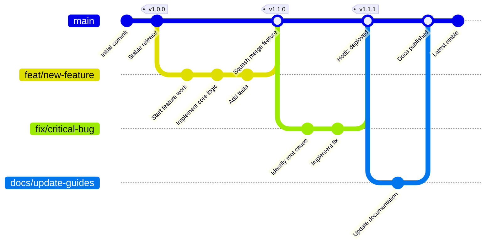
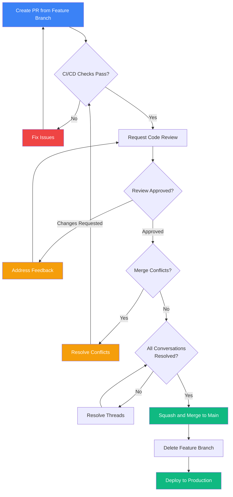
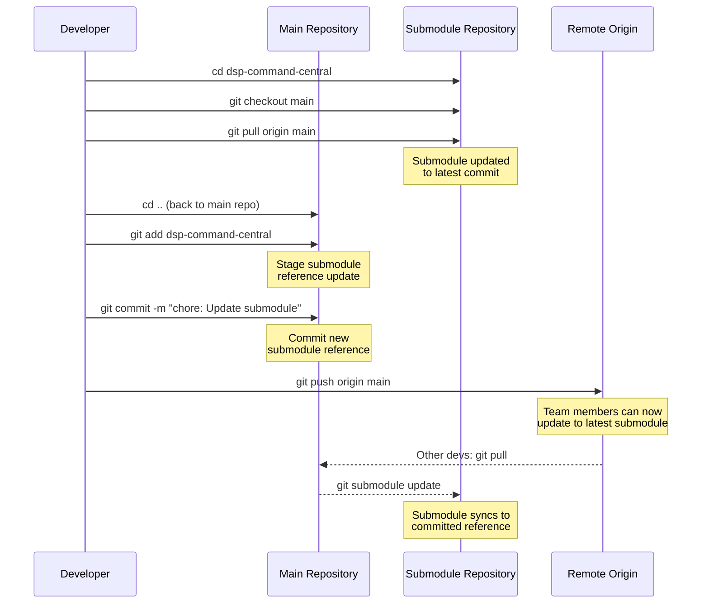

# Git Structure & Repository Organization

**Brookside BI Innovation Nexus** - Establish structured approaches to version control, branching strategy, and folder organization that support sustainable multi-team operations.

**Best for**: Teams requiring structured version control workflows with automated quality enforcement, consistent commit standards, and sustainable branching strategies that support multi-contributor operations while maintaining production stability.

**Generated**: 2025-10-26
**Status**: Operational Guide

---

## Table of Contents

1. [Branching Strategy](#branching-strategy)
2. [Repository Folder Structure](#repository-folder-structure)
3. [Commit Message Conventions](#commit-message-conventions)
4. [Branch Naming Conventions](#branch-naming-conventions)
5. [Pull Request Process](#pull-request-process)
6. [Submodule Management](#submodule-management)
7. [Repository Hooks](#repository-hooks)
8. [Git Workflow Examples](#git-workflow-examples)

---

## Branching Strategy

### Branch Hierarchy

**Establish clear separation of concerns through permanent and temporary branches:**

```
main (protected)                    # Production-ready code only
├── feat/*                          # New features
├── fix/*                           # Bug fixes
├── docs/*                          # Documentation updates
├── chore/*                         # Maintenance tasks
├── refactor/*                      # Code restructuring
└── release/*                       # Release preparation
```

**Visual Workflow: Git Branching Strategy**



*Figure 1: Git branching workflow showing feature development, hotfix, and documentation update patterns. All branches merge to main via squash merge to maintain linear history.*

### Branch Types & Purposes

| Branch Type | Prefix | Purpose | Lifetime | Example |
|-------------|--------|---------|----------|---------|
| **Production** | `main` | Stable, deployable code | Permanent | `main` |
| **Feature** | `feat/` | New functionality | Temporary | `feat/phase-3-autonomous-pipeline-and-repo-hooks` |
| **Documentation** | `docs/` | Documentation improvements | Temporary | `docs/update-complex-20251026-090604` |
| **Bug Fix** | `fix/` | Defect resolution | Temporary | `fix/notion-sync-queue-processing` |
| **Chore** | `chore/` | Maintenance, dependencies | Temporary | `chore/update-dependencies` |
| **Refactor** | `refactor/` | Code restructuring | Temporary | `refactor/agent-registry-optimization` |
| **Release** | `release/` | Release preparation | Temporary | `release/v2.0.0` |

### Branch Protection Rules

**Main Branch Protection** (`main`):
- ✅ Require pull request reviews (1 approver minimum)
- ✅ Require status checks to pass
- ✅ Require conversation resolution before merging
- ✅ Require linear history (no merge commits)
- ❌ No direct commits allowed
- ❌ No force pushes allowed
- ❌ No branch deletion allowed

**Feature Branch Guidelines**:
- Create from latest `main`
- Keep focused on single feature/fix
- Rebase regularly to stay current
- Delete after merge to main

---

## Repository Folder Structure

### Root Organization (Post-Consolidation)

```
Notion/
├── .archive/                       # Archived documentation (historical reference)
│   ├── assessments/               # Point-in-time analysis reports
│   ├── implementations/           # Completed initiative summaries
│   ├── phases/                    # Phase 1-3 completion documentation
│   ├── projects/                  # Archived project files
│   └── sessions/                  # Historical session summaries
│
├── .claude/                        # Claude Code agent configuration
│   ├── agents/                    # 38+ specialized agent specifications
│   ├── commands/                  # Slash command definitions
│   ├── data/                      # Agent state, sync queues, manifests
│   ├── docs/                      # Active technical documentation
│   ├── hooks/                     # Repository safety hooks
│   ├── logs/                      # Agent activity tracking
│   ├── scripts/                   # Automation utilities
│   ├── styles/                    # Output style definitions
│   ├── templates/                 # ADR, research, runbook templates
│   └── utils/                     # Helper scripts
│
├── .github/                        # GitHub-specific configuration
│   ├── workflows/                 # CI/CD pipelines
│   ├── ISSUE_TEMPLATE/            # Issue templates
│   └── pull_request_template.md  # PR template
│
├── autonomous-platform/            # Phase 3 autonomous build system
│   ├── agents/                    # Build-specific agents
│   ├── configs/                   # Platform configurations
│   └── templates/                 # Code generation templates
│
├── azure-functions/                # Azure Function implementations
│   ├── deployments/               # Deployment configurations
│   └── functions/                 # Function source code
│
├── brookside-repo-analyzer/        # Repository analysis tool
│   ├── azure_function/            # Azure Function wrapper
│   ├── deployment/                # Deployment artifacts
│   ├── docs/                      # Tool documentation
│   ├── src/                       # Python source code
│   └── tests/                     # Unit/integration tests
│
├── deployments/                    # Deployment configurations
│   └── kudu/                      # Kudu deployment artifacts
│
├── diagrams/                       # Architecture diagrams
│
├── docs/                           # User-facing documentation
│   ├── archive/                   # Historical documentation
│   │   ├── implementation/        # Phase summaries
│   │   ├── audits/                # Audit reports
│   │   ├── notion-setup/          # Batch setup guides
│   │   └── experiments/           # Experimental features
│   └── dsp/                       # DSP Command Central docs
│
├── dsp-command-central/            # Submodule: DSP integration (separate repo)
│
├── infrastructure/                 # Infrastructure as Code
│   ├── bicep/                     # Azure Bicep templates
│   ├── terraform/                 # Terraform configurations (if applicable)
│   └── docs/                      # Infrastructure documentation
│       ├── webhook-architecture.md
│       ├── apim-implementation-status.md
│       ├── deployment-checklist.md
│       └── repository-hooks.md
│
├── mcp-foundry/                    # MCP server development (separate repo, ignored)
│
├── notion-entries/                 # Notion database seed data
│
├── scripts/                        # PowerShell automation scripts
│   ├── Set-MCPEnvironment.ps1     # Environment configuration
│   ├── Get-KeyVaultSecret.ps1     # Secret retrieval
│   ├── Test-AzureMCP.ps1          # MCP connectivity testing
│   └── ...                        # Additional utilities
│
├── templates/                      # Project templates
│
├── README.md                       # Primary project overview
├── CLAUDE.md                       # Agent instructions (required)
├── GIT-STRUCTURE.md                # This document
├── QUICKSTART.md                   # Getting started guide
├── CONTRIBUTING.md                 # Contribution guidelines
├── CHANGELOG.md                    # Version history
├── TROUBLESHOOTING.md              # Support documentation
│
├── .gitignore                      # Git ignore rules
├── .gitmodules                     # Submodule configuration
└── package.json                    # Node.js dependencies (if applicable)
```

### Folder Purpose Matrix

| Directory | Purpose | Retention | Access Level |
|-----------|---------|-----------|--------------|
| `.archive/` | Historical documentation reference | Permanent | Public |
| `.claude/` | Agent configuration and automation | Active | Internal |
| `.github/` | GitHub workflows and templates | Active | Public |
| `autonomous-platform/` | Phase 3 build pipeline | Active | Internal |
| `azure-functions/` | Serverless function code | Active | Internal |
| `brookside-repo-analyzer/` | Repository analysis tool | Active | Internal |
| `deployments/` | Deployment artifacts | Active | Internal |
| `diagrams/` | Visual architecture documentation | Active | Public |
| `docs/` | User-facing documentation | Active | Public |
| `infrastructure/` | Infrastructure as Code | Active | Internal |
| `scripts/` | Automation utilities | Active | Internal |
| `templates/` | Reusable templates | Active | Public |

---

## Commit Message Conventions

### Conventional Commits Standard

**All commits MUST follow the Conventional Commits specification with Brookside BI brand voice:**

```
<type>(<scope>): <benefit-focused description>

[optional body: technical implementation details]

[optional footer: breaking changes, references]
```

### Commit Types

| Type | Purpose | Example |
|------|---------|---------|
| `feat` | New feature | `feat(research): Establish parallel swarm coordination for 4x faster viability assessment` |
| `fix` | Bug fix | `fix(notion-sync): Resolve queue processing deadlock through exponential backoff` |
| `docs` | Documentation | `docs(readme): Streamline quick start guide to reduce onboarding time` |
| `chore` | Maintenance | `chore(deps): Update Azure SDK to improve authentication reliability` |
| `refactor` | Code restructuring | `refactor(agents): Optimize registry queries to reduce MCP token usage by 40%` |
| `test` | Testing | `test(integration): Add end-to-end pipeline validation for deployment workflow` |
| `ci` | CI/CD changes | `ci(actions): Establish automated deployment validation with smoke tests` |
| `perf` | Performance | `perf(database): Implement connection pooling to support 10x concurrent users` |
| `style` | Code formatting | `style(typescript): Apply Prettier formatting across codebase` |
| `revert` | Revert previous commit | `revert: feat(webhook): Roll back APIM integration due to auth issues` |

### Commit Message Rules

**✅ DO**:
- Start with benefit/outcome: "Streamline," "Establish," "Improve," "Drive"
- Keep subject line ≤72 characters
- Use imperative mood: "Add" not "Added" or "Adds"
- Reference issue numbers: `Fixes #42`, `Closes #101`
- Include breaking change warnings: `BREAKING CHANGE:` in footer
- Apply Brookside BI brand voice (professional, solution-focused)

**❌ DON'T**:
- Use vague descriptions: "Update stuff," "Fix bug"
- Include emojis (automated hook will reject)
- Write commit novels (save for PR description)
- Skip scope when relevant: `feat: Add feature` → `feat(scope): Add feature`
- Use timeline language: "due Friday," "week 1"

### Examples (Good vs. Bad)

| ❌ Bad | ✅ Good |
|--------|---------|
| `feat: add caching` | `feat(api): Streamline data retrieval with distributed caching for improved performance` |
| `fix: bug in sync` | `fix(notion-sync): Resolve race condition in queue processing through mutex locking` |
| `docs: update readme` | `docs(quickstart): Establish 15-minute onboarding workflow to reduce setup time` |
| `chore: stuff` | `chore(deps): Update Azure Functions runtime to v4 for improved reliability` |

### Automated Validation

**Commit-MSG Hook Enforcement** ([.claude/hooks/commit-msg](.claude/hooks/commit-msg)):
- ✅ Validates Conventional Commits format
- ✅ Enforces Brookside BI brand voice keywords
- ✅ Checks subject line length (≤72 characters)
- ✅ Prevents emoji usage
- ❌ Rejects commits failing validation

---

## Branch Naming Conventions

### Standard Format

```
<type>/<descriptive-kebab-case-name>
```

### Branch Name Rules

**✅ Valid Examples**:
- `feat/phase-3-autonomous-pipeline-and-repo-hooks`
- `fix/notion-sync-queue-processing`
- `docs/update-complex-20251026-090604`
- `chore/update-azure-dependencies`
- `refactor/agent-registry-optimization`

**❌ Invalid Examples**:
- `feature123` (missing type prefix)
- `feat/Fix_Bug` (incorrect case)
- `feat/implement feature` (spaces instead of hyphens)
- `markus/working-branch` (personal prefix, use type prefix)

### Branch Lifetime Guidelines

| Branch Type | Max Age | Auto-Delete After Merge |
|-------------|---------|-------------------------|
| `feat/*` | 2 weeks | ✅ Yes |
| `fix/*` | 1 week | ✅ Yes |
| `docs/*` | 1 week | ✅ Yes |
| `chore/*` | 3 days | ✅ Yes |
| `refactor/*` | 2 weeks | ✅ Yes |
| `release/*` | Until release | ✅ Yes |
| `main` | Permanent | ❌ Never |

---

## Pull Request Process

### PR Creation Workflow

**1. Before Creating PR:**
```powershell
# Ensure branch is up-to-date
git checkout main
git pull origin main
git checkout your-feature-branch
git rebase main

# Run validation
.\scripts\validate-changes.ps1  # If available
git status
```

**2. Create PR with Template:**
- Use [.github/pull_request_template.md](.github/pull_request_template.md)
- Provide clear description of changes
- Link related issues: `Closes #42`, `Fixes #101`
- Include testing evidence (screenshots, test output)

**3. PR Review Checklist:**
- [ ] All CI/CD checks pass
- [ ] Code review approval received
- [ ] No merge conflicts with main
- [ ] All conversations resolved
- [ ] Documentation updated (if applicable)
- [ ] Tests added/updated (if applicable)
- [ ] Breaking changes documented

**Visual Workflow: Pull Request Review Process**



*Figure 2: PR review process flow from creation through merge. Automated checks, code review, and conflict resolution ensure production stability before deployment.*

### PR Title Format

Follow same conventions as commit messages:

```
<type>(<scope>): <benefit-focused description>
```

**Examples**:
- `feat(research): Establish parallel swarm coordination for 4x faster viability assessment`
- `fix(notion-sync): Resolve queue processing deadlock through exponential backoff`
- `docs(readme): Streamline quick start guide to reduce onboarding time`

### PR Description Template

```markdown
## Summary
Brief description of changes and business value.

## Changes
- Bulleted list of specific changes
- Technical implementation details
- Architecture decisions (if applicable)

## Testing
- [ ] Unit tests added/updated
- [ ] Integration tests pass
- [ ] Manual testing completed
- [ ] Edge cases validated

## Screenshots (if applicable)
Include visual evidence of changes.

## Related Issues
Closes #42
Fixes #101

## Breaking Changes
List any breaking changes and migration steps.

## Checklist
- [ ] Code follows Brookside BI brand guidelines
- [ ] Documentation updated
- [ ] Commit messages follow Conventional Commits
- [ ] All hooks pass (pre-commit, commit-msg)
- [ ] No secrets or credentials committed
```

### Merge Strategy

**Squash and Merge (Recommended)**:
- Combine all commits into single commit on main
- Keeps main history clean and linear
- Preserves detailed commit history in feature branch

**Rebase and Merge (Alternative)**:
- Preserve individual commits from feature branch
- Use for large features with logical commit progression
- Requires clean commit history before merge

**❌ Never Use Merge Commits**:
- Creates non-linear history
- Makes bisecting and rollback difficult
- Violates branch protection rules

---

## Submodule Management

### Active Submodules

| Submodule | Repository | Purpose | Update Frequency |
|-----------|------------|---------|------------------|
| `dsp-command-central` | `markus41/dsp-command-central` | DSP integration and command routing | Weekly |

### Submodule Operations

**Initialize Submodules (First Clone):**
```powershell
git clone https://github.com/markus41/Notion.git
cd Notion
git submodule update --init --recursive
```

**Update Submodule to Latest:**
```powershell
# Update dsp-command-central to latest commit
cd dsp-command-central
git checkout main
git pull origin main
cd ..

# Commit submodule reference update
git add dsp-command-central
git commit -m "chore: Update dsp-command-central submodule reference"
git push
```

**Update All Submodules:**
```powershell
git submodule update --remote --recursive
git add .
git commit -m "chore: Update all submodule references to latest versions"
git push
```

**Visual Workflow: Submodule Update Process**



*Figure 3: Submodule update workflow showing developer updating submodule, committing reference change, and team synchronization process.*

**Remove Submodule (if needed):**
```powershell
# 1. Deinitialize
git submodule deinit -f dsp-command-central

# 2. Remove from .git/modules
Remove-Item -Recurse -Force .git/modules/dsp-command-central

# 3. Remove from working tree
git rm -f dsp-command-central

# 4. Commit removal
git commit -m "chore: Remove dsp-command-central submodule"
```

### Submodule Best Practices

**✅ DO**:
- Update submodules weekly to stay current
- Test submodule changes before committing reference
- Document submodule purpose in this file
- Use HTTPS URLs for public submodules
- Pin to specific commits for stability

**❌ DON'T**:
- Commit submodule reference without testing
- Modify submodule code directly (use separate clone)
- Force push submodule changes
- Use SSH URLs (limits public accessibility)

---

## Repository Hooks

### Active Hooks

**Establish comprehensive quality enforcement through 3-layer hook system:**

| Hook | Location | Purpose | Impact |
|------|----------|---------|--------|
| **pre-commit** | [.claude/hooks/pre-commit](.claude/hooks/pre-commit) | Secret detection, file validation, Jupyter sanitization | Prevents credential leaks, enforces file size limits |
| **commit-msg** | [.claude/hooks/commit-msg](.claude/hooks/commit-msg) | Conventional Commits validation, brand voice enforcement | Ensures consistent commit quality |
| **post-commit** (optional) | [.claude/hooks/post-commit](.claude/hooks/post-commit) | Agent activity logging | Tracks automated work for analytics |

### Hook Installation

**Automatic (Recommended):**
```powershell
# Run installation script
.\scripts\Install-RepositoryHooks.ps1

# Verify installation
git config --get core.hooksPath
# Output: .claude/hooks
```

**Manual:**
```powershell
# Set hooks directory
git config core.hooksPath .claude/hooks

# Make hooks executable (Git Bash on Windows)
chmod +x .claude/hooks/pre-commit
chmod +x .claude/hooks/commit-msg
```

### Hook Bypass (Emergency Only)

**Use `--no-verify` flag to skip hooks:**
```powershell
# Skip pre-commit and commit-msg hooks
git commit -m "emergency fix" --no-verify

# ⚠️ WARNING: Only use in emergencies
# ⚠️ Manual review required before push
```

**When to Bypass**:
- Emergency hotfixes requiring immediate deployment
- CI/CD automated commits (bots)
- Migration/bulk operations with verified content

**Never Bypass For**:
- Regular development work
- Avoiding commit message standards
- Skipping secret detection
- Convenience

---

## Git Workflow Examples

### Feature Development (Standard)

```powershell
# 1. Create feature branch from main
git checkout main
git pull origin main
git checkout -b feat/parallel-research-swarm

# 2. Make changes and commit (hook validation automatic)
git add .
git commit -m "feat(research): Establish parallel swarm coordination for 4x faster viability assessment"

# 3. Push to remote
git push -u origin feat/parallel-research-swarm

# 4. Create Pull Request on GitHub
# - Use PR template
# - Link related issues
# - Request review

# 5. Address review feedback
git add .
git commit -m "refactor(research): Optimize agent communication for reduced latency"
git push

# 6. After approval, squash and merge via GitHub UI

# 7. Cleanup local branch
git checkout main
git pull origin main
git branch -d feat/parallel-research-swarm
```

### Documentation Update (Fast Track)

```powershell
# 1. Create docs branch
git checkout -b docs/update-quickstart-guide

# 2. Make changes
# Edit QUICKSTART.md

# 3. Commit with docs type
git add QUICKSTART.md
git commit -m "docs(quickstart): Streamline installation steps to reduce onboarding time"

# 4. Push and create PR
git push -u origin docs/update-quickstart-guide

# 5. Merge after review
# 6. Delete branch after merge
```

### Hotfix (Emergency)

```powershell
# 1. Create fix branch from main
git checkout main
git pull origin main
git checkout -b fix/notion-sync-critical-error

# 2. Implement fix
# Make minimal changes to resolve issue

# 3. Test thoroughly
.\scripts\Test-NotionSync.ps1

# 4. Commit with fix type
git add .
git commit -m "fix(notion-sync): Resolve queue processing deadlock through exponential backoff"

# 5. Push and create PR (expedited review)
git push -u origin fix/notion-sync-critical-error

# 6. After approval, merge immediately
# 7. Monitor production deployment
```

### Rebase Workflow (Keep Current)

```powershell
# While working on long-running feature branch
git checkout feat/autonomous-deployment

# 1. Fetch latest main
git fetch origin main

# 2. Rebase onto main (resolve conflicts if any)
git rebase origin/main

# 3. If conflicts occur:
# - Resolve conflicts in files
git add <resolved-files>
git rebase --continue

# 4. Force push (only on feature branches, never main)
git push --force-with-lease origin feat/autonomous-deployment
```

### Collaborative Feature (Multiple Contributors)

```powershell
# Person A creates branch
git checkout -b feat/apim-integration
git push -u origin feat/apim-integration

# Person B starts working
git fetch origin
git checkout feat/apim-integration

# Person B makes changes
git add .
git commit -m "feat(apim): Add authentication middleware for secure API access"
git pull --rebase  # Get Person A's latest changes
git push

# Person A pulls Person B's changes
git pull --rebase
# Continue collaboration until feature complete
```

---

## Success Metrics

**You're driving sustainable git practices when:**

- ✅ All commits pass pre-commit and commit-msg hooks
- ✅ Main branch contains only squashed, reviewed commits
- ✅ Feature branches deleted within 1 week of merge
- ✅ Commit messages follow Conventional Commits with brand voice
- ✅ No force pushes to protected branches (main)
- ✅ PR descriptions provide clear context and testing evidence
- ✅ Submodules updated weekly and reference commits validated
- ✅ Zero credential leaks detected in commit history
- ✅ Linear git history maintained (no merge commits)
- ✅ All PRs include documentation updates when applicable

---

## Troubleshooting

### Hook Failures

**Issue**: Pre-commit hook detects secrets
```powershell
# 1. Review detected pattern
cat .git/hooks/pre-commit.log

# 2. Remove secret from staged files
git reset HEAD <file-with-secret>

# 3. Move secret to Azure Key Vault
.\scripts\Set-KeyVaultSecret.ps1 -SecretName "api-key" -SecretValue "value"

# 4. Update code to retrieve from Key Vault
# 5. Re-stage and commit
git add .
git commit -m "fix(security): Migrate API key to Azure Key Vault for secure storage"
```

**Issue**: Commit-msg hook rejects message
```powershell
# View rejection reason
cat .git/COMMIT_EDITMSG.reject

# Common fixes:
# - Add type prefix: feat/fix/docs/chore
# - Reduce subject line to ≤72 characters
# - Use Brookside BI brand voice keywords
# - Remove emojis

# Amend commit message
git commit --amend
```

### Merge Conflicts

**Issue**: Rebase creates conflicts
```powershell
# 1. View conflicting files
git status

# 2. Open files and resolve conflicts
# Look for <<<<<<< HEAD markers

# 3. After resolving
git add <resolved-files>
git rebase --continue

# 4. If stuck, abort rebase
git rebase --abort
```

### Submodule Issues

**Issue**: Submodule out of sync
```powershell
# 1. Check submodule status
git submodule status

# 2. Update to committed reference
git submodule update --init --recursive

# 3. If still broken, re-clone
Remove-Item -Recurse -Force dsp-command-central
git submodule update --init --recursive
```

---

## Additional Resources

**Documentation**:
- [Contributing Guidelines](CONTRIBUTING.md) - Contribution process
- [Repository Hooks](.claude/docs/repository-hooks.md) - Hook architecture
- [Troubleshooting Guide](TROUBLESHOOTING.md) - Common issues and solutions

**External References**:
- [Conventional Commits](https://www.conventionalcommits.org/) - Commit message standard
- [GitHub Flow](https://guides.github.com/introduction/flow/) - Branching workflow
- [Git Submodules](https://git-scm.com/book/en/v2/Git-Tools-Submodules) - Submodule management

---

**Brookside BI Innovation Nexus** - *Establishing structured git practices to support sustainable multi-team operations*

**Contact**: Consultations@BrooksideBI.com | +1 209 487 2047

**Last Updated**: 2025-10-26
