# Quick Start Guide - Brookside BI Innovation Nexus

**Objective**: Get productive with Innovation Nexus in 15 minutes

This guide establishes rapid onboarding to streamline innovation workflows through structured setup procedures that drive measurable outcomes from concept to deployment.

**Best for**: New team members requiring immediate productivity, developers setting up local environments, and teams validating system access.

## Table of Contents

- [Prerequisites Checklist](#prerequisites-checklist)
- [5-Minute Setup](#5-minute-setup)
- [First Notion Query (Milestone 1)](#first-notion-query-milestone-1)
- [Common Commands to Try](#common-commands-to-try)
- [Verify Full System Access](#verify-full-system-access)
- [Troubleshooting Quick Tips](#troubleshooting-quick-tips)
- [Next Steps](#next-steps)

---

## Prerequisites Checklist

Before starting, verify you have:

- [ ] **Azure CLI** - Version 2.50.0 or higher
  ```bash
  az --version
  # If not installed: https://docs.microsoft.com/cli/azure/install-azure-cli
  ```

- [ ] **Node.js** - Version 18.0.0 or higher
  ```bash
  node --version
  # If not installed: https://nodejs.org/
  ```

- [ ] **Git** - Any recent version
  ```bash
  git --version
  ```

- [ ] **PowerShell** - Version 7.0 or higher (Windows users)
  ```bash
  pwsh --version
  # If not installed: https://docs.microsoft.com/powershell/scripting/install/installing-powershell
  ```

- [ ] **Claude Code** - Latest version installed
  - Download: [claude.ai/code](https://claude.ai/code)

- [ ] **Access Permissions**:
  - Azure subscription access (cfacbbe8-a2a3-445f-a188-68b3b35f0c84)
  - Azure Key Vault "Key Vault Secrets User" role
  - Notion workspace access (Brookside BI)
  - GitHub organization membership (brookside-bi)

---

## 5-Minute Setup

**Visual Overview: Complete Setup Workflow**


*Figure 1: Complete setup workflow from repository clone to operational status in 5 minutes. MCP OAuth happens automatically on first launch.*

### Step 1: Clone Repository (1 minute)

```bash
# Clone the repository
git clone https://github.com/brookside-bi/notion.git

# Navigate to project directory
cd notion

# Verify structure
ls -la
```

**Expected Output**: You should see `.claude/`, `docs/`, `scripts/`, `CLAUDE.md`, and other project files.

### Step 2: Azure Authentication (2 minutes)

```bash
# Login to Azure (opens browser)
az login

# Verify authentication succeeded
az account show

# Expected output includes:
# {
#   "id": "cfacbbe8-a2a3-445f-a188-68b3b35f0c84",
#   "name": "Azure subscription 1",
#   "tenantId": "2930489e-9d8a-456b-9de9-e4787faeab9c",
#   "state": "Enabled",
#   "isDefault": true
# }
```

**Verification**:
```bash
# Test Key Vault access
az keyvault secret list --vault-name kv-brookside-secrets

# If successful, you'll see list of secrets
```

### Step 3: Configure MCP Environment (2 minutes)

**Windows (PowerShell)**:
```powershell
# Navigate to project directory
cd C:\path\to\notion

# Configure all MCP environment variables from Key Vault
.\scripts\Set-MCPEnvironment.ps1

# Expected output:
# ✓ Retrieved GitHub PAT
# ✓ Environment variables configured
# ✓ Ready to launch Claude Code
```

**macOS/Linux (Bash)**:
```bash
# Navigate to project directory
cd ~/path/to/notion

# Manually retrieve GitHub PAT
export GITHUB_PERSONAL_ACCESS_TOKEN=$(az keyvault secret show \
  --vault-name kv-brookside-secrets \
  --name github-personal-access-token \
  --query value \
  --output tsv)

# Verify configured
echo $GITHUB_PERSONAL_ACCESS_TOKEN | head -c 10
```

---

## First Notion Query (Milestone 1)

**Goal**: Execute your first successful Notion MCP operation

### Step 4: Launch Claude Code

```bash
# From project directory
claude

# Claude Code opens in current directory
# MCP servers auto-connect on startup
```

### Step 5: Verify MCP Connections

In Claude Code, run:

```bash
# Check all MCP server status
claude mcp list
```

**Expected Output**:
```
✓ notion: Connected
  Workspace: Brookside BI (81686779-099a-8195-b49e-00037e25c23e)

✓ github: Connected
  Authentication: PAT configured

✓ azure: Connected
  Subscription: Azure subscription 1

✓ playwright: Connected
  Browser: Microsoft Edge (headless)
```

**Visual Flow: MCP Connection Sequence**

```mermaid
sequenceDiagram
    participant User as User
    participant Claude as Claude Code
    participant Notion as Notion MCP
    participant GitHub as GitHub MCP
    participant Azure as Azure MCP
    participant Browser as Web Browser

    User->>Claude: Launch Claude Code
    Claude->>Notion: Initialize connection
    Notion-->>Claude: Check authentication

    alt Not Authenticated
        Notion->>Browser: Open OAuth flow
        Browser->>User: Notion login page
        User->>Browser: Enter credentials
        Browser->>Notion: Grant access
        Notion-->>Claude: ✓ Connected
    else Already Authenticated
        Notion-->>Claude: ✓ Connected
    end

    Claude->>GitHub: Initialize with PAT
    GitHub-->>Claude: ✓ Connected

    Claude->>Azure: Initialize with Azure CLI
    Azure-->>Claude: ✓ Connected

    Claude-->>User: All MCP servers ready

    Note over User,Azure: Ready for first Notion query
```



*Figure 2: MCP server connection sequence showing automatic OAuth flow for Notion and credential-based authentication for GitHub and Azure.*

**If Notion shows "Not authenticated"**:
1. Claude Code will automatically trigger OAuth browser flow
2. Login to your Notion account
3. Grant workspace access
4. Return to Claude Code (connection auto-completes)

### Step 6: First Notion Search

In Claude Code, try this command:

```
Search the Ideas Registry database for ideas related to Azure
```

**What happens**:
1. Claude Code engages @ideas-capture or @notion-mcp-specialist agent
2. Agent uses Notion MCP to search database
3. Results display with idea titles, viability scores, and champions

**Expected Response**:
```
Found 3 ideas in Ideas Registry:

1. "Azure OpenAI Integration"
   - Status: Active
   - Viability: High
   - Champion: Markus Ahling
   - URL: https://notion.so/...

2. "Automated Azure Cost Dashboard"
   - Status: Concept
   - Viability: Needs Research
   - Champion: Brad Wright
   - URL: https://notion.so/...

[Additional results...]
```

**Success Milestone**: If you see search results, you're fully operational!

---

## Common Commands to Try

Now that you're connected, try these operations to explore capabilities:

### Innovation Management

```bash
# Create a new idea
/innovation:new-idea Automated reporting dashboard for Power BI insights

# Search for existing research
Search Research Hub for machine learning projects

# Check monthly software costs
/cost:monthly-spend
```

### Repository Operations

```bash
# Analyze a repository
/repo:analyze cost-dashboard-mvp --sync

# List organization repositories
Search GitHub for repositories in brookside-bi organization
```

### Azure Operations

```bash
# List resource groups
List all Azure resource groups in subscription

# Check Key Vault secrets
List secrets in kv-brookside-secrets

# Query Application Insights
Get recent errors from cost-dashboard Application Insights
```

### Knowledge Management

```bash
# Search Knowledge Vault
Search Knowledge Vault for Power BI best practices

# Archive completed build
/knowledge:archive "Cost Dashboard MVP" build
```

---

## Verify Full System Access

Run this comprehensive test to verify all integrations:

### Test 1: Notion Access

```
Fetch the Ideas Registry database and show schema
```

**Expected**: Database structure with properties (Idea Title, Status, Viability, Champion, etc.)

### Test 2: GitHub Access

```
List the 5 most recently updated repositories in brookside-bi organization
```

**Expected**: Repository list with names, descriptions, and update dates

### Test 3: Azure Key Vault

```powershell
# In PowerShell (outside Claude Code)
.\scripts\Get-KeyVaultSecret.ps1 -SecretName "github-personal-access-token"
```

**Expected**: Secret value retrieved successfully

### Test 4: Azure Resources

```
List all resource groups in Azure subscription
```

**Expected**: Resource group names and locations

### Test 5: Agent System

```
@cost-analyst Show total monthly software spend
```

**Expected**: Agent responds with cost breakdown from Software & Cost Tracker

---

## Troubleshooting Quick Tips

**Visual Guide: Troubleshooting Decision Tree**


*Figure 3: Troubleshooting decision tree for common MCP server issues. Follow the path for your specific problem to reach operational status.*

### Issue: Notion MCP Not Connected

**Quick Fix**:
1. Restart Claude Code completely
2. Browser OAuth flow should trigger automatically
3. If no browser opens, check popup blockers
4. Grant workspace access when prompted
5. Return to Claude Code (auto-reconnects)

### Issue: GitHub PAT Not Configured

**Quick Fix**:
```powershell
# Re-run environment setup
.\scripts\Set-MCPEnvironment.ps1

# Verify token set
$env:GITHUB_PERSONAL_ACCESS_TOKEN
# Should show: ghp_...

# Restart Claude Code
```

### Issue: Azure CLI Not Authenticated

**Quick Fix**:
```bash
# Re-authenticate
az login

# Set correct subscription
az account set --subscription "cfacbbe8-a2a3-445f-a188-68b3b35f0c84"

# Verify
az account show
```

### Issue: Key Vault Access Denied

**Quick Fix**:
1. Verify you have "Key Vault Secrets User" role
2. Contact Azure administrator if permissions needed
3. Check role assignment:
   ```bash
   az role assignment list --assignee <your-email>
   ```

### Issue: MCP Server Timeout

**Quick Fix**:
1. Close Claude Code
2. Check network connectivity: `ping github.com`
3. Restart Claude Code
4. Run `claude mcp list` to verify connections

---

## Next Steps

Now that you're operational, explore these workflows:

### Learn Innovation Management

1. **Read the Complete Guide**: [CLAUDE.md](CLAUDE.md)
   - Notion database architecture
   - Innovation lifecycle workflows
   - Team specializations

2. **Review Agent Directory**: [.claude/agents/](.claude/agents/)
   - @ideas-capture - Capture new ideas
   - @cost-analyst - Analyze spending
   - @build-architect - Create builds

3. **Explore Slash Commands**: [SLASH_COMMANDS_SUMMARY.md](SLASH_COMMANDS_SUMMARY.md)
   - `/innovation:new-idea` - Capture ideas
   - `/cost:analyze` - Review costs
   - `/team:assign` - Assign work

### Create Your First Idea

```
/innovation:new-idea [Your innovation concept]
```

Follow the prompts to:
- Add description and context
- Assign champion (yourself or team member)
- Estimate effort and impact
- Link required software/tools

### Explore Architectural Patterns

Review enterprise patterns in [.claude/docs/patterns/](.claude/docs/patterns/):
- Circuit-Breaker for resilient integrations
- Retry with Exponential Backoff for transient failures
- Saga Pattern for distributed transactions
- Event Sourcing for audit trails

### Set Up Your Environment

**Optional but recommended**:

1. **Configure Git**:
   ```bash
   git config --global user.name "Your Name"
   git config --global user.email "your.email@brooksidebi.com"
   ```

2. **Create Personal Settings**: [.claude/settings.local.json](.claude/settings.local.json)
   - Add notification hooks
   - Configure permissions
   - Set preferences

3. **Install Repository Hooks** (for contributors):
   ```bash
   # Install quality gates and safety controls
   # See HOOKS-INSTALLATION-COMPLETE.md for details
   ```

---

## Quick Reference Commands

**Most Used Operations**:

```bash
# Innovation
/innovation:new-idea [description]
/innovation:start-research [topic] [idea-name]

# Cost Management
/cost:monthly-spend
/cost:analyze active
/cost:unused-software

# Knowledge
/knowledge:archive [item-name] [database]

# Team
/team:assign [work-description] [database]

# Repository Analysis
/repo:scan-org --sync
/repo:analyze [repo-name] --sync

# Agent Invocation
@ideas-capture [idea description]
@cost-analyst [cost question]
@build-architect [build task]
```

---

## Verification Checklist

Before you're done, verify:

- [ ] Azure CLI authenticated successfully
- [ ] All 4 MCP servers connected (notion, github, azure, playwright)
- [ ] First Notion search completed
- [ ] GitHub PAT environment variable configured
- [ ] Key Vault secret retrieval works
- [ ] At least one slash command executed successfully
- [ ] Claude Code agent system responding

**If all checked**: You're ready to drive measurable outcomes through Innovation Nexus!

---

## Additional Resources

- **Complete Documentation**: [CLAUDE.md](CLAUDE.md)
- **API References**: [docs/api/](docs/api/)
  - [Notion MCP](docs/api/notion-mcp.md)
  - [GitHub MCP](docs/api/github-mcp.md)
  - [Azure MCP](docs/api/azure-mcp.md)
  - [Playwright MCP](docs/api/playwright-mcp.md)
- **Troubleshooting Guide**: [TROUBLESHOOTING.md](TROUBLESHOOTING.md)
- **Contributing Guide**: [CONTRIBUTING.md](CONTRIBUTING.md)
- **Changelog**: [CHANGELOG.md](CHANGELOG.md)

---

## Support

Need help?

- **Review Troubleshooting**: [TROUBLESHOOTING.md](TROUBLESHOOTING.md)
- **Engage Specialist Agent**: `@notion-mcp-specialist` or `@integration-specialist`
- **Contact Team**: Consultations@BrooksideBI.com | +1 209 487 2047

---

**Best for**: Teams requiring rapid onboarding to Innovation Nexus with zero-to-productive setup procedures that establish full system access and operational readiness in minimal time.

🤖 Generated with [Claude Code](https://claude.com/claude-code)
